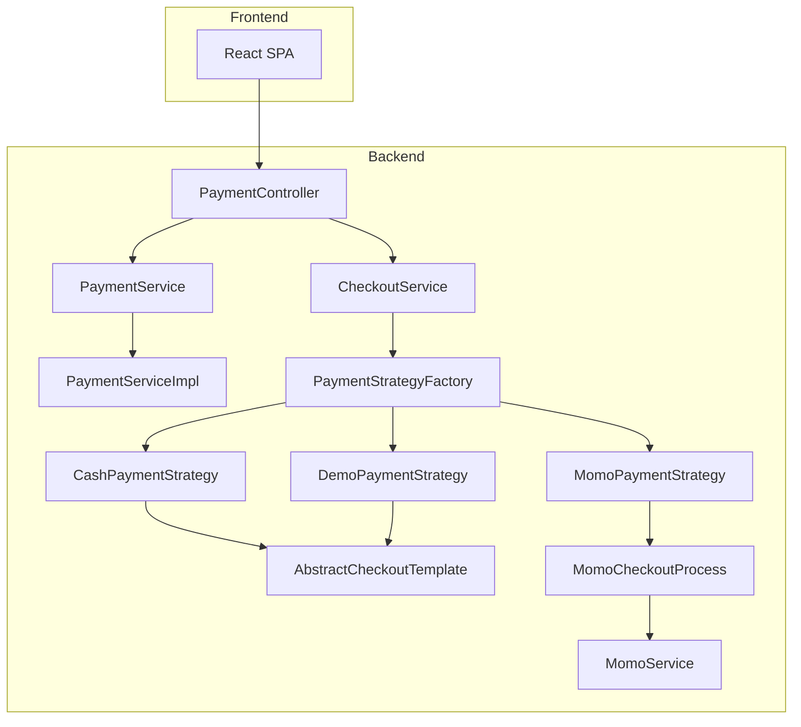
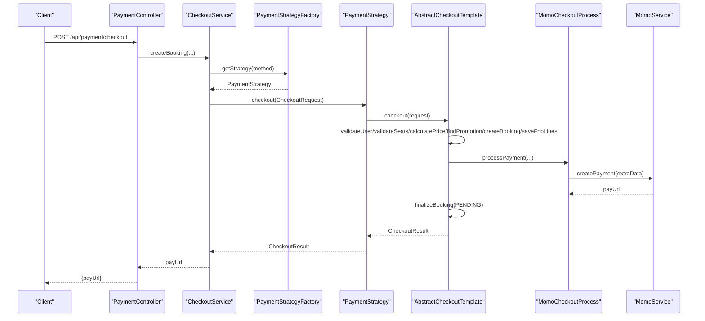
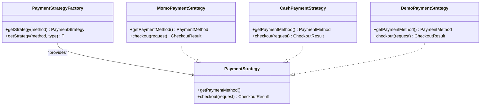
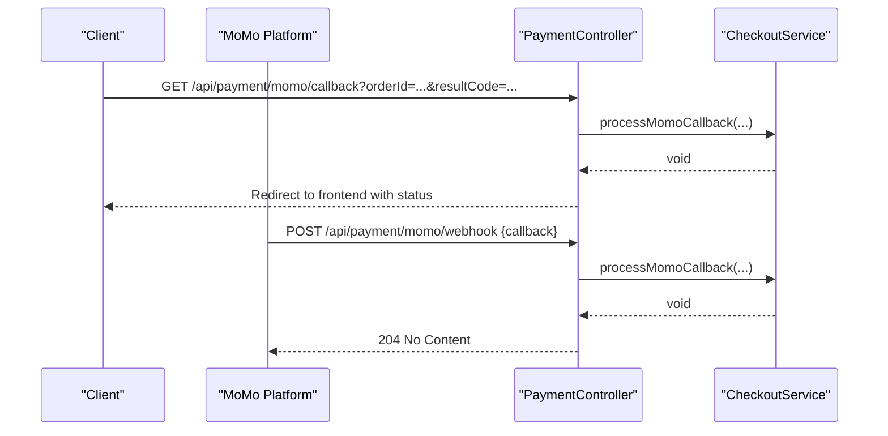
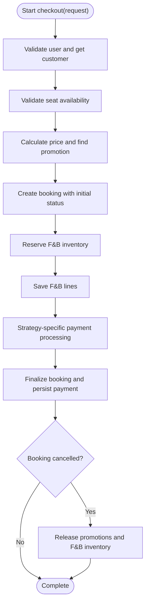
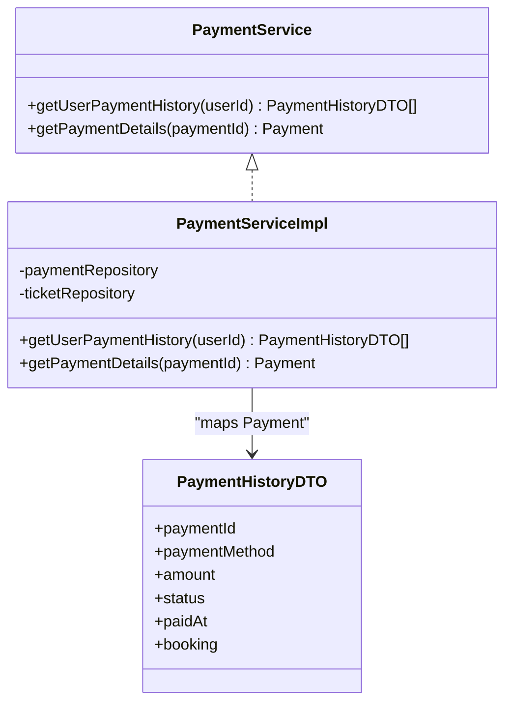
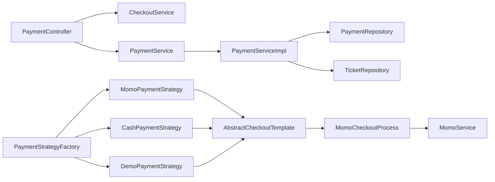

# Payment Processing

<cite>
**Referenced Files in This Document**
- [PaymentController.java](file://backend/src/main/java/com/cinema/booking/controllers/PaymentController.java)
- [PaymentService.java](file://backend/src/main/java/com/cinema/booking/services/PaymentService.java)
- [PaymentServiceImpl.java](file://backend/src/main/java/com/cinema/booking/services/impl/PaymentServiceImpl.java)
- [PaymentStrategy.java](file://backend/src/main/java/com/cinema/booking/services/payment/PaymentStrategy.java)
- [PaymentStrategyFactory.java](file://backend/src/main/java/com/cinema/booking/services/payment/PaymentStrategyFactory.java)
- [MomoPaymentStrategy.java](file://backend/src/main/java/com/cinema/booking/services/payment/MomoPaymentStrategy.java)
- [CashPaymentStrategy.java](file://backend/src/main/java/com/cinema/booking/services/payment/CashPaymentStrategy.java)
- [DemoPaymentStrategy.java](file://backend/src/main/java/com/cinema/booking/services/payment/DemoPaymentStrategy.java)
- [AbstractCheckoutTemplate.java](file://backend/src/main/java/com/cinema/booking/services/template_method/checkout/AbstractCheckoutTemplate.java)
- [MomoCheckoutProcess.java](file://backend/src/main/java/com/cinema/booking/services/template_method/checkout/MomoCheckoutProcess.java)
- [MomoService.java](file://backend/src/main/java/com/cinema/booking/services/MomoService.java)
- [MomoCallbackRequest.java](file://backend/src/main/java/com/cinema/booking/dtos/MomoCallbackRequest.java)
- [CheckoutRequestDTO.java](file://backend/src/main/java/com/cinema/booking/dtos/CheckoutRequestDTO.java)
- [CheckoutResult.java](file://backend/src/main/java/com/cinema/booking/dtos/CheckoutResult.java)
- [Payment.java](file://backend/src/main/java/com/cinema/booking/entities/Payment.java)
- [Booking.java](file://backend/src/main/java/com/cinema/booking/entities/Booking.java)
- [Ticket.java](file://backend/src/main/java/com/cinema/booking/entities/Ticket.java)
- [PaymentHistoryDTO.java](file://backend/src/main/java/com/cinema/booking/dtos/PaymentHistoryDTO.java)
- [application.properties](file://backend/src/main/resources/application.properties)
</cite>

## Table of Contents
1. [Introduction](#introduction)
2. [Project Structure](#project-structure)
3. [Core Components](#core-components)
4. [Architecture Overview](#architecture-overview)
5. [Detailed Component Analysis](#detailed-component-analysis)
6. [Dependency Analysis](#dependency-analysis)
7. [Performance Considerations](#performance-considerations)
8. [Troubleshooting Guide](#troubleshooting-guide)
9. [Conclusion](#conclusion)
10. [Appendices](#appendices)

## Introduction
This document explains the payment processing system for the cinema booking application. It covers the strategy pattern implementation for multiple payment methods (MoMo, cash, demo), MoMo payment integration with redirect callback and server-to-server webhook handling, payment validation workflows, transaction status tracking, and failure handling. It also documents the payment service implementation, payment method factory, payment processing orchestration, and payment result mapping. Finally, it outlines frontend integration points, real-time status updates, security and PCI considerations, and testing and deployment guidance.

## Project Structure
The payment system spans controllers, services, DTOs, entities, and template-method checkout processes:
- Controllers expose payment endpoints for checkout, callbacks, webhooks, and history retrieval.
- Services encapsulate payment history queries and checkout orchestration via strategy and template method.
- Strategies define per-payment-method checkout flows.
- Template methods implement shared checkout steps and delegate payment-specific logic.
- DTOs model requests, responses, and payment history data.
- Entities represent bookings, payments, and related domain objects.



**Diagram sources**
- [PaymentController.java:31-100](file://backend/src/main/java/com/cinema/booking/controllers/PaymentController.java#L31-L100)
- [PaymentStrategyFactory.java:13-48](file://backend/src/main/java/com/cinema/booking/services/payment/PaymentStrategyFactory.java#L13-L48)
- [MomoPaymentStrategy.java:8-26](file://backend/src/main/java/com/cinema/booking/services/payment/MomoPaymentStrategy.java#L8-L26)
- [CashPaymentStrategy.java:17-39](file://backend/src/main/java/com/cinema/booking/services/payment/CashPaymentStrategy.java#L17-L39)
- [DemoPaymentStrategy.java:13-35](file://backend/src/main/java/com/cinema/booking/services/payment/DemoPaymentStrategy.java#L13-L35)
- [AbstractCheckoutTemplate.java:53-95](file://backend/src/main/java/com/cinema/booking/services/template_method/checkout/AbstractCheckoutTemplate.java#L53-L95)
- [MomoCheckoutProcess.java:18-69](file://backend/src/main/java/com/cinema/booking/services/template_method/checkout/MomoCheckoutProcess.java#L18-L69)
- [PaymentServiceImpl.java:14-68](file://backend/src/main/java/com/cinema/booking/services/impl/PaymentServiceImpl.java#L14-L68)

**Section sources**
- [PaymentController.java:16-149](file://backend/src/main/java/com/cinema/booking/controllers/PaymentController.java#L16-L149)
- [PaymentStrategyFactory.java:10-48](file://backend/src/main/java/com/cinema/booking/services/payment/PaymentStrategyFactory.java#L10-L48)
- [AbstractCheckoutTemplate.java:17-181](file://backend/src/main/java/com/cinema/booking/services/template_method/checkout/AbstractCheckoutTemplate.java#L17-L181)

## Core Components
- PaymentController: Exposes endpoints for checkout, MoMo redirect callback, MoMo webhook, payment history, payment details, and staff cash checkout.
- PaymentStrategyFactory: Registry and lookup for payment strategies keyed by PaymentMethod.
- PaymentStrategy implementations:
  - MomoPaymentStrategy: Delegates to MomoCheckoutProcess.
  - CashPaymentStrategy: Delegates to StaffCashCheckoutProcess.
  - DemoPaymentStrategy: Delegates to DemoCheckoutProcess.
- AbstractCheckoutTemplate: Defines the checkout workflow with hooks for payment-specific behavior.
- MomoCheckoutProcess: Implements MoMo-specific checkout steps, including payment creation and pending payment persistence.
- PaymentService and PaymentServiceImpl: Provide user payment history and payment details retrieval.
- MomoService: Integrates with MoMo APIs for payment creation and confirmation.
- DTOs and Entities: Model checkout requests/results, MoMo callback data, payment records, and booking/ticket entities.

**Section sources**
- [PaymentController.java:31-148](file://backend/src/main/java/com/cinema/booking/controllers/PaymentController.java#L31-L148)
- [PaymentStrategyFactory.java:13-48](file://backend/src/main/java/com/cinema/booking/services/payment/PaymentStrategyFactory.java#L13-L48)
- [MomoPaymentStrategy.java:8-26](file://backend/src/main/java/com/cinema/booking/services/payment/MomoPaymentStrategy.java#L8-L26)
- [CashPaymentStrategy.java:17-39](file://backend/src/main/java/com/cinema/booking/services/payment/CashPaymentStrategy.java#L17-L39)
- [DemoPaymentStrategy.java:13-35](file://backend/src/main/java/com/cinema/booking/services/payment/DemoPaymentStrategy.java#L13-L35)
- [AbstractCheckoutTemplate.java:53-181](file://backend/src/main/java/com/cinema/booking/services/template_method/checkout/AbstractCheckoutTemplate.java#L53-L181)
- [MomoCheckoutProcess.java:18-69](file://backend/src/main/java/com/cinema/booking/services/template_method/checkout/MomoCheckoutProcess.java#L18-L69)
- [PaymentService.java:7-10](file://backend/src/main/java/com/cinema/booking/services/PaymentService.java#L7-L10)
- [PaymentServiceImpl.java:14-68](file://backend/src/main/java/com/cinema/booking/services/impl/PaymentServiceImpl.java#L14-L68)

## Architecture Overview
The payment system uses Strategy and Template Method patterns to separate payment method specifics from shared checkout logic. The controller delegates to CheckoutService, which selects the appropriate PaymentStrategy via PaymentStrategyFactory. The strategy delegates to a template method that enforces validations, calculates prices, reserves inventory, and finalizes the booking with payment-specific actions.



**Diagram sources**
- [PaymentController.java:33-51](file://backend/src/main/java/com/cinema/booking/controllers/PaymentController.java#L33-L51)
- [PaymentStrategyFactory.java:33-39](file://backend/src/main/java/com/cinema/booking/services/payment/PaymentStrategyFactory.java#L33-L39)
- [AbstractCheckoutTemplate.java:53-95](file://backend/src/main/java/com/cinema/booking/services/template_method/checkout/AbstractCheckoutTemplate.java#L53-L95)
- [MomoCheckoutProcess.java:46-68](file://backend/src/main/java/com/cinema/booking/services/template_method/checkout/MomoCheckoutProcess.java#L46-L68)
- [MomoService.java](file://backend/src/main/java/com/cinema/booking/services/MomoService.java)

## Detailed Component Analysis

### Payment Strategy Pattern Implementation
The system defines a PaymentStrategy interface and three concrete strategies:
- MomoPaymentStrategy: Uses MomoCheckoutProcess to create a PENDING booking and persist a PENDING payment.
- CashPaymentStrategy: Delegates to StaffCashCheckoutProcess for immediate CONFIRMED booking and CASH payment.
- DemoPaymentStrategy: Delegates to DemoCheckoutProcess for demo checkout without external calls.



**Diagram sources**
- [PaymentStrategy.java:9-14](file://backend/src/main/java/com/cinema/booking/services/payment/PaymentStrategy.java#L9-L14)
- [PaymentStrategyFactory.java:13-48](file://backend/src/main/java/com/cinema/booking/services/payment/PaymentStrategyFactory.java#L13-L48)
- [MomoPaymentStrategy.java:8-26](file://backend/src/main/java/com/cinema/booking/services/payment/MomoPaymentStrategy.java#L8-L26)
- [CashPaymentStrategy.java:17-39](file://backend/src/main/java/com/cinema/booking/services/payment/CashPaymentStrategy.java#L17-L39)
- [DemoPaymentStrategy.java:13-35](file://backend/src/main/java/com/cinema/booking/services/payment/DemoPaymentStrategy.java#L13-L35)

**Section sources**
- [PaymentStrategy.java:6-14](file://backend/src/main/java/com/cinema/booking/services/payment/PaymentStrategy.java#L6-L14)
- [PaymentStrategyFactory.java:10-48](file://backend/src/main/java/com/cinema/booking/services/payment/PaymentStrategyFactory.java#L10-L48)
- [MomoPaymentStrategy.java:13-38](file://backend/src/main/java/com/cinema/booking/services/payment/MomoPaymentStrategy.java#L13-L38)
- [CashPaymentStrategy.java:13-38](file://backend/src/main/java/com/cinema/booking/services/payment/CashPaymentStrategy.java#L13-L38)
- [DemoPaymentStrategy.java:13-34](file://backend/src/main/java/com/cinema/booking/services/payment/DemoPaymentStrategy.java#L13-L34)

### MoMo Payment Integration
MoMo integration follows a two-stage flow:
- Redirect callback: After user completes payment, MoMo redirects to the application’s redirect endpoint. The controller forwards to the frontend with success/failure parameters.
- Server-to-server webhook: MoMo calls the webhook endpoint to notify payment results. The controller processes the callback and returns a no-content response.



**Diagram sources**
- [PaymentController.java:75-100](file://backend/src/main/java/com/cinema/booking/controllers/PaymentController.java#L75-L100)
- [MomoCallbackRequest.java](file://backend/src/main/java/com/cinema/booking/dtos/MomoCallbackRequest.java)

**Section sources**
- [PaymentController.java:73-100](file://backend/src/main/java/com/cinema/booking/controllers/PaymentController.java#L73-L100)
- [MomoCallbackRequest.java](file://backend/src/main/java/com/cinema/booking/dtos/MomoCallbackRequest.java)

### Payment Validation Workflows and Transaction Status Tracking
The template method enforces validation and tracks transaction status:
- User validation and walk-in guest fallback.
- Seat availability checks.
- Price calculation and promotion reservation.
- Booking creation with initial status determined by strategy.
- F&B inventory reservation and line items saved.
- Payment processing delegated to strategy-specific template.
- Pending payment persisted for PENDING bookings.
- Resource rollback on cancellation.



**Diagram sources**
- [AbstractCheckoutTemplate.java:53-107](file://backend/src/main/java/com/cinema/booking/services/template_method/checkout/AbstractCheckoutTemplate.java#L53-L107)

**Section sources**
- [AbstractCheckoutTemplate.java:53-181](file://backend/src/main/java/com/cinema/booking/services/template_method/checkout/AbstractCheckoutTemplate.java#L53-L181)
- [MomoCheckoutProcess.java:40-68](file://backend/src/main/java/com/cinema/booking/services/template_method/checkout/MomoCheckoutProcess.java#L40-L68)

### Payment Service Implementation and Result Mapping
PaymentServiceImpl provides:
- User payment history: aggregates payment records with booking and movie metadata.
- Payment details: retrieves a single payment record by ID.



**Diagram sources**
- [PaymentService.java:7-10](file://backend/src/main/java/com/cinema/booking/services/PaymentService.java#L7-L10)
- [PaymentServiceImpl.java:14-68](file://backend/src/main/java/com/cinema/booking/services/impl/PaymentServiceImpl.java#L14-L68)
- [PaymentHistoryDTO.java](file://backend/src/main/java/com/cinema/booking/dtos/PaymentHistoryDTO.java)

**Section sources**
- [PaymentService.java:7-10](file://backend/src/main/java/com/cinema/booking/services/PaymentService.java#L7-L10)
- [PaymentServiceImpl.java:23-67](file://backend/src/main/java/com/cinema/booking/services/impl/PaymentServiceImpl.java#L23-L67)

### Frontend Payment Service Integration and Real-Time Updates
Frontend integration points:
- PaymentController exposes endpoints for checkout, MoMo callback, webhook, and payment history/details.
- Frontend navigates to MoMo pay URL returned by the checkout endpoint.
- After payment completion, MoMo redirects to the frontend with status parameters.
- Frontend can poll or subscribe to payment history/details endpoints to reflect real-time status.

Practical integration steps:
- On successful checkout, store orderId and redirect to the returned payUrl.
- On redirect callback, update UI with success/failure based on parameters.
- Fetch payment history/details to reflect status changes after webhook confirmation.

**Section sources**
- [PaymentController.java:33-131](file://backend/src/main/java/com/cinema/booking/controllers/PaymentController.java#L33-L131)
- [PaymentServiceImpl.java:23-34](file://backend/src/main/java/com/cinema/booking/services/impl/PaymentServiceImpl.java#L23-L34)

### Payment Security Measures and PCI Compliance Considerations
- Do not handle cardholder data directly; rely on MoMo’s hosted fields and tokens.
- Use HTTPS for all endpoints and secure cookies/session storage on the frontend.
- Validate and sanitize all inputs on the backend; enforce CORS policies.
- Store only minimal sensitive data; encrypt at rest where applicable.
- Use signed webhooks and verify authenticity before processing callbacks.
- Limit logging of sensitive fields; redact PII and tokens.
- Follow PCI SAQ guidelines for environments that process cardholder data.

[No sources needed since this section provides general guidance]

### Practical Examples: API Endpoints and Flows
- Checkout (MoMo): POST /api/payment/checkout with CheckoutRequestDTO payload; returns payUrl.
- Demo checkout: POST /api/payment/checkout/demo with success flag for testing.
- MoMo redirect callback: GET /api/payment/momo/callback with MomoCallbackRequest parameters; redirects to frontend.
- MoMo webhook: POST /api/payment/momo/webhook with MomoCallbackRequest body; responds 204 No Content.
- Payment history: GET /api/payment/history/{userId}; returns list of PaymentHistoryDTO.
- Payment details: GET /api/payment/details/{paymentId}; returns Payment entity.
- Staff cash checkout: POST /api/payment/staff/cash-checkout with CheckoutRequestDTO; returns instant confirmation.

**Section sources**
- [PaymentController.java:33-148](file://backend/src/main/java/com/cinema/booking/controllers/PaymentController.java#L33-L148)
- [CheckoutRequestDTO.java](file://backend/src/main/java/com/cinema/booking/dtos/CheckoutRequestDTO.java)
- [MomoCallbackRequest.java](file://backend/src/main/java/com/cinema/booking/dtos/MomoCallbackRequest.java)
- [PaymentHistoryDTO.java](file://backend/src/main/java/com/cinema/booking/dtos/PaymentHistoryDTO.java)
- [Payment.java](file://backend/src/main/java/com/cinema/booking/entities/Payment.java)

## Dependency Analysis
Key dependencies and relationships:
- PaymentController depends on CheckoutService and PaymentService.
- PaymentStrategyFactory registers and provides PaymentStrategy beans.
- PaymentStrategy implementations depend on template method classes.
- Template methods depend on repositories, services, and MomoService.
- PaymentServiceImpl depends on PaymentRepository and TicketRepository.



**Diagram sources**
- [PaymentController.java:22-26](file://backend/src/main/java/com/cinema/booking/controllers/PaymentController.java#L22-L26)
- [PaymentStrategyFactory.java:18-31](file://backend/src/main/java/com/cinema/booking/services/payment/PaymentStrategyFactory.java#L18-L31)
- [MomoPaymentStrategy.java:20-24](file://backend/src/main/java/com/cinema/booking/services/payment/MomoPaymentStrategy.java#L20-L24)
- [CashPaymentStrategy.java:20-24](file://backend/src/main/java/com/cinema/booking/services/payment/CashPaymentStrategy.java#L20-L24)
- [DemoPaymentStrategy.java:18-20](file://backend/src/main/java/com/cinema/booking/services/payment/DemoPaymentStrategy.java#L18-L20)
- [AbstractCheckoutTemplate.java:30-51](file://backend/src/main/java/com/cinema/booking/services/template_method/checkout/AbstractCheckoutTemplate.java#L30-L51)
- [MomoCheckoutProcess.java:23-37](file://backend/src/main/java/com/cinema/booking/services/template_method/checkout/MomoCheckoutProcess.java#L23-L37)
- [PaymentServiceImpl.java:17-21](file://backend/src/main/java/com/cinema/booking/services/impl/PaymentServiceImpl.java#L17-L21)

**Section sources**
- [PaymentController.java:22-26](file://backend/src/main/java/com/cinema/booking/controllers/PaymentController.java#L22-L26)
- [PaymentStrategyFactory.java:18-31](file://backend/src/main/java/com/cinema/booking/services/payment/PaymentStrategyFactory.java#L18-L31)
- [AbstractCheckoutTemplate.java:30-51](file://backend/src/main/java/com/cinema/booking/services/template_method/checkout/AbstractCheckoutTemplate.java#L30-L51)
- [PaymentServiceImpl.java:17-21](file://backend/src/main/java/com/cinema/booking/services/impl/PaymentServiceImpl.java#L17-L21)

## Performance Considerations
- Minimize round trips: persist PENDING payment immediately after booking creation to avoid race conditions.
- Batch resource reservations: reserve F&B and promotions atomically during checkout.
- Asynchronous notifications: send email notifications after payment confirmation to reduce latency.
- Caching: cache frequently accessed static data (movies, showtimes) to speed up price calculations.
- Idempotency: ensure webhook and callback handlers are idempotent to handle retries safely.

[No sources needed since this section provides general guidance]

## Troubleshooting Guide
Common issues and resolutions:
- Missing MoMo configuration: checkout returns an empty payUrl; check MoMo credentials and endpoint configuration.
- Invalid user or seats: validation errors thrown during checkout; verify user existence and seat availability.
- Promotion conflicts: promotion reservation fails if already used; ensure uniqueness and inventory checks.
- Webhook not received: verify endpoint URL, network ACLs, and retry policies; confirm signature verification.
- Payment mismatch: compare orderId and amount in callback with stored booking; reconcile discrepancies manually if needed.
- History details missing: ensure booking and showtime/movie associations are present; check joins in PaymentServiceImpl.

**Section sources**
- [PaymentController.java:44-50](file://backend/src/main/java/com/cinema/booking/controllers/PaymentController.java#L44-L50)
- [AbstractCheckoutTemplate.java:109-139](file://backend/src/main/java/com/cinema/booking/services/template_method/checkout/AbstractCheckoutTemplate.java#L109-L139)
- [PaymentServiceImpl.java:31-34](file://backend/src/main/java/com/cinema/booking/services/impl/PaymentServiceImpl.java#L31-L34)

## Conclusion
The payment system leverages the Strategy and Template Method patterns to cleanly separate payment method logic while sharing robust validation and orchestration. MoMo integration supports both redirect callback and server-to-server webhook flows, ensuring reliable payment confirmation and status updates. Payment history and details endpoints enable frontend real-time updates. Security and compliance are addressed through third-party payment handling and defensive programming practices. Testing and deployment should emphasize sandbox environments, idempotent webhook handling, and strict input validation.

[No sources needed since this section summarizes without analyzing specific files]

## Appendices

### Payment Data Models
```mermaid
erDiagram
PAYMENT {
int paymentId PK
string paymentMethod
decimal amount
enum status
datetime paidAt
int bookingId FK
}
BOOKING {
int bookingId PK
enum status
int userId FK
int showtimeId FK
string bookingCode
}
TICKET {
int ticketId PK
int bookingId FK
int seatId FK
int showtimeId FK
}
PAYMENT }o--|| BOOKING : "references"
TICKET }o|--|| BOOKING : "belongs_to"
```

**Diagram sources**
- [Payment.java](file://backend/src/main/java/com/cinema/booking/entities/Payment.java)
- [Booking.java](file://backend/src/main/java/com/cinema/booking/entities/Booking.java)
- [Ticket.java](file://backend/src/main/java/com/cinema/booking/entities/Ticket.java)

### Sandbox Environment Setup and Production Deployment
- Sandbox setup:
  - Configure MoMo sandbox credentials and endpoint URLs.
  - Use demo checkout endpoint for end-to-end testing without real charges.
  - Mock webhook delivery locally using tools like ngrok.
- Production deployment:
  - Enforce HTTPS and secure headers.
  - Set up monitoring and alerting for webhook delivery failures.
  - Implement rate limiting and input sanitization.
  - Maintain audit logs for payment events and reconciliation reports.

[No sources needed since this section provides general guidance]