# Payment Strategy Pattern

<cite>
**Referenced Files in This Document**
- [PaymentStrategy.java](file://backend/src/main/java/com/cinema/booking/services/payment/PaymentStrategy.java)
- [PaymentMethod.java](file://backend/src/main/java/com/cinema/booking/services/payment/PaymentMethod.java)
- [PaymentStrategyFactory.java](file://backend/src/main/java/com/cinema/booking/services/payment/PaymentStrategyFactory.java)
- [CashPaymentStrategy.java](file://backend/src/main/java/com/cinema/booking/services/payment/CashPaymentStrategy.java)
- [MomoPaymentStrategy.java](file://backend/src/main/java/com/cinema/booking/services/payment/MomoPaymentStrategy.java)
- [DemoPaymentStrategy.java](file://backend/src/main/java/com/cinema/booking/services/payment/DemoPaymentStrategy.java)
- [AbstractCheckoutTemplate.java](file://backend/src/main/java/com/cinema/booking/services/template_method/checkout/AbstractCheckoutTemplate.java)
- [MomoCheckoutProcess.java](file://backend/src/main/java/com/cinema/booking/services/template_method/checkout/MomoCheckoutProcess.java)
- [StaffCashCheckoutProcess.java](file://backend/src/main/java/com/cinema/booking/services/template_method/checkout/StaffCashCheckoutProcess.java)
- [DemoCheckoutProcess.java](file://backend/src/main/java/com/cinema/booking/services/template_method/checkout/DemoCheckoutProcess.java)
- [PaymentController.java](file://backend/src/main/java/com/cinema/booking/controllers/PaymentController.java)
</cite>

## Table of Contents
1. [Introduction](#introduction)
2. [Project Structure](#project-structure)
3. [Core Components](#core-components)
4. [Architecture Overview](#architecture-overview)
5. [Detailed Component Analysis](#detailed-component-analysis)
6. [Dependency Analysis](#dependency-analysis)
7. [Performance Considerations](#performance-considerations)
8. [Troubleshooting Guide](#troubleshooting-guide)
9. [Conclusion](#conclusion)

## Introduction
This document explains the payment strategy pattern implementation in the cinema booking system. It demonstrates how pluggable payment methods are enabled via a shared PaymentStrategy interface and concrete strategy implementations. It documents the PaymentStrategyFactory for dynamic selection of payment strategies based on user choice, the PaymentMethod enum and its integration, and how each payment method implements the checkout process through the strategy interface. It also covers validation, error handling, and result standardization across channels, along with practical examples for adding new payment methods and extending the system.

## Project Structure
The payment strategy pattern sits alongside the template method checkout processes. Strategies delegate checkout logic to specialized checkout processes that implement the template method steps.

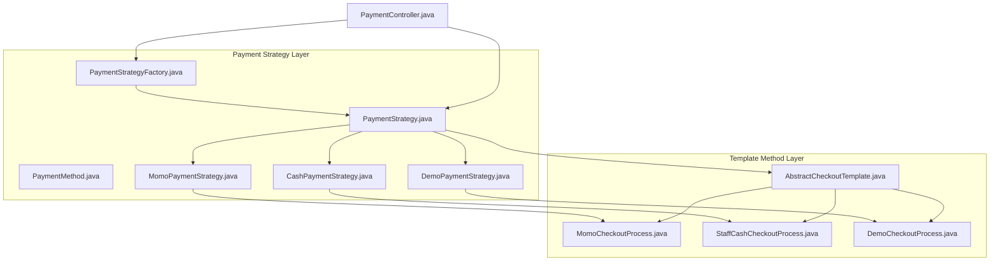

**Diagram sources**
- [PaymentStrategy.java:1-15](file://backend/src/main/java/com/cinema/booking/services/payment/PaymentStrategy.java#L1-L15)
- [PaymentMethod.java:1-22](file://backend/src/main/java/com/cinema/booking/services/payment/PaymentMethod.java#L1-L22)
- [PaymentStrategyFactory.java:1-49](file://backend/src/main/java/com/cinema/booking/services/payment/PaymentStrategyFactory.java#L1-L49)
- [CashPaymentStrategy.java:1-40](file://backend/src/main/java/com/cinema/booking/services/payment/CashPaymentStrategy.java#L1-L40)
- [MomoPaymentStrategy.java:1-27](file://backend/src/main/java/com/cinema/booking/services/payment/MomoPaymentStrategy.java#L1-L27)
- [DemoPaymentStrategy.java:1-36](file://backend/src/main/java/com/cinema/booking/services/payment/DemoPaymentStrategy.java#L1-L36)
- [AbstractCheckoutTemplate.java:1-182](file://backend/src/main/java/com/cinema/booking/services/template_method/checkout/AbstractCheckoutTemplate.java#L1-L182)
- [MomoCheckoutProcess.java:1-70](file://backend/src/main/java/com/cinema/booking/services/template_method/checkout/MomoCheckoutProcess.java#L1-L70)
- [StaffCashCheckoutProcess.java:1-129](file://backend/src/main/java/com/cinema/booking/services/template_method/checkout/StaffCashCheckoutProcess.java#L1-L129)
- [DemoCheckoutProcess.java:1-131](file://backend/src/main/java/com/cinema/booking/services/template_method/checkout/DemoCheckoutProcess.java#L1-L131)
- [PaymentController.java:1-150](file://backend/src/main/java/com/cinema/booking/controllers/PaymentController.java#L1-L150)

**Section sources**
- [PaymentStrategy.java:1-15](file://backend/src/main/java/com/cinema/booking/services/payment/PaymentStrategy.java#L1-L15)
- [PaymentStrategyFactory.java:1-49](file://backend/src/main/java/com/cinema/booking/services/payment/PaymentStrategyFactory.java#L1-L49)
- [AbstractCheckoutTemplate.java:1-182](file://backend/src/main/java/com/cinema/booking/services/template_method/checkout/AbstractCheckoutTemplate.java#L1-L182)
- [PaymentController.java:1-150](file://backend/src/main/java/com/cinema/booking/controllers/PaymentController.java#L1-L150)

## Core Components
- PaymentStrategy: Defines the contract for payment methods, exposing the associated PaymentMethod and a checkout method returning a standardized CheckoutResult.
- PaymentMethod: Enumerates supported payment channels and provides a safe conversion from string input.
- PaymentStrategyFactory: Central registry that binds PaymentMethod values to PaymentStrategy beans, ensuring completeness and type-safe retrieval.
- Concrete Strategies:
  - MomoPaymentStrategy: Delegates to MomoCheckoutProcess.
  - DemoPaymentStrategy: Delegates to DemoCheckoutProcess and provides a dedicated result builder.
  - CashPaymentStrategy: Delegates to StaffCashCheckoutProcess and provides a dedicated result builder.
- Template Method Checkout Processes:
  - AbstractCheckoutTemplate: Implements the shared checkout workflow and delegates payment-specific steps to subclasses.
  - MomoCheckoutProcess: Handles MoMo payment creation and pending payment persistence.
  - StaffCashCheckoutProcess: Immediately confirms bookings and records successful cash payments.
  - DemoCheckoutProcess: Simulates payment outcomes for testing and optionally sends emails.

These components work together to enable pluggable payment methods while keeping shared checkout logic centralized.

**Section sources**
- [PaymentStrategy.java:1-15](file://backend/src/main/java/com/cinema/booking/services/payment/PaymentStrategy.java#L1-L15)
- [PaymentMethod.java:1-22](file://backend/src/main/java/com/cinema/booking/services/payment/PaymentMethod.java#L1-L22)
- [PaymentStrategyFactory.java:1-49](file://backend/src/main/java/com/cinema/booking/services/payment/PaymentStrategyFactory.java#L1-L49)
- [CashPaymentStrategy.java:1-40](file://backend/src/main/java/com/cinema/booking/services/payment/CashPaymentStrategy.java#L1-L40)
- [MomoPaymentStrategy.java:1-27](file://backend/src/main/java/com/cinema/booking/services/payment/MomoPaymentStrategy.java#L1-L27)
- [DemoPaymentStrategy.java:1-36](file://backend/src/main/java/com/cinema/booking/services/payment/DemoPaymentStrategy.java#L1-L36)
- [AbstractCheckoutTemplate.java:1-182](file://backend/src/main/java/com/cinema/booking/services/template_method/checkout/AbstractCheckoutTemplate.java#L1-L182)
- [MomoCheckoutProcess.java:1-70](file://backend/src/main/java/com/cinema/booking/services/template_method/checkout/MomoCheckoutProcess.java#L1-L70)
- [StaffCashCheckoutProcess.java:1-129](file://backend/src/main/java/com/cinema/booking/services/template_method/checkout/StaffCashCheckoutProcess.java#L1-L129)
- [DemoCheckoutProcess.java:1-131](file://backend/src/main/java/com/cinema/booking/services/template_method/checkout/DemoCheckoutProcess.java#L1-L131)

## Architecture Overview
The system uses the strategy pattern to decouple payment method implementations from the checkout orchestration. PaymentStrategyFactory injects the appropriate strategy based on PaymentMethod. Each strategy delegates to a template method checkout process that encapsulates shared steps (validation, pricing, promotion, F&B reservation) and defers payment-specific actions to subclasses.

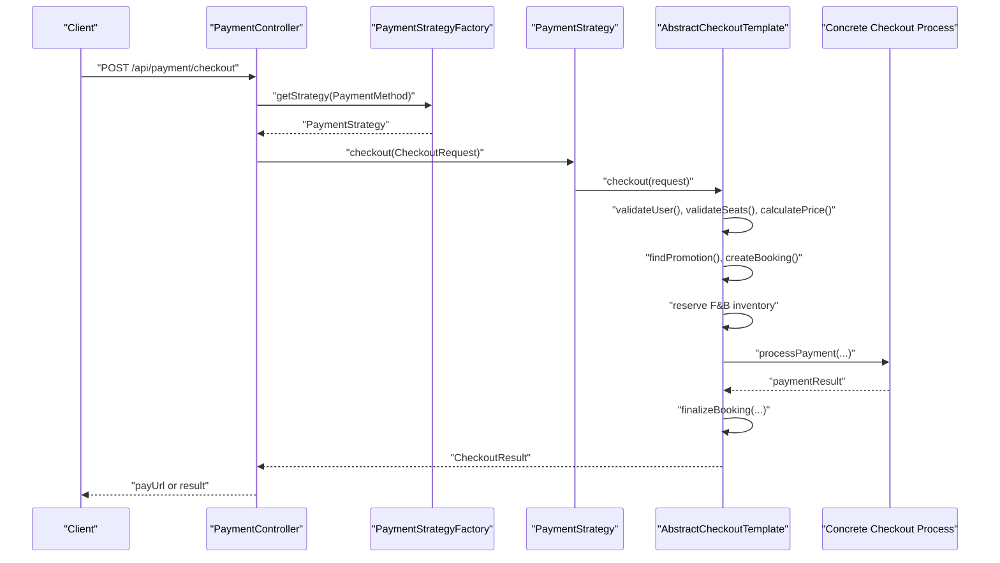

**Diagram sources**
- [PaymentController.java:31-51](file://backend/src/main/java/com/cinema/booking/controllers/PaymentController.java#L31-L51)
- [PaymentStrategyFactory.java:33-47](file://backend/src/main/java/com/cinema/booking/services/payment/PaymentStrategyFactory.java#L33-L47)
- [PaymentStrategy.java:11-13](file://backend/src/main/java/com/cinema/booking/services/payment/PaymentStrategy.java#L11-L13)
- [AbstractCheckoutTemplate.java:54-95](file://backend/src/main/java/com/cinema/booking/services/template_method/checkout/AbstractCheckoutTemplate.java#L54-L95)
- [MomoCheckoutProcess.java:46-68](file://backend/src/main/java/com/cinema/booking/services/template_method/checkout/MomoCheckoutProcess.java#L46-L68)
- [StaffCashCheckoutProcess.java:67-95](file://backend/src/main/java/com/cinema/booking/services/template_method/checkout/StaffCashCheckoutProcess.java#L67-L95)
- [DemoCheckoutProcess.java:56-93](file://backend/src/main/java/com/cinema/booking/services/template_method/checkout/DemoCheckoutProcess.java#L56-L93)

## Detailed Component Analysis

### PaymentStrategy Interface
- Purpose: Defines a uniform contract for payment methods, ensuring consistent selection and invocation.
- Methods:
  - getPaymentMethod(): Returns the PaymentMethod constant associated with the strategy.
  - checkout(request): Executes the payment checkout and returns a CheckoutResult.

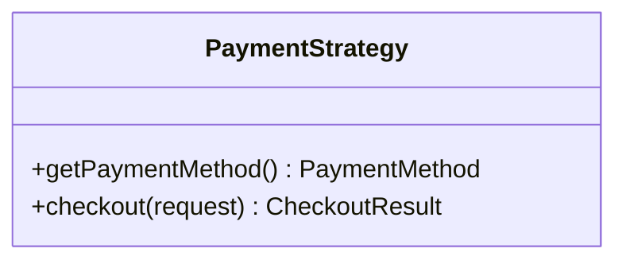

**Diagram sources**
- [PaymentStrategy.java:9-14](file://backend/src/main/java/com/cinema/booking/services/payment/PaymentStrategy.java#L9-L14)

**Section sources**
- [PaymentStrategy.java:1-15](file://backend/src/main/java/com/cinema/booking/services/payment/PaymentStrategy.java#L1-L15)

### PaymentMethod Enum
- Purpose: Enumerates supported payment channels and provides a safe string-to-enum converter.
- Behavior:
  - Defaults to a predefined value when input is blank.
  - Throws a descriptive error for unsupported values.

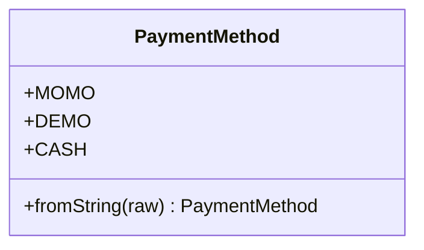

**Diagram sources**
- [PaymentMethod.java:6-21](file://backend/src/main/java/com/cinema/booking/services/payment/PaymentMethod.java#L6-L21)

**Section sources**
- [PaymentMethod.java:1-22](file://backend/src/main/java/com/cinema/booking/services/payment/PaymentMethod.java#L1-L22)

### PaymentStrategyFactory
- Purpose: Central registry binding PaymentMethod to PaymentStrategy beans.
- Responsibilities:
  - Validates that exactly one strategy exists per PaymentMethod.
  - Ensures all PaymentMethod values are covered.
  - Provides type-safe retrieval of strategies.

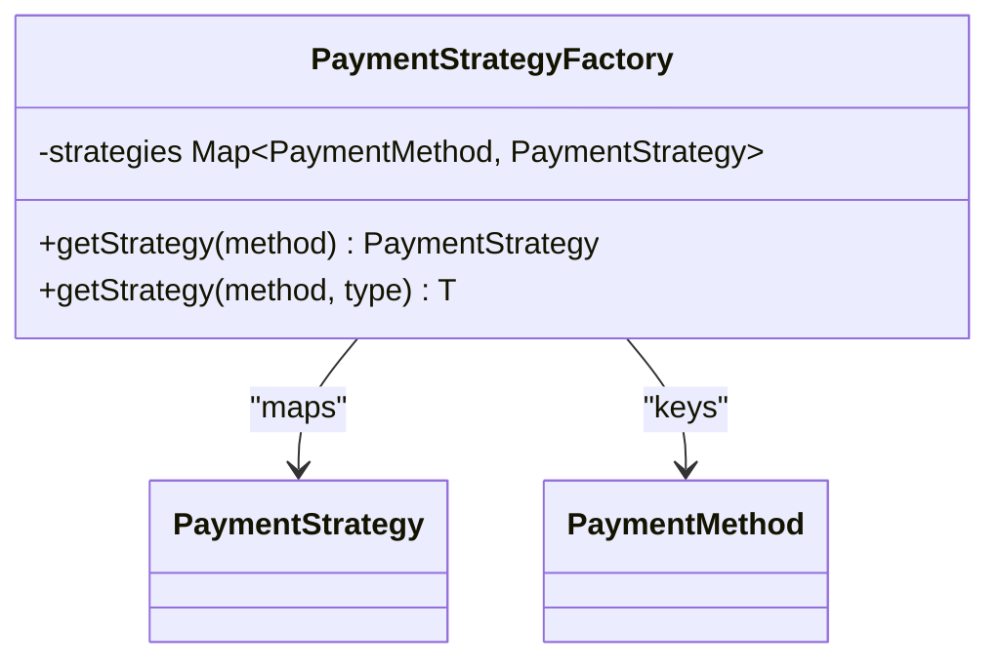

**Diagram sources**
- [PaymentStrategyFactory.java:16-47](file://backend/src/main/java/com/cinema/booking/services/payment/PaymentStrategyFactory.java#L16-L47)

**Section sources**
- [PaymentStrategyFactory.java:1-49](file://backend/src/main/java/com/cinema/booking/services/payment/PaymentStrategyFactory.java#L1-L49)

### Concrete Strategies and Their Template Method Integrations

#### MomoPaymentStrategy
- Delegates checkout to MomoCheckoutProcess.
- Returns a payment result suitable for redirecting users to a payment page.

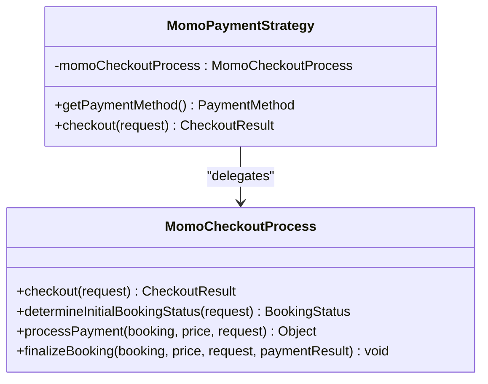

**Diagram sources**
- [MomoPaymentStrategy.java:9-25](file://backend/src/main/java/com/cinema/booking/services/payment/MomoPaymentStrategy.java#L9-L25)
- [MomoCheckoutProcess.java:19-68](file://backend/src/main/java/com/cinema/booking/services/template_method/checkout/MomoCheckoutProcess.java#L19-L68)

**Section sources**
- [MomoPaymentStrategy.java:1-27](file://backend/src/main/java/com/cinema/booking/services/payment/MomoPaymentStrategy.java#L1-L27)
- [MomoCheckoutProcess.java:1-70](file://backend/src/main/java/com/cinema/booking/services/template_method/checkout/MomoCheckoutProcess.java#L1-L70)

#### DemoPaymentStrategy
- Delegates checkout to DemoCheckoutProcess.
- Provides a dedicated result builder for demo scenarios.

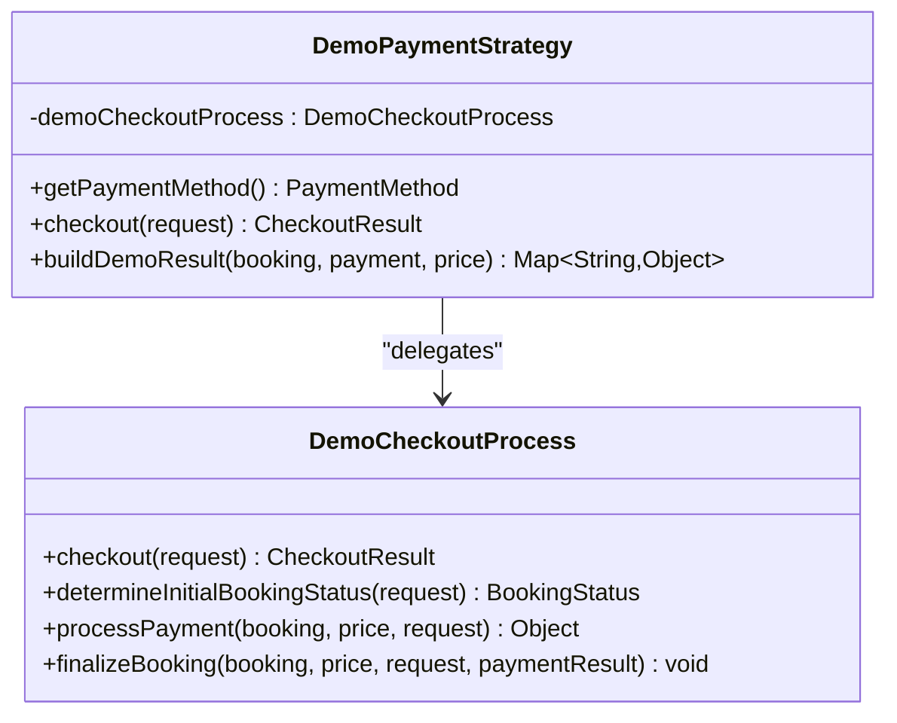

**Diagram sources**
- [DemoPaymentStrategy.java:14-34](file://backend/src/main/java/com/cinema/booking/services/payment/DemoPaymentStrategy.java#L14-L34)
- [DemoCheckoutProcess.java:20-93](file://backend/src/main/java/com/cinema/booking/services/template_method/checkout/DemoCheckoutProcess.java#L20-L93)

**Section sources**
- [DemoPaymentStrategy.java:1-36](file://backend/src/main/java/com/cinema/booking/services/payment/DemoPaymentStrategy.java#L1-L36)
- [DemoCheckoutProcess.java:1-131](file://backend/src/main/java/com/cinema/booking/services/template_method/checkout/DemoCheckoutProcess.java#L1-L131)

#### CashPaymentStrategy
- Delegates checkout to StaffCashCheckoutProcess.
- Provides a dedicated result builder for cash transactions.

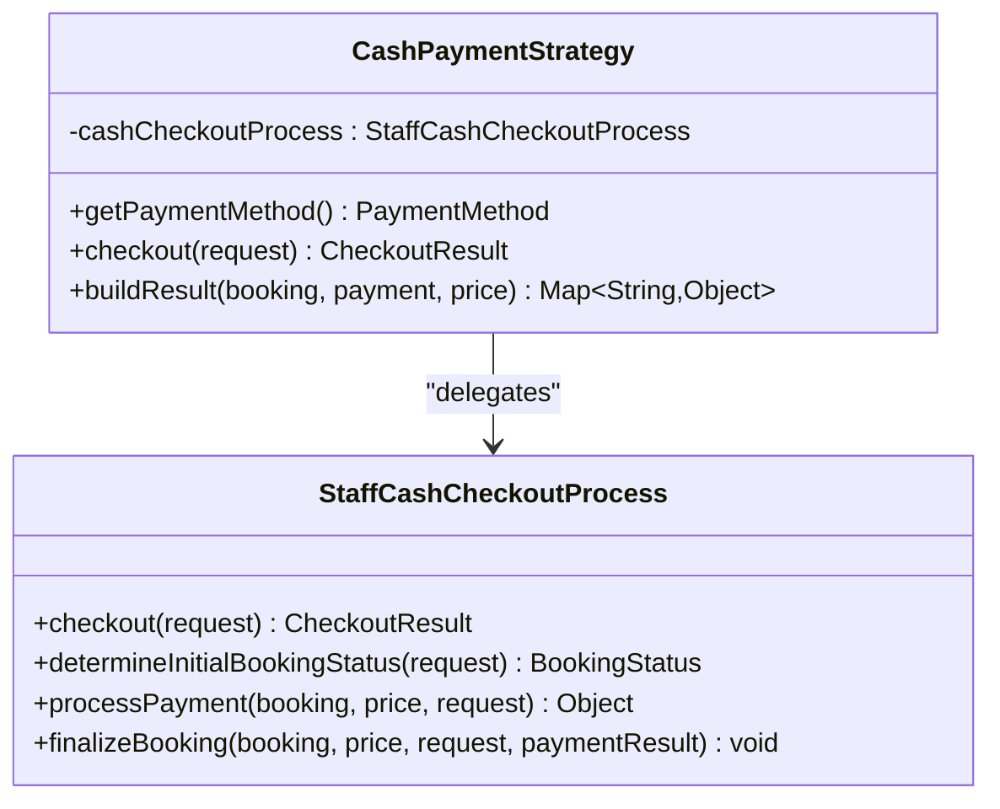

**Diagram sources**
- [CashPaymentStrategy.java:18-38](file://backend/src/main/java/com/cinema/booking/services/payment/CashPaymentStrategy.java#L18-L38)
- [StaffCashCheckoutProcess.java:27-95](file://backend/src/main/java/com/cinema/booking/services/template_method/checkout/StaffCashCheckoutProcess.java#L27-L95)

**Section sources**
- [CashPaymentStrategy.java:1-40](file://backend/src/main/java/com/cinema/booking/services/payment/CashPaymentStrategy.java#L1-L40)
- [StaffCashCheckoutProcess.java:1-129](file://backend/src/main/java/com/cinema/booking/services/template_method/checkout/StaffCashCheckoutProcess.java#L1-L129)

### Template Method Checkout Workflow
AbstractCheckoutTemplate defines the shared checkout flow:
- Validate user and seats
- Calculate price and apply promotions
- Create booking and reserve F&B inventory
- Delegate payment processing to subclasses
- Finalize booking and handle cancellations

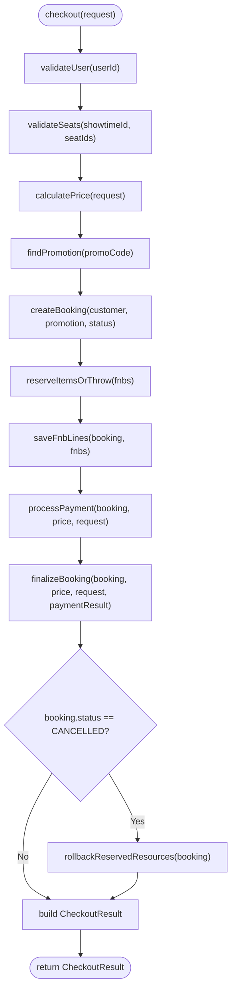

**Diagram sources**
- [AbstractCheckoutTemplate.java:54-95](file://backend/src/main/java/com/cinema/booking/services/template_method/checkout/AbstractCheckoutTemplate.java#L54-L95)
- [AbstractCheckoutTemplate.java:97-107](file://backend/src/main/java/com/cinema/booking/services/template_method/checkout/AbstractCheckoutTemplate.java#L97-L107)

**Section sources**
- [AbstractCheckoutTemplate.java:1-182](file://backend/src/main/java/com/cinema/booking/services/template_method/checkout/AbstractCheckoutTemplate.java#L1-L182)

### Payment Method Validation and Error Handling
- PaymentMethod.fromString safely converts raw input to enum, defaulting to a supported value and throwing a descriptive error for invalid inputs.
- PaymentStrategyFactory enforces completeness and uniqueness of strategies per PaymentMethod, preventing runtime ambiguity.
- Template method processes wrap critical operations with robust error handling and resource rollback for cancelled bookings.

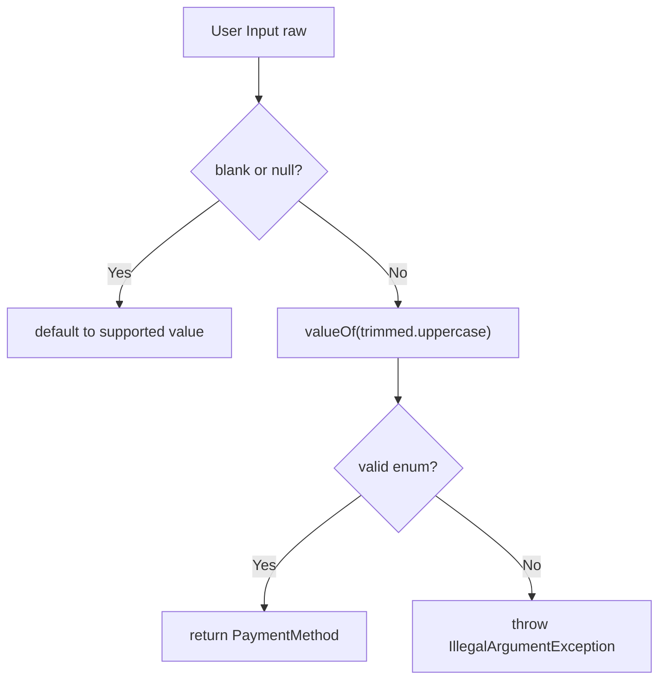

**Diagram sources**
- [PaymentMethod.java:11-20](file://backend/src/main/java/com/cinema/booking/services/payment/PaymentMethod.java#L11-L20)

**Section sources**
- [PaymentMethod.java:1-22](file://backend/src/main/java/com/cinema/booking/services/payment/PaymentMethod.java#L1-L22)
- [PaymentStrategyFactory.java:26-30](file://backend/src/main/java/com/cinema/booking/services/payment/PaymentStrategyFactory.java#L26-L30)
- [AbstractCheckoutTemplate.java:97-107](file://backend/src/main/java/com/cinema/booking/services/template_method/checkout/AbstractCheckoutTemplate.java#L97-L107)

### Payment Result Standardization
- All strategies return a CheckoutResult containing the booking, price breakdown, and paymentResult.
- Demo and Cash strategies provide additional builders to produce consistent response maps for controller consumption.

**Section sources**
- [AbstractCheckoutTemplate.java:90-94](file://backend/src/main/java/com/cinema/booking/services/template_method/checkout/AbstractCheckoutTemplate.java#L90-L94)
- [DemoCheckoutProcess.java:99-106](file://backend/src/main/java/com/cinema/booking/services/template_method/checkout/DemoCheckoutProcess.java#L99-L106)
- [StaffCashCheckoutProcess.java:97-106](file://backend/src/main/java/com/cinema/booking/services/template_method/checkout/StaffCashCheckoutProcess.java#L97-L106)

### Adding New Payment Methods
Steps to add a new payment method:
1. Define a new PaymentMethod value.
2. Create a new strategy class implementing PaymentStrategy and delegate to a new checkout process extending AbstractCheckoutTemplate.
3. Register the new strategy bean so PaymentStrategyFactory can discover it.
4. Optionally add a dedicated result builder if the controller needs a specific response format.
5. Update PaymentController endpoints if a new channel requires additional flows.

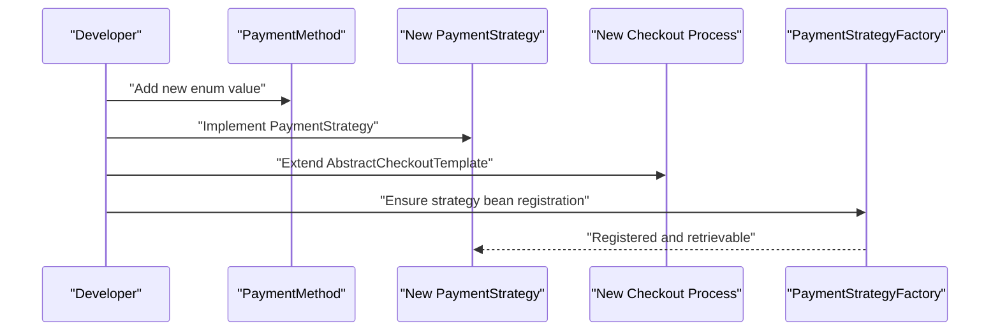

**Diagram sources**
- [PaymentMethod.java:6-21](file://backend/src/main/java/com/cinema/booking/services/payment/PaymentMethod.java#L6-L21)
- [PaymentStrategy.java:9-14](file://backend/src/main/java/com/cinema/booking/services/payment/PaymentStrategy.java#L9-L14)
- [AbstractCheckoutTemplate.java:17-181](file://backend/src/main/java/com/cinema/booking/services/template_method/checkout/AbstractCheckoutTemplate.java#L17-L181)
- [PaymentStrategyFactory.java:19-31](file://backend/src/main/java/com/cinema/booking/services/payment/PaymentStrategyFactory.java#L19-L31)

## Dependency Analysis
The strategy pattern cleanly separates concerns:
- PaymentController depends on PaymentStrategyFactory and PaymentStrategy for dispatch.
- PaymentStrategy implementations depend on template method processes for checkout logic.
- Template method processes depend on repositories and services for persistence and validation.

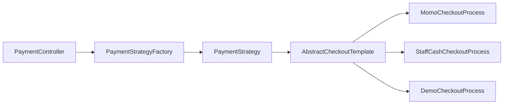

**Diagram sources**
- [PaymentController.java:31-51](file://backend/src/main/java/com/cinema/booking/controllers/PaymentController.java#L31-L51)
- [PaymentStrategyFactory.java:33-39](file://backend/src/main/java/com/cinema/booking/services/payment/PaymentStrategyFactory.java#L33-L39)
- [PaymentStrategy.java:11-13](file://backend/src/main/java/com/cinema/booking/services/payment/PaymentStrategy.java#L11-L13)
- [AbstractCheckoutTemplate.java:54-95](file://backend/src/main/java/com/cinema/booking/services/template_method/checkout/AbstractCheckoutTemplate.java#L54-L95)
- [MomoCheckoutProcess.java:19-68](file://backend/src/main/java/com/cinema/booking/services/template_method/checkout/MomoCheckoutProcess.java#L19-L68)
- [StaffCashCheckoutProcess.java:27-95](file://backend/src/main/java/com/cinema/booking/services/template_method/checkout/StaffCashCheckoutProcess.java#L27-L95)
- [DemoCheckoutProcess.java:20-93](file://backend/src/main/java/com/cinema/booking/services/template_method/checkout/DemoCheckoutProcess.java#L20-L93)

**Section sources**
- [PaymentController.java:1-150](file://backend/src/main/java/com/cinema/booking/controllers/PaymentController.java#L1-L150)
- [PaymentStrategyFactory.java:1-49](file://backend/src/main/java/com/cinema/booking/services/payment/PaymentStrategyFactory.java#L1-L49)
- [AbstractCheckoutTemplate.java:1-182](file://backend/src/main/java/com/cinema/booking/services/template_method/checkout/AbstractCheckoutTemplate.java#L1-L182)

## Performance Considerations
- Strategy lookup is O(1) via EnumMap in PaymentStrategyFactory.
- Template method reduces repeated validation and booking creation logic across payment channels.
- Payment gateway calls (e.g., MoMo) are delegated to service classes, minimizing coupling and enabling async callbacks/IPNs.

## Troubleshooting Guide
Common issues and resolutions:
- Missing strategy registration: PaymentStrategyFactory enforces one strategy per PaymentMethod; ensure all enums have a corresponding bean.
- Unsupported payment method string: PaymentMethod.fromString throws an error for invalid inputs; validate client-provided values.
- Resource rollback on cancellation: AbstractCheckoutTemplate automatically releases reservations for cancelled bookings.
- Deadlocks during customer spending updates: Both StaffCashCheckoutProcess and DemoCheckoutProcess retry with backoff for deadlock scenarios.

**Section sources**
- [PaymentStrategyFactory.java:22-30](file://backend/src/main/java/com/cinema/booking/services/payment/PaymentStrategyFactory.java#L22-L30)
- [PaymentMethod.java:11-20](file://backend/src/main/java/com/cinema/booking/services/payment/PaymentMethod.java#L11-L20)
- [AbstractCheckoutTemplate.java:97-107](file://backend/src/main/java/com/cinema/booking/services/template_method/checkout/AbstractCheckoutTemplate.java#L97-L107)
- [StaffCashCheckoutProcess.java:108-127](file://backend/src/main/java/com/cinema/booking/services/template_method/checkout/StaffCashCheckoutProcess.java#L108-L127)
- [DemoCheckoutProcess.java:108-129](file://backend/src/main/java/com/cinema/booking/services/template_method/checkout/DemoCheckoutProcess.java#L108-L129)

## Conclusion
The payment strategy pattern, combined with the template method, enables a clean, extensible payment system. PaymentStrategyFactory ensures dynamic, type-safe selection of payment strategies mapped to PaymentMethod values. Each strategy delegates to a specialized checkout process that implements shared validation and persistence logic while encapsulating payment-channel specifics. This design supports easy addition of new payment methods, robust error handling, and standardized payment results across channels.