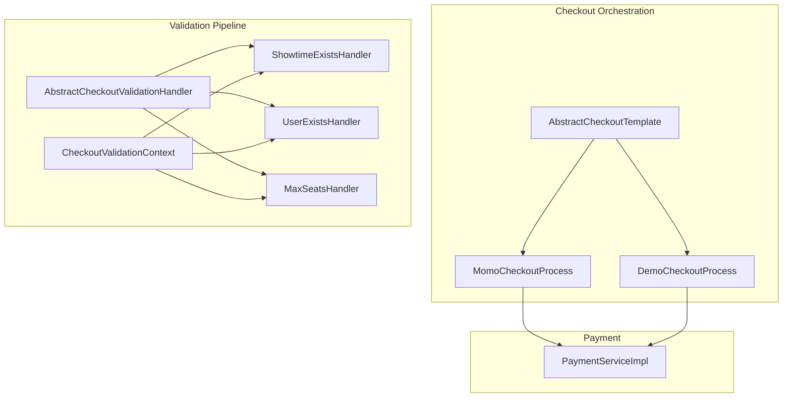
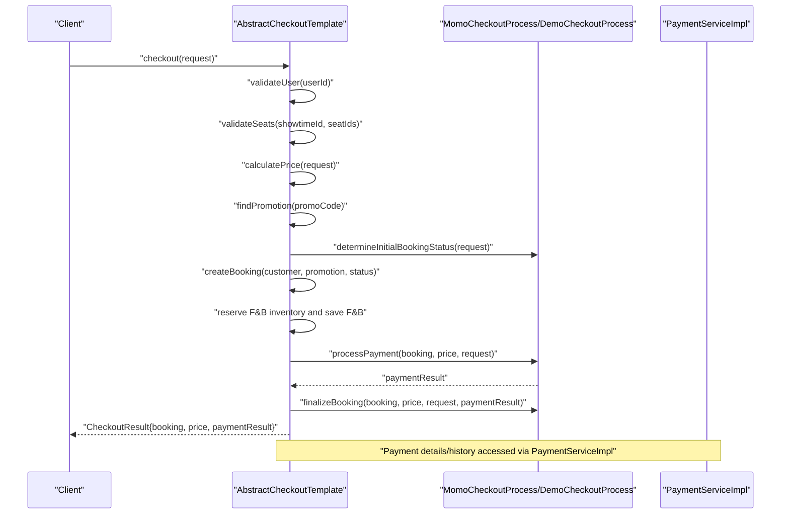
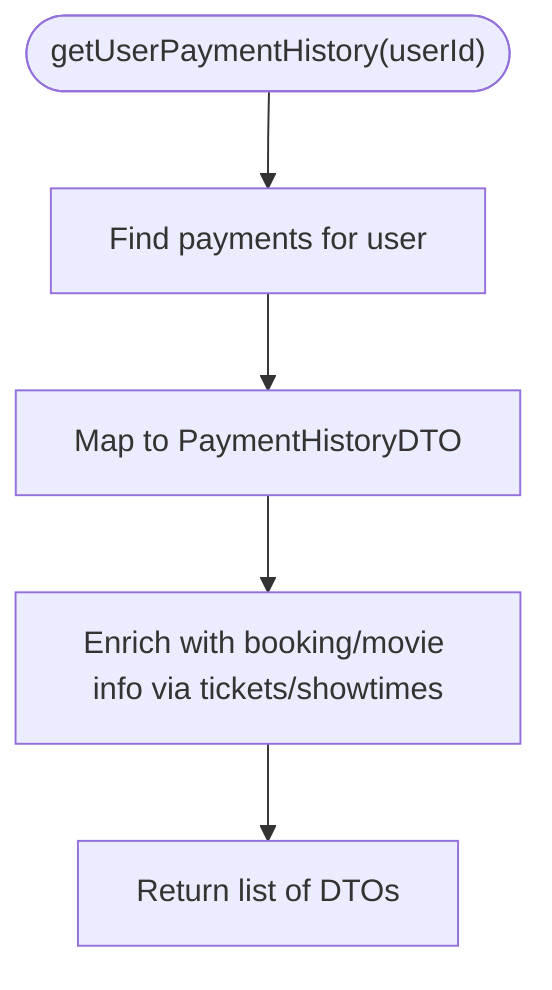
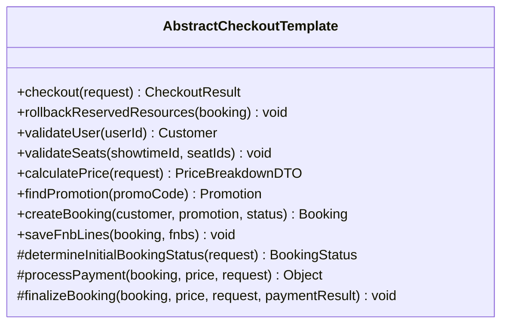
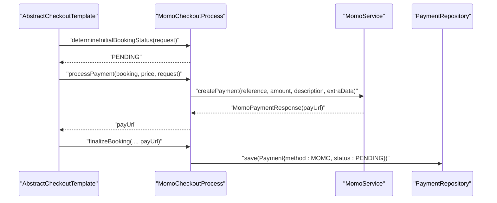
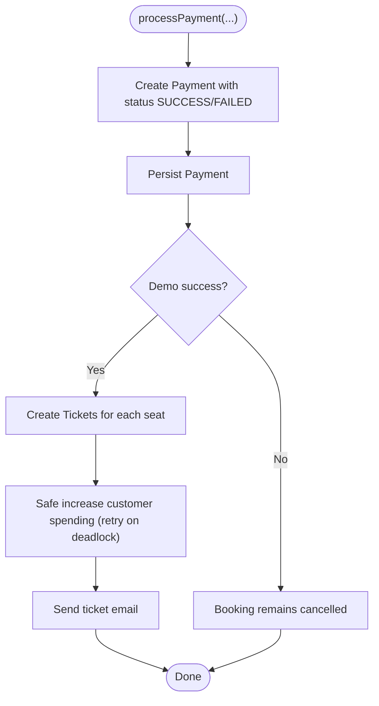
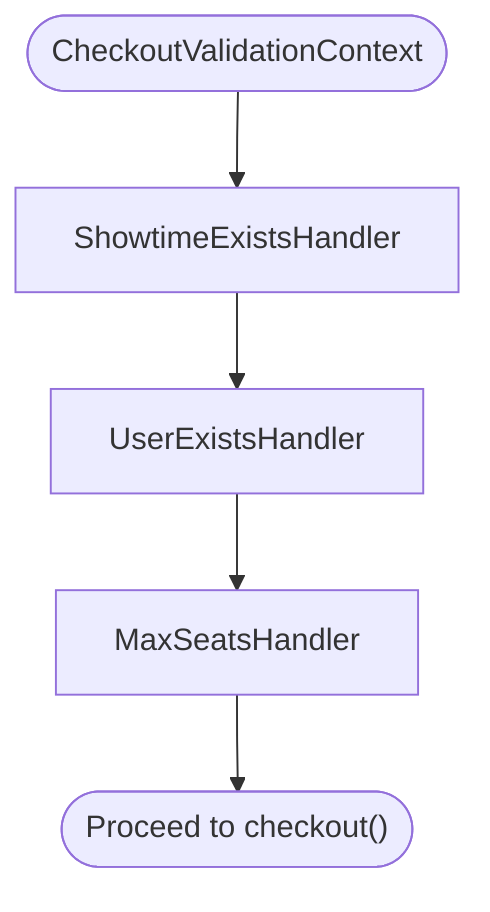
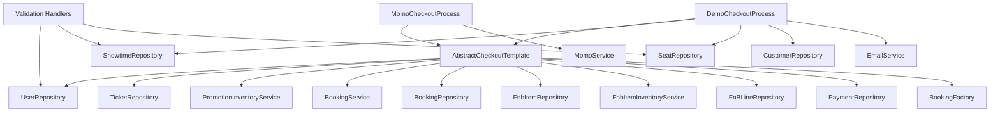

# Payment Validation Workflow

<cite>
**Referenced Files in This Document**
- [AbstractCheckoutTemplate.java](file://backend/src/main/java/com/cinema/booking/services/template_method/checkout/AbstractCheckoutTemplate.java)
- [MomoCheckoutProcess.java](file://backend/src/main/java/com/cinema/booking/services/template_method/checkout/MomoCheckoutProcess.java)
- [DemoCheckoutProcess.java](file://backend/src/main/java/com/cinema/booking/services/template_method/checkout/DemoCheckoutProcess.java)
- [AbstractCheckoutValidationHandler.java](file://backend/src/main/java/com/cinema/booking/patterns/chainofresponsibility/AbstractCheckoutValidationHandler.java)
- [CheckoutValidationContext.java](file://backend/src/main/java/com/cinema/booking/patterns/chainofresponsibility/CheckoutValidationContext.java)
- [ShowtimeExistsHandler.java](file://backend/src/main/java/com/cinema/booking/patterns/chainofresponsibility/ShowtimeExistsHandler.java)
- [UserExistsHandler.java](file://backend/src/main/java/com/cinema/booking/patterns/chainofresponsibility/UserExistsHandler.java)
- [MaxSeatsHandler.java](file://backend/src/main/java/com/cinema/booking/patterns/chainofresponsibility/MaxSeatsHandler.java)
- [PaymentServiceImpl.java](file://backend/src/main/java/com/cinema/booking/services/impl/PaymentServiceImpl.java)
</cite>

## Table of Contents
1. [Introduction](#introduction)
2. [Project Structure](#project-structure)
3. [Core Components](#core-components)
4. [Architecture Overview](#architecture-overview)
5. [Detailed Component Analysis](#detailed-component-analysis)
6. [Dependency Analysis](#dependency-analysis)
7. [Performance Considerations](#performance-considerations)
8. [Troubleshooting Guide](#troubleshooting-guide)
9. [Conclusion](#conclusion)

## Introduction
This document explains the payment validation workflow and checkout process orchestration in the cinema booking system. It focuses on:
- Payment validation, booking confirmation, and transaction processing
- The template method pattern used in checkout processes via AbstractCheckoutTemplate and concrete implementations (MomoCheckoutProcess and DemoCheckoutProcess)
- The checkout validation pipeline (booking existence checks, seat availability validation, user authentication verification)
- Payment result mapping, transaction status tracking, and failure handling
- Examples of payment validation scenarios, error propagation, and rollback procedures
- Integration between payment validation and booking state management
- Concurrent payment processing, race condition prevention, and payment consistency guarantees

## Project Structure
The checkout and payment logic is organized around:
- Template method pattern for checkout orchestration
- Chain of responsibility for pre-checkout validations
- Payment service for retrieving payment history and details
- Concrete checkout processors implementing payment-specific flows

**Diagram sources**
- [AbstractCheckoutTemplate.java:1-182](file://backend/src/main/java/com/cinema/booking/services/template_method/checkout/AbstractCheckoutTemplate.java#L1-L182)
- [MomoCheckoutProcess.java:1-70](file://backend/src/main/java/com/cinema/booking/services/template_method/checkout/MomoCheckoutProcess.java#L1-L70)
- [DemoCheckoutProcess.java:1-131](file://backend/src/main/java/com/cinema/booking/services/template_method/checkout/DemoCheckoutProcess.java#L1-L131)
- [AbstractCheckoutValidationHandler.java:1-21](file://backend/src/main/java/com/cinema/booking/patterns/chainofresponsibility/AbstractCheckoutValidationHandler.java#L1-L21)
- [ShowtimeExistsHandler.java:1-21](file://backend/src/main/java/com/cinema/booking/patterns/chainofresponsibility/ShowtimeExistsHandler.java#L1-L21)
- [UserExistsHandler.java:1-43](file://backend/src/main/java/com/cinema/booking/patterns/chainofresponsibility/UserExistsHandler.java#L1-L43)
- [MaxSeatsHandler.java:1-20](file://backend/src/main/java/com/cinema/booking/patterns/chainofresponsibility/MaxSeatsHandler.java#L1-L20)
- [CheckoutValidationContext.java:1-22](file://backend/src/main/java/com/cinema/booking/patterns/chainofresponsibility/CheckoutValidationContext.java#L1-L22)
- [PaymentServiceImpl.java:1-69](file://backend/src/main/java/com/cinema/booking/services/impl/PaymentServiceImpl.java#L1-L69)

**Section sources**
- [AbstractCheckoutTemplate.java:1-182](file://backend/src/main/java/com/cinema/booking/services/template_method/checkout/AbstractCheckoutTemplate.java#L1-L182)
- [AbstractCheckoutValidationHandler.java:1-21](file://backend/src/main/java/com/cinema/booking/patterns/chainofresponsibility/AbstractCheckoutValidationHandler.java#L1-L21)
- [PaymentServiceImpl.java:1-69](file://backend/src/main/java/com/cinema/booking/services/impl/PaymentServiceImpl.java#L1-L69)

## Core Components
- AbstractCheckoutTemplate: Defines the checkout workflow as a template method, including user validation, seat validation, pricing, promotion reservation, booking creation, F&B reservation/saving, payment processing, and booking finalization. It also provides rollback hooks for cancelled bookings.
- MomoCheckoutProcess: Implements MoMo payment integration, setting initial booking status to pending, generating a payment URL via MomoService, and persisting a pending payment record.
- DemoCheckoutProcess: Implements a demo payment flow that immediately creates a payment record (success or failed based on a flag), generates tickets, updates customer spending, and sends a ticket email.
- Checkout validation handlers: Chain of responsibility handlers validating showtime existence, user existence (with guest fallback), and maximum seats per booking.
- PaymentServiceImpl: Provides payment history retrieval and payment details lookup.

**Section sources**
- [AbstractCheckoutTemplate.java:53-95](file://backend/src/main/java/com/cinema/booking/services/template_method/checkout/AbstractCheckoutTemplate.java#L53-L95)
- [MomoCheckoutProcess.java:40-68](file://backend/src/main/java/com/cinema/booking/services/template_method/checkout/MomoCheckoutProcess.java#L40-L68)
- [DemoCheckoutProcess.java:50-93](file://backend/src/main/java/com/cinema/booking/services/template_method/checkout/DemoCheckoutProcess.java#L50-L93)
- [AbstractCheckoutValidationHandler.java:12-17](file://backend/src/main/java/com/cinema/booking/patterns/chainofresponsibility/AbstractCheckoutValidationHandler.java#L12-L17)
- [ShowtimeExistsHandler.java:14-19](file://backend/src/main/java/com/cinema/booking/patterns/chainofresponsibility/ShowtimeExistsHandler.java#L14-L19)
- [UserExistsHandler.java:16-27](file://backend/src/main/java/com/cinema/booking/patterns/chainofresponsibility/UserExistsHandler.java#L16-L27)
- [MaxSeatsHandler.java:10-18](file://backend/src/main/java/com/cinema/booking/patterns/chainofresponsibility/MaxSeatsHandler.java#L10-L18)
- [PaymentServiceImpl.java:23-34](file://backend/src/main/java/com/cinema/booking/services/impl/PaymentServiceImpl.java#L23-L34)

## Architecture Overview
The checkout process is orchestrated by a template method that enforces a strict sequence of steps. Concrete checkout processors override payment-specific behavior while reusing shared orchestration logic. Validation handlers enforce preconditions before checkout proceeds. Payment details and history are managed by the payment service.

**Diagram sources**
- [AbstractCheckoutTemplate.java:53-95](file://backend/src/main/java/com/cinema/booking/services/template_method/checkout/AbstractCheckoutTemplate.java#L53-L95)
- [MomoCheckoutProcess.java:40-68](file://backend/src/main/java/com/cinema/booking/services/template_method/checkout/MomoCheckoutProcess.java#L40-L68)
- [DemoCheckoutProcess.java:50-93](file://backend/src/main/java/com/cinema/booking/services/template_method/checkout/DemoCheckoutProcess.java#L50-L93)
- [PaymentServiceImpl.java:23-34](file://backend/src/main/java/com/cinema/booking/services/impl/PaymentServiceImpl.java#L23-L34)

## Detailed Component Analysis

### PaymentServiceImpl
Responsibilities:
- Retrieve user payment history mapped to a DTO with booking summary, movie info, and payment metadata
- Fetch a payment by ID and throw a domain-specific error if not found

Key behaviors:
- Maps payment entities to PaymentHistoryDTO, enriching with movie title/poster derived from associated tickets and showtimes
- Defaults missing status to a pending indicator

**Diagram sources**
- [PaymentServiceImpl.java:24-67](file://backend/src/main/java/com/cinema/booking/services/impl/PaymentServiceImpl.java#L24-L67)

**Section sources**
- [PaymentServiceImpl.java:23-67](file://backend/src/main/java/com/cinema/booking/services/impl/PaymentServiceImpl.java#L23-L67)

### AbstractCheckoutTemplate (Template Method)
Responsibilities:
- Define the canonical checkout flow as a transactional template method
- Shared validations: user existence and guest fallback, seat unavailability check
- Shared orchestration: price calculation, promotion reservation, booking creation, F&B reservation/saving
- Abstract hooks for concrete processors: initial booking status, payment processing, and booking finalization
- Rollback hook for cancelled bookings to release reservations

**Diagram sources**
- [AbstractCheckoutTemplate.java:17-181](file://backend/src/main/java/com/cinema/booking/services/template_method/checkout/AbstractCheckoutTemplate.java#L17-L181)

**Section sources**
- [AbstractCheckoutTemplate.java:53-95](file://backend/src/main/java/com/cinema/booking/services/template_method/checkout/AbstractCheckoutTemplate.java#L53-L95)
- [AbstractCheckoutTemplate.java:97-107](file://backend/src/main/java/com/cinema/booking/services/template_method/checkout/AbstractCheckoutTemplate.java#L97-L107)

### MomoCheckoutProcess
Responsibilities:
- Set initial booking status to pending
- Generate a MoMo payment URL using MomoService with extra data containing booking and seat identifiers
- Persist a pending payment record upon successful payment initiation

**Diagram sources**
- [MomoCheckoutProcess.java:40-68](file://backend/src/main/java/com/cinema/booking/services/template_method/checkout/MomoCheckoutProcess.java#L40-L68)

**Section sources**
- [MomoCheckoutProcess.java:40-68](file://backend/src/main/java/com/cinema/booking/services/template_method/checkout/MomoCheckoutProcess.java#L40-L68)

### DemoCheckoutProcess
Responsibilities:
- Conditionally set initial booking status to confirmed or cancelled based on a demo flag
- Immediately create a payment record with success or failed status
- On success, create tickets for each seat, update customer spending with retry-on-deadlock, and send a ticket email
- Provide a result builder for controller mapping

Concurrency and consistency:
- Uses a retry loop with exponential backoff-like delays when encountering deadlock-related runtime exceptions during customer spending updates

**Diagram sources**
- [DemoCheckoutProcess.java:55-93](file://backend/src/main/java/com/cinema/booking/services/template_method/checkout/DemoCheckoutProcess.java#L55-L93)
- [DemoCheckoutProcess.java:108-129](file://backend/src/main/java/com/cinema/booking/services/template_method/checkout/DemoCheckoutProcess.java#L108-L129)

**Section sources**
- [DemoCheckoutProcess.java:50-93](file://backend/src/main/java/com/cinema/booking/services/template_method/checkout/DemoCheckoutProcess.java#L50-L93)
- [DemoCheckoutProcess.java:108-129](file://backend/src/main/java/com/cinema/booking/services/template_method/checkout/DemoCheckoutProcess.java#L108-L129)

### Checkout Validation Pipeline (Chain of Responsibility)
Responsibilities:
- Validate showtime existence and cache it in the context
- Validate user existence and provide a guest fallback for walk-in customers
- Validate maximum seats per booking

**Diagram sources**
- [AbstractCheckoutValidationHandler.java:12-17](file://backend/src/main/java/com/cinema/booking/patterns/chainofresponsibility/AbstractCheckoutValidationHandler.java#L12-L17)
- [ShowtimeExistsHandler.java:14-19](file://backend/src/main/java/com/cinema/booking/patterns/chainofresponsibility/ShowtimeExistsHandler.java#L14-L19)
- [UserExistsHandler.java:16-27](file://backend/src/main/java/com/cinema/booking/patterns/chainofresponsibility/UserExistsHandler.java#L16-L27)
- [MaxSeatsHandler.java:10-18](file://backend/src/main/java/com/cinema/booking/patterns/chainofresponsibility/MaxSeatsHandler.java#L10-L18)
- [CheckoutValidationContext.java:18-21](file://backend/src/main/java/com/cinema/booking/patterns/chainofresponsibility/CheckoutValidationContext.java#L18-L21)

**Section sources**
- [AbstractCheckoutValidationHandler.java:12-17](file://backend/src/main/java/com/cinema/booking/patterns/chainofresponsibility/AbstractCheckoutValidationHandler.java#L12-L17)
- [ShowtimeExistsHandler.java:14-19](file://backend/src/main/java/com/cinema/booking/patterns/chainofresponsibility/ShowtimeExistsHandler.java#L14-L19)
- [UserExistsHandler.java:16-27](file://backend/src/main/java/com/cinema/booking/patterns/chainofresponsibility/UserExistsHandler.java#L16-L27)
- [MaxSeatsHandler.java:10-18](file://backend/src/main/java/com/cinema/booking/patterns/chainofresponsibility/MaxSeatsHandler.java#L10-L18)
- [CheckoutValidationContext.java:18-21](file://backend/src/main/java/com/cinema/booking/patterns/chainofresponsibility/CheckoutValidationContext.java#L18-L21)

## Dependency Analysis
- AbstractCheckoutTemplate depends on repositories and services for user, tickets, promotions, booking, F&B items, and payment persistence. It orchestrates the transaction boundary.
- MomoCheckoutProcess depends on MomoService to generate payment URLs and persists a pending payment.
- DemoCheckoutProcess depends on showtime, seat, and customer repositories to create tickets and update spending; it uses an email service for notifications.
- Validation handlers depend on repositories to fetch and validate entities, throwing domain errors when invalid.
- PaymentServiceImpl depends on payment and ticket repositories to construct payment history DTOs.

**Diagram sources**
- [AbstractCheckoutTemplate.java:19-51](file://backend/src/main/java/com/cinema/booking/services/template_method/checkout/AbstractCheckoutTemplate.java#L19-L51)
- [MomoCheckoutProcess.java:23-38](file://backend/src/main/java/com/cinema/booking/services/template_method/checkout/MomoCheckoutProcess.java#L23-L38)
- [DemoCheckoutProcess.java:27-48](file://backend/src/main/java/com/cinema/booking/services/template_method/checkout/DemoCheckoutProcess.java#L27-L48)
- [ShowtimeExistsHandler.java:12-12](file://backend/src/main/java/com/cinema/booking/patterns/chainofresponsibility/ShowtimeExistsHandler.java#L12-L12)
- [UserExistsHandler.java:13-14](file://backend/src/main/java/com/cinema/booking/patterns/chainofresponsibility/UserExistsHandler.java#L13-L14)
- [MaxSeatsHandler.java](file://backend/src/main/java/com/cinema/booking/patterns/chainofresponsibility/MaxSeatsHandler.java:1-L20)

**Section sources**
- [AbstractCheckoutTemplate.java:19-51](file://backend/src/main/java/com/cinema/booking/services/template_method/checkout/AbstractCheckoutTemplate.java#L19-L51)
- [MomoCheckoutProcess.java:23-38](file://backend/src/main/java/com/cinema/booking/services/template_method/checkout/MomoCheckoutProcess.java#L23-L38)
- [DemoCheckoutProcess.java:27-48](file://backend/src/main/java/com/cinema/booking/services/template_method/checkout/DemoCheckoutProcess.java#L27-L48)
- [ShowtimeExistsHandler.java:12-12](file://backend/src/main/java/com/cinema/booking/patterns/chainofresponsibility/ShowtimeExistsHandler.java#L12-L12)
- [UserExistsHandler.java:13-14](file://backend/src/main/java/com/cinema/booking/patterns/chainofresponsibility/UserExistsHandler.java#L13-L14)
- [MaxSeatsHandler.java:1-20](file://backend/src/main/java/com/cinema/booking/patterns/chainofresponsibility/MaxSeatsHandler.java#L1-L20)

## Performance Considerations
- Transaction boundaries: The template method marks the entire checkout as transactional, ensuring atomicity across booking creation, F&B reservations, and payment persistence.
- Retry on deadlock: DemoCheckoutProcess includes a retry loop with backoff for customer spending updates to mitigate transient deadlocks.
- Seat validation efficiency: Seat unavailability checks iterate seat IDs; batching or bulk queries could reduce round trips if seat lists grow large.
- Promotion and F&B reservations: Reservation APIs are invoked early to fail fast and avoid wasted work if inventory is insufficient.

[No sources needed since this section provides general guidance]

## Troubleshooting Guide
Common issues and handling:
- Non-existent showtime: ShowtimeExistsHandler throws a domain error; ensure showtime IDs are validated before checkout.
- Non-existent user: UserExistsHandler falls back to a default guest customer; verify guest creation and phone uniqueness.
- Exceeding max seats: MaxSeatsHandler enforces an upper bound; adjust UI or validation to prevent oversized requests.
- Seat already sold: AbstractCheckoutTemplate validates seat availability; prompt users to select alternate seats.
- Payment failure scenarios:
  - MoMo payment initiation failure: MomoCheckoutProcess returns a payment URL; if unavailable, inspect MomoService logs and retry.
  - Demo payment failure: Payment status is FAILED; confirm request flags and retry with corrected parameters.
- Rollback procedures:
  - When booking status is CANCELLED, AbstractCheckoutTemplate invokes rollbackReservedResources to release promotion and F&B inventory.
- Payment details lookup:
  - Use PaymentServiceImpl.getPaymentDetails to retrieve payment records by ID; a domain error is thrown if not found.

**Section sources**
- [ShowtimeExistsHandler.java:16-19](file://backend/src/main/java/com/cinema/booking/patterns/chainofresponsibility/ShowtimeExistsHandler.java#L16-L19)
- [UserExistsHandler.java:18-27](file://backend/src/main/java/com/cinema/booking/patterns/chainofresponsibility/UserExistsHandler.java#L18-L27)
- [MaxSeatsHandler.java:15-17](file://backend/src/main/java/com/cinema/booking/patterns/chainofresponsibility/MaxSeatsHandler.java#L15-L17)
- [AbstractCheckoutTemplate.java:133-139](file://backend/src/main/java/com/cinema/booking/services/template_method/checkout/AbstractCheckoutTemplate.java#L133-L139)
- [AbstractCheckoutTemplate.java:86-88](file://backend/src/main/java/com/cinema/booking/services/template_method/checkout/AbstractCheckoutTemplate.java#L86-L88)
- [MomoCheckoutProcess.java:51-57](file://backend/src/main/java/com/cinema/booking/services/template_method/checkout/MomoCheckoutProcess.java#L51-L57)
- [DemoCheckoutProcess.java:58-61](file://backend/src/main/java/com/cinema/booking/services/template_method/checkout/DemoCheckoutProcess.java#L58-L61)
- [PaymentServiceImpl.java:31-34](file://backend/src/main/java/com/cinema/booking/services/impl/PaymentServiceImpl.java#L31-L34)

## Conclusion
The checkout and payment system combines a robust template method for orchestration with a chain of responsibility for pre-checkout validation. Concrete processors encapsulate payment-specific behavior while sharing common workflows. PaymentServiceImpl supports payment history and detail retrieval. Built-in rollback and retry mechanisms help maintain consistency under concurrency and failure conditions.