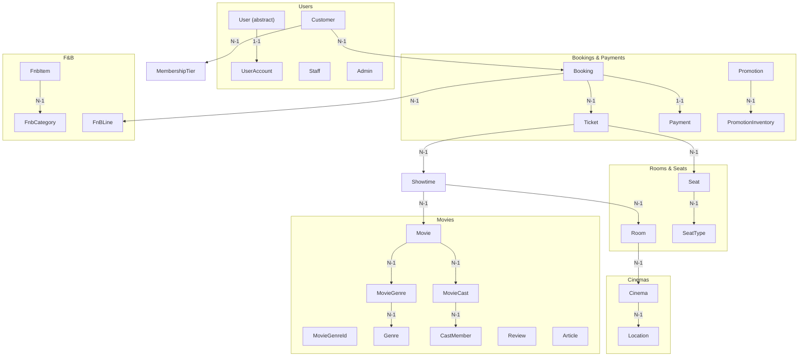
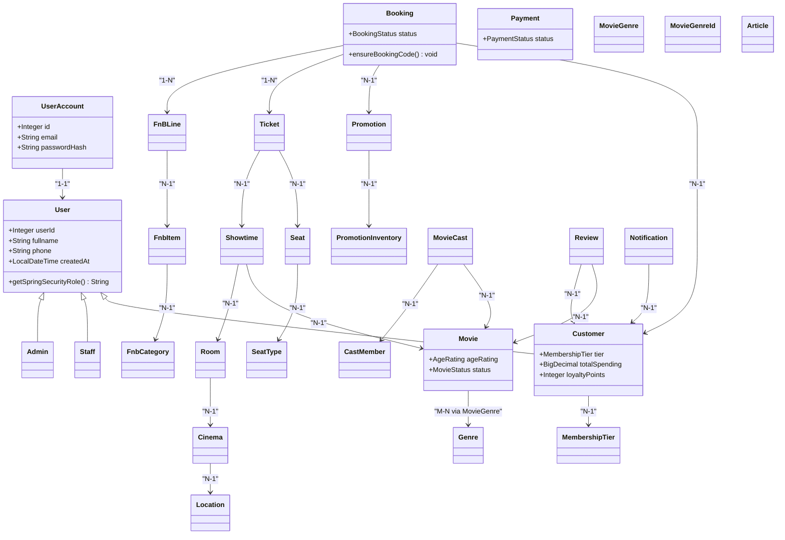
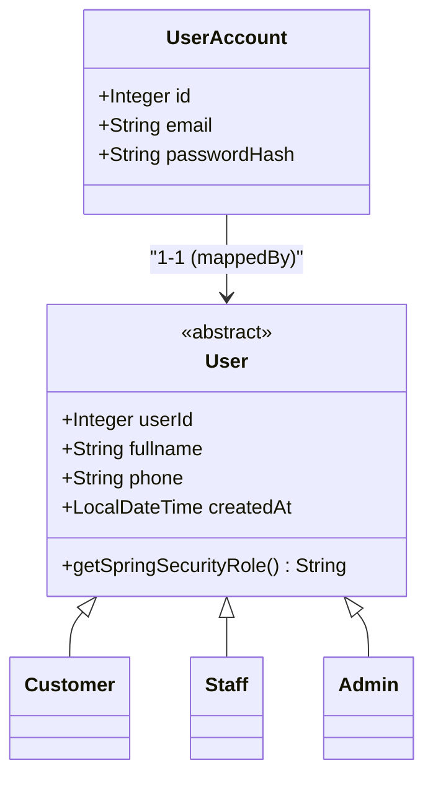
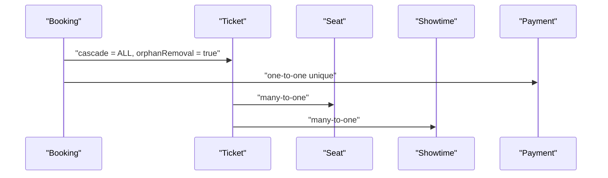
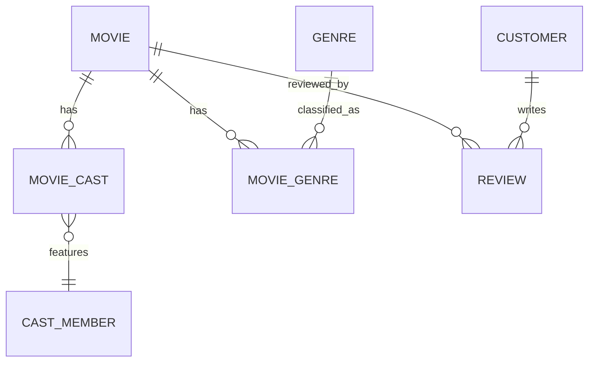
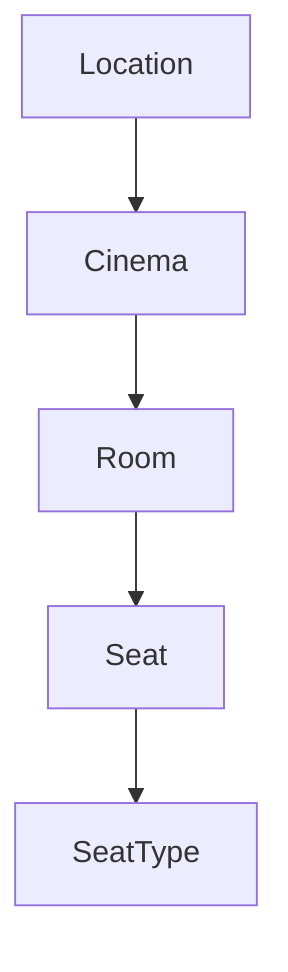
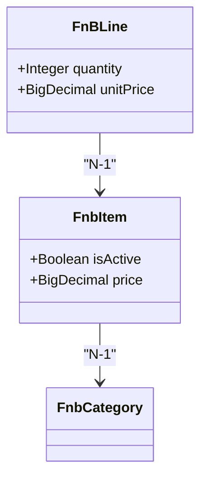
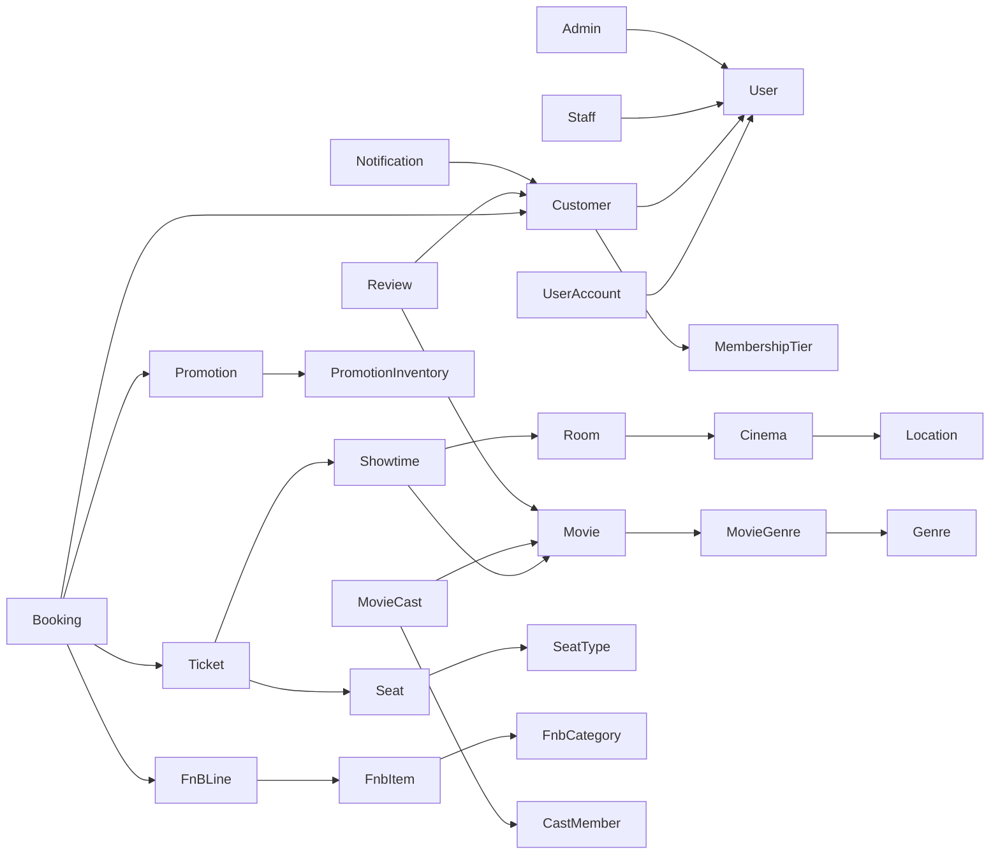

# Data Models

<cite>
**Referenced Files in This Document**
- [User.java](file://backend/src/main/java/com/cinema/booking/entities/User.java)
- [Admin.java](file://backend/src/main/java/com/cinema/booking/entities/Admin.java)
- [Customer.java](file://backend/src/main/java/com/cinema/booking/entities/Customer.java)
- [Staff.java](file://backend/src/main/java/com/cinema/booking/entities/Staff.java)
- [UserAccount.java](file://backend/src/main/java/com/cinema/booking/entities/UserAccount.java)
- [Movie.java](file://backend/src/main/java/com/cinema/booking/entities/Movie.java)
- [Showtime.java](file://backend/src/main/java/com/cinema/booking/entities/Showtime.java)
- [Room.java](file://backend/src/main/java/com/cinema/booking/entities/Room.java)
- [Seat.java](file://backend/src/main/java/com/cinema/booking/entities/Seat.java)
- [Ticket.java](file://backend/src/main/java/com/cinema/booking/entities/Ticket.java)
- [Booking.java](file://backend/src/main/java/com/cinema/booking/entities/Booking.java)
- [Payment.java](file://backend/src/main/java/com/cinema/booking/entities/Payment.java)
- [Location.java](file://backend/src/main/java/com/cinema/booking/entities/Location.java)
- [Cinema.java](file://backend/src/main/java/com/cinema/booking/entities/Cinema.java)
- [SeatType.java](file://backend/src/main/java/com/cinema/booking/entities/SeatType.java)
- [MembershipTier.java](file://backend/src/main/java/com/cinema/booking/entities/MembershipTier.java)
- [FnbItem.java](file://backend/src/main/java/com/cinema/booking/entities/FnbItem.java)
- [FnbCategory.java](file://backend/src/main/java/com/cinema/booking/entities/FnbCategory.java)
- [FnBLine.java](file://backend/src/main/java/com/cinema/booking/entities/FnBLine.java)
- [Promotion.java](file://backend/src/main/java/com/cinema/booking/entities/Promotion.java)
- [PromotionInventory.java](file://backend/src/main/java/com/cinema/booking/entities/PromotionInventory.java)
- [MovieGenre.java](file://backend/src/main/java/com/cinema/booking/entities/MovieGenre.java)
- [MovieGenreId.java](file://backend/src/main/java/com/cinema/booking/entities/MovieGenreId.java)
- [Genre.java](file://backend/src/main/java/com/cinema/booking/entities/Genre.java)
- [CastMember.java](file://backend/src/main/java/com/cinema/booking/entities/CastMember.java)
- [MovieCast.java](file://backend/src/main/java/com/cinema/booking/entities/MovieCast.java)
- [Review.java](file://backend/src/main/java/com/cinema/booking/entities/Review.java)
- [Article.java](file://backend/src/main/java/com/cinema/booking/entities/Article.java)
- [Notification.java](file://backend/src/main/java/com/cinema/booking/entities/Notification.java)
</cite>

## Table of Contents
1. [Introduction](#introduction)
2. [Project Structure](#project-structure)
3. [Core Components](#core-components)
4. [Architecture Overview](#architecture-overview)
5. [Detailed Component Analysis](#detailed-component-analysis)
6. [Dependency Analysis](#dependency-analysis)
7. [Performance Considerations](#performance-considerations)
8. [Troubleshooting Guide](#troubleshooting-guide)
9. [Conclusion](#conclusion)

## Introduction
This document provides comprehensive data model documentation mapping the database schema to Java entity classes. It focuses on the 22 core entities and their JPA annotations, field mappings, and relationship configurations. It explains the inheritance strategy using JOINED inheritance for User entities, aggregate boundaries, and entity relationships within each aggregate. It also documents value objects, embeddable classes, enum mappings, temporal types, and custom converters. Entity lifecycle management, cascading operations, and lazy/eager loading strategies are covered, along with domain-driven design principles and how business rules are enforced at the data level.

## Project Structure
The entities reside under the package com.cinema.booking.entities and are organized by domain concepts: Users, Movies, Cinemas, Rooms, Seats, Bookings, Payments, Promotions, F&B, Genres, Cast, Reviews, Articles, and Notifications. Each entity class encapsulates persistence metadata via JPA annotations and often includes enums and embedded identifiers where applicable.

**Diagram sources**
- [User.java:1-38](file://backend/src/main/java/com/cinema/booking/entities/User.java#L1-L38)
- [UserAccount.java:1-30](file://backend/src/main/java/com/cinema/booking/entities/UserAccount.java#L1-L30)
- [Customer.java:1-31](file://backend/src/main/java/com/cinema/booking/entities/Customer.java#L1-L31)
- [Staff.java:1-19](file://backend/src/main/java/com/cinema/booking/entities/Staff.java#L1-L19)
- [Movie.java:1-65](file://backend/src/main/java/com/cinema/booking/entities/Movie.java#L1-L65)
- [MovieCast.java](file://backend/src/main/java/com/cinema/booking/entities/MovieCast.java)
- [CastMember.java](file://backend/src/main/java/com/cinema/booking/entities/CastMember.java)
- [MovieGenre.java](file://backend/src/main/java/com/cinema/booking/entities/MovieGenre.java)
- [MovieGenreId.java](file://backend/src/main/java/com/cinema/booking/entities/MovieGenreId.java)
- [Genre.java](file://backend/src/main/java/com/cinema/booking/entities/Genre.java)
- [Location.java:1-21](file://backend/src/main/java/com/cinema/booking/entities/Location.java#L1-L21)
- [Cinema.java:1-32](file://backend/src/main/java/com/cinema/booking/entities/Cinema.java#L1-L32)
- [Room.java:1-28](file://backend/src/main/java/com/cinema/booking/entities/Room.java#L1-L28)
- [Seat.java:1-34](file://backend/src/main/java/com/cinema/booking/entities/Seat.java#L1-L34)
- [SeatType.java:1-29](file://backend/src/main/java/com/cinema/booking/entities/SeatType.java#L1-L29)
- [Booking.java:1-65](file://backend/src/main/java/com/cinema/booking/entities/Booking.java#L1-L65)
- [Ticket.java:1-38](file://backend/src/main/java/com/cinema/booking/entities/Ticket.java#L1-L38)
- [Showtime.java:1-38](file://backend/src/main/java/com/cinema/booking/entities/Showtime.java#L1-L38)
- [Payment.java:1-44](file://backend/src/main/java/com/cinema/booking/entities/Payment.java#L1-L44)
- [Promotion.java](file://backend/src/main/java/com/cinema/booking/entities/Promotion.java)
- [PromotionInventory.java](file://backend/src/main/java/com/cinema/booking/entities/PromotionInventory.java)
- [FnbItem.java:1-41](file://backend/src/main/java/com/cinema/booking/entities/FnbItem.java#L1-L41)
- [FnbCategory.java](file://backend/src/main/java/com/cinema/booking/entities/FnbCategory.java)
- [FnBLine.java](file://backend/src/main/java/com/cinema/booking/entities/FnBLine.java)
- [Review.java](file://backend/src/main/java/com/cinema/booking/entities/Review.java)
- [Article.java](file://backend/src/main/java/com/cinema/booking/entities/Article.java)
- [Notification.java](file://backend/src/main/java/com/cinema/booking/entities/Notification.java)

**Section sources**
- [User.java:1-38](file://backend/src/main/java/com/cinema/booking/entities/User.java#L1-L38)
- [Movie.java:1-65](file://backend/src/main/java/com/cinema/booking/entities/Movie.java#L1-L65)
- [Showtime.java:1-38](file://backend/src/main/java/com/cinema/booking/entities/Showtime.java#L1-L38)
- [Room.java:1-28](file://backend/src/main/java/com/cinema/booking/entities/Room.java#L1-L28)
- [Seat.java:1-34](file://backend/src/main/java/com/cinema/booking/entities/Seat.java#L1-L34)
- [Ticket.java:1-38](file://backend/src/main/java/com/cinema/booking/entities/Ticket.java#L1-L38)
- [Booking.java:1-65](file://backend/src/main/java/com/cinema/booking/entities/Booking.java#L1-L65)
- [Payment.java:1-44](file://backend/src/main/java/com/cinema/booking/entities/Payment.java#L1-L44)
- [Location.java:1-21](file://backend/src/main/java/com/cinema/booking/entities/Location.java#L1-L21)
- [Cinema.java:1-32](file://backend/src/main/java/com/cinema/booking/entities/Cinema.java#L1-L32)
- [SeatType.java:1-29](file://backend/src/main/java/com/cinema/booking/entities/SeatType.java#L1-L29)
- [MembershipTier.java:1-28](file://backend/src/main/java/com/cinema/booking/entities/MembershipTier.java#L1-L28)
- [FnbItem.java:1-41](file://backend/src/main/java/com/cinema/booking/entities/FnbItem.java#L1-L41)
- [FnbCategory.java](file://backend/src/main/java/com/cinema/booking/entities/FnbCategory.java)
- [FnBLine.java](file://backend/src/main/java/com/cinema/booking/entities/FnBLine.java)
- [Promotion.java](file://backend/src/main/java/com/cinema/booking/entities/Promotion.java)
- [PromotionInventory.java](file://backend/src/main/java/com/cinema/booking/entities/PromotionInventory.java)
- [MovieGenre.java](file://backend/src/main/java/com/cinema/booking/entities/MovieGenre.java)
- [MovieGenreId.java](file://backend/src/main/java/com/cinema/booking/entities/MovieGenreId.java)
- [Genre.java](file://backend/src/main/java/com/cinema/booking/entities/Genre.java)
- [CastMember.java](file://backend/src/main/java/com/cinema/booking/entities/CastMember.java)
- [MovieCast.java](file://backend/src/main/java/com/cinema/booking/entities/MovieCast.java)
- [Review.java](file://backend/src/main/java/com/cinema/booking/entities/Review.java)
- [Article.java](file://backend/src/main/java/com/cinema/booking/entities/Article.java)
- [Notification.java](file://backend/src/main/java/com/cinema/booking/entities/Notification.java)

## Core Components
This section documents the 22 core entities, their JPA annotations, field mappings, and relationships. It also explains inheritance, enums, temporal types, and lifecycle hooks.

- User (abstract)
  - Inheritance: JOINED strategy with primary key join column mapping to users.id
  - Identity: Generated identity
  - Fields: userId, fullname, phone, createdAt
  - Relationships: One-to-one with UserAccount mapped by user
  - Lifecycle: Abstract method getSpringSecurityRole for role assignment
  - Section sources
    - [User.java:1-38](file://backend/src/main/java/com/cinema/booking/entities/User.java#L1-L38)

- Admin
  - Extends User
  - Role: ADMIN
  - Section sources
    - [Admin.java:1-19](file://backend/src/main/java/com/cinema/booking/entities/Admin.java#L1-L19)

- Customer
  - Extends User
  - Role: USER
  - Relationships: Many-to-one with MembershipTier, many-to-one with Booking
  - Fields: totalSpending, loyaltyPoints
  - Section sources
    - [Customer.java:1-31](file://backend/src/main/java/com/cinema/booking/entities/Customer.java#L1-L31)

- Staff
  - Extends User
  - Role: STAFF
  - Section sources
    - [Staff.java:1-19](file://backend/src/main/java/com/cinema/booking/entities/Staff.java#L1-L19)

- UserAccount
  - Identity: Generated identity
  - Relationships: One-to-one with User (unique)
  - Fields: email, passwordHash
  - Section sources
    - [UserAccount.java:1-30](file://backend/src/main/java/com/cinema/booking/entities/UserAccount.java#L1-L30)

- Movie
  - Identity: Generated identity
  - Fields: title, description, durationMinutes, releaseDate, language, ageRating, posterUrl, trailerUrl, status
  - Enums: AgeRating, MovieStatus
  - Relationships: One-to-many with MovieCast
  - Section sources
    - [Movie.java:1-65](file://backend/src/main/java/com/cinema/booking/entities/Movie.java#L1-L65)

- Showtime
  - Identity: Generated identity
  - Relationships: Many-to-one with Movie and Room
  - Fields: startTime, endTime, basePrice
  - Section sources
    - [Showtime.java:1-38](file://backend/src/main/java/com/cinema/booking/entities/Showtime.java#L1-L38)

- Room
  - Identity: Generated identity
  - Relationships: Many-to-one with Cinema
  - Fields: name, screenType
  - Section sources
    - [Room.java:1-28](file://backend/src/main/java/com/cinema/booking/entities/Room.java#L1-L28)

- Seat
  - Identity: Generated identity
  - Relationships: Many-to-one with Room and SeatType
  - Fields: seatCode, isActive
  - Section sources
    - [Seat.java:1-34](file://backend/src/main/java/com/cinema/booking/entities/Seat.java#L1-L34)

- SeatType
  - Identity: Generated identity
  - Fields: name, priceSurcharge
  - Section sources
    - [SeatType.java:1-29](file://backend/src/main/java/com/cinema/booking/entities/SeatType.java#L1-L29)

- Booking
  - Identity: Generated identity
  - Relationships: Many-to-one with Customer and Promotion; one-to-many with FnBLine and Ticket
  - Fields: bookingCode, status, createdAt
  - Enums: BookingStatus
  - Lifecycle: PrePersist ensures bookingCode uniqueness
  - Section sources
    - [Booking.java:1-65](file://backend/src/main/java/com/cinema/booking/entities/Booking.java#L1-L65)

- Ticket
  - Identity: Generated identity
  - Relationships: Many-to-one with Booking, Seat, Showtime
  - Fields: price
  - Section sources
    - [Ticket.java:1-38](file://backend/src/main/java/com/cinema/booking/entities/Ticket.java#L1-L38)

- Payment
  - Identity: Generated identity
  - Relationships: One-to-one with Booking (unique)
  - Fields: paymentMethod, amount, status, paidAt
  - Enums: PaymentStatus
  - Section sources
    - [Payment.java:1-44](file://backend/src/main/java/com/cinema/booking/entities/Payment.java#L1-L44)

- Location
  - Identity: Generated identity
  - Fields: name
  - Section sources
    - [Location.java:1-21](file://backend/src/main/java/com/cinema/booking/entities/Location.java#L1-L21)

- Cinema
  - Identity: Generated identity
  - Relationships: Many-to-one with Location
  - Fields: name, address, hotline
  - Section sources
    - [Cinema.java:1-32](file://backend/src/main/java/com/cinema/booking/entities/Cinema.java#L1-L32)

- MembershipTier
  - Identity: Generated identity
  - Fields: name, minSpending, discountPercent
  - Section sources
    - [MembershipTier.java:1-28](file://backend/src/main/java/com/cinema/booking/entities/MembershipTier.java#L1-L28)

- FnbItem
  - Identity: Generated identity
  - Relationships: Many-to-one with FnbCategory
  - Fields: name, description, price, isActive, imageUrl
  - Section sources
    - [FnbItem.java:1-41](file://backend/src/main/java/com/cinema/booking/entities/FnbItem.java#L1-L41)

- FnbCategory
  - Identity: Generated identity
  - Fields: name
  - Section sources
    - [FnbCategory.java](file://backend/src/main/java/com/cinema/booking/entities/FnbCategory.java)

- FnBLine
  - Identity: Generated identity
  - Relationships: Many-to-one with Booking and FnbItem
  - Fields: quantity, unitPrice
  - Section sources
    - [FnBLine.java](file://backend/src/main/java/com/cinema/booking/entities/FnBLine.java)

- Promotion
  - Identity: Generated identity
  - Fields: name, description, discountRate, startDate, endDate, maxDiscountAmount
  - Section sources
    - [Promotion.java](file://backend/src/main/java/com/cinema/booking/entities/Promotion.java)

- PromotionInventory
  - Identity: Generated identity
  - Relationships: Many-to-one with Promotion
  - Fields: stock, reserved
  - Section sources
    - [PromotionInventory.java](file://backend/src/main/java/com/cinema/booking/entities/PromotionInventory.java)

- MovieGenre
  - Composite key: MovieGenreId
  - Relationships: Many-to-one with Movie and Genre
  - Section sources
    - [MovieGenre.java](file://backend/src/main/java/com/cinema/booking/entities/MovieGenre.java)
    - [MovieGenreId.java](file://backend/src/main/java/com/cinema/booking/entities/MovieGenreId.java)

- Genre
  - Identity: Generated identity
  - Fields: name
  - Section sources
    - [Genre.java](file://backend/src/main/java/com/cinema/booking/entities/Genre.java)

- CastMember
  - Identity: Generated identity
  - Fields: name, role
  - Section sources
    - [CastMember.java](file://backend/src/main/java/com/cinema/booking/entities/CastMember.java)

- MovieCast
  - Identity: Generated identity
  - Relationships: Many-to-one with Movie and CastMember
  - Section sources
    - [MovieCast.java](file://backend/src/main/java/com/cinema/booking/entities/MovieCast.java)

- Review
  - Identity: Generated identity
  - Relationships: Many-to-one with Movie and Customer
  - Fields: rating, comment, reviewDate
  - Section sources
    - [Review.java](file://backend/src/main/java/com/cinema/booking/entities/Review.java)

- Article
  - Identity: Generated identity
  - Fields: title, content, publishDate
  - Section sources
    - [Article.java](file://backend/src/main/java/com/cinema/booking/entities/Article.java)

- Notification
  - Identity: Generated identity
  - Relationships: Many-to-one with Customer
  - Fields: message, read, sentAt
  - Section sources
    - [Notification.java](file://backend/src/main/java/com/cinema/booking/entities/Notification.java)

## Architecture Overview
The data model follows domain-driven design principles with clear aggregates and bounded contexts:
- User aggregate: User, UserAccount, Customer, Staff, Admin
- Movie aggregate: Movie, MovieGenre, Genre, MovieCast, CastMember, Review, Article
- Cinema aggregate: Location, Cinema, Room, Seat, SeatType
- Booking aggregate: Booking, Ticket, Showtime, Payment
- Promotion aggregate: Promotion, PromotionInventory
- F&B aggregate: FnbCategory, FnbItem, FnBLine

**Diagram sources**
- [User.java:1-38](file://backend/src/main/java/com/cinema/booking/entities/User.java#L1-L38)
- [UserAccount.java:1-30](file://backend/src/main/java/com/cinema/booking/entities/UserAccount.java#L1-L30)
- [Customer.java:1-31](file://backend/src/main/java/com/cinema/booking/entities/Customer.java#L1-L31)
- [Staff.java:1-19](file://backend/src/main/java/com/cinema/booking/entities/Staff.java#L1-L19)
- [Admin.java:1-19](file://backend/src/main/java/com/cinema/booking/entities/Admin.java#L1-L19)
- [Movie.java:1-65](file://backend/src/main/java/com/cinema/booking/entities/Movie.java#L1-L65)
- [Showtime.java:1-38](file://backend/src/main/java/com/cinema/booking/entities/Showtime.java#L1-L38)
- [Room.java:1-28](file://backend/src/main/java/com/cinema/booking/entities/Room.java#L1-L28)
- [Seat.java:1-34](file://backend/src/main/java/com/cinema/booking/entities/Seat.java#L1-L34)
- [SeatType.java:1-29](file://backend/src/main/java/com/cinema/booking/entities/SeatType.java#L1-L29)
- [Booking.java:1-65](file://backend/src/main/java/com/cinema/booking/entities/Booking.java#L1-L65)
- [Ticket.java:1-38](file://backend/src/main/java/com/cinema/booking/entities/Ticket.java#L1-L38)
- [Payment.java:1-44](file://backend/src/main/java/com/cinema/booking/entities/Payment.java#L1-L44)
- [Location.java:1-21](file://backend/src/main/java/com/cinema/booking/entities/Location.java#L1-L21)
- [Cinema.java:1-32](file://backend/src/main/java/com/cinema/booking/entities/Cinema.java#L1-L32)
- [MembershipTier.java:1-28](file://backend/src/main/java/com/cinema/booking/entities/MembershipTier.java#L1-L28)
- [FnbItem.java:1-41](file://backend/src/main/java/com/cinema/booking/entities/FnbItem.java#L1-L41)
- [FnbCategory.java](file://backend/src/main/java/com/cinema/booking/entities/FnbCategory.java)
- [FnBLine.java](file://backend/src/main/java/com/cinema/booking/entities/FnBLine.java)
- [Promotion.java](file://backend/src/main/java/com/cinema/booking/entities/Promotion.java)
- [PromotionInventory.java](file://backend/src/main/java/com/cinema/booking/entities/PromotionInventory.java)
- [Genre.java](file://backend/src/main/java/com/cinema/booking/entities/Genre.java)
- [MovieGenre.java](file://backend/src/main/java/com/cinema/booking/entities/MovieGenre.java)
- [MovieGenreId.java](file://backend/src/main/java/com/cinema/booking/entities/MovieGenreId.java)
- [CastMember.java](file://backend/src/main/java/com/cinema/booking/entities/CastMember.java)
- [MovieCast.java](file://backend/src/main/java/com/cinema/booking/entities/MovieCast.java)
- [Review.java](file://backend/src/main/java/com/cinema/booking/entities/Review.java)
- [Article.java](file://backend/src/main/java/com/cinema/booking/entities/Article.java)
- [Notification.java](file://backend/src/main/java/com/cinema/booking/entities/Notification.java)

## Detailed Component Analysis

### User Aggregate
- Inheritance strategy: JOINED inheritance for User with primary key join column mapping to users.id
- Composition: UserAccount is tightly coupled as a dependent entity
- Relationships: Customer, Staff, Admin inherit from User; UserAccount maps to User
- Lifecycle: UserAccount creation is cascaded via one-to-one mapping
- Security roles: Implemented via abstract method getSpringSecurityRole in subclasses

**Diagram sources**
- [User.java:1-38](file://backend/src/main/java/com/cinema/booking/entities/User.java#L1-L38)
- [UserAccount.java:1-30](file://backend/src/main/java/com/cinema/booking/entities/UserAccount.java#L1-L30)
- [Customer.java:1-31](file://backend/src/main/java/com/cinema/booking/entities/Customer.java#L1-L31)
- [Staff.java:1-19](file://backend/src/main/java/com/cinema/booking/entities/Staff.java#L1-L19)
- [Admin.java:1-19](file://backend/src/main/java/com/cinema/booking/entities/Admin.java#L1-L19)

**Section sources**
- [User.java:1-38](file://backend/src/main/java/com/cinema/booking/entities/User.java#L1-L38)
- [UserAccount.java:1-30](file://backend/src/main/java/com/cinema/booking/entities/UserAccount.java#L1-L30)
- [Customer.java:1-31](file://backend/src/main/java/com/cinema/booking/entities/Customer.java#L1-L31)
- [Staff.java:1-19](file://backend/src/main/java/com/cinema/booking/entities/Staff.java#L1-L19)
- [Admin.java:1-19](file://backend/src/main/java/com/cinema/booking/entities/Admin.java#L1-L19)

### Booking Aggregate
- Root entity: Booking
- Child entities: Ticket, FnBLine, Payment
- Relationships: Booking to Customer, Promotion; Ticket to Seat and Showtime; Payment to Booking
- Business rules:
  - Status transitions via methods confirm() and cancel()
  - PrePersist hook ensures bookingCode generation if blank
  - Cascading: Orphan removal for child collections

**Diagram sources**
- [Booking.java:1-65](file://backend/src/main/java/com/cinema/booking/entities/Booking.java#L1-L65)
- [Ticket.java:1-38](file://backend/src/main/java/com/cinema/booking/entities/Ticket.java#L1-L38)
- [Seat.java:1-34](file://backend/src/main/java/com/cinema/booking/entities/Seat.java#L1-L34)
- [Showtime.java:1-38](file://backend/src/main/java/com/cinema/booking/entities/Showtime.java#L1-L38)
- [Payment.java:1-44](file://backend/src/main/java/com/cinema/booking/entities/Payment.java#L1-L44)

**Section sources**
- [Booking.java:1-65](file://backend/src/main/java/com/cinema/booking/entities/Booking.java#L1-L65)
- [Ticket.java:1-38](file://backend/src/main/java/com/cinema/booking/entities/Ticket.java#L1-L38)
- [Seat.java:1-34](file://backend/src/main/java/com/cinema/booking/entities/Seat.java#L1-L34)
- [Showtime.java:1-38](file://backend/src/main/java/com/cinema/booking/entities/Showtime.java#L1-L38)
- [Payment.java:1-44](file://backend/src/main/java/com/cinema/booking/entities/Payment.java#L1-L44)

### Movie Aggregate
- Root entity: Movie
- Related entities: MovieGenre (composite key), Genre, MovieCast, CastMember, Review, Article
- Relationships: Many-to-many via junction table (MovieGenre) and many-to-one with Genre; many-to-many with CastMember via MovieCast

**Diagram sources**
- [Movie.java:1-65](file://backend/src/main/java/com/cinema/booking/entities/Movie.java#L1-L65)
- [MovieGenre.java](file://backend/src/main/java/com/cinema/booking/entities/MovieGenre.java)
- [MovieGenreId.java](file://backend/src/main/java/com/cinema/booking/entities/MovieGenreId.java)
- [Genre.java](file://backend/src/main/java/com/cinema/booking/entities/Genre.java)
- [MovieCast.java](file://backend/src/main/java/com/cinema/booking/entities/MovieCast.java)
- [CastMember.java](file://backend/src/main/java/com/cinema/booking/entities/CastMember.java)
- [Review.java](file://backend/src/main/java/com/cinema/booking/entities/Review.java)
- [Customer.java:1-31](file://backend/src/main/java/com/cinema/booking/entities/Customer.java#L1-L31)

**Section sources**
- [Movie.java:1-65](file://backend/src/main/java/com/cinema/booking/entities/Movie.java#L1-L65)
- [MovieGenre.java](file://backend/src/main/java/com/cinema/booking/entities/MovieGenre.java)
- [MovieGenreId.java](file://backend/src/main/java/com/cinema/booking/entities/MovieGenreId.java)
- [Genre.java](file://backend/src/main/java/com/cinema/booking/entities/Genre.java)
- [MovieCast.java](file://backend/src/main/java/com/cinema/booking/entities/MovieCast.java)
- [CastMember.java](file://backend/src/main/java/com/cinema/booking/entities/CastMember.java)
- [Review.java](file://backend/src/main/java/com/cinema/booking/entities/Review.java)
- [Customer.java:1-31](file://backend/src/main/java/com/cinema/booking/entities/Customer.java#L1-L31)

### Cinema and Seat Aggregate
- Cinema aggregate: Location to Cinema to Room to Seat to SeatType
- Seat.isActive defaults to true; SeatType defines price surcharges per seat category

**Diagram sources**
- [Location.java:1-21](file://backend/src/main/java/com/cinema/booking/entities/Location.java#L1-L21)
- [Cinema.java:1-32](file://backend/src/main/java/com/cinema/booking/entities/Cinema.java#L1-L32)
- [Room.java:1-28](file://backend/src/main/java/com/cinema/booking/entities/Room.java#L1-L28)
- [Seat.java:1-34](file://backend/src/main/java/com/cinema/booking/entities/Seat.java#L1-L34)
- [SeatType.java:1-29](file://backend/src/main/java/com/cinema/booking/entities/SeatType.java#L1-L29)

**Section sources**
- [Location.java:1-21](file://backend/src/main/java/com/cinema/booking/entities/Location.java#L1-L21)
- [Cinema.java:1-32](file://backend/src/main/java/com/cinema/booking/entities/Cinema.java#L1-L32)
- [Room.java:1-28](file://backend/src/main/java/com/cinema/booking/entities/Room.java#L1-L28)
- [Seat.java:1-34](file://backend/src/main/java/com/cinema/booking/entities/Seat.java#L1-L34)
- [SeatType.java:1-29](file://backend/src/main/java/com/cinema/booking/entities/SeatType.java#L1-L29)

### F&B Aggregate
- FnbCategory to FnbItem to FnBLine
- FnbItem.isActive defaults to true; FnBLine captures quantity and unitPrice

**Diagram sources**
- [FnbCategory.java](file://backend/src/main/java/com/cinema/booking/entities/FnbCategory.java)
- [FnbItem.java:1-41](file://backend/src/main/java/com/cinema/booking/entities/FnbItem.java#L1-L41)
- [FnBLine.java](file://backend/src/main/java/com/cinema/booking/entities/FnBLine.java)

**Section sources**
- [FnbCategory.java](file://backend/src/main/java/com/cinema/booking/entities/FnbCategory.java)
- [FnbItem.java:1-41](file://backend/src/main/java/com/cinema/booking/entities/FnbItem.java#L1-L41)
- [FnBLine.java](file://backend/src/main/java/com/cinema/booking/entities/FnBLine.java)

### Enum Mappings and Temporal Types
- Enums: AgeRating, MovieStatus, BookingStatus, PaymentStatus
  - Mapped using EnumType.STRING
  - Defined within entities or alongside them
- Temporal types:
  - LocalDate for releaseDate
  - LocalDateTime for createdAt, paidAt, startTime, endTime, sentAt, reviewDate
- Precision and scale:
  - BigDecimal fields use precision and scale annotations for financial data

**Section sources**
- [Movie.java:57-63](file://backend/src/main/java/com/cinema/booking/entities/Movie.java#L57-L63)
- [Booking.java:46-48](file://backend/src/main/java/com/cinema/booking/entities/Booking.java#L46-L48)
- [Payment.java:40-42](file://backend/src/main/java/com/cinema/booking/entities/Payment.java#L40-L42)
- [Showtime.java:28-35](file://backend/src/main/java/com/cinema/booking/entities/Showtime.java#L28-L35)
- [Booking.java:43-43](file://backend/src/main/java/com/cinema/booking/entities/Booking.java#L43-L43)

### Value Objects and Embeddables
- Composite key: MovieGenreId (embeddable) used by MovieGenre
- No explicit custom converters are defined in the entities examined; temporal and enum handling rely on standard JPA mappings

**Section sources**
- [MovieGenreId.java](file://backend/src/main/java/com/cinema/booking/entities/MovieGenreId.java)
- [MovieGenre.java](file://backend/src/main/java/com/cinema/booking/entities/MovieGenre.java)

### Domain-Driven Design Principles
- Aggregates:
  - User, Booking, Movie, Cinema and Seat, F&B, Promotion are modeled as distinct aggregates with clear roots and boundaries
- Encapsulation:
  - Entities encapsulate business logic (e.g., Booking status transitions)
- Consistency:
  - Cascading operations and orphan removal maintain referential integrity
- Lazy Loading:
  - FetchType.LAZY is used for associations to optimize performance

**Section sources**
- [Booking.java:50-56](file://backend/src/main/java/com/cinema/booking/entities/Booking.java#L50-L56)
- [User.java:29-30](file://backend/src/main/java/com/cinema/booking/entities/User.java#L29-L30)
- [Movie.java:53-55](file://backend/src/main/java/com/cinema/booking/entities/Movie.java#L53-L55)
- [Booking.java:37-41](file://backend/src/main/java/com/cinema/booking/entities/Booking.java#L37-L41)

## Dependency Analysis
This section maps dependencies among entities and highlights potential circular dependencies and external constraints.

**Diagram sources**
- [UserAccount.java:1-30](file://backend/src/main/java/com/cinema/booking/entities/UserAccount.java#L1-L30)
- [User.java:1-38](file://backend/src/main/java/com/cinema/booking/entities/User.java#L1-L38)
- [Customer.java:1-31](file://backend/src/main/java/com/cinema/booking/entities/Customer.java#L1-L31)
- [Staff.java:1-19](file://backend/src/main/java/com/cinema/booking/entities/Staff.java#L1-L19)
- [Admin.java:1-19](file://backend/src/main/java/com/cinema/booking/entities/Admin.java#L1-L19)
- [MembershipTier.java:1-28](file://backend/src/main/java/com/cinema/booking/entities/MembershipTier.java#L1-L28)
- [Booking.java:1-65](file://backend/src/main/java/com/cinema/booking/entities/Booking.java#L1-L65)
- [Promotion.java](file://backend/src/main/java/com/cinema/booking/entities/Promotion.java)
- [PromotionInventory.java](file://backend/src/main/java/com/cinema/booking/entities/PromotionInventory.java)
- [Ticket.java:1-38](file://backend/src/main/java/com/cinema/booking/entities/Ticket.java#L1-L38)
- [Seat.java:1-34](file://backend/src/main/java/com/cinema/booking/entities/Seat.java#L1-L34)
- [Showtime.java:1-38](file://backend/src/main/java/com/cinema/booking/entities/Showtime.java#L1-L38)
- [Movie.java:1-65](file://backend/src/main/java/com/cinema/booking/entities/Movie.java#L1-L65)
- [Room.java:1-28](file://backend/src/main/java/com/cinema/booking/entities/Room.java#L1-L28)
- [Cinema.java:1-32](file://backend/src/main/java/com/cinema/booking/entities/Cinema.java#L1-L32)
- [Location.java:1-21](file://backend/src/main/java/com/cinema/booking/entities/Location.java#L1-L21)
- [SeatType.java:1-29](file://backend/src/main/java/com/cinema/booking/entities/SeatType.java#L1-L29)
- [FnbItem.java:1-41](file://backend/src/main/java/com/cinema/booking/entities/FnbItem.java#L1-L41)
- [FnbCategory.java](file://backend/src/main/java/com/cinema/booking/entities/FnbCategory.java)
- [FnBLine.java](file://backend/src/main/java/com/cinema/booking/entities/FnBLine.java)
- [MovieGenre.java](file://backend/src/main/java/com/cinema/booking/entities/MovieGenre.java)
- [MovieGenreId.java](file://backend/src/main/java/com/cinema/booking/entities/MovieGenreId.java)
- [Genre.java](file://backend/src/main/java/com/cinema/booking/entities/Genre.java)
- [MovieCast.java](file://backend/src/main/java/com/cinema/booking/entities/MovieCast.java)
- [CastMember.java](file://backend/src/main/java/com/cinema/booking/entities/CastMember.java)
- [Review.java](file://backend/src/main/java/com/cinema/booking/entities/Review.java)
- [Notification.java](file://backend/src/main/java/com/cinema/booking/entities/Notification.java)

**Section sources**
- [User.java:1-38](file://backend/src/main/java/com/cinema/booking/entities/User.java#L1-L38)
- [Booking.java:1-65](file://backend/src/main/java/com/cinema/booking/entities/Booking.java#L1-L65)
- [Movie.java:1-65](file://backend/src/main/java/com/cinema/booking/entities/Movie.java#L1-L65)
- [Cinema.java:1-32](file://backend/src/main/java/com/cinema/booking/entities/Cinema.java#L1-L32)
- [Seat.java:1-34](file://backend/src/main/java/com/cinema/booking/entities/Seat.java#L1-L34)
- [FnbItem.java:1-41](file://backend/src/main/java/com/cinema/booking/entities/FnbItem.java#L1-L41)

## Performance Considerations
- Lazy loading: Many associations use FetchType.LAZY to avoid unnecessary joins and improve query performance
- Cascading: Carefully configured cascade types prevent redundant updates and maintain consistency
- Indexes and constraints: Unique constraints on phone, email, bookingCode, and foreign keys are implied by annotations; ensure database-level indexes align with query patterns
- Enum and temporal types: STRING enums and standard temporal types minimize conversion overhead

## Troubleshooting Guide
- Missing bookingCode:
  - Ensure PrePersist logic runs; verify entity is managed before persist
  - Section sources
    - [Booking.java:58-63](file://backend/src/main/java/com/cinema/booking/entities/Booking.java#L58-L63)
- Orphan removal:
  - Verify orphanRemoval = true for collections that should delete detached children
  - Section sources
    - [Booking.java:37-38](file://backend/src/main/java/com/cinema/booking/entities/Booking.java#L37-L38)
    - [Movie.java:53-55](file://backend/src/main/java/com/cinema/booking/entities/Movie.java#L53-L55)
- LazyInitializationException:
  - Access lazy collections inside an active session or fetch eagerly when needed
  - Section sources
    - [Booking.java:25-27](file://backend/src/main/java/com/cinema/booking/entities/Booking.java#L25-L27)
    - [Showtime.java:20-26](file://backend/src/main/java/com/cinema/booking/entities/Showtime.java#L20-L26)

## Conclusion
The data model enforces domain-driven design through well-defined aggregates and clear entity relationships. JPA annotations capture identity, relationships, enums, temporal types, and cascading behavior. The JOINED inheritance strategy for User entities cleanly separates shared attributes from role-specific ones. Business rules are embedded in entities (e.g., Booking status transitions and bookingCode generation), ensuring data-level consistency and predictable behavior.