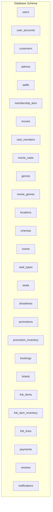
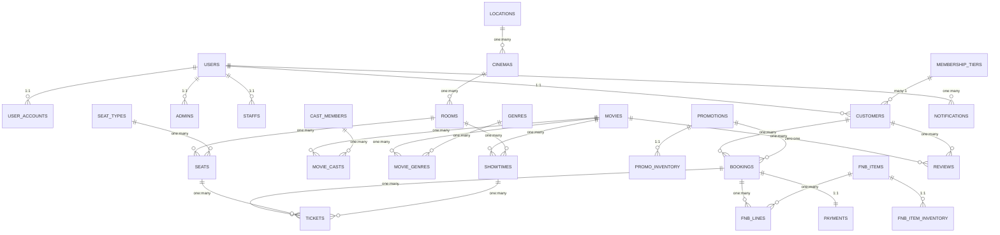
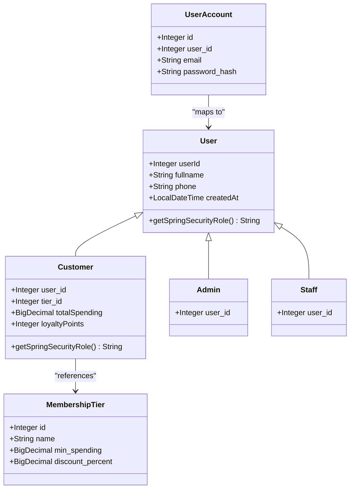
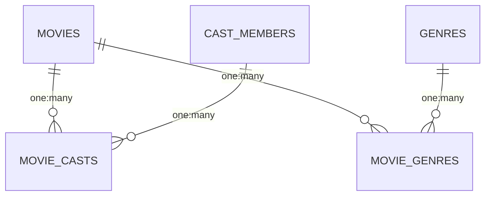
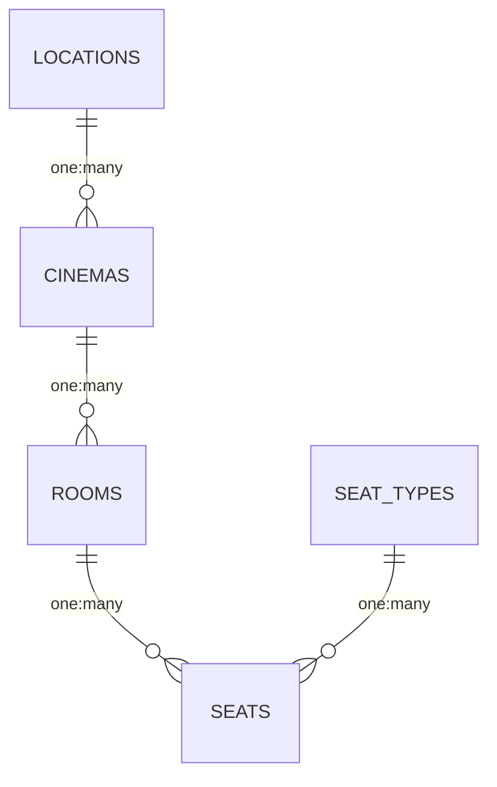
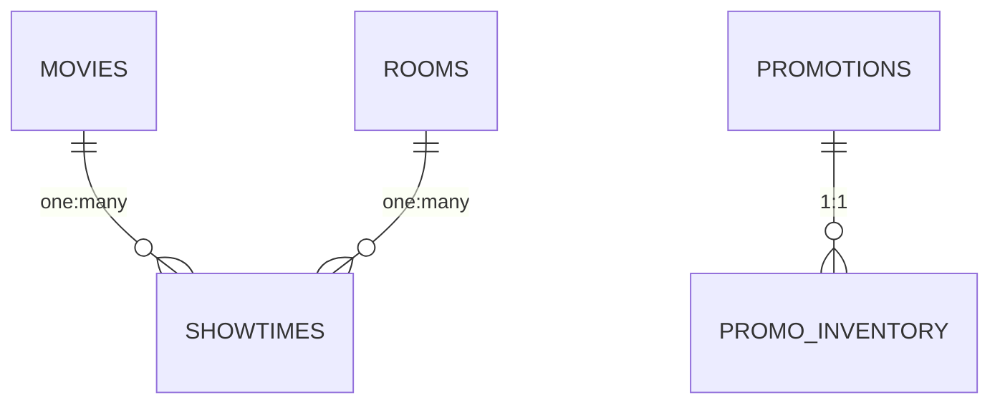
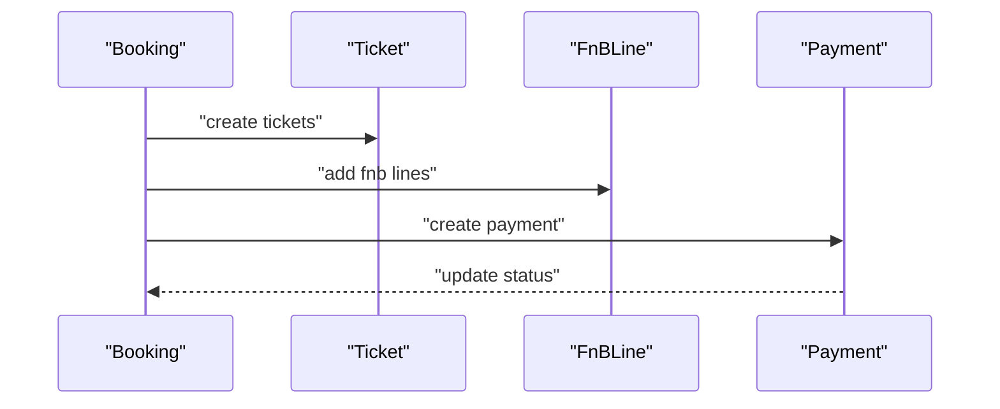
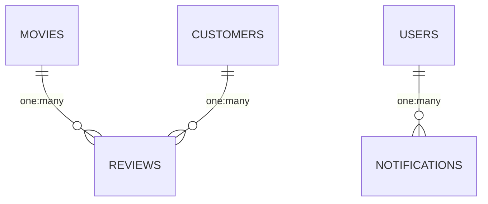
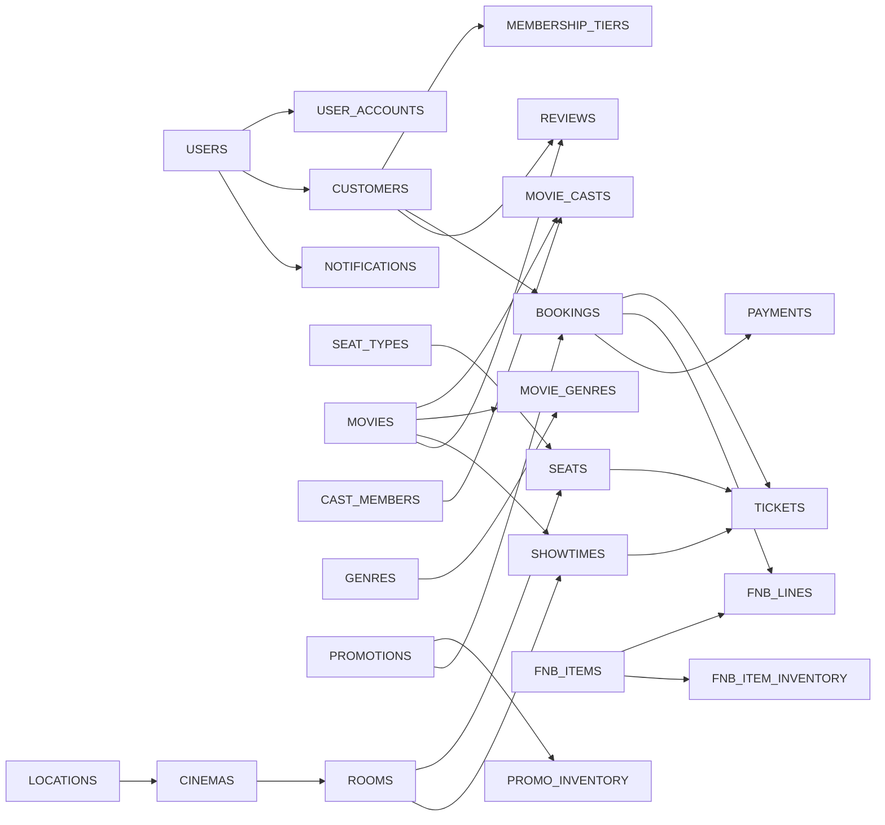

# Database Design

<cite>
**Referenced Files in This Document**
- [database_schema.sql](file://database_schema.sql)
- [mock_data.sql](file://mock_data.sql)
- [application.properties](file://backend/src/main/resources/application.properties)
- [User.java](file://backend/src/main/java/com/cinema/booking/entities/User.java)
- [Customer.java](file://backend/src/main/java/com/cinema/booking/entities/Customer.java)
- [MembershipTier.java](file://backend/src/main/java/com/cinema/booking/entities/MembershipTier.java)
- [UserAccount.java](file://backend/src/main/java/com/cinema/booking/entities/UserAccount.java)
- [Movie.java](file://backend/src/main/java/com/cinema/booking/entities/Movie.java)
- [CastMember.java](file://backend/src/main/java/com/cinema/booking/entities/CastMember.java)
- [MovieCast.java](file://backend/src/main/java/com/cinema/booking/entities/MovieCast.java)
- [Genre.java](file://backend/src/main/java/com/cinema/booking/entities/Genre.java)
- [MovieGenre.java](file://backend/src/main/java/com/cinema/booking/entities/MovieGenre.java)
- [Location.java](file://backend/src/main/java/com/cinema/booking/entities/Location.java)
- [Cinema.java](file://backend/src/main/java/com/cinema/booking/entities/Cinema.java)
- [Room.java](file://backend/src/main/java/com/cinema/booking/entities/Room.java)
- [SeatType.java](file://backend/src/main/java/com/cinema/booking/entities/SeatType.java)
- [Seat.java](file://backend/src/main/java/com/cinema/booking/entities/Seat.java)
- [Showtime.java](file://backend/src/main/java/com/cinema/booking/entities/Showtime.java)
- [Promotion.java](file://backend/src/main/java/com/cinema/booking/entities/Promotion.java)
- [PromotionInventory.java](file://backend/src/main/java/com/cinema/booking/entities/PromotionInventory.java)
- [Booking.java](file://backend/src/main/java/com/cinema/booking/entities/Booking.java)
- [Ticket.java](file://backend/src/main/java/com/cinema/booking/entities/Ticket.java)
- [FnbItem.java](file://backend/src/main/java/com/cinema/booking/entities/FnbItem.java)
- [FnbItemInventory.java](file://backend/src/main/java/com/cinema/booking/entities/FnbItemInventory.java)
- [FnBLine.java](file://backend/src/main/java/com/cinema/booking/entities/FnBLine.java)
- [Payment.java](file://backend/src/main/java/com/cinema/booking/entities/Payment.java)
- [Review.java](file://backend/src/main/java/com/cinema/booking/entities/Review.java)
- [Notification.java](file://backend/src/main/java/com/cinema/booking/entities/Notification.java)
</cite>

## Table of Contents
1. [Introduction](#introduction)
2. [Project Structure](#project-structure)
3. [Core Components](#core-components)
4. [Architecture Overview](#architecture-overview)
5. [Detailed Component Analysis](#detailed-component-analysis)
6. [Dependency Analysis](#dependency-analysis)
7. [Performance Considerations](#performance-considerations)
8. [Troubleshooting Guide](#troubleshooting-guide)
9. [Conclusion](#conclusion)
10. [Appendices](#appendices)

## Introduction
This document provides comprehensive data model documentation for the cinema booking system database. It covers entity definitions, relationships, primary and foreign keys, indexes and constraints, validation and business rules, schema diagrams, sample data structures, data access patterns, caching strategies with Redis, performance considerations, data lifecycle and retention, archival rules, migration and versioning, and security and privacy controls. The model supports two aggregates: User and Movie, plus supporting aggregates for Cinema, Showtime and Promotion, Booking, and auxiliary entities for Reviews and Notifications.

## Project Structure
The database schema is defined via a single SQL script that creates all core tables, constraints, and initial seed data. The application integrates with Spring Boot and JPA/Hibernate, which auto-manages DDL updates against the schema. Redis is configured for caching and session-related TTL.

**Diagram sources**
- [database_schema.sql:1-267](file://database_schema.sql#L1-L267)

**Section sources**
- [database_schema.sql:1-267](file://database_schema.sql#L1-L267)
- [application.properties:8-24](file://backend/src/main/resources/application.properties#L8-L24)

## Core Components
This section documents the 22 core entities, their fields, data types, constraints, and relationships. Where applicable, we also describe indexes and business rules.

- Users and Accounts
  - users: id (PK), fullname, phone (unique), created_at
  - user_accounts: id (PK), user_id (FK to users, unique), email (unique, not null), password_hash (not null)
  - customers: user_id (PK, FK to users), tier_id (FK to membership_tiers), total_spending, loyalty_points
  - admins: user_id (PK, FK to users)
  - staffs: user_id (PK, FK to users)
  - membership_tiers: id (PK), name, min_spending, discount_percent

- Movies and Cast
  - movies: id (PK), title, description, duration_minutes, release_date, language, age_rating, poster_url, trailer_url, status
  - cast_members: id (PK), full_name, bio, birth_date, nationality, image_url
  - movie_casts: id (PK), movie_id (FK to movies), cast_member_id (FK to cast_members), role_name, role_type
  - genres: id (PK), name
  - movie_genres: movie_id (PK, FK to movies), genre_id (PK, FK to genres)

- Cinema and Rooms
  - locations: id (PK), name
  - cinemas: id (PK), location_id (FK to locations), name, address
  - rooms: id (PK), cinema_id (FK to cinemas), name, screen_type
  - seat_types: id (PK), name, price_surcharge
  - seats: id (PK), room_id (FK to rooms), seat_type_id (FK to seat_types), seat_code

- Showtimes and Promotions
  - showtimes: id (PK), movie_id (FK to movies), room_id (FK to rooms), start_time, end_time, base_price
  - promotions: id (PK), code (unique), discount_type, discount_value, valid_to
  - promotion_inventory: id (PK), promotion_id (FK to promotions, unique), quantity, version

- Booking and Payments
  - bookings: id (PK), booking_code (unique), customer_id (FK to customers), promotion_id (FK to promotions), status, created_at
  - tickets: id (PK), booking_id (FK to bookings), seat_id (FK to seats), showtime_id (FK to showtimes), price
  - fnb_items: id (PK), name, description, price, is_active, image_url
  - fnb_item_inventory: id (PK), item_id (FK to fnb_items, unique), quantity, version
  - fnb_lines: id (PK), booking_id (FK to bookings), item_id (FK to fnb_items), quantity, unit_price
  - payments: id (PK), booking_id (FK to bookings, unique), amount, status, method, paid_at

- Reviews and Notifications
  - reviews: id (PK), movie_id (FK to movies), customer_id (FK to customers), rating (check 1..5), comment
  - notifications: id (PK), user_id (FK to users), title, message, is_read

Constraints and indexes:
- Unique constraints: phone (users), email (user_accounts), booking_code (bookings), code (promotions), seat_code (seats)
- Foreign keys: enforce referential integrity across all relationships
- Check constraint: rating in reviews must be between 1 and 5
- Enumerations: status for movies, bookings, payments; role_type for cast roles; screen_type for rooms; discount_type for promotions
- Auto-generated identifiers and timestamps where appropriate

Sample data structures:
- Users and accounts with joined inheritance for roles
- Seat types and seating layout per room
- Showtimes spanning multiple days and movies
- Promotions with inventory and validity windows
- Bookings with tickets and FnB lines, linked to payments

**Section sources**
- [database_schema.sql:9-267](file://database_schema.sql#L9-L267)
- [mock_data.sql:4-292](file://mock_data.sql#L4-L292)

## Architecture Overview
The database follows a normalized relational design with explicit many-to-many relationships via junction tables. The application uses Spring Data JPA with Hibernate, enabling automatic DDL updates and strong typing for enums and relationships.

**Diagram sources**
- [database_schema.sql:9-267](file://database_schema.sql#L9-L267)

## Detailed Component Analysis

### Users and Roles (Joined Inheritance)
- Entity: User (abstract base)
- Subclasses: Customer, Admin, Staff (joined inheritance)
- Account separation: UserAccount holds credentials and links to User via 1-1
- Membership tiers: Customer references tier with spending and points metrics

**Diagram sources**
- [User.java:13-37](file://backend/src/main/java/com/cinema/booking/entities/User.java#L13-L37)
- [UserAccount.java](file://backend/src/main/java/com/cinema/booking/entities/UserAccount.java)
- [Customer.java:14-30](file://backend/src/main/java/com/cinema/booking/entities/Customer.java#L14-L30)
- [MembershipTier.java](file://backend/src/main/java/com/cinema/booking/entities/MembershipTier.java)
- [database_schema.sql:9-57](file://database_schema.sql#L9-L57)

**Section sources**
- [User.java:13-37](file://backend/src/main/java/com/cinema/booking/entities/User.java#L13-L37)
- [Customer.java:14-30](file://backend/src/main/java/com/cinema/booking/entities/Customer.java#L14-L30)
- [MembershipTier.java](file://backend/src/main/java/com/cinema/booking/entities/MembershipTier.java)
- [UserAccount.java](file://backend/src/main/java/com/cinema/booking/entities/UserAccount.java)
- [database_schema.sql:9-57](file://database_schema.sql#L9-L57)

### Movies, Cast, and Genres
- Many-to-many between movies and genres via movie_genres
- Many-to-many between movies and cast members via movie_casts with role metadata

**Diagram sources**
- [database_schema.sql:63-108](file://database_schema.sql#L63-L108)

**Section sources**
- [Movie.java:11-64](file://backend/src/main/java/com/cinema/booking/entities/Movie.java#L11-L64)
- [CastMember.java](file://backend/src/main/java/com/cinema/booking/entities/CastMember.java)
- [MovieCast.java:14-42](file://backend/src/main/java/com/cinema/booking/entities/MovieCast.java#L14-L42)
- [Genre.java](file://backend/src/main/java/com/cinema/booking/entities/Genre.java)
- [MovieGenre.java:10-29](file://backend/src/main/java/com/cinema/booking/entities/MovieGenre.java#L10-L29)
- [database_schema.sql:63-108](file://database_schema.sql#L63-L108)

### Cinema, Rooms, Seats, and Seat Types
- Locations host Cinemas; Cinemas host Rooms; Rooms host Seats
- Seat types define surcharges applied to seat pricing

**Diagram sources**
- [database_schema.sql:114-149](file://database_schema.sql#L114-L149)

**Section sources**
- [Location.java:12-20](file://backend/src/main/java/com/cinema/booking/entities/Location.java#L12-L20)
- [Cinema.java:12-30](file://backend/src/main/java/com/cinema/booking/entities/Cinema.java#L12-L30)
- [Room.java:12-27](file://backend/src/main/java/com/cinema/booking/entities/Room.java#L12-L27)
- [SeatType.java:15-27](file://backend/src/main/java/com/cinema/booking/entities/SeatType.java#L15-L27)
- [Seat.java:12-33](file://backend/src/main/java/com/cinema/booking/entities/Seat.java#L12-L33)
- [database_schema.sql:114-149](file://database_schema.sql#L114-L149)

### Showtimes and Promotions
- Showtimes link movies and rooms with start/end times and base prices
- Promotions define discount mechanics and validity windows; inventory tracks availability and concurrency

**Diagram sources**
- [database_schema.sql:155-180](file://database_schema.sql#L155-L180)

**Section sources**
- [Showtime.java:14-37](file://backend/src/main/java/com/cinema/booking/entities/Showtime.java#L14-L37)
- [Promotion.java:14-40](file://backend/src/main/java/com/cinema/booking/entities/Promotion.java#L14-L40)
- [PromotionInventory.java](file://backend/src/main/java/com/cinema/booking/entities/PromotionInventory.java)
- [database_schema.sql:155-180](file://database_schema.sql#L155-L180)

### Booking, Tickets, FnB, and Payments
- Bookings aggregate tickets and FnB lines; Payments link to a single booking
- Business rules: booking status transitions, FnB inventory tie-in, payment status tracking

**Diagram sources**
- [Booking.java:16-64](file://backend/src/main/java/com/cinema/booking/entities/Booking.java#L16-L64)
- [Ticket.java:16-37](file://backend/src/main/java/com/cinema/booking/entities/Ticket.java#L16-L37)
- [FnBLine.java:17-38](file://backend/src/main/java/com/cinema/booking/entities/FnBLine.java#L17-L38)
- [Payment.java:17-43](file://backend/src/main/java/com/cinema/booking/entities/Payment.java#L17-L43)
- [database_schema.sql:186-244](file://database_schema.sql#L186-L244)

**Section sources**
- [Booking.java:16-64](file://backend/src/main/java/com/cinema/booking/entities/Booking.java#L16-L64)
- [Ticket.java:16-37](file://backend/src/main/java/com/cinema/booking/entities/Ticket.java#L16-L37)
- [FnbItem.java](file://backend/src/main/java/com/cinema/booking/entities/FnbItem.java)
- [FnbItemInventory.java](file://backend/src/main/java/com/cinema/booking/entities/FnbItemInventory.java)
- [FnBLine.java:17-38](file://backend/src/main/java/com/cinema/booking/entities/FnBLine.java#L17-L38)
- [Payment.java:17-43](file://backend/src/main/java/com/cinema/booking/entities/Payment.java#L17-L43)
- [database_schema.sql:186-244](file://database_schema.sql#L186-L244)

### Reviews and Notifications
- Reviews connect customers to movies with rating checks
- Notifications link users to messages with read/unread state

**Diagram sources**
- [database_schema.sql:250-267](file://database_schema.sql#L250-L267)

**Section sources**
- [Review.java](file://backend/src/main/java/com/cinema/booking/entities/Review.java)
- [Notification.java](file://backend/src/main/java/com/cinema/booking/entities/Notification.java)
- [database_schema.sql:250-267](file://database_schema.sql#L250-L267)

## Dependency Analysis
- Tight coupling exists along foreign key chains (e.g., seats depend on rooms, rooms on cinemas, etc.), ensuring referential integrity
- Many-to-many relationships are explicit via junction tables, avoiding implicit joins
- Enums and constraints enforce business rules at the database level

**Diagram sources**
- [database_schema.sql:9-267](file://database_schema.sql#L9-L267)

**Section sources**
- [database_schema.sql:9-267](file://database_schema.sql#L9-L267)

## Performance Considerations
- Indexes and constraints: Unique indexes on phone, email, booking_code, code, seat_code; foreign keys ensure fast joins
- Enumerations reduce storage and improve query readability
- Denormalized fields (e.g., unit_price in fnb_lines) capture historical pricing for auditability
- Caching with Redis: configured TTL for caching strategies; see Redis configuration in application properties
- Data volume: showtimes and tickets can grow quickly; consider partitioning or archiving older showtimes and completed bookings after retention periods

[No sources needed since this section provides general guidance]

## Troubleshooting Guide
- Constraint violations: check unique constraints (phone, email, booking_code, code, seat_code) and foreign keys before inserts/updates
- Rating validation: ensure review ratings fall within 1–5
- Promotion usage: verify promotion validity and inventory before applying discounts
- Payment status: ensure payments are linked to confirmed bookings and reflect correct amounts and methods

**Section sources**
- [database_schema.sql:250-267](file://database_schema.sql#L250-L267)
- [Promotion.java:14-40](file://backend/src/main/java/com/cinema/booking/entities/Promotion.java#L14-L40)
- [PromotionInventory.java](file://backend/src/main/java/com/cinema/booking/entities/PromotionInventory.java)
- [Payment.java:17-43](file://backend/src/main/java/com/cinema/booking/entities/Payment.java#L17-L43)

## Conclusion
The cinema booking system database employs a normalized relational design with explicit many-to-many relationships and strict constraints to enforce business rules. Joined inheritance cleanly separates user roles and account credentials. The schema supports robust booking workflows, dynamic pricing, and promotional campaigns, while Redis caching and enum-based fields improve performance and maintainability.

[No sources needed since this section summarizes without analyzing specific files]

## Appendices

### Data Access Patterns
- Aggregated queries: join bookings with tickets and fnb_lines for transaction summaries
- Availability checks: seat availability via seat locks and inventory counts
- Reporting: showtime capacity, occupancy rates, revenue by movie and date

[No sources needed since this section provides general guidance]

### Caching Strategies with Redis
- Configure Redis host, port, credentials, and TTL in application properties
- Use caching for frequently accessed entities (e.g., showtimes, movies, seat layouts) with TTL aligned to business needs

**Section sources**
- [application.properties:59-66](file://backend/src/main/resources/application.properties#L59-L66)

### Data Lifecycle, Retention, and Archival
- Retention: keep booking and payment history for financial and audit compliance
- Archival: move completed showtimes and old bookings to historical partitions or external storage after fixed retention windows
- Deletion: soft-delete patterns recommended for user data per privacy regulations

[No sources needed since this section provides general guidance]

### Migration Paths and Version Management
- Use explicit schema versioning and controlled migrations; avoid relying solely on auto-DDL in production
- Track promotion_inventory.version for optimistic locking during concurrent redemption
- Maintain backward compatibility for enums and constraints

**Section sources**
- [PromotionInventory.java](file://backend/src/main/java/com/cinema/booking/entities/PromotionInventory.java)
- [application.properties:21-24](file://backend/src/main/resources/application.properties#L21-L24)

### Security, Privacy, and Access Control
- Password hashing: stored as bcrypt hashes in user_accounts
- Role-based access control: roles enforced via joined inheritance and Spring Security role names
- Sensitive data: limit exposure of personal information; apply masking and encryption as needed
- Audit trails: timestamps and immutable fields support compliance

**Section sources**
- [User.java:32-37](file://backend/src/main/java/com/cinema/booking/entities/User.java#L32-L37)
- [Customer.java:26-29](file://backend/src/main/java/com/cinema/booking/entities/Customer.java#L26-L29)
- [UserAccount.java](file://backend/src/main/java/com/cinema/booking/entities/UserAccount.java)

### Sample Data Structures
- Users and roles: sample rows demonstrate joined inheritance and hashed passwords
- Seating: sample seat layouts per room with seat types and codes
- Showtimes: multi-day schedule across multiple movies and rooms
- Promotions: percent and fixed-value discounts with validity and inventory
- Bookings: tickets and FnB lines with payment statuses

**Section sources**
- [mock_data.sql:4-292](file://mock_data.sql#L4-L292)