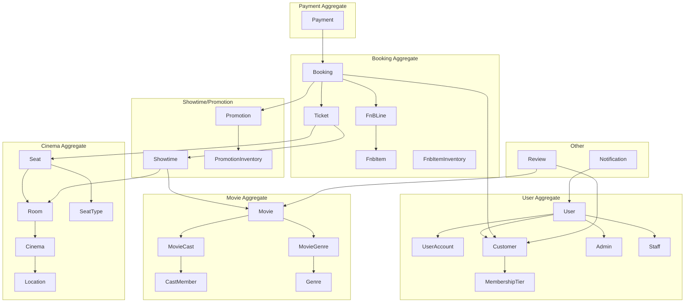
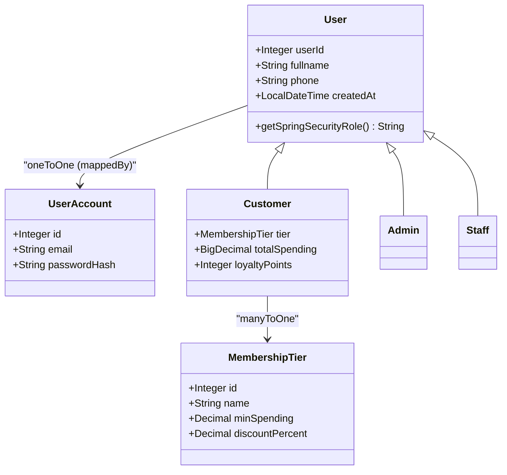
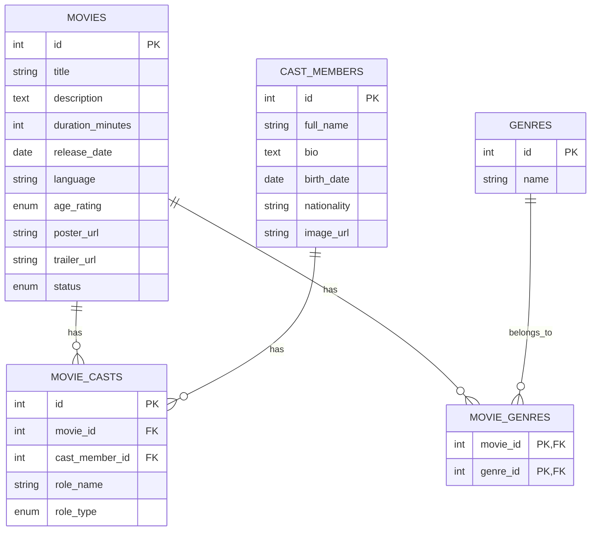
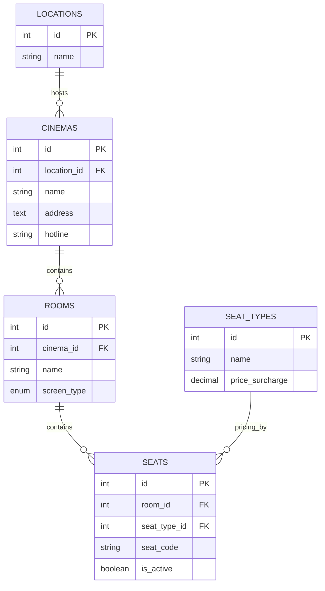
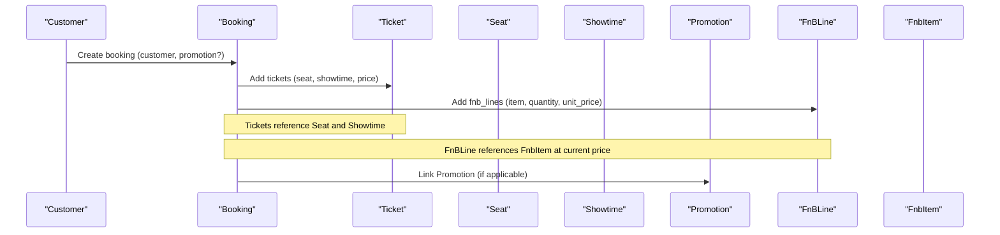
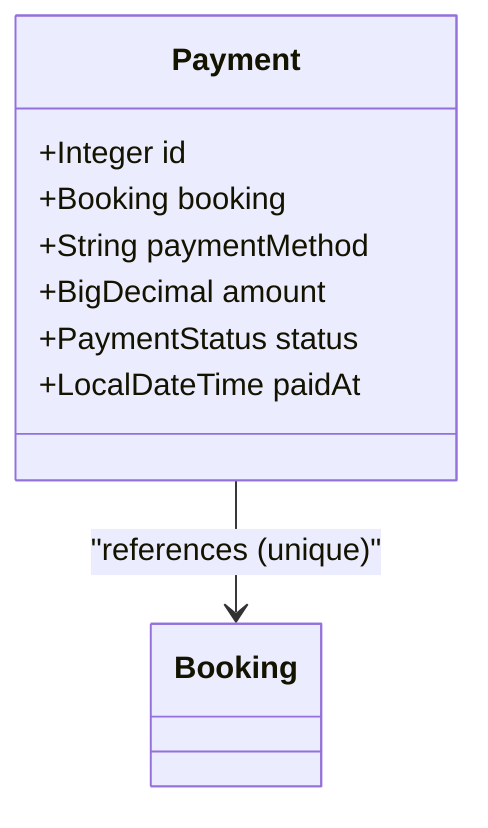
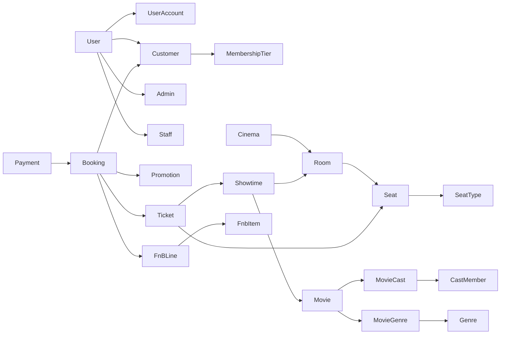

# Entity Relationships

<cite>
**Referenced Files in This Document**
- [database_schema.sql](file://database_schema.sql)
- [User.java](file://backend/src/main/java/com/cinema/booking/entities/User.java)
- [Customer.java](file://backend/src/main/java/com/cinema/booking/entities/Customer.java)
- [Admin.java](file://backend/src/main/java/com/cinema/booking/entities/Admin.java)
- [Staff.java](file://backend/src/main/java/com/cinema/booking/entities/Staff.java)
- [MembershipTier.java](file://backend/src/main/java/com/cinema/booking/entities/MembershipTier.java)
- [UserAccount.java](file://backend/src/main/java/com/cinema/booking/entities/UserAccount.java)
- [Movie.java](file://backend/src/main/java/com/cinema/booking/entities/Movie.java)
- [CastMember.java](file://backend/src/main/java/com/cinema/booking/entities/CastMember.java)
- [MovieCast.java](file://backend/src/main/java/com/cinema/booking/entities/MovieCast.java)
- [Genre.java](file://backend/src/main/java/com/cinema/booking/entities/Genre.java)
- [MovieGenre.java](file://backend/src/main/java/com/cinema/booking/entities/MovieGenre.java)
- [Cinema.java](file://backend/src/main/java/com/cinema/booking/entities/Cinema.java)
- [Location.java](file://backend/src/main/java/com/cinema/booking/entities/Location.java)
- [Room.java](file://backend/src/main/java/com/cinema/booking/entities/Room.java)
- [SeatType.java](file://backend/src/main/java/com/cinema/booking/entities/SeatType.java)
- [Seat.java](file://backend/src/main/java/com/cinema/booking/entities/Seat.java)
- [Showtime.java](file://backend/src/main/java/com/cinema/booking/entities/Showtime.java)
- [Promotion.java](file://backend/src/main/java/com/cinema/booking/entities/Promotion.java)
- [PromotionInventory.java](file://backend/src/main/java/com/cinema/booking/entities/PromotionInventory.java)
- [Booking.java](file://backend/src/main/java/com/cinema/booking/entities/Booking.java)
- [Ticket.java](file://backend/src/main/java/com/cinema/booking/entities/Ticket.java)
- [FnBLine.java](file://backend/src/main/java/com/cinema/booking/entities/FnBLine.java)
- [FnbItem.java](file://backend/src/main/java/com/cinema/booking/entities/FnbItem.java)
- [FnbItemInventory.java](file://backend/src/main/java/com/cinema/booking/entities/FnbItemInventory.java)
- [Payment.java](file://backend/src/main/java/com/cinema/booking/entities/Payment.java)
- [Review.java](file://backend/src/main/java/com/cinema/booking/entities/Review.java)
- [Notification.java](file://backend/src/main/java/com/cinema/booking/entities/Notification.java)
</cite>

## Table of Contents
1. [Introduction](#introduction)
2. [Project Structure](#project-structure)
3. [Core Components](#core-components)
4. [Architecture Overview](#architecture-overview)
5. [Detailed Component Analysis](#detailed-component-analysis)
6. [Dependency Analysis](#dependency-analysis)
7. [Performance Considerations](#performance-considerations)
8. [Troubleshooting Guide](#troubleshooting-guide)
9. [Conclusion](#conclusion)
10. [Appendices](#appendices)

## Introduction
This document provides comprehensive entity relationship documentation for the cinema booking system. It details the 22 core entities grouped into aggregates (User, Movie, Cinema, Showtime/Promotion, Booking, Payment, and supporting entities), including primary keys, foreign keys, many-to-many relationships via explicit junction tables, inheritance strategy, and referential integrity constraints. Business rules embedded in relationships are explained alongside aggregate boundaries and interaction patterns.

## Project Structure
The system organizes entities into cohesive aggregates:
- User Aggregate: User, Customer, Admin, Staff, MembershipTier, UserAccount
- Movie Aggregate: Movie, CastMember, MovieCast, Genre, MovieGenre
- Cinema Aggregate: Location, Cinema, Room, SeatType, Seat
- Showtime/Promotion: Showtime, Promotion, PromotionInventory
- Booking Aggregate: Booking, Ticket, FnBLine, FnbItem, FnbItemInventory
- Payment Aggregate: Payment
- Other Entities: Review, Notification



**Diagram sources**
- [database_schema.sql:9-267](file://database_schema.sql#L9-L267)
- [User.java:1-38](file://backend/src/main/java/com/cinema/booking/entities/User.java#L1-L38)
- [Customer.java:1-31](file://backend/src/main/java/com/cinema/booking/entities/Customer.java#L1-L31)
- [Admin.java:1-19](file://backend/src/main/java/com/cinema/booking/entities/Admin.java#L1-L19)
- [Staff.java:1-19](file://backend/src/main/java/com/cinema/booking/entities/Staff.java#L1-L19)
- [MembershipTier.java](file://backend/src/main/java/com/cinema/booking/entities/MembershipTier.java)
- [UserAccount.java](file://backend/src/main/java/com/cinema/booking/entities/UserAccount.java)
- [Movie.java:1-65](file://backend/src/main/java/com/cinema/booking/entities/Movie.java#L1-L65)
- [CastMember.java](file://backend/src/main/java/com/cinema/booking/entities/CastMember.java)
- [MovieCast.java:1-43](file://backend/src/main/java/com/cinema/booking/entities/MovieCast.java#L1-L43)
- [Genre.java](file://backend/src/main/java/com/cinema/booking/entities/Genre.java)
- [MovieGenre.java:1-30](file://backend/src/main/java/com/cinema/booking/entities/MovieGenre.java#L1-L30)
- [Cinema.java:1-32](file://backend/src/main/java/com/cinema/booking/entities/Cinema.java#L1-L32)
- [Location.java](file://backend/src/main/java/com/cinema/booking/entities/Location.java)
- [Room.java:1-28](file://backend/src/main/java/com/cinema/booking/entities/Room.java#L1-L28)
- [SeatType.java](file://backend/src/main/java/com/cinema/booking/entities/SeatType.java)
- [Seat.java:1-34](file://backend/src/main/java/com/cinema/booking/entities/Seat.java#L1-L34)
- [Showtime.java:1-38](file://backend/src/main/java/com/cinema/booking/entities/Showtime.java#L1-L38)
- [Promotion.java](file://backend/src/main/java/com/cinema/booking/entities/Promotion.java)
- [PromotionInventory.java](file://backend/src/main/java/com/cinema/booking/entities/PromotionInventory.java)
- [Booking.java:1-65](file://backend/src/main/java/com/cinema/booking/entities/Booking.java#L1-L65)
- [Ticket.java:1-38](file://backend/src/main/java/com/cinema/booking/entities/Ticket.java#L1-L38)
- [FnBLine.java](file://backend/src/main/java/com/cinema/booking/entities/FnBLine.java)
- [FnbItem.java](file://backend/src/main/java/com/cinema/booking/entities/FnbItem.java)
- [FnbItemInventory.java](file://backend/src/main/java/com/cinema/booking/entities/FnbItemInventory.java)
- [Payment.java:1-44](file://backend/src/main/java/com/cinema/booking/entities/Payment.java#L1-L44)
- [Review.java](file://backend/src/main/java/com/cinema/booking/entities/Review.java)
- [Notification.java](file://backend/src/main/java/com/cinema/booking/entities/Notification.java)

**Section sources**
- [database_schema.sql:1-267](file://database_schema.sql#L1-L267)
- [User.java:1-38](file://backend/src/main/java/com/cinema/booking/entities/User.java#L1-L38)
- [Customer.java:1-31](file://backend/src/main/java/com/cinema/booking/entities/Customer.java#L1-L31)
- [Admin.java:1-19](file://backend/src/main/java/com/cinema/booking/entities/Admin.java#L1-L19)
- [Staff.java:1-19](file://backend/src/main/java/com/cinema/booking/entities/Staff.java#L1-L19)

## Core Components
This section documents each core entity’s primary key, attributes, and relationships. Cardinalities and referential integrity constraints are derived from the database schema and JPA annotations.

- User Aggregate
  - User: Abstract base entity with identity id, personal info, and lifecycle timestamp. One-to-one with UserAccount. Inheritance strategy JOINED.
  - UserAccount: Identity id, unique email, password hash, and foreign key to User with cascade delete.
  - Customer: Joined inheritance mapped by user_id, with tier (MembershipTier), spending, and loyalty points.
  - Admin: Joined inheritance mapped by user_id.
  - Staff: Joined inheritance mapped by user_id.
  - MembershipTier: Identity id, name, min_spending, discount_percent.

- Movie Aggregate
  - Movie: Identity id, metadata, status, and collections for casts and genres.
  - CastMember: Identity id, personal/professional info.
  - MovieCast: Identity id, role_name, role_type (ACTOR, DIRECTOR), many-to-one to Movie and CastMember.
  - Genre: Identity id, name.
  - MovieGenre: Explicit junction table with composite primary key (movie_id, genre_id), many-to-one to Movie and Genre.

- Cinema Aggregate
  - Location: Identity id, name.
  - Cinema: Identity id, name, address, many-to-one to Location.
  - Room: Identity id, name, screen_type, many-to-one to Cinema.
  - SeatType: Identity id, name, price_surcharge.
  - Seat: Identity id, seat_code, many-to-one to Room and SeatType.

- Showtime/Promotion
  - Showtime: Identity id, start/end times, base_price, many-to-one to Movie and Room.
  - Promotion: Identity id, code, discount_type, discount_value, valid_to.
  - PromotionInventory: Identity id, unique promotion_id, quantity, version, one-to-one with Promotion.

- Booking Aggregate
  - Booking: Identity id, booking_code (unique), status (PENDING, CONFIRMED, CANCELLED, REFUNDED), many-to-one to Customer and Promotion, collections for Tickets and FnBLine.
  - Ticket: Identity id, price, many-to-one to Booking, Seat, Showtime.
  - FnBLine: Identity id, quantity, unit_price, many-to-one to Booking and FnbItem.
  - FnbItem: Identity id, name, description, price, is_active, image_url.
  - FnbItemInventory: Identity id, unique item_id, quantity, version, one-to-one with FnbItem.

- Payment Aggregate
  - Payment: Identity id, unique booking_id, amount, status (PENDING, SUCCESS, FAILED), method (CASH, MOMO, VNPAY), paid_at, many-to-one to Booking.

- Other Entities
  - Review: Identity id, rating check constraint (1..5), many-to-one to Movie and Customer.
  - Notification: Identity id, title, message, is_read, many-to-one to User.

**Section sources**
- [database_schema.sql:9-267](file://database_schema.sql#L9-L267)
- [User.java:1-38](file://backend/src/main/java/com/cinema/booking/entities/User.java#L1-L38)
- [Customer.java:1-31](file://backend/src/main/java/com/cinema/booking/entities/Customer.java#L1-L31)
- [Admin.java:1-19](file://backend/src/main/java/com/cinema/booking/entities/Admin.java#L1-L19)
- [Staff.java:1-19](file://backend/src/main/java/com/cinema/booking/entities/Staff.java#L1-L19)
- [MembershipTier.java](file://backend/src/main/java/com/cinema/booking/entities/MembershipTier.java)
- [UserAccount.java](file://backend/src/main/java/com/cinema/booking/entities/UserAccount.java)
- [Movie.java:1-65](file://backend/src/main/java/com/cinema/booking/entities/Movie.java#L1-L65)
- [CastMember.java](file://backend/src/main/java/com/cinema/booking/entities/CastMember.java)
- [MovieCast.java:1-43](file://backend/src/main/java/com/cinema/booking/entities/MovieCast.java#L1-L43)
- [Genre.java](file://backend/src/main/java/com/cinema/booking/entities/Genre.java)
- [MovieGenre.java:1-30](file://backend/src/main/java/com/cinema/booking/entities/MovieGenre.java#L1-L30)
- [Cinema.java:1-32](file://backend/src/main/java/com/cinema/booking/entities/Cinema.java#L1-L32)
- [Location.java](file://backend/src/main/java/com/cinema/booking/entities/Location.java)
- [Room.java:1-28](file://backend/src/main/java/com/cinema/booking/entities/Room.java#L1-L28)
- [SeatType.java](file://backend/src/main/java/com/cinema/booking/entities/SeatType.java)
- [Seat.java:1-34](file://backend/src/main/java/com/cinema/booking/entities/Seat.java#L1-L34)
- [Showtime.java:1-38](file://backend/src/main/java/com/cinema/booking/entities/Showtime.java#L1-L38)
- [Promotion.java](file://backend/src/main/java/com/cinema/booking/entities/Promotion.java)
- [PromotionInventory.java](file://backend/src/main/java/com/cinema/booking/entities/PromotionInventory.java)
- [Booking.java:1-65](file://backend/src/main/java/com/cinema/booking/entities/Booking.java#L1-L65)
- [Ticket.java:1-38](file://backend/src/main/java/com/cinema/booking/entities/Ticket.java#L1-L38)
- [FnBLine.java](file://backend/src/main/java/com/cinema/booking/entities/FnBLine.java)
- [FnbItem.java](file://backend/src/main/java/com/cinema/booking/entities/FnbItem.java)
- [FnbItemInventory.java](file://backend/src/main/java/com/cinema/booking/entities/FnbItemInventory.java)
- [Payment.java:1-44](file://backend/src/main/java/com/cinema/booking/entities/Payment.java#L1-L44)
- [Review.java](file://backend/src/main/java/com/cinema/booking/entities/Review.java)
- [Notification.java](file://backend/src/main/java/com/cinema/booking/entities/Notification.java)

## Architecture Overview
Aggregate boundaries and cross-aggregate relationships:
- User Aggregate: Contains identity and account data; Customer links to MembershipTier; Admin/Staff inherit from User.
- Movie Aggregate: Movie owns casts and genres via explicit junction tables.
- Cinema Aggregate: Location hosts Cinemas; Cinemas host Rooms; Rooms host Seats with SeatTypes.
- Showtime/Promotion: Showtimes link Movies and Rooms; Promotions manage inventory.
- Booking Aggregate: Booking orchestrates Tickets and FnBLine; Payment depends on Booking.
- Other: Reviews connect Movies and Customers; Notifications connect Users.

```mermaid
graph TB
subgraph "User Aggregate"
users["users.id"]
user_accounts["user_accounts.user_id → users.id (CASCADE)"]
customers["customers.user_id → users.id (CASCADE)"]
admins["admins.user_id → users.id (CASCADE)"]
staffs["staffs.user_id → users.id (CASCADE)"]
membership_tiers["membership_tiers.id"]
customers_tier["customers.tier_id → membership_tiers.id"]
end
subgraph "Movie Aggregate"
movies["movies.id"]
cast_members["cast_members.id"]
movie_casts["movie_casts.movie_id → movies.id (CASCADE)", "movie_casts.cast_member_id → cast_members.id (CASCADE)"]
genres["genres.id"]
movie_genres["movie_genres (PK: movie_id, genre_id)"]
movie_genres_fk1["movie_genres.movie_id → movies.id (CASCADE)"]
movie_genres_fk2["movie_genres.genre_id → genres.id (CASCADE)"]
end
subgraph "Cinema Aggregate"
locations["locations.id"]
cinemas["cinemas.location_id → locations.id (CASCADE)"]
rooms["rooms.cinema_id → cinemas.id (CASCADE)"]
seat_types["seat_types.id"]
seats["seats.room_id → rooms.id (CASCADE)", "seats.seat_type_id → seat_types.id"]
end
subgraph "Showtime/Promotion"
showtimes["showtimes.movie_id → movies.id (CASCADE)", "showtimes.room_id → rooms.id (CASCADE)"]
promotions["promotions.id"]
promotion_inventory["promotion_inventory.promotion_id → promotions.id (CASCADE)"]
end
subgraph "Booking Aggregate"
bookings["bookings.customer_id → customers.user_id", "bookings.promotion_id → promotions.id"]
tickets["tickets.booking_id → bookings.id (CASCADE)", "tickets.seat_id → seats.id", "tickets.showtime_id → showtimes.id"]
fnb_items["fnb_items.id"]
fnb_lines["fnb_lines.booking_id → bookings.id (CASCADE)", "fnb_lines.item_id → fnb_items.id"]
fnb_item_inventory["fnb_item_inventory.item_id → fnb_items.id (CASCADE)"]
end
subgraph "Payment Aggregate"
payments["payments.booking_id → bookings.id (CASCADE)"]
end
reviews["reviews.movie_id → movies.id (CASCADE)", "reviews.customer_id → customers.user_id (CASCADE)"]
notifications["notifications.user_id → users.id (CASCADE)"]
```

**Diagram sources**
- [database_schema.sql:9-267](file://database_schema.sql#L9-L267)
- [User.java:1-38](file://backend/src/main/java/com/cinema/booking/entities/User.java#L1-L38)
- [Customer.java:1-31](file://backend/src/main/java/com/cinema/booking/entities/Customer.java#L1-L31)
- [Admin.java:1-19](file://backend/src/main/java/com/cinema/booking/entities/Admin.java#L1-L19)
- [Staff.java:1-19](file://backend/src/main/java/com/cinema/booking/entities/Staff.java#L1-L19)
- [MembershipTier.java](file://backend/src/main/java/com/cinema/booking/entities/MembershipTier.java)
- [UserAccount.java](file://backend/src/main/java/com/cinema/booking/entities/UserAccount.java)
- [Movie.java:1-65](file://backend/src/main/java/com/cinema/booking/entities/Movie.java#L1-L65)
- [CastMember.java](file://backend/src/main/java/com/cinema/booking/entities/CastMember.java)
- [MovieCast.java:1-43](file://backend/src/main/java/com/cinema/booking/entities/MovieCast.java#L1-L43)
- [Genre.java](file://backend/src/main/java/com/cinema/booking/entities/Genre.java)
- [MovieGenre.java:1-30](file://backend/src/main/java/com/cinema/booking/entities/MovieGenre.java#L1-L30)
- [Cinema.java:1-32](file://backend/src/main/java/com/cinema/booking/entities/Cinema.java#L1-L32)
- [Location.java](file://backend/src/main/java/com/cinema/booking/entities/Location.java)
- [Room.java:1-28](file://backend/src/main/java/com/cinema/booking/entities/Room.java#L1-L28)
- [SeatType.java](file://backend/src/main/java/com/cinema/booking/entities/SeatType.java)
- [Seat.java:1-34](file://backend/src/main/java/com/cinema/booking/entities/Seat.java#L1-L34)
- [Showtime.java:1-38](file://backend/src/main/java/com/cinema/booking/entities/Showtime.java#L1-L38)
- [Promotion.java](file://backend/src/main/java/com/cinema/booking/entities/Promotion.java)
- [PromotionInventory.java](file://backend/src/main/java/com/cinema/booking/entities/PromotionInventory.java)
- [Booking.java:1-65](file://backend/src/main/java/com/cinema/booking/entities/Booking.java#L1-L65)
- [Ticket.java:1-38](file://backend/src/main/java/com/cinema/booking/entities/Ticket.java#L1-L38)
- [FnBLine.java](file://backend/src/main/java/com/cinema/booking/entities/FnBLine.java)
- [FnbItem.java](file://backend/src/main/java/com/cinema/booking/entities/FnbItem.java)
- [FnbItemInventory.java](file://backend/src/main/java/com/cinema/booking/entities/FnbItemInventory.java)
- [Payment.java:1-44](file://backend/src/main/java/com/cinema/booking/entities/Payment.java#L1-L44)
- [Review.java](file://backend/src/main/java/com/cinema/booking/entities/Review.java)
- [Notification.java](file://backend/src/main/java/com/cinema/booking/entities/Notification.java)

## Detailed Component Analysis

### User Aggregate
- Inheritance Strategy: JOINED. The User entity is abstract with subclasses Customer, Admin, and Staff mapped via PrimaryKeyJoinColumn on user_id.
- Primary Keys:
  - users.id
  - user_accounts.id
  - customers.user_id
  - admins.user_id
  - staffs.user_id
  - membership_tiers.id
- Foreign Keys and Cascade:
  - user_accounts.user_id → users.id (ON DELETE CASCADE)
  - customers.user_id → users.id (ON DELETE CASCADE)
  - customers.tier_id → membership_tiers.id
  - admins.user_id → users.id (ON DELETE CASCADE)
  - staffs.user_id → users.id (ON DELETE CASCADE)
- Many-to-One/One-to-One:
  - User.oneToOne UserAccount (mappedBy)
  - Customer.manyToOne MembershipTier
- Business Rules:
  - UserAccount.email and phone are unique.
  - MembershipTier defines spending thresholds and discount percent.



**Diagram sources**
- [User.java:1-38](file://backend/src/main/java/com/cinema/booking/entities/User.java#L1-L38)
- [Customer.java:1-31](file://backend/src/main/java/com/cinema/booking/entities/Customer.java#L1-L31)
- [Admin.java:1-19](file://backend/src/main/java/com/cinema/booking/entities/Admin.java#L1-L19)
- [Staff.java:1-19](file://backend/src/main/java/com/cinema/booking/entities/Staff.java#L1-L19)
- [MembershipTier.java](file://backend/src/main/java/com/cinema/booking/entities/MembershipTier.java)
- [UserAccount.java](file://backend/src/main/java/com/cinema/booking/entities/UserAccount.java)

**Section sources**
- [database_schema.sql:9-57](file://database_schema.sql#L9-L57)
- [User.java:1-38](file://backend/src/main/java/com/cinema/booking/entities/User.java#L1-L38)
- [Customer.java:1-31](file://backend/src/main/java/com/cinema/booking/entities/Customer.java#L1-L31)
- [Admin.java:1-19](file://backend/src/main/java/com/cinema/booking/entities/Admin.java#L1-L19)
- [Staff.java:1-19](file://backend/src/main/java/com/cinema/booking/entities/Staff.java#L1-L19)
- [MembershipTier.java](file://backend/src/main/java/com/cinema/booking/entities/MembershipTier.java)
- [UserAccount.java](file://backend/src/main/java/com/cinema/booking/entities/UserAccount.java)

### Movie Aggregate
- Primary Keys:
  - movies.id
  - cast_members.id
  - movie_casts.id
  - genres.id
  - movie_genres (composite PK: movie_id, genre_id)
- Foreign Keys and Cascade:
  - movie_casts.movie_id → movies.id (ON DELETE CASCADE)
  - movie_casts.cast_member_id → cast_members.id (ON DELETE CASCADE)
  - movie_genres.movie_id → movies.id (ON DELETE CASCADE)
  - movie_genres.genre_id → genres.id (ON DELETE CASCADE)
- Many-to-Many via Explicit Junction:
  - Movie "*" -- "*" Genre via MovieGenre (composite PK)
- Business Rules:
  - Movie.status supports NOW_SHOWING, COMING_SOON, STOPPED.
  - MovieCast.role_type is constrained to ACTOR or DIRECTOR.



**Diagram sources**
- [database_schema.sql:63-108](file://database_schema.sql#L63-L108)
- [Movie.java:1-65](file://backend/src/main/java/com/cinema/booking/entities/Movie.java#L1-L65)
- [CastMember.java](file://backend/src/main/java/com/cinema/booking/entities/CastMember.java)
- [MovieCast.java:1-43](file://backend/src/main/java/com/cinema/booking/entities/MovieCast.java#L1-L43)
- [Genre.java](file://backend/src/main/java/com/cinema/booking/entities/Genre.java)
- [MovieGenre.java:1-30](file://backend/src/main/java/com/cinema/booking/entities/MovieGenre.java#L1-L30)

**Section sources**
- [database_schema.sql:63-108](file://database_schema.sql#L63-L108)
- [Movie.java:1-65](file://backend/src/main/java/com/cinema/booking/entities/Movie.java#L1-L65)
- [CastMember.java](file://backend/src/main/java/com/cinema/booking/entities/CastMember.java)
- [MovieCast.java:1-43](file://backend/src/main/java/com/cinema/booking/entities/MovieCast.java#L1-L43)
- [Genre.java](file://backend/src/main/java/com/cinema/booking/entities/Genre.java)
- [MovieGenre.java:1-30](file://backend/src/main/java/com/cinema/booking/entities/MovieGenre.java#L1-L30)

### Cinema Aggregate
- Primary Keys:
  - locations.id
  - cinemas.id
  - rooms.id
  - seat_types.id
  - seats.id
- Foreign Keys and Cascade:
  - cinemas.location_id → locations.id (ON DELETE CASCADE)
  - rooms.cinema_id → cinemas.id (ON DELETE CASCADE)
  - seats.room_id → rooms.id (ON DELETE CASCADE)
  - seats.seat_type_id → seat_types.id
- Business Rules:
  - Room.screen_type defaults to 2D and supports 2D, 3D, IMAX.
  - Seat.is_active defaults to true.



**Diagram sources**
- [database_schema.sql:114-149](file://database_schema.sql#L114-L149)
- [Cinema.java:1-32](file://backend/src/main/java/com/cinema/booking/entities/Cinema.java#L1-L32)
- [Location.java](file://backend/src/main/java/com/cinema/booking/entities/Location.java)
- [Room.java:1-28](file://backend/src/main/java/com/cinema/booking/entities/Room.java#L1-L28)
- [SeatType.java](file://backend/src/main/java/com/cinema/booking/entities/SeatType.java)
- [Seat.java:1-34](file://backend/src/main/java/com/cinema/booking/entities/Seat.java#L1-L34)

**Section sources**
- [database_schema.sql:114-149](file://database_schema.sql#L114-L149)
- [Cinema.java:1-32](file://backend/src/main/java/com/cinema/booking/entities/Cinema.java#L1-L32)
- [Location.java](file://backend/src/main/java/com/cinema/booking/entities/Location.java)
- [Room.java:1-28](file://backend/src/main/java/com/cinema/booking/entities/Room.java#L1-L28)
- [SeatType.java](file://backend/src/main/java/com/cinema/booking/entities/SeatType.java)
- [Seat.java:1-34](file://backend/src/main/java/com/cinema/booking/entities/Seat.java#L1-L34)

### Showtime and Promotion
- Primary Keys:
  - showtimes.id
  - promotions.id
  - promotion_inventory.id
  - fnb_items.id
  - fnb_item_inventory.id
- Foreign Keys and Cascade:
  - showtimes.movie_id → movies.id (ON DELETE CASCADE)
  - showtimes.room_id → rooms.id (ON DELETE CASCADE)
  - promotion_inventory.promotion_id → promotions.id (ON DELETE CASCADE)
  - fnb_item_inventory.item_id → fnb_items.id (ON DELETE CASCADE)
- Business Rules:
  - Promotion.code is unique; valid_to controls validity window.
  - PromotionInventory.quantity and version support optimistic locking.

```mermaid
erDiagram
MOVIES ||--o{ SHOWTIMES : "screened_in"
ROOMS ||--o{ SHOWTIMES : "used_for"
PROMOTIONS ||--|| PROMOTION_INVENTORY : "inventory"
FNITEMS ||--|| FNITEM_INVENTORY : "inventory"
BOOKINGS ||--o{ FNBLINES : "contains"
FNITEMS ||--o{ FNBLINES : "included_in"
SHOWTIMES {
int id PK
int movie_id FK
int room_id FK
datetime start_time
datetime end_time
decimal base_price
}
PROMOTIONS {
int id PK
string code UK
enum discount_type
decimal discount_value
datetime valid_to
}
PROMOTION_INVENTORY {
int id PK
int promotion_id UK FK
int quantity
bigint version
}
FNITEMS {
int id PK
string name
text description
decimal price
boolean is_active
string image_url
}
FNITEM_INVENTORY {
int id PK
int item_id UK FK
int quantity
bigint version
}
```

**Diagram sources**
- [database_schema.sql:155-180](file://database_schema.sql#L155-L180)
- [Showtime.java:1-38](file://backend/src/main/java/com/cinema/booking/entities/Showtime.java#L1-L38)
- [Promotion.java](file://backend/src/main/java/com/cinema/booking/entities/Promotion.java)
- [PromotionInventory.java](file://backend/src/main/java/com/cinema/booking/entities/PromotionInventory.java)
- [FnbItem.java](file://backend/src/main/java/com/cinema/booking/entities/FnbItem.java)
- [FnbItemInventory.java](file://backend/src/main/java/com/cinema/booking/entities/FnbItemInventory.java)

**Section sources**
- [database_schema.sql:155-180](file://database_schema.sql#L155-L180)
- [Showtime.java:1-38](file://backend/src/main/java/com/cinema/booking/entities/Showtime.java#L1-L38)
- [Promotion.java](file://backend/src/main/java/com/cinema/booking/entities/Promotion.java)
- [PromotionInventory.java](file://backend/src/main/java/com/cinema/booking/entities/PromotionInventory.java)
- [FnbItem.java](file://backend/src/main/java/com/cinema/booking/entities/FnbItem.java)
- [FnbItemInventory.java](file://backend/src/main/java/com/cinema/booking/entities/FnbItemInventory.java)

### Booking Aggregate
- Primary Keys:
  - bookings.id
  - tickets.id
  - fnb_lines.id
- Foreign Keys and Cascade:
  - bookings.customer_id → customers.user_id
  - bookings.promotion_id → promotions.id
  - tickets.booking_id → bookings.id (ON DELETE CASCADE)
  - tickets.seat_id → seats.id
  - tickets.showtime_id → showtimes.id
  - fnb_lines.booking_id → bookings.id (ON DELETE CASCADE)
  - fnb_lines.item_id → fnb_items.id
- Business Rules:
  - Booking.status supports PENDING, CONFIRMED, CANCELLED, REFUNDED.
  - Booking ensures booking_code uniqueness via pre-persist generation.
  - FnBLine stores unit_price at time of purchase.



**Diagram sources**
- [database_schema.sql:186-244](file://database_schema.sql#L186-L244)
- [Booking.java:1-65](file://backend/src/main/java/com/cinema/booking/entities/Booking.java#L1-L65)
- [Ticket.java:1-38](file://backend/src/main/java/com/cinema/booking/entities/Ticket.java#L1-L38)
- [FnBLine.java](file://backend/src/main/java/com/cinema/booking/entities/FnBLine.java)
- [FnbItem.java](file://backend/src/main/java/com/cinema/booking/entities/FnbItem.java)
- [Seat.java:1-34](file://backend/src/main/java/com/cinema/booking/entities/Seat.java#L1-L34)
- [Showtime.java:1-38](file://backend/src/main/java/com/cinema/booking/entities/Showtime.java#L1-L38)
- [Promotion.java](file://backend/src/main/java/com/cinema/booking/entities/Promotion.java)

**Section sources**
- [database_schema.sql:186-244](file://database_schema.sql#L186-L244)
- [Booking.java:1-65](file://backend/src/main/java/com/cinema/booking/entities/Booking.java#L1-L65)
- [Ticket.java:1-38](file://backend/src/main/java/com/cinema/booking/entities/Ticket.java#L1-L38)
- [FnBLine.java](file://backend/src/main/java/com/cinema/booking/entities/FnBLine.java)
- [FnbItem.java](file://backend/src/main/java/com/cinema/booking/entities/FnbItem.java)
- [Seat.java:1-34](file://backend/src/main/java/com/cinema/booking/entities/Seat.java#L1-L34)
- [Showtime.java:1-38](file://backend/src/main/java/com/cinema/booking/entities/Showtime.java#L1-L38)
- [Promotion.java](file://backend/src/main/java/com/cinema/booking/entities/Promotion.java)

### Payment Aggregate
- Primary Keys:
  - payments.id
- Foreign Keys and Cascade:
  - payments.booking_id → bookings.id (ON DELETE CASCADE)
- Business Rules:
  - Payment.method supports CASH, MOMO, VNPAY.
  - Payment.status supports PENDING, SUCCESS, FAILED.



**Diagram sources**
- [database_schema.sql:236-244](file://database_schema.sql#L236-L244)
- [Payment.java:1-44](file://backend/src/main/java/com/cinema/booking/entities/Payment.java#L1-L44)
- [Booking.java:1-65](file://backend/src/main/java/com/cinema/booking/entities/Booking.java#L1-L65)

**Section sources**
- [database_schema.sql:236-244](file://database_schema.sql#L236-L244)
- [Payment.java:1-44](file://backend/src/main/java/com/cinema/booking/entities/Payment.java#L1-L44)
- [Booking.java:1-65](file://backend/src/main/java/com/cinema/booking/entities/Booking.java#L1-L65)

### Other Entities
- Review: Composite unique key (movie_id, customer_id) enforced implicitly by unique booking/ticket constraints; rating check constraint applies.
- Notification: Many-to-one to User; cascades on user deletion.

```mermaid
erDiagram
USERS ||--o{ NOTIFICATIONS : "receives"
CUSTOMERS ||--o{ REVIEWS : "writes"
MOVIES ||--o{ REVIEWS : "rated"
REVIEWS {
int id PK
int movie_id FK
int customer_id FK
int rating CK
text comment
}
NOTIFICATIONS {
int id PK
int user_id FK
string title
text message
boolean is_read
}
```

**Diagram sources**
- [database_schema.sql:250-267](file://database_schema.sql#L250-L267)
- [Review.java](file://backend/src/main/java/com/cinema/booking/entities/Review.java)
- [Notification.java](file://backend/src/main/java/com/cinema/booking/entities/Notification.java)
- [User.java:1-38](file://backend/src/main/java/com/cinema/booking/entities/User.java#L1-L38)
- [Customer.java:1-31](file://backend/src/main/java/com/cinema/booking/entities/Customer.java#L1-L31)
- [Movie.java:1-65](file://backend/src/main/java/com/cinema/booking/entities/Movie.java#L1-L65)

**Section sources**
- [database_schema.sql:250-267](file://database_schema.sql#L250-L267)
- [Review.java](file://backend/src/main/java/com/cinema/booking/entities/Review.java)
- [Notification.java](file://backend/src/main/java/com/cinema/booking/entities/Notification.java)
- [User.java:1-38](file://backend/src/main/java/com/cinema/booking/entities/User.java#L1-L38)
- [Customer.java:1-31](file://backend/src/main/java/com/cinema/booking/entities/Customer.java#L1-L31)
- [Movie.java:1-65](file://backend/src/main/java/com/cinema/booking/entities/Movie.java#L1-L65)

## Dependency Analysis
- Internal Dependencies:
  - JPA annotations define relationships and cascade behaviors.
  - Inheritance via JOINED maps User subclasses to separate tables linked by user_id.
  - Explicit junction tables (MovieGenre, MovieCast) decouple many-to-many relationships.
- External Dependencies:
  - Database schema enforces referential integrity and cascade rules.
  - Enumerations constrain values for status and role types.



**Diagram sources**
- [User.java:1-38](file://backend/src/main/java/com/cinema/booking/entities/User.java#L1-L38)
- [Customer.java:1-31](file://backend/src/main/java/com/cinema/booking/entities/Customer.java#L1-L31)
- [Admin.java:1-19](file://backend/src/main/java/com/cinema/booking/entities/Admin.java#L1-L19)
- [Staff.java:1-19](file://backend/src/main/java/com/cinema/booking/entities/Staff.java#L1-L19)
- [MembershipTier.java](file://backend/src/main/java/com/cinema/booking/entities/MembershipTier.java)
- [Movie.java:1-65](file://backend/src/main/java/com/cinema/booking/entities/Movie.java#L1-L65)
- [CastMember.java](file://backend/src/main/java/com/cinema/booking/entities/CastMember.java)
- [MovieCast.java:1-43](file://backend/src/main/java/com/cinema/booking/entities/MovieCast.java#L1-L43)
- [Genre.java](file://backend/src/main/java/com/cinema/booking/entities/Genre.java)
- [MovieGenre.java:1-30](file://backend/src/main/java/com/cinema/booking/entities/MovieGenre.java#L1-L30)
- [Cinema.java:1-32](file://backend/src/main/java/com/cinema/booking/entities/Cinema.java#L1-L32)
- [Room.java:1-28](file://backend/src/main/java/com/cinema/booking/entities/Room.java#L1-L28)
- [Seat.java:1-34](file://backend/src/main/java/com/cinema/booking/entities/Seat.java#L1-L34)
- [SeatType.java](file://backend/src/main/java/com/cinema/booking/entities/SeatType.java)
- [Showtime.java:1-38](file://backend/src/main/java/com/cinema/booking/entities/Showtime.java#L1-L38)
- [Booking.java:1-65](file://backend/src/main/java/com/cinema/booking/entities/Booking.java#L1-L65)
- [Ticket.java:1-38](file://backend/src/main/java/com/cinema/booking/entities/Ticket.java#L1-L38)
- [FnBLine.java](file://backend/src/main/java/com/cinema/booking/entities/FnBLine.java)
- [FnbItem.java](file://backend/src/main/java/com/cinema/booking/entities/FnbItem.java)
- [Payment.java:1-44](file://backend/src/main/java/com/cinema/booking/entities/Payment.java#L1-L44)
- [Promotion.java](file://backend/src/main/java/com/cinema/booking/entities/Promotion.java)

**Section sources**
- [database_schema.sql:1-267](file://database_schema.sql#L1-L267)
- [User.java:1-38](file://backend/src/main/java/com/cinema/booking/entities/User.java#L1-L38)
- [Customer.java:1-31](file://backend/src/main/java/com/cinema/booking/entities/Customer.java#L1-L31)
- [Admin.java:1-19](file://backend/src/main/java/com/cinema/booking/entities/Admin.java#L1-L19)
- [Staff.java:1-19](file://backend/src/main/java/com/cinema/booking/entities/Staff.java#L1-L19)
- [MembershipTier.java](file://backend/src/main/java/com/cinema/booking/entities/MembershipTier.java)
- [Movie.java:1-65](file://backend/src/main/java/com/cinema/booking/entities/Movie.java#L1-L65)
- [CastMember.java](file://backend/src/main/java/com/cinema/booking/entities/CastMember.java)
- [MovieCast.java:1-43](file://backend/src/main/java/com/cinema/booking/entities/MovieCast.java#L1-L43)
- [Genre.java](file://backend/src/main/java/com/cinema/booking/entities/Genre.java)
- [MovieGenre.java:1-30](file://backend/src/main/java/com/cinema/booking/entities/MovieGenre.java#L1-L30)
- [Cinema.java:1-32](file://backend/src/main/java/com/cinema/booking/entities/Cinema.java#L1-L32)
- [Room.java:1-28](file://backend/src/main/java/com/cinema/booking/entities/Room.java#L1-L28)
- [Seat.java:1-34](file://backend/src/main/java/com/cinema/booking/entities/Seat.java#L1-L34)
- [SeatType.java](file://backend/src/main/java/com/cinema/booking/entities/SeatType.java)
- [Showtime.java:1-38](file://backend/src/main/java/com/cinema/booking/entities/Showtime.java#L1-L38)
- [Booking.java:1-65](file://backend/src/main/java/com/cinema/booking/entities/Booking.java#L1-L65)
- [Ticket.java:1-38](file://backend/src/main/java/com/cinema/booking/entities/Ticket.java#L1-L38)
- [FnBLine.java](file://backend/src/main/java/com/cinema/booking/entities/FnBLine.java)
- [FnbItem.java](file://backend/src/main/java/com/cinema/booking/entities/FnbItem.java)
- [Payment.java:1-44](file://backend/src/main/java/com/cinema/booking/entities/Payment.java#L1-L44)
- [Promotion.java](file://backend/src/main/java/com/cinema/booking/entities/Promotion.java)

## Performance Considerations
- Indexing Recommendations:
  - Frequently filtered/sorted columns: movies.title, showtimes.start_time, bookings.booking_code, user_accounts.email.
  - Composite indexes for joins: movie_genres(movie_id, genre_id), movie_casts(movie_id, role_type).
- Lazy Loading:
  - ManyToOne relationships are configured with lazy fetch; ensure proper session usage to avoid N+1 selects.
- Cascade Behavior:
  - Carefully evaluate cascade deletes; ensure business logic prevents accidental mass deletions (e.g., Booking cascade to Tickets).
- Enum Storage:
  - Using STRING enums increases storage but improves readability; consider numeric codes if storage is critical.

## Troubleshooting Guide
- Common Constraint Violations:
  - Unique violations: user_accounts.email, user_accounts.user_id unique, bookings.booking_code, promotions.code.
  - Foreign key violations: inserting tickets with invalid seat/showtime/booking ids.
  - Check constraint violation: reviews.rating outside 1..5.
- Inheritance Mapping:
  - Ensure JOINED strategy is consistently applied; verify PrimaryKeyJoinColumn mapping for Customer/Admin/Staff.
- Many-to-Many via Junction:
  - Insert order matters for movie_genres and movie_casts; ensure referenced entities exist before insert.
- Cascade Effects:
  - Deleting a Movie cascades to Showtimes, MovieCast, MovieGenre; deleting a Room cascades to Seats; deleting a User cascades to Customer/Admin/Staff and UserAccount.

**Section sources**
- [database_schema.sql:9-267](file://database_schema.sql#L9-L267)
- [User.java:1-38](file://backend/src/main/java/com/cinema/booking/entities/User.java#L1-L38)
- [Customer.java:1-31](file://backend/src/main/java/com/cinema/booking/entities/Customer.java#L1-L31)
- [Admin.java:1-19](file://backend/src/main/java/com/cinema/booking/entities/Admin.java#L1-L19)
- [Staff.java:1-19](file://backend/src/main/java/com/cinema/booking/entities/Staff.java#L1-L19)
- [MembershipTier.java](file://backend/src/main/java/com/cinema/booking/entities/MembershipTier.java)
- [UserAccount.java](file://backend/src/main/java/com/cinema/booking/entities/UserAccount.java)
- [Movie.java:1-65](file://backend/src/main/java/com/cinema/booking/entities/Movie.java#L1-L65)
- [CastMember.java](file://backend/src/main/java/com/cinema/booking/entities/CastMember.java)
- [MovieCast.java:1-43](file://backend/src/main/java/com/cinema/booking/entities/MovieCast.java#L1-L43)
- [Genre.java](file://backend/src/main/java/com/cinema/booking/entities/Genre.java)
- [MovieGenre.java:1-30](file://backend/src/main/java/com/cinema/booking/entities/MovieGenre.java#L1-L30)
- [Cinema.java:1-32](file://backend/src/main/java/com/cinema/booking/entities/Cinema.java#L1-L32)
- [Location.java](file://backend/src/main/java/com/cinema/booking/entities/Location.java)
- [Room.java:1-28](file://backend/src/main/java/com/cinema/booking/entities/Room.java#L1-L28)
- [SeatType.java](file://backend/src/main/java/com/cinema/booking/entities/SeatType.java)
- [Seat.java:1-34](file://backend/src/main/java/com/cinema/booking/entities/Seat.java#L1-L34)
- [Showtime.java:1-38](file://backend/src/main/java/com/cinema/booking/entities/Showtime.java#L1-L38)
- [Promotion.java](file://backend/src/main/java/com/cinema/booking/entities/Promotion.java)
- [PromotionInventory.java](file://backend/src/main/java/com/cinema/booking/entities/PromotionInventory.java)
- [Booking.java:1-65](file://backend/src/main/java/com/cinema/booking/entities/Booking.java#L1-L65)
- [Ticket.java:1-38](file://backend/src/main/java/com/cinema/booking/entities/Ticket.java#L1-L38)
- [FnBLine.java](file://backend/src/main/java/com/cinema/booking/entities/FnBLine.java)
- [FnbItem.java](file://backend/src/main/java/com/cinema/booking/entities/FnbItem.java)
- [FnbItemInventory.java](file://backend/src/main/java/com/cinema/booking/entities/FnbItemInventory.java)
- [Payment.java:1-44](file://backend/src/main/java/com/cinema/booking/entities/Payment.java#L1-L44)
- [Review.java](file://backend/src/main/java/com/cinema/booking/entities/Review.java)
- [Notification.java](file://backend/src/main/java/com/cinema/booking/entities/Notification.java)

## Conclusion
The cinema booking system employs well-defined aggregates with explicit foreign keys, cascade behaviors, and inheritance mapping. Many-to-many relationships are modeled via dedicated junction tables, ensuring flexibility and referential integrity. The documented entity relationships, combined with aggregate boundaries and business rules, provide a solid foundation for development, testing, and maintenance.

## Appendices

### Relationship Cardinalities and Referential Integrity Summary
- One-to-One:
  - User ↔ UserAccount (mappedBy)
  - Promotion ↔ PromotionInventory (one-to-one)
  - FnbItem ↔ FnbItemInventory (one-to-one)
- One-to-Many:
  - User → Booking (via customer_id)
  - Movie → MovieCast (via movie_id)
  - Movie → MovieGenre (via movie_id)
  - CastMember → MovieCast (via cast_member_id)
  - Genre → MovieGenre (via genre_id)
  - Cinema → Room (via cinema_id)
  - Room → Seat (via room_id)
  - SeatType → Seat (via seat_type_id)
  - Showtime → Ticket (via showtime_id)
  - Booking → Ticket (via booking_id)
  - Booking → FnBLine (via booking_id)
  - FnbItem → FnBLine (via item_id)
  - Customer → Review (via customer_id)
  - Movie → Review (via movie_id)
  - User → Notification (via user_id)
- Many-to-Many:
  - Movie "*" -- "*" Genre via MovieGenre
  - Movie "*" -- "*" CastMember via MovieCast (role_type, role_name)

**Section sources**
- [database_schema.sql:1-267](file://database_schema.sql#L1-L267)
- [MovieGenre.java:1-30](file://backend/src/main/java/com/cinema/booking/entities/MovieGenre.java#L1-L30)
- [MovieCast.java:1-43](file://backend/src/main/java/com/cinema/booking/entities/MovieCast.java#L1-L43)
- [Booking.java:1-65](file://backend/src/main/java/com/cinema/booking/entities/Booking.java#L1-L65)
- [Ticket.java:1-38](file://backend/src/main/java/com/cinema/booking/entities/Ticket.java#L1-L38)
- [FnBLine.java](file://backend/src/main/java/com/cinema/booking/entities/FnBLine.java)
- [FnbItem.java](file://backend/src/main/java/com/cinema/booking/entities/FnbItem.java)
- [Review.java](file://backend/src/main/java/com/cinema/booking/entities/Review.java)
- [Notification.java](file://backend/src/main/java/com/cinema/booking/entities/Notification.java)