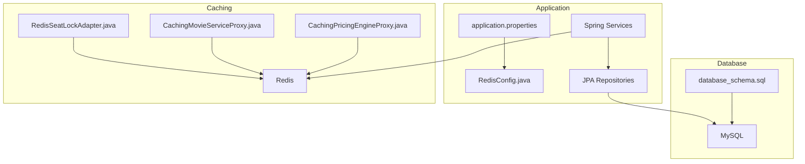
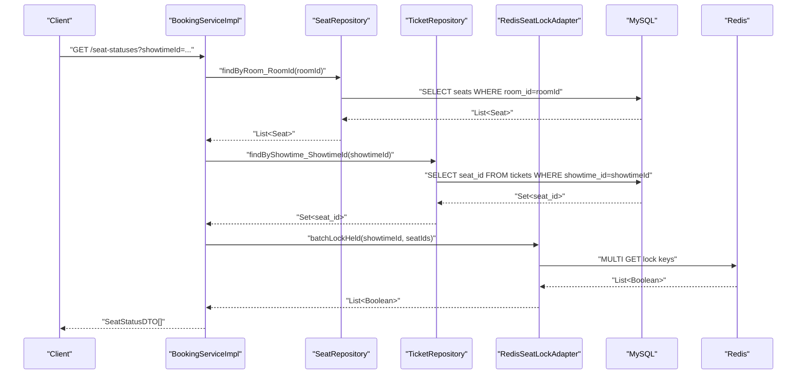
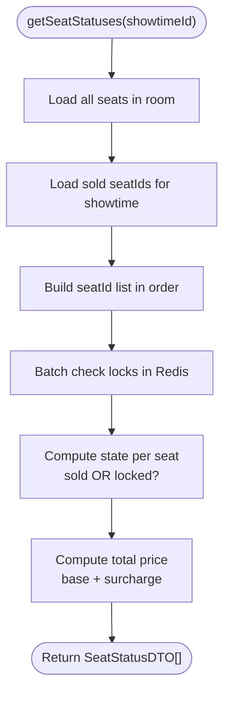
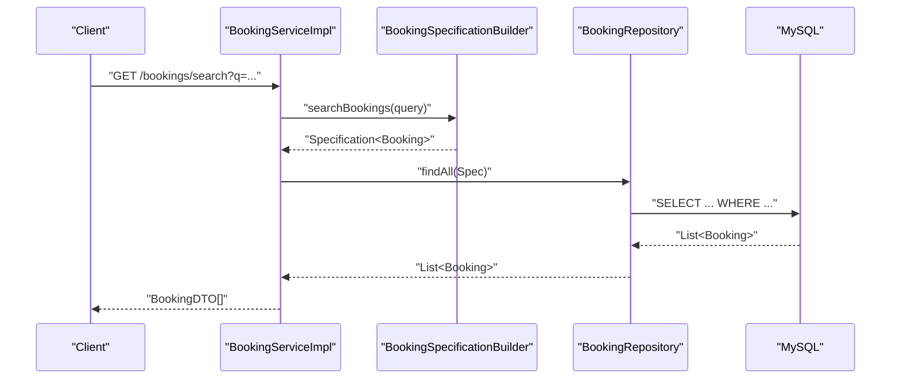
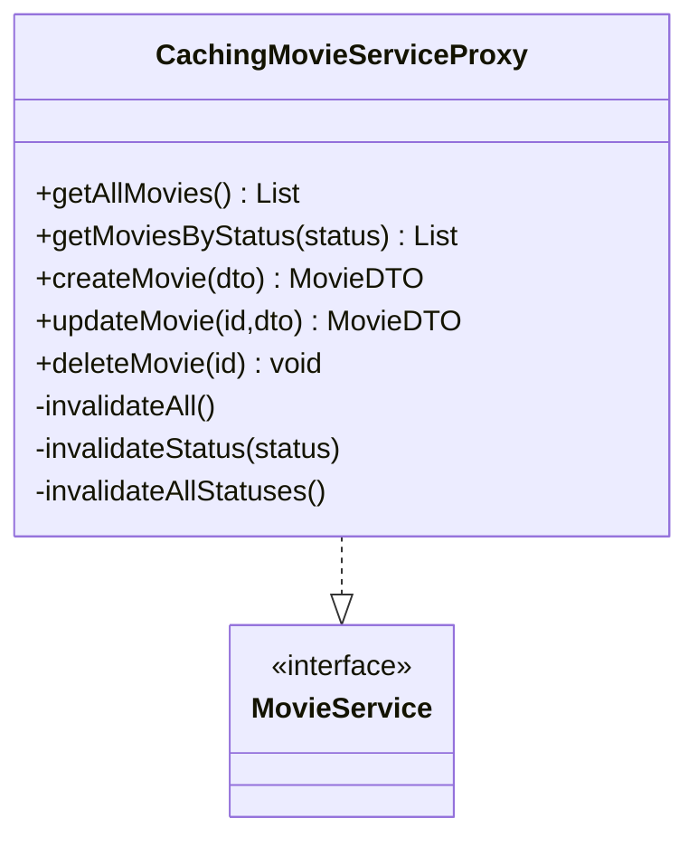
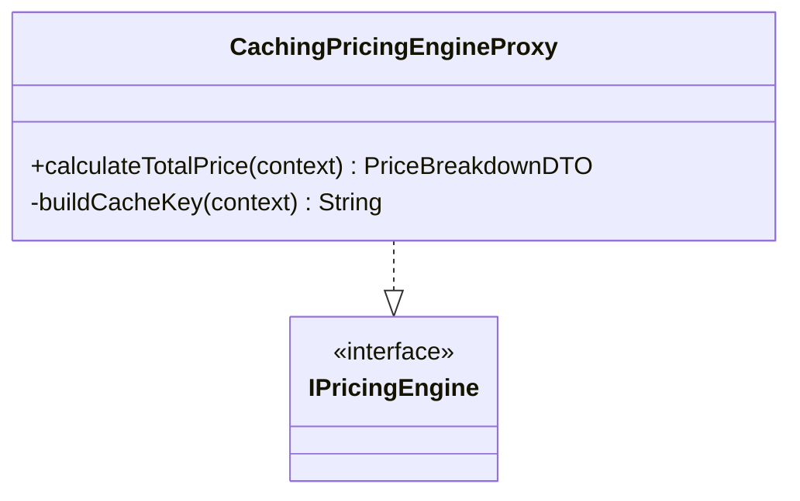
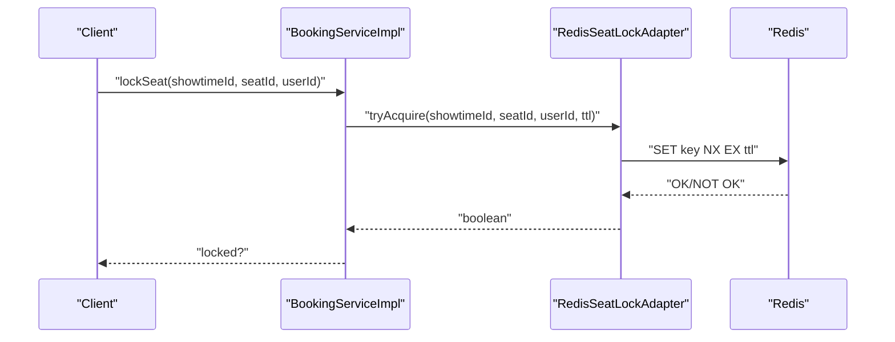
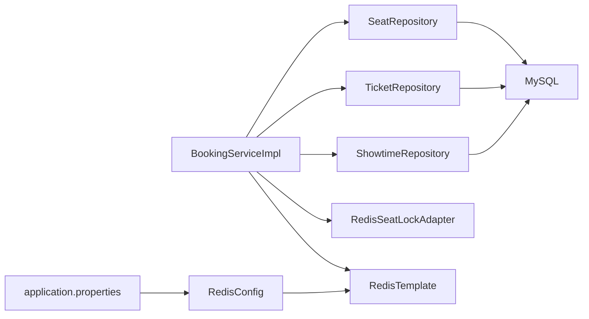

# Performance Considerations

<cite>
**Referenced Files in This Document**
- [database_schema.sql](file://database_schema.sql)
- [application.properties](file://backend/src/main/resources/application.properties)
- [RedisConfig.java](file://backend/src/main/java/com/cinema/booking/config/RedisConfig.java)
- [RedisSeatLockAdapter.java](file://backend/src/main/java/com/cinema/booking/services/seatlock/RedisSeatLockAdapter.java)
- [CachingMovieServiceProxy.java](file://backend/src/main/java/com/cinema/booking/patterns/proxy/CachingMovieServiceProxy.java)
- [CachingPricingEngineProxy.java](file://backend/src/main/java/com/cinema/booking/services/strategy_decorator/pricing/CachingPricingEngineProxy.java)
- [SeatRepository.java](file://backend/src/main/java/com/cinema/booking/repositories/SeatRepository.java)
- [BookingRepository.java](file://backend/src/main/java/com/cinema/booking/repositories/BookingRepository.java)
- [ShowtimeRepository.java](file://backend/src/main/java/com/cinema/booking/repositories/ShowtimeRepository.java)
- [MovieRepository.java](file://backend/src/main/java/com/cinema/booking/repositories/MovieRepository.java)
- [SeatServiceImpl.java](file://backend/src/main/java/com/cinema/booking/services/impl/SeatServiceImpl.java)
- [BookingServiceImpl.java](file://backend/src/main/java/com/cinema/booking/services/impl/BookingServiceImpl.java)
- [ShowtimeServiceImpl.java](file://backend/src/main/java/com/cinema/booking/services/impl/ShowtimeServiceImpl.java)
</cite>

## Table of Contents
1. [Introduction](#introduction)
2. [Project Structure](#project-structure)
3. [Core Components](#core-components)
4. [Architecture Overview](#architecture-overview)
5. [Detailed Component Analysis](#detailed-component-analysis)
6. [Dependency Analysis](#dependency-analysis)
7. [Performance Considerations](#performance-considerations)
8. [Troubleshooting Guide](#troubleshooting-guide)
9. [Conclusion](#conclusion)

## Introduction
This document focuses on performance optimization for the cinema booking database design. It covers indexing strategies for high-frequency queries (seat availability, booking lookups, search), caching strategies using Redis (seat locks, frequently accessed movie data, pricing), query optimization techniques (complex joins, pagination, real-time seat updates), partitioning strategies for large datasets, query execution plans, performance monitoring, connection pooling, transaction isolation, deadlock prevention, and scalability for concurrent booking scenarios.

## Project Structure
The backend leverages Spring Boot with JPA/Hibernate and Redis for caching and seat locking. The database schema defines normalized entities for users, movies, cinemas, rooms, seats, showtimes, bookings, tickets, FnB, and payments. Application configuration controls database connections, Redis connectivity, and feature flags.

**Diagram sources**
- [application.properties:1-97](file://backend/src/main/resources/application.properties#L1-L97)
- [RedisConfig.java:1-55](file://backend/src/main/java/com/cinema/booking/config/RedisConfig.java#L1-L55)
- [database_schema.sql:1-267](file://database_schema.sql#L1-L267)
- [RedisSeatLockAdapter.java:1-56](file://backend/src/main/java/com/cinema/booking/services/seatlock/RedisSeatLockAdapter.java#L1-L56)
- [CachingMovieServiceProxy.java:1-114](file://backend/src/main/java/com/cinema/booking/patterns/proxy/CachingMovieServiceProxy.java#L1-L114)
- [CachingPricingEngineProxy.java:1-99](file://backend/src/main/java/com/cinema/booking/services/strategy_decorator/pricing/CachingPricingEngineProxy.java#L1-L99)

**Section sources**
- [application.properties:1-97](file://backend/src/main/resources/application.properties#L1-L97)
- [database_schema.sql:1-267](file://database_schema.sql#L1-L267)

## Core Components
- Seat availability and locking: Real-time seat state computed via sold tickets and Redis-backed locks.
- Booking lookup and search: JPA Specifications and repository methods for flexible querying.
- Movie data caching: Proxy-based caching for movie lists with invalidation on writes.
- Pricing caching: Proxy-based caching keyed by showtime, seats, FnB, promotion, and customer.
- Connection pooling and Redis client: Lettuce-backed connection factory and JSON serialization.

**Section sources**
- [BookingServiceImpl.java:77-131](file://backend/src/main/java/com/cinema/booking/services/impl/BookingServiceImpl.java#L77-L131)
- [SeatServiceImpl.java:125-187](file://backend/src/main/java/com/cinema/booking/services/impl/SeatServiceImpl.java#L125-L187)
- [CachingMovieServiceProxy.java:21-114](file://backend/src/main/java/com/cinema/booking/patterns/proxy/CachingMovieServiceProxy.java#L21-L114)
- [CachingPricingEngineProxy.java:15-99](file://backend/src/main/java/com/cinema/booking/services/strategy_decorator/pricing/CachingPricingEngineProxy.java#L15-L99)
- [RedisConfig.java:16-55](file://backend/src/main/java/com/cinema/booking/config/RedisConfig.java#L16-L55)

## Architecture Overview
The system integrates JPA repositories with Redis for hot-path caching and locking. Seat availability combines database state with Redis locks to prevent race conditions during concurrent booking.

**Diagram sources**
- [BookingServiceImpl.java:77-115](file://backend/src/main/java/com/cinema/booking/services/impl/BookingServiceImpl.java#L77-L115)
- [SeatRepository.java:10-15](file://backend/src/main/java/com/cinema/booking/repositories/SeatRepository.java#L10-L15)
- [ShowtimeRepository.java:12-14](file://backend/src/main/java/com/cinema/booking/repositories/ShowtimeRepository.java#L12-L14)
- [TicketRepository.java:1-200](file://backend/src/main/java/com/cinema/booking/repositories/TicketRepository.java#L1-L200)
- [RedisSeatLockAdapter.java:40-54](file://backend/src/main/java/com/cinema/booking/services/seatlock/RedisSeatLockAdapter.java#L40-L54)

## Detailed Component Analysis

### Seat Availability and Real-Time Updates
- Seat statuses combine:
  - All seats in the room from the database.
  - Sold seats derived from tickets for the showtime.
  - Locked seats from Redis using batch retrieval.
- The service computes display status per seat and total price (base price plus seat surcharge).

**Diagram sources**
- [BookingServiceImpl.java:77-115](file://backend/src/main/java/com/cinema/booking/services/impl/BookingServiceImpl.java#L77-L115)
- [SeatRepository.java:10-15](file://backend/src/main/java/com/cinema/booking/repositories/SeatRepository.java#L10-L15)
- [TicketRepository.java:1-200](file://backend/src/main/java/com/cinema/booking/repositories/TicketRepository.java#L1-L200)
- [RedisSeatLockAdapter.java:40-54](file://backend/src/main/java/com/cinema/booking/services/seatlock/RedisSeatLockAdapter.java#L40-L54)

**Section sources**
- [BookingServiceImpl.java:77-115](file://backend/src/main/java/com/cinema/booking/services/impl/BookingServiceImpl.java#L77-L115)
- [SeatServiceImpl.java:189-201](file://backend/src/main/java/com/cinema/booking/services/impl/SeatServiceImpl.java#L189-L201)

### Booking Lookup and Search
- Booking search uses JPA Specifications to compose filters dynamically.
- Booking detail fetches tickets and FnB lines for aggregation.

**Diagram sources**
- [BookingServiceImpl.java:160-165](file://backend/src/main/java/com/cinema/booking/services/impl/BookingServiceImpl.java#L160-L165)
- [BookingRepository.java:8-10](file://backend/src/main/java/com/cinema/booking/repositories/BookingRepository.java#L8-L10)

**Section sources**
- [BookingServiceImpl.java:160-165](file://backend/src/main/java/com/cinema/booking/services/impl/BookingServiceImpl.java#L160-L165)
- [BookingRepository.java:8-10](file://backend/src/main/java/com/cinema/booking/repositories/BookingRepository.java#L8-L10)

### Movie Data Caching
- A proxy caches movie lists by status and a global list key.
- On write operations, caches are invalidated to maintain consistency.

**Diagram sources**
- [CachingMovieServiceProxy.java:21-114](file://backend/src/main/java/com/cinema/booking/patterns/proxy/CachingMovieServiceProxy.java#L21-L114)

**Section sources**
- [CachingMovieServiceProxy.java:21-114](file://backend/src/main/java/com/cinema/booking/patterns/proxy/CachingMovieServiceProxy.java#L21-L114)

### Pricing Caching
- A proxy caches pricing results keyed by showtime, seats, FnB items, promotion, and customer.
- TTL is configurable via application properties.

**Diagram sources**
- [CachingPricingEngineProxy.java:15-99](file://backend/src/main/java/com/cinema/booking/services/strategy_decorator/pricing/CachingPricingEngineProxy.java#L15-L99)

**Section sources**
- [CachingPricingEngineProxy.java:15-99](file://backend/src/main/java/com/cinema/booking/services/strategy_decorator/pricing/CachingPricingEngineProxy.java#L15-L99)

### Seat Locking with Redis
- Seat locks are stored as individual keys with TTL.
- Batch lock checks use multi-get for efficiency.

**Diagram sources**
- [BookingServiceImpl.java:117-126](file://backend/src/main/java/com/cinema/booking/services/impl/BookingServiceImpl.java#L117-L126)
- [RedisSeatLockAdapter.java:27-32](file://backend/src/main/java/com/cinema/booking/services/seatlock/RedisSeatLockAdapter.java#L27-L32)

**Section sources**
- [RedisSeatLockAdapter.java:11-56](file://backend/src/main/java/com/cinema/booking/services/seatlock/RedisSeatLockAdapter.java#L11-L56)
- [BookingServiceImpl.java:117-126](file://backend/src/main/java/com/cinema/booking/services/impl/BookingServiceImpl.java#L117-L126)

## Dependency Analysis
- Repositories depend on JPA/Hibernate to translate method names into SQL.
- Services orchestrate reads/writes, integrate Redis, and apply business rules.
- Configuration wires database and Redis connectivity.

**Diagram sources**
- [BookingServiceImpl.java:32-76](file://backend/src/main/java/com/cinema/booking/services/impl/BookingServiceImpl.java#L32-L76)
- [SeatRepository.java:10-15](file://backend/src/main/java/com/cinema/booking/repositories/SeatRepository.java#L10-L15)
- [TicketRepository.java:1-200](file://backend/src/main/java/com/cinema/booking/repositories/TicketRepository.java#L1-L200)
- [ShowtimeRepository.java:12-14](file://backend/src/main/java/com/cinema/booking/repositories/ShowtimeRepository.java#L12-L14)
- [RedisSeatLockAdapter.java:14-21](file://backend/src/main/java/com/cinema/booking/services/seatlock/RedisSeatLockAdapter.java#L14-L21)
- [RedisConfig.java:31-53](file://backend/src/main/java/com/cinema/booking/config/RedisConfig.java#L31-L53)
- [application.properties:58-66](file://backend/src/main/resources/application.properties#L58-L66)

**Section sources**
- [BookingServiceImpl.java:32-76](file://backend/src/main/java/com/cinema/booking/services/impl/BookingServiceImpl.java#L32-L76)
- [application.properties:58-66](file://backend/src/main/resources/application.properties#L58-L66)
- [RedisConfig.java:16-55](file://backend/src/main/java/com/cinema/booking/config/RedisConfig.java#L16-L55)

## Performance Considerations

### Indexing Strategies for High-Frequency Queries
- Seat availability:
  - Ensure indexes on seats.room_id and seats.id for fast enumeration of room seats.
  - Ensure indexes on tickets.showtime_id and tickets.seat_id for quick sold-seat lookups.
- Booking lookups and search:
  - Add indexes on bookings.customer_id, bookings.booking_code, and created_at for efficient filtering and sorting.
  - For search, leverage JPA Specifications with appropriate WHERE clauses; ensure supporting indexes on searchable fields (e.g., customer_id, status, created_at).
- Showtime search:
  - Index showtimes.room_id, showtimes.movie_id, and showtimes.start_time for range queries and equality filters.
- Movie data:
  - Index movies.status for fast retrieval of NOW_SHOWING/COMING_SOON lists.
- FnB inventory:
  - Index fnb_item_inventory.item_id and fnb_lines.booking_id for FnB line queries.

**Section sources**
- [database_schema.sql:142-149](file://database_schema.sql#L142-L149)
- [database_schema.sql:197-206](file://database_schema.sql#L197-L206)
- [database_schema.sql:155-164](file://database_schema.sql#L155-L164)
- [database_schema.sql:208-223](file://database_schema.sql#L208-L223)
- [database_schema.sql:63-74](file://database_schema.sql#L63-L74)
- [ShowtimeRepository.java:12-14](file://backend/src/main/java/com/cinema/booking/repositories/ShowtimeRepository.java#L12-L14)
- [MovieRepository.java:10-14](file://backend/src/main/java/com/cinema/booking/repositories/MovieRepository.java#L10-L14)
- [SeatRepository.java:10-15](file://backend/src/main/java/com/cinema/booking/repositories/SeatRepository.java#L10-L15)
- [BookingRepository.java:8-10](file://backend/src/main/java/com/cinema/booking/repositories/BookingRepository.java#L8-L10)

### Caching Strategies Using Redis
- Seat locks:
  - Keys are per-showtime and per-seat with TTL. Use batch multi-get for lock checks to reduce round trips.
- Frequently accessed movie data:
  - Cache lists by status and a global list key. Invalidate caches on create/update/delete.
- Session management:
  - Store short-lived session tokens or user preferences with TTL; avoid storing sensitive data in Redis.
- Pricing:
  - Cache price calculations keyed by showtime, seats, FnB, promotion, and customer. TTL is configurable.

**Section sources**
- [RedisSeatLockAdapter.java:23-32](file://backend/src/main/java/com/cinema/booking/services/seatlock/RedisSeatLockAdapter.java#L23-L32)
- [RedisSeatLockAdapter.java:40-54](file://backend/src/main/java/com/cinema/booking/services/seatlock/RedisSeatLockAdapter.java#L40-L54)
- [CachingMovieServiceProxy.java:25-63](file://backend/src/main/java/com/cinema/booking/patterns/proxy/CachingMovieServiceProxy.java#L25-L63)
- [CachingPricingEngineProxy.java:31-58](file://backend/src/main/java/com/cinema/booking/services/strategy_decorator/pricing/CachingPricingEngineProxy.java#L31-L58)
- [application.properties:65-65](file://backend/src/main/resources/application.properties#L65-L65)

### Query Optimization Techniques
- Complex joins:
  - Prefer fetching related entities in batches (e.g., seat enumeration, ticket lookups) and merge in-memory to minimize N+1 queries.
- Pagination:
  - Use Pageable with repository methods to limit result sets and offset for large datasets.
- Real-time seat updates:
  - Combine sold-seat counts from tickets with Redis lock states to reflect instantaneous availability.

**Section sources**
- [BookingServiceImpl.java:77-115](file://backend/src/main/java/com/cinema/booking/services/impl/BookingServiceImpl.java#L77-L115)
- [SeatServiceImpl.java:125-187](file://backend/src/main/java/com/cinema/booking/services/impl/SeatServiceImpl.java#L125-L187)

### Partitioning Strategies for Large Datasets
- Horizontal partitioning by date/time:
  - Partition showtimes and tickets by start_time to isolate recent data for hot queries.
- Sharding by cinema/location:
  - Shard bookings and payments by cinema/location to distribute load.
- Separate cold data:
  - Archive old bookings/payments to separate tables or systems to keep hot tables small.

[No sources needed since this section provides general guidance]

### Query Execution Plans and Monitoring
- Enable SQL logging in development to inspect generated queries and missing indexes.
- Use database EXPLAIN/EXPLAIN ANALYZE to review query plans and ensure index usage.
- Monitor slow queries and query latency in production.

**Section sources**
- [application.properties:17-24](file://backend/src/main/resources/application.properties#L17-L24)

### Connection Pooling Configuration
- HikariCP is configured via spring.datasource.hikari.* properties. Tune pool size, connection timeout, and idle timeout according to workload.
- Ensure connection init SQL sets proper charset/collation.

**Section sources**
- [application.properties:8-12](file://backend/src/main/resources/application.properties#L8-L12)
- [RedisConfig.java:31-37](file://backend/src/main/java/com/cinema/booking/config/RedisConfig.java#L31-L37)

### Transaction Isolation Levels and Deadlock Prevention
- Use READ COMMITTED or REPEATABLE READ depending on consistency needs; avoid SERIALIZABLE unless necessary.
- Keep transactions short and ordered (e.g., lock rows in consistent order across requests).
- Retry on deadlock with exponential backoff.

[No sources needed since this section provides general guidance]

### Scalability for Concurrent Booking Scenarios
- Use Redis locks to serialize seat selection per showtime.
- Cache hot data (movies, pricing) to reduce database load.
- Scale horizontally with multiple application instances behind a load balancer.
- Use asynchronous processing for non-critical tasks (email, notifications).

**Section sources**
- [BookingServiceImpl.java:117-126](file://backend/src/main/java/com/cinema/booking/services/impl/BookingServiceImpl.java#L117-L126)
- [CachingMovieServiceProxy.java:21-114](file://backend/src/main/java/com/cinema/booking/patterns/proxy/CachingMovieServiceProxy.java#L21-L114)
- [CachingPricingEngineProxy.java:15-99](file://backend/src/main/java/com/cinema/booking/services/strategy_decorator/pricing/CachingPricingEngineProxy.java#L15-L99)

## Troubleshooting Guide
- Redis connectivity:
  - Verify host, port, username, and password in application properties and ensure the Redis server is reachable.
- Cache misses:
  - Confirm TTL and key naming; ensure invalidation occurs on writes.
- Seat lock contention:
  - Check TTL and ensure locks are released after successful booking or timeout.
- Slow seat status page:
  - Confirm indexes on seats.room_id and tickets.showtime_id; consider batching lock checks.

**Section sources**
- [application.properties:61-65](file://backend/src/main/resources/application.properties#L61-L65)
- [RedisSeatLockAdapter.java:27-37](file://backend/src/main/java/com/cinema/booking/services/seatlock/RedisSeatLockAdapter.java#L27-L37)
- [CachingMovieServiceProxy.java:100-112](file://backend/src/main/java/com/cinema/booking/patterns/proxy/CachingMovieServiceProxy.java#L100-L112)

## Conclusion
By combining targeted database indexing, Redis caching for hot paths, optimized queries with pagination, and careful transaction handling, the system can achieve predictable performance under concurrent booking loads. Continuous monitoring and iterative tuning of cache keys, TTLs, and connection pools will sustain performance as data and traffic grow.