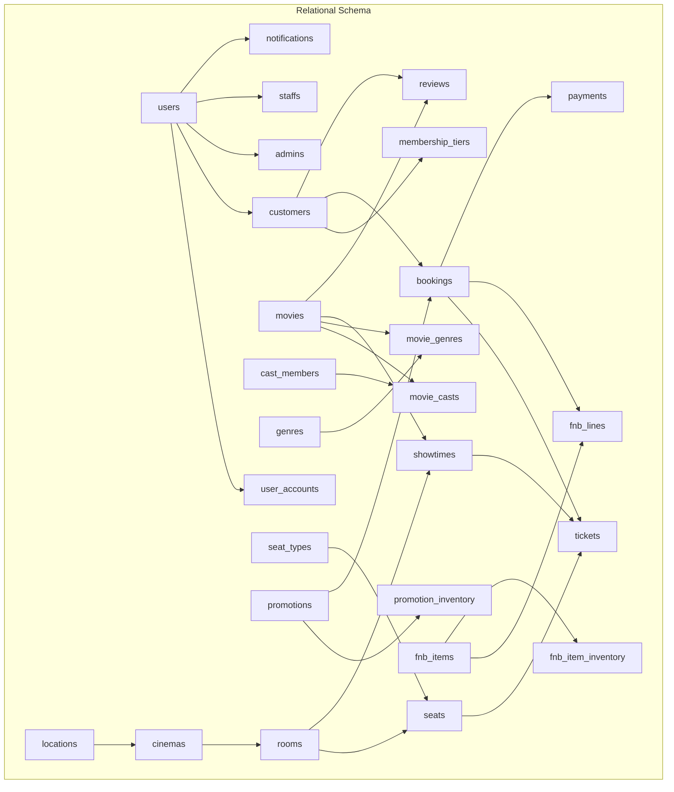
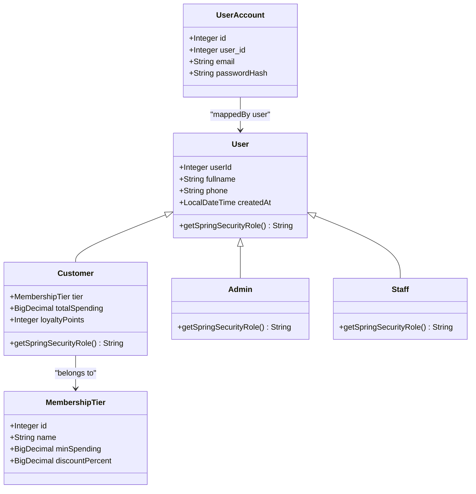
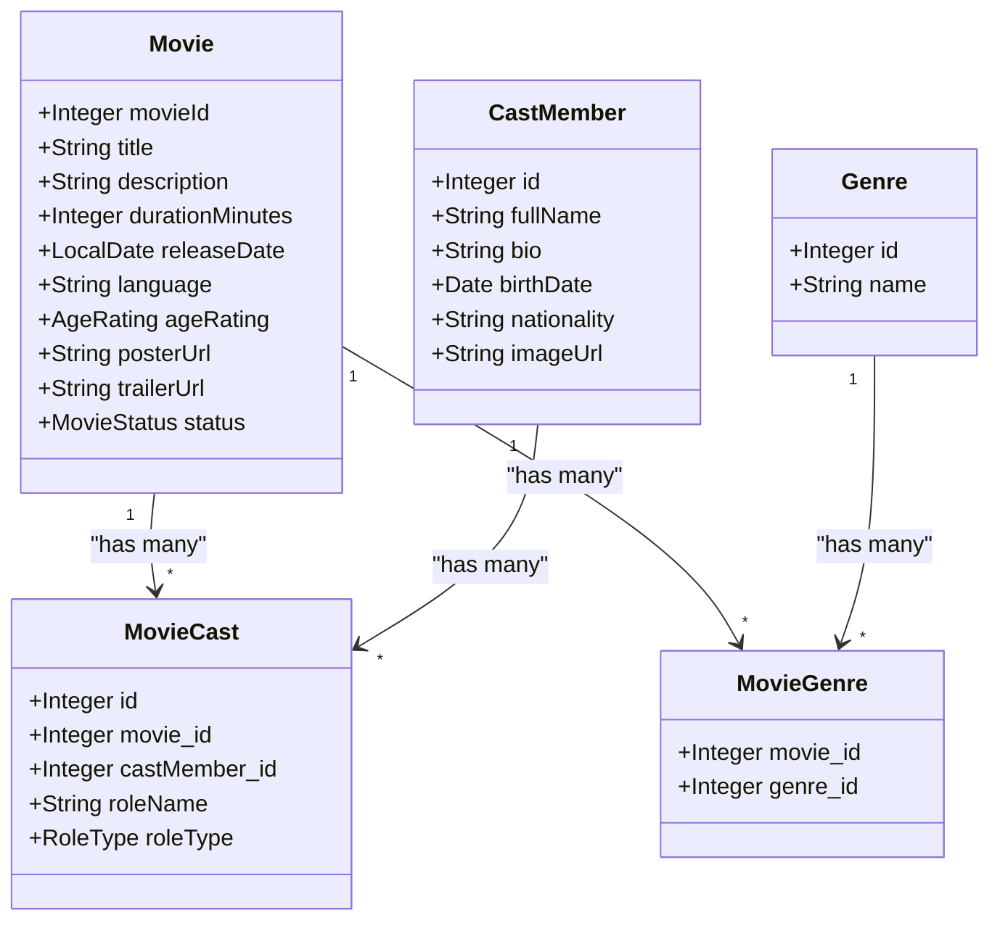
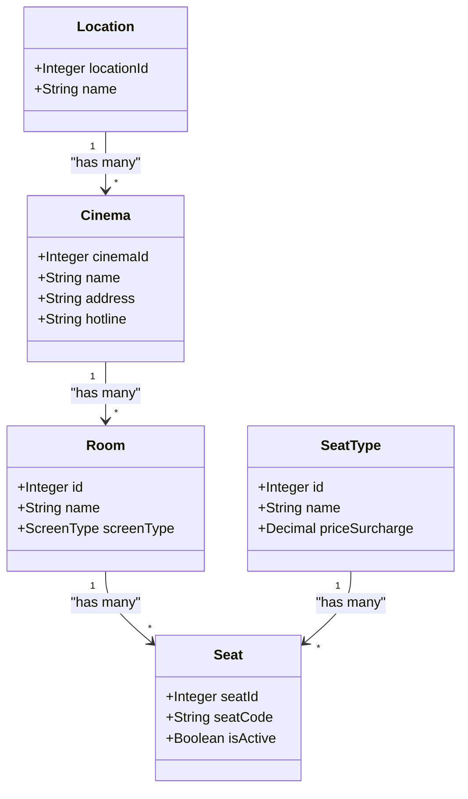
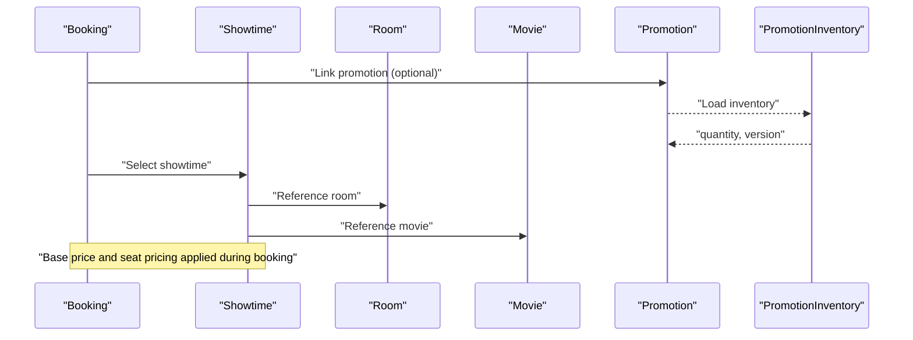
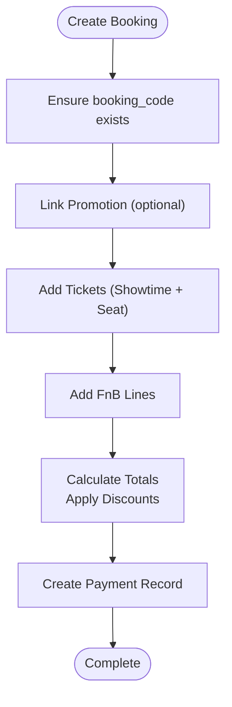
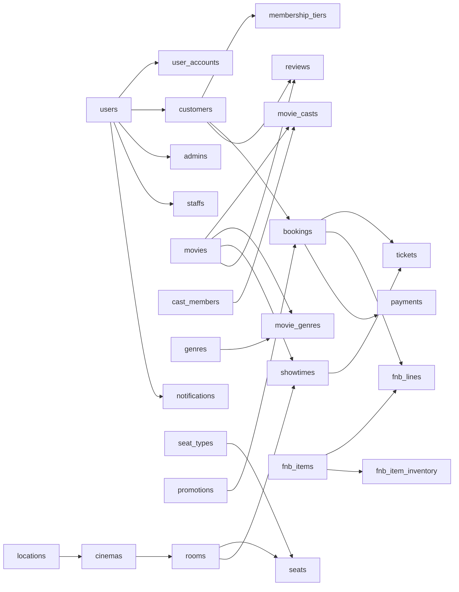

# Schema Details

<cite>
**Referenced Files in This Document**
- [database_schema.sql](file://database_schema.sql)
- [User.java](file://backend/src/main/java/com/cinema/booking/entities/User.java)
- [Customer.java](file://backend/src/main/java/com/cinema/booking/entities/Customer.java)
- [Admin.java](file://backend/src/main/java/com/cinema/booking/entities/Admin.java)
- [Staff.java](file://backend/src/main/java/com/cinema/booking/entities/Staff.java)
- [MembershipTier.java](file://backend/src/main/java/com/cinema/booking/entities/MembershipTier.java)
- [Movie.java](file://backend/src/main/java/com/cinema/booking/entities/Movie.java)
- [CastMember.java](file://backend/src/main/java/com/cinema/booking/entities/CastMember.java)
- [MovieCast.java](file://backend/src/main/java/com/cinema/booking/entities/MovieCast.java)
- [Genre.java](file://backend/src/main/java/com/cinema/booking/entities/Genre.java)
- [MovieGenre.java](file://backend/src/main/java/com/cinema/booking/entities/MovieGenre.java)
- [Location.java](file://backend/src/main/java/com/cinema/booking/entities/Location.java)
- [Cinema.java](file://backend/src/main/java/com/cinema/booking/entities/Cinema.java)
- [Room.java](file://backend/src/main/java/com/cinema/booking/entities/Room.java)
- [SeatType.java](file://backend/src/main/java/com/cinema/booking/entities/SeatType.java)
- [Seat.java](file://backend/src/main/java/com/cinema/booking/entities/Seat.java)
- [Showtime.java](file://backend/src/main/java/com/cinema/booking/entities/Showtime.java)
- [Promotion.java](file://backend/src/main/java/com/cinema/booking/entities/Promotion.java)
- [PromotionInventory.java](file://backend/src/main/java/com/cinema/booking/entities/PromotionInventory.java)
- [Booking.java](file://backend/src/main/java/com/cinema/booking/entities/Booking.java)
- [Ticket.java](file://backend/src/main/java/com/cinema/booking/entities/Ticket.java)
- [FnbItem.java](file://backend/src/main/java/com/cinema/booking/entities/FnbItem.java)
- [FnBLine.java](file://backend/src/main/java/com/cinema/booking/entities/FnBLine.java)
- [FnbItemInventory.java](file://backend/src/main/java/com/cinema/booking/entities/FnbItemInventory.java)
- [Payment.java](file://backend/src/main/java/com/cinema/booking/entities/Payment.java)
- [Review.java](file://backend/src/main/java/com/cinema/booking/entities/Review.java)
- [Notification.java](file://backend/src/main/java/com/cinema/booking/entities/Notification.java)
</cite>

## Table of Contents
1. [Introduction](#introduction)
2. [Project Structure](#project-structure)
3. [Core Components](#core-components)
4. [Architecture Overview](#architecture-overview)
5. [Detailed Component Analysis](#detailed-component-analysis)
6. [Dependency Analysis](#dependency-analysis)
7. [Performance Considerations](#performance-considerations)
8. [Troubleshooting Guide](#troubleshooting-guide)
9. [Conclusion](#conclusion)
10. [Appendices](#appendices)

## Introduction
This document provides comprehensive schema documentation for the cinema booking system. It covers all 22 core tables, detailing data types, constraints, defaults, and validation rules. It also explains inheritance mapping for the User aggregate, the Movie aggregate, the Cinema aggregate, Showtime and Promotion tables, the Booking aggregate, and supporting tables such as Payment, Reviews, and Notifications. Indexing strategies, unique constraints, and check constraints are included to guide database design and performance tuning.

## Project Structure
The schema is defined in a single SQL script and mirrored by JPA entity classes. The entities define inheritance and relationships that correspond to the relational schema.



**Diagram sources**
- [database_schema.sql:9-267](file://database_schema.sql#L9-L267)
- [User.java:6-37](file://backend/src/main/java/com/cinema/booking/entities/User.java#L6-L37)
- [Customer.java:8-30](file://backend/src/main/java/com/cinema/booking/entities/Customer.java#L8-L30)
- [Admin.java:6-18](file://backend/src/main/java/com/cinema/booking/entities/Admin.java#L6-L18)
- [Staff.java:6-18](file://backend/src/main/java/com/cinema/booking/entities/Staff.java#L6-L18)
- [MembershipTier.java](file://backend/src/main/java/com/cinema/booking/entities/MembershipTier.java)
- [Movie.java:11-64](file://backend/src/main/java/com/cinema/booking/entities/Movie.java#L11-L64)
- [CastMember.java](file://backend/src/main/java/com/cinema/booking/entities/CastMember.java)
- [MovieCast.java](file://backend/src/main/java/com/cinema/booking/entities/MovieCast.java)
- [Genre.java](file://backend/src/main/java/com/cinema/booking/entities/Genre.java)
- [MovieGenre.java](file://backend/src/main/java/com/cinema/booking/entities/MovieGenre.java)
- [Location.java:6-20](file://backend/src/main/java/com/cinema/booking/entities/Location.java#L6-L20)
- [Cinema.java:6-31](file://backend/src/main/java/com/cinema/booking/entities/Cinema.java#L6-L31)
- [Room.java](file://backend/src/main/java/com/cinema/booking/entities/Room.java)
- [SeatType.java](file://backend/src/main/java/com/cinema/booking/entities/SeatType.java)
- [Seat.java:6-33](file://backend/src/main/java/com/cinema/booking/entities/Seat.java#L6-L33)
- [Showtime.java:8-37](file://backend/src/main/java/com/cinema/booking/entities/Showtime.java#L8-L37)
- [Promotion.java:8-40](file://backend/src/main/java/com/cinema/booking/entities/Promotion.java#L8-L40)
- [PromotionInventory.java](file://backend/src/main/java/com/cinema/booking/entities/PromotionInventory.java)
- [Booking.java:8-64](file://backend/src/main/java/com/cinema/booking/entities/Booking.java#L8-L64)
- [Ticket.java:9-37](file://backend/src/main/java/com/cinema/booking/entities/Ticket.java#L9-L37)
- [FnbItem.java:7-40](file://backend/src/main/java/com/cinema/booking/entities/FnbItem.java#L7-L40)
- [FnBLine.java:10-38](file://backend/src/main/java/com/cinema/booking/entities/FnBLine.java#L10-L38)
- [FnbItemInventory.java](file://backend/src/main/java/com/cinema/booking/entities/FnbItemInventory.java)
- [Payment.java:9-43](file://backend/src/main/java/com/cinema/booking/entities/Payment.java#L9-L43)
- [Review.java](file://backend/src/main/java/com/cinema/booking/entities/Review.java)
- [Notification.java](file://backend/src/main/java/com/cinema/booking/entities/Notification.java)

**Section sources**
- [database_schema.sql:1-267](file://database_schema.sql#L1-L267)
- [User.java:1-38](file://backend/src/main/java/com/cinema/booking/entities/User.java#L1-L38)

## Core Components
This section documents each of the 22 core tables with their fields, data types, constraints, defaults, and validation rules. It also highlights unique and check constraints.

- Users and Accounts
  - users
    - Fields: id (PK), fullname, phone (unique), created_at (default current_timestamp)
    - Constraints: phone unique; created_at default current_timestamp
  - user_accounts
    - Fields: id (PK), user_id (FK to users.id, unique), email (unique, not null), password_hash (not null)
    - Constraints: user_id unique; FK to users(id) cascade delete
  - customers
    - Fields: user_id (PK, FK to users.id), tier_id (FK to membership_tiers.id), total_spending (default 0), loyalty_points (default 0)
    - Constraints: FK to users(id) cascade delete; FK to membership_tiers(id)
  - admins
    - Fields: user_id (PK, FK to users.id)
    - Constraints: FK to users(id) cascade delete
  - staffs
    - Fields: user_id (PK, FK to users.id)
    - Constraints: FK to users(id) cascade delete
  - membership_tiers
    - Fields: id (PK), name, min_spending (default 0), discount_percent (default 0)
    - Notes: Seed data included for SILVER, GOLD, PLATINUM

- Movies and Casts
  - movies
    - Fields: id (PK), title (not null), description (text), duration_minutes (not null), release_date, language, age_rating, poster_url, trailer_url, status (enum, default COMING_SOON)
  - cast_members
    - Fields: id (PK), full_name (not null), bio (text), birth_date, nationality, image_url
  - movie_casts
    - Fields: id (PK), movie_id (FK to movies.id), cast_member_id (FK to cast_members.id), role_name, role_type (enum ACTOR, DIRECTOR, not null)
    - Constraints: FK to movies(id) and cast_members(id) cascade delete
  - genres
    - Fields: id (PK), name (not null)
  - movie_genres
    - Fields: movie_id (FK to movies.id), genre_id (FK to genres.id), PK (movie_id, genre_id)
    - Constraints: composite PK; FK to movies(id) and genres(id) cascade delete

- Cinemas and Facilities
  - locations
    - Fields: id (PK), name (not null)
  - cinemas
    - Fields: id (PK), location_id (FK to locations.id, not null), name (not null), address (not null)
    - Constraints: FK to locations(id) cascade delete
  - rooms
    - Fields: id (PK), cinema_id (FK to cinemas.id, not null), name (not null), screen_type (enum 2D, 3D, IMAX, default 2D)
    - Constraints: FK to cinemas(id) cascade delete
  - seat_types
    - Fields: id (PK), name (not null), price_surcharge (default 0)
  - seats
    - Fields: id (PK), room_id (FK to rooms.id, not null), seat_type_id (FK to seat_types.id, not null), seat_code (not null)
    - Constraints: FK to rooms(id) and seat_types(id) cascade delete

- Showtimes and Promotions
  - showtimes
    - Fields: id (PK), movie_id (FK to movies.id, not null), room_id (FK to rooms.id, not null), start_time (not null), end_time (not null), base_price (not null)
    - Constraints: FK to movies(id) and rooms(id) cascade delete
  - promotions
    - Fields: id (PK), code (unique, not null), discount_type (enum PERCENT, FIXED, not null), discount_value (not null), valid_to (not null)
  - promotion_inventory
    - Fields: id (PK), promotion_id (FK to promotions.id, unique), quantity (default 0), version (default 0)
    - Constraints: FK to promotions(id) cascade delete; promotion_id unique

- Bookings and Tickets
  - bookings
    - Fields: id (PK), booking_code (unique, not null, length 50), customer_id (FK to customers.user_id), promotion_id (FK to promotions.id), status (enum PENDING, CONFIRMED, CANCELLED, default PENDING), created_at (default current_timestamp)
    - Constraints: FK to customers(user_id) and promotions(id); booking_code unique
  - tickets
    - Fields: id (PK), booking_id (FK to bookings.id), seat_id (FK to seats.id), showtime_id (FK to showtimes.id), price (not null)
    - Constraints: FK to bookings(id), seats(id), showtimes(id) cascade delete

- Food and Beverage
  - fnb_items
    - Fields: id (PK), name (not null), description (text), price (not null), is_active (default true), image_url
  - fnb_item_inventory
    - Fields: id (PK), item_id (FK to fnb_items.id, unique), quantity (default 0), version (default 0)
    - Constraints: FK to fnb_items(id) cascade delete; item_id unique
  - fnb_lines
    - Fields: id (PK), booking_id (FK to bookings.id), item_id (FK to fnb_items.id), quantity (not null), unit_price (not null)
    - Constraints: FK to bookings(id) and fnb_items(id) cascade delete

- Payments and Reviews
  - payments
    - Fields: id (PK), booking_id (FK to bookings.id, unique), amount (not null), status (enum PENDING, SUCCESS, FAILED, default PENDING), method (enum CASH, MOMO, VNPAY, not null), paid_at
    - Constraints: FK to bookings(id) cascade delete; booking_id unique
  - reviews
    - Fields: id (PK), movie_id (FK to movies.id), customer_id (FK to customers.user_id), rating (check 1..5), comment (text)
    - Constraints: FK to movies(id) and customers(user_id) cascade delete; rating check constraint
  - notifications
    - Fields: id (PK), user_id (FK to users.id), title (not null), message (not null), is_read (default false)
    - Constraints: FK to users(id) cascade delete

**Section sources**
- [database_schema.sql:9-267](file://database_schema.sql#L9-L267)

## Architecture Overview
The schema follows a normalized relational model with clear aggregates:
- User aggregate: users, user_accounts, customers, admins, staffs, membership_tiers
- Movie aggregate: movies, cast_members, movie_casts, genres, movie_genres
- Cinema aggregate: locations, cinemas, rooms, seat_types, seats
- Showtime and Promotion: showtimes, promotions, promotion_inventory
- Booking aggregate: bookings, tickets, fnb_items, fnb_item_inventory, fnb_lines
- Payments and auxiliary: payments, reviews, notifications

```mermaid
erDiagram
USERS {
int id PK
string fullname
string phone UK
timestamp created_at
}
USER_ACCOUNTS {
int id PK
int user_id UK FK
string email UK
string password_hash
}
CUSTOMERS {
int user_id PK FK
int tier_id FK
decimal total_spending
int loyalty_points
}
ADMINS {
int user_id PK FK
}
STAFFS {
int user_id PK FK
}
MEMBERSHIP_TIERS {
int id PK
string name
decimal min_spending
decimal discount_percent
}
MOVIES {
int id PK
string title
text description
int duration_minutes
date release_date
string language
string age_rating
string poster_url
string trailer_url
enum status
}
CAST_MEMBERS {
int id PK
string full_name
text bio
date birth_date
string nationality
string image_url
}
MOVIE_CASTS {
int id PK
int movie_id FK
int cast_member_id FK
string role_name
enum role_type
}
GENRES {
int id PK
string name
}
MOVIE_GENRES {
int movie_id FK
int genre_id FK
}
LOCATIONS {
int id PK
string name
}
CINEMAS {
int id PK
int location_id FK
string name
text address
}
ROOMS {
int id PK
int cinema_id FK
string name
enum screen_type
}
SEAT_TYPES {
int id PK
string name
decimal price_surcharge
}
SEATS {
int id PK
int room_id FK
int seat_type_id FK
string seat_code
}
SHOWTIMES {
int id PK
int movie_id FK
int room_id FK
datetime start_time
datetime end_time
decimal base_price
}
PROMOTIONS {
int id PK
string code UK
enum discount_type
decimal discount_value
datetime valid_to
}
PROMOTION_INVENTORY {
int id PK
int promotion_id UK FK
int quantity
bigint version
}
BOOKINGS {
int id PK
string booking_code UK
int customer_id FK
int promotion_id FK
enum status
timestamp created_at
}
TICKETS {
int id PK
int booking_id FK
int seat_id FK
int showtime_id FK
decimal price
}
FNB_ITEMS {
int id PK
string name
text description
decimal price
boolean is_active
string image_url
}
FNB_ITEM_INVENTORY {
int id PK
int item_id UK FK
int quantity
bigint version
}
FNB_LINES {
int id PK
int booking_id FK
int item_id FK
int quantity
decimal unit_price
}
PAYMENTS {
int id PK
int booking_id UK FK
decimal amount
enum status
enum method
timestamp paid_at
}
REVIEWS {
int id PK
int movie_id FK
int customer_id FK
int rating CK1_5
text comment
}
NOTIFICATIONS {
int id PK
int user_id FK
string title
text message
boolean is_read
}
USERS ||--o{ USER_ACCOUNTS : "has one-to-one"
USERS ||--o{ CUSTOMERS : "has one-to-one"
USERS ||--o{ ADMINS : "has one-to-one"
USERS ||--o{ STAFFS : "has one-to-one"
CUSTOMERS }o--|| MEMBERSHIP_TIERS : "belongs to"
MOVIES ||--o{ MOVIE_CASTS : "has many"
CAST_MEMBERS ||--o{ MOVIE_CASTS : "has many"
MOVIES ||--o{ MOVIE_GENRES : "has many"
GENRES ||--o{ MOVIE_GENRES : "has many"
LOCATIONS ||--o{ CINEMAS : "has many"
CINEMAS ||--o{ ROOMS : "has many"
ROOMS ||--o{ SEATS : "has many"
SEAT_TYPES ||--o{ SEATS : "has many"
MOVIES ||--o{ SHOWTIMES : "has many"
ROOMS ||--o{ SHOWTIMES : "has many"
SHOWTIMES ||--o{ TICKETS : "has many"
SEATS ||--o{ TICKETS : "has many"
PROMOTIONS ||--o{ PROMOTION_INVENTORY : "has one-to-one"
PROMOTIONS ||--o{ BOOKINGS : "can be linked to many"
BOOKINGS ||--o{ TICKETS : "has many"
BOOKINGS ||--o{ FNB_LINES : "has many"
FNB_ITEMS ||--o{ FNB_LINES : "has many"
FNB_ITEMS ||--o{ FNB_ITEM_INVENTORY : "has one-to-one"
BOOKINGS ||--o{ PAYMENTS : "has one-to-one"
MOVIES ||--o{ REVIEWS : "has many"
CUSTOMERS ||--o{ REVIEWS : "has many"
USERS ||--o{ NOTIFICATIONS : "has many"
```

**Diagram sources**
- [database_schema.sql:9-267](file://database_schema.sql#L9-L267)

## Detailed Component Analysis

### User Aggregate Tables
- users
  - Purpose: Base identity table for all users.
  - Constraints: phone unique; created_at default current_timestamp.
- user_accounts
  - Purpose: Separate credentials and enforce uniqueness of email and user linkage.
  - Constraints: user_id unique; FK to users(id) cascade delete.
- customers
  - Purpose: Customer-specific attributes including tier, spending, and loyalty points.
  - Constraints: FK to users(id) cascade delete; FK to membership_tiers(id).
- admins
  - Purpose: Administrative users.
  - Constraints: FK to users(id) cascade delete.
- staffs
  - Purpose: Frontline staff users.
  - Constraints: FK to users(id) cascade delete.
- membership_tiers
  - Purpose: Define tiers with thresholds and discounts.
  - Defaults: min_spending and discount_percent default to 0.



**Diagram sources**
- [User.java:6-37](file://backend/src/main/java/com/cinema/booking/entities/User.java#L6-L37)
- [Customer.java:8-30](file://backend/src/main/java/com/cinema/booking/entities/Customer.java#L8-L30)
- [Admin.java:6-18](file://backend/src/main/java/com/cinema/booking/entities/Admin.java#L6-L18)
- [Staff.java:6-18](file://backend/src/main/java/com/cinema/booking/entities/Staff.java#L6-L18)
- [MembershipTier.java](file://backend/src/main/java/com/cinema/booking/entities/MembershipTier.java)

**Section sources**
- [database_schema.sql:9-57](file://database_schema.sql#L9-L57)
- [User.java:1-38](file://backend/src/main/java/com/cinema/booking/entities/User.java#L1-L38)
- [Customer.java:1-31](file://backend/src/main/java/com/cinema/booking/entities/Customer.java#L1-L31)
- [Admin.java:1-19](file://backend/src/main/java/com/cinema/booking/entities/Admin.java#L1-L19)
- [Staff.java:1-19](file://backend/src/main/java/com/cinema/booking/entities/Staff.java#L1-L19)

### Movie Aggregate Tables
- movies
  - Status enum: NOW_SHOWING, COMING_SOON, STOPPED.
- cast_members
  - Stores cast and crew profiles.
- movie_casts
  - Junction table linking movies to cast members with role metadata.
  - role_type enum: ACTOR, DIRECTOR.
- genres
  - Genre taxonomy.
- movie_genres
  - Many-to-many relationship between movies and genres.



**Diagram sources**
- [Movie.java:11-64](file://backend/src/main/java/com/cinema/booking/entities/Movie.java#L11-L64)
- [CastMember.java](file://backend/src/main/java/com/cinema/booking/entities/CastMember.java)
- [MovieCast.java](file://backend/src/main/java/com/cinema/booking/entities/MovieCast.java)
- [Genre.java](file://backend/src/main/java/com/cinema/booking/entities/Genre.java)
- [MovieGenre.java](file://backend/src/main/java/com/cinema/booking/entities/MovieGenre.java)

**Section sources**
- [database_schema.sql:63-108](file://database_schema.sql#L63-L108)
- [Movie.java:1-65](file://backend/src/main/java/com/cinema/booking/entities/Movie.java#L1-L65)

### Cinema Aggregate Tables
- locations
  - Geographic grouping.
- cinemas
  - FK to locations; includes address and optional hotline.
- rooms
  - Screen type enum: 2D, 3D, IMAX.
- seat_types
  - Surcharge support per seat type.
- seats
  - Seat code per room; FK to seat_types.



**Diagram sources**
- [Location.java:6-20](file://backend/src/main/java/com/cinema/booking/entities/Location.java#L6-L20)
- [Cinema.java:6-31](file://backend/src/main/java/com/cinema/booking/entities/Cinema.java#L6-L31)
- [Room.java](file://backend/src/main/java/com/cinema/booking/entities/Room.java)
- [SeatType.java](file://backend/src/main/java/com/cinema/booking/entities/SeatType.java)
- [Seat.java:6-33](file://backend/src/main/java/com/cinema/booking/entities/Seat.java#L6-L33)

**Section sources**
- [database_schema.sql:114-149](file://database_schema.sql#L114-L149)
- [Location.java:1-21](file://backend/src/main/java/com/cinema/booking/entities/Location.java#L1-L21)
- [Cinema.java:1-32](file://backend/src/main/java/com/cinema/booking/entities/Cinema.java#L1-L32)
- [Seat.java:1-34](file://backend/src/main/java/com/cinema/booking/entities/Seat.java#L1-L34)

### Showtime and Promotion Tables
- showtimes
  - Links movies to rooms with start/end times and base price.
- promotions
  - Discount type enum: PERCENT, FIXED; validity timestamp.
- promotion_inventory
  - Quantity and optimistic locking via version.



**Diagram sources**
- [Showtime.java:8-37](file://backend/src/main/java/com/cinema/booking/entities/Showtime.java#L8-L37)
- [Promotion.java:8-40](file://backend/src/main/java/com/cinema/booking/entities/Promotion.java#L8-L40)
- [PromotionInventory.java](file://backend/src/main/java/com/cinema/booking/entities/PromotionInventory.java)
- [Booking.java:8-64](file://backend/src/main/java/com/cinema/booking/entities/Booking.java#L8-L64)

**Section sources**
- [database_schema.sql:155-180](file://database_schema.sql#L155-L180)
- [Showtime.java:1-38](file://backend/src/main/java/com/cinema/booking/entities/Showtime.java#L1-L38)
- [Promotion.java:1-41](file://backend/src/main/java/com/cinema/booking/entities/Promotion.java#L1-L41)

### Booking Aggregate Tables
- bookings
  - Unique booking_code generated at persistence time if absent.
  - Status enum includes CONFIRMED and CANCELLED; REFUNDED defined in entity but not in schema.
- tickets
  - One ticket per seat in a booking; price captured at purchase.
- fnb_items
  - Menu items with active flag and optional category association.
- fnb_item_inventory
  - Inventory and version for concurrency control.
- fnb_lines
  - Line items in a booking with unit price at time of purchase.



**Diagram sources**
- [Booking.java:58-63](file://backend/src/main/java/com/cinema/booking/entities/Booking.java#L58-L63)
- [Ticket.java:9-37](file://backend/src/main/java/com/cinema/booking/entities/Ticket.java#L9-L37)
- [FnbItem.java:7-40](file://backend/src/main/java/com/cinema/booking/entities/FnbItem.java#L7-L40)
- [FnBLine.java:10-38](file://backend/src/main/java/com/cinema/booking/entities/FnBLine.java#L10-L38)
- [FnbItemInventory.java](file://backend/src/main/java/com/cinema/booking/entities/FnbItemInventory.java)
- [Payment.java:9-43](file://backend/src/main/java/com/cinema/booking/entities/Payment.java#L9-L43)

**Section sources**
- [database_schema.sql:186-244](file://database_schema.sql#L186-L244)
- [Booking.java:1-65](file://backend/src/main/java/com/cinema/booking/entities/Booking.java#L1-L65)
- [Ticket.java:1-38](file://backend/src/main/java/com/cinema/booking/entities/Ticket.java#L1-L38)
- [FnbItem.java:1-41](file://backend/src/main/java/com/cinema/booking/entities/FnbItem.java#L1-L41)
- [FnBLine.java:1-39](file://backend/src/main/java/com/cinema/booking/entities/FnBLine.java#L1-L39)
- [FnbItemInventory.java](file://backend/src/main/java/com/cinema/booking/entities/FnbItemInventory.java)
- [Payment.java:1-44](file://backend/src/main/java/com/cinema/booking/entities/Payment.java#L1-L44)

### Payments and Other Tables
- payments
  - Method enum: CASH, MOMO, VNPAY; status enum: PENDING, SUCCESS, FAILED.
- reviews
  - Rating constrained to 1..5.
- notifications
  - Per-user notification with read flag.

**Section sources**
- [database_schema.sql:236-267](file://database_schema.sql#L236-L267)
- [Payment.java:1-44](file://backend/src/main/java/com/cinema/booking/entities/Payment.java#L1-L44)
- [Review.java](file://backend/src/main/java/com/cinema/booking/entities/Review.java)
- [Notification.java:1-267](file://backend/src/main/java/com/cinema/booking/entities/Notification.java#L1-L267)

## Dependency Analysis
Foreign keys and relationships form a coherent graph:
- Identity: users -> user_accounts, users -> customers/admins/staffs
- Movie: movies <-> movie_casts <-> cast_members, movies <-> movie_genres <-> genres
- Facilities: locations -> cinemas -> rooms -> seats
- Showtime: movies -> showtimes, rooms -> showtimes, showtimes -> tickets
- Booking: customers -> bookings, promotions -> bookings, bookings -> tickets/fnblines, fnb_items -> fnblines
- Payments: bookings -> payments
- Auxiliary: users -> notifications, movies -> reviews, customers -> reviews



**Diagram sources**
- [database_schema.sql:9-267](file://database_schema.sql#L9-L267)

**Section sources**
- [database_schema.sql:1-267](file://database_schema.sql#L1-L267)

## Performance Considerations
- Indexing strategies
  - Primary keys are implicit for all tables.
  - Consider adding indexes on frequently filtered/sorted columns:
    - users(phone), user_accounts(email), customers(user_id), promotions(code)
    - movies(title), movies(status), showtimes(movie_id, start_time), showtimes(room_id, start_time)
    - rooms(cinema_id), seats(room_id), seats(seat_code)
    - bookings(customer_id, created_at), bookings(promotion_id), payments(booking_id)
    - reviews(movie_id, customer_id), notifications(user_id)
- Unique constraints
  - Enforced at schema level for phone, email, booking_code, promotions.code, user_accounts.user_id, seats.seat_code, fnb_item_inventory.item_id, payments.booking_id.
- Check constraints
  - reviews.rating between 1 and 5.
- Concurrency control
  - promotion_inventory and fnb_item_inventory use a version column for optimistic locking; ensure application logic increments version on update.

[No sources needed since this section provides general guidance]

## Troubleshooting Guide
- Duplicate booking_code
  - Symptom: Insert failure on bookings.booking_code.
  - Cause: Violation of unique constraint.
  - Resolution: Allow entity generation to set booking_code; avoid manual override.
  - Reference: [Booking.java:58-63](file://backend/src/main/java/com/cinema/booking/entities/Booking.java#L58-L63)
- Promotion inventory exhausted
  - Symptom: Booking fails due to unavailable promotion quantity.
  - Cause: promotion_inventory.quantity insufficient or stale.
  - Resolution: Check inventory before applying promotion; use versioned updates.
  - References: [Promotion.java:8-40](file://backend/src/main/java/com/cinema/booking/entities/Promotion.java#L8-L40), [PromotionInventory.java](file://backend/src/main/java/com/cinema/booking/entities/PromotionInventory.java)
- FnB inventory mismatch
  - Symptom: Attempt to sell out-of-stock items.
  - Cause: fnb_item_inventory.quantity below requested quantity.
  - Resolution: Validate inventory before checkout; update with versioned writes.
  - References: [FnbItem.java:7-40](file://backend/src/main/java/com/cinema/booking/entities/FnbItem.java#L7-L40), [FnbItemInventory.java](file://backend/src/main/java/com/cinema/booking/entities/FnbItemInventory.java)
- Seat availability conflicts
  - Symptom: Cannot book overlapping showtimes or duplicate seat selection.
  - Cause: Business rules not enforced at persistence level.
  - Resolution: Implement seat lock/unlock around booking; ensure seat uniqueness per showtime.
  - References: [Seat.java:6-33](file://backend/src/main/java/com/cinema/booking/entities/Seat.java#L6-L33), [Ticket.java:9-37](file://backend/src/main/java/com/cinema/booking/entities/Ticket.java#L9-L37)

**Section sources**
- [Booking.java:58-63](file://backend/src/main/java/com/cinema/booking/entities/Booking.java#L58-L63)
- [Promotion.java:8-40](file://backend/src/main/java/com/cinema/booking/entities/Promotion.java#L8-L40)
- [PromotionInventory.java](file://backend/src/main/java/com/cinema/booking/entities/PromotionInventory.java)
- [FnbItem.java:7-40](file://backend/src/main/java/com/cinema/booking/entities/FnbItem.java#L7-L40)
- [FnbItemInventory.java](file://backend/src/main/java/com/cinema/booking/entities/FnbItemInventory.java)
- [Seat.java:6-33](file://backend/src/main/java/com/cinema/booking/entities/Seat.java#L6-L33)
- [Ticket.java:9-37](file://backend/src/main/java/com/cinema/booking/entities/Ticket.java#L9-L37)

## Conclusion
The schema is well-structured to support the cinema booking domain with clear aggregates and explicit relationships. The JPA entities align closely with the relational design, enabling robust inheritance mapping for users and strong typing for enums. To maintain data integrity and performance, enforce unique and check constraints at the database level, add targeted indexes, and apply optimistic locking for inventory tables.

[No sources needed since this section summarizes without analyzing specific files]

## Appendices
- Entity inheritance mapping
  - Joined-table inheritance for User with subclasses Customer, Admin, Staff mapped via primary key join columns.
  - References: [User.java:8-9](file://backend/src/main/java/com/cinema/booking/entities/User.java#L8-L9), [Customer.java](file://backend/src/main/java/com/cinema/booking/entities/Customer.java#L10), [Admin.java](file://backend/src/main/java/com/cinema/booking/entities/Admin.java#L8), [Staff.java](file://backend/src/main/java/com/cinema/booking/entities/Staff.java#L8)

**Section sources**
- [User.java:1-38](file://backend/src/main/java/com/cinema/booking/entities/User.java#L1-L38)
- [Customer.java:1-31](file://backend/src/main/java/com/cinema/booking/entities/Customer.java#L1-L31)
- [Admin.java:1-19](file://backend/src/main/java/com/cinema/booking/entities/Admin.java#L1-L19)
- [Staff.java:1-19](file://backend/src/main/java/com/cinema/booking/entities/Staff.java#L1-L19)