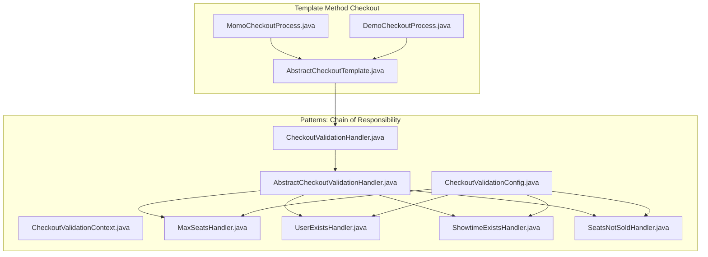
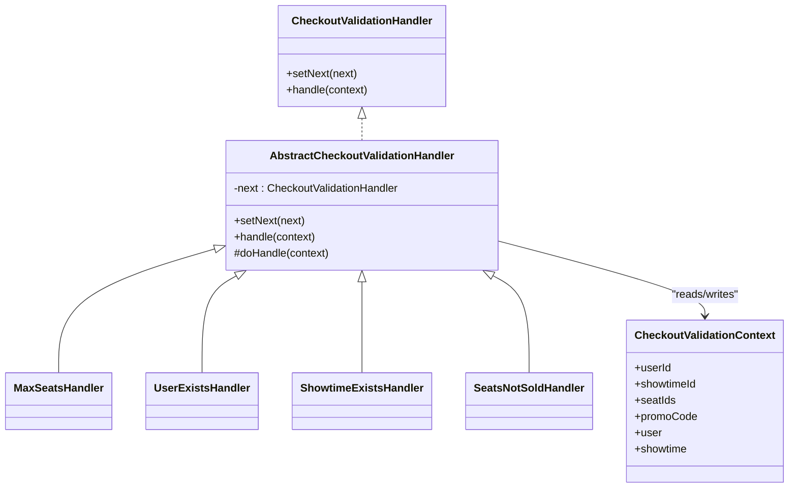
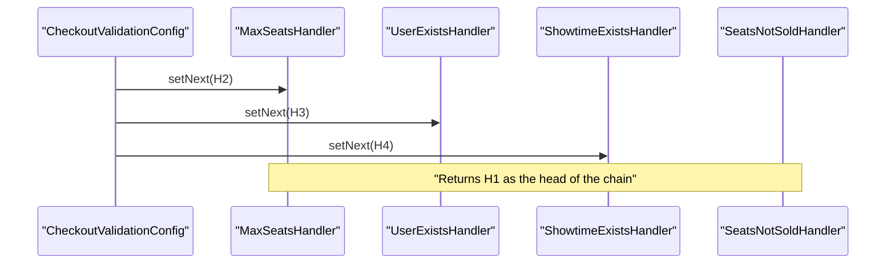
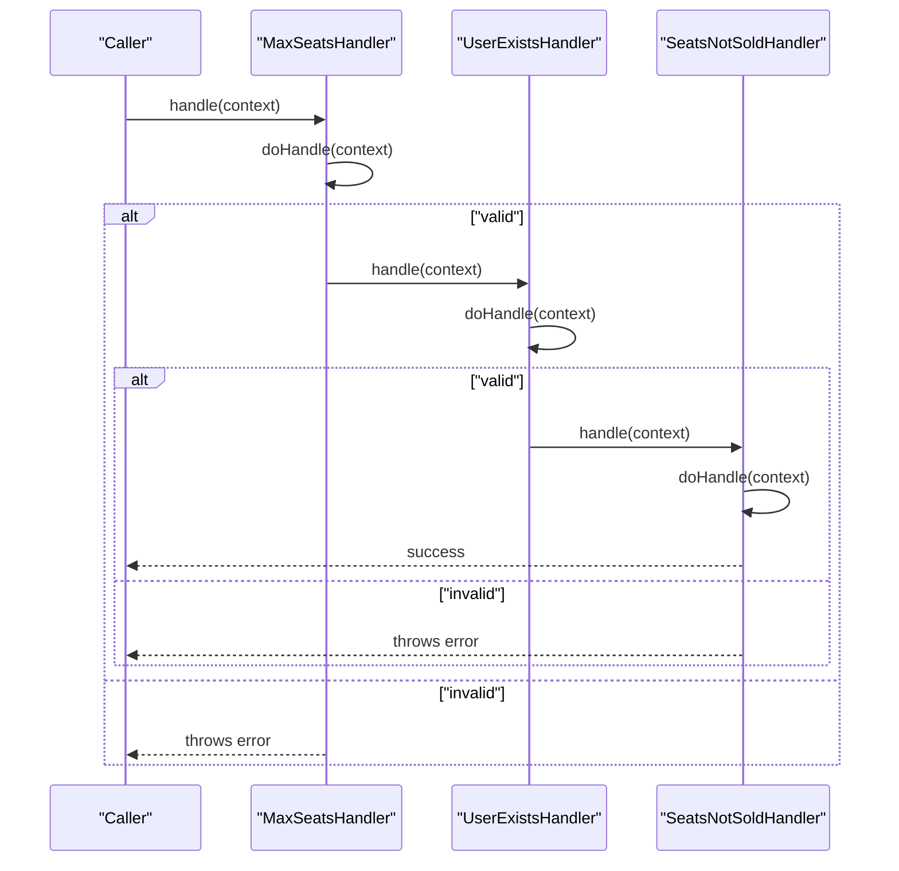
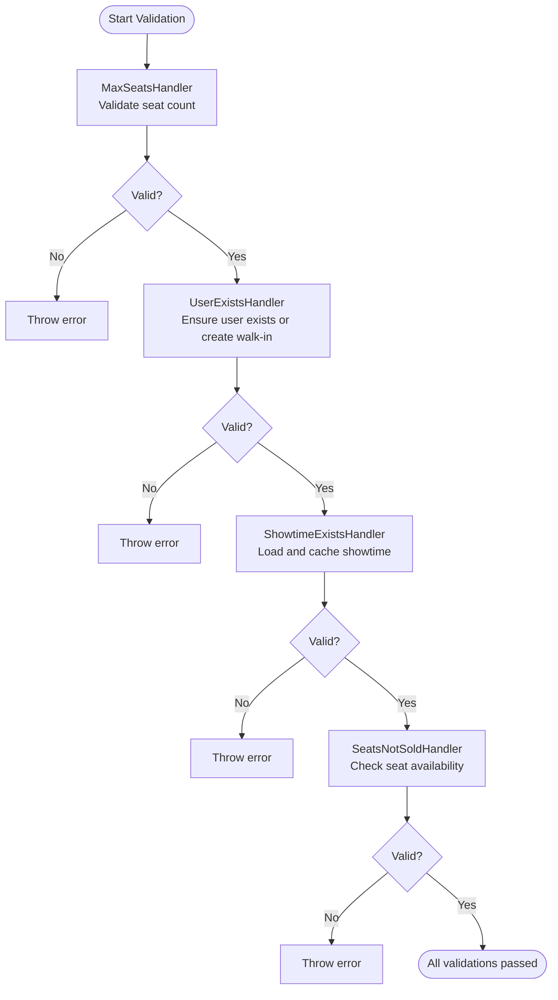
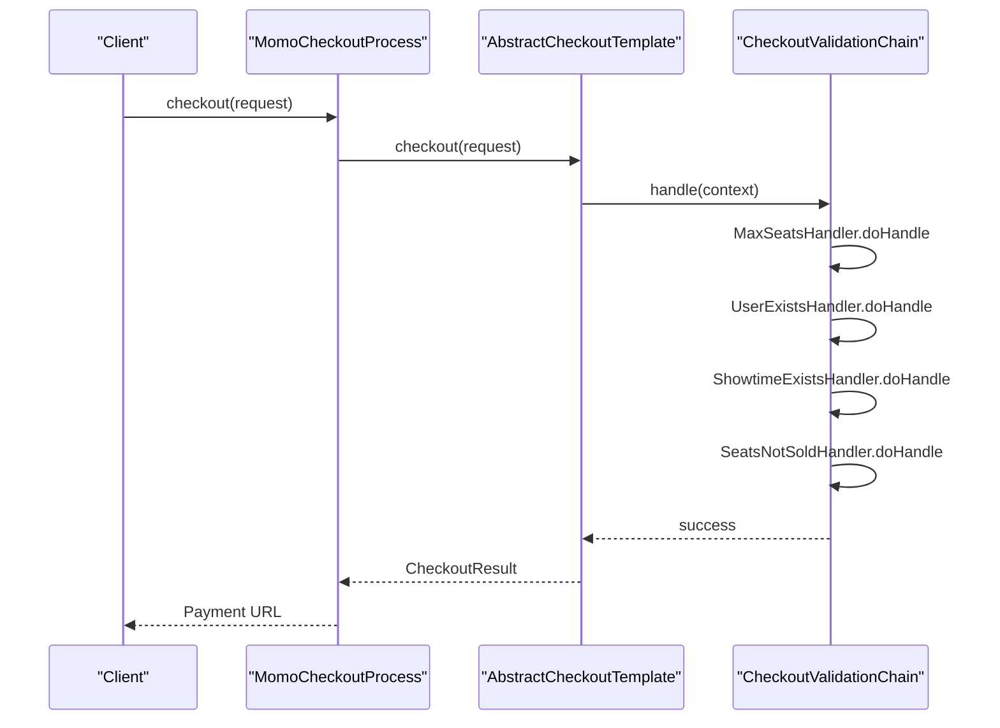
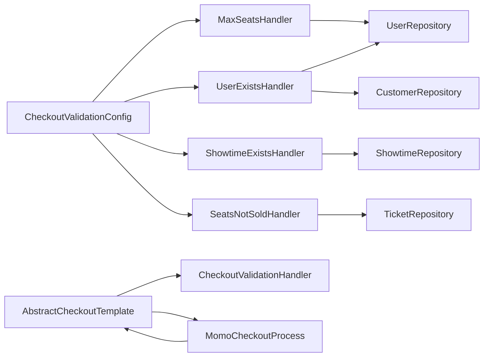

# Chain of Responsibility Pattern

<cite>
**Referenced Files in This Document**
- [AbstractCheckoutValidationHandler.java](file://backend/src/main/java/com/cinema/booking/patterns/chainofresponsibility/AbstractCheckoutValidationHandler.java)
- [CheckoutValidationHandler.java](file://backend/src/main/java/com/cinema/booking/patterns/chainofresponsibility/CheckoutValidationHandler.java)
- [CheckoutValidationContext.java](file://backend/src/main/java/com/cinema/booking/patterns/chainofresponsibility/CheckoutValidationContext.java)
- [MaxSeatsHandler.java](file://backend/src/main/java/com/cinema/booking/patterns/chainofresponsibility/MaxSeatsHandler.java)
- [SeatsNotSoldHandler.java](file://backend/src/main/java/com/cinema/booking/patterns/chainofresponsibility/SeatsNotSoldHandler.java)
- [ShowtimeExistsHandler.java](file://backend/src/main/java/com/cinema/booking/patterns/chainofresponsibility/ShowtimeExistsHandler.java)
- [UserExistsHandler.java](file://backend/src/main/java/com/cinema/booking/patterns/chainofresponsibility/UserExistsHandler.java)
- [CheckoutValidationConfig.java](file://backend/src/main/java/com/cinema/booking/patterns/chainofresponsibility/CheckoutValidationConfig.java)
- [AbstractCheckoutTemplate.java](file://backend/src/main/java/com/cinema/booking/services/template_method/checkout/AbstractCheckoutTemplate.java)
- [MomoCheckoutProcess.java](file://backend/src/main/java/com/cinema/booking/services/template_method/checkout/MomoCheckoutProcess.java)
- [DemoCheckoutProcess.java](file://backend/src/main/java/com/cinema/booking/services/template_method/checkout/DemoCheckoutProcess.java)
- [CheckoutServiceImpl.java](file://backend/src/main/java/com/cinema/booking/services/impl/CheckoutServiceImpl.java)
</cite>

## Table of Contents
1. [Introduction](#introduction)
2. [Project Structure](#project-structure)
3. [Core Components](#core-components)
4. [Architecture Overview](#architecture-overview)
5. [Detailed Component Analysis](#detailed-component-analysis)
6. [Dependency Analysis](#dependency-analysis)
7. [Performance Considerations](#performance-considerations)
8. [Troubleshooting Guide](#troubleshooting-guide)
9. [Conclusion](#conclusion)

## Introduction
This document explains how the Chain of Responsibility pattern is implemented in the checkout validation system. It demonstrates how a pipeline of validation handlers processes booking requests sequentially, enabling modular, extensible validation logic. The document covers the AbstractCheckoutValidationHandler base class, concrete handlers (MaxSeatsHandler, SeatsNotSoldHandler, ShowtimeExistsHandler, UserExistsHandler), and the CheckoutValidationContext. It also shows how the validation chain is wired via CheckoutValidationConfig, how errors propagate through the chain, and how new validation rules can be added without changing existing code.

## Project Structure
The checkout validation system resides under the patterns/chainofresponsibility package and integrates with the template-method checkout processes. The key files are:
- Handler interface and base class
- Concrete validators
- Validation context
- Configuration wiring
- Template-method checkout processes that trigger validation

**Diagram sources**
- [CheckoutValidationHandler.java:1-7](file://backend/src/main/java/com/cinema/booking/patterns/chainofresponsibility/CheckoutValidationHandler.java#L1-L7)
- [AbstractCheckoutValidationHandler.java:1-21](file://backend/src/main/java/com/cinema/booking/patterns/chainofresponsibility/AbstractCheckoutValidationHandler.java#L1-L21)
- [CheckoutValidationContext.java:1-22](file://backend/src/main/java/com/cinema/booking/patterns/chainofresponsibility/CheckoutValidationContext.java#L1-L22)
- [MaxSeatsHandler.java:1-20](file://backend/src/main/java/com/cinema/booking/patterns/chainofresponsibility/MaxSeatsHandler.java#L1-L20)
- [UserExistsHandler.java:1-43](file://backend/src/main/java/com/cinema/booking/patterns/chainofresponsibility/UserExistsHandler.java#L1-L43)
- [ShowtimeExistsHandler.java:1-21](file://backend/src/main/java/com/cinema/booking/patterns/chainofresponsibility/ShowtimeExistsHandler.java#L1-L21)
- [SeatsNotSoldHandler.java:1-24](file://backend/src/main/java/com/cinema/booking/patterns/chainofresponsibility/SeatsNotSoldHandler.java#L1-L24)
- [CheckoutValidationConfig.java:1-23](file://backend/src/main/java/com/cinema/booking/patterns/chainofresponsibility/CheckoutValidationConfig.java#L1-L23)
- [AbstractCheckoutTemplate.java:1-182](file://backend/src/main/java/com/cinema/booking/services/template_method/checkout/AbstractCheckoutTemplate.java#L1-L182)
- [MomoCheckoutProcess.java:1-70](file://backend/src/main/java/com/cinema/booking/services/template_method/checkout/MomoCheckoutProcess.java#L1-L70)
- [DemoCheckoutProcess.java:1-131](file://backend/src/main/java/com/cinema/booking/services/template_method/checkout/DemoCheckoutProcess.java#L1-L131)

**Section sources**
- [CheckoutValidationHandler.java:1-7](file://backend/src/main/java/com/cinema/booking/patterns/chainofresponsibility/CheckoutValidationHandler.java#L1-L7)
- [AbstractCheckoutValidationHandler.java:1-21](file://backend/src/main/java/com/cinema/booking/patterns/chainofresponsibility/AbstractCheckoutValidationHandler.java#L1-L21)
- [CheckoutValidationContext.java:1-22](file://backend/src/main/java/com/cinema/booking/patterns/chainofresponsibility/CheckoutValidationContext.java#L1-L22)
- [CheckoutValidationConfig.java:1-23](file://backend/src/main/java/com/cinema/booking/patterns/chainofresponsibility/CheckoutValidationConfig.java#L1-L23)

## Core Components
- CheckoutValidationHandler: Defines the contract for setting the next handler and performing validation.
- AbstractCheckoutValidationHandler: Implements the chain mechanics, invoking doHandle and delegating to the next handler if present.
- CheckoutValidationContext: Carries inputs (userId, showtimeId, seatIds, promoCode) and cached entities (user, showtime) produced by earlier handlers.
- Concrete Handlers:
  - MaxSeatsHandler: Enforces seat count limits.
  - UserExistsHandler: Ensures user exists or creates a walk-in guest.
  - ShowtimeExistsHandler: Loads and caches showtime.
  - SeatsNotSoldHandler: Verifies seats are available.

These components enable a linear, pluggable validation pipeline where each handler either validates and continues or throws an error.

**Section sources**
- [CheckoutValidationHandler.java:1-7](file://backend/src/main/java/com/cinema/booking/patterns/chainofresponsibility/CheckoutValidationHandler.java#L1-L7)
- [AbstractCheckoutValidationHandler.java:1-21](file://backend/src/main/java/com/cinema/booking/patterns/chainofresponsibility/AbstractCheckoutValidationHandler.java#L1-L21)
- [CheckoutValidationContext.java:1-22](file://backend/src/main/java/com/cinema/booking/patterns/chainofresponsibility/CheckoutValidationContext.java#L1-L22)
- [MaxSeatsHandler.java:1-20](file://backend/src/main/java/com/cinema/booking/patterns/chainofresponsibility/MaxSeatsHandler.java#L1-L20)
- [UserExistsHandler.java:1-43](file://backend/src/main/java/com/cinema/booking/patterns/chainofresponsibility/UserExistsHandler.java#L1-L43)
- [ShowtimeExistsHandler.java:1-21](file://backend/src/main/java/com/cinema/booking/patterns/chainofresponsibility/ShowtimeExistsHandler.java#L1-L21)
- [SeatsNotSoldHandler.java:1-24](file://backend/src/main/java/com/cinema/booking/patterns/chainofresponsibility/SeatsNotSoldHandler.java#L1-L24)

## Architecture Overview
The validation chain is configured as a linked list of handlers. The configuration wires the chain in a fixed order, and the base handler delegates to the next handler after performing its own validation.

**Diagram sources**
- [CheckoutValidationHandler.java:1-7](file://backend/src/main/java/com/cinema/booking/patterns/chainofresponsibility/CheckoutValidationHandler.java#L1-L7)
- [AbstractCheckoutValidationHandler.java:1-21](file://backend/src/main/java/com/cinema/booking/patterns/chainofresponsibility/AbstractCheckoutValidationHandler.java#L1-L21)
- [MaxSeatsHandler.java:1-20](file://backend/src/main/java/com/cinema/booking/patterns/chainofresponsibility/MaxSeatsHandler.java#L1-L20)
- [UserExistsHandler.java:1-43](file://backend/src/main/java/com/cinema/booking/patterns/chainofresponsibility/UserExistsHandler.java#L1-L43)
- [ShowtimeExistsHandler.java:1-21](file://backend/src/main/java/com/cinema/booking/patterns/chainofresponsibility/ShowtimeExistsHandler.java#L1-L21)
- [SeatsNotSoldHandler.java:1-24](file://backend/src/main/java/com/cinema/booking/patterns/chainofresponsibility/SeatsNotSoldHandler.java#L1-L24)
- [CheckoutValidationContext.java:1-22](file://backend/src/main/java/com/cinema/booking/patterns/chainofresponsibility/CheckoutValidationContext.java#L1-L22)

## Detailed Component Analysis

### Handler Chain Setup
The chain is assembled in CheckoutValidationConfig, linking handlers in a specific order. This wiring defines the validation sequence.

**Diagram sources**
- [CheckoutValidationConfig.java:1-23](file://backend/src/main/java/com/cinema/booking/patterns/chainofresponsibility/CheckoutValidationConfig.java#L1-L23)

**Section sources**
- [CheckoutValidationConfig.java:1-23](file://backend/src/main/java/com/cinema/booking/patterns/chainofresponsibility/CheckoutValidationConfig.java#L1-L23)

### Validation Flow and Error Propagation
Each handler executes its validation in order. If a handler detects an invalid condition, it throws an exception; otherwise, it proceeds to the next handler. The base handler delegates to the next handler if present.

**Diagram sources**
- [AbstractCheckoutValidationHandler.java:1-21](file://backend/src/main/java/com/cinema/booking/patterns/chainofresponsibility/AbstractCheckoutValidationHandler.java#L1-L21)
- [MaxSeatsHandler.java:1-20](file://backend/src/main/java/com/cinema/booking/patterns/chainofresponsibility/MaxSeatsHandler.java#L1-L20)
- [UserExistsHandler.java:1-43](file://backend/src/main/java/com/cinema/booking/patterns/chainofresponsibility/UserExistsHandler.java#L1-L43)
- [SeatsNotSoldHandler.java:1-24](file://backend/src/main/java/com/cinema/booking/patterns/chainofresponsibility/SeatsNotSoldHandler.java#L1-L24)

**Section sources**
- [AbstractCheckoutValidationHandler.java:1-21](file://backend/src/main/java/com/cinema/booking/patterns/chainofresponsibility/AbstractCheckoutValidationHandler.java#L1-L21)
- [MaxSeatsHandler.java:1-20](file://backend/src/main/java/com/cinema/booking/patterns/chainofresponsibility/MaxSeatsHandler.java#L1-L20)
- [UserExistsHandler.java:1-43](file://backend/src/main/java/com/cinema/booking/patterns/chainofresponsibility/UserExistsHandler.java#L1-L43)
- [SeatsNotSoldHandler.java:1-24](file://backend/src/main/java/com/cinema/booking/patterns/chainofresponsibility/SeatsNotSoldHandler.java#L1-L24)

### Concrete Handler Responsibilities
- MaxSeatsHandler: Validates seat selection constraints (non-empty and below maximum per booking).
- UserExistsHandler: Ensures user existence; if not a Customer, replaces with a default walk-in guest entity.
- ShowtimeExistsHandler: Loads showtime by ID and caches it in the context.
- SeatsNotSoldHandler: Checks seat availability against sold tickets for the given showtime.

**Diagram sources**
- [MaxSeatsHandler.java:1-20](file://backend/src/main/java/com/cinema/booking/patterns/chainofresponsibility/MaxSeatsHandler.java#L1-L20)
- [UserExistsHandler.java:1-43](file://backend/src/main/java/com/cinema/booking/patterns/chainofresponsibility/UserExistsHandler.java#L1-L43)
- [ShowtimeExistsHandler.java:1-21](file://backend/src/main/java/com/cinema/booking/patterns/chainofresponsibility/ShowtimeExistsHandler.java#L1-L21)
- [SeatsNotSoldHandler.java:1-24](file://backend/src/main/java/com/cinema/booking/patterns/chainofresponsibility/SeatsNotSoldHandler.java#L1-L24)

**Section sources**
- [MaxSeatsHandler.java:1-20](file://backend/src/main/java/com/cinema/booking/patterns/chainofresponsibility/MaxSeatsHandler.java#L1-L20)
- [UserExistsHandler.java:1-43](file://backend/src/main/java/com/cinema/booking/patterns/chainofresponsibility/UserExistsHandler.java#L1-L43)
- [ShowtimeExistsHandler.java:1-21](file://backend/src/main/java/com/cinema/booking/patterns/chainofresponsibility/ShowtimeExistsHandler.java#L1-L21)
- [SeatsNotSoldHandler.java:1-24](file://backend/src/main/java/com/cinema/booking/patterns/chainofresponsibility/SeatsNotSoldHandler.java#L1-L24)

### Integration with Checkout Processes
Although the validation chain is defined separately, the template-method checkout processes demonstrate how validation fits into the broader checkout lifecycle. The AbstractCheckoutTemplate orchestrates user validation and seat validation during checkout, while the Chain of Responsibility handlers can be integrated similarly.

**Diagram sources**
- [MomoCheckoutProcess.java:1-70](file://backend/src/main/java/com/cinema/booking/services/template_method/checkout/MomoCheckoutProcess.java#L1-L70)
- [AbstractCheckoutTemplate.java:1-182](file://backend/src/main/java/com/cinema/booking/services/template_method/checkout/AbstractCheckoutTemplate.java#L1-L182)
- [CheckoutValidationConfig.java:1-23](file://backend/src/main/java/com/cinema/booking/patterns/chainofresponsibility/CheckoutValidationConfig.java#L1-L23)

**Section sources**
- [MomoCheckoutProcess.java:1-70](file://backend/src/main/java/com/cinema/booking/services/template_method/checkout/MomoCheckoutProcess.java#L1-L70)
- [AbstractCheckoutTemplate.java:1-182](file://backend/src/main/java/com/cinema/booking/services/template_method/checkout/AbstractCheckoutTemplate.java#L1-L182)

## Dependency Analysis
The chain depends on Spring-managed components for persistence and caching. The configuration composes the chain from individual handlers. The template-method checkout processes provide a real-world integration point where validation would be invoked prior to proceeding with payment and finalization.

**Diagram sources**
- [CheckoutValidationConfig.java:1-23](file://backend/src/main/java/com/cinema/booking/patterns/chainofresponsibility/CheckoutValidationConfig.java#L1-L23)
- [UserExistsHandler.java:1-43](file://backend/src/main/java/com/cinema/booking/patterns/chainofresponsibility/UserExistsHandler.java#L1-L43)
- [ShowtimeExistsHandler.java:1-21](file://backend/src/main/java/com/cinema/booking/patterns/chainofresponsibility/ShowtimeExistsHandler.java#L1-L21)
- [SeatsNotSoldHandler.java:1-24](file://backend/src/main/java/com/cinema/booking/patterns/chainofresponsibility/SeatsNotSoldHandler.java#L1-L24)
- [AbstractCheckoutTemplate.java:1-182](file://backend/src/main/java/com/cinema/booking/services/template_method/checkout/AbstractCheckoutTemplate.java#L1-L182)
- [MomoCheckoutProcess.java:1-70](file://backend/src/main/java/com/cinema/booking/services/template_method/checkout/MomoCheckoutProcess.java#L1-L70)

**Section sources**
- [CheckoutValidationConfig.java:1-23](file://backend/src/main/java/com/cinema/booking/patterns/chainofresponsibility/CheckoutValidationConfig.java#L1-L23)
- [UserExistsHandler.java:1-43](file://backend/src/main/java/com/cinema/booking/patterns/chainofresponsibility/UserExistsHandler.java#L1-L43)
- [ShowtimeExistsHandler.java:1-21](file://backend/src/main/java/com/cinema/booking/patterns/chainofresponsibility/ShowtimeExistsHandler.java#L1-L21)
- [SeatsNotSoldHandler.java:1-24](file://backend/src/main/java/com/cinema/booking/patterns/chainofresponsibility/SeatsNotSoldHandler.java#L1-L24)
- [AbstractCheckoutTemplate.java:1-182](file://backend/src/main/java/com/cinema/booking/services/template_method/checkout/AbstractCheckoutTemplate.java#L1-L182)
- [MomoCheckoutProcess.java:1-70](file://backend/src/main/java/com/cinema/booking/services/template_method/checkout/MomoCheckoutProcess.java#L1-L70)

## Performance Considerations
- Each handler performs a single validation concern, keeping complexity low and allowing easy optimization per handler.
- Seat availability checks iterate over seat IDs; consider batching repository queries if performance becomes a concern.
- Using cached entities in CheckoutValidationContext reduces repeated lookups across handlers.
- Keep the chain short and ordered to minimize overhead; avoid unnecessary repository calls.

## Troubleshooting Guide
Common issues and resolutions:
- Seat limit exceeded: The MaxSeatsHandler enforces a maximum number of seats per booking. Adjust the limit or reduce seat selection.
- Seat already sold: The SeatsNotSoldHandler prevents purchasing sold seats. Choose alternative seats.
- Showtime not found: The ShowtimeExistsHandler requires a valid showtimeId. Verify the showtimeId value.
- User not found: The UserExistsHandler requires a valid userId. Ensure the user exists or use a valid customer ID.
- Walk-in guest creation: If a non-Customer user is supplied, the system creates a default walk-in guest. Confirm expected behavior for staff or anonymous users.

**Section sources**
- [MaxSeatsHandler.java:1-20](file://backend/src/main/java/com/cinema/booking/patterns/chainofresponsibility/MaxSeatsHandler.java#L1-L20)
- [SeatsNotSoldHandler.java:1-24](file://backend/src/main/java/com/cinema/booking/patterns/chainofresponsibility/SeatsNotSoldHandler.java#L1-L24)
- [ShowtimeExistsHandler.java:1-21](file://backend/src/main/java/com/cinema/booking/patterns/chainofresponsibility/ShowtimeExistsHandler.java#L1-L21)
- [UserExistsHandler.java:1-43](file://backend/src/main/java/com/cinema/booking/patterns/chainofresponsibility/UserExistsHandler.java#L1-L43)

## Conclusion
The Chain of Responsibility pattern cleanly separates validation concerns into discrete, composable handlers. The CheckoutValidationConfig defines the order, AbstractCheckoutValidationHandler manages delegation, and CheckoutValidationContext carries state across handlers. This design allows adding new validation rules by implementing a new handler and appending it to the chain, without modifying existing code—enabling flexibility and maintainability in the checkout validation system.