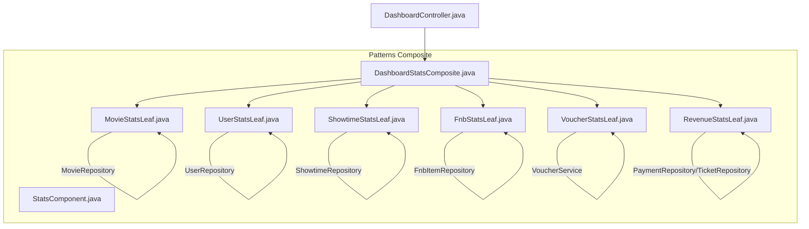
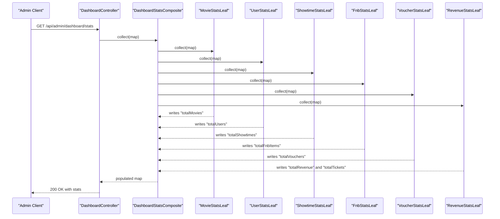
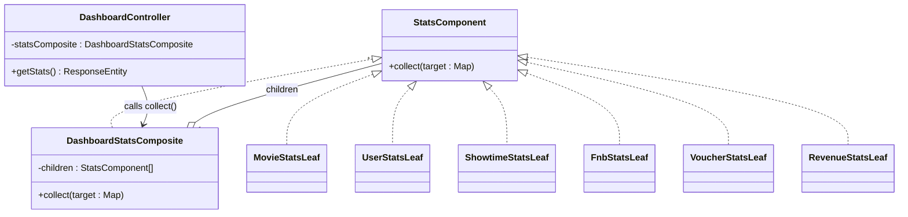

# Composite Pattern

<cite>
**Referenced Files in This Document**
- [StatsComponent.java](file://backend/src/main/java/com/cinema/booking/patterns/composite/StatsComponent.java)
- [DashboardStatsComposite.java](file://backend/src/main/java/com/cinema/booking/patterns/composite/DashboardStatsComposite.java)
- [FnbStatsLeaf.java](file://backend/src/main/java/com/cinema/booking/patterns/composite/FnbStatsLeaf.java)
- [MovieStatsLeaf.java](file://backend/src/main/java/com/cinema/booking/patterns/composite/MovieStatsLeaf.java)
- [RevenueStatsLeaf.java](file://backend/src/main/java/com/cinema/booking/patterns/composite/RevenueStatsLeaf.java)
- [ShowtimeStatsLeaf.java](file://backend/src/main/java/com/cinema/booking/patterns/composite/ShowtimeStatsLeaf.java)
- [UserStatsLeaf.java](file://backend/src/main/java/com/cinema/booking/patterns/composite/UserStatsLeaf.java)
- [VoucherStatsLeaf.java](file://backend/src/main/java/com/cinema/booking/patterns/composite/VoucherStatsLeaf.java)
- [DashboardController.java](file://backend/src/main/java/com/cinema/booking/controllers/DashboardController.java)
- [05-composite.md](file://docs/patterns/05-composite.md)
- [05-composite.md](file://UML/pattern-only/05-composite.md)
</cite>

## Table of Contents
1. [Introduction](#introduction)
2. [Project Structure](#project-structure)
3. [Core Components](#core-components)
4. [Architecture Overview](#architecture-overview)
5. [Detailed Component Analysis](#detailed-component-analysis)
6. [Dependency Analysis](#dependency-analysis)
7. [Performance Considerations](#performance-considerations)
8. [Troubleshooting Guide](#troubleshooting-guide)
9. [Conclusion](#conclusion)

## Introduction
This document explains the Composite pattern implementation in the dashboard statistics aggregation system. It demonstrates how a uniform interface allows both simple statistics (leaf nodes) and composite aggregations to be treated consistently. The goal is to provide a cohesive, testable, and extensible way to build admin dashboard metrics from multiple domains (movies, users, showtimes, food & beverage revenue, vouchers, and total revenue).

## Project Structure
The Composite pattern resides under the backend’s patterns/composite package and integrates with Spring-managed components. The controller delegates all statistics collection to a composite that orchestrates leaf components.

**Diagram sources**
- [DashboardStatsComposite.java:14-43](file://backend/src/main/java/com/cinema/booking/patterns/composite/DashboardStatsComposite.java#L14-L43)
- [StatsComponent.java:9-11](file://backend/src/main/java/com/cinema/booking/patterns/composite/StatsComponent.java#L9-L11)
- [MovieStatsLeaf.java:11-19](file://backend/src/main/java/com/cinema/booking/patterns/composite/MovieStatsLeaf.java#L11-L19)
- [UserStatsLeaf.java:11-19](file://backend/src/main/java/com/cinema/booking/patterns/composite/UserStatsLeaf.java#L11-L19)
- [ShowtimeStatsLeaf.java:11-19](file://backend/src/main/java/com/cinema/booking/patterns/composite/ShowtimeStatsLeaf.java#L11-L19)
- [FnbStatsLeaf.java:11-19](file://backend/src/main/java/com/cinema/booking/patterns/composite/FnbStatsLeaf.java#L11-L19)
- [VoucherStatsLeaf.java:11-24](file://backend/src/main/java/com/cinema/booking/patterns/composite/VoucherStatsLeaf.java#L11-L24)
- [RevenueStatsLeaf.java:15-31](file://backend/src/main/java/com/cinema/booking/patterns/composite/RevenueStatsLeaf.java#L15-L31)
- [DashboardController.java:23-37](file://backend/src/main/java/com/cinema/booking/controllers/DashboardController.java#L23-L37)

**Section sources**
- [DashboardStatsComposite.java:14-43](file://backend/src/main/java/com/cinema/booking/patterns/composite/DashboardStatsComposite.java#L14-L43)
- [DashboardController.java:23-37](file://backend/src/main/java/com/cinema/booking/controllers/DashboardController.java#L23-L37)

## Core Components
- StatsComponent: The common interface that defines a single operation to collect statistics into a shared map.
- DashboardStatsComposite: The composite that holds a list of child components and iterates through them to populate the map.
- Leaf components: Individual statistics collectors for movies, users, showtimes, F&B items, vouchers, and total revenue.

Key responsibilities:
- Uniform treatment: All components implement the same interface, enabling polymorphic behavior.
- Separation of concerns: Each leaf encapsulates its own data source and aggregation logic.
- Extensibility: Adding a new statistic requires a new leaf and registration in the composite.

**Section sources**
- [StatsComponent.java:9-11](file://backend/src/main/java/com/cinema/booking/patterns/composite/StatsComponent.java#L9-L11)
- [DashboardStatsComposite.java:17-42](file://backend/src/main/java/com/cinema/booking/patterns/composite/DashboardStatsComposite.java#L17-L42)

## Architecture Overview
The controller invokes a single method on the composite, which delegates to each leaf. Each leaf writes its metrics into a shared map, returning a unified dashboard payload.

**Diagram sources**
- [DashboardController.java:33-37](file://backend/src/main/java/com/cinema/booking/controllers/DashboardController.java#L33-L37)
- [DashboardStatsComposite.java:38-42](file://backend/src/main/java/com/cinema/booking/patterns/composite/DashboardStatsComposite.java#L38-L42)
- [MovieStatsLeaf.java:16-18](file://backend/src/main/java/com/cinema/booking/patterns/composite/MovieStatsLeaf.java#L16-L18)
- [UserStatsLeaf.java:16-18](file://backend/src/main/java/com/cinema/booking/patterns/composite/UserStatsLeaf.java#L16-L18)
- [ShowtimeStatsLeaf.java:16-18](file://backend/src/main/java/com/cinema/booking/patterns/composite/ShowtimeStatsLeaf.java#L16-L18)
- [FnbStatsLeaf.java:16-18](file://backend/src/main/java/com/cinema/booking/patterns/composite/FnbStatsLeaf.java#L16-L18)
- [VoucherStatsLeaf.java:16-23](file://backend/src/main/java/com/cinema/booking/patterns/composite/VoucherStatsLeaf.java#L16-L23)
- [RevenueStatsLeaf.java:21-30](file://backend/src/main/java/com/cinema/booking/patterns/composite/RevenueStatsLeaf.java#L21-L30)

## Detailed Component Analysis

### StatsComponent Interface
- Purpose: Defines a single method to collect statistics into a shared map.
- Contract: Implementations must write domain-specific keys into the provided map.

Benefits:
- Enables polymorphism across leaf and composite.
- Simplifies controller integration to a single call.

**Section sources**
- [StatsComponent.java:9-11](file://backend/src/main/java/com/cinema/booking/patterns/composite/StatsComponent.java#L9-L11)

### DashboardStatsComposite
- Role: Orchestrates child components and delegates collection.
- Composition: Holds a fixed list of leaf components injected via constructor.
- Behavior: Iterates children and calls collect on each.

Extensibility:
- Adding a new statistic involves creating a leaf and registering it in the constructor.

**Section sources**
- [DashboardStatsComposite.java:17-35](file://backend/src/main/java/com/cinema/booking/patterns/composite/DashboardStatsComposite.java#L17-L35)
- [DashboardStatsComposite.java:38-42](file://backend/src/main/java/com/cinema/booking/patterns/composite/DashboardStatsComposite.java#L38-L42)

### Leaf Components

#### MovieStatsLeaf
- Responsibility: Counts total movies and writes the count into the map.
- Data source: Movie repository.

**Section sources**
- [MovieStatsLeaf.java:11-19](file://backend/src/main/java/com/cinema/booking/patterns/composite/MovieStatsLeaf.java#L11-L19)

#### UserStatsLeaf
- Responsibility: Counts total users and writes the count into the map.
- Data source: User repository.

**Section sources**
- [UserStatsLeaf.java:11-19](file://backend/src/main/java/com/cinema/booking/patterns/composite/UserStatsLeaf.java#L11-L19)

#### ShowtimeStatsLeaf
- Responsibility: Counts total showtimes and writes the count into the map.
- Data source: Showtime repository.

**Section sources**
- [ShowtimeStatsLeaf.java:11-19](file://backend/src/main/java/com/cinema/booking/patterns/composite/ShowtimeStatsLeaf.java#L11-L19)

#### FnbStatsLeaf
- Responsibility: Writes the total number of F&B items into the map.
- Data source: Fnb item repository.

**Section sources**
- [FnbStatsLeaf.java:11-19](file://backend/src/main/java/com/cinema/booking/patterns/composite/FnbStatsLeaf.java#L11-L19)

#### VoucherStatsLeaf
- Responsibility: Writes the total number of vouchers into the map.
- Data source: Voucher service.
- Robustness: Falls back to zero when service access fails.

**Section sources**
- [VoucherStatsLeaf.java:11-24](file://backend/src/main/java/com/cinema/booking/patterns/composite/VoucherStatsLeaf.java#L11-L24)

#### RevenueStatsLeaf
- Responsibility: Computes total revenue from successful payments and total tickets sold.
- Data sources: Payment repository and ticket repository.
- Aggregation: Sums amounts from successful payments.

**Section sources**
- [RevenueStatsLeaf.java:15-31](file://backend/src/main/java/com/cinema/booking/patterns/composite/RevenueStatsLeaf.java#L15-L31)

### Controller Integration
- The controller injects the composite and calls collect once.
- Returns a single map containing all metrics.

**Section sources**
- [DashboardController.java:23-37](file://backend/src/main/java/com/cinema/booking/controllers/DashboardController.java#L23-L37)

## Dependency Analysis
The composite pattern reduces controller coupling by centralizing statistics orchestration. Each leaf depends on its respective repository or service, while the composite coordinates them.

**Diagram sources**
- [StatsComponent.java:9-11](file://backend/src/main/java/com/cinema/booking/patterns/composite/StatsComponent.java#L9-L11)
- [DashboardStatsComposite.java:17-42](file://backend/src/main/java/com/cinema/booking/patterns/composite/DashboardStatsComposite.java#L17-L42)
- [DashboardController.java:23-37](file://backend/src/main/java/com/cinema/booking/controllers/DashboardController.java#L23-L37)

**Section sources**
- [DashboardStatsComposite.java:17-42](file://backend/src/main/java/com/cinema/booking/patterns/composite/DashboardStatsComposite.java#L17-L42)
- [DashboardController.java:23-37](file://backend/src/main/java/com/cinema/booking/controllers/DashboardController.java#L23-L37)

## Performance Considerations
- Single pass aggregation: The composite iterates children once, minimizing overhead.
- Repository/service boundaries: Each leaf performs its own query; consider caching or batch operations if repositories become hotspots.
- Exception safety: The voucher leaf gracefully handles failures by falling back to zero, preventing partial failure from breaking the whole response.

[No sources needed since this section provides general guidance]

## Troubleshooting Guide
Common issues and resolutions:
- Missing metrics in response: Verify that the composite constructor includes all intended leaves and that each leaf writes its expected key.
- Zero voucher count: Confirm that the voucher service is reachable; the leaf intentionally falls back to zero on exceptions.
- Revenue mismatch: Ensure payment repository filters by success status and that ticket repository count aligns with expected sales.

**Section sources**
- [VoucherStatsLeaf.java:16-23](file://backend/src/main/java/com/cinema/booking/patterns/composite/VoucherStatsLeaf.java#L16-L23)
- [RevenueStatsLeaf.java:22-29](file://backend/src/main/java/com/cinema/booking/patterns/composite/RevenueStatsLeaf.java#L22-L29)

## Conclusion
The Composite pattern cleanly separates concerns across statistics domains while providing a uniform interface for collection. The controller remains minimal, and adding new metrics is straightforward: create a leaf and register it in the composite. This design improves maintainability, testability, and extensibility for the admin dashboard statistics system.