# Design Patterns Implementation

<cite>
**Referenced Files in This Document**
- [AbstractCheckoutValidationHandler.java](file://backend/src/main/java/com/cinema/booking/patterns/chainofresponsibility/AbstractCheckoutValidationHandler.java)
- [MaxSeatsHandler.java](file://backend/src/main/java/com/cinema/booking/patterns/chainofresponsibility/MaxSeatsHandler.java)
- [CheckoutValidationContext.java](file://backend/src/main/java/com/cinema/booking/patterns/chainofresponsibility/CheckoutValidationContext.java)
- [CheckoutValidationConfig.java](file://backend/src/main/java/com/cinema/booking/patterns/chainofresponsibility/CheckoutValidationConfig.java)
- [PostPaymentMediator.java](file://backend/src/main/java/com/cinema/booking/patterns/mediator/PostPaymentMediator.java)
- [PaymentColleague.java](file://backend/src/main/java/com/cinema/booking/patterns/mediator/PaymentColleague.java)
- [MomoCallbackContext.java](file://backend/src/main/java/com/cinema/booking/patterns/mediator/MomoCallbackContext.java)
- [CachingMovieServiceProxy.java](file://backend/src/main/java/com/cinema/booking/patterns/proxy/CachingMovieServiceProxy.java)
- [ShowtimeSpecifications.java](file://backend/src/main/java/com/cinema/booking/patterns/specification/ShowtimeSpecifications.java)
- [DashboardStatsComposite.java](file://backend/src/main/java/com/cinema/booking/patterns/composite/DashboardStatsComposite.java)
- [StatsComponent.java](file://backend/src/main/java/com/cinema/booking/patterns/composite/StatsComponent.java)
- [MovieStatsLeaf.java](file://backend/src/main/java/com/cinema/booking/patterns/composite/MovieStatsLeaf.java)
- [UserStatsLeaf.java](file://backend/src/main/java/com/cinema/booking/patterns/composite/UserStatsLeaf.java)
- [ShowtimeStatsLeaf.java](file://backend/src/main/java/com/cinema/booking/patterns/composite/ShowtimeStatsLeaf.java)
- [FnbStatsLeaf.java](file://backend/src/main/java/com/cinema/booking/patterns/composite/FnbStatsLeaf.java)
- [VoucherStatsLeaf.java](file://backend/src/main/java/com/cinema/booking/patterns/composite/VoucherStatsLeaf.java)
- [RevenueStatsLeaf.java](file://backend/src/main/java/com/cinema/booking/patterns/composite/RevenueStatsLeaf.java)
- [EmailTemplate.java](file://backend/src/main/java/com/cinema/booking/patterns/prototype/EmailTemplate.java)
- [TicketEmailPrototype.java](file://backend/src/main/java/com/cinema/booking/patterns/prototype/TicketEmailPrototype.java)
- [RefundEmailPrototype.java](file://backend/src/main/java/com/cinema/booking/patterns/prototype/RefundEmailPrototype.java)
- [WelcomeEmailPrototype.java](file://backend/src/main/java/com/cinema/booking/patterns/prototype/WelcomeEmailPrototype.java)
- [BookingContext.java](file://backend/src/main/java/com/cinema/booking/patterns/state/BookingContext.java)
- [BookingState.java](file://backend/src/main/java/com/cinema/booking/patterns/state/BookingState.java)
- [StateFactory.java](file://backend/src/main/java/com/cinema/booking/patterns/state/StateFactory.java)
- [ConfirmedState.java](file://backend/src/main/java/com/cinema/booking/patterns/state/ConfirmedState.java)
- [CancelledState.java](file://backend/src/main/java/com/cinema/booking/patterns/state/CancelledState.java)
- [PendingState.java](file://backend/src/main/java/com/cinema/booking/patterns/state/PendingState.java)
- [RefundedState.java](file://backend/src/main/java/com/cinema/booking/patterns/state/RefundedState.java)
- [IPricingEngine.java](file://backend/src/main/java/com/cinema/booking/services/strategy_decorator/pricing/IPricingEngine.java)
- [PricingEngine.java](file://backend/src/main/java/com/cinema/booking/services/strategy_decorator/pricing/PricingEngine.java)
- [BaseDiscountDecorator.java](file://backend/src/main/java/com/cinema/booking/services/strategy_decorator/pricing/BaseDiscountDecorator.java)
- [NoDiscount.java](file://backend/src/main/java/com/cinema/booking/services/strategy_decorator/pricing/NoDiscount.java)
- [PromotionDiscountDecorator.java](file://backend/src/main/java/com/cinema/booking/services/strategy_decorator/pricing/PromotionDiscountDecorator.java)
- [MemberDiscountDecorator.java](file://backend/src/main/java/com/cinema/booking/services/strategy_decorator/pricing/MemberDiscountDecorator.java)
- [PricingContext.java](file://backend/src/main/java/com/cinema/booking/services/strategy_decorator/pricing/PricingContext.java)
- [PricingContextBuilder.java](file://backend/src/main/java/com/cinema/booking/services/strategy_decorator/pricing/PricingContextBuilder.java)
- [PricingLineType.java](file://backend/src/main/java/com/cinema/booking/services/strategy_decorator/pricing/PricingLineType.java)
- [TicketPricingStrategy.java](file://backend/src/main/java/com/cinema/booking/services/strategy_decorator/pricing/TicketPricingStrategy.java)
- [FnbPricingStrategy.java](file://backend/src/main/java/com/cinema/booking/services/strategy_decorator/pricing/FnbPricingStrategy.java)
- [TimeBasedPricingStrategy.java](file://backend/src/main/java/com/cinema/booking/services/strategy_decorator/pricing/TimeBasedPricingStrategy.java)
- [CachingPricingEngineProxy.java](file://backend/src/main/java/com/cinema/booking/services/strategy_decorator/pricing/CachingPricingEngineProxy.java)
</cite>

## Table of Contents
1. [Introduction](#introduction)
2. [Project Structure](#project-structure)
3. [Core Components](#core-components)
4. [Architecture Overview](#architecture-overview)
5. [Detailed Component Analysis](#detailed-component-analysis)
6. [Dependency Analysis](#dependency-analysis)
7. [Performance Considerations](#performance-considerations)
8. [Troubleshooting Guide](#troubleshooting-guide)
9. [Conclusion](#conclusion)

## Introduction
This document explains eight GoF design patterns implemented in the cinema booking system. It focuses on how each pattern solves a specific problem in the booking lifecycle and demonstrates real-world usage within the application. The documented patterns are:
- Chain of Responsibility for checkout validation
- Mediator for post-payment coordination
- Proxy for caching movie services
- Specification for flexible query building
- Composite for dashboard statistics aggregation
- Prototype for email templates
- State for seat and booking management
- Strategy/Decorator for pricing calculations

## Project Structure
The patterns are organized under dedicated packages within the backend module:
- Chain of Responsibility: checkout validation handlers
- Mediator: post-payment orchestration
- Proxy: movie service caching
- Specification: JPA criteria builders
- Composite: dashboard statistics
- Prototype: email templates
- State: booking state machine
- Strategy/Decorator: pricing engine

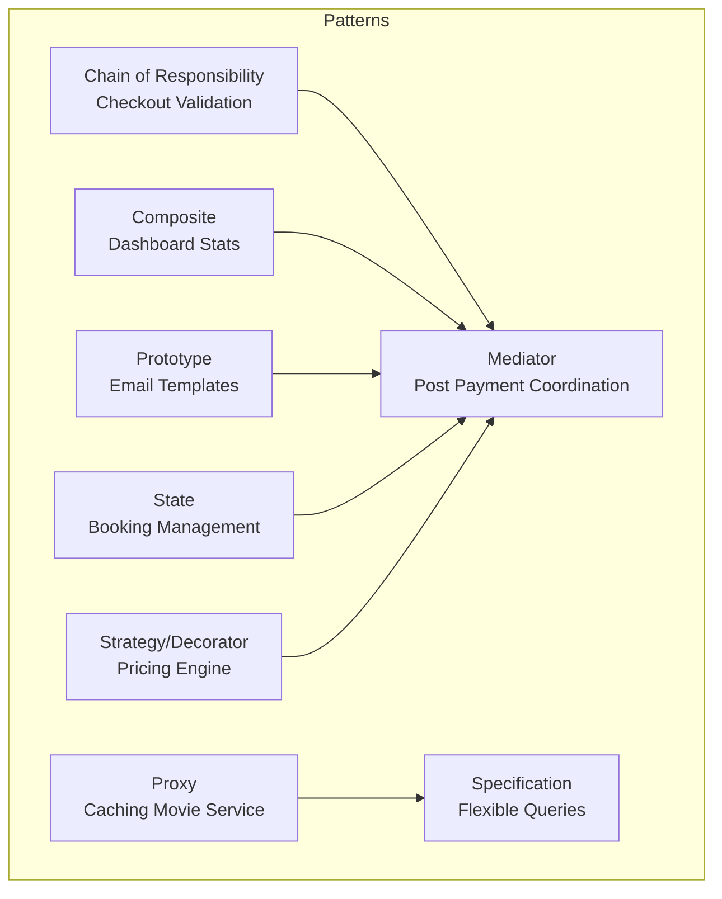

[No sources needed since this diagram shows conceptual structure]

## Core Components
This section outlines each pattern’s purpose, implementation, and benefits in the booking system.

- Chain of Responsibility (Checkout Validation)
  - Purpose: Enforce multiple validation rules in a configurable pipeline without coupling validators.
  - Implementation: An abstract handler delegates to the next handler and concrete handlers check seat limits and availability.
  - Benefits: Extensible validations, centralized error propagation, and readable rule composition.

- Mediator (Post-Payment Coordination)
  - Purpose: Coordinate side effects after payment completion (booking updates, inventory rollbacks, emails).
  - Implementation: A mediator invokes ordered colleague actions on success/failure callbacks.
  - Benefits: Loose coupling among collaborators, predictable execution order, and simplified callback handling.

- Proxy (Caching Movie Services)
  - Purpose: Add transparent caching around movie queries while invalidating on mutations.
  - Implementation: A primary proxy wraps the real movie service and uses Redis for caching.
  - Benefits: Reduced latency for reads, consistent cache invalidation, and seamless integration.

- Specification (Flexible Query Building)
  - Purpose: Compose JPA Specifications dynamically for showtime filtering.
  - Implementation: Static factory methods return reusable predicates; clients combine them via Specification.where(...).and(...).
  - Benefits: Readable filters, reuse across repositories, and safe null handling.

- Composite (Dashboard Statistics)
  - Purpose: Aggregate multiple statistics into a single payload for the dashboard.
  - Implementation: A composite orchestrates leaf collectors to populate a shared map.
  - Benefits: Centralized collection, consistent aggregation, and easy extension.

- Prototype (Email Templates)
  - Purpose: Clone preconfigured email templates to produce personalized messages.
  - Implementation: A template interface defines clone and message-building methods.
  - Benefits: Consistent templates, minimal duplication, and safe per-message customization.

- State (Seat and Booking Management)
  - Purpose: Model booking lifecycle transitions with encapsulated behavior.
  - Implementation: A context delegates operations to current state; state factory maps persisted statuses.
  - Benefits: Clear state transitions, encapsulated logic, and persistence alignment.

- Strategy/Decorator (Pricing Calculations)
  - Purpose: Calculate totals by combining pricing strategies and applying discounts via decorators.
  - Implementation: Strategies compute per-line totals; decorators compose discounts; engine orchestrates and builds a breakdown.
  - Benefits: Pluggable pricing rules, layered discount logic, and robust total computation.

**Section sources**
- [AbstractCheckoutValidationHandler.java:1-21](file://backend/src/main/java/com/cinema/booking/patterns/chainofresponsibility/AbstractCheckoutValidationHandler.java#L1-L21)
- [MaxSeatsHandler.java:1-20](file://backend/src/main/java/com/cinema/booking/patterns/chainofresponsibility/MaxSeatsHandler.java#L1-L20)
- [PostPaymentMediator.java:1-47](file://backend/src/main/java/com/cinema/booking/patterns/mediator/PostPaymentMediator.java#L1-L47)
- [PaymentColleague.java:1-7](file://backend/src/main/java/com/cinema/booking/patterns/mediator/PaymentColleague.java#L1-L7)
- [CachingMovieServiceProxy.java:1-114](file://backend/src/main/java/com/cinema/booking/patterns/proxy/CachingMovieServiceProxy.java#L1-L114)
- [ShowtimeSpecifications.java:1-53](file://backend/src/main/java/com/cinema/booking/patterns/specification/ShowtimeSpecifications.java#L1-L53)
- [DashboardStatsComposite.java:1-44](file://backend/src/main/java/com/cinema/booking/patterns/composite/DashboardStatsComposite.java#L1-L44)
- [EmailTemplate.java:1-16](file://backend/src/main/java/com/cinema/booking/patterns/prototype/EmailTemplate.java#L1-L16)
- [BookingContext.java:1-38](file://backend/src/main/java/com/cinema/booking/patterns/state/BookingContext.java#L1-L38)
- [PricingEngine.java:1-117](file://backend/src/main/java/com/cinema/booking/services/strategy_decorator/pricing/PricingEngine.java#L1-L117)
- [IPricingEngine.java:1-12](file://backend/src/main/java/com/cinema/booking/services/strategy_decorator/pricing/IPricingEngine.java#L1-L12)

## Architecture Overview
The patterns integrate across layers to support checkout, payment, caching, filtering, reporting, email delivery, state transitions, and pricing.

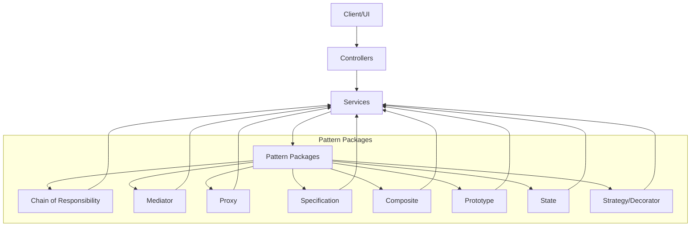

[No sources needed since this diagram shows conceptual architecture]

## Detailed Component Analysis

### Chain of Responsibility: Checkout Validation
- Problem solved: Enforce multiple checkout rules (e.g., seat count) without tightly coupling validators.
- Implementation highlights:
  - Abstract base handler manages chaining and delegates to the next handler.
  - Concrete validator checks maximum seats and throws descriptive errors when violated.
  - Context carries inputs like seat IDs and showtime identifiers.
  - Configuration wires handlers into a chain.

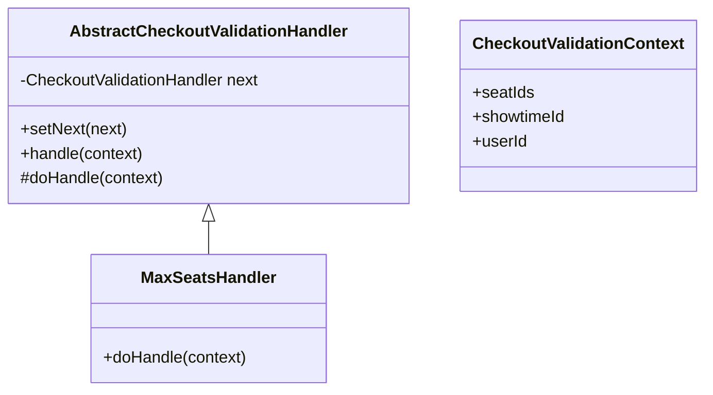

**Diagram sources**
- [AbstractCheckoutValidationHandler.java:1-21](file://backend/src/main/java/com/cinema/booking/patterns/chainofresponsibility/AbstractCheckoutValidationHandler.java#L1-L21)
- [MaxSeatsHandler.java:1-20](file://backend/src/main/java/com/cinema/booking/patterns/chainofresponsibility/MaxSeatsHandler.java#L1-L20)
- [CheckoutValidationContext.java](file://backend/src/main/java/com/cinema/booking/patterns/chainofresponsibility/CheckoutValidationContext.java)

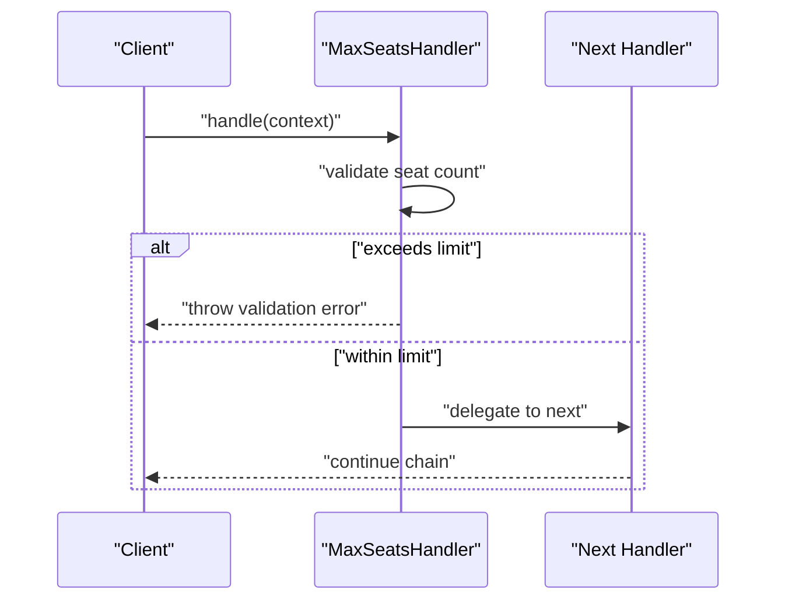

**Diagram sources**
- [MaxSeatsHandler.java:10-18](file://backend/src/main/java/com/cinema/booking/patterns/chainofresponsibility/MaxSeatsHandler.java#L10-L18)
- [AbstractCheckoutValidationHandler.java:12-17](file://backend/src/main/java/com/cinema/booking/patterns/chainofresponsibility/AbstractCheckoutValidationHandler.java#L12-L17)

**Section sources**
- [AbstractCheckoutValidationHandler.java:1-21](file://backend/src/main/java/com/cinema/booking/patterns/chainofresponsibility/AbstractCheckoutValidationHandler.java#L1-L21)
- [MaxSeatsHandler.java:1-20](file://backend/src/main/java/com/cinema/booking/patterns/chainofresponsibility/MaxSeatsHandler.java#L1-L20)
- [CheckoutValidationContext.java](file://backend/src/main/java/com/cinema/booking/patterns/chainofresponsibility/CheckoutValidationContext.java)
- [CheckoutValidationConfig.java](file://backend/src/main/java/com/cinema/booking/patterns/chainofresponsibility/CheckoutValidationConfig.java)

### Mediator: Post-Payment Coordination
- Problem solved: Coordinate multiple side effects after payment callbacks without tight coupling.
- Implementation highlights:
  - Mediator maintains a fixed-order list of colleagues.
  - On success/failure, it notifies each colleague to perform its role (booking update, inventory rollback, email).
  - Colleagues implement a common interface and react to callback context.

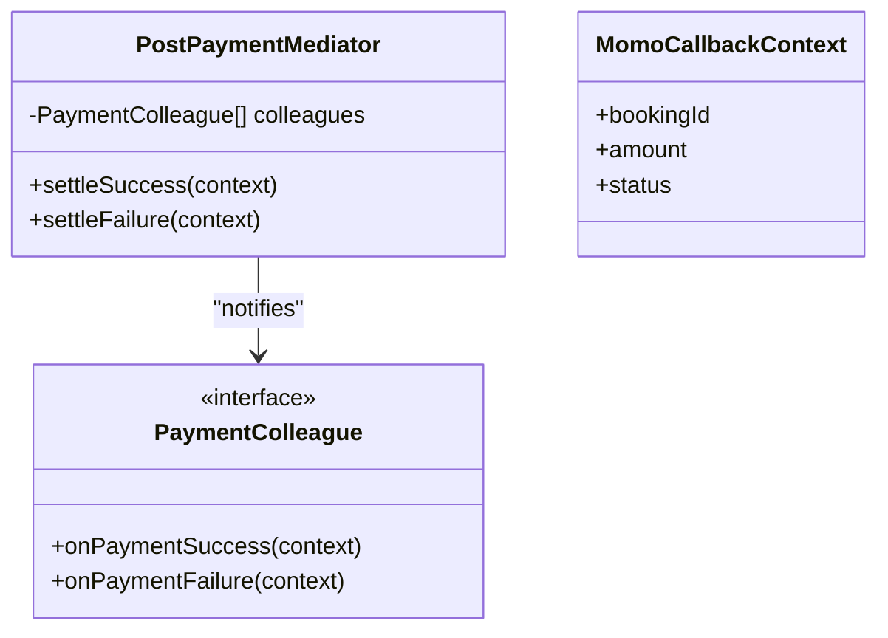

**Diagram sources**
- [PostPaymentMediator.java:10-47](file://backend/src/main/java/com/cinema/booking/patterns/mediator/PostPaymentMediator.java#L10-L47)
- [PaymentColleague.java:1-7](file://backend/src/main/java/com/cinema/booking/patterns/mediator/PaymentColleague.java#L1-L7)
- [MomoCallbackContext.java](file://backend/src/main/java/com/cinema/booking/patterns/mediator/MomoCallbackContext.java)

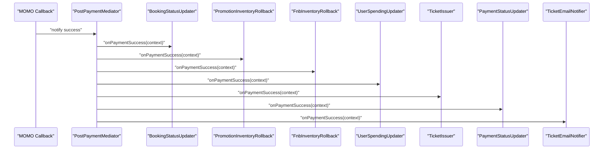

**Diagram sources**
- [PostPaymentMediator.java:35-45](file://backend/src/main/java/com/cinema/booking/patterns/mediator/PostPaymentMediator.java#L35-L45)

**Section sources**
- [PostPaymentMediator.java:1-47](file://backend/src/main/java/com/cinema/booking/patterns/mediator/PostPaymentMediator.java#L1-L47)
- [PaymentColleague.java:1-7](file://backend/src/main/java/com/cinema/booking/patterns/mediator/PaymentColleague.java#L1-L7)
- [MomoCallbackContext.java](file://backend/src/main/java/com/cinema/booking/patterns/mediator/MomoCallbackContext.java)

### Proxy: Caching Movie Services
- Problem solved: Reduce repeated reads and database load for movie queries.
- Implementation highlights:
  - Primary proxy wraps the real movie service and caches lists in Redis.
  - Writes invalidate caches to maintain consistency.
  - TTL controls cache freshness.

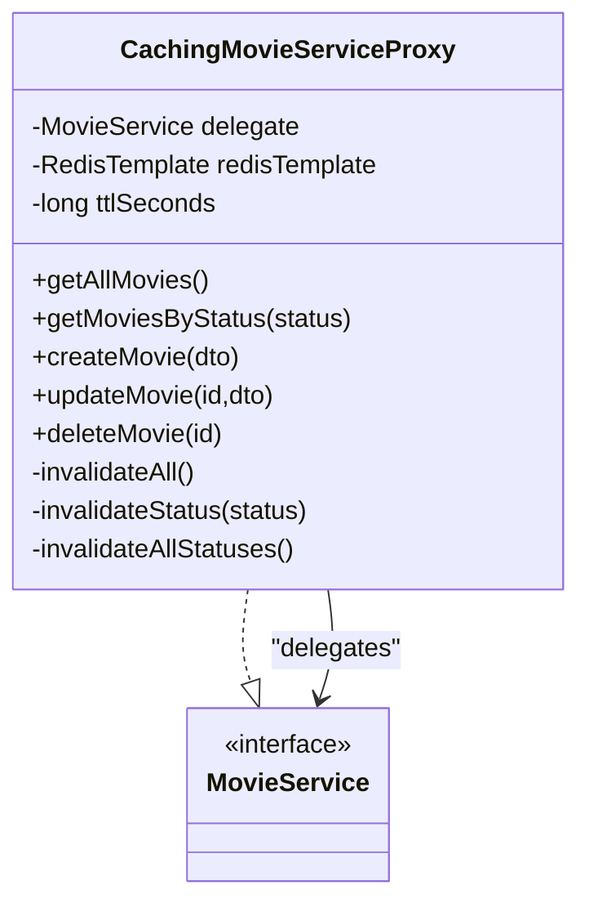

**Diagram sources**
- [CachingMovieServiceProxy.java:23-114](file://backend/src/main/java/com/cinema/booking/patterns/proxy/CachingMovieServiceProxy.java#L23-L114)

**Section sources**
- [CachingMovieServiceProxy.java:1-114](file://backend/src/main/java/com/cinema/booking/patterns/proxy/CachingMovieServiceProxy.java#L1-L114)

### Specification: Flexible Query Building
- Problem solved: Build complex, composable filters for showtimes without hardcoding conditions.
- Implementation highlights:
  - Static factory methods return JPA Specifications.
  - Clients combine predicates using Specification.where(...).and(...).
  - Null-safe behavior avoids unnecessary joins.

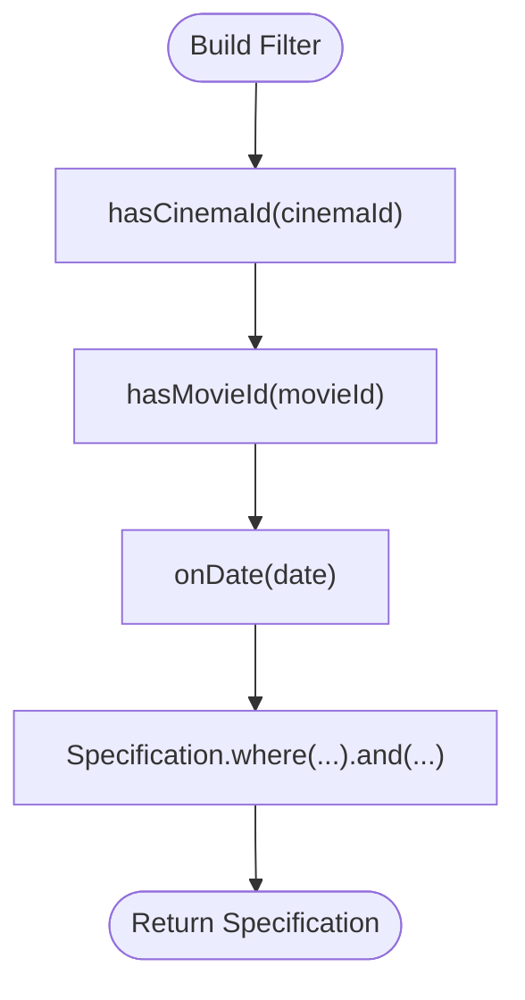

**Diagram sources**
- [ShowtimeSpecifications.java:14-52](file://backend/src/main/java/com/cinema/booking/patterns/specification/ShowtimeSpecifications.java#L14-L52)

**Section sources**
- [ShowtimeSpecifications.java:1-53](file://backend/src/main/java/com/cinema/booking/patterns/specification/ShowtimeSpecifications.java#L1-L53)

### Composite: Dashboard Statistics
- Problem solved: Aggregate diverse statistics into a unified dashboard payload.
- Implementation highlights:
  - Composite composes multiple leaf collectors.
  - Each leaf populates a shared map with computed metrics.
  - Controller calls a single collect method to gather all stats.

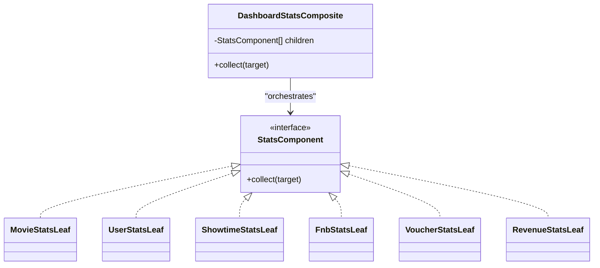

**Diagram sources**
- [DashboardStatsComposite.java:14-44](file://backend/src/main/java/com/cinema/booking/patterns/composite/DashboardStatsComposite.java#L14-L44)
- [StatsComponent.java](file://backend/src/main/java/com/cinema/booking/patterns/composite/StatsComponent.java)
- [MovieStatsLeaf.java](file://backend/src/main/java/com/cinema/booking/patterns/composite/MovieStatsLeaf.java)
- [UserStatsLeaf.java](file://backend/src/main/java/com/cinema/booking/patterns/composite/UserStatsLeaf.java)
- [ShowtimeStatsLeaf.java](file://backend/src/main/java/com/cinema/booking/patterns/composite/ShowtimeStatsLeaf.java)
- [FnbStatsLeaf.java](file://backend/src/main/java/com/cinema/booking/patterns/composite/FnbStatsLeaf.java)
- [VoucherStatsLeaf.java](file://backend/src/main/java/com/cinema/booking/patterns/composite/VoucherStatsLeaf.java)
- [RevenueStatsLeaf.java](file://backend/src/main/java/com/cinema/booking/patterns/composite/RevenueStatsLeaf.java)

**Section sources**
- [DashboardStatsComposite.java:1-44](file://backend/src/main/java/com/cinema/booking/patterns/composite/DashboardStatsComposite.java#L1-L44)
- [StatsComponent.java](file://backend/src/main/java/com/cinema/booking/patterns/composite/StatsComponent.java)

### Prototype: Email Templates
- Problem solved: Reuse standardized email templates with per-message personalization.
- Implementation highlights:
  - Template interface defines cloning and message creation.
  - Concrete prototypes encapsulate subject/body templates and substitution logic.

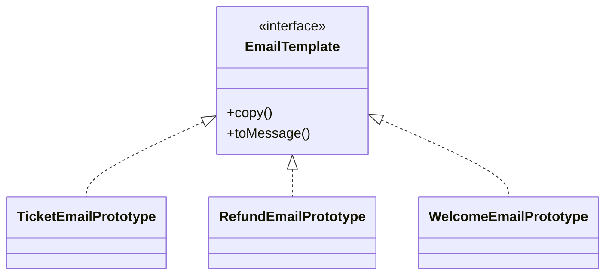

**Diagram sources**
- [EmailTemplate.java:9-16](file://backend/src/main/java/com/cinema/booking/patterns/prototype/EmailTemplate.java#L9-L16)
- [TicketEmailPrototype.java](file://backend/src/main/java/com/cinema/booking/patterns/prototype/TicketEmailPrototype.java)
- [RefundEmailPrototype.java](file://backend/src/main/java/com/cinema/booking/patterns/prototype/RefundEmailPrototype.java)
- [WelcomeEmailPrototype.java](file://backend/src/main/java/com/cinema/booking/patterns/prototype/WelcomeEmailPrototype.java)

**Section sources**
- [EmailTemplate.java:1-16](file://backend/src/main/java/com/cinema/booking/patterns/prototype/EmailTemplate.java#L1-L16)

### State: Seat and Booking Management
- Problem solved: Encapsulate booking lifecycle transitions and keep persistence in sync.
- Implementation highlights:
  - Context holds current state and delegates operations to it.
  - Factory maps persisted status to state implementation.
  - States define allowed transitions and side effects.

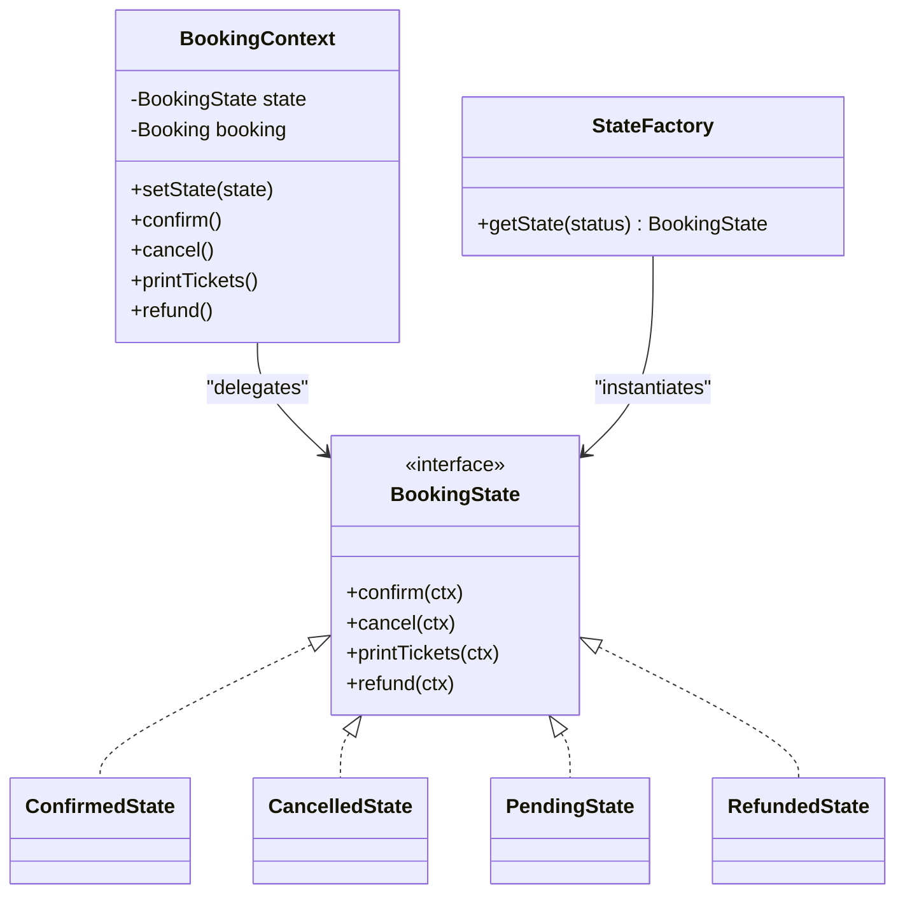

**Diagram sources**
- [BookingContext.java:6-38](file://backend/src/main/java/com/cinema/booking/patterns/state/BookingContext.java#L6-L38)
- [BookingState.java](file://backend/src/main/java/com/cinema/booking/patterns/state/BookingState.java)
- [StateFactory.java](file://backend/src/main/java/com/cinema/booking/patterns/state/StateFactory.java)
- [ConfirmedState.java](file://backend/src/main/java/com/cinema/booking/patterns/state/ConfirmedState.java)
- [CancelledState.java](file://backend/src/main/java/com/cinema/booking/patterns/state/CancelledState.java)
- [PendingState.java](file://backend/src/main/java/com/cinema/booking/patterns/state/PendingState.java)
- [RefundedState.java](file://backend/src/main/java/com/cinema/booking/patterns/state/RefundedState.java)

**Section sources**
- [BookingContext.java:1-38](file://backend/src/main/java/com/cinema/booking/patterns/state/BookingContext.java#L1-L38)
- [StateFactory.java](file://backend/src/main/java/com/cinema/booking/patterns/state/StateFactory.java)

### Strategy/Decorator: Pricing Calculations
- Problem solved: Compute flexible totals by combining pricing strategies and layered discounts.
- Implementation highlights:
  - Strategies compute per-line totals (ticket, F&B, time-based).
  - Decorators compose discounts (promotion, member) around a base.
  - Engine orchestrates calculation and produces a detailed breakdown.

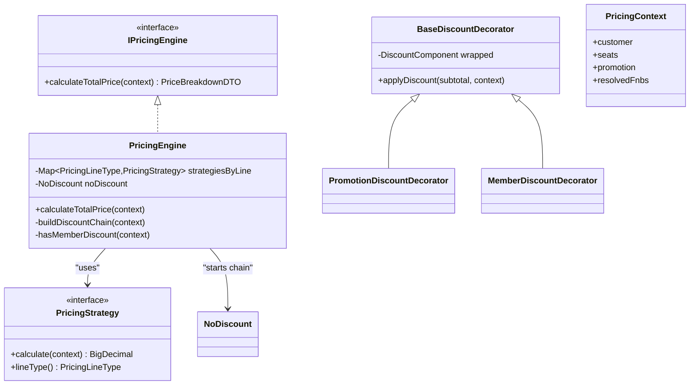

**Diagram sources**
- [IPricingEngine.java:9-12](file://backend/src/main/java/com/cinema/booking/services/strategy_decorator/pricing/IPricingEngine.java#L9-L12)
- [PricingEngine.java:24-117](file://backend/src/main/java/com/cinema/booking/services/strategy_decorator/pricing/PricingEngine.java#L24-L117)
- [BaseDiscountDecorator.java:5-17](file://backend/src/main/java/com/cinema/booking/services/strategy_decorator/pricing/BaseDiscountDecorator.java#L5-L17)
- [NoDiscount.java](file://backend/src/main/java/com/cinema/booking/services/strategy_decorator/pricing/NoDiscount.java)
- [PromotionDiscountDecorator.java](file://backend/src/main/java/com/cinema/booking/services/strategy_decorator/pricing/PromotionDiscountDecorator.java)
- [MemberDiscountDecorator.java](file://backend/src/main/java/com/cinema/booking/services/strategy_decorator/pricing/MemberDiscountDecorator.java)
- [PricingContext.java](file://backend/src/main/java/com/cinema/booking/services/strategy_decorator/pricing/PricingContext.java)

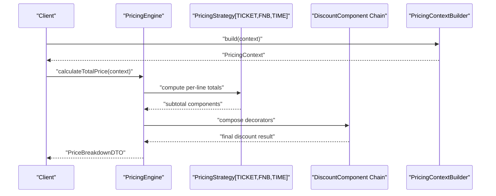

**Diagram sources**
- [PricingEngine.java:46-75](file://backend/src/main/java/com/cinema/booking/services/strategy_decorator/pricing/PricingEngine.java#L46-L75)
- [PricingContextBuilder.java](file://backend/src/main/java/com/cinema/booking/services/strategy_decorator/pricing/PricingContextBuilder.java)

**Section sources**
- [PricingEngine.java:1-117](file://backend/src/main/java/com/cinema/booking/services/strategy_decorator/pricing/PricingEngine.java#L1-L117)
- [IPricingEngine.java:1-12](file://backend/src/main/java/com/cinema/booking/services/strategy_decorator/pricing/IPricingEngine.java#L1-L12)
- [BaseDiscountDecorator.java:1-17](file://backend/src/main/java/com/cinema/booking/services/strategy_decorator/pricing/BaseDiscountDecorator.java#L1-L17)

## Dependency Analysis
The patterns exhibit low coupling and high cohesion:
- Chain of Responsibility: Handlers depend on a common interface and pass control via delegation.
- Mediator: Colleagues depend on a shared interface; the mediator injects them and coordinates execution.
- Proxy: Wraps MovieService; delegates reads/writes and manages cache invalidation.
- Specification: Returns JPA Specifications; clients combine them without internal logic.
- Composite: Composes leaf components; controller interacts with a single composite.
- Prototype: Template interface decouples creation from personalization.
- State: Context delegates to state implementations; factory maps persisted status to state.
- Strategy/Decorator: Engine depends on strategies and decorators via interfaces.

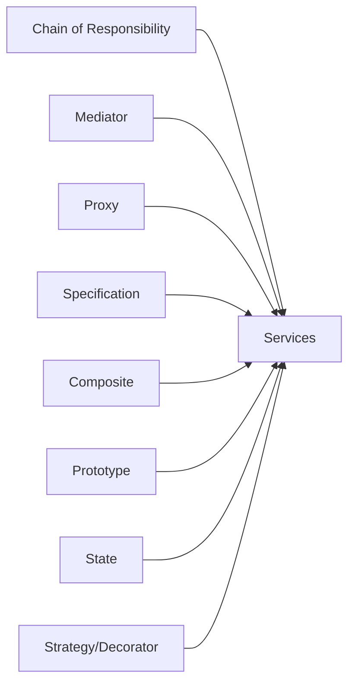

[No sources needed since this diagram shows conceptual dependencies]

## Performance Considerations
- Chain of Responsibility: Keep chains short and early-return on violations to minimize overhead.
- Mediator: Preserve the intended execution order; avoid heavy operations inside colleagues.
- Proxy: Tune TTL and monitor cache hit rates; invalidate aggressively on writes to prevent stale data.
- Specification: Prefer indexed columns in predicates; avoid N+1 selects by joining where necessary.
- Composite: Ensure leaf computations are efficient; avoid redundant database calls.
- Prototype: Reuse templates to reduce object allocation overhead.
- State: Keep state transitions fast; avoid heavy persistence operations in state methods.
- Strategy/Decorator: Cache strategy results when inputs are stable; avoid recomputation.

[No sources needed since this section provides general guidance]

## Troubleshooting Guide
- Chain of Responsibility
  - Symptom: Validation errors not thrown.
  - Action: Verify handler order and ensure doHandle throws on failure.
  - Reference: [MaxSeatsHandler.java:15-17](file://backend/src/main/java/com/cinema/booking/patterns/chainofresponsibility/MaxSeatsHandler.java#L15-L17)

- Mediator
  - Symptom: Side effects not executed after payment.
  - Action: Confirm mediator initialization and colleague registration order.
  - Reference: [PostPaymentMediator.java:24-32](file://backend/src/main/java/com/cinema/booking/patterns/mediator/PostPaymentMediator.java#L24-L32)

- Proxy
  - Symptom: Stale movie data after updates.
  - Action: Ensure cache invalidation on create/update/delete.
  - Reference: [CachingMovieServiceProxy.java:74-96](file://backend/src/main/java/com/cinema/booking/patterns/proxy/CachingMovieServiceProxy.java#L74-L96)

- Specification
  - Symptom: Filters not applied.
  - Action: Check null guards and join paths; ensure proper use of Specification.where(...).and(...).
  - Reference: [ShowtimeSpecifications.java:23-25](file://backend/src/main/java/com/cinema/booking/patterns/specification/ShowtimeSpecifications.java#L23-L25)

- Composite
  - Symptom: Missing stats in dashboard.
  - Action: Verify all leaf components are injected and collect invoked.
  - Reference: [DashboardStatsComposite.java:39-41](file://backend/src/main/java/com/cinema/booking/patterns/composite/DashboardStatsComposite.java#L39-L41)

- Prototype
  - Symptom: Incorrect email content.
  - Action: Ensure copy() produces a fresh template and substitutions are applied before sending.
  - Reference: [EmailTemplate.java:10-14](file://backend/src/main/java/com/cinema/booking/patterns/prototype/EmailTemplate.java#L10-L14)

- State
  - Symptom: Booking status mismatch.
  - Action: Confirm state factory maps persisted status and context updates entity accordingly.
  - Reference: [BookingContext.java:19](file://backend/src/main/java/com/cinema/booking/patterns/state/BookingContext.java#L19)

- Strategy/Decorator
  - Symptom: Zero or negative totals.
  - Action: Validate discount logic and ensure final total is bounded to zero.
  - Reference: [PricingEngine.java:58-62](file://backend/src/main/java/com/cinema/booking/services/strategy_decorator/pricing/PricingEngine.java#L58-L62)

**Section sources**
- [MaxSeatsHandler.java:15-17](file://backend/src/main/java/com/cinema/booking/patterns/chainofresponsibility/MaxSeatsHandler.java#L15-L17)
- [PostPaymentMediator.java:24-32](file://backend/src/main/java/com/cinema/booking/patterns/mediator/PostPaymentMediator.java#L24-L32)
- [CachingMovieServiceProxy.java:74-96](file://backend/src/main/java/com/cinema/booking/patterns/proxy/CachingMovieServiceProxy.java#L74-L96)
- [ShowtimeSpecifications.java:23-25](file://backend/src/main/java/com/cinema/booking/patterns/specification/ShowtimeSpecifications.java#L23-L25)
- [DashboardStatsComposite.java:39-41](file://backend/src/main/java/com/cinema/booking/patterns/composite/DashboardStatsComposite.java#L39-L41)
- [EmailTemplate.java:10-14](file://backend/src/main/java/com/cinema/booking/patterns/prototype/EmailTemplate.java#L10-L14)
- [BookingContext.java:19](file://backend/src/main/java/com/cinema/booking/patterns/state/BookingContext.java#L19)
- [PricingEngine.java:58-62](file://backend/src/main/java/com/cinema/booking/services/strategy_decorator/pricing/PricingEngine.java#L58-L62)

## Conclusion
These eight patterns collectively enhance modularity, maintainability, and scalability in the cinema booking system:
- Chain of Responsibility cleanly enforces checkout rules.
- Mediator coordinates post-payment side effects reliably.
- Proxy improves read performance with cache invalidation.
- Specification enables flexible and composable queries.
- Composite aggregates dashboard metrics efficiently.
- Prototype streamlines email generation.
- State models complex booking lifecycles clearly.
- Strategy/Decorator composes pricing logic flexibly.

[No sources needed since this section summarizes without analyzing specific files]