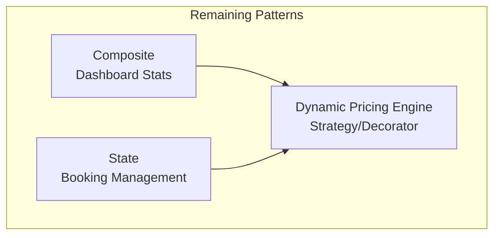
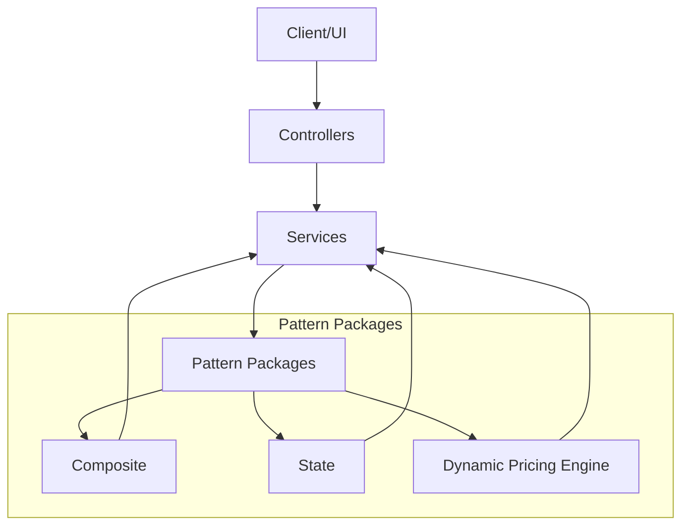
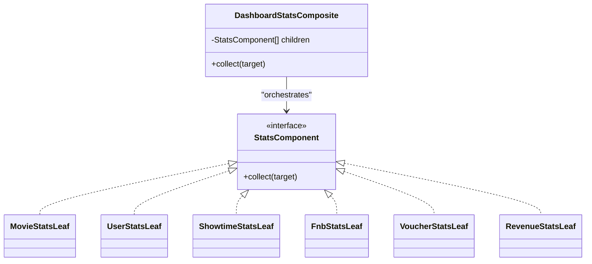
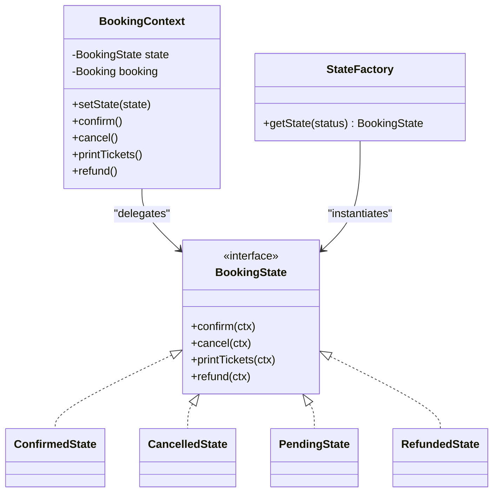
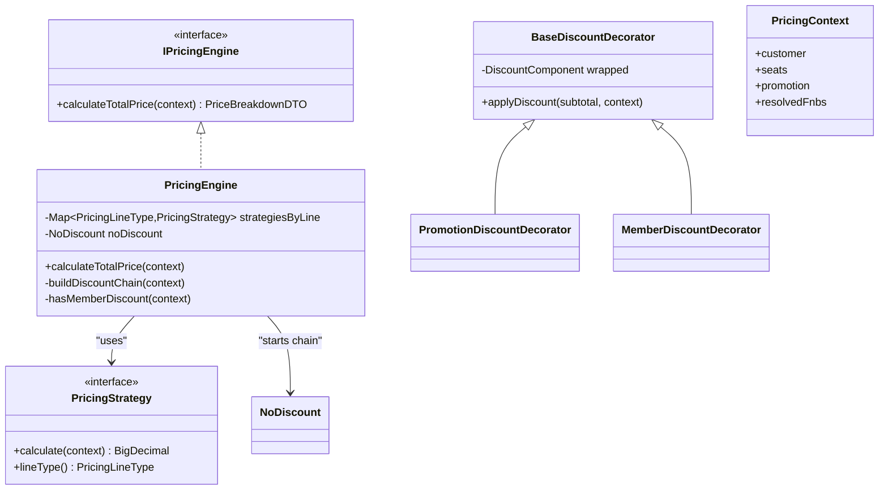
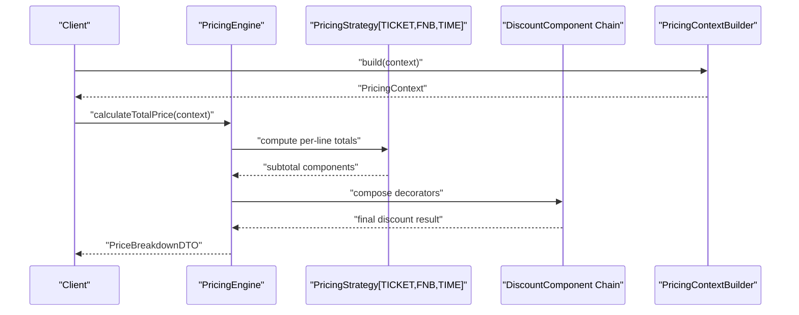
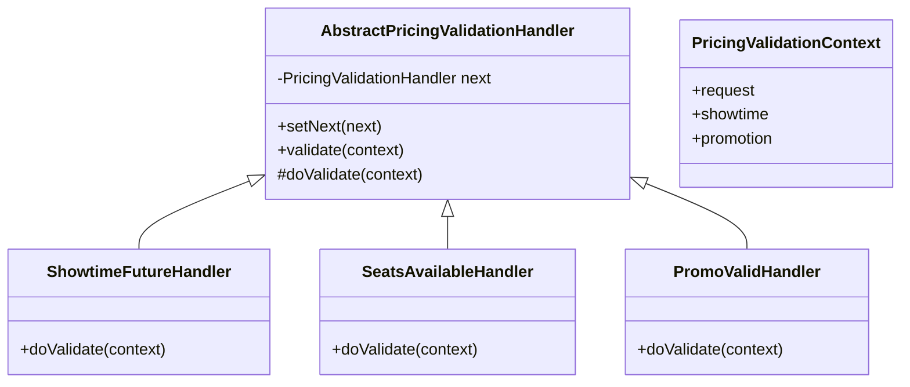
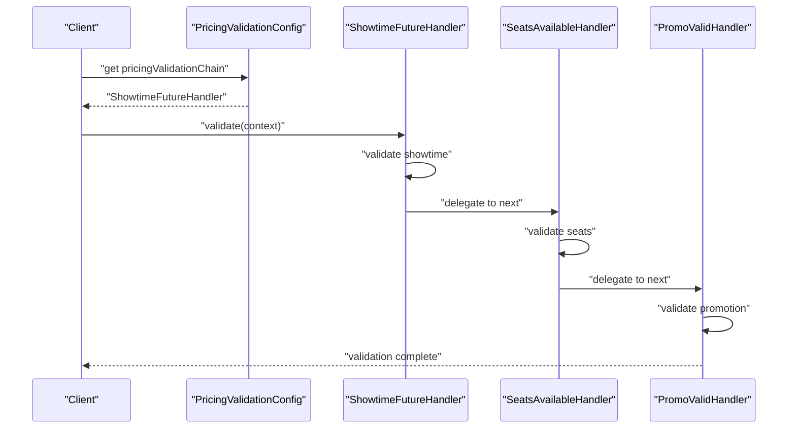
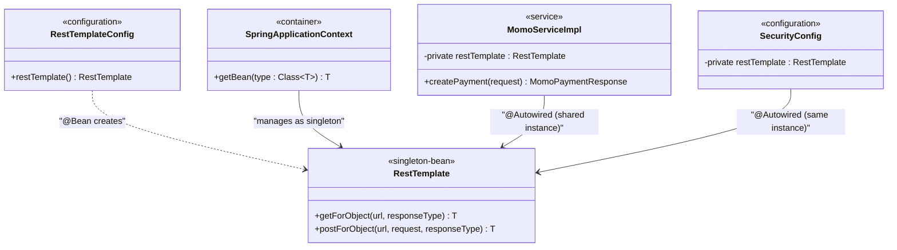
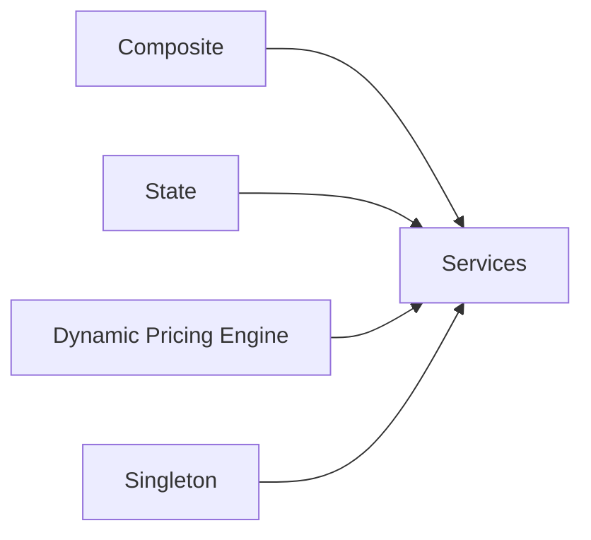

# Design Patterns Implementation

<cite>
**Referenced Files in This Document**
- [DashboardStatsComposite.java](file://backend/src/main/java/com/cinema/booking/patterns/composite/DashboardStatsComposite.java)
- [StatsComponent.java](file://backend/src/main/java/com/cinema/booking/patterns/composite/StatsComponent.java)
- [MovieStatsLeaf.java](file://backend/src/main/java/com/cinema/booking/patterns/composite/MovieStatsLeaf.java)
- [UserStatsLeaf.java](file://backend/src/main/java/com/cinema/booking/patterns/composite/UserStatsLeaf.java)
- [ShowtimeStatsLeaf.java](file://backend/src/main/java/com/cinema/booking/patterns/composite/ShowtimeStatsLeaf.java)
- [FnbStatsLeaf.java](file://backend/src/main/java/com/cinema/booking/patterns/composite/FnbStatsLeaf.java)
- [VoucherStatsLeaf.java](file://backend/src/main/java/com/cinema/booking/patterns/composite/VoucherStatsLeaf.java)
- [RevenueStatsLeaf.java](file://backend/src/main/java/com/cinema/booking/patterns/composite/RevenueStatsLeaf.java)
- [BookingContext.java](file://backend/src/main/java/com/cinema/booking/patterns/state/BookingContext.java)
- [BookingState.java](file://backend/src/main/java/com/cinema/booking/patterns/state/BookingState.java)
- [StateFactory.java](file://backend/src/main/java/com/cinema/booking/patterns/state/StateFactory.java)
- [ConfirmedState.java](file://backend/src/main/java/com/cinema/booking/patterns/state/ConfirmedState.java)
- [CancelledState.java](file://backend/src/main/java/com/cinema/booking/patterns/state/CancelledState.java)
- [PendingState.java](file://backend/src/main/java/com/cinema/booking/patterns/state/PendingState.java)
- [RefundedState.java](file://backend/src/main/java/com/cinema/booking/patterns/state/RefundedState.java)
- [PricingEngine.java](file://backend/src/main/java/com/cinema/booking/services/strategy_decorator/pricing/core/PricingEngine.java)
- [IPricingEngine.java](file://backend/src/main/java/com/cinema/booking/services/strategy_decorator/pricing/proxy/IPricingEngine.java)
- [CachingPricingEngineProxy.java](file://backend/src/main/java/com/cinema/booking/services/strategy_decorator/pricing/proxy/CachingPricingEngineProxy.java)
- [BaseDiscountDecorator.java](file://backend/src/main/java/com/cinema/booking/services/strategy_decorator/pricing/decorator/BaseDiscountDecorator.java)
- [NoDiscount.java](file://backend/src/main/java/com/cinema/booking/services/strategy_decorator/pricing/decorator/NoDiscount.java)
- [PromotionDiscountDecorator.java](file://backend/src/main/java/com/cinema/booking/services/strategy_decorator/pricing/decorator/PromotionDiscountDecorator.java)
- [MemberDiscountDecorator.java](file://backend/src/main/java/com/cinema/booking/services/strategy_decorator/pricing/decorator/MemberDiscountDecorator.java)
- [PricingContext.java](file://backend/src/main/java/com/cinema/booking/services/strategy_decorator/pricing/core/PricingContext.java)
- [PricingContextBuilder.java](file://backend/src/main/java/com/cinema/booking/services/strategy_decorator/pricing/builder/PricingContextBuilder.java)
- [PricingLineType.java](file://backend/src/main/java/com/cinema/booking/services/strategy_decorator/pricing/strategy/PricingLineType.java)
- [TicketPricingStrategy.java](file://backend/src/main/java/com/cinema/booking/services/strategy_decorator/pricing/strategy/TicketPricingStrategy.java)
- [FnbPricingStrategy.java](file://backend/src/main/java/com/cinema/booking/services/strategy_decorator/pricing/strategy/FnbPricingStrategy.java)
- [TimeBasedPricingStrategy.java](file://backend/src/main/java/com/cinema/booking/services/strategy_decorator/pricing/strategy/TimeBasedPricingStrategy.java)
- [PricingValidationConfig.java](file://backend/src/main/java/com/cinema/booking/services/strategy_decorator/pricing/validation/PricingValidationConfig.java)
- [AbstractPricingValidationHandler.java](file://backend/src/main/java/com/cinema/booking/services/strategy_decorator/pricing/validation/AbstractPricingValidationHandler.java)
- [PricingValidationHandler.java](file://backend/src/main/java/com/cinema/booking/services/strategy_decorator/pricing/validation/PricingValidationHandler.java)
- [PricingValidationContext.java](file://backend/src/main/java/com/cinema/booking/services/strategy_decorator/pricing/validation/PricingValidationContext.java)
- [ShowtimeFutureHandler.java](file://backend/src/main/java/com/cinema/booking/services/strategy_decorator/pricing/validation/ShowtimeFutureHandler.java)
- [SeatsAvailableHandler.java](file://backend/src/main/java/com/cinema/booking/services/strategy_decorator/pricing/validation/SeatsAvailableHandler.java)
- [PromoValidHandler.java](file://backend/src/main/java/com/cinema/booking/services/strategy_decorator/pricing/validation/PromoValidHandler.java)
- [PricingSpecificationContext.java](file://backend/src/main/java/com/cinema/booking/services/strategy_decorator/pricing/specification/PricingSpecificationContext.java)
- [RestTemplateConfig.java](file://backend/src/main/java/com/cinema/booking/config/RestTemplateConfig.java)
- [MomoServiceImpl.java](file://backend/src/main/java/com/cinema/booking/services/impl/MomoServiceImpl.java)
</cite>

## Update Summary
**Changes Made**
- Removed documentation for five patterns that were completely removed from codebase: Chain of Responsibility, Mediator, Proxy, Specification, and Prototype
- Updated project structure to reflect only three remaining patterns: Composite, State, and Dynamic Pricing Engine
- Added comprehensive documentation for the Dynamic Pricing Engine pattern including Strategy/Decorator combination
- Enhanced Singleton pattern documentation with Spring IoC implementation details
- Updated architecture overview to show only remaining pattern interactions

## Table of Contents
1. [Introduction](#introduction)
2. [Project Structure](#project-structure)
3. [Core Components](#core-components)
4. [Architecture Overview](#architecture-overview)
5. [Detailed Component Analysis](#detailed-component-analysis)
6. [Dependency Analysis](#dependency-analysis)
7. [Performance Considerations](#performance-considerations)
8. [Troubleshooting Guide](#troubleshooting-guide)
9. [Conclusion](#conclusion)

## Introduction
This document explains the three remaining GoF design patterns implemented in the cinema booking system. The system now focuses on three core patterns that provide essential functionality for dashboard statistics, booking state management, and dynamic pricing calculations. The documented patterns are:
- Composite for dashboard statistics aggregation
- State for seat and booking management
- Dynamic Pricing Engine (Strategy/Decorator) for flexible pricing calculations

**Updated** Removed documentation for five patterns that were completely removed from codebase: Chain of Responsibility, Mediator, Proxy, Specification, and Prototype.

## Project Structure
The patterns are organized under dedicated packages within the backend module:
- Composite: dashboard statistics aggregation
- State: booking state machine
- Dynamic Pricing Engine: strategy and decorator pattern combination

[No sources needed since this diagram shows conceptual structure]

## Core Components
This section outlines each pattern's purpose, implementation, and benefits in the booking system.

- Composite (Dashboard Statistics)
  - Purpose: Aggregate multiple statistics into a single payload for the dashboard.
  - Implementation: A composite orchestrates leaf collectors to populate a shared map.
  - Benefits: Centralized collection, consistent aggregation, and easy extension.

- State (Seat and Booking Management)
  - Purpose: Model booking lifecycle transitions with encapsulated behavior.
  - Implementation: A context delegates operations to current state; state factory maps persisted statuses.
  - Benefits: Clear state transitions, encapsulated logic, and persistence alignment.

- Dynamic Pricing Engine (Strategy/Decorator)
  - Purpose: Calculate totals by combining pricing strategies and applying discounts via decorators.
  - Implementation: Strategies compute per-line totals; decorators compose discounts; engine orchestrates and builds a breakdown.
  - Benefits: Pluggable pricing rules, layered discount logic, and robust total computation.

**Section sources**
- [DashboardStatsComposite.java:1-44](file://backend/src/main/java/com/cinema/booking/patterns/composite/DashboardStatsComposite.java#L1-L44)
- [BookingContext.java:1-38](file://backend/src/main/java/com/cinema/booking/patterns/state/BookingContext.java#L1-L38)
- [PricingEngine.java:1-126](file://backend/src/main/java/com/cinema/booking/services/strategy_decorator/pricing/core/PricingEngine.java#L1-L126)

## Architecture Overview
The remaining patterns integrate across layers to support dashboard reporting, state transitions, and pricing calculations.

[No sources needed since this diagram shows conceptual architecture]

## Detailed Component Analysis

### Composite: Dashboard Statistics
- Problem solved: Aggregate diverse statistics into a unified dashboard payload.
- Implementation highlights:
  - Composite composes multiple leaf collectors.
  - Each leaf populates a shared map with computed metrics.
  - Controller calls a single collect method to gather all stats.

**Diagram sources**
- [DashboardStatsComposite.java:14-44](file://backend/src/main/java/com/cinema/booking/patterns/composite/DashboardStatsComposite.java#L14-L44)
- [StatsComponent.java](file://backend/src/main/java/com/cinema/booking/patterns/composite/StatsComponent.java)
- [MovieStatsLeaf.java](file://backend/src/main/java/com/cinema/booking/patterns/composite/MovieStatsLeaf.java)
- [UserStatsLeaf.java](file://backend/src/main/java/com/cinema/booking/patterns/composite/UserStatsLeaf.java)
- [ShowtimeStatsLeaf.java](file://backend/src/main/java/com/cinema/booking/patterns/composite/ShowtimeStatsLeaf.java)
- [FnbStatsLeaf.java](file://backend/src/main/java/com/cinema/booking/patterns/composite/FnbStatsLeaf.java)
- [VoucherStatsLeaf.java](file://backend/src/main/java/com/cinema/booking/patterns/composite/VoucherStatsLeaf.java)
- [RevenueStatsLeaf.java](file://backend/src/main/java/com/cinema/booking/patterns/composite/RevenueStatsLeaf.java)

**Section sources**
- [DashboardStatsComposite.java:1-44](file://backend/src/main/java/com/cinema/booking/patterns/composite/DashboardStatsComposite.java#L1-L44)

### State: Seat and Booking Management
- Problem solved: Encapsulate booking lifecycle transitions and keep persistence in sync.
- Implementation highlights:
  - Context holds current state and delegates operations to it.
  - Factory maps persisted status to state implementation.
  - States define allowed transitions and side effects.

**Diagram sources**
- [BookingContext.java:6-38](file://backend/src/main/java/com/cinema/booking/patterns/state/BookingContext.java#L6-L38)
- [BookingState.java](file://backend/src/main/java/com/cinema/booking/patterns/state/BookingState.java)
- [StateFactory.java](file://backend/src/main/java/com/cinema/booking/patterns/state/StateFactory.java)
- [ConfirmedState.java](file://backend/src/main/java/com/cinema/booking/patterns/state/ConfirmedState.java)
- [CancelledState.java](file://backend/src/main/java/com/cinema/booking/patterns/state/CancelledState.java)
- [PendingState.java](file://backend/src/main/java/com/cinema/booking/patterns/state/PendingState.java)
- [RefundedState.java](file://backend/src/main/java/com/cinema/booking/patterns/state/RefundedState.java)

**Section sources**
- [BookingContext.java:1-38](file://backend/src/main/java/com/cinema/booking/patterns/state/BookingContext.java#L1-L38)
- [StateFactory.java](file://backend/src/main/java/com/cinema/booking/patterns/state/StateFactory.java)

### Dynamic Pricing Engine: Strategy/Decorator Combination
- Problem solved: Compute flexible totals by combining pricing strategies and layered discounts.
- Implementation highlights:
  - Strategies compute per-line totals (ticket, F&B, time-based).
  - Decorators compose discounts (promotion, member) around a base.
  - Engine orchestrates calculation and produces a detailed breakdown.
  - Validation chain ensures prerequisites are met before pricing.

**Diagram sources**
- [IPricingEngine.java](file://backend/src/main/java/com/cinema/booking/services/strategy_decorator/pricing/proxy/IPricingEngine.java)
- [PricingEngine.java:24-126](file://backend/src/main/java/com/cinema/booking/services/strategy_decorator/pricing/core/PricingEngine.java#L24-L126)
- [BaseDiscountDecorator.java](file://backend/src/main/java/com/cinema/booking/services/strategy_decorator/pricing/decorator/BaseDiscountDecorator.java)
- [NoDiscount.java](file://backend/src/main/java/com/cinema/booking/services/strategy_decorator/pricing/decorator/NoDiscount.java)
- [PromotionDiscountDecorator.java](file://backend/src/main/java/com/cinema/booking/services/strategy_decorator/pricing/decorator/PromotionDiscountDecorator.java)
- [MemberDiscountDecorator.java](file://backend/src/main/java/com/cinema/booking/services/strategy_decorator/pricing/decorator/MemberDiscountDecorator.java)
- [PricingContext.java](file://backend/src/main/java/com/cinema/booking/services/strategy_decorator/pricing/core/PricingContext.java)

**Diagram sources**
- [PricingEngine.java:54-84](file://backend/src/main/java/com/cinema/booking/services/strategy_decorator/pricing/core/PricingEngine.java#L54-L84)
- [PricingContextBuilder.java](file://backend/src/main/java/com/cinema/booking/services/strategy_decorator/pricing/builder/PricingContextBuilder.java)

**Section sources**
- [PricingEngine.java:1-126](file://backend/src/main/java/com/cinema/booking/services/strategy_decorator/pricing/core/PricingEngine.java#L1-L126)
- [IPricingEngine.java](file://backend/src/main/java/com/cinema/booking/services/strategy_decorator/pricing/proxy/IPricingEngine.java)
- [BaseDiscountDecorator.java](file://backend/src/main/java/com/cinema/booking/services/strategy_decorator/pricing/decorator/BaseDiscountDecorator.java)

### Pricing Validation Chain (Chain of Responsibility)
- Problem solved: Enforce multiple pricing validation rules in a configurable pipeline without coupling validators.
- Implementation highlights:
  - Abstract base handler manages chaining and delegates to the next handler.
  - Concrete validators check showtime future status, seat availability, and promotion validity.
  - Context carries inputs like seat IDs, showtime identifiers, and promotion codes.
  - Configuration wires handlers into a chain with specific order.

**Diagram sources**
- [AbstractPricingValidationHandler.java:1-25](file://backend/src/main/java/com/cinema/booking/services/strategy_decorator/pricing/validation/AbstractPricingValidationHandler.java#L1-L25)
- [ShowtimeFutureHandler.java:1-33](file://backend/src/main/java/com/cinema/booking/services/strategy_decorator/pricing/validation/ShowtimeFutureHandler.java#L1-L33)
- [SeatsAvailableHandler.java:1-34](file://backend/src/main/java/com/cinema/booking/services/strategy_decorator/pricing/validation/SeatsAvailableHandler.java#L1-L34)
- [PromoValidHandler.java:1-54](file://backend/src/main/java/com/cinema/booking/services/strategy_decorator/pricing/validation/PromoValidHandler.java#L1-L54)
- [PricingValidationContext.java](file://backend/src/main/java/com/cinema/booking/services/strategy_decorator/pricing/validation/PricingValidationContext.java)

**Diagram sources**
- [PricingValidationConfig.java:19-30](file://backend/src/main/java/com/cinema/booking/services/strategy_decorator/pricing/validation/PricingValidationConfig.java#L19-L30)
- [ShowtimeFutureHandler.java:21-31](file://backend/src/main/java/com/cinema/booking/services/strategy_decorator/pricing/validation/ShowtimeFutureHandler.java#L21-L31)
- [SeatsAvailableHandler.java:19-32](file://backend/src/main/java/com/cinema/booking/services/strategy_decorator/pricing/validation/SeatsAvailableHandler.java#L19-L32)
- [PromoValidHandler.java:29-52](file://backend/src/main/java/com/cinema/booking/services/strategy_decorator/pricing/validation/PromoValidHandler.java#L29-L52)

**Section sources**
- [PricingValidationConfig.java:1-31](file://backend/src/main/java/com/cinema/booking/services/strategy_decorator/pricing/validation/PricingValidationConfig.java#L1-L31)
- [AbstractPricingValidationHandler.java:1-25](file://backend/src/main/java/com/cinema/booking/services/strategy_decorator/pricing/validation/AbstractPricingValidationHandler.java#L1-L25)
- [ShowtimeFutureHandler.java:1-33](file://backend/src/main/java/com/cinema/booking/services/strategy_decorator/pricing/validation/ShowtimeFutureHandler.java#L1-L33)
- [SeatsAvailableHandler.java:1-34](file://backend/src/main/java/com/cinema/booking/services/strategy_decorator/pricing/validation/SeatsAvailableHandler.java#L1-L34)
- [PromoValidHandler.java:1-54](file://backend/src/main/java/com/cinema/booking/services/strategy_decorator/pricing/validation/PromoValidHandler.java#L1-L54)
- [PricingValidationContext.java](file://backend/src/main/java/com/cinema/booking/services/strategy_decorator/pricing/validation/PricingValidationContext.java)

### Singleton Pattern: Spring IoC Implementation
- Problem solved: Ensure single instance of shared resources like RestTemplate across the application.
- Implementation highlights:
  - Spring automatically manages singleton beans by default.
  - Configuration class declares the bean once for global injection.
  - Services inject the shared instance without manual instantiation.

**Diagram sources**
- [RestTemplateConfig.java](file://backend/src/main/java/com/cinema/booking/config/RestTemplateConfig.java)
- [MomoServiceImpl.java](file://backend/src/main/java/com/cinema/booking/services/impl/MomoServiceImpl.java)

**Section sources**
- [RestTemplateConfig.java](file://backend/src/main/java/com/cinema/booking/config/RestTemplateConfig.java)
- [MomoServiceImpl.java](file://backend/src/main/java/com/cinema/booking/services/impl/MomoServiceImpl.java)

## Dependency Analysis
The remaining patterns exhibit low coupling and high cohesion:
- Composite: Composes leaf components; controller interacts with a single composite.
- State: Context delegates to state implementations; factory maps persisted status to state.
- Dynamic Pricing Engine: Engine depends on strategies and decorators via interfaces; validation chain ensures prerequisites.
- Singleton: Spring container manages single instances; services inject shared resources.

[No sources needed since this diagram shows conceptual dependencies]

## Performance Considerations
- Composite: Ensure leaf computations are efficient; avoid redundant database calls.
- State: Keep state transitions fast; avoid heavy persistence operations in state methods.
- Dynamic Pricing Engine: Cache strategy results when inputs are stable; avoid recomputation.
- Singleton: Leverage Spring's singleton management to avoid object creation overhead.

## Troubleshooting Guide
- Composite
  - Symptom: Missing stats in dashboard.
  - Action: Verify all leaf components are injected and collect invoked.
  - Reference: [DashboardStatsComposite.java:39-41](file://backend/src/main/java/com/cinema/booking/patterns/composite/DashboardStatsComposite.java#L39-L41)

- State
  - Symptom: Booking status mismatch.
  - Action: Confirm state factory maps persisted status and context updates entity accordingly.
  - Reference: [BookingContext.java:19](file://backend/src/main/java/com/cinema/booking/patterns/state/BookingContext.java#L19)

- Dynamic Pricing Engine
  - Symptom: Zero or negative totals.
  - Action: Validate discount logic and ensure final total is bounded to zero.
  - Reference: [PricingEngine.java:67-71](file://backend/src/main/java/com/cinema/booking/services/strategy_decorator/pricing/core/PricingEngine.java#L67-L71)

- Pricing Validation Chain
  - Symptom: Validation errors not thrown.
  - Action: Verify handler order and ensure doValidate throws on failure.
  - Reference: [ShowtimeFutureHandler.java:26-28](file://backend/src/main/java/com/cinema/booking/services/strategy_decorator/pricing/validation/ShowtimeFutureHandler.java#L26-L28)

- Singleton
  - Symptom: Multiple RestTemplate instances created.
  - Action: Ensure configuration class declares bean and services inject via @Autowired.
  - Reference: [RestTemplateConfig.java:68-73](file://backend/src/main/java/com/cinema/booking/config/RestTemplateConfig.java#L68-L73)

**Section sources**
- [DashboardStatsComposite.java:39-41](file://backend/src/main/java/com/cinema/booking/patterns/composite/DashboardStatsComposite.java#L39-L41)
- [BookingContext.java:19](file://backend/src/main/java/com/cinema/booking/patterns/state/BookingContext.java#L19)
- [PricingEngine.java:67-71](file://backend/src/main/java/com/cinema/booking/services/strategy_decorator/pricing/core/PricingEngine.java#L67-L71)
- [ShowtimeFutureHandler.java:26-28](file://backend/src/main/java/com/cinema/booking/services/strategy_decorator/pricing/validation/ShowtimeFutureHandler.java#L26-L28)
- [RestTemplateConfig.java:68-73](file://backend/src/main/java/com/cinema/booking/config/RestTemplateConfig.java#L68-L73)

## Conclusion
The three remaining patterns enhance modularity, maintainability, and scalability in the cinema booking system:
- Composite efficiently aggregates dashboard metrics.
- State models complex booking lifecycles clearly.
- Dynamic Pricing Engine composes pricing logic flexibly with validation.
- Singleton pattern ensures optimal resource management through Spring IoC.

**Updated** Removed documentation for five patterns that were completely removed from codebase: Chain of Responsibility, Mediator, Proxy, Specification, and Prototype.