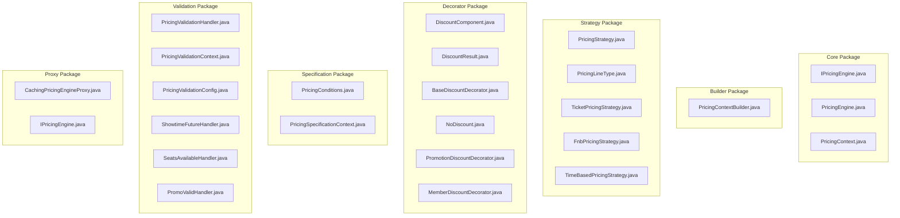
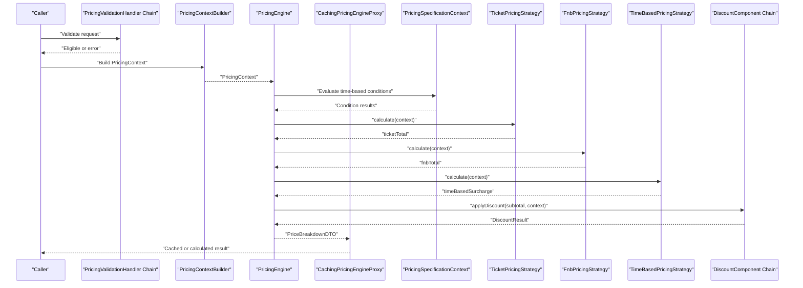
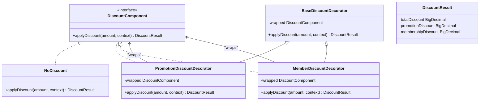
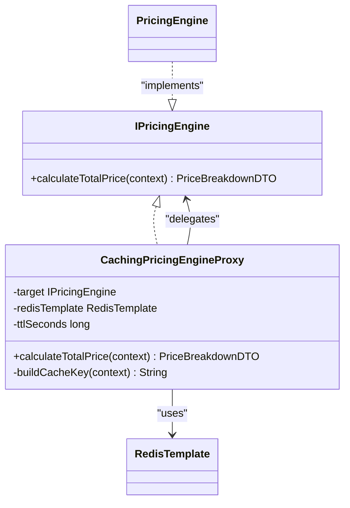
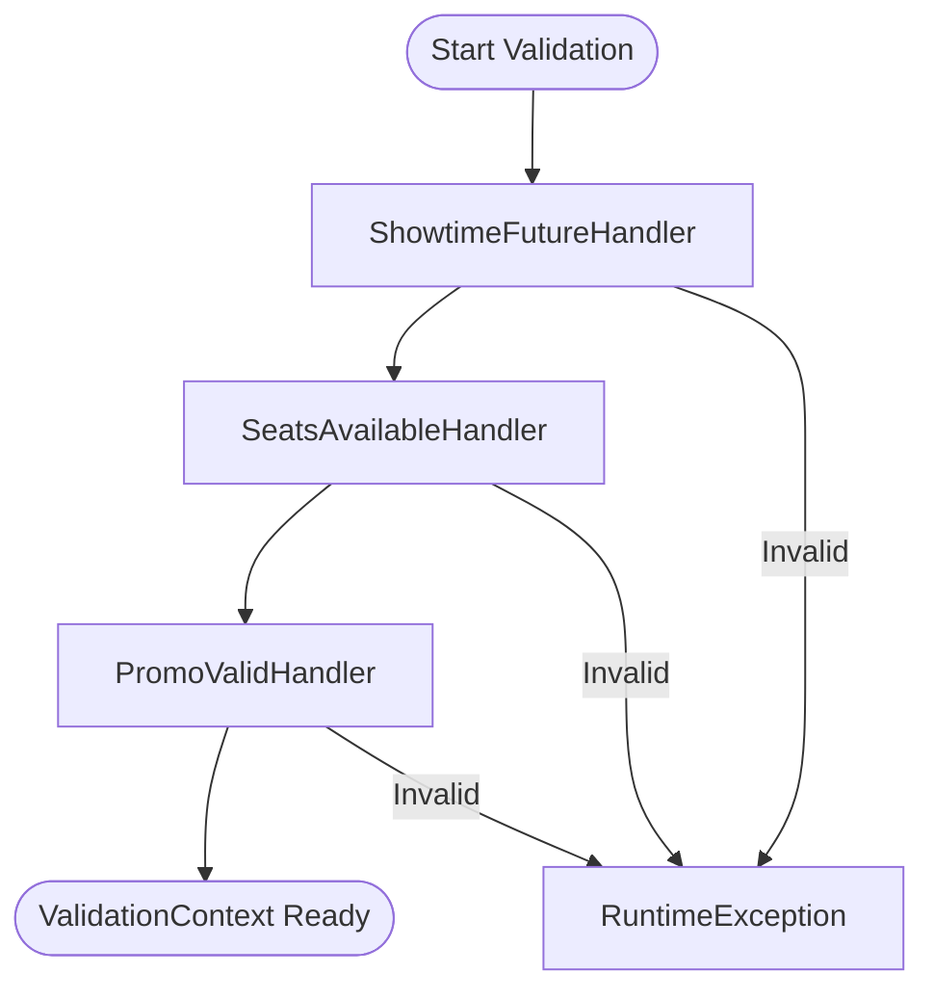
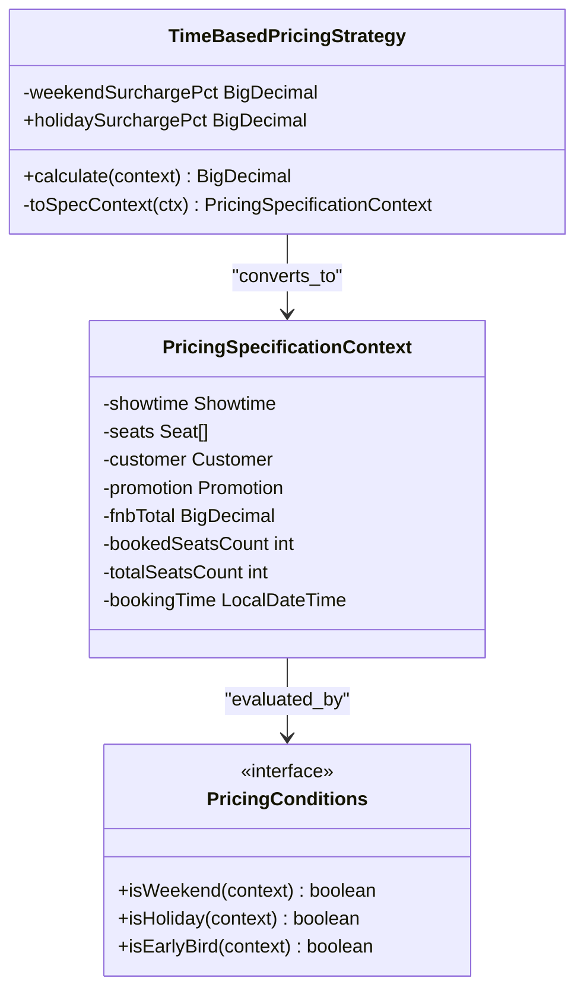
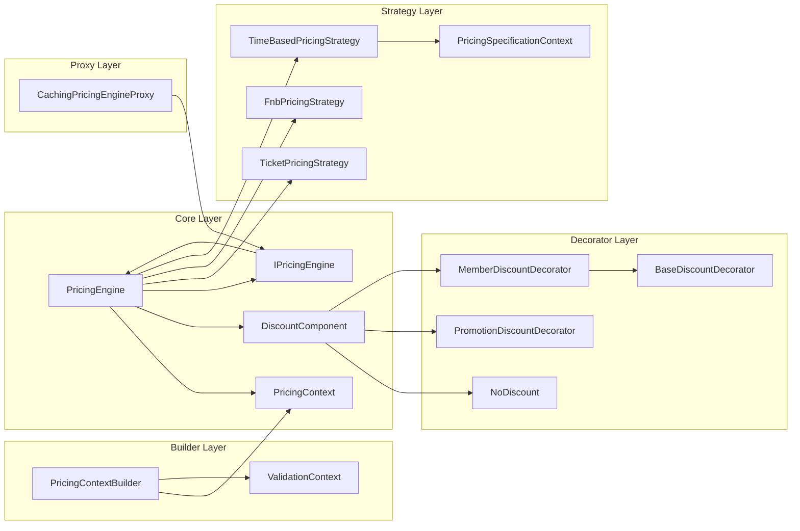
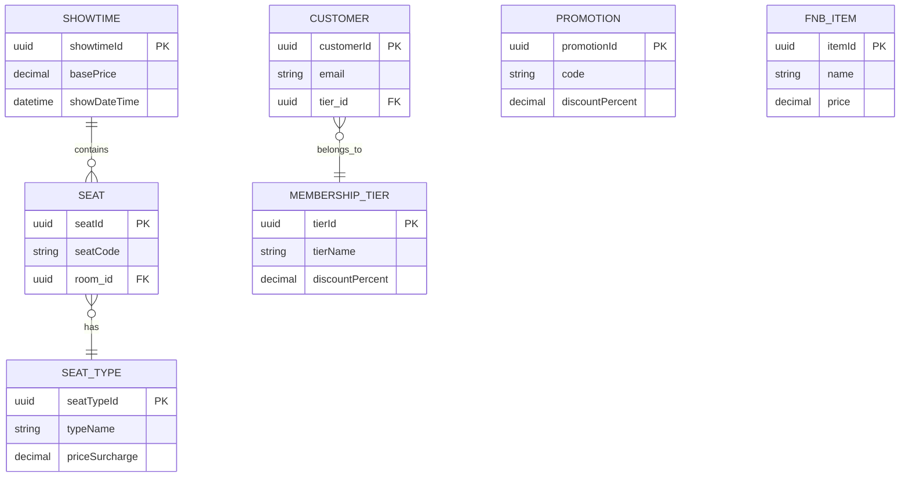

# Dynamic Pricing Engine

<cite>
**Referenced Files in This Document**
- [IPricingEngine.java](file://backend/src/main/java/com/cinema/booking/services/strategy_decorator/pricing/proxy/IPricingEngine.java)
- [PricingEngine.java](file://backend/src/main/java/com/cinema/booking/services/strategy_decorator/pricing/core/PricingEngine.java)
- [PricingContext.java](file://backend/src/main/java/com/cinema/booking/services/strategy_decorator/pricing/core/PricingContext.java)
- [PricingContextBuilder.java](file://backend/src/main/java/com/cinema/booking/services/strategy_decorator/pricing/builder/PricingContextBuilder.java)
- [TicketPricingStrategy.java](file://backend/src/main/java/com/cinema/booking/services/strategy_decorator/pricing/strategy/TicketPricingStrategy.java)
- [FnbPricingStrategy.java](file://backend/src/main/java/com/cinema/booking/services/strategy_decorator/pricing/strategy/FnbPricingStrategy.java)
- [TimeBasedPricingStrategy.java](file://backend/src/main/java/com/cinema/booking/services/strategy_decorator/pricing/strategy/TimeBasedPricingStrategy.java)
- [PricingStrategy.java](file://backend/src/main/java/com/cinema/booking/services/strategy_decorator/pricing/strategy/PricingStrategy.java)
- [PricingLineType.java](file://backend/src/main/java/com/cinema/booking/services/strategy_decorator/pricing/strategy/PricingLineType.java)
- [CachingPricingEngineProxy.java](file://backend/src/main/java/com/cinema/booking/services/strategy_decorator/pricing/proxy/CachingPricingEngineProxy.java)
- [BaseDiscountDecorator.java](file://backend/src/main/java/com/cinema/booking/services/strategy_decorator/pricing/decorator/BaseDiscountDecorator.java)
- [MemberDiscountDecorator.java](file://backend/src/main/java/com/cinema/booking/services/strategy_decorator/pricing/decorator/MemberDiscountDecorator.java)
- [PromotionDiscountDecorator.java](file://backend/src/main/java/com/cinema/booking/services/strategy_decorator/pricing/decorator/PromotionDiscountDecorator.java)
- [NoDiscount.java](file://backend/src/main/java/com/cinema/booking/services/strategy_decorator/pricing/decorator/NoDiscount.java)
- [DiscountComponent.java](file://backend/src/main/java/com/cinema/booking/services/strategy_decorator/pricing/decorator/DiscountComponent.java)
- [DiscountResult.java](file://backend/src/main/java/com/cinema/booking/services/strategy_decorator/pricing/decorator/DiscountResult.java)
- [AbstractPricingValidationHandler.java](file://backend/src/main/java/com/cinema/booking/services/strategy_decorator/pricing/validation/AbstractPricingValidationHandler.java)
- [PricingValidationHandler.java](file://backend/src/main/java/com/cinema/booking/services/strategy_decorator/pricing/validation/PricingValidationHandler.java)
- [PricingValidationContext.java](file://backend/src/main/java/com/cinema/booking/services/strategy_decorator/pricing/validation/PricingValidationContext.java)
- [PricingValidationConfig.java](file://backend/src/main/java/com/cinema/booking/services/strategy_decorator/pricing/validation/PricingValidationConfig.java)
- [PromoValidHandler.java](file://backend/src/main/java/com/cinema/booking/services/strategy_decorator/pricing/validation/PromoValidHandler.java)
- [SeatsAvailableHandler.java](file://backend/src/main/java/com/cinema/booking/services/strategy_decorator/pricing/validation/SeatsAvailableHandler.java)
- [ShowtimeFutureHandler.java](file://backend/src/main/java/com/cinema/booking/services/strategy_decorator/pricing/validation/ShowtimeFutureHandler.java)
- [PriceBreakdownDTO.java](file://backend/src/main/java/com/cinema/booking/dtos/PriceBreakdownDTO.java)
- [BookingCalculationDTO.java](file://backend/src/main/java/com/cinema/booking/dtos/BookingCalculationDTO.java)
- [Showtime.java](file://backend/src/main/java/com/cinema/booking/entities/Showtime.java)
- [Seat.java](file://backend/src/main/java/com/cinema/booking/entities/Seat.java)
- [SeatType.java](file://backend/src/main/java/com/cinema/booking/entities/SeatType.java)
- [Customer.java](file://backend/src/main/java/com/cinema/booking/entities/Customer.java)
- [MembershipTier.java](file://backend/src/main/java/com/cinema/booking/entities/MembershipTier.java)
- [Promotion.java](file://backend/src/main/java/com/cinema/booking/entities/Promotion.java)
- [FnbItem.java](file://backend/src/main/java/com/cinema/booking/entities/FnbItem.java)
- [PricingConditions.java](file://backend/src/main/java/com/cinema/booking/services/strategy_decorator/pricing/specification/PricingConditions.java)
- [PricingSpecificationContext.java](file://backend/src/main/java/com/cinema/booking/services/strategy_decorator/pricing/specification/PricingSpecificationContext.java)
</cite>

## Update Summary
**Changes Made**
- Updated package organization to reflect new structure with dedicated packages for core, decorator, strategy, specification, builder, and validation components
- Enhanced discount chain implementation with improved conditional logic and better discount result tracking
- Added comprehensive caching proxy with Redis integration and sophisticated cache key generation
- Improved pricing calculation workflow with better separation of concerns across architectural layers
- Updated architecture diagrams to reflect the new package structure and enhanced component relationships

## Table of Contents
1. [Introduction](#introduction)
2. [Project Structure](#project-structure)
3. [Core Components](#core-components)
4. [Architecture Overview](#architecture-overview)
5. [Detailed Component Analysis](#detailed-component-analysis)
6. [Dependency Analysis](#dependency-analysis)
7. [Performance Considerations](#performance-considerations)
8. [Troubleshooting Guide](#troubleshooting-guide)
9. [Conclusion](#conclusion)
10. [Appendices](#appendices)

## Introduction
This document explains the Dynamic Pricing Engine that combines multiple design patterns to compute accurate and flexible pricing for cinema bookings. The engine has been enhanced with a restructured package organization and improved discount chain implementation. It integrates:
- Strategy pattern for modular pricing calculation per line type (ticket, food & beverage, time-based surcharge)
- Decorator pattern for stacking discounts (promotional offers and membership tiers)
- Chain of Responsibility for pre-validation of pricing eligibility
- Proxy pattern for transparent caching of pricing results
- Specification pattern for time-based pricing conditions

The engine exposes a unified interface for callers, orchestrates pricing strategies, applies discount decorators, validates eligibility via a handler chain, and returns a structured price breakdown.

## Project Structure
The pricing engine has been restructured into dedicated packages for better organization and maintainability:

**Diagram sources**
- [PricingEngine.java:1-126](file://backend/src/main/java/com/cinema/booking/services/strategy_decorator/pricing/core/PricingEngine.java#L1-L126)
- [PricingContextBuilder.java:1-97](file://backend/src/main/java/com/cinema/booking/services/strategy_decorator/pricing/builder/PricingContextBuilder.java#L1-L97)
- [TicketPricingStrategy.java:1-35](file://backend/src/main/java/com/cinema/booking/services/strategy_decorator/pricing/strategy/TicketPricingStrategy.java#L1-L35)
- [MemberDiscountDecorator.java:1-55](file://backend/src/main/java/com/cinema/booking/services/strategy_decorator/pricing/decorator/MemberDiscountDecorator.java#L1-L55)
- [CachingPricingEngineProxy.java:1-100](file://backend/src/main/java/com/cinema/booking/services/strategy_decorator/pricing/proxy/CachingPricingEngineProxy.java#L1-L100)

**Section sources**
- [PricingEngine.java:1-126](file://backend/src/main/java/com/cinema/booking/services/strategy_decorator/pricing/core/PricingEngine.java#L1-L126)
- [PricingContextBuilder.java:1-97](file://backend/src/main/java/com/cinema/booking/services/strategy_decorator/pricing/builder/PricingContextBuilder.java#L1-L97)

## Core Components
The enhanced pricing engine now organizes components into focused packages:

### Core Package
- **IPricingEngine**: Defines the contract for pricing calculation enabling transparent proxy wrapping
- **PricingEngine**: Orchestrates strategy selection, discount decoration, and produces structured price breakdown
- **PricingContext**: Immutable data carrier for all pricing inputs with resolved F&B items

### Builder Package  
- **PricingContextBuilder**: Assembles PricingContext after validation handlers prepare entities

### Strategy Package
- **PricingStrategy & PricingLineType**: Strategy interface and line-type enumeration for dispatch calculations
- **TicketPricingStrategy**: Computes ticket subtotal based on base price and seat type surcharges
- **FnbPricingStrategy**: Computes F&B subtotal from pre-resolved items
- **TimeBasedPricingStrategy**: Applies weekend/holiday surcharges using specification predicates

### Decorator Package
- **DiscountComponent & DiscountResult**: Decorator contract and structured discount results
- **BaseDiscountDecorator**: Abstract decorator providing common functionality
- **NoDiscount**: Base leaf decorator returning no discount
- **PromotionDiscountDecorator**: Applies promotional offer discounts
- **MemberDiscountDecorator**: Applies membership tier discounts

### Specification Package
- **PricingConditions**: Time-based pricing rule predicates (weekend, holiday, early bird)
- **PricingSpecificationContext**: Immutable value object for specification layer evaluation

### Validation Package
- **PricingValidationHandler**: Chain of Responsibility interface for pricing validation
- **PricingValidationContext**: Validation context carrying showtime and promotion data
- **ShowtimeFutureHandler, SeatsAvailableHandler, PromoValidHandler**: Specialized validation handlers

### Proxy Package
- **CachingPricingEngineProxy**: Wraps IPricingEngine with Redis caching for performance optimization

**Section sources**
- [IPricingEngine.java:1-13](file://backend/src/main/java/com/cinema/booking/services/strategy_decorator/pricing/proxy/IPricingEngine.java#L1-L13)
- [PricingEngine.java:1-126](file://backend/src/main/java/com/cinema/booking/services/strategy_decorator/pricing/core/PricingEngine.java#L1-L126)
- [PricingContext.java:1-35](file://backend/src/main/java/com/cinema/booking/services/strategy_decorator/pricing/core/PricingContext.java#L1-L35)
- [PricingContextBuilder.java:1-97](file://backend/src/main/java/com/cinema/booking/services/strategy_decorator/pricing/builder/PricingContextBuilder.java#L1-L97)
- [DiscountComponent.java:1-10](file://backend/src/main/java/com/cinema/booking/services/strategy_decorator/pricing/decorator/DiscountComponent.java#L1-L10)
- [DiscountResult.java:1-15](file://backend/src/main/java/com/cinema/booking/services/strategy_decorator/pricing/decorator/DiscountResult.java#L1-L15)
- [MemberDiscountDecorator.java:1-55](file://backend/src/main/java/com/cinema/booking/services/strategy_decorator/pricing/decorator/MemberDiscountDecorator.java#L1-L55)
- [CachingPricingEngineProxy.java:1-100](file://backend/src/main/java/com/cinema/booking/services/strategy_decorator/pricing/proxy/CachingPricingEngineProxy.java#L1-L100)

## Architecture Overview
The engine follows a layered architecture with enhanced package organization:

**Diagram sources**
- [PricingEngine.java:54-84](file://backend/src/main/java/com/cinema/booking/services/strategy_decorator/pricing/core/PricingEngine.java#L54-L84)
- [CachingPricingEngineProxy.java:47-59](file://backend/src/main/java/com/cinema/booking/services/strategy_decorator/pricing/proxy/CachingPricingEngineProxy.java#L47-L59)
- [TimeBasedPricingStrategy.java:40-69](file://backend/src/main/java/com/cinema/booking/services/strategy_decorator/pricing/strategy/TimeBasedPricingStrategy.java#L40-L69)

## Detailed Component Analysis

### Enhanced Package Organization
The pricing engine has been restructured into six focused packages:

**Core Package**: Contains the main pricing engine and context objects
**Builder Package**: Handles context assembly and entity resolution  
**Strategy Package**: Implements pricing calculation strategies
**Decorator Package**: Manages discount application through decorator pattern
**Specification Package**: Provides time-based pricing conditions
**Validation Package**: Implements chain of responsibility for pricing validation
**Proxy Package**: Adds caching capabilities through proxy pattern

This organization improves modularity, testability, and maintainability while keeping related components together.

### Enhanced Discount Chain Implementation
The discount chain has been improved with better conditional logic and structured discount tracking:

**Diagram sources**
- [DiscountComponent.java:1-10](file://backend/src/main/java/com/cinema/booking/services/strategy_decorator/pricing/decorator/DiscountComponent.java#L1-L10)
- [DiscountResult.java:1-15](file://backend/src/main/java/com/cinema/booking/services/strategy_decorator/pricing/decorator/DiscountResult.java#L1-L15)
- [MemberDiscountDecorator.java:22-55](file://backend/src/main/java/com/cinema/booking/services/strategy_decorator/pricing/decorator/MemberDiscountDecorator.java#L22-L55)

**Section sources**
- [PricingEngine.java:86-98](file://backend/src/main/java/com/cinema/booking/services/strategy_decorator/pricing/core/PricingEngine.java#L86-L98)
- [DiscountComponent.java:1-10](file://backend/src/main/java/com/cinema/booking/services/strategy_decorator/pricing/decorator/DiscountComponent.java#L1-L10)
- [DiscountResult.java:1-15](file://backend/src/main/java/com/cinema/booking/services/strategy_decorator/pricing/decorator/DiscountResult.java#L1-L15)

### Comprehensive Caching Proxy with Redis Integration
The caching proxy provides transparent performance optimization:

**Cache Key Generation Features**:
- Format: `pricing:{showtimeId}:{seats}:{fnb}:{promo}:{customer}`
- Seat IDs and F&B items are sorted to prevent collisions
- Anonymous customers represented as "cust:anon"
- Promotion codes handle null values gracefully

**Diagram sources**
- [CachingPricingEngineProxy.java:30-98](file://backend/src/main/java/com/cinema/booking/services/strategy_decorator/pricing/proxy/CachingPricingEngineProxy.java#L30-L98)
- [IPricingEngine.java:10-12](file://backend/src/main/java/com/cinema/booking/services/strategy_decorator/pricing/proxy/IPricingEngine.java#L10-L12)

**Section sources**
- [CachingPricingEngineProxy.java:1-100](file://backend/src/main/java/com/cinema/booking/services/strategy_decorator/pricing/proxy/CachingPricingEngineProxy.java#L1-L100)

### Enhanced Pricing Validation Chain
The validation chain ensures pricing eligibility before context building:

**Section sources**
- [ShowtimeFutureHandler.java:1-33](file://backend/src/main/java/com/cinema/booking/services/strategy_decorator/pricing/validation/ShowtimeFutureHandler.java#L1-L33)
- [PricingValidationContext.java:1-30](file://backend/src/main/java/com/cinema/booking/services/strategy_decorator/pricing/validation/PricingValidationContext.java#L1-L30)

### Improved Time-Based Pricing Specification
Enhanced specification pattern with better context conversion:

**Diagram sources**
- [PricingSpecificationContext.java:19-37](file://backend/src/main/java/com/cinema/booking/services/strategy_decorator/pricing/specification/PricingSpecificationContext.java#L19-L37)
- [TimeBasedPricingStrategy.java:22-91](file://backend/src/main/java/com/cinema/booking/services/strategy_decorator/pricing/strategy/TimeBasedPricingStrategy.java#L22-L91)

**Section sources**
- [PricingSpecificationContext.java:1-38](file://backend/src/main/java/com/cinema/booking/services/strategy_decorator/pricing/specification/PricingSpecificationContext.java#L1-L38)
- [TimeBasedPricingStrategy.java:1-92](file://backend/src/main/java/com/cinema/booking/services/strategy_decorator/pricing/strategy/TimeBasedPricingStrategy.java#L1-L92)

## Dependency Analysis
Enhanced dependency relationships reflect the new package structure:

**Section sources**
- [PricingEngine.java:36-126](file://backend/src/main/java/com/cinema/booking/services/strategy_decorator/pricing/core/PricingEngine.java#L36-L126)
- [PricingContextBuilder.java:30-97](file://backend/src/main/java/com/cinema/booking/services/strategy_decorator/pricing/builder/PricingContextBuilder.java#L30-L97)
- [CachingPricingEngineProxy.java:30-45](file://backend/src/main/java/com/cinema/booking/services/strategy_decorator/pricing/proxy/CachingPricingEngineProxy.java#L30-L45)

## Performance Considerations
Enhanced performance optimizations through the new architecture:

- **Package-based organization**: Better modularity reduces compilation dependencies and improves build times
- **Enhanced discount chain**: Conditional decorator wrapping minimizes allocations when promotions/memberships are absent
- **Redis caching**: Sophisticated cache key generation prevents collisions and reduces database queries
- **Lazy loading**: Context builder loads entities only when needed, avoiding redundant database calls
- **Immutable contexts**: PricingContext and PricingSpecificationContext enable safe concurrent access
- **Efficient validation**: Chain of responsibility ensures early termination on validation failure

## Troubleshooting Guide
Enhanced troubleshooting for the restructured architecture:

- **Package import issues**: Verify correct package imports for relocated components
- **Missing strategy registration**: PricingEngine constructor validates strategy registration per PricingLineType
- **Cache key collisions**: Review cache key generation logic for proper sorting of seat IDs and F&B items
- **Discount chain anomalies**: Check hasMemberDiscount logic for proper customer and membership tier validation
- **Specification evaluation errors**: Verify PricingSpecificationContext conversion from PricingContext
- **Validation chain failures**: Ensure all three validation handlers are properly chained and configured
- **Proxy injection issues**: Confirm @Primary annotation on CachingPricingEngineProxy for Spring dependency injection

**Section sources**
- [PricingEngine.java:39-52](file://backend/src/main/java/com/cinema/booking/services/strategy_decorator/pricing/core/PricingEngine.java#L39-L52)
- [CachingPricingEngineProxy.java:65-98](file://backend/src/main/java/com/cinema/booking/services/strategy_decorator/pricing/proxy/CachingPricingEngineProxy.java#L65-L98)
- [MemberDiscountDecorator.java:35-50](file://backend/src/main/java/com/cinema/booking/services/strategy_decorator/pricing/decorator/MemberDiscountDecorator.java#L35-L50)

## Conclusion
The enhanced Dynamic Pricing Engine successfully integrates multiple design patterns with improved package organization and architecture. The restructured codebase provides better modularity, maintainability, and performance through:

- Clear package separation promoting single responsibility
- Enhanced discount chain with better conditional logic and structured results
- Comprehensive Redis caching with sophisticated key generation
- Improved validation chain with early termination
- Enhanced specification pattern for time-based pricing
- Transparent proxy pattern for caching without client modification

The engine continues to support time-based surcharges, seat-type variations, membership discounts, and promotional offers through its composable, pattern-driven architecture.

## Appendices

### Data Model Overview

**Diagram sources**
- [Showtime.java](file://backend/src/main/java/com/cinema/booking/entities/Showtime.java)
- [Seat.java](file://backend/src/main/java/com/cinema/booking/entities/Seat.java)
- [SeatType.java](file://backend/src/main/java/com/cinema/booking/entities/SeatType.java)
- [Customer.java](file://backend/src/main/java/com/cinema/booking/entities/Customer.java)
- [MembershipTier.java](file://backend/src/main/java/com/cinema/booking/entities/MembershipTier.java)
- [Promotion.java](file://backend/src/main/java/com/cinema/booking/entities/Promotion.java)
- [FnbItem.java](file://backend/src/main/java/com/cinema/booking/entities/FnbItem.java)