# Dynamic Pricing Engine

<cite>
**Referenced Files in This Document**
- [IPricingEngine.java](file://backend/src/main/java/com/cinema/booking/services/strategy_decorator/pricing/IPricingEngine.java)
- [PricingEngine.java](file://backend/src/main/java/com/cinema/booking/services/strategy_decorator/pricing/PricingEngine.java)
- [PricingContext.java](file://backend/src/main/java/com/cinema/booking/services/strategy_decorator/pricing/PricingContext.java)
- [PricingContextBuilder.java](file://backend/src/main/java/com/cinema/booking/services/strategy_decorator/pricing/PricingContextBuilder.java)
- [TicketPricingStrategy.java](file://backend/src/main/java/com/cinema/booking/services/strategy_decorator/pricing/TicketPricingStrategy.java)
- [FnbPricingStrategy.java](file://backend/src/main/java/com/cinema/booking/services/strategy_decorator/pricing/FnbPricingStrategy.java)
- [TimeBasedPricingStrategy.java](file://backend/src/main/java/com/cinema/booking/services/strategy_decorator/pricing/TimeBasedPricingStrategy.java)
- [PricingStrategy.java](file://backend/src/main/java/com/cinema/booking/services/strategy_decorator/pricing/PricingStrategy.java)
- [PricingLineType.java](file://backend/src/main/java/com/cinema/booking/services/strategy_decorator/pricing/PricingLineType.java)
- [CachingPricingEngineProxy.java](file://backend/src/main/java/com/cinema/booking/services/strategy_decorator/pricing/CachingPricingEngineProxy.java)
- [BaseDiscountDecorator.java](file://backend/src/main/java/com/cinema/booking/services/strategy_decorator/pricing/BaseDiscountDecorator.java)
- [MemberDiscountDecorator.java](file://backend/src/main/java/com/cinema/booking/services/strategy_decorator/pricing/MemberDiscountDecorator.java)
- [PromotionDiscountDecorator.java](file://backend/src/main/java/com/cinema/booking/services/strategy_decorator/pricing/PromotionDiscountDecorator.java)
- [NoDiscount.java](file://backend/src/main/java/com/cinema/booking/services/strategy_decorator/pricing/NoDiscount.java)
- [DiscountComponent.java](file://backend/src/main/java/com/cinema/booking/services/strategy_decorator/pricing/DiscountComponent.java)
- [DiscountResult.java](file://backend/src/main/java/com/cinema/booking/services/strategy_decorator/pricing/DiscountResult.java)
- [AbstractPricingValidationHandler.java](file://backend/src/main/java/com/cinema/booking/services/strategy_decorator/pricing/validation/AbstractPricingValidationHandler.java)
- [PricingValidationHandler.java](file://backend/src/main/java/com/cinema/booking/services/strategy_decorator/pricing/validation/PricingValidationHandler.java)
- [PricingValidationContext.java](file://backend/src/main/java/com/cinema/booking/services/strategy_decorator/pricing/validation/PricingValidationContext.java)
- [PricingValidationConfig.java](file://backend/src/main/java/com/cinema/booking/services/strategy_decorator/pricing/validation/PricingValidationConfig.java)
- [PromoValidHandler.java](file://backend/src/main/java/com/cinema/booking/services/strategy_decorator/pricing/validation/PromoValidHandler.java)
- [SeatsAvailableHandler.java](file://backend/src/main/java/com/cinema/booking/services/strategy_decorator/pricing/validation/SeatsAvailableHandler.java)
- [ShowtimeFutureHandler.java](file://backend/src/main/java/com/cinema/booking/services/strategy_decorator/pricing/validation/ShowtimeFutureHandler.java)
- [PriceBreakdownDTO.java](file://backend/src/main/java/com/cinema/booking/dtos/PriceBreakdownDTO.java)
- [BookingCalculationDTO.java](file://backend/src/main/java/com/cinema/booking/dtos/BookingCalculationDTO.java)
- [Showtime.java](file://backend/src/main/java/com/cinema/booking/entities/Showtime.java)
- [Seat.java](file://backend/src/main/java/com/cinema/booking/entities/Seat.java)
- [SeatType.java](file://backend/src/main/java/com/cinema/booking/entities/SeatType.java)
- [Customer.java](file://backend/src/main/java/com/cinema/booking/entities/Customer.java)
- [MembershipTier.java](file://backend/src/main/java/com/cinema/booking/entities/MembershipTier.java)
- [Promotion.java](file://backend/src/main/java/com/cinema/booking/entities/Promotion.java)
- [FnbItem.java](file://backend/src/main/java/com/cinema/booking/entities/FnbItem.java)
- [PricingConditions.java](file://backend/src/main/java/com/cinema/booking/services/strategy_decorator/specification/PricingConditions.java)
</cite>

## Table of Contents
1. [Introduction](#introduction)
2. [Project Structure](#project-structure)
3. [Core Components](#core-components)
4. [Architecture Overview](#architecture-overview)
5. [Detailed Component Analysis](#detailed-component-analysis)
6. [Dependency Analysis](#dependency-analysis)
7. [Performance Considerations](#performance-considerations)
8. [Troubleshooting Guide](#troubleshooting-guide)
9. [Conclusion](#conclusion)
10. [Appendices](#appendices)

## Introduction
This document explains the Dynamic Pricing Engine that combines multiple design patterns to compute accurate and flexible pricing for cinema bookings. It integrates:
- Strategy pattern for modular pricing calculation per line type (ticket, food & beverage, time-based surcharge)
- Decorator pattern for stacking discounts (promotional offers and membership tiers)
- Chain of Responsibility for pre-validation of pricing eligibility
- Proxy pattern for transparent caching of pricing results

The engine exposes a unified interface for callers, orchestrates pricing strategies, applies discount decorators, validates eligibility via a handler chain, and returns a structured price breakdown.

## Project Structure
The pricing engine resides under the strategy-decorator pricing package and collaborates with validation handlers, specification predicates, and DTOs/entities.

```mermaid
graph TB
subgraph "Pricing Engine Package"
IP["IPricingEngine.java"]
PE["PricingEngine.java"]
PCB["PricingContextBuilder.java"]
PC["PricingContext.java"]
PS["PricingStrategy.java"]
PLT["PricingLineType.java"]
STRAT_TICKET["TicketPricingStrategy.java"]
STRAT_FNB["FnbPricingStrategy.java"]
STRAT_TIME["TimeBasedPricingStrategy.java"]
DISC_BASE["BaseDiscountDecorator.java"]
DISC_MEMBER["MemberDiscountDecorator.java"]
DISC_PROMO["PromotionDiscountDecorator.java"]
NO_DISC["NoDiscount.java"]
DISC_COMP["DiscountComponent.java"]
DISC_RES["DiscountResult.java"]
CACHE["CachingPricingEngineProxy.java"]
end
subgraph "Validation Chain"
AV["AbstractPricingValidationHandler.java"]
PVH["PricingValidationHandler.java"]
PVC["PricingValidationContext.java"]
PVCFG["PricingValidationConfig.java"]
PH1["ShowtimeFutureHandler.java"]
PH2["SeatsAvailableHandler.java"]
PH3["PromoValidHandler.java"]
end
subgraph "DTOs & Entities"
PBD["PriceBreakdownDTO.java"]
BCD["BookingCalculationDTO.java"]
SHT["Showtime.java"]
SEAT["Seat.java"]
ST["SeatType.java"]
CUST["Customer.java"]
MT["MembershipTier.java"]
PROMO["Promotion.java"]
FNB["FnbItem.java"]
SPEC["PricingConditions.java"]
end
PE --> PS
PE --> DISC_COMP
PE --> PBD
PCB --> PC
PCB --> PVC
PCB --> SHT
PCB --> SEAT
PCB --> FNB
PCB --> CUST
STRAT_TIME --> SPEC
STRAT_TICKET --> SHT
STRAT_TICKET --> SEAT
STRAT_TICKET --> ST
STRAT_FNB --> FNB
STRAT_TIME --> SHT
STRAT_TIME --> SEAT
STRAT_TIME --> ST
DISC_MEMBER --> CUST
DISC_MEMBER --> MT
DISC_PROMO --> PROMO
CACHE --> IP
PE --> CACHE
PVC --> PH1
PVC --> PH2
PVC --> PH3
```

**Diagram sources**
- [PricingEngine.java:14-23](file://backend/src/main/java/com/cinema/booking/services/strategy_decorator/pricing/PricingEngine.java#L14-L23)
- [PricingContextBuilder.java:24-29](file://backend/src/main/java/com/cinema/booking/services/strategy_decorator/pricing/PricingContextBuilder.java#L24-L29)
- [TicketPricingStrategy.java:8-34](file://backend/src/main/java/com/cinema/booking/services/strategy_decorator/pricing/TicketPricingStrategy.java#L8-L34)
- [FnbPricingStrategy.java:7-33](file://backend/src/main/java/com/cinema/booking/services/strategy_decorator/pricing/FnbPricingStrategy.java#L7-L33)
- [TimeBasedPricingStrategy.java:14-21](file://backend/src/main/java/com/cinema/booking/services/strategy_decorator/pricing/TimeBasedPricingStrategy.java#L14-L21)
- [CachingPricingEngineProxy.java](file://backend/src/main/java/com/cinema/booking/services/strategy_decorator/pricing/CachingPricingEngineProxy.java)
- [PricingValidationHandler.java:1-200](file://backend/src/main/java/com/cinema/booking/services/strategy_decorator/pricing/validation/PricingValidationHandler.java)
- [PricingConditions.java](file://backend/src/main/java/com/cinema/booking/services/strategy_decorator/specification/PricingConditions.java)

**Section sources**
- [PricingEngine.java:14-23](file://backend/src/main/java/com/cinema/booking/services/strategy_decorator/pricing/PricingEngine.java#L14-L23)
- [PricingContextBuilder.java:24-29](file://backend/src/main/java/com/cinema/booking/services/strategy_decorator/pricing/PricingContextBuilder.java#L24-L29)

## Core Components
- IPricingEngine: Defines the contract for pricing calculation so that a caching proxy can wrap the engine transparently.
- PricingEngine: Orchestrates strategy selection, discount decoration, and produces a structured price breakdown.
- PricingContext: Immutable data carrier for all inputs required by pricing strategies and discount decorators.
- PricingContextBuilder: Assembles PricingContext after validation handlers have prepared entities.
- PricingStrategy and PricingLineType: Strategy interface and line-type enumeration used to dispatch calculations.
- Strategies:
  - TicketPricingStrategy: Computes ticket subtotal based on base price and seat type surcharges.
  - FnbPricingStrategy: Computes F&B subtotal from pre-resolved items.
  - TimeBasedPricingStrategy: Applies weekend/holiday surcharges based on specification predicates.
- Discount Decorators:
  - BaseDiscountDecorator, MemberDiscountDecorator, PromotionDiscountDecorator, NoDiscount, DiscountComponent, DiscountResult.
- Validation Chain:
  - AbstractPricingValidationHandler, PricingValidationHandler, PricingValidationContext, PricingValidationConfig, and specialized handlers.
- Proxy:
  - CachingPricingEngineProxy: Wraps IPricingEngine to cache results keyed by context.

**Section sources**
- [IPricingEngine.java:5-12](file://backend/src/main/java/com/cinema/booking/services/strategy_decorator/pricing/IPricingEngine.java#L5-L12)
- [PricingEngine.java:14-117](file://backend/src/main/java/com/cinema/booking/services/strategy_decorator/pricing/PricingEngine.java#L14-L117)
- [PricingContext.java:14-35](file://backend/src/main/java/com/cinema/booking/services/strategy_decorator/pricing/PricingContext.java#L14-L35)
- [PricingContextBuilder.java:24-89](file://backend/src/main/java/com/cinema/booking/services/strategy_decorator/pricing/PricingContextBuilder.java#L24-L89)
- [PricingStrategy.java](file://backend/src/main/java/com/cinema/booking/services/strategy_decorator/pricing/PricingStrategy.java)
- [PricingLineType.java](file://backend/src/main/java/com/cinema/booking/services/strategy_decorator/pricing/PricingLineType.java)
- [TicketPricingStrategy.java:8-34](file://backend/src/main/java/com/cinema/booking/services/strategy_decorator/pricing/TicketPricingStrategy.java#L8-L34)
- [FnbPricingStrategy.java:7-33](file://backend/src/main/java/com/cinema/booking/services/strategy_decorator/pricing/FnbPricingStrategy.java#L7-L33)
- [TimeBasedPricingStrategy.java:14-91](file://backend/src/main/java/com/cinema/booking/services/strategy_decorator/pricing/TimeBasedPricingStrategy.java#L14-L91)
- [BaseDiscountDecorator.java](file://backend/src/main/java/com/cinema/booking/services/strategy_decorator/pricing/BaseDiscountDecorator.java)
- [MemberDiscountDecorator.java](file://backend/src/main/java/com/cinema/booking/services/strategy_decorator/pricing/MemberDiscountDecorator.java)
- [PromotionDiscountDecorator.java](file://backend/src/main/java/com/cinema/booking/services/strategy_decorator/pricing/PromotionDiscountDecorator.java)
- [NoDiscount.java](file://backend/src/main/java/com/cinema/booking/services/strategy_decorator/pricing/NoDiscount.java)
- [DiscountComponent.java](file://backend/src/main/java/com/cinema/booking/services/strategy_decorator/pricing/DiscountComponent.java)
- [DiscountResult.java](file://backend/src/main/java/com/cinema/booking/services/strategy_decorator/pricing/DiscountResult.java)
- [CachingPricingEngineProxy.java](file://backend/src/main/java/com/cinema/booking/services/strategy_decorator/pricing/CachingPricingEngineProxy.java)
- [AbstractPricingValidationHandler.java](file://backend/src/main/java/com/cinema/booking/services/strategy_decorator/pricing/validation/AbstractPricingValidationHandler.java)
- [PricingValidationHandler.java](file://backend/src/main/java/com/cinema/booking/services/strategy_decorator/pricing/validation/PricingValidationHandler.java)
- [PricingValidationContext.java](file://backend/src/main/java/com/cinema/booking/services/strategy_decorator/pricing/validation/PricingValidationContext.java)
- [PricingValidationConfig.java](file://backend/src/main/java/com/cinema/booking/services/strategy_decorator/pricing/validation/PricingValidationConfig.java)
- [PromoValidHandler.java](file://backend/src/main/java/com/cinema/booking/services/strategy_decorator/pricing/validation/PromoValidHandler.java)
- [SeatsAvailableHandler.java](file://backend/src/main/java/com/cinema/booking/services/strategy_decorator/pricing/validation/SeatsAvailableHandler.java)
- [ShowtimeFutureHandler.java](file://backend/src/main/java/com/cinema/booking/services/strategy_decorator/pricing/validation/ShowtimeFutureHandler.java)

## Architecture Overview
The engine follows a layered architecture:
- Validation Layer: Ensures eligibility (showtime future, seats available, promotion validity) before building context.
- Orchestration Layer: PricingEngine coordinates strategies and decorators.
- Strategy Layer: Line-specific pricing strategies compute subtotals.
- Decorator Layer: Discount decorators stack to compute total discount and membership discount.
- Output Layer: PriceBreakdownDTO aggregates ticket total, F&B total, surcharge, discounts, and final total.

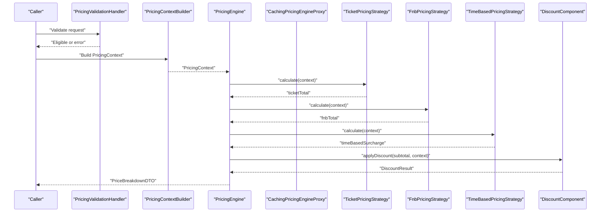

**Diagram sources**
- [PricingValidationHandler.java](file://backend/src/main/java/com/cinema/booking/services/strategy_decorator/pricing/validation/PricingValidationHandler.java)
- [PricingContextBuilder.java:36-59](file://backend/src/main/java/com/cinema/booking/services/strategy_decorator/pricing/PricingContextBuilder.java#L36-L59)
- [PricingEngine.java:45-75](file://backend/src/main/java/com/cinema/booking/services/strategy_decorator/pricing/PricingEngine.java#L45-L75)
- [TicketPricingStrategy.java:16-32](file://backend/src/main/java/com/cinema/booking/services/strategy_decorator/pricing/TicketPricingStrategy.java#L16-L32)
- [FnbPricingStrategy.java:19-31](file://backend/src/main/java/com/cinema/booking/services/strategy_decorator/pricing/FnbPricingStrategy.java#L19-L31)
- [TimeBasedPricingStrategy.java:39-68](file://backend/src/main/java/com/cinema/booking/services/strategy_decorator/pricing/TimeBasedPricingStrategy.java#L39-L68)
- [DiscountComponent.java](file://backend/src/main/java/com/cinema/booking/services/strategy_decorator/pricing/DiscountComponent.java)

## Detailed Component Analysis

### IPricingEngine and PricingEngine
- IPricingEngine defines a single method to calculate total price given a PricingContext, enabling a proxy wrapper without changing client code.
- PricingEngine:
  - Validates presence of strategies for all line types during construction.
  - Computes ticket, F&B, and time-based surcharge subtotals.
  - Builds a discount chain conditionally based on promotion and customer membership.
  - Produces a final price breakdown with safeguards ensuring non-negative totals.

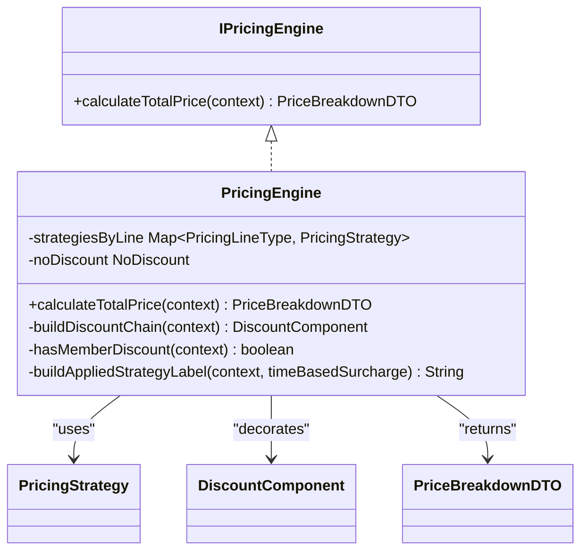

**Diagram sources**
- [IPricingEngine.java:9-11](file://backend/src/main/java/com/cinema/booking/services/strategy_decorator/pricing/IPricingEngine.java#L9-L11)
- [PricingEngine.java:25-117](file://backend/src/main/java/com/cinema/booking/services/strategy_decorator/pricing/PricingEngine.java#L25-L117)

**Section sources**
- [IPricingEngine.java:5-12](file://backend/src/main/java/com/cinema/booking/services/strategy_decorator/pricing/IPricingEngine.java#L5-L12)
- [PricingEngine.java:14-117](file://backend/src/main/java/com/cinema/booking/services/strategy_decorator/pricing/PricingEngine.java#L14-L117)

### PricingContext and PricingContextBuilder
- PricingContext encapsulates all inputs: showtime, seats, resolved F&B items, promotion, customer, booking time, occupancy counts.
- PricingContextBuilder:
  - Loads seats, resolves F&B items from repositories, identifies current customer from security context, and computes occupancy metrics.

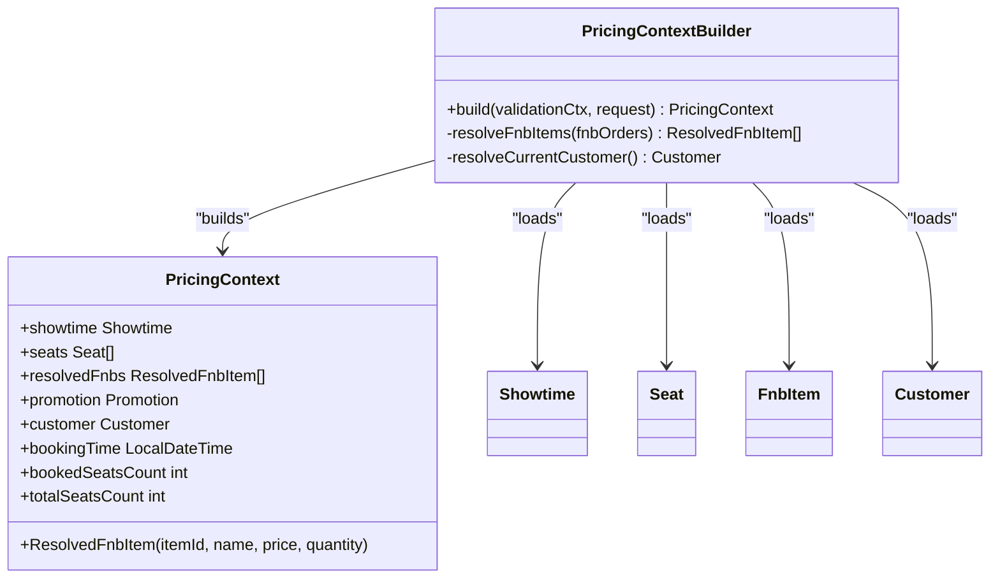

**Diagram sources**
- [PricingContext.java:14-35](file://backend/src/main/java/com/cinema/booking/services/strategy_decorator/pricing/PricingContext.java#L14-L35)
- [PricingContextBuilder.java:27-89](file://backend/src/main/java/com/cinema/booking/services/strategy_decorator/pricing/PricingContextBuilder.java#L27-L89)

**Section sources**
- [PricingContext.java:14-35](file://backend/src/main/java/com/cinema/booking/services/strategy_decorator/pricing/PricingContext.java#L14-L35)
- [PricingContextBuilder.java:24-89](file://backend/src/main/java/com/cinema/booking/services/strategy_decorator/pricing/PricingContextBuilder.java#L24-L89)

### Pricing Strategies (Strategy Pattern)
- TicketPricingStrategy: Sums base price plus seat-type surcharge across selected seats.
- FnbPricingStrategy: Multiplies unit price by quantity for each resolved F&B item.
- TimeBasedPricingStrategy: Evaluates weekend/holiday predicates and applies a configurable percentage to the ticket subtotal.

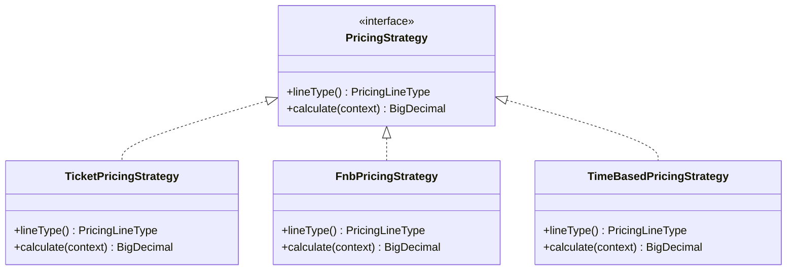

**Diagram sources**
- [PricingStrategy.java](file://backend/src/main/java/com/cinema/booking/services/strategy_decorator/pricing/PricingStrategy.java)
- [TicketPricingStrategy.java:8-34](file://backend/src/main/java/com/cinema/booking/services/strategy_decorator/pricing/TicketPricingStrategy.java#L8-L34)
- [FnbPricingStrategy.java:7-33](file://backend/src/main/java/com/cinema/booking/services/strategy_decorator/pricing/FnbPricingStrategy.java#L7-L33)
- [TimeBasedPricingStrategy.java:14-91](file://backend/src/main/java/com/cinema/booking/services/strategy_decorator/pricing/TimeBasedPricingStrategy.java#L14-L91)

**Section sources**
- [TicketPricingStrategy.java:8-34](file://backend/src/main/java/com/cinema/booking/services/strategy_decorator/pricing/TicketPricingStrategy.java#L8-L34)
- [FnbPricingStrategy.java:7-33](file://backend/src/main/java/com/cinema/booking/services/strategy_decorator/pricing/FnbPricingStrategy.java#L7-L33)
- [TimeBasedPricingStrategy.java:14-91](file://backend/src/main/java/com/cinema/booking/services/strategy_decorator/pricing/TimeBasedPricingStrategy.java#L14-L91)

### Discount Decorators (Decorator Pattern)
- DiscountComponent defines the decorator contract.
- NoDiscount is the base leaf.
- PromotionDiscountDecorator and MemberDiscountDecorator stack to form a chain.
- PricingEngine dynamically builds the chain based on context (promotion present and customer membership).

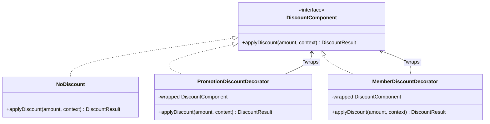

**Diagram sources**
- [DiscountComponent.java](file://backend/src/main/java/com/cinema/booking/services/strategy_decorator/pricing/DiscountComponent.java)
- [NoDiscount.java](file://backend/src/main/java/com/cinema/booking/services/strategy_decorator/pricing/NoDiscount.java)
- [PromotionDiscountDecorator.java](file://backend/src/main/java/com/cinema/booking/services/strategy_decorator/pricing/PromotionDiscountDecorator.java)
- [MemberDiscountDecorator.java](file://backend/src/main/java/com/cinema/booking/services/strategy_decorator/pricing/MemberDiscountDecorator.java)
- [PricingEngine.java:77-89](file://backend/src/main/java/com/cinema/booking/services/strategy_decorator/pricing/PricingEngine.java#L77-L89)

**Section sources**
- [PricingEngine.java:77-89](file://backend/src/main/java/com/cinema/booking/services/strategy_decorator/pricing/PricingEngine.java#L77-L89)
- [DiscountComponent.java](file://backend/src/main/java/com/cinema/booking/services/strategy_decorator/pricing/DiscountComponent.java)
- [NoDiscount.java](file://backend/src/main/java/com/cinema/booking/services/strategy_decorator/pricing/NoDiscount.java)
- [PromotionDiscountDecorator.java](file://backend/src/main/java/com/cinema/booking/services/strategy_decorator/pricing/PromotionDiscountDecorator.java)
- [MemberDiscountDecorator.java](file://backend/src/main/java/com/cinema/booking/services/strategy_decorator/pricing/MemberDiscountDecorator.java)

### Pricing Validation (Chain of Responsibility)
- AbstractPricingValidationHandler and PricingValidationHandler define the chain.
- Handlers include checks for showtime in the future, seats availability, and promotion validity.
- PricingContextBuilder relies on PricingValidationContext populated by the chain.

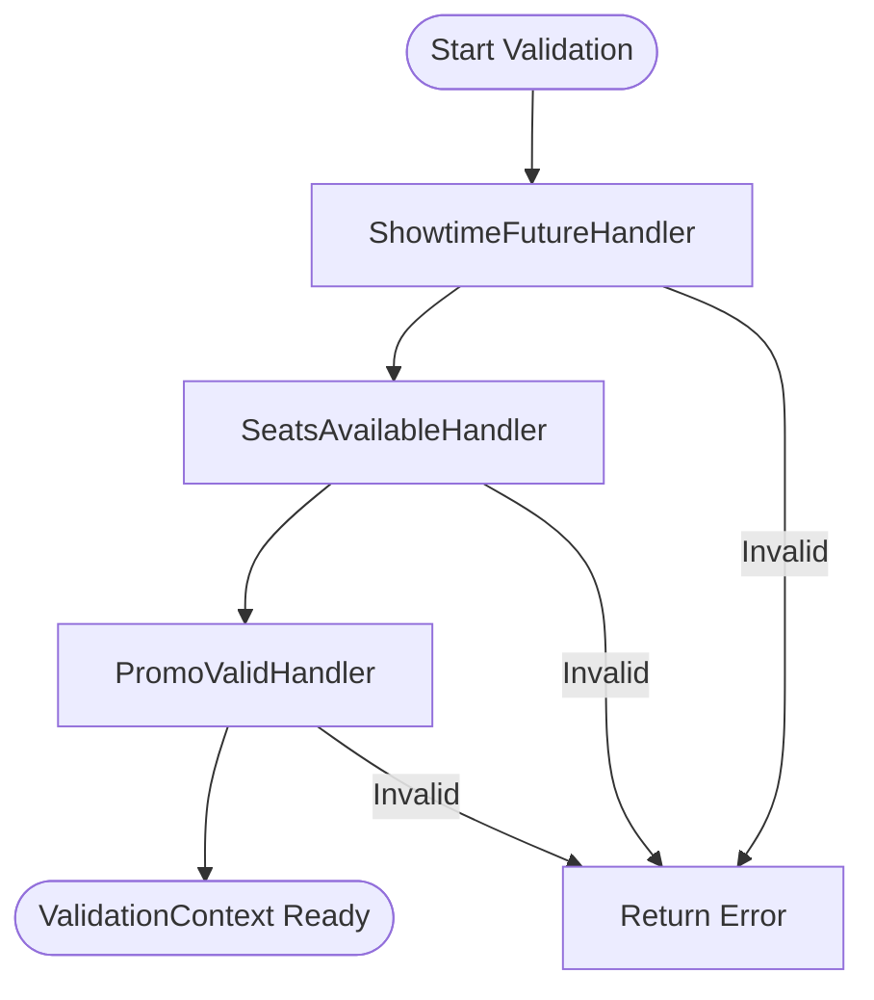

**Diagram sources**
- [AbstractPricingValidationHandler.java](file://backend/src/main/java/com/cinema/booking/services/strategy_decorator/pricing/validation/AbstractPricingValidationHandler.java)
- [PricingValidationHandler.java](file://backend/src/main/java/com/cinema/booking/services/strategy_decorator/pricing/validation/PricingValidationHandler.java)
- [ShowtimeFutureHandler.java](file://backend/src/main/java/com/cinema/booking/services/strategy_decorator/pricing/validation/ShowtimeFutureHandler.java)
- [SeatsAvailableHandler.java](file://backend/src/main/java/com/cinema/booking/services/strategy_decorator/pricing/validation/SeatsAvailableHandler.java)
- [PromoValidHandler.java](file://backend/src/main/java/com/cinema/booking/services/strategy_decorator/pricing/validation/PromoValidHandler.java)

**Section sources**
- [AbstractPricingValidationHandler.java](file://backend/src/main/java/com/cinema/booking/services/strategy_decorator/pricing/validation/AbstractPricingValidationHandler.java)
- [PricingValidationHandler.java](file://backend/src/main/java/com/cinema/booking/services/strategy_decorator/pricing/validation/PricingValidationHandler.java)
- [PricingValidationContext.java](file://backend/src/main/java/com/cinema/booking/services/strategy_decorator/pricing/validation/PricingValidationContext.java)
- [PricingValidationConfig.java](file://backend/src/main/java/com/cinema/booking/services/strategy_decorator/pricing/validation/PricingValidationConfig.java)
- [ShowtimeFutureHandler.java](file://backend/src/main/java/com/cinema/booking/services/strategy_decorator/pricing/validation/ShowtimeFutureHandler.java)
- [SeatsAvailableHandler.java](file://backend/src/main/java/com/cinema/booking/services/strategy_decorator/pricing/validation/SeatsAvailableHandler.java)
- [PromoValidHandler.java](file://backend/src/main/java/com/cinema/booking/services/strategy_decorator/pricing/validation/PromoValidHandler.java)

### Proxy Pattern for Caching
- CachingPricingEngineProxy wraps IPricingEngine to cache results keyed by PricingContext.
- Transparent to clients; they continue to call IPricingEngine.calculateTotalPrice.

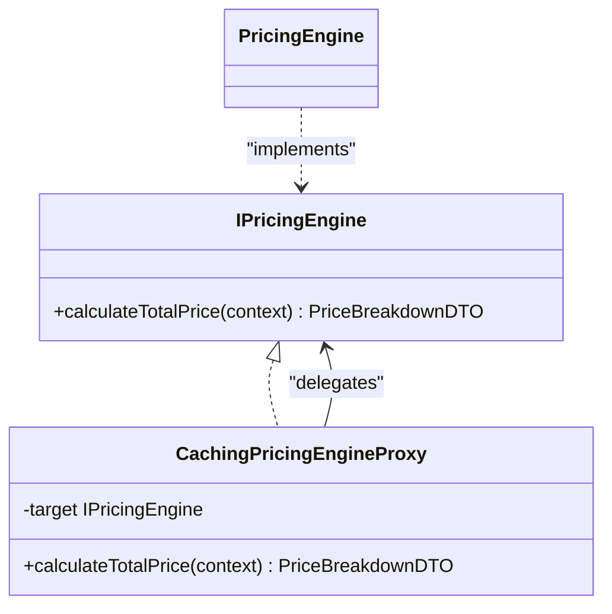

**Diagram sources**
- [IPricingEngine.java:9-11](file://backend/src/main/java/com/cinema/booking/services/strategy_decorator/pricing/IPricingEngine.java#L9-L11)
- [CachingPricingEngineProxy.java](file://backend/src/main/java/com/cinema/booking/services/strategy_decorator/pricing/CachingPricingEngineProxy.java)
- [PricingEngine.java:25-25](file://backend/src/main/java/com/cinema/booking/services/strategy_decorator/pricing/PricingEngine.java#L25-L25)

**Section sources**
- [IPricingEngine.java:5-12](file://backend/src/main/java/com/cinema/booking/services/strategy_decorator/pricing/IPricingEngine.java#L5-L12)
- [CachingPricingEngineProxy.java](file://backend/src/main/java/com/cinema/booking/services/strategy_decorator/pricing/CachingPricingEngineProxy.java)

### Concrete Pricing Scenarios

#### Scenario 1: Time-Based Surcharge and Seat Type Variations
- Inputs: showtime base price, multiple seats with distinct seat-type surcharges, occupancy metrics.
- Workflow:
  - TicketPricingStrategy sums base price plus surcharges per seat.
  - TimeBasedPricingStrategy evaluates weekend/holiday predicates and applies a configured rate to the ticket subtotal.
  - Final total includes surcharge; discount chain is applied afterward.

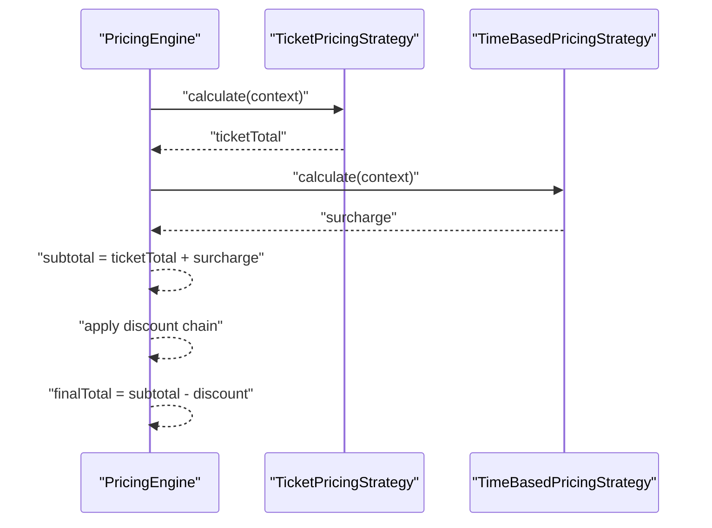

**Diagram sources**
- [PricingEngine.java:45-75](file://backend/src/main/java/com/cinema/booking/services/strategy_decorator/pricing/PricingEngine.java#L45-L75)
- [TicketPricingStrategy.java:16-32](file://backend/src/main/java/com/cinema/booking/services/strategy_decorator/pricing/TicketPricingStrategy.java#L16-L32)
- [TimeBasedPricingStrategy.java:39-68](file://backend/src/main/java/com/cinema/booking/services/strategy_decorator/pricing/TimeBasedPricingStrategy.java#L39-L68)

#### Scenario 2: Membership Discounts and Promotional Offers
- Inputs: customer with membership tier, applicable promotion.
- Workflow:
  - PricingEngine detects promotion and membership, builds a decorator chain accordingly.
  - DiscountComponent.applyDiscount computes total discount and separates membership discount for reporting.

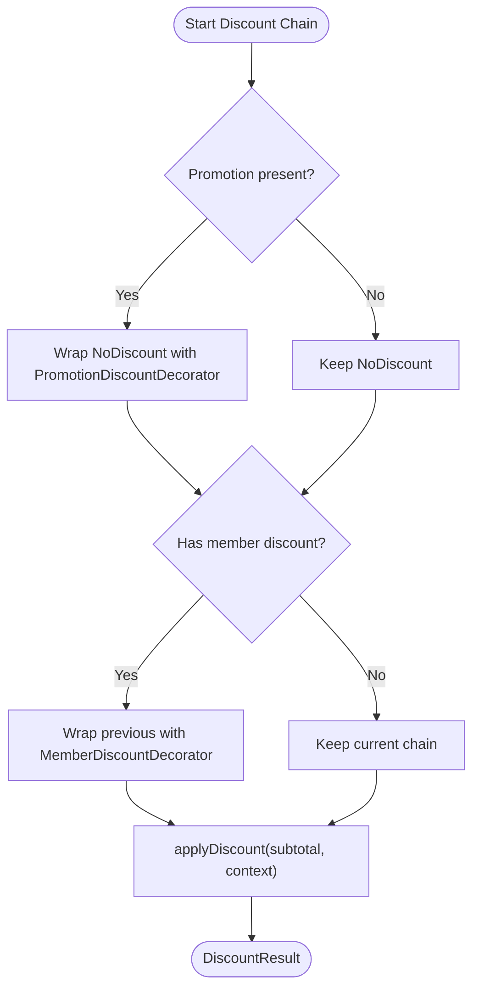

**Diagram sources**
- [PricingEngine.java:77-89](file://backend/src/main/java/com/cinema/booking/services/strategy_decorator/pricing/PricingEngine.java#L77-L89)
- [DiscountComponent.java](file://backend/src/main/java/com/cinema/booking/services/strategy_decorator/pricing/DiscountComponent.java)
- [PromotionDiscountDecorator.java](file://backend/src/main/java/com/cinema/booking/services/strategy_decorator/pricing/PromotionDiscountDecorator.java)
- [MemberDiscountDecorator.java](file://backend/src/main/java/com/cinema/booking/services/strategy_decorator/pricing/MemberDiscountDecorator.java)

## Dependency Analysis
- PricingEngine depends on:
  - PricingStrategy implementations registered per PricingLineType.
  - DiscountComponent hierarchy for discount computation.
  - PricingContextBuilder for assembling inputs.
  - PricingValidationContext produced by validation handlers.
- Strategies depend on entities (Showtime, Seat, SeatType, FnbItem) and specification predicates for time-based decisions.
- CachingPricingEngineProxy depends on IPricingEngine and caches results keyed by PricingContext.

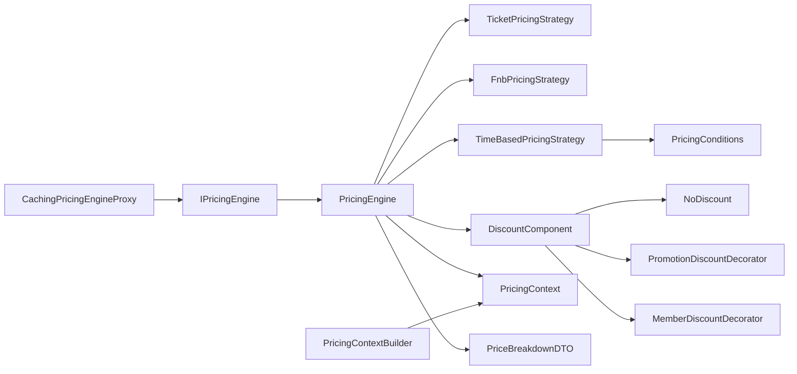

**Diagram sources**
- [PricingEngine.java:25-117](file://backend/src/main/java/com/cinema/booking/services/strategy_decorator/pricing/PricingEngine.java#L25-L117)
- [PricingContextBuilder.java:27-89](file://backend/src/main/java/com/cinema/booking/services/strategy_decorator/pricing/PricingContextBuilder.java#L27-L89)
- [TicketPricingStrategy.java:8-34](file://backend/src/main/java/com/cinema/booking/services/strategy_decorator/pricing/TicketPricingStrategy.java#L8-L34)
- [FnbPricingStrategy.java:7-33](file://backend/src/main/java/com/cinema/booking/services/strategy_decorator/pricing/FnbPricingStrategy.java#L7-L33)
- [TimeBasedPricingStrategy.java:14-91](file://backend/src/main/java/com/cinema/booking/services/strategy_decorator/pricing/TimeBasedPricingStrategy.java#L14-L91)
- [PricingConditions.java](file://backend/src/main/java/com/cinema/booking/services/strategy_decorator/specification/PricingConditions.java)
- [CachingPricingEngineProxy.java](file://backend/src/main/java/com/cinema/booking/services/strategy_decorator/pricing/CachingPricingEngineProxy.java)
- [IPricingEngine.java:9-11](file://backend/src/main/java/com/cinema/booking/services/strategy_decorator/pricing/IPricingEngine.java#L9-L11)

**Section sources**
- [PricingEngine.java:25-117](file://backend/src/main/java/com/cinema/booking/services/strategy_decorator/pricing/PricingEngine.java#L25-L117)
- [PricingContextBuilder.java:27-89](file://backend/src/main/java/com/cinema/booking/services/strategy_decorator/pricing/PricingContextBuilder.java#L27-L89)
- [TimeBasedPricingStrategy.java:14-91](file://backend/src/main/java/com/cinema/booking/services/strategy_decorator/pricing/TimeBasedPricingStrategy.java#L14-L91)
- [CachingPricingEngineProxy.java](file://backend/src/main/java/com/cinema/booking/services/strategy_decorator/pricing/CachingPricingEngineProxy.java)

## Performance Considerations
- Strategy registration: PricingEngine enforces one strategy per PricingLineType at startup to avoid runtime ambiguity and reduce lookup overhead.
- Discount chain construction: Conditional decorator wrapping avoids unnecessary allocations when promotions or memberships are absent.
- Time-based surcharge: Uses specification predicates to short-circuit non-applicable scenarios and computes a single surcharge based on ticket subtotal.
- Caching: CachingPricingEngineProxy reduces repeated computations for identical contexts; ensure cache keys include all relevant context fields.

[No sources needed since this section provides general guidance]

## Troubleshooting Guide
- Missing strategy for a line type: PricingEngine constructor throws an error if any PricingLineType lacks a registered strategy.
- Duplicate strategy for a line type: Constructor throws an error if multiple strategies are registered for the same line type.
- Non-positive final total: PricingEngine clamps final total to zero and adjusts discount amounts accordingly.
- Promotion or membership not applied: Verify that context includes a promotion and that customer has a membership tier with a positive discount percent.
- Validation failures: Ensure the chain of responsibility handlers pass before building PricingContext.

**Section sources**
- [PricingEngine.java:30-43](file://backend/src/main/java/com/cinema/booking/services/strategy_decorator/pricing/PricingEngine.java#L30-L43)
- [PricingEngine.java:58-62](file://backend/src/main/java/com/cinema/booking/services/strategy_decorator/pricing/PricingEngine.java#L58-L62)
- [PricingEngine.java:91-97](file://backend/src/main/java/com/cinema/booking/services/strategy_decorator/pricing/PricingEngine.java#L91-L97)

## Conclusion
The Dynamic Pricing Engine cleanly separates concerns across Strategy, Decorator, Chain of Responsibility, and Proxy patterns. It enables extensible pricing logic, robust discount stacking, pre-validation guarantees, and efficient caching. The design supports time-based surcharges, seat-type variations, membership discounts, and promotional offers through composable components.

[No sources needed since this section summarizes without analyzing specific files]

## Appendices

### Data Model Overview
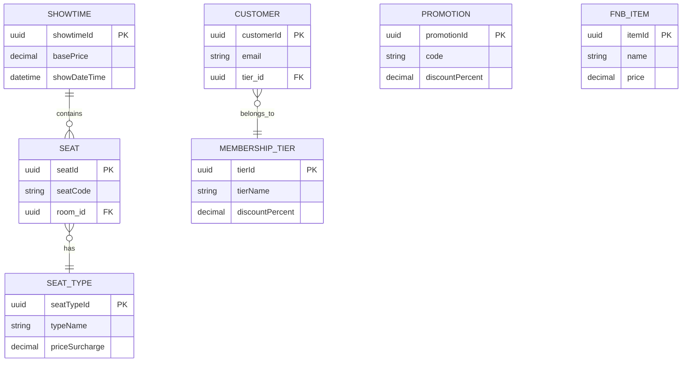

**Diagram sources**
- [Showtime.java](file://backend/src/main/java/com/cinema/booking/entities/Showtime.java)
- [Seat.java](file://backend/src/main/java/com/cinema/booking/entities/Seat.java)
- [SeatType.java](file://backend/src/main/java/com/cinema/booking/entities/SeatType.java)
- [Customer.java](file://backend/src/main/java/com/cinema/booking/entities/Customer.java)
- [MembershipTier.java](file://backend/src/main/java/com/cinema/booking/entities/MembershipTier.java)
- [Promotion.java](file://backend/src/main/java/com/cinema/booking/entities/Promotion.java)
- [FnbItem.java](file://backend/src/main/java/com/cinema/booking/entities/FnbItem.java)