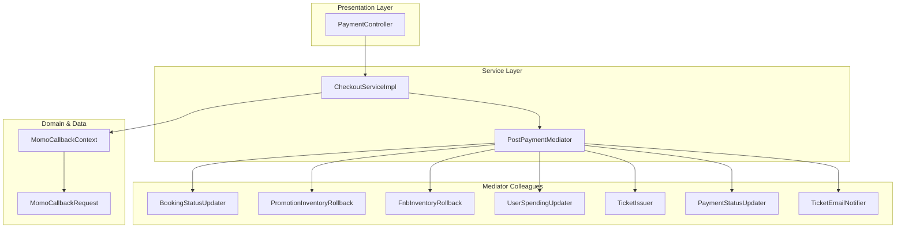
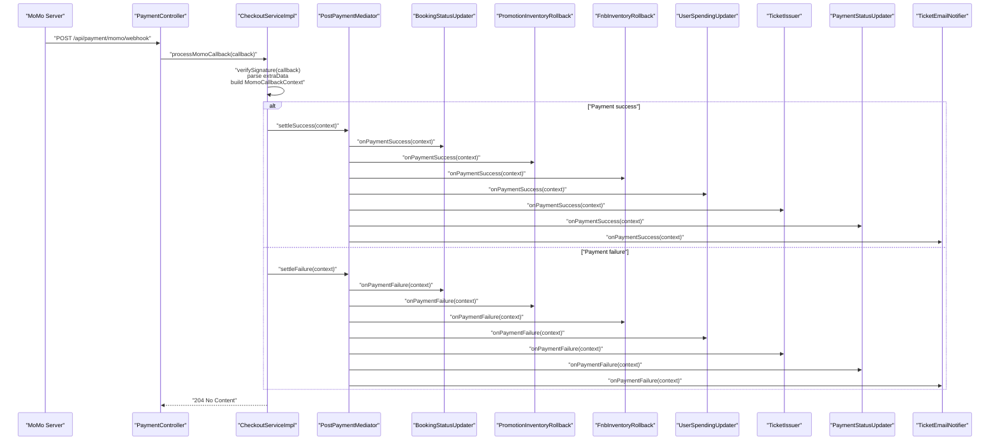
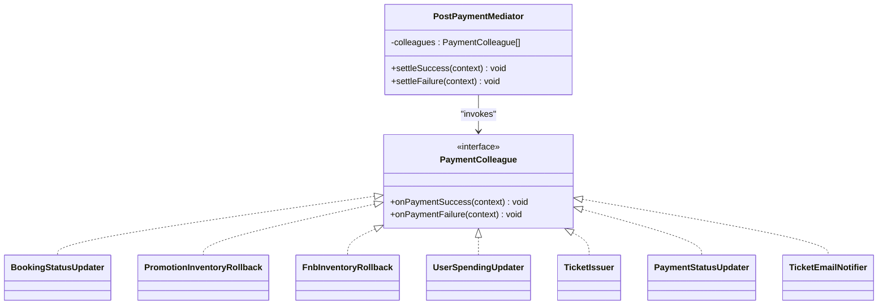
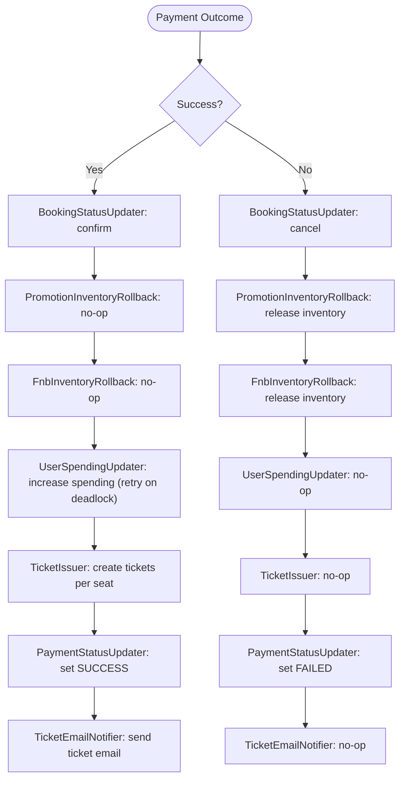
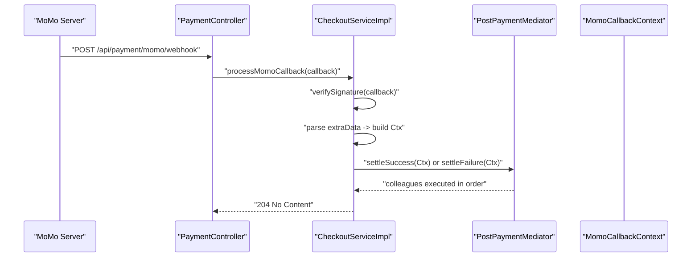
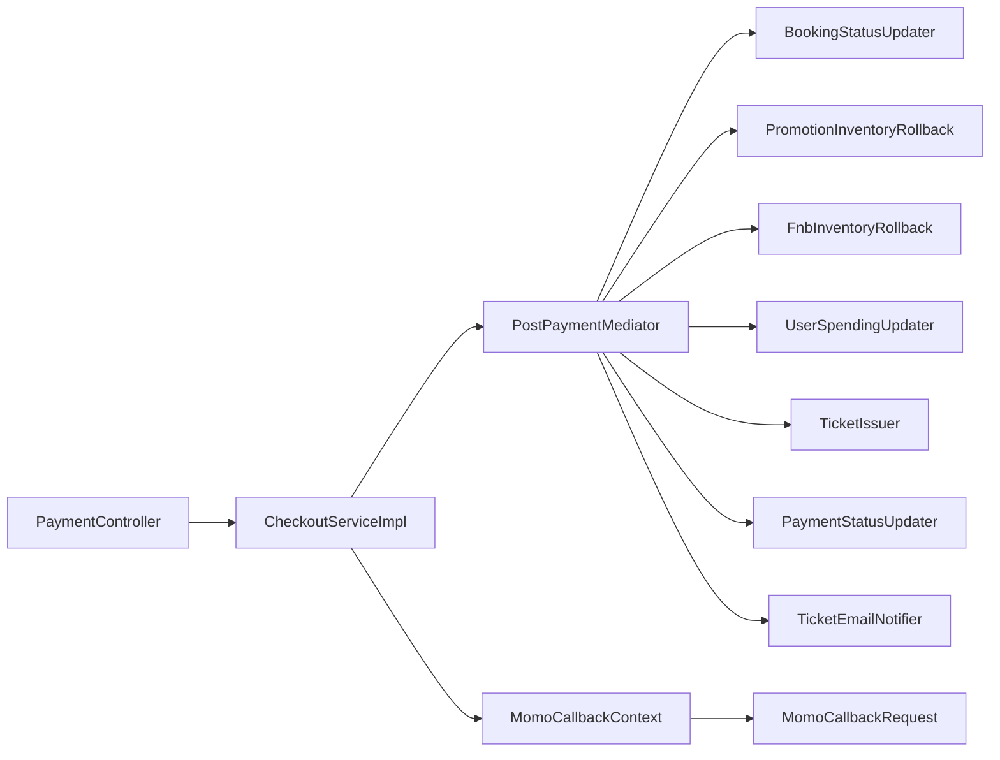

# Mediator Pattern

<cite>
**Referenced Files in This Document**
- [PostPaymentMediator.java](file://backend/src/main/java/com/cinema/booking/patterns/mediator/PostPaymentMediator.java)
- [PaymentColleague.java](file://backend/src/main/java/com/cinema/booking/patterns/mediator/PaymentColleague.java)
- [BookingStatusUpdater.java](file://backend/src/main/java/com/cinema/booking/patterns/mediator/BookingStatusUpdater.java)
- [FnbInventoryRollback.java](file://backend/src/main/java/com/cinema/booking/patterns/mediator/FnbInventoryRollback.java)
- [PromotionInventoryRollback.java](file://backend/src/main/java/com/cinema/booking/patterns/mediator/PromotionInventoryRollback.java)
- [UserSpendingUpdater.java](file://backend/src/main/java/com/cinema/booking/patterns/mediator/UserSpendingUpdater.java)
- [TicketIssuer.java](file://backend/src/main/java/com/cinema/booking/patterns/mediator/TicketIssuer.java)
- [TicketEmailNotifier.java](file://backend/src/main/java/com/cinema/booking/patterns/mediator/TicketEmailNotifier.java)
- [PaymentStatusUpdater.java](file://backend/src/main/java/com/cinema/booking/patterns/mediator/PaymentStatusUpdater.java)
- [MomoCallbackContext.java](file://backend/src/main/java/com/cinema/booking/patterns/mediator/MomoCallbackContext.java)
- [CheckoutServiceImpl.java](file://backend/src/main/java/com/cinema/booking/services/impl/CheckoutServiceImpl.java)
- [PaymentController.java](file://backend/src/main/java/com/cinema/booking/controllers/PaymentController.java)
- [MomoCallbackRequest.java](file://backend/src/main/java/com/cinema/booking/dtos/MomoCallbackRequest.java)
</cite>

## Table of Contents
1. [Introduction](#introduction)
2. [Project Structure](#project-structure)
3. [Core Components](#core-components)
4. [Architecture Overview](#architecture-overview)
5. [Detailed Component Analysis](#detailed-component-analysis)
6. [Dependency Analysis](#dependency-analysis)
7. [Performance Considerations](#performance-considerations)
8. [Troubleshooting Guide](#troubleshooting-guide)
9. [Conclusion](#conclusion)

## Introduction
This document explains the Mediator pattern implementation in the post-payment coordination system. It focuses on how the PostPaymentMediator coordinates multiple PaymentColleague objects to handle payment callbacks, update booking status, manage inventory rollbacks, issue tickets, update user spending, and send notifications. The goal is to demonstrate how the mediator decouples payment processing components while ensuring reliable, ordered post-payment actions regardless of payment outcome.

## Project Structure
The Mediator pattern resides under the patterns/mediator package and integrates with the checkout and payment services. The key files are:
- Mediator: PostPaymentMediator
- Colleagues: BookingStatusUpdater, PromotionInventoryRollback, FnbInventoryRollback, UserSpendingUpdater, TicketIssuer, PaymentStatusUpdater, TicketEmailNotifier
- Context: MomoCallbackContext
- Orchestration: CheckoutServiceImpl invokes the mediator after validating MoMo callbacks
- Entry points: PaymentController exposes MoMo redirect and webhook endpoints

**Diagram sources**
- [PaymentController.java:75-100](file://backend/src/main/java/com/cinema/booking/controllers/PaymentController.java#L75-L100)
- [CheckoutServiceImpl.java:68-130](file://backend/src/main/java/com/cinema/booking/services/impl/CheckoutServiceImpl.java#L68-L130)
- [PostPaymentMediator.java:10-46](file://backend/src/main/java/com/cinema/booking/patterns/mediator/PostPaymentMediator.java#L10-L46)
- [MomoCallbackContext.java:12-18](file://backend/src/main/java/com/cinema/booking/patterns/mediator/MomoCallbackContext.java#L12-L18)
- [MomoCallbackRequest.java:6-20](file://backend/src/main/java/com/cinema/booking/dtos/MomoCallbackRequest.java#L6-L20)

**Section sources**
- [PaymentController.java:75-100](file://backend/src/main/java/com/cinema/booking/controllers/PaymentController.java#L75-L100)
- [CheckoutServiceImpl.java:68-130](file://backend/src/main/java/com/cinema/booking/services/impl/CheckoutServiceImpl.java#L68-L130)
- [PostPaymentMediator.java:10-46](file://backend/src/main/java/com/cinema/booking/patterns/mediator/PostPaymentMediator.java#L10-L46)

## Core Components
- Mediator interface: PaymentColleague defines the contract for all post-payment actions.
- Concrete mediator: PostPaymentMediator holds a fixed list of colleagues and dispatches success/failure events in a deterministic order.
- Colleagues:
  - BookingStatusUpdater: confirms or cancels the booking depending on outcome.
  - PromotionInventoryRollback: releases promotions on failure.
  - FnbInventoryRollback: releases FnB items on failure.
  - UserSpendingUpdater: safely increases customer total spending on success with deadlock retries.
  - TicketIssuer: creates tickets for seats on success.
  - PaymentStatusUpdater: updates payment records to SUCCESS or FAILED.
  - TicketEmailNotifier: sends ticket emails on success.

These components are registered in a specific order to ensure consistent side effects after payment completion.

**Section sources**
- [PaymentColleague.java:3-6](file://backend/src/main/java/com/cinema/booking/patterns/mediator/PaymentColleague.java#L3-L6)
- [PostPaymentMediator.java:12-33](file://backend/src/main/java/com/cinema/booking/patterns/mediator/PostPaymentMediator.java#L12-L33)
- [BookingStatusUpdater.java:10-25](file://backend/src/main/java/com/cinema/booking/patterns/mediator/BookingStatusUpdater.java#L10-L25)
- [PromotionInventoryRollback.java:9-22](file://backend/src/main/java/com/cinema/booking/patterns/mediator/PromotionInventoryRollback.java#L9-L22)
- [FnbInventoryRollback.java:9-22](file://backend/src/main/java/com/cinema/booking/patterns/mediator/FnbInventoryRollback.java#L9-L22)
- [UserSpendingUpdater.java:13-58](file://backend/src/main/java/com/cinema/booking/patterns/mediator/UserSpendingUpdater.java#L13-L58)
- [TicketIssuer.java:16-60](file://backend/src/main/java/com/cinema/booking/patterns/mediator/TicketIssuer.java#L16-L60)
- [PaymentStatusUpdater.java:14-58](file://backend/src/main/java/com/cinema/booking/patterns/mediator/PaymentStatusUpdater.java#L14-L58)
- [TicketEmailNotifier.java:9-27](file://backend/src/main/java/com/cinema/booking/patterns/mediator/TicketEmailNotifier.java#L9-L27)

## Architecture Overview
The mediator pattern centralizes post-payment orchestration. After MoMo’s server-to-server webhook, the system validates the callback, constructs a MomoCallbackContext, and delegates to PostPaymentMediator. The mediator iterates through colleagues in a predefined order, invoking onPaymentSuccess or onPaymentFailure. This design isolates each colleague from others, enabling independent development and testing.

**Diagram sources**
- [PaymentController.java:92-100](file://backend/src/main/java/com/cinema/booking/controllers/PaymentController.java#L92-L100)
- [CheckoutServiceImpl.java:68-130](file://backend/src/main/java/com/cinema/booking/services/impl/CheckoutServiceImpl.java#L68-L130)
- [PostPaymentMediator.java:35-45](file://backend/src/main/java/com/cinema/booking/patterns/mediator/PostPaymentMediator.java#L35-L45)
- [BookingStatusUpdater.java:14-24](file://backend/src/main/java/com/cinema/booking/patterns/mediator/BookingStatusUpdater.java#L14-L24)
- [PromotionInventoryRollback.java:13-21](file://backend/src/main/java/com/cinema/booking/patterns/mediator/PromotionInventoryRollback.java#L13-L21)
- [FnbInventoryRollback.java:13-21](file://backend/src/main/java/com/cinema/booking/patterns/mediator/FnbInventoryRollback.java#L13-L21)
- [UserSpendingUpdater.java:20-34](file://backend/src/main/java/com/cinema/booking/patterns/mediator/UserSpendingUpdater.java#L20-L34)
- [TicketIssuer.java:22-59](file://backend/src/main/java/com/cinema/booking/patterns/mediator/TicketIssuer.java#L22-L59)
- [PaymentStatusUpdater.java:18-57](file://backend/src/main/java/com/cinema/booking/patterns/mediator/PaymentStatusUpdater.java#L18-L57)
- [TicketEmailNotifier.java:13-26](file://backend/src/main/java/com/cinema/booking/patterns/mediator/TicketEmailNotifier.java#L13-L26)

## Detailed Component Analysis

### Mediator Interface and Concrete Mediator
- PaymentColleague defines two methods: onPaymentSuccess and onPaymentFailure. This uniform interface allows the mediator to treat all colleagues identically.
- PostPaymentMediator:
  - Holds a static list of colleagues injected via constructor.
  - Executes onPaymentSuccess or onPaymentFailure in the exact order defined in construction.
  - Ensures all colleagues receive the same MomoCallbackContext.

**Diagram sources**
- [PaymentColleague.java:3-6](file://backend/src/main/java/com/cinema/booking/patterns/mediator/PaymentColleague.java#L3-L6)
- [PostPaymentMediator.java:12-33](file://backend/src/main/java/com/cinema/booking/patterns/mediator/PostPaymentMediator.java#L12-L33)
- [BookingStatusUpdater.java:10-25](file://backend/src/main/java/com/cinema/booking/patterns/mediator/BookingStatusUpdater.java#L10-L25)
- [PromotionInventoryRollback.java:9-22](file://backend/src/main/java/com/cinema/booking/patterns/mediator/PromotionInventoryRollback.java#L9-L22)
- [FnbInventoryRollback.java:9-22](file://backend/src/main/java/com/cinema/booking/patterns/mediator/FnbInventoryRollback.java#L9-L22)
- [UserSpendingUpdater.java:13-58](file://backend/src/main/java/com/cinema/booking/patterns/mediator/UserSpendingUpdater.java#L13-L58)
- [TicketIssuer.java:16-60](file://backend/src/main/java/com/cinema/booking/patterns/mediator/TicketIssuer.java#L16-L60)
- [PaymentStatusUpdater.java:14-58](file://backend/src/main/java/com/cinema/booking/patterns/mediator/PaymentStatusUpdater.java#L14-L58)
- [TicketEmailNotifier.java:9-27](file://backend/src/main/java/com/cinema/booking/patterns/mediator/TicketEmailNotifier.java#L9-L27)

**Section sources**
- [PaymentColleague.java:3-6](file://backend/src/main/java/com/cinema/booking/patterns/mediator/PaymentColleague.java#L3-L6)
- [PostPaymentMediator.java:10-46](file://backend/src/main/java/com/cinema/booking/patterns/mediator/PostPaymentMediator.java#L10-L46)

### Colleague Responsibilities
- BookingStatusUpdater
  - On success: marks booking as confirmed.
  - On failure: marks booking as cancelled.
- PromotionInventoryRollback
  - On success: no action (promotion reservations were handled earlier).
  - On failure: releases promotion inventory for the booking.
- FnbInventoryRollback
  - On success: no action (FnB reservations were handled earlier).
  - On failure: releases FnB items for the booking.
- UserSpendingUpdater
  - On success: increases customer total spending with retry logic for deadlocks.
  - On failure: no action.
- TicketIssuer
  - On success: creates tickets for each seat with price calculation based on base price and seat surcharge.
  - On failure: no action.
- PaymentStatusUpdater
  - On success: finds pending MOMO payments and sets status to SUCCESS; persists paid timestamp.
  - On failure: finds pending MOMO payments and sets status to FAILED.
- TicketEmailNotifier
  - On success: attempts to send a ticket email asynchronously.
  - On failure: no action.

**Diagram sources**
- [BookingStatusUpdater.java:14-24](file://backend/src/main/java/com/cinema/booking/patterns/mediator/BookingStatusUpdater.java#L14-L24)
- [PromotionInventoryRollback.java:13-21](file://backend/src/main/java/com/cinema/booking/patterns/mediator/PromotionInventoryRollback.java#L13-L21)
- [FnbInventoryRollback.java:13-21](file://backend/src/main/java/com/cinema/booking/patterns/mediator/FnbInventoryRollback.java#L13-L21)
- [UserSpendingUpdater.java:20-57](file://backend/src/main/java/com/cinema/booking/patterns/mediator/UserSpendingUpdater.java#L20-L57)
- [TicketIssuer.java:22-59](file://backend/src/main/java/com/cinema/booking/patterns/mediator/TicketIssuer.java#L22-L59)
- [PaymentStatusUpdater.java:18-57](file://backend/src/main/java/com/cinema/booking/patterns/mediator/PaymentStatusUpdater.java#L18-L57)
- [TicketEmailNotifier.java:13-26](file://backend/src/main/java/com/cinema/booking/patterns/mediator/TicketEmailNotifier.java#L13-L26)

**Section sources**
- [BookingStatusUpdater.java:10-25](file://backend/src/main/java/com/cinema/booking/patterns/mediator/BookingStatusUpdater.java#L10-L25)
- [PromotionInventoryRollback.java:9-22](file://backend/src/main/java/com/cinema/booking/patterns/mediator/PromotionInventoryRollback.java#L9-L22)
- [FnbInventoryRollback.java:9-22](file://backend/src/main/java/com/cinema/booking/patterns/mediator/FnbInventoryRollback.java#L9-L22)
- [UserSpendingUpdater.java:13-58](file://backend/src/main/java/com/cinema/booking/patterns/mediator/UserSpendingUpdater.java#L13-L58)
- [TicketIssuer.java:16-60](file://backend/src/main/java/com/cinema/booking/patterns/mediator/TicketIssuer.java#L16-L60)
- [PaymentStatusUpdater.java:14-58](file://backend/src/main/java/com/cinema/booking/patterns/mediator/PaymentStatusUpdater.java#L14-L58)
- [TicketEmailNotifier.java:9-27](file://backend/src/main/java/com/cinema/booking/patterns/mediator/TicketEmailNotifier.java#L9-L27)

### Context and Orchestration
- MomoCallbackContext encapsulates the MoMo callback payload, the associated booking, seat IDs, showtime ID, and a success flag.
- CheckoutServiceImpl:
  - Verifies MoMo signature and parses extraData to extract bookingId, showtimeId, and seatIds.
  - Builds MomoCallbackContext and delegates to PostPaymentMediator based on outcome.
- PaymentController:
  - Exposes /momo/webhook for server-to-server notifications and /momo/callback for redirects.
  - Calls CheckoutServiceImpl to process callbacks and redirects users accordingly.

**Diagram sources**
- [PaymentController.java:92-100](file://backend/src/main/java/com/cinema/booking/controllers/PaymentController.java#L92-L100)
- [CheckoutServiceImpl.java:68-130](file://backend/src/main/java/com/cinema/booking/services/impl/CheckoutServiceImpl.java#L68-L130)
- [PostPaymentMediator.java:35-45](file://backend/src/main/java/com/cinema/booking/patterns/mediator/PostPaymentMediator.java#L35-L45)
- [MomoCallbackContext.java:12-18](file://backend/src/main/java/com/cinema/booking/patterns/mediator/MomoCallbackContext.java#L12-L18)

**Section sources**
- [MomoCallbackContext.java:12-18](file://backend/src/main/java/com/cinema/booking/patterns/mediator/MomoCallbackContext.java#L12-L18)
- [CheckoutServiceImpl.java:68-130](file://backend/src/main/java/com/cinema/booking/services/impl/CheckoutServiceImpl.java#L68-L130)
- [PaymentController.java:75-100](file://backend/src/main/java/com/cinema/booking/controllers/PaymentController.java#L75-L100)

## Dependency Analysis
- Cohesion: Each colleague encapsulates a single responsibility (booking, inventory, spending, tickets, payment, email).
- Coupling: Colleagues depend only on the PaymentColleague contract and MomoCallbackContext. They do not directly depend on each other.
- Mediator control: PostPaymentMediator controls invocation order and ensures all colleagues react consistently to success or failure.
- External integrations: MoMo callback verification, database persistence, and asynchronous email delivery are isolated in their respective collaborators.

**Diagram sources**
- [PostPaymentMediator.java:12-33](file://backend/src/main/java/com/cinema/booking/patterns/mediator/PostPaymentMediator.java#L12-L33)
- [CheckoutServiceImpl.java:41-41](file://backend/src/main/java/com/cinema/booking/services/impl/CheckoutServiceImpl.java#L41-L41)
- [PaymentController.java:92-100](file://backend/src/main/java/com/cinema/booking/controllers/PaymentController.java#L92-L100)
- [MomoCallbackContext.java:12-18](file://backend/src/main/java/com/cinema/booking/patterns/mediator/MomoCallbackContext.java#L12-L18)
- [MomoCallbackRequest.java:6-20](file://backend/src/main/java/com/cinema/booking/dtos/MomoCallbackRequest.java#L6-L20)

**Section sources**
- [PostPaymentMediator.java:12-33](file://backend/src/main/java/com/cinema/booking/patterns/mediator/PostPaymentMediator.java#L12-L33)
- [CheckoutServiceImpl.java:41-41](file://backend/src/main/java/com/cinema/booking/services/impl/CheckoutServiceImpl.java#L41-L41)

## Performance Considerations
- Ordered execution: The colleague list determines side-effect ordering. Keep the list concise and ordered to minimize latency.
- Deadlock resilience: UserSpendingUpdater retries on deadlock with exponential backoff; ensure database contention is mitigated by proper indexing and transaction isolation.
- Asynchronous operations: TicketEmailNotifier performs I/O; consider queuing to avoid blocking the webhook thread.
- Idempotency: PaymentStatusUpdater handles both creation and update of payment records; ensure idempotent writes to prevent duplicates.

## Troubleshooting Guide
- Validation failures:
  - MoMo signature mismatch leads to immediate rejection in CheckoutServiceImpl.
  - Missing extraData triggers errors; verify client-side generation of extraData.
- Seat and showtime parsing:
  - Malformed extraData or missing seat IDs/showtime ID causes TicketIssuer to skip ticket creation; inspect extraData encoding and structure.
- Inventory rollbacks:
  - On failure, ensure PromotionInventoryRollback and FnbInventoryRollback services are reachable and idempotent.
- Payment record updates:
  - PaymentStatusUpdater logs exceptions; check database connectivity and pending MOMO payment existence.
- Email delivery:
  - TicketEmailNotifier logs exceptions; verify email service availability and queue health.

**Section sources**
- [CheckoutServiceImpl.java:68-130](file://backend/src/main/java/com/cinema/booking/services/impl/CheckoutServiceImpl.java#L68-L130)
- [TicketIssuer.java:22-59](file://backend/src/main/java/com/cinema/booking/patterns/mediator/TicketIssuer.java#L22-L59)
- [PaymentStatusUpdater.java:18-57](file://backend/src/main/java/com/cinema/booking/patterns/mediator/PaymentStatusUpdater.java#L18-L57)
- [TicketEmailNotifier.java:13-26](file://backend/src/main/java/com/cinema/booking/patterns/mediator/TicketEmailNotifier.java#L13-L26)

## Conclusion
The Mediator pattern cleanly separates concerns in the post-payment workflow. By delegating side effects to specialized colleagues and enforcing a strict execution order, the system remains maintainable, testable, and robust against partial failures. The design enables easy extension of new post-payment actions without modifying existing components, exemplifying the benefits of the mediator approach in coordinating complex, interdependent operations.