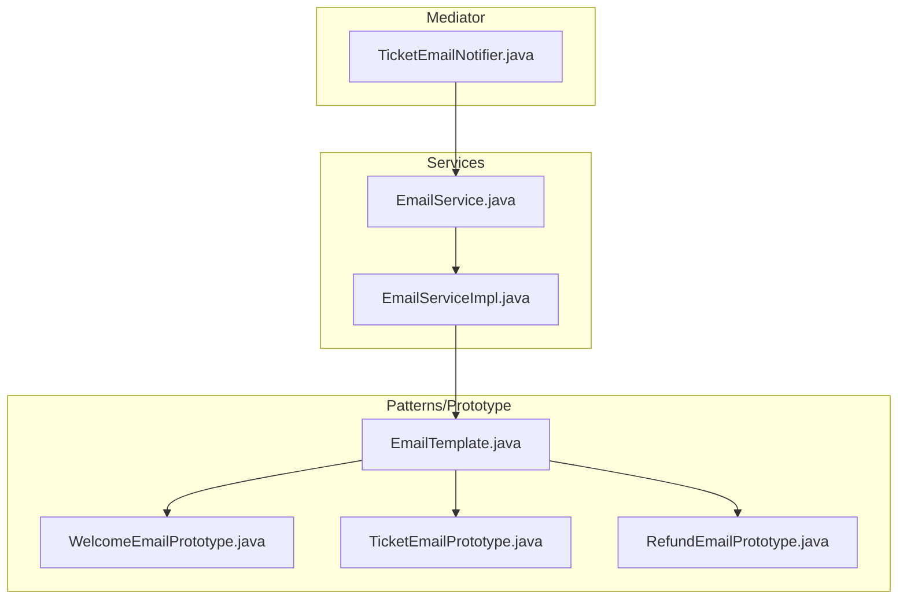
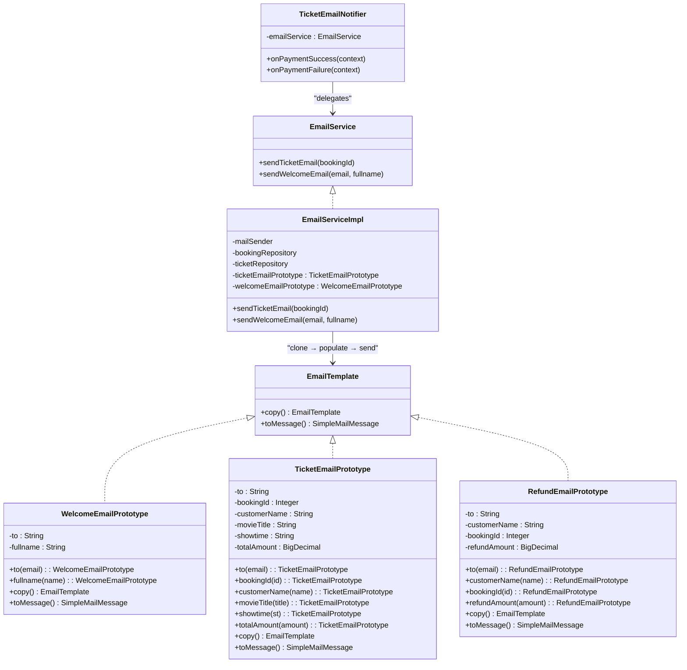
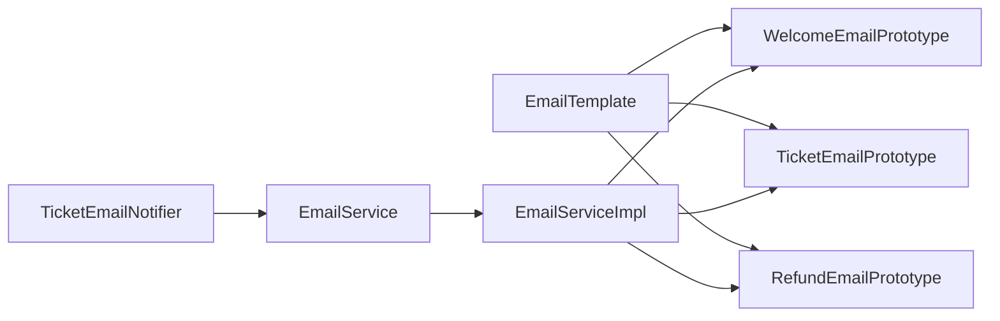

# Prototype Pattern

<cite>
**Referenced Files in This Document**
- [EmailTemplate.java](file://backend/src/main/java/com/cinema/booking/patterns/prototype/EmailTemplate.java)
- [TicketEmailPrototype.java](file://backend/src/main/java/com/cinema/booking/patterns/prototype/TicketEmailPrototype.java)
- [WelcomeEmailPrototype.java](file://backend/src/main/java/com/cinema/booking/patterns/prototype/WelcomeEmailPrototype.java)
- [RefundEmailPrototype.java](file://backend/src/main/java/com/cinema/booking/patterns/prototype/RefundEmailPrototype.java)
- [EmailServiceImpl.java](file://backend/src/main/java/com/cinema/booking/services/impl/EmailServiceImpl.java)
- [EmailService.java](file://backend/src/main/java/com/cinema/booking/services/EmailService.java)
- [TicketEmailNotifier.java](file://backend/src/main/java/com/cinema/booking/patterns/mediator/TicketEmailNotifier.java)
- [07-prototype.md](file://docs/patterns/07-prototype.md)
- [07-prototype.md](file://UML/pattern-only/07-prototype.md)
</cite>

## Table of Contents
1. [Introduction](#introduction)
2. [Project Structure](#project-structure)
3. [Core Components](#core-components)
4. [Architecture Overview](#architecture-overview)
5. [Detailed Component Analysis](#detailed-component-analysis)
6. [Dependency Analysis](#dependency-analysis)
7. [Performance Considerations](#performance-considerations)
8. [Troubleshooting Guide](#troubleshooting-guide)
9. [Conclusion](#conclusion)

## Introduction
This document explains the Prototype pattern implementation in the email template system. It demonstrates how reusable email templates are cloned and customized for different notification types (WelcomeEmailPrototype, TicketEmailPrototype, RefundEmailPrototype). The EmailTemplate interface defines the cloning contract, while concrete prototypes encapsulate fixed parts of email content and expose fluent setters to populate dynamic fields. The EmailServiceImpl service consumes these prototypes to build and send emails efficiently, avoiding repeated construction of static content and enabling flexible customization per scenario.

## Project Structure
The Prototype pattern resides under the backend patterns/prototype package and integrates with the email service layer and mediator components.

**Diagram sources**
- [EmailTemplate.java:1-16](file://backend/src/main/java/com/cinema/booking/patterns/prototype/EmailTemplate.java#L1-L16)
- [WelcomeEmailPrototype.java:1-41](file://backend/src/main/java/com/cinema/booking/patterns/prototype/WelcomeEmailPrototype.java#L1-L41)
- [TicketEmailPrototype.java:1-60](file://backend/src/main/java/com/cinema/booking/patterns/prototype/TicketEmailPrototype.java#L1-L60)
- [RefundEmailPrototype.java:1-50](file://backend/src/main/java/com/cinema/booking/patterns/prototype/RefundEmailPrototype.java#L1-L50)
- [EmailServiceImpl.java:1-98](file://backend/src/main/java/com/cinema/booking/services/impl/EmailServiceImpl.java#L1-L98)
- [EmailService.java:1-7](file://backend/src/main/java/com/cinema/booking/services/EmailService.java#L1-L7)
- [TicketEmailNotifier.java:1-28](file://backend/src/main/java/com/cinema/booking/patterns/mediator/TicketEmailNotifier.java#L1-L28)

**Section sources**
- [EmailTemplate.java:1-16](file://backend/src/main/java/com/cinema/booking/patterns/prototype/EmailTemplate.java#L1-L16)
- [EmailServiceImpl.java:1-98](file://backend/src/main/java/com/cinema/booking/services/impl/EmailServiceImpl.java#L1-L98)
- [TicketEmailNotifier.java:1-28](file://backend/src/main/java/com/cinema/booking/patterns/mediator/TicketEmailNotifier.java#L1-L28)

## Core Components
- EmailTemplate: Defines the cloning contract and the method to produce a ready-to-send SimpleMailMessage.
- Concrete Prototypes:
  - WelcomeEmailPrototype: Encapsulates a welcome email template with fields for recipient and full name.
  - TicketEmailPrototype: Encapsulates a ticket email template with fields for booking metadata and pricing.
  - RefundEmailPrototype: Encapsulates a refund email template with fields for refund amount and booking details.
- EmailServiceImpl: Consumes prototype instances to clone, populate, and send emails.
- EmailService: Declares email-sending operations used by mediator components.

Key responsibilities:
- Cloning: Each prototype implements copy() to create a new instance with current field values.
- Customization: Fluent setters populate dynamic fields before building the message.
- Message production: toMessage() constructs a SimpleMailMessage with subject, recipient, and body.

**Section sources**
- [EmailTemplate.java:9-15](file://backend/src/main/java/com/cinema/booking/patterns/prototype/EmailTemplate.java#L9-L15)
- [WelcomeEmailPrototype.java:10-40](file://backend/src/main/java/com/cinema/booking/patterns/prototype/WelcomeEmailPrototype.java#L10-L40)
- [TicketEmailPrototype.java:14-59](file://backend/src/main/java/com/cinema/booking/patterns/prototype/TicketEmailPrototype.java#L14-L59)
- [RefundEmailPrototype.java:13-49](file://backend/src/main/java/com/cinema/booking/patterns/prototype/RefundEmailPrototype.java#L13-L49)
- [EmailServiceImpl.java:21-98](file://backend/src/main/java/com/cinema/booking/services/impl/EmailServiceImpl.java#L21-L98)
- [EmailService.java:3-6](file://backend/src/main/java/com/cinema/booking/services/EmailService.java#L3-L6)

## Architecture Overview
The Prototype pattern decouples email content construction from business logic. Prototypes are managed as Spring-managed beans and cloned on demand. The EmailServiceImpl orchestrates cloning, population, and sending via JavaMailSender.

**Diagram sources**
- [EmailTemplate.java:9-15](file://backend/src/main/java/com/cinema/booking/patterns/prototype/EmailTemplate.java#L9-L15)
- [WelcomeEmailPrototype.java:10-40](file://backend/src/main/java/com/cinema/booking/patterns/prototype/WelcomeEmailPrototype.java#L10-L40)
- [TicketEmailPrototype.java:14-59](file://backend/src/main/java/com/cinema/booking/patterns/prototype/TicketEmailPrototype.java#L14-L59)
- [RefundEmailPrototype.java:13-49](file://backend/src/main/java/com/cinema/booking/patterns/prototype/RefundEmailPrototype.java#L13-L49)
- [EmailServiceImpl.java:21-98](file://backend/src/main/java/com/cinema/booking/services/impl/EmailServiceImpl.java#L21-L98)
- [EmailService.java:3-6](file://backend/src/main/java/com/cinema/booking/services/EmailService.java#L3-L6)
- [TicketEmailNotifier.java:9-27](file://backend/src/main/java/com/cinema/booking/patterns/mediator/TicketEmailNotifier.java#L9-L27)

## Detailed Component Analysis

### EmailTemplate Interface
- Purpose: Defines the cloning contract and message-building method.
- Methods:
  - copy(): Returns a new instance of the implementing prototype.
  - toMessage(): Produces a SimpleMailMessage after populating fields.

Implementation notes:
- Ensures immutability of the original prototype by cloning before population.
- Keeps email construction logic encapsulated within each prototype.

**Section sources**
- [EmailTemplate.java:9-15](file://backend/src/main/java/com/cinema/booking/patterns/prototype/EmailTemplate.java#L9-L15)

### WelcomeEmailPrototype
- Fields: recipient and full name.
- Cloning: copy() creates a new instance with current field values.
- Customization: Fluent setters populate recipient and name prior to message building.
- Message production: toMessage() sets subject and body using the provided fields.

Usage example:
- EmailServiceImpl invokes copy(), then fluent setters, then toMessage() to send a welcome email.

**Section sources**
- [WelcomeEmailPrototype.java:10-40](file://backend/src/main/java/com/cinema/booking/patterns/prototype/WelcomeEmailPrototype.java#L10-L40)
- [EmailServiceImpl.java:82-96](file://backend/src/main/java/com/cinema/booking/services/impl/EmailServiceImpl.java#L82-L96)

### TicketEmailPrototype
- Fields: recipient, booking ID, customer name, movie title, showtime, total amount.
- Cloning: copy() initializes a new instance with current field values.
- Customization: Fluent setters populate booking-specific data.
- Message production: toMessage() builds a structured ticket email.

Usage example:
- EmailServiceImpl fetches booking data, clones the prototype, populates fields, and sends the message.

**Section sources**
- [TicketEmailPrototype.java:14-59](file://backend/src/main/java/com/cinema/booking/patterns/prototype/TicketEmailPrototype.java#L14-L59)
- [EmailServiceImpl.java:40-80](file://backend/src/main/java/com/cinema/booking/services/impl/EmailServiceImpl.java#L40-L80)

### RefundEmailPrototype
- Fields: recipient, customer name, booking ID, refund amount.
- Cloning: copy() creates a new instance with current field values.
- Customization: Fluent setters populate refund-related data.
- Message production: toMessage() builds a refund confirmation email.

Note: This prototype is declared but not currently wired in EmailServiceImpl. It remains available for future refund notifications.

**Section sources**
- [RefundEmailPrototype.java:13-49](file://backend/src/main/java/com/cinema/booking/patterns/prototype/RefundEmailPrototype.java#L13-L49)

### EmailServiceImpl
- Responsibilities:
  - Injects prototype beans (TicketEmailPrototype, WelcomeEmailPrototype).
  - Clones prototypes, populates dynamic fields, and produces SimpleMailMessage.
  - Sends emails via JavaMailSender.
- Patterns:
  - Uses copy() to avoid mutating shared prototype instances.
  - Applies fluent setters to customize each clone before sending.

Example workflows:
- sendTicketEmail: Builds a ticket email from booking data and sends it.
- sendWelcomeEmail: Sends a welcome email to a registered user.

**Section sources**
- [EmailServiceImpl.java:21-98](file://backend/src/main/java/com/cinema/booking/services/impl/EmailServiceImpl.java#L21-L98)

### TicketEmailNotifier (Mediator Integration)
- Role: Delegates successful payment events to the email service.
- Interaction: Calls EmailService.sendTicketEmail, which internally uses the prototype.

**Section sources**
- [TicketEmailNotifier.java:9-27](file://backend/src/main/java/com/cinema/booking/patterns/mediator/TicketEmailNotifier.java#L9-L27)
- [EmailService.java:3-6](file://backend/src/main/java/com/cinema/booking/services/EmailService.java#L3-L6)

## Dependency Analysis
The prototype hierarchy and runtime dependencies are illustrated below.

**Diagram sources**
- [EmailTemplate.java:9-15](file://backend/src/main/java/com/cinema/booking/patterns/prototype/EmailTemplate.java#L9-L15)
- [WelcomeEmailPrototype.java:10-40](file://backend/src/main/java/com/cinema/booking/patterns/prototype/WelcomeEmailPrototype.java#L10-L40)
- [TicketEmailPrototype.java:14-59](file://backend/src/main/java/com/cinema/booking/patterns/prototype/TicketEmailPrototype.java#L14-L59)
- [RefundEmailPrototype.java:13-49](file://backend/src/main/java/com/cinema/booking/patterns/prototype/RefundEmailPrototype.java#L13-L49)
- [EmailServiceImpl.java:21-98](file://backend/src/main/java/com/cinema/booking/services/impl/EmailServiceImpl.java#L21-L98)
- [TicketEmailNotifier.java:9-27](file://backend/src/main/java/com/cinema/booking/patterns/mediator/TicketEmailNotifier.java#L9-L27)
- [EmailService.java:3-6](file://backend/src/main/java/com/cinema/booking/services/EmailService.java#L3-L6)

## Performance Considerations
- Reduced object creation overhead: Instead of constructing static email content repeatedly, prototypes are cloned once per email and reused across requests.
- Faster message building: Static content is pre-initialized in the prototype; only dynamic fields are set during cloning.
- Memory efficiency: Prototypes are Spring-managed singletons, minimizing memory footprint while allowing safe per-request cloning.

## Troubleshooting Guide
Common issues and resolutions:
- Null recipient or missing user account:
  - Symptom: Email not sent; error logged indicating missing email address.
  - Resolution: Ensure customer records include a valid email before invoking sendTicketEmail or sendWelcomeEmail.
- Exception during send:
  - Symptom: Error caught and logged when sending fails.
  - Resolution: Verify mail server configuration and credentials; confirm network connectivity.
- Prototype mutation concerns:
  - Symptom: Unexpected changes in email content across requests.
  - Resolution: Confirm that copy() is used before populating fields; avoid modifying prototype instances directly.

Operational checks:
- Successful send logs indicate proper cloning and message building.
- Use manual tests to validate email content and recipients.

**Section sources**
- [EmailServiceImpl.java:48-51](file://backend/src/main/java/com/cinema/booking/services/impl/EmailServiceImpl.java#L48-L51)
- [EmailServiceImpl.java:74-80](file://backend/src/main/java/com/cinema/booking/services/impl/EmailServiceImpl.java#L74-L80)
- [EmailServiceImpl.java:89-96](file://backend/src/main/java/com/cinema/booking/services/impl/EmailServiceImpl.java#L89-L96)

## Conclusion
The Prototype pattern in the email template system cleanly separates static email content from dynamic data, enabling efficient reuse and safe customization. By cloning prototypes and applying fluent setters, EmailServiceImpl constructs tailored messages without duplicating static content or risking prototype corruption. This design improves maintainability, testability, and performance, while supporting straightforward extension for new email types such as RefundEmailPrototype.