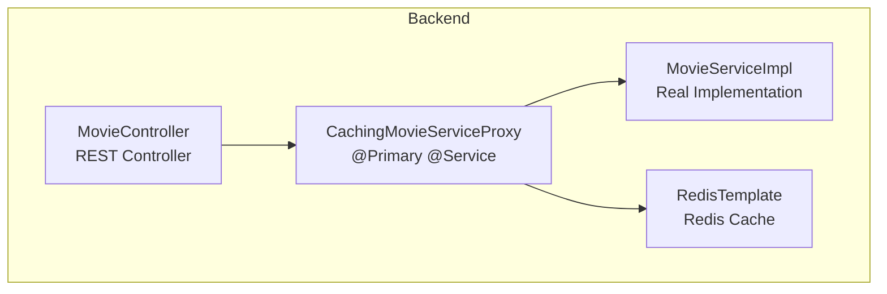
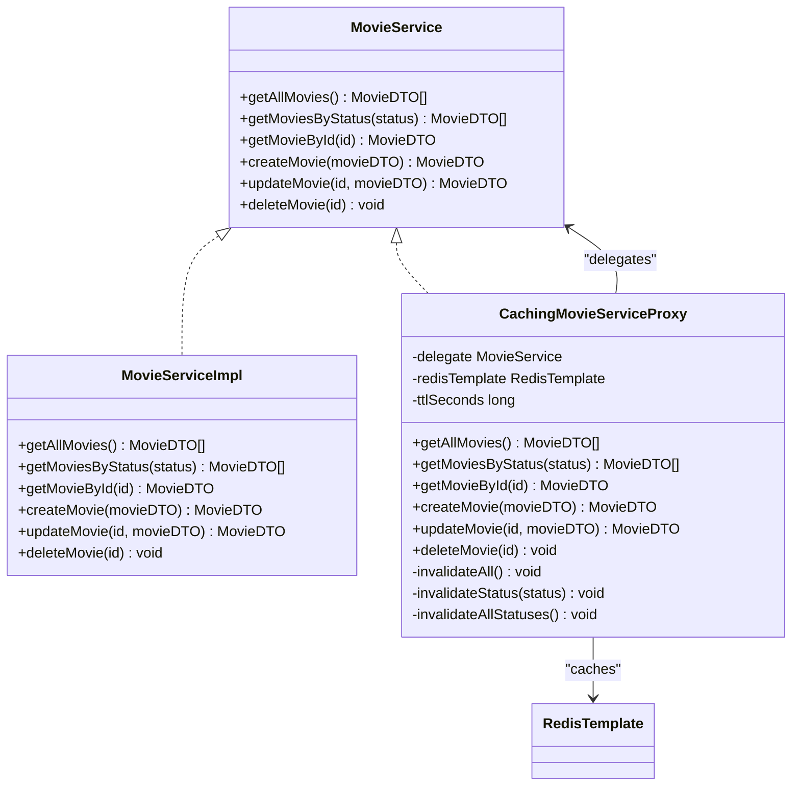
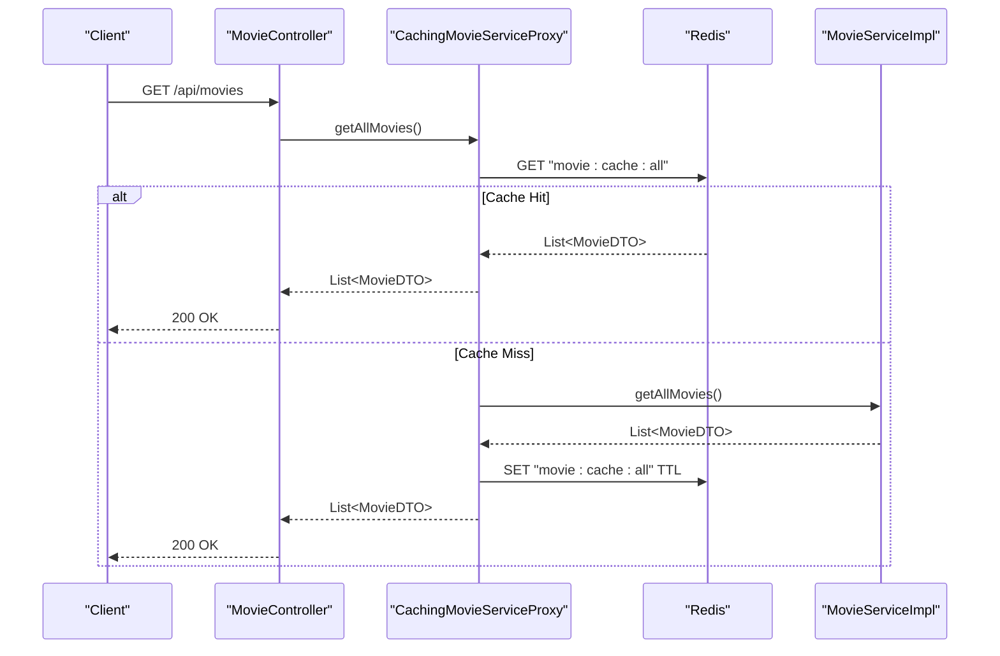
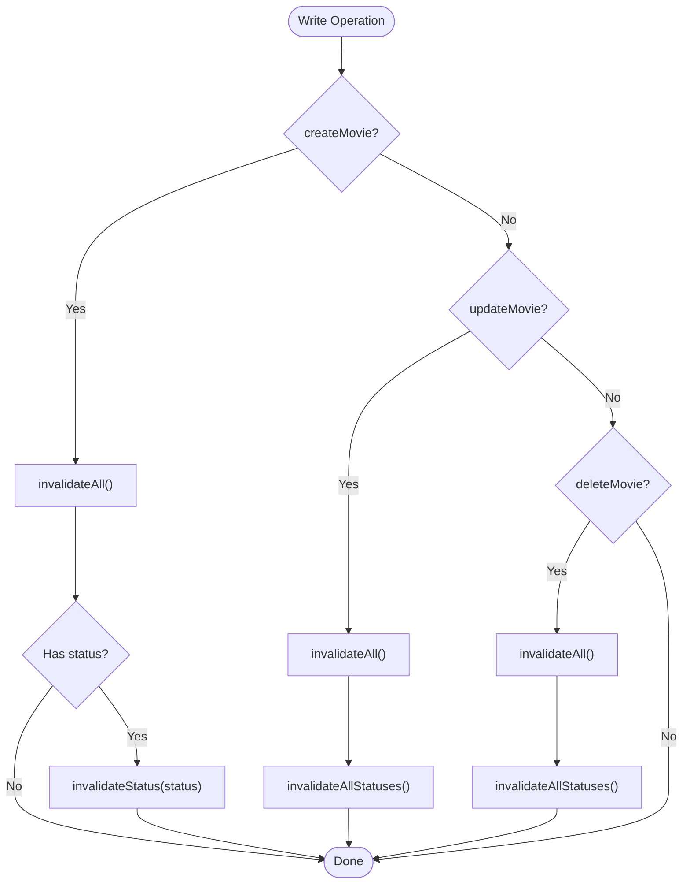
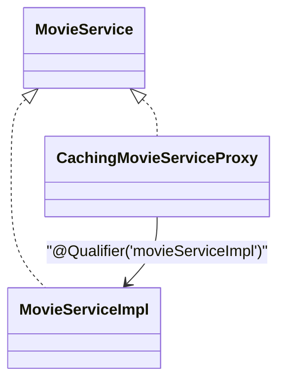
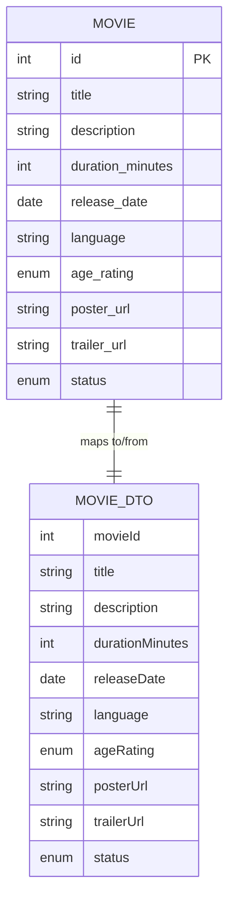
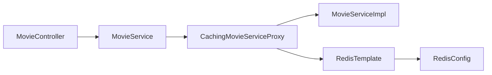

# Proxy Pattern

<cite>
**Referenced Files in This Document**
- [CachingMovieServiceProxy.java](file://backend/src/main/java/com/cinema/booking/patterns/proxy/CachingMovieServiceProxy.java)
- [MovieService.java](file://backend/src/main/java/com/cinema/booking/services/MovieService.java)
- [MovieServiceImpl.java](file://backend/src/main/java/com/cinema/booking/services/impl/MovieServiceImpl.java)
- [RedisConfig.java](file://backend/src/main/java/com/cinema/booking/config/RedisConfig.java)
- [MovieController.java](file://backend/src/main/java/com/cinema/booking/controllers/MovieController.java)
- [application.properties](file://backend/src/main/resources/application.properties)
- [Movie.java](file://backend/src/main/java/com/cinema/booking/entities/Movie.java)
- [MovieDTO.java](file://backend/src/main/java/com/cinema/booking/dtos/MovieDTO.java)
- [03-proxy.md](file://docs/patterns/03-proxy.md)
</cite>

## Table of Contents
1. [Introduction](#introduction)
2. [Project Structure](#project-structure)
3. [Core Components](#core-components)
4. [Architecture Overview](#architecture-overview)
5. [Detailed Component Analysis](#detailed-component-analysis)
6. [Dependency Analysis](#dependency-analysis)
7. [Performance Considerations](#performance-considerations)
8. [Troubleshooting Guide](#troubleshooting-guide)
9. [Conclusion](#conclusion)

## Introduction
This document explains the Proxy pattern implementation that adds transparent caching to the movie service. The goal is to improve performance and reduce database load by caching frequently accessed movie data in Redis while keeping the original MovieService interface unchanged. The proxy wraps the real MovieServiceImpl and intercepts read requests to serve cached data when available, and invalidates cache entries on write operations to maintain freshness.

## Project Structure
The caching enhancement is implemented as a Spring-managed service that acts as a proxy for MovieService. It delegates read operations to the real implementation and caches results in Redis. Write operations invalidate cache keys to ensure consistency.

**Diagram sources**
- [MovieController.java:14-63](file://backend/src/main/java/com/cinema/booking/controllers/MovieController.java#L14-L63)
- [CachingMovieServiceProxy.java:21-113](file://backend/src/main/java/com/cinema/booking/patterns/proxy/CachingMovieServiceProxy.java#L21-L113)
- [MovieServiceImpl.java:20-149](file://backend/src/main/java/com/cinema/booking/services/impl/MovieServiceImpl.java#L20-L149)
- [RedisConfig.java:31-53](file://backend/src/main/java/com/cinema/booking/config/RedisConfig.java#L31-L53)

**Section sources**
- [MovieController.java:14-63](file://backend/src/main/java/com/cinema/booking/controllers/MovieController.java#L14-L63)
- [CachingMovieServiceProxy.java:21-113](file://backend/src/main/java/com/cinema/booking/patterns/proxy/CachingMovieServiceProxy.java#L21-L113)
- [MovieServiceImpl.java:20-149](file://backend/src/main/java/com/cinema/booking/services/impl/MovieServiceImpl.java#L20-L149)
- [RedisConfig.java:31-53](file://backend/src/main/java/com/cinema/booking/config/RedisConfig.java#L31-L53)

## Core Components
- MovieService interface defines the contract for movie operations.
- MovieServiceImpl is the real implementation that queries the database.
- CachingMovieServiceProxy implements MovieService, adds Redis caching, and delegates read operations to the real implementation.
- RedisConfig configures Redis connectivity and serialization for cache storage.
- MovieController depends on MovieService and remains unaware of the proxy.

Key responsibilities:
- Transparent caching: Clients continue to inject MovieService without changes.
- Cache strategy: Full list cache and per-status caches with TTL.
- Cache invalidation: On create/update/delete, all affected cache keys are removed.

**Section sources**
- [MovieService.java:7-14](file://backend/src/main/java/com/cinema/booking/services/MovieService.java#L7-L14)
- [MovieServiceImpl.java:20-149](file://backend/src/main/java/com/cinema/booking/services/impl/MovieServiceImpl.java#L20-L149)
- [CachingMovieServiceProxy.java:21-113](file://backend/src/main/java/com/cinema/booking/patterns/proxy/CachingMovieServiceProxy.java#L21-L113)
- [RedisConfig.java:31-53](file://backend/src/main/java/com/cinema/booking/config/RedisConfig.java#L31-L53)
- [MovieController.java:19-20](file://backend/src/main/java/com/cinema/booking/controllers/MovieController.java#L19-L20)

## Architecture Overview
The proxy pattern enables a clean separation between the service interface and caching logic. The controller interacts with MovieService, which Spring resolves to CachingMovieServiceProxy due to @Primary. The proxy checks Redis for cached data; if absent, it delegates to MovieServiceImpl, stores the result in Redis, and returns it.

**Diagram sources**
- [MovieService.java:7-14](file://backend/src/main/java/com/cinema/booking/services/MovieService.java#L7-L14)
- [MovieServiceImpl.java:20-149](file://backend/src/main/java/com/cinema/booking/services/impl/MovieServiceImpl.java#L20-L149)
- [CachingMovieServiceProxy.java:21-113](file://backend/src/main/java/com/cinema/booking/patterns/proxy/CachingMovieServiceProxy.java#L21-L113)
- [RedisConfig.java:31-53](file://backend/src/main/java/com/cinema/booking/config/RedisConfig.java#L31-L53)

## Detailed Component Analysis

### CachingMovieServiceProxy
Responsibilities:
- Implements MovieService to act as a drop-in replacement.
- Reads cache keys for full list and per-status lists.
- Delegates read operations to MovieServiceImpl when cache misses.
- Stores results in Redis with TTL.
- Invalidates cache on write operations to keep data fresh.

Cache keys and TTL:
- Key pattern for full list: "movie:cache:all"
- Key pattern for status-specific lists: "movie:cache:status:{STATUS}"
- TTL configurable via property with default value.

Invalidation strategy:
- After create: invalidate full list and status-specific key if applicable.
- After update: invalidate full list and all status keys.
- After delete: invalidate full list and all status keys.

**Diagram sources**
- [MovieController.java:22-30](file://backend/src/main/java/com/cinema/booking/controllers/MovieController.java#L22-L30)
- [CachingMovieServiceProxy.java:40-50](file://backend/src/main/java/com/cinema/booking/patterns/proxy/CachingMovieServiceProxy.java#L40-L50)
- [MovieServiceImpl.java:109-112](file://backend/src/main/java/com/cinema/booking/services/impl/MovieServiceImpl.java#L109-L112)

**Section sources**
- [CachingMovieServiceProxy.java:21-113](file://backend/src/main/java/com/cinema/booking/patterns/proxy/CachingMovieServiceProxy.java#L21-L113)
- [application.properties:65](file://backend/src/main/resources/application.properties#L65)

### Cache Invalidation Flow
Write operations trigger cache invalidation to prevent serving stale data.

**Diagram sources**
- [CachingMovieServiceProxy.java:74-96](file://backend/src/main/java/com/cinema/booking/patterns/proxy/CachingMovieServiceProxy.java#L74-L96)
- [CachingMovieServiceProxy.java:100-112](file://backend/src/main/java/com/cinema/booking/patterns/proxy/CachingMovieServiceProxy.java#L100-L112)

**Section sources**
- [CachingMovieServiceProxy.java:74-96](file://backend/src/main/java/com/cinema/booking/patterns/proxy/CachingMovieServiceProxy.java#L74-L96)
- [CachingMovieServiceProxy.java:100-112](file://backend/src/main/java/com/cinema/booking/patterns/proxy/CachingMovieServiceProxy.java#L100-L112)

### Relationship Between MovieService and CachingMovieServiceProxy
- MovieService is the interface used by clients.
- CachingMovieServiceProxy implements MovieService and is marked @Primary, ensuring Spring injects it wherever MovieService is autowired.
- MovieServiceImpl remains the real implementation and is injected into the proxy via @Qualifier("movieServiceImpl").

**Diagram sources**
- [MovieService.java:7-14](file://backend/src/main/java/com/cinema/booking/services/MovieService.java#L7-L14)
- [MovieServiceImpl.java:20-149](file://backend/src/main/java/com/cinema/booking/services/impl/MovieServiceImpl.java#L20-L149)
- [CachingMovieServiceProxy.java:28-30](file://backend/src/main/java/com/cinema/booking/patterns/proxy/CachingMovieServiceProxy.java#L28-L30)

**Section sources**
- [MovieService.java:7-14](file://backend/src/main/java/com/cinema/booking/services/MovieService.java#L7-L14)
- [MovieServiceImpl.java:20](file://backend/src/main/java/com/cinema/booking/services/impl/MovieServiceImpl.java#L20)
- [CachingMovieServiceProxy.java:28-30](file://backend/src/main/java/com/cinema/booking/patterns/proxy/CachingMovieServiceProxy.java#L28-L30)

### Data Model Context
- Movie entity defines MovieStatus and AgeRating enums used by MovieDTO.
- MovieDTO carries the payload returned by MovieService methods.

**Diagram sources**
- [Movie.java:20-55](file://backend/src/main/java/com/cinema/booking/entities/Movie.java#L20-L55)
- [MovieDTO.java:14-37](file://backend/src/main/java/com/cinema/booking/dtos/MovieDTO.java#L14-L37)

**Section sources**
- [Movie.java:57-63](file://backend/src/main/java/com/cinema/booking/entities/Movie.java#L57-L63)
- [MovieDTO.java:14-37](file://backend/src/main/java/com/cinema/booking/dtos/MovieDTO.java#L14-L37)

## Dependency Analysis
- MovieController depends on MovieService (interface).
- Spring resolves MovieService to CachingMovieServiceProxy due to @Primary.
- CachingMovieServiceProxy depends on RedisTemplate and MovieServiceImpl (via @Qualifier).
- RedisTemplate is configured in RedisConfig with JSON serialization for values.

**Diagram sources**
- [MovieController.java:19-20](file://backend/src/main/java/com/cinema/booking/controllers/MovieController.java#L19-L20)
- [CachingMovieServiceProxy.java:28-33](file://backend/src/main/java/com/cinema/booking/patterns/proxy/CachingMovieServiceProxy.java#L28-L33)
- [RedisConfig.java:31-53](file://backend/src/main/java/com/cinema/booking/config/RedisConfig.java#L31-L53)

**Section sources**
- [MovieController.java:19-20](file://backend/src/main/java/com/cinema/booking/controllers/MovieController.java#L19-L20)
- [CachingMovieServiceProxy.java:28-33](file://backend/src/main/java/com/cinema/booking/patterns/proxy/CachingMovieServiceProxy.java#L28-L33)
- [RedisConfig.java:31-53](file://backend/src/main/java/com/cinema/booking/config/RedisConfig.java#L31-L53)

## Performance Considerations
- Cache hit scenario: First request populates Redis; subsequent requests return cached data with minimal latency.
- Cache miss scenario: Proxy queries the database, caches the result, and serves it.
- Invalidation overhead: Write operations incur cache deletion but ensure data freshness.
- TTL tuning: Adjust redisTtlSeconds to balance memory usage and hit rates.

[No sources needed since this section provides general guidance]

## Troubleshooting Guide
Common issues and resolutions:
- Cache not applied: Verify @Primary annotation on the proxy and absence of multiple MovieService beans.
- Stale data: Confirm invalidation logic runs on create/update/delete.
- Serialization errors: Ensure RedisTemplate uses compatible serializers for complex DTOs.
- Configuration: Check Redis host/port/credentials and TTL property in application properties.

**Section sources**
- [CachingMovieServiceProxy.java:21](file://backend/src/main/java/com/cinema/booking/patterns/proxy/CachingMovieServiceProxy.java#L21)
- [application.properties:61-65](file://backend/src/main/resources/application.properties#L61-L65)
- [RedisConfig.java:40-52](file://backend/src/main/java/com/cinema/booking/config/RedisConfig.java#L40-L52)

## Conclusion
The Proxy pattern with Redis caching provides transparent performance improvements for the movie service. By implementing MovieService and marking it @Primary, the proxy replaces the real implementation without changing client code. Cache keys and TTL are managed centrally, and invalidation ensures data consistency on writes. This approach aligns with SOLID principles, maintaining separation of concerns and enabling easy extension (e.g., adding logging or rate limiting proxies).