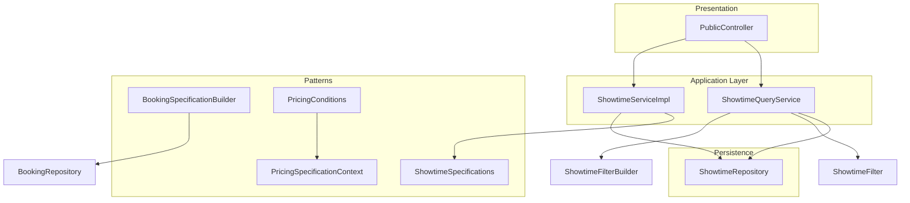
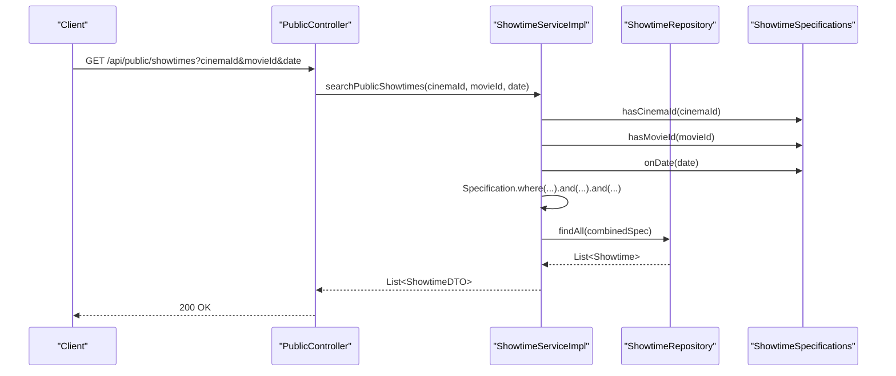
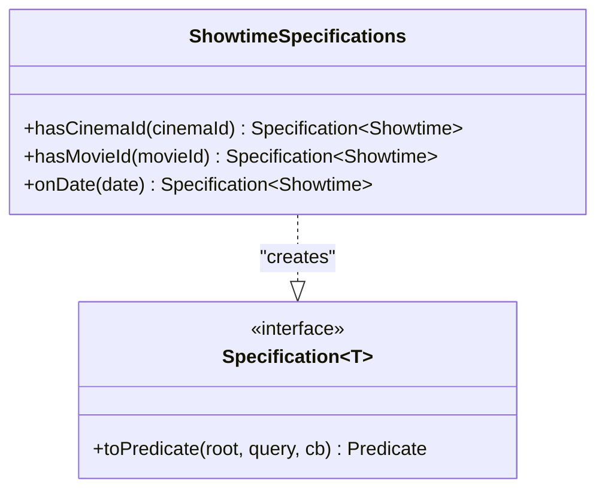
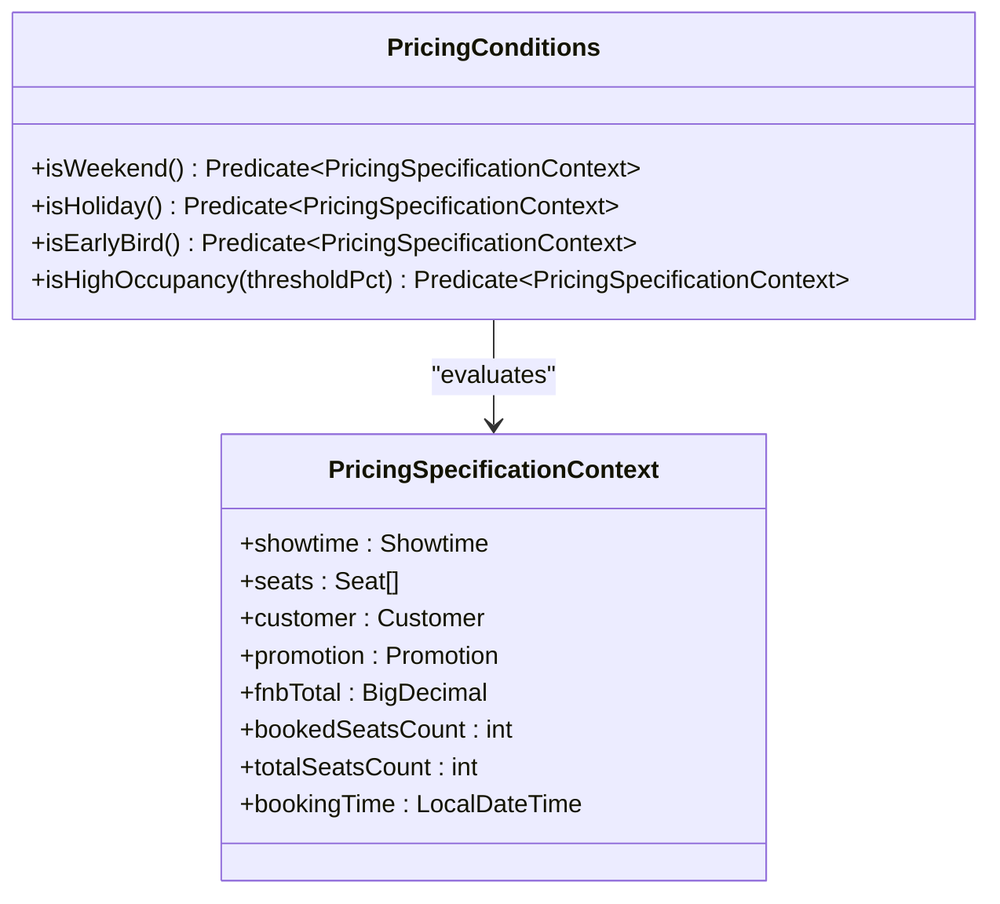
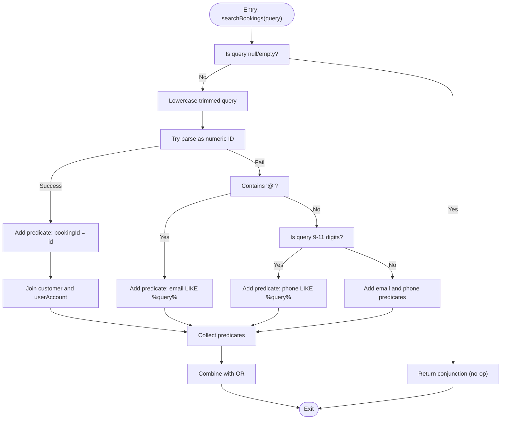
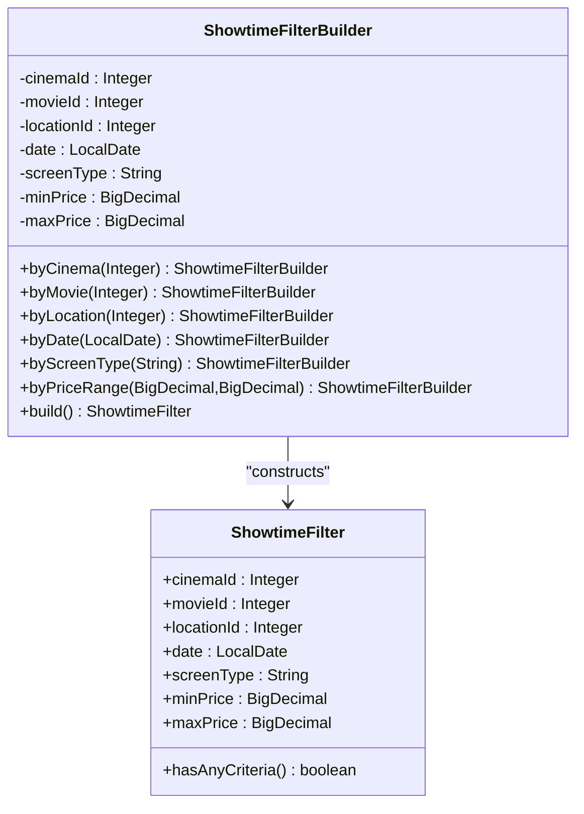
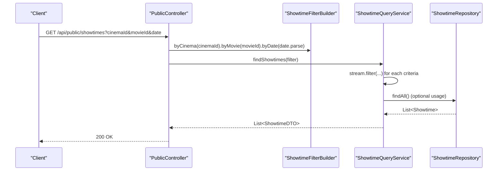
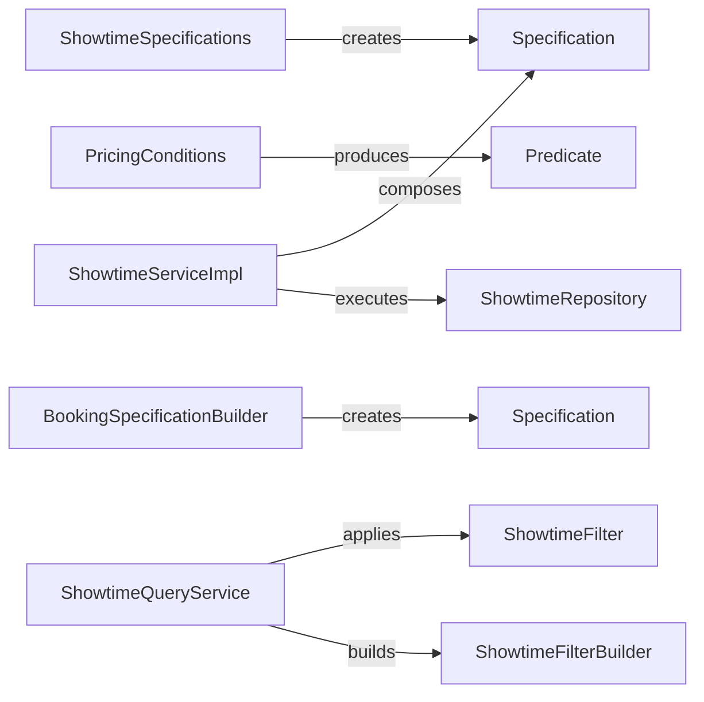

# Specification Pattern

<cite>
**Referenced Files in This Document**
- [ShowtimeSpecifications.java](file://backend/src/main/java/com/cinema/booking/patterns/specification/ShowtimeSpecifications.java)
- [PricingConditions.java](file://backend/src/main/java/com/cinema/booking/patterns/specification/PricingConditions.java)
- [PricingSpecificationContext.java](file://backend/src/main/java/com/cinema/booking/patterns/specification/PricingSpecificationContext.java)
- [BookingSpecificationBuilder.java](file://backend/src/main/java/com/cinema/booking/patterns/specification/BookingSpecificationBuilder.java)
- [ShowtimeServiceImpl.java](file://backend/src/main/java/com/cinema/booking/services/impl/ShowtimeServiceImpl.java)
- [ShowtimeFilter.java](file://backend/src/main/java/com/cinema/booking/services/builder/filter/ShowtimeFilter.java)
- [ShowtimeFilterBuilder.java](file://backend/src/main/java/com/cinema/booking/services/builder/filter/ShowtimeFilterBuilder.java)
- [ShowtimeQueryService.java](file://backend/src/main/java/com/cinema/booking/services/builder/filter/ShowtimeQueryService.java)
- [PublicController.java](file://backend/src/main/java/com/cinema/booking/controllers/PublicController.java)
- [PricingConditionsTest.java](file://backend/src/test/java/com/cinema/booking/patterns/specification/PricingConditionsTest.java)
- [04-specification.md](file://docs/patterns/04-specification.md)
- [04-specification.md](file://UML/pattern-only/04-specification.md)
</cite>

## Table of Contents
1. [Introduction](#introduction)
2. [Project Structure](#project-structure)
3. [Core Components](#core-components)
4. [Architecture Overview](#architecture-overview)
5. [Detailed Component Analysis](#detailed-component-analysis)
6. [Dependency Analysis](#dependency-analysis)
7. [Performance Considerations](#performance-considerations)
8. [Troubleshooting Guide](#troubleshooting-guide)
9. [Conclusion](#conclusion)

## Introduction
This document explains the Specification pattern implementation used for flexible, composable query building in the system. It focuses on how reusable specifications enable dynamic filtering of showtimes and other entities without hardcoding SQL or bloating service methods with conditional branches. The pattern separates individual conditions into small, testable units and combines them using logical operators (AND, OR, NOT) to construct complex queries at runtime.

## Project Structure
The Specification pattern is implemented across several layers:
- Patterns: reusable specification builders and predicate factories
- Services: orchestrate specification composition and repository execution
- Controllers: expose public endpoints that delegate to services
- Tests: validate predicate logic independently from persistence

**Diagram sources**
- [PublicController.java:94-108](file://backend/src/main/java/com/cinema/booking/controllers/PublicController.java#L94-L108)
- [ShowtimeServiceImpl.java:115-124](file://backend/src/main/java/com/cinema/booking/services/impl/ShowtimeServiceImpl.java#L115-L124)
- [ShowtimeQueryService.java:33-81](file://backend/src/main/java/com/cinema/booking/services/builder/filter/ShowtimeQueryService.java#L33-L81)
- [ShowtimeSpecifications.java:14-52](file://backend/src/main/java/com/cinema/booking/patterns/specification/ShowtimeSpecifications.java#L14-L52)
- [BookingSpecificationBuilder.java:9-47](file://backend/src/main/java/com/cinema/booking/patterns/specification/BookingSpecificationBuilder.java#L9-L47)
- [PricingConditions.java:18-87](file://backend/src/main/java/com/cinema/booking/patterns/specification/PricingConditions.java#L18-L87)
- [PricingSpecificationContext.java:20-37](file://backend/src/main/java/com/cinema/booking/patterns/specification/PricingSpecificationContext.java#L20-L37)

**Section sources**
- [04-specification.md:39-46](file://docs/patterns/04-specification.md#L39-L46)

## Core Components
- ShowtimeSpecifications: static factory of JPA Specification<Showtime> predicates for filtering by cinema, movie, and date.
- PricingConditions: static factory of Predicate<PricingSpecificationContext> predicates for pricing logic (weekend, holiday, early bird, high occupancy).
- PricingSpecificationContext: immutable value object carrying runtime context for pricing predicates.
- BookingSpecificationBuilder: builds Specification<Booking> for flexible booking search across IDs, emails, and phone numbers.
- ShowtimeFilter and ShowtimeFilterBuilder: immutable filter product and fluent builder for constructing complex showtime filters.
- ShowtimeQueryService: applies filter criteria using Java Stream after loading all records (complementary to JPA Specification usage elsewhere).
- PublicController: exposes endpoints that construct filters and delegate to services.

Key benefits:
- Reusability: each condition is a standalone, composable unit.
- Testability: predicates and specifications are unit-testable.
- Maintainability: adding new filters requires new methods, not SQL refactors.

**Section sources**
- [ShowtimeSpecifications.java:14-52](file://backend/src/main/java/com/cinema/booking/patterns/specification/ShowtimeSpecifications.java#L14-L52)
- [PricingConditions.java:18-87](file://backend/src/main/java/com/cinema/booking/patterns/specification/PricingConditions.java#L18-L87)
- [PricingSpecificationContext.java:20-37](file://backend/src/main/java/com/cinema/booking/patterns/specification/PricingSpecificationContext.java#L20-L37)
- [BookingSpecificationBuilder.java:9-47](file://backend/src/main/java/com/cinema/booking/patterns/specification/BookingSpecificationBuilder.java#L9-L47)
- [ShowtimeFilter.java:12-41](file://backend/src/main/java/com/cinema/booking/services/builder/filter/ShowtimeFilter.java#L12-L41)
- [ShowtimeFilterBuilder.java:17-62](file://backend/src/main/java/com/cinema/booking/services/builder/filter/ShowtimeFilterBuilder.java#L17-L62)
- [ShowtimeQueryService.java:20-81](file://backend/src/main/java/com/cinema/booking/services/builder/filter/ShowtimeQueryService.java#L20-L81)
- [PublicController.java:94-135](file://backend/src/main/java/com/cinema/booking/controllers/PublicController.java#L94-L135)

## Architecture Overview
The Specification pattern integrates with Spring Data JPA’s JpaSpecificationExecutor to dynamically build Criteria-based queries. The service composes multiple specifications using and(), or(), and negate() to form complex filters. For showtimes, the service constructs a Specification from ShowtimeSpecifications and executes it against the repository. For bookings, a similar Specification is built by BookingSpecificationBuilder.

**Diagram sources**
- [PublicController.java:94-108](file://backend/src/main/java/com/cinema/booking/controllers/PublicController.java#L94-L108)
- [ShowtimeServiceImpl.java:115-124](file://backend/src/main/java/com/cinema/booking/services/impl/ShowtimeServiceImpl.java#L115-L124)
- [ShowtimeSpecifications.java:21-51](file://backend/src/main/java/com/cinema/booking/patterns/specification/ShowtimeSpecifications.java#L21-L51)

## Detailed Component Analysis

### ShowtimeSpecifications
- Purpose: Provide reusable JPA Specification<Showtime> predicates.
- Conditions:
  - hasCinemaId(Integer): filters by cinema via Showtime.room.cinema.cinemaId.
  - hasMovieId(Integer): filters by movie via Showtime.movie.movieId.
  - onDate(LocalDate): filters by date range [start of day, start of next day).
- Null handling: Returns a neutral conjunction when input is null, enabling optional filters.

**Diagram sources**
- [ShowtimeSpecifications.java:14-52](file://backend/src/main/java/com/cinema/booking/patterns/specification/ShowtimeSpecifications.java#L14-L52)

**Section sources**
- [ShowtimeSpecifications.java:14-52](file://backend/src/main/java/com/cinema/booking/patterns/specification/ShowtimeSpecifications.java#L14-L52)

### PricingConditions and PricingSpecificationContext
- Purpose: Encapsulate pricing-related business rules as pure Predicate functions over an immutable context object.
- Context fields: showtime, seats, customer, promotion, fnbTotal, bookedSeatsCount, totalSeatsCount, bookingTime.
- Predicates:
  - isWeekend(): true if showtime falls on Saturday or Sunday.
  - isHoliday(): true if showtime date matches predefined Vietnamese holidays.
  - isEarlyBird(): true if booking is made at least N days before showtime.
  - isHighOccupancy(thresholdPct): true if occupancy percentage exceeds threshold; guards against division by zero.

**Diagram sources**
- [PricingConditions.java:18-87](file://backend/src/main/java/com/cinema/booking/patterns/specification/PricingConditions.java#L18-L87)
- [PricingSpecificationContext.java:20-37](file://backend/src/main/java/com/cinema/booking/patterns/specification/PricingSpecificationContext.java#L20-L37)

**Section sources**
- [PricingConditions.java:18-87](file://backend/src/main/java/com/cinema/booking/patterns/specification/PricingConditions.java#L18-L87)
- [PricingSpecificationContext.java:20-37](file://backend/src/main/java/com/cinema/booking/patterns/specification/PricingSpecificationContext.java#L20-L37)

### BookingSpecificationBuilder
- Purpose: Build a Specification<Booking> that supports flexible search across booking identifiers, customer email, and phone numbers.
- Behavior:
  - If query is numeric and looks like an ID, match by bookingId.
  - If query contains "@", match by customer email (lowercase).
  - Else, treat as generic search and add predicates for email and phone number.
  - Returns a disjunction of collected predicates.

**Diagram sources**
- [BookingSpecificationBuilder.java:11-46](file://backend/src/main/java/com/cinema/booking/patterns/specification/BookingSpecificationBuilder.java#L11-L46)

**Section sources**
- [BookingSpecificationBuilder.java:9-47](file://backend/src/main/java/com/cinema/booking/patterns/specification/BookingSpecificationBuilder.java#L9-L47)

### ShowtimeFilter and ShowtimeFilterBuilder
- Purpose: Immutable filter product and fluent builder for constructing complex showtime filters.
- Builder methods:
  - byCinema(Integer), byMovie(Integer), byLocation(Integer), byDate(LocalDate), byScreenType(String), byPriceRange(BigDecimal, BigDecimal).
- Filter fields include cinemaId, movieId, locationId, date, screenType, minPrice, maxPrice.
- ShowtimeQueryService applies these filters using Java Stream after loading all showtimes.

**Diagram sources**
- [ShowtimeFilterBuilder.java:17-62](file://backend/src/main/java/com/cinema/booking/services/builder/filter/ShowtimeFilterBuilder.java#L17-L62)
- [ShowtimeFilter.java:12-41](file://backend/src/main/java/com/cinema/booking/services/builder/filter/ShowtimeFilter.java#L12-L41)

**Section sources**
- [ShowtimeFilterBuilder.java:17-62](file://backend/src/main/java/com/cinema/booking/services/builder/filter/ShowtimeFilterBuilder.java#L17-L62)
- [ShowtimeFilter.java:12-41](file://backend/src/main/java/com/cinema/booking/services/builder/filter/ShowtimeFilter.java#L12-L41)
- [ShowtimeQueryService.java:20-81](file://backend/src/main/java/com/cinema/booking/services/builder/filter/ShowtimeQueryService.java#L20-L81)

### Service Composition and Controller Integration
- ShowtimeServiceImpl.searchPublicShowtimes demonstrates composing three ShowtimeSpecifications using Specification.where(...).and(...).and(...) and executing via JpaSpecificationExecutor.
- PublicController exposes two endpoints:
  - GET /api/public/showtimes: basic filter support using ShowtimeFilterBuilder.
  - GET /api/public/showtimes/filter: extended filter support including locationId, screenType, and price range.

**Diagram sources**
- [PublicController.java:94-108](file://backend/src/main/java/com/cinema/booking/controllers/PublicController.java#L94-L108)
- [ShowtimeQueryService.java:33-81](file://backend/src/main/java/com/cinema/booking/services/builder/filter/ShowtimeQueryService.java#L33-L81)

**Section sources**
- [ShowtimeServiceImpl.java:115-124](file://backend/src/main/java/com/cinema/booking/services/impl/ShowtimeServiceImpl.java#L115-L124)
- [PublicController.java:94-135](file://backend/src/main/java/com/cinema/booking/controllers/PublicController.java#L94-L135)

## Dependency Analysis
- ShowtimeSpecifications depends on JPA CriteriaBuilder to produce Specification<Showtime>.
- ShowtimeServiceImpl composes specifications and delegates to ShowtimeRepository (JpaSpecificationExecutor).
- PricingConditions operates independently of persistence using PricingSpecificationContext.
- BookingSpecificationBuilder produces Specification<Booking> for search scenarios.
- ShowtimeQueryService uses ShowtimeFilter and ShowtimeFilterBuilder to construct filter criteria applied via Java Stream.

**Diagram sources**
- [ShowtimeSpecifications.java:14-52](file://backend/src/main/java/com/cinema/booking/patterns/specification/ShowtimeSpecifications.java#L14-L52)
- [PricingConditions.java:18-87](file://backend/src/main/java/com/cinema/booking/patterns/specification/PricingConditions.java#L18-L87)
- [BookingSpecificationBuilder.java:9-47](file://backend/src/main/java/com/cinema/booking/patterns/specification/BookingSpecificationBuilder.java#L9-L47)
- [ShowtimeServiceImpl.java:115-124](file://backend/src/main/java/com/cinema/booking/services/impl/ShowtimeServiceImpl.java#L115-L124)
- [ShowtimeQueryService.java:20-81](file://backend/src/main/java/com/cinema/booking/services/builder/filter/ShowtimeQueryService.java#L20-L81)
- [ShowtimeFilterBuilder.java:17-62](file://backend/src/main/java/com/cinema/booking/services/builder/filter/ShowtimeFilterBuilder.java#L17-L62)
- [ShowtimeFilter.java:12-41](file://backend/src/main/java/com/cinema/booking/services/builder/filter/ShowtimeFilter.java#L12-L41)

**Section sources**
- [ShowtimeServiceImpl.java:115-124](file://backend/src/main/java/com/cinema/booking/services/impl/ShowtimeServiceImpl.java#L115-L124)
- [ShowtimeQueryService.java:20-81](file://backend/src/main/java/com/cinema/booking/services/builder/filter/ShowtimeQueryService.java#L20-L81)

## Performance Considerations
- JPA Specification composition translates to a single SQL query with joined conditions; ensure proper indexing on foreign keys and frequently filtered columns (e.g., startTime, movieId, cinemaId).
- Avoid unnecessary joins inside specifications if filters are optional; the current implementation returns a neutral conjunction for null inputs, which helps keep generated SQL lean.
- For large datasets, prefer pagination and limit result sets at the controller/service level.
- Streaming post-load filtering (as in ShowtimeQueryService) can be expensive; consider migrating to JPA Specifications for complex filters to leverage database-side filtering.

## Troubleshooting Guide
Common issues and resolutions:
- Empty or null filters: Specifications return a neutral conjunction, so ensure callers pass valid inputs or handle nulls explicitly.
- Incorrect date boundaries: onDate uses [start of day, start of next day), ensuring inclusive date matching.
- Division by zero in predicates: isHighOccupancy guards against totalSeatsCount = 0.
- Testing predicates: PricingConditionsTest demonstrates unit testing of predicates with minimal context objects.

**Section sources**
- [ShowtimeSpecifications.java:41-51](file://backend/src/main/java/com/cinema/booking/patterns/specification/ShowtimeSpecifications.java#L41-L51)
- [PricingConditions.java:80-86](file://backend/src/main/java/com/cinema/booking/patterns/specification/PricingConditions.java#L80-L86)
- [PricingConditionsTest.java:84-103](file://backend/src/test/java/com/cinema/booking/patterns/specification/PricingConditionsTest.java#L84-L103)

## Conclusion
The Specification pattern enables a clean, composable, and testable approach to query building. By encapsulating each condition as a reusable specification and combining them with logical operators, the system avoids SQL string concatenation, reduces maintenance overhead, and improves readability. The pattern is consistently applied across showtime filtering, booking search, and pricing logic, demonstrating its versatility and scalability.