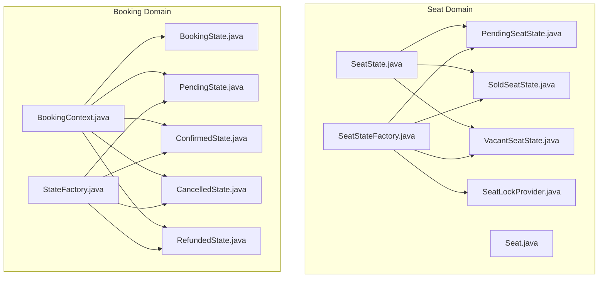
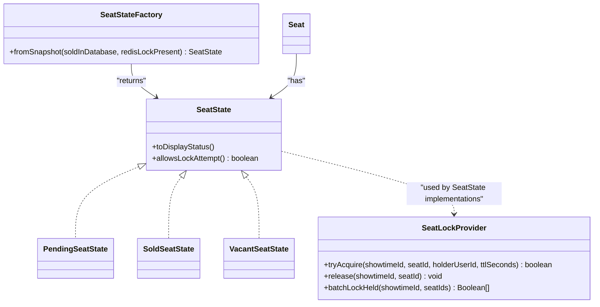
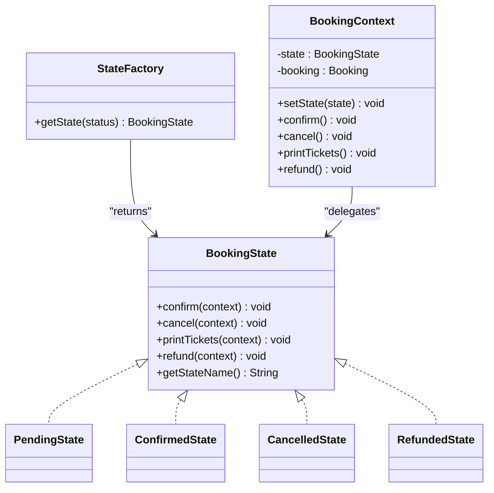
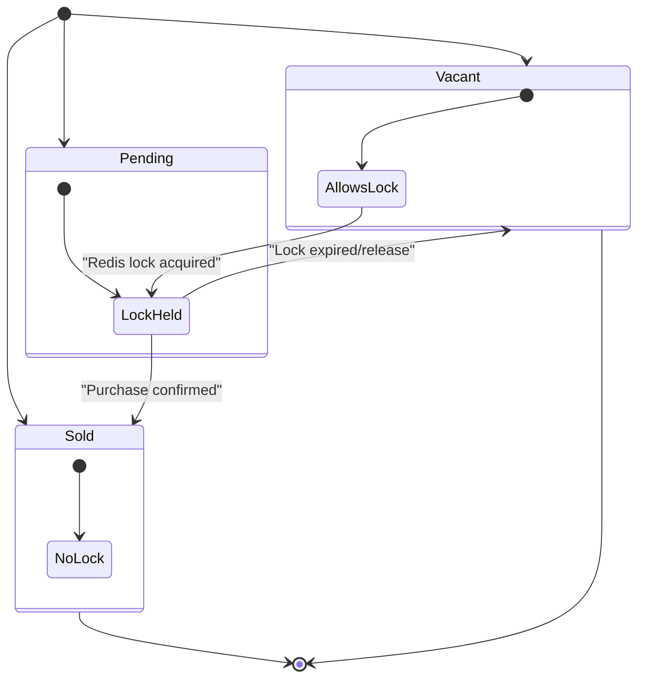
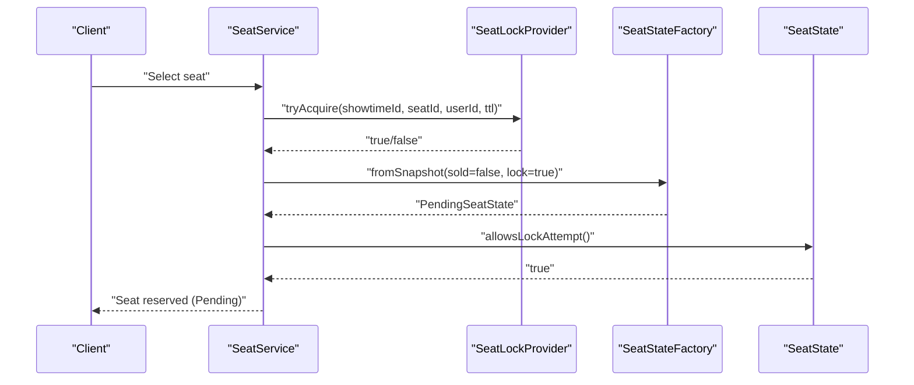
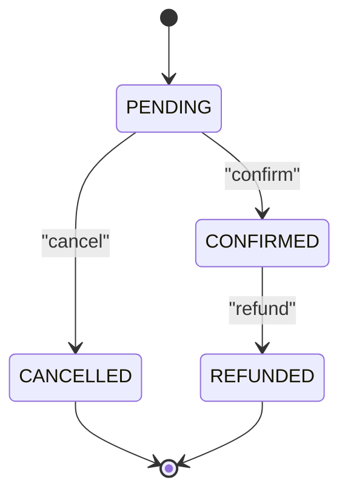
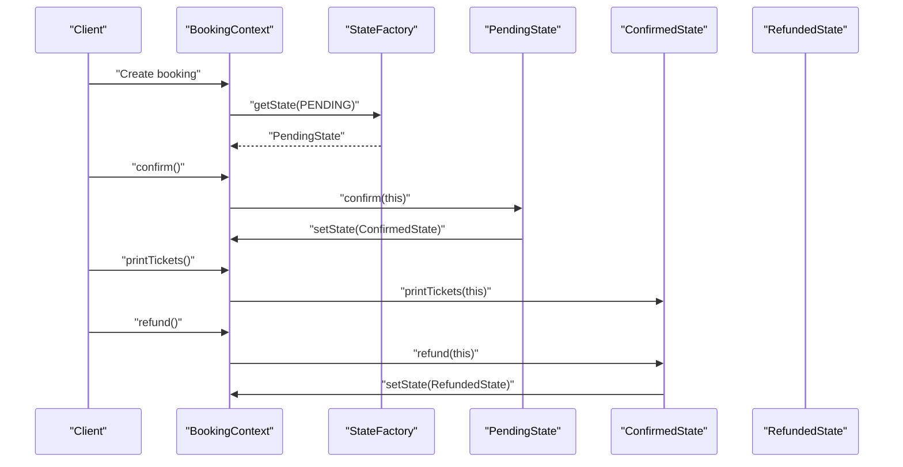
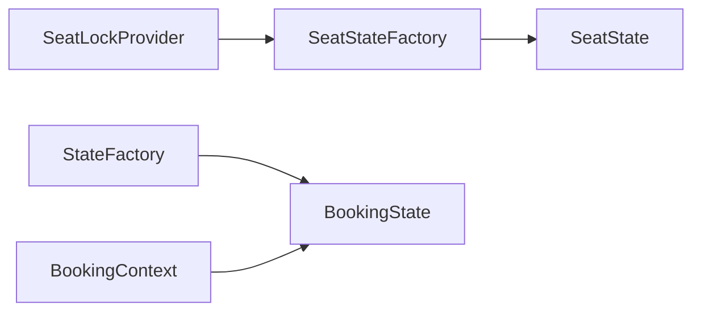

# State Pattern

<cite>
**Referenced Files in This Document**
- [SeatState.java](file://backend/src/main/java/com/cinema/booking/domain/seat/SeatState.java)
- [PendingSeatState.java](file://backend/src/main/java/com/cinema/booking/domain/seat/PendingSeatState.java)
- [SoldSeatState.java](file://backend/src/main/java/com/cinema/booking/domain/seat/SoldSeatState.java)
- [VacantSeatState.java](file://backend/src/main/java/com/cinema/booking/domain/seat/VacantSeatState.java)
- [SeatStateFactory.java](file://backend/src/main/java/com/cinema/booking/domain/seat/SeatStateFactory.java)
- [SeatLockProvider.java](file://backend/src/main/java/com/cinema/booking/services/seatlock/SeatLockProvider.java)
- [Seat.java](file://backend/src/main/java/com/cinema/booking/entities/Seat.java)
- [BookingState.java](file://backend/src/main/java/com/cinema/booking/patterns/state/BookingState.java)
- [BookingContext.java](file://backend/src/main/java/com/cinema/booking/patterns/state/BookingContext.java)
- [PendingState.java](file://backend/src/main/java/com/cinema/booking/patterns/state/PendingState.java)
- [ConfirmedState.java](file://backend/src/main/java/com/cinema/booking/patterns/state/ConfirmedState.java)
- [CancelledState.java](file://backend/src/main/java/com/cinema/booking/patterns/state/CancelledState.java)
- [RefundedState.java](file://backend/src/main/java/com/cinema/booking/patterns/state/RefundedState.java)
- [StateFactory.java](file://backend/src/main/java/com/cinema/booking/patterns/state/StateFactory.java)
</cite>

## Table of Contents
1. [Introduction](#introduction)
2. [Project Structure](#project-structure)
3. [Core Components](#core-components)
4. [Architecture Overview](#architecture-overview)
5. [Detailed Component Analysis](#detailed-component-analysis)
6. [Dependency Analysis](#dependency-analysis)
7. [Performance Considerations](#performance-considerations)
8. [Troubleshooting Guide](#troubleshooting-guide)
9. [Conclusion](#conclusion)

## Introduction
This document explains the State pattern implementation for seat and booking state management in the cinema booking system. It focuses on how the pattern encapsulates state-specific behavior and simplifies state transition logic for:
- Seats: PendingSeatState, SoldSeatState, VacantSeatState with a SeatStateFactory
- Bookings: BookingContext coordinating state transitions via BookingState implementations

We present state machine diagrams, sequence diagrams, and detailed analyses of the interfaces, concrete states, and factories. Practical examples illustrate seat state transitions during booking, payment, and cancellation processes.

## Project Structure
The State pattern spans two domains:
- Seat state management under domain/seat
- Booking state management under patterns/state

**Diagram sources**
- [SeatState.java:1-18](file://backend/src/main/java/com/cinema/booking/domain/seat/SeatState.java#L1-L18)
- [PendingSeatState.java:1-22](file://backend/src/main/java/com/cinema/booking/domain/seat/PendingSeatState.java#L1-L22)
- [SoldSeatState.java:1-22](file://backend/src/main/java/com/cinema/booking/domain/seat/SoldSeatState.java#L1-L22)
- [VacantSeatState.java:1-22](file://backend/src/main/java/com/cinema/booking/domain/seat/VacantSeatState.java#L1-L22)
- [SeatStateFactory.java:1-21](file://backend/src/main/java/com/cinema/booking/domain/seat/SeatStateFactory.java#L1-L21)
- [SeatLockProvider.java:1-19](file://backend/src/main/java/com/cinema/booking/services/seatlock/SeatLockProvider.java#L1-L19)
- [Seat.java:1-34](file://backend/src/main/java/com/cinema/booking/entities/Seat.java#L1-L34)
- [BookingState.java:1-12](file://backend/src/main/java/com/cinema/booking/patterns/state/BookingState.java#L1-L12)
- [BookingContext.java:1-38](file://backend/src/main/java/com/cinema/booking/patterns/state/BookingContext.java#L1-L38)
- [PendingState.java:1-30](file://backend/src/main/java/com/cinema/booking/patterns/state/PendingState.java#L1-L30)
- [ConfirmedState.java:1-31](file://backend/src/main/java/com/cinema/booking/patterns/state/ConfirmedState.java#L1-L31)
- [CancelledState.java:1-30](file://backend/src/main/java/com/cinema/booking/patterns/state/CancelledState.java#L1-L30)
- [RefundedState.java:1-30](file://backend/src/main/java/com/cinema/booking/patterns/state/RefundedState.java#L1-L30)
- [StateFactory.java:1-17](file://backend/src/main/java/com/cinema/booking/patterns/state/StateFactory.java#L1-L17)

**Section sources**
- [SeatState.java:1-18](file://backend/src/main/java/com/cinema/booking/domain/seat/SeatState.java#L1-L18)
- [SeatStateFactory.java:1-21](file://backend/src/main/java/com/cinema/booking/domain/seat/SeatStateFactory.java#L1-L21)
- [BookingContext.java:1-38](file://backend/src/main/java/com/cinema/booking/patterns/state/BookingContext.java#L1-L38)
- [StateFactory.java:1-17](file://backend/src/main/java/com/cinema/booking/patterns/state/StateFactory.java#L1-L17)

## Core Components
- Seat state interface and implementations define seat display status and whether a lock attempt is allowed.
- SeatStateFactory constructs the appropriate seat state from database and Redis lock snapshots.
- BookingContext coordinates booking lifecycle actions and delegates to concrete BookingState implementations.
- StateFactory maps persistence status to concrete booking states.

Key responsibilities:
- Seat domain: encapsulate seat availability semantics and lock eligibility.
- Booking domain: encapsulate booking lifecycle transitions and guard invalid operations.

**Section sources**
- [SeatState.java:8-17](file://backend/src/main/java/com/cinema/booking/domain/seat/SeatState.java#L8-L17)
- [PendingSeatState.java:12-20](file://backend/src/main/java/com/cinema/booking/domain/seat/PendingSeatState.java#L12-L20)
- [SoldSeatState.java:12-19](file://backend/src/main/java/com/cinema/booking/domain/seat/SoldSeatState.java#L12-L19)
- [VacantSeatState.java:12-19](file://backend/src/main/java/com/cinema/booking/domain/seat/VacantSeatState.java#L12-L19)
- [SeatStateFactory.java:11-19](file://backend/src/main/java/com/cinema/booking/domain/seat/SeatStateFactory.java#L11-L19)
- [BookingState.java:3-11](file://backend/src/main/java/com/cinema/booking/patterns/state/BookingState.java#L3-L11)
- [BookingContext.java:7-37](file://backend/src/main/java/com/cinema/booking/patterns/state/BookingContext.java#L7-L37)
- [StateFactory.java:6-15](file://backend/src/main/java/com/cinema/booking/patterns/state/StateFactory.java#L6-L15)

## Architecture Overview
The State pattern separates state-specific behavior from the objects themselves. Seat and booking contexts hold a current state object and delegate operations to it, enabling polymorphic transitions and clear guards against invalid state changes.

**Diagram sources**
- [SeatState.java:8-17](file://backend/src/main/java/com/cinema/booking/domain/seat/SeatState.java#L8-L17)
- [PendingSeatState.java:5-21](file://backend/src/main/java/com/cinema/booking/domain/seat/PendingSeatState.java#L5-L21)
- [SoldSeatState.java:5-21](file://backend/src/main/java/com/cinema/booking/domain/seat/SoldSeatState.java#L5-L21)
- [VacantSeatState.java:5-21](file://backend/src/main/java/com/cinema/booking/domain/seat/VacantSeatState.java#L5-L21)
- [SeatStateFactory.java:6-20](file://backend/src/main/java/com/cinema/booking/domain/seat/SeatStateFactory.java#L6-L20)
- [SeatLockProvider.java:8-18](file://backend/src/main/java/com/cinema/booking/services/seatlock/SeatLockProvider.java#L8-L18)
- [Seat.java:12-32](file://backend/src/main/java/com/cinema/booking/entities/Seat.java#L12-L32)

**Diagram sources**
- [BookingState.java:3-11](file://backend/src/main/java/com/cinema/booking/patterns/state/BookingState.java#L3-L11)
- [PendingState.java:3-29](file://backend/src/main/java/com/cinema/booking/patterns/state/PendingState.java#L3-L29)
- [ConfirmedState.java:3-30](file://backend/src/main/java/com/cinema/booking/patterns/state/ConfirmedState.java#L3-L30)
- [CancelledState.java:3-29](file://backend/src/main/java/com/cinema/booking/patterns/state/CancelledState.java#L3-L29)
- [RefundedState.java:3-29](file://backend/src/main/java/com/cinema/booking/patterns/state/RefundedState.java#L3-L29)
- [StateFactory.java:5-16](file://backend/src/main/java/com/cinema/booking/patterns/state/StateFactory.java#L5-L16)
- [BookingContext.java:7-37](file://backend/src/main/java/com/cinema/booking/patterns/state/BookingContext.java#L7-L37)

## Detailed Component Analysis

### Seat State Management
Seat state encapsulates:
- Display status mapping for UI rendering
- Lock eligibility to prevent concurrent acquisition on sold seats

SeatStateFactory constructs the correct state based on:
- Database flag indicating sold status
- Presence of a Redis lock indicating pending reservation

**Diagram sources**
- [SeatStateFactory.java:11-19](file://backend/src/main/java/com/cinema/booking/domain/seat/SeatStateFactory.java#L11-L19)
- [PendingSeatState.java:12-20](file://backend/src/main/java/com/cinema/booking/domain/seat/PendingSeatState.java#L12-L20)
- [SoldSeatState.java:12-19](file://backend/src/main/java/com/cinema/booking/domain/seat/SoldSeatState.java#L12-L19)
- [VacantSeatState.java:12-19](file://backend/src/main/java/com/cinema/booking/domain/seat/VacantSeatState.java#L12-L19)

Concrete examples of seat state transitions:
- Booking initiation: a seat transitions from Vacant to Pending when a lock attempt succeeds via the seat lock provider.
- Purchase completion: a seat transitions from Pending to Sold after successful payment and ticket creation.
- Expiration or cancellation: a seat transitions from Pending back to Vacant when the lock is released or expires.

**Diagram sources**
- [SeatLockProvider.java:10-17](file://backend/src/main/java/com/cinema/booking/services/seatlock/SeatLockProvider.java#L10-L17)
- [SeatStateFactory.java:11-19](file://backend/src/main/java/com/cinema/booking/domain/seat/SeatStateFactory.java#L11-L19)
- [PendingSeatState.java:18-20](file://backend/src/main/java/com/cinema/booking/domain/seat/PendingSeatState.java#L18-L20)

**Section sources**
- [SeatState.java:10-16](file://backend/src/main/java/com/cinema/booking/domain/seat/SeatState.java#L10-L16)
- [SeatStateFactory.java:11-19](file://backend/src/main/java/com/cinema/booking/domain/seat/SeatStateFactory.java#L11-L19)
- [SeatLockProvider.java:10-17](file://backend/src/main/java/com/cinema/booking/services/seatlock/SeatLockProvider.java#L10-L17)

### Booking State Management
BookingContext holds a BookingState and delegates lifecycle actions. StateFactory initializes the state from the booking’s persisted status.

**Diagram sources**
- [BookingContext.java:13-20](file://backend/src/main/java/com/cinema/booking/patterns/state/BookingContext.java#L13-L20)
- [StateFactory.java:6-15](file://backend/src/main/java/com/cinema/booking/patterns/state/StateFactory.java#L6-L15)
- [PendingState.java:6-13](file://backend/src/main/java/com/cinema/booking/patterns/state/PendingState.java#L6-L13)
- [ConfirmedState.java:22-24](file://backend/src/main/java/com/cinema/booking/patterns/state/ConfirmedState.java#L22-L24)
- [CancelledState.java:11-13](file://backend/src/main/java/com/cinema/booking/patterns/state/CancelledState.java#L11-L13)
- [RefundedState.java:21-23](file://backend/src/main/java/com/cinema/booking/patterns/state/RefundedState.java#L21-L23)

Sequence of a typical booking lifecycle:
- Creation: BookingContext initialized with PENDING state.
- Payment confirmation: confirm transitions to CONFIRMED.
- Ticket printing: allowed only in CONFIRMED.
- Refund process: refund transitions to REFUNDED.

**Diagram sources**
- [BookingContext.java:13-36](file://backend/src/main/java/com/cinema/booking/patterns/state/BookingContext.java#L13-L36)
- [StateFactory.java:6-15](file://backend/src/main/java/com/cinema/booking/patterns/state/StateFactory.java#L6-L15)
- [PendingState.java:6-8](file://backend/src/main/java/com/cinema/booking/patterns/state/PendingState.java#L6-L8)
- [ConfirmedState.java:16-24](file://backend/src/main/java/com/cinema/booking/patterns/state/ConfirmedState.java#L16-L24)
- [RefundedState.java:20-24](file://backend/src/main/java/com/cinema/booking/patterns/state/RefundedState.java#L20-L24)

**Section sources**
- [BookingContext.java:13-20](file://backend/src/main/java/com/cinema/booking/patterns/state/BookingContext.java#L13-L20)
- [StateFactory.java:6-15](file://backend/src/main/java/com/cinema/booking/patterns/state/StateFactory.java#L6-L15)
- [PendingState.java:6-23](file://backend/src/main/java/com/cinema/booking/patterns/state/PendingState.java#L6-L23)
- [ConfirmedState.java:16-24](file://backend/src/main/java/com/cinema/booking/patterns/state/ConfirmedState.java#L16-L24)
- [RefundedState.java:20-23](file://backend/src/main/java/com/cinema/booking/patterns/state/RefundedState.java#L20-L23)

## Dependency Analysis
Seat and booking state management exhibit low coupling and high cohesion:
- Seat domain depends on SeatStateFactory and SeatLockProvider to decide state and lock eligibility.
- Booking domain depends on StateFactory and BookingState implementations to enforce lifecycle transitions.

Potential circular dependencies:
- None observed between seat and booking state modules.

External dependencies:
- Redis-backed seat locking via SeatLockProvider influences seat state transitions.

**Diagram sources**
- [SeatLockProvider.java:10-17](file://backend/src/main/java/com/cinema/booking/services/seatlock/SeatLockProvider.java#L10-L17)
- [SeatStateFactory.java:11-19](file://backend/src/main/java/com/cinema/booking/domain/seat/SeatStateFactory.java#L11-L19)
- [StateFactory.java:6-15](file://backend/src/main/java/com/cinema/booking/patterns/state/StateFactory.java#L6-L15)
- [BookingContext.java:13-20](file://backend/src/main/java/com/cinema/booking/patterns/state/BookingContext.java#L13-L20)

**Section sources**
- [SeatStateFactory.java:11-19](file://backend/src/main/java/com/cinema/booking/domain/seat/SeatStateFactory.java#L11-L19)
- [StateFactory.java:6-15](file://backend/src/main/java/com/cinema/booking/patterns/state/StateFactory.java#L6-L15)
- [BookingContext.java:13-20](file://backend/src/main/java/com/cinema/booking/patterns/state/BookingContext.java#L13-L20)

## Performance Considerations
- Seat state resolution is O(1) via factory branching.
- Batch lock checks reduce round trips when validating seat availability.
- Booking state transitions are constant-time operations that delegate to concrete states.

Recommendations:
- Cache frequently accessed seat states per showtime to minimize factory invocations.
- Use asynchronous lock release to avoid blocking transaction commits.

## Troubleshooting Guide
Common issues and resolutions:
- Attempting to lock a sold seat: SoldSeatState disallows lock attempts; verify payment and ticket creation outcomes.
- Printing tickets from unconfirmed booking: PendingState throws an exception; ensure confirm() is invoked after payment.
- Refunding unconfirmed booking: PendingState throws an exception; ensure confirm() precedes refund().
- Cancelling confirmed booking: ConfirmedState forbids normal cancellation; initiate refund() instead.

**Section sources**
- [SoldSeatState.java:17-19](file://backend/src/main/java/com/cinema/booking/domain/seat/SoldSeatState.java#L17-L19)
- [PendingState.java:16-23](file://backend/src/main/java/com/cinema/booking/patterns/state/PendingState.java#L16-L23)
- [ConfirmedState.java:10-13](file://backend/src/main/java/com/cinema/booking/patterns/state/ConfirmedState.java#L10-L13)

## Conclusion
The State pattern cleanly separates seat and booking state logic, enabling:
- Clear state machine diagrams and explicit transitions
- Guarded operations preventing illegal state changes
- Encapsulation of display and lock behaviors for seats
- Lifecycle management for bookings with consistent status synchronization

This design improves maintainability, readability, and robustness of state-dependent workflows.