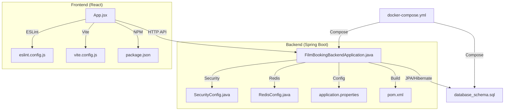
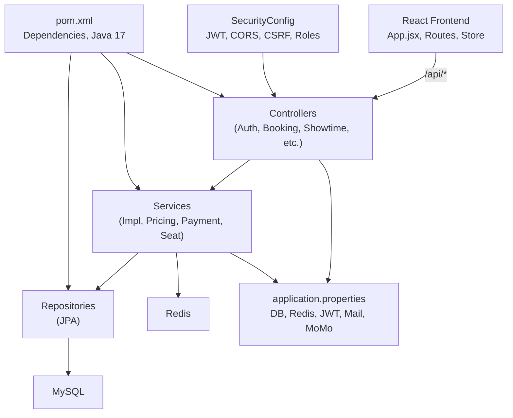
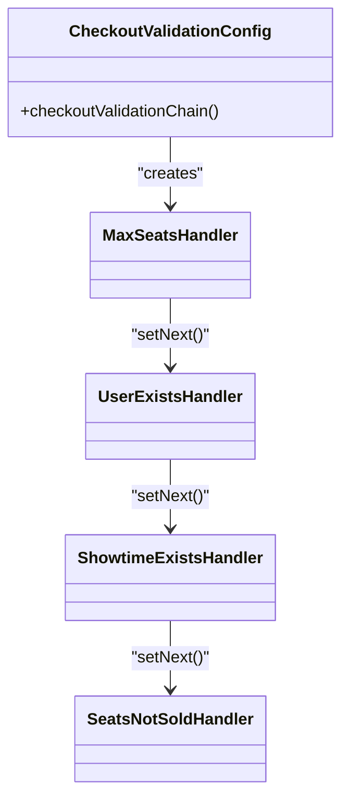
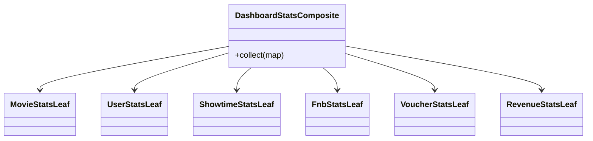
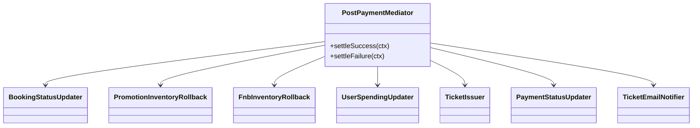
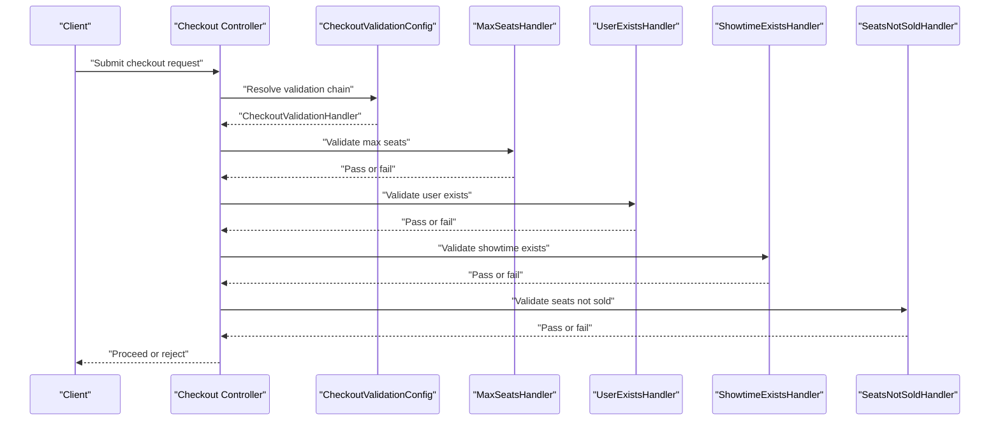
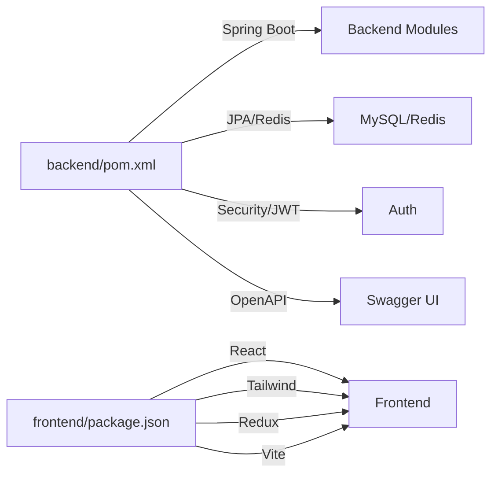

# Development Guidelines

<cite>
**Referenced Files in This Document**
- [README.md](file://README.md)
- [HUONG_DAN_CHAY_DU_AN.md](file://HUONG_DAN_CHAY_DU_AN.md)
- [FilmBookingBackendApplication.java](file://backend/src/main/java/com/cinema/booking/FilmBookingBackendApplication.java)
- [application.properties](file://backend/src/main/resources/application.properties)
- [SecurityConfig.java](file://backend/src/main/java/com/cinema/booking/config/SecurityConfig.java)
- [RedisConfig.java](file://backend/src/main/java/com/cinema/booking/config/RedisConfig.java)
- [AuthService.java](file://backend/src/main/java/com/cinema/booking/services/AuthService.java)
- [CheckoutValidationConfig.java](file://backend/src/main/java/com/cinema/booking/patterns/chainofresponsibility/CheckoutValidationConfig.java)
- [DashboardStatsComposite.java](file://backend/src/main/java/com/cinema/booking/patterns/composite/DashboardStatsComposite.java)
- [PostPaymentMediator.java](file://backend/src/main/java/com/cinema/booking/patterns/mediator/PostPaymentMediator.java)
- [App.jsx](file://frontend/src/App.jsx)
- [eslint.config.js](file://frontend/eslint.config.js)
- [vite.config.js](file://frontend/vite.config.js)
- [package.json](file://frontend/package.json)
- [pom.xml](file://backend/pom.xml)
- [database_schema.sql](file://database_schema.sql)
- [docker-compose.yml](file://docker-compose.yml)
</cite>

## Table of Contents
1. [Introduction](#introduction)
2. [Project Structure](#project-structure)
3. [Core Components](#core-components)
4. [Architecture Overview](#architecture-overview)
5. [Detailed Component Analysis](#detailed-component-analysis)
6. [Dependency Analysis](#dependency-analysis)
7. [Performance Considerations](#performance-considerations)
8. [Troubleshooting Guide](#troubleshooting-guide)
9. [Conclusion](#conclusion)
10. [Appendices](#appendices)

## Introduction
This document provides comprehensive development guidelines for contributors working on the cinema booking system. It covers code style and standards for Java (Spring Boot) and JavaScript/React, Git workflow, pull request procedures, architectural patterns, database schema changes, debugging and profiling, performance optimization, security best practices, testing requirements, documentation standards, and release procedures.

## Project Structure
The project is a full-stack application with:
- Backend: Spring Boot application with layered architecture (controllers, services, repositories, DTOs/entities, configurations, patterns).
- Frontend: React application with routing, Redux Toolkit slices, and service modules.
- Shared assets: UML/design pattern documents, ERD/sql schema, Docker compose, and run scripts.

**Diagram sources**
- [FilmBookingBackendApplication.java:1-14](file://backend/src/main/java/com/cinema/booking/FilmBookingBackendApplication.java#L1-L14)
- [SecurityConfig.java:1-82](file://backend/src/main/java/com/cinema/booking/config/SecurityConfig.java#L1-L82)
- [RedisConfig.java:1-55](file://backend/src/main/java/com/cinema/booking/config/RedisConfig.java#L1-L55)
- [application.properties:1-97](file://backend/src/main/resources/application.properties#L1-L97)
- [pom.xml:1-108](file://backend/pom.xml#L1-L108)
- [App.jsx:1-84](file://frontend/src/App.jsx#L1-L84)
- [eslint.config.js:1-30](file://frontend/eslint.config.js#L1-L30)
- [vite.config.js:1-15](file://frontend/vite.config.js#L1-L15)
- [package.json:1-39](file://frontend/package.json#L1-L39)
- [database_schema.sql](file://database_schema.sql)
- [docker-compose.yml](file://docker-compose.yml)

**Section sources**
- [README.md:1-197](file://README.md#L1-L197)
- [HUONG_DAN_CHAY_DU_AN.md:1-79](file://HUONG_DAN_CHAY_DU_AN.md#L1-L79)

## Core Components
- Backend entry point and application bootstrap.
- Security configuration with JWT, CORS, CSRF disabled, and method-level security.
- Redis configuration for caching and seat locking.
- Frontend routing and layout composition.
- Build and linting configuration for React.

Key implementation references:
- Application bootstrap: [FilmBookingBackendApplication.java:1-14](file://backend/src/main/java/com/cinema/booking/FilmBookingBackendApplication.java#L1-L14)
- Security filter chain and role-based endpoints: [SecurityConfig.java:50-79](file://backend/src/main/java/com/cinema/booking/config/SecurityConfig.java#L50-L79)
- Redis template and JSON serialization: [RedisConfig.java:40-53](file://backend/src/main/java/com/cinema/booking/config/RedisConfig.java#L40-L53)
- Frontend routing and nested layouts: [App.jsx:38-81](file://frontend/src/App.jsx#L38-L81)
- ESLint flat config: [eslint.config.js:7-29](file://frontend/eslint.config.js#L7-L29)
- Vite plugin configuration: [vite.config.js:6-14](file://frontend/vite.config.js#L6-L14)
- Backend dependencies and Java version: [pom.xml:15-17](file://backend/pom.xml#L15-L17), [pom.xml:18-89](file://backend/pom.xml#L18-L89)

**Section sources**
- [FilmBookingBackendApplication.java:1-14](file://backend/src/main/java/com/cinema/booking/FilmBookingBackendApplication.java#L1-L14)
- [SecurityConfig.java:1-82](file://backend/src/main/java/com/cinema/booking/config/SecurityConfig.java#L1-L82)
- [RedisConfig.java:1-55](file://backend/src/main/java/com/cinema/booking/config/RedisConfig.java#L1-L55)
- [App.jsx:1-84](file://frontend/src/App.jsx#L1-L84)
- [eslint.config.js:1-30](file://frontend/eslint.config.js#L1-L30)
- [vite.config.js:1-15](file://frontend/vite.config.js#L1-L15)
- [pom.xml:1-108](file://backend/pom.xml#L1-L108)

## Architecture Overview
The system follows a layered backend architecture with Spring Boot and a React frontend. It integrates Redis for real-time seat locking and caching, and MySQL for persistence. Security is enforced via JWT with stateless sessions and method-level authorization. The frontend uses React Router for navigation and Redux Toolkit for state.

**Diagram sources**
- [App.jsx:38-81](file://frontend/src/App.jsx#L38-L81)
- [SecurityConfig.java:50-79](file://backend/src/main/java/com/cinema/booking/config/SecurityConfig.java#L50-L79)
- [application.properties:1-97](file://backend/src/main/resources/application.properties#L1-L97)
- [pom.xml:1-108](file://backend/pom.xml#L1-L108)

## Detailed Component Analysis

### Java Coding Standards (Spring Boot)
- Package naming: Use reverse domain style under a single root package.
- Layer separation: Keep controllers thin; delegate to services; encapsulate persistence in repositories.
- Validation: Prefer method-level validation and DTOs for request payloads.
- Logging: Use structured logging and avoid verbose print statements; rely on framework logs.
- Configuration: Externalize secrets and environment-specific properties via environment variables.
- Security: Stateless JWT, permissive CORS only for trusted origins, CSRF disabled for SPA, method-level roles.
- Testing: Add unit tests for services and integration tests for controllers; keep tests isolated and deterministic.

References:
- Application bootstrap: [FilmBookingBackendApplication.java:1-14](file://backend/src/main/java/com/cinema/booking/FilmBookingBackendApplication.java#L1-L14)
- Security configuration: [SecurityConfig.java:24-79](file://backend/src/main/java/com/cinema/booking/config/SecurityConfig.java#L24-L79)
- Redis configuration: [RedisConfig.java:16-53](file://backend/src/main/java/com/cinema/booking/config/RedisConfig.java#L16-L53)
- Properties: [application.properties:1-97](file://backend/src/main/resources/application.properties#L1-L97)
- Dependencies: [pom.xml:15-17](file://backend/pom.xml#L15-L17), [pom.xml:18-89](file://backend/pom.xml#L18-L89)

**Section sources**
- [SecurityConfig.java:1-82](file://backend/src/main/java/com/cinema/booking/config/SecurityConfig.java#L1-L82)
- [RedisConfig.java:1-55](file://backend/src/main/java/com/cinema/booking/config/RedisConfig.java#L1-L55)
- [application.properties:1-97](file://backend/src/main/resources/application.properties#L1-L97)
- [pom.xml:1-108](file://backend/pom.xml#L1-L108)

### JavaScript/React Coding Standards
- File naming: PascalCase for components, kebab-case for hooks/use*, camelCase for utilities.
- ESLint: Use flat config with recommended rules; enforce no-unused-vars with exceptions for constants.
- React: Keep components functional; use hooks for side effects; separate concerns into services and slices.
- Routing: Define nested routes with layouts; export route groups for clarity.
- Styling: Tailwind CSS via Vite plugin; maintain consistent spacing and color tokens.

References:
- Routing and layouts: [App.jsx:38-81](file://frontend/src/App.jsx#L38-L81)
- ESLint configuration: [eslint.config.js:7-29](file://frontend/eslint.config.js#L7-L29)
- Vite plugins: [vite.config.js:6-14](file://frontend/vite.config.js#L6-L14)
- Dependencies: [package.json:12-38](file://frontend/package.json#L12-L38)

**Section sources**
- [App.jsx:1-84](file://frontend/src/App.jsx#L1-L84)
- [eslint.config.js:1-30](file://frontend/eslint.config.js#L1-L30)
- [vite.config.js:1-15](file://frontend/vite.config.js#L1-L15)
- [package.json:1-39](file://frontend/package.json#L1-L39)

### Design Pattern Implementation Guidelines
- Chain of Responsibility: Validation pipeline for checkout; order-sensitive handlers; configure chain in a dedicated configuration class.
- Composite: Dashboard statistics aggregation; composite collects from leaf components.
- Mediator: Post-payment orchestration; colleagues coordinate success/failure steps in a fixed order.
- Proxy: Caching movie service proxy to reduce load.
- Specification: Query building and pricing conditions; reusable specifications.
- Strategy/Decorator: Pricing engine with strategies and decorators for discounts.

**Diagram sources**
- [CheckoutValidationConfig.java:1-23](file://backend/src/main/java/com/cinema/booking/patterns/chainofresponsibility/CheckoutValidationConfig.java#L1-L23)

**Diagram sources**
- [DashboardStatsComposite.java:1-44](file://backend/src/main/java/com/cinema/booking/patterns/composite/DashboardStatsComposite.java#L1-L44)

**Diagram sources**
- [PostPaymentMediator.java:1-47](file://backend/src/main/java/com/cinema/booking/patterns/mediator/PostPaymentMediator.java#L1-L47)

**Section sources**
- [CheckoutValidationConfig.java:1-23](file://backend/src/main/java/com/cinema/booking/patterns/chainofresponsibility/CheckoutValidationConfig.java#L1-L23)
- [DashboardStatsComposite.java:1-44](file://backend/src/main/java/com/cinema/booking/patterns/composite/DashboardStatsComposite.java#L1-L44)
- [PostPaymentMediator.java:1-47](file://backend/src/main/java/com/cinema/booking/patterns/mediator/PostPaymentMediator.java#L1-L47)

### API Workflow Example: Checkout Validation Chain

**Diagram sources**
- [CheckoutValidationConfig.java:9-21](file://backend/src/main/java/com/cinema/booking/patterns/chainofresponsibility/CheckoutValidationConfig.java#L9-L21)

### Database Schema Changes
- Use migrations or controlled DDL updates; keep schema aligned with entities.
- Apply schema and seed data via provided SQL script before running locally.
- Maintain referential integrity; ensure indexes for high-traffic joins.

References:
- Schema definition: [database_schema.sql](file://database_schema.sql)

**Section sources**
- [database_schema.sql](file://database_schema.sql)

### Git Workflow and Pull Request Procedures
- Branching strategy: Feature branches from develop; merge via pull requests.
- Commit hygiene: Atomic commits, clear messages; reference issues.
- PR checklist: Tests pass, code reviewed, documentation updated, no secrets committed.
- Merge: Squash or rebase; ensure CI passes and code coverage acceptable.

[No sources needed since this section provides general guidance]

### Debugging Techniques and Profiling
- Backend: Enable SQL logging and format SQL for readability; inspect Redis keys TTL and lock status; verify JWT token claims and expiration.
- Frontend: Use React DevTools; monitor network tab for API errors; check console for ESLint warnings.
- Profiling: Use JVM profilers for hotspots; measure Redis latency; analyze frontend bundle sizes.

References:
- SQL logging: [application.properties:17-19](file://backend/src/main/resources/application.properties#L17-L19)
- Redis TTL: [application.properties:65](file://backend/src/main/resources/application.properties#L65)
- JWT secret and expiration: [application.properties:45-46](file://backend/src/main/resources/application.properties#L45-L46)

**Section sources**
- [application.properties:1-97](file://backend/src/main/resources/application.properties#L1-L97)

### Security Best Practices and Input Validation
- Enforce JWT-based authentication; disable CSRF for SPA; configure CORS for trusted origins only.
- Validate inputs at controller/service boundaries; sanitize payloads; avoid SQL injection via JPQL criteria.
- Protect sensitive endpoints with method-level roles; restrict admin routes to ADMIN/STAFF.
- Hash passwords with bcrypt; rotate JWT secrets; limit file upload sizes.

References:
- Security filter chain: [SecurityConfig.java:50-79](file://backend/src/main/java/com/cinema/booking/config/SecurityConfig.java#L50-L79)
- Password encoder: [SecurityConfig.java:40-43](file://backend/src/main/java/com/cinema/booking/config/SecurityConfig.java#L40-L43)
- Upload limits: [application.properties:51-52](file://backend/src/main/resources/application.properties#L51-L52)

**Section sources**
- [SecurityConfig.java:1-82](file://backend/src/main/java/com/cinema/booking/config/SecurityConfig.java#L1-L82)
- [application.properties:1-97](file://backend/src/main/resources/application.properties#L1-L97)

### Testing Requirements and Coverage
- Backend: Unit tests for services and strategies; integration tests for controllers; repository tests for queries.
- Frontend: Component tests for critical UI; service tests for API calls; snapshot tests sparingly.
- Coverage: Aim for >80% line coverage; prioritize business logic and error paths.

[No sources needed since this section provides general guidance]

### Documentation Expectations
- Inline comments: Explain “why” and non-obvious logic; keep API docs updated via OpenAPI/Swagger.
- UML/docs: Maintain UML and pattern reports; update when refactoring patterns.
- README updates: Reflect recent changes to stack, features, and setup.

[No sources needed since this section provides general guidance]

### Release Procedures
- Tag releases; update changelog; verify environment variables for production; run smoke tests against DB and Redis.
- Docker compose: Ensure services start in the correct order; health checks enabled.

References:
- Compose file: [docker-compose.yml](file://docker-compose.yml)

**Section sources**
- [docker-compose.yml](file://docker-compose.yml)

## Dependency Analysis
Backend dependencies include Spring Boot starters, Spring Data JPA/Redis, Spring Security, Mail, JWT, Cloudinary, Google API client, OpenAPI/Swagger, and test dependencies. Frontend depends on React, React Router, Redux Toolkit, Tailwind CSS, and Vite.

**Diagram sources**
- [pom.xml:18-89](file://backend/pom.xml#L18-L89)
- [package.json:12-38](file://frontend/package.json#L12-L38)

**Section sources**
- [pom.xml:1-108](file://backend/pom.xml#L1-L108)
- [package.json:1-39](file://frontend/package.json#L1-L39)

## Performance Considerations
- Use Redis for seat locking and caching; set appropriate TTLs; monitor memory usage.
- Optimize queries with proper indexing; avoid N+1 selects; use projections for read-heavy views.
- Minimize payload sizes; compress responses; lazy-load heavy components.
- Monitor frontend bundle size; split chunks; defer non-critical resources.

[No sources needed since this section provides general guidance]

## Troubleshooting Guide
- Backend startup fails: Verify database connectivity and credentials; check Redis availability; confirm JWT secret and MoMo configs.
- CORS errors: Ensure FRONTEND_URL matches the origin; verify CORS configuration.
- Seat selection issues: Confirm Redis lock TTL and auto-release; check seat availability logic.
- Frontend routing problems: Validate route definitions and layout nesting.

References:
- Properties and environment variables: [application.properties:1-97](file://backend/src/main/resources/application.properties#L1-L97)
- Setup guide: [HUONG_DAN_CHAY_DU_AN.md:16-79](file://HUONG_DAN_CHAY_DU_AN.md#L16-L79)

**Section sources**
- [application.properties:1-97](file://backend/src/main/resources/application.properties#L1-L97)
- [HUONG_DAN_CHAY_DU_AN.md:1-79](file://HUONG_DAN_CHAY_DU_AN.md#L1-L79)

## Conclusion
These guidelines standardize development across Java/Spring Boot and React/JavaScript, align contributions with established patterns, and ensure robust, secure, and maintainable code. Follow the outlined workflows, security practices, and testing requirements to deliver high-quality features consistently.

## Appendices

### A. Adding New Features
- Backend: Create DTOs/Entities; implement service and controller; add repository if needed; wire patterns if applicable; add tests.
- Frontend: Create components/services; integrate with Redux slices; add route; test integration.

[No sources needed since this section provides general guidance]

### B. Extending Existing Functionality
- Respect layered architecture; reuse services and repositories; extend patterns where appropriate.
- Update OpenAPI docs; add migration scripts for schema changes; update environment variables.

[No sources needed since this section provides general guidance]

### C. Maintaining Code Quality
- Run ESLint and fix issues; keep imports organized; avoid magic strings; write meaningful commit messages.

[No sources needed since this section provides general guidance]