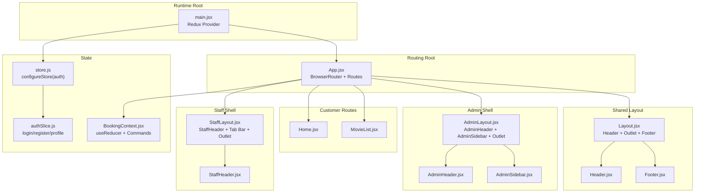
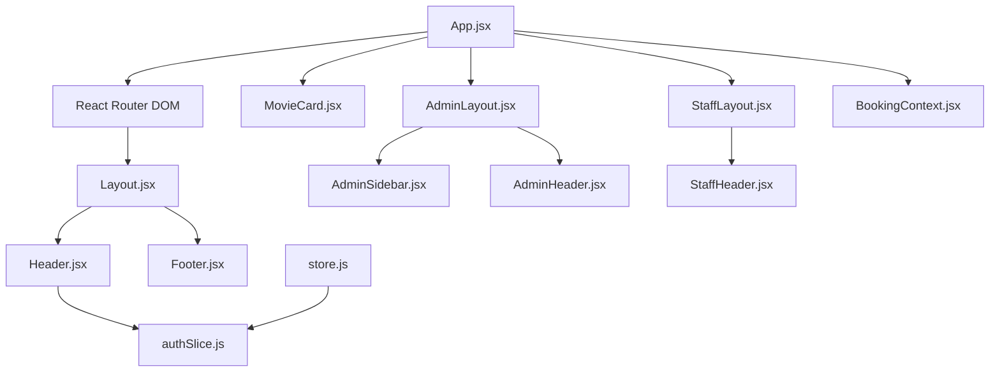
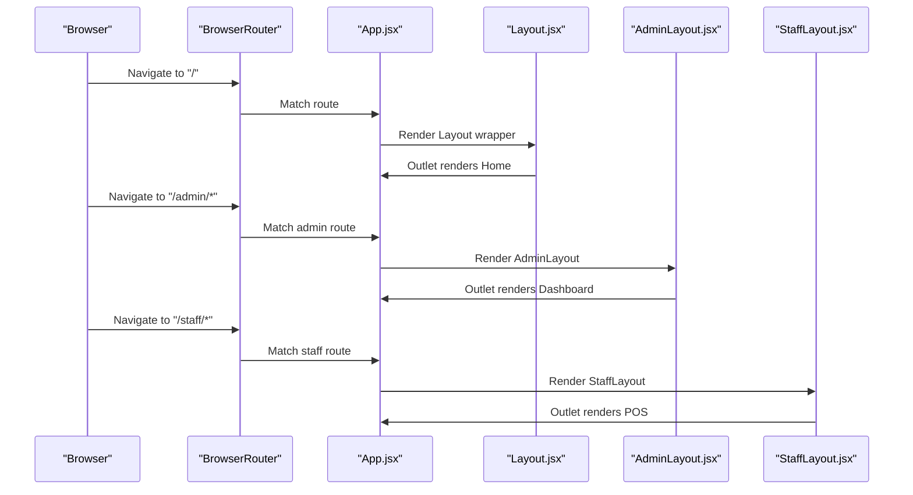
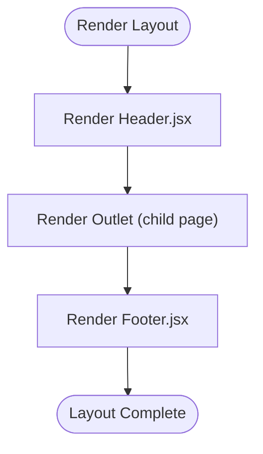
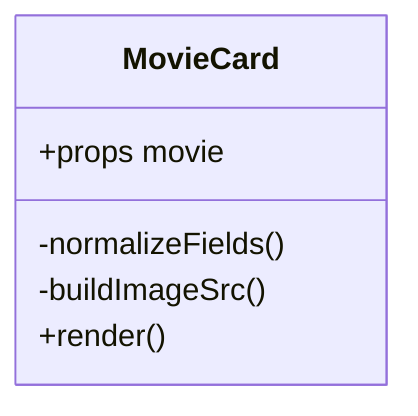
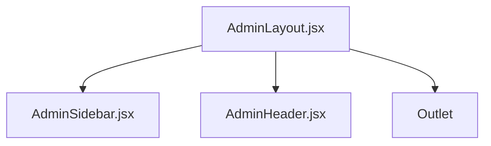
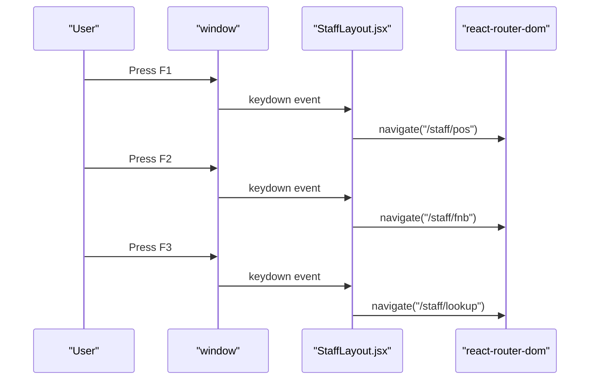
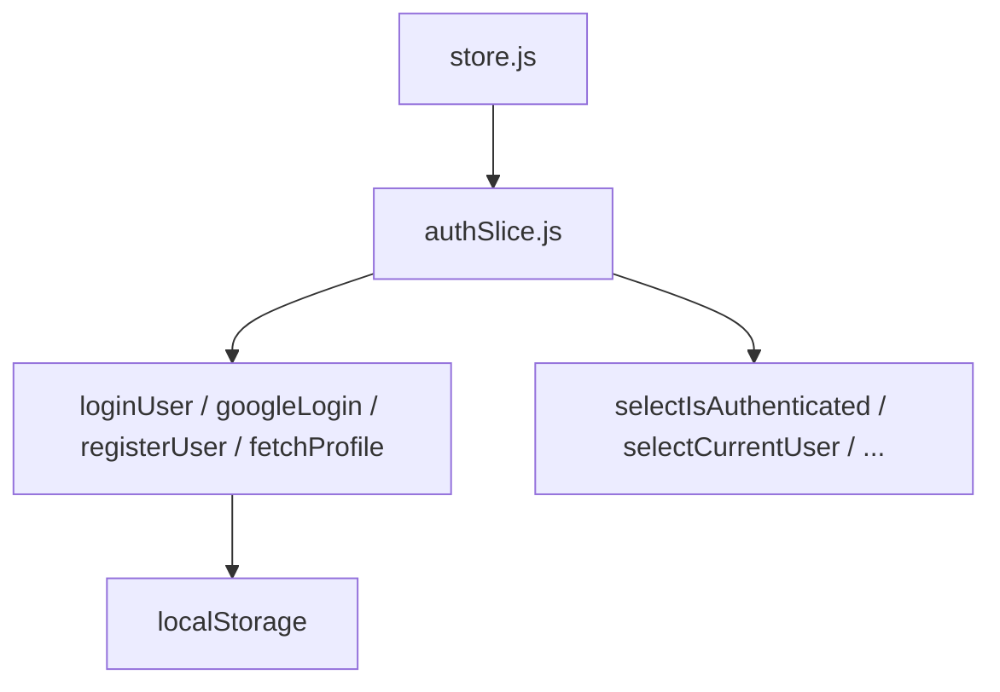
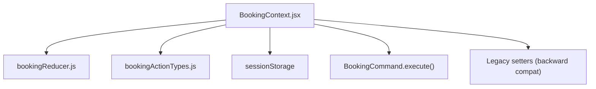
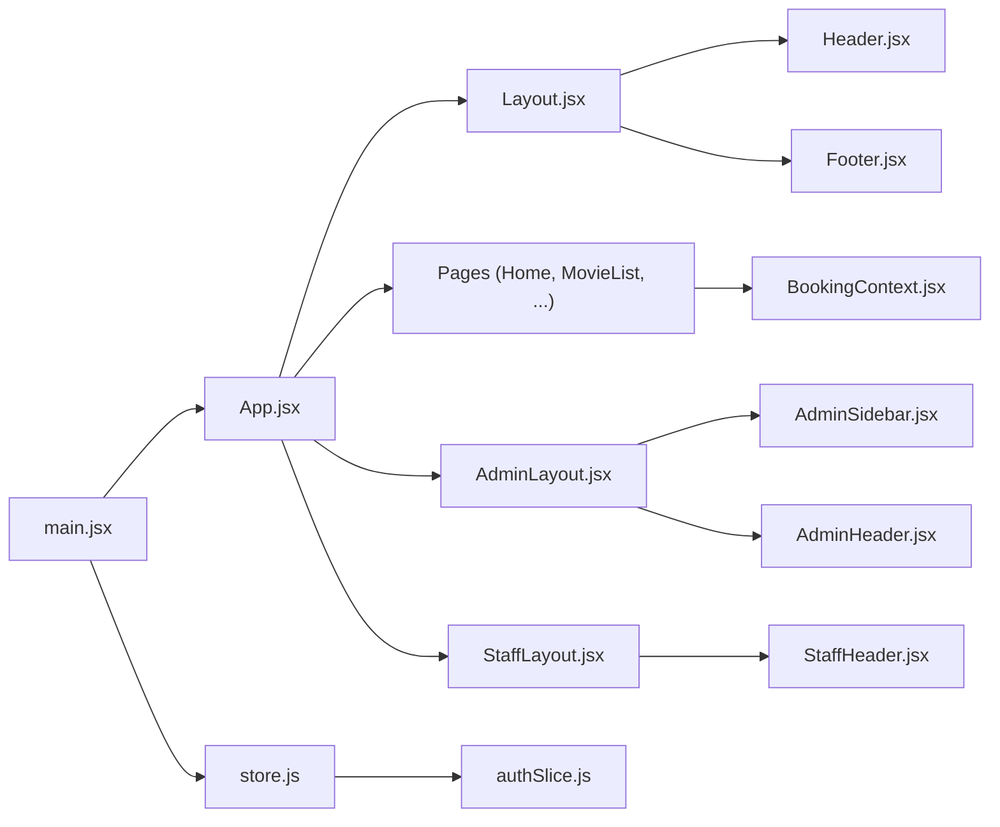

# Component Architecture

<cite>
**Referenced Files in This Document**
- [App.jsx](file://frontend/src/App.jsx)
- [Layout.jsx](file://frontend/src/components/Layout.jsx)
- [Header.jsx](file://frontend/src/components/Header.jsx)
- [Footer.jsx](file://frontend/src/components/Footer.jsx)
- [MovieCard.jsx](file://frontend/src/components/MovieCard.jsx)
- [AdminLayout.jsx](file://frontend/src/components/admin/AdminLayout.jsx)
- [AdminHeader.jsx](file://frontend/src/components/admin/AdminHeader.jsx)
- [AdminSidebar.jsx](file://frontend/src/components/admin/AdminSidebar.jsx)
- [StaffLayout.jsx](file://frontend/src/components/staff/StaffLayout.jsx)
- [StaffHeader.jsx](file://frontend/src/components/staff/StaffHeader.jsx)
- [BookingContext.jsx](file://frontend/src/contexts/BookingContext.jsx)
- [store.js](file://frontend/src/store/store.js)
- [authSlice.js](file://frontend/src/store/authSlice.js)
- [Home.jsx](file://frontend/src/pages/Home.jsx)
- [MovieList.jsx](file://frontend/src/pages/MovieList.jsx)
- [main.jsx](file://frontend/src/main.jsx)
</cite>

## Table of Contents
1. [Introduction](#introduction)
2. [Project Structure](#project-structure)
3. [Core Components](#core-components)
4. [Architecture Overview](#architecture-overview)
5. [Detailed Component Analysis](#detailed-component-analysis)
6. [Dependency Analysis](#dependency-analysis)
7. [Performance Considerations](#performance-considerations)
8. [Troubleshooting Guide](#troubleshooting-guide)
9. [Conclusion](#conclusion)
10. [Appendices](#appendices)

## Introduction
This document describes the React frontend component architecture for the StarCine application. It explains the component hierarchy starting from the root App component and Layout components, documents reusable component patterns (Header, Footer, MovieCard), and role-based layouts (AdminLayout, StaffLayout). It also covers component composition, prop passing strategies, lifecycle management, styling with Tailwind CSS, responsive design, component communication via props, Redux, and context, testing strategies, performance optimization, accessibility, and maintainability guidelines.

## Project Structure
The frontend is organized around a routing-driven structure with shared layouts and role-specific shells. The root App component defines routes for customer-facing pages, admin, and staff areas. Shared UI is encapsulated in Layout and role-specific shells. State is managed via Redux for authentication and a custom BookingContext for booking flow orchestration.

**Diagram sources**
- [main.jsx:11-19](file://frontend/src/main.jsx#L11-L19)
- [App.jsx:38-81](file://frontend/src/App.jsx#L38-L81)
- [Layout.jsx:4-14](file://frontend/src/components/Layout.jsx#L4-L14)
- [Header.jsx:7-268](file://frontend/src/components/Header.jsx#L7-L268)
- [Footer.jsx:3-71](file://frontend/src/components/Footer.jsx#L3-L71)
- [AdminLayout.jsx:5-22](file://frontend/src/components/admin/AdminLayout.jsx#L5-L22)
- [AdminHeader.jsx:6-63](file://frontend/src/components/admin/AdminHeader.jsx#L6-L63)
- [AdminSidebar.jsx:3-93](file://frontend/src/components/admin/AdminSidebar.jsx#L3-L93)
- [StaffLayout.jsx:11-69](file://frontend/src/components/staff/StaffLayout.jsx#L11-L69)
- [StaffHeader.jsx:4-51](file://frontend/src/components/staff/StaffHeader.jsx#L4-L51)
- [store.js:4-8](file://frontend/src/store/store.js#L4-L8)
- [authSlice.js:145-237](file://frontend/src/store/authSlice.js#L145-L237)
- [BookingContext.jsx:31-147](file://frontend/src/contexts/BookingContext.jsx#L31-L147)

**Section sources**
- [main.jsx:11-19](file://frontend/src/main.jsx#L11-L19)
- [App.jsx:38-81](file://frontend/src/App.jsx#L38-L81)

## Core Components
- App: Central router that mounts the booking provider, sets up nested routes, and renders role-specific shells.
- Layout: Customer-facing shell that wraps pages with shared Header and Footer.
- Header: Dynamic header with scroll effects, user menu, cinema mega-menu, and Redux-driven auth state.
- Footer: Multi-column responsive footer with links and social icons.
- MovieCard: Reusable card for movies supporting both legacy and API DTO shapes.
- AdminLayout/AdminHeader/AdminSidebar: Admin shell with sidebar navigation and header actions.
- StaffLayout/StaffHeader: Staff shell with fixed tab bar and keyboard shortcuts.
- BookingContext: Centralized booking state via useReducer and command execution with session persistence.
- Redux Store/AuthSlice: Authentication state, async thunks, and selectors.

**Section sources**
- [App.jsx:30-81](file://frontend/src/App.jsx#L30-L81)
- [Layout.jsx:4-14](file://frontend/src/components/Layout.jsx#L4-L14)
- [Header.jsx:7-268](file://frontend/src/components/Header.jsx#L7-L268)
- [Footer.jsx:3-71](file://frontend/src/components/Footer.jsx#L3-L71)
- [MovieCard.jsx:17-152](file://frontend/src/components/MovieCard.jsx#L17-L152)
- [AdminLayout.jsx:5-22](file://frontend/src/components/admin/AdminLayout.jsx#L5-L22)
- [AdminHeader.jsx:6-63](file://frontend/src/components/admin/AdminHeader.jsx#L6-L63)
- [AdminSidebar.jsx:3-93](file://frontend/src/components/admin/AdminSidebar.jsx#L3-L93)
- [StaffLayout.jsx:11-69](file://frontend/src/components/staff/StaffLayout.jsx#L11-L69)
- [StaffHeader.jsx:4-51](file://frontend/src/components/staff/StaffHeader.jsx#L4-L51)
- [BookingContext.jsx:31-147](file://frontend/src/contexts/BookingContext.jsx#L31-L147)
- [store.js:4-8](file://frontend/src/store/store.js#L4-L8)
- [authSlice.js:145-237](file://frontend/src/store/authSlice.js#L145-L237)

## Architecture Overview
The app follows a layered architecture:
- Routing layer: App.jsx defines route groups for customers, admin, and staff.
- Layout layer: Shared Layout and role-specific shells provide consistent shell UI.
- Feature layer: Pages implement business logic and consume services/state.
- State layer: Redux for auth and a custom BookingContext for booking orchestration.
- Presentation layer: Reusable components (Header, Footer, MovieCard) and Tailwind-based styling.

**Diagram sources**
- [App.jsx:38-81](file://frontend/src/App.jsx#L38-L81)
- [Layout.jsx:4-14](file://frontend/src/components/Layout.jsx#L4-L14)
- [Header.jsx:7-268](file://frontend/src/components/Header.jsx#L7-L268)
- [Footer.jsx:3-71](file://frontend/src/components/Footer.jsx#L3-L71)
- [MovieCard.jsx:17-152](file://frontend/src/components/MovieCard.jsx#L17-L152)
- [AdminLayout.jsx:5-22](file://frontend/src/components/admin/AdminLayout.jsx#L5-L22)
- [AdminHeader.jsx:6-63](file://frontend/src/components/admin/AdminHeader.jsx#L6-L63)
- [AdminSidebar.jsx:3-93](file://frontend/src/components/admin/AdminSidebar.jsx#L3-L93)
- [StaffLayout.jsx:11-69](file://frontend/src/components/staff/StaffLayout.jsx#L11-L69)
- [StaffHeader.jsx:4-51](file://frontend/src/components/staff/StaffHeader.jsx#L4-L51)
- [BookingContext.jsx:31-147](file://frontend/src/contexts/BookingContext.jsx#L31-L147)
- [store.js:4-8](file://frontend/src/store/store.js#L4-L8)
- [authSlice.js:145-237](file://frontend/src/store/authSlice.js#L145-L237)

## Detailed Component Analysis

### Root App and Routing
- Customer routes are wrapped in a Layout shell using Outlet.
- Admin routes render AdminLayout with nested routes for dashboards and management pages.
- Staff routes render StaffLayout with nested POS, F&B, and lookup pages.
- Authentication routes (e.g., Login) render without layout.

**Diagram sources**
- [App.jsx:38-81](file://frontend/src/App.jsx#L38-L81)
- [Layout.jsx:4-14](file://frontend/src/components/Layout.jsx#L4-L14)
- [AdminLayout.jsx:5-22](file://frontend/src/components/admin/AdminLayout.jsx#L5-L22)
- [StaffLayout.jsx:11-69](file://frontend/src/components/staff/StaffLayout.jsx#L11-L69)

**Section sources**
- [App.jsx:30-81](file://frontend/src/App.jsx#L30-L81)

### Layout and Shared Components
- Layout composes Header, Outlet, and Footer. It uses Tailwind for responsive stacking and height management.
- Header manages scroll effects, user menu, cinema mega-menu, and integrates Redux for auth state and service calls for locations and cinemas.
- Footer uses a responsive grid and Tailwind utilities for spacing and typography.

**Diagram sources**
- [Layout.jsx:4-14](file://frontend/src/components/Layout.jsx#L4-L14)
- [Header.jsx:7-268](file://frontend/src/components/Header.jsx#L7-L268)
- [Footer.jsx:3-71](file://frontend/src/components/Footer.jsx#L3-L71)

**Section sources**
- [Layout.jsx:4-14](file://frontend/src/components/Layout.jsx#L4-L14)
- [Header.jsx:7-268](file://frontend/src/components/Header.jsx#L7-L268)
- [Footer.jsx:3-71](file://frontend/src/components/Footer.jsx#L3-L71)

### MovieCard Component
- Accepts either API DTO or legacy shape and normalizes fields.
- Renders a card with badges, hover overlay, and action buttons.
- Supports trailers and “Coming Soon” states.

**Diagram sources**
- [MovieCard.jsx:17-152](file://frontend/src/components/MovieCard.jsx#L17-L152)

**Section sources**
- [MovieCard.jsx:17-152](file://frontend/src/components/MovieCard.jsx#L17-L152)

### Role-Based Layouts

#### AdminLayout
- Fixed sidebar and header; main content canvas with Outlet.
- Includes a floating action button for contextual help.

**Diagram sources**
- [AdminLayout.jsx:5-22](file://frontend/src/components/admin/AdminLayout.jsx#L5-L22)
- [AdminSidebar.jsx:3-93](file://frontend/src/components/admin/AdminSidebar.jsx#L3-L93)
- [AdminHeader.jsx:6-63](file://frontend/src/components/admin/AdminHeader.jsx#L6-L63)

**Section sources**
- [AdminLayout.jsx:5-22](file://frontend/src/components/admin/AdminLayout.jsx#L5-L22)
- [AdminSidebar.jsx:3-93](file://frontend/src/components/admin/AdminSidebar.jsx#L3-L93)
- [AdminHeader.jsx:6-63](file://frontend/src/components/admin/AdminHeader.jsx#L6-L63)

#### StaffLayout
- Fixed tab bar with hotkeys (F1-F3) for quick navigation.
- Uses a header with clock and branding.

**Diagram sources**
- [StaffLayout.jsx:15-27](file://frontend/src/components/staff/StaffLayout.jsx#L15-L27)
- [StaffLayout.jsx:34-61](file://frontend/src/components/staff/StaffLayout.jsx#L34-L61)

**Section sources**
- [StaffLayout.jsx:11-69](file://frontend/src/components/staff/StaffLayout.jsx#L11-L69)
- [StaffHeader.jsx:4-51](file://frontend/src/components/staff/StaffHeader.jsx#L4-L51)

### State Management

#### Redux Store and AuthSlice
- Store configuration includes auth slice.
- AuthSlice handles login, Google login, register, and profile fetch via async thunks.
- Persists tokens and user info to localStorage and exposes selectors.

**Diagram sources**
- [store.js:4-8](file://frontend/src/store/store.js#L4-L8)
- [authSlice.js:145-237](file://frontend/src/store/authSlice.js#L145-L237)

**Section sources**
- [store.js:4-8](file://frontend/src/store/store.js#L4-L8)
- [authSlice.js:145-237](file://frontend/src/store/authSlice.js#L145-L237)

#### BookingContext (Custom)
- Provides booking state via useReducer with a default initializer loading from sessionStorage.
- Exposes executeCommand for command objects and legacy setter wrappers for backward compatibility.
- Keeps state in sync with sessionStorage and exposes a getState getter via ref.

**Diagram sources**
- [BookingContext.jsx:31-147](file://frontend/src/contexts/BookingContext.jsx#L31-L147)

**Section sources**
- [BookingContext.jsx:31-147](file://frontend/src/contexts/BookingContext.jsx#L31-L147)

### Component Communication Patterns
- Props: Child components receive normalized props (e.g., MovieCard receives movie).
- Context: BookingContext exposes dispatch/getState/executeCommand to pages and components.
- Redux: useSelector/selectors in Header/AdminHeader for auth state; dispatch for logout.
- Events: Header handles scroll and click-outside events; StaffLayout handles keyboard events.

**Section sources**
- [Header.jsx:7-268](file://frontend/src/components/Header.jsx#L7-L268)
- [AdminHeader.jsx:6-63](file://frontend/src/components/admin/AdminHeader.jsx#L6-L63)
- [BookingContext.jsx:31-147](file://frontend/src/contexts/BookingContext.jsx#L31-L147)

### Styling and Responsive Design
- Tailwind utilities dominate layout and responsiveness (e.g., flex-col min-h-screen, grid-cols-1 md:grid-cols-4, px-6 md:px-8).
- Dark mode variants use dark:bg-* and dark:text-* utilities.
- Responsive breakpoints adjust padding, typography, and component widths.

**Section sources**
- [Layout.jsx:6-12](file://frontend/src/components/Layout.jsx#L6-L12)
- [Footer.jsx:6-68](file://frontend/src/components/Footer.jsx#L6-L68)
- [Header.jsx:60-68](file://frontend/src/components/Header.jsx#L60-L68)

### Component Lifecycle Management
- Effects: Header loads locations/cinemas on mount; StaffHeader updates time every second; Home and MovieList manage derived data via useMemo/useCallback and effect chains.
- Cleanup: Header removes scroll listener; Home/MovieList remove click-outside listeners; StaffLayout removes keydown listener.

**Section sources**
- [Header.jsx:26-49](file://frontend/src/components/Header.jsx#L26-L49)
- [StaffHeader.jsx:7-10](file://frontend/src/components/staff/StaffHeader.jsx#L7-L10)
- [Home.jsx:38-68](file://frontend/src/pages/Home.jsx#L38-L68)
- [MovieList.jsx:34-76](file://frontend/src/pages/MovieList.jsx#L34-L76)

## Dependency Analysis
- main.jsx wires Redux Provider and renders App.
- App depends on Layout, AdminLayout, StaffLayout, and page components.
- Layout depends on Header and Footer.
- Header depends on Redux authSlice and services for locations/cinemas.
- AdminLayout/AdminSidebar/AdminHeader depend on routing and Redux for user data.
- StaffLayout/StaffHeader depend on routing and local time.
- BookingContext is consumed by pages (Home, MovieList) and exposed via hooks.

**Diagram sources**
- [main.jsx:11-19](file://frontend/src/main.jsx#L11-L19)
- [App.jsx:38-81](file://frontend/src/App.jsx#L38-L81)
- [Layout.jsx:4-14](file://frontend/src/components/Layout.jsx#L4-L14)
- [Header.jsx:7-268](file://frontend/src/components/Header.jsx#L7-L268)
- [Footer.jsx:3-71](file://frontend/src/components/Footer.jsx#L3-L71)
- [BookingContext.jsx:31-147](file://frontend/src/contexts/BookingContext.jsx#L31-L147)
- [store.js:4-8](file://frontend/src/store/store.js#L4-L8)
- [authSlice.js:145-237](file://frontend/src/store/authSlice.js#L145-L237)
- [AdminLayout.jsx:5-22](file://frontend/src/components/admin/AdminLayout.jsx#L5-L22)
- [AdminSidebar.jsx:3-93](file://frontend/src/components/admin/AdminSidebar.jsx#L3-L93)
- [AdminHeader.jsx:6-63](file://frontend/src/components/admin/AdminHeader.jsx#L6-L63)
- [StaffLayout.jsx:11-69](file://frontend/src/components/staff/StaffLayout.jsx#L11-L69)
- [StaffHeader.jsx:4-51](file://frontend/src/components/staff/StaffHeader.jsx#L4-L51)

**Section sources**
- [main.jsx:11-19](file://frontend/src/main.jsx#L11-L19)
- [App.jsx:38-81](file://frontend/src/App.jsx#L38-L81)

## Performance Considerations
- Memoization: Pages compute derived data with useMemo/useCallback to avoid unnecessary re-renders (e.g., Home’s derived lists, MovieList’s date generation).
- Event cleanup: Remove listeners in effects to prevent leaks (Header scroll, click-outside handlers).
- Lazy images and overlays: MovieCard uses hover overlays and lazy image loading via normalized URLs.
- Context granularity: Keep BookingContext focused on booking state; avoid forcing unrelated components to subscribe.
- Session storage: Persist booking state to reduce server round trips and improve UX.

**Section sources**
- [Home.jsx:88-145](file://frontend/src/pages/Home.jsx#L88-L145)
- [MovieList.jsx:78-95](file://frontend/src/pages/MovieList.jsx#L78-L95)
- [Header.jsx:26-49](file://frontend/src/components/Header.jsx#L26-L49)
- [BookingContext.jsx:51-56](file://frontend/src/contexts/BookingContext.jsx#L51-L56)

## Troubleshooting Guide
- Authentication state not persisting: Verify localStorage keys and reducers in authSlice; ensure store is initialized in main.jsx.
- Header data not loading: Confirm service calls for locations/cinemas and error handling in Header.
- Booking state resets unexpectedly: Check sessionStorage persistence and BookingContext initializer.
- Keyboard shortcuts not working: Ensure StaffLayout keydown listener is attached and cleaned up.

**Section sources**
- [authSlice.js:145-237](file://frontend/src/store/authSlice.js#L145-L237)
- [main.jsx:11-19](file://frontend/src/main.jsx#L11-L19)
- [Header.jsx:32-47](file://frontend/src/components/Header.jsx#L32-L47)
- [BookingContext.jsx:10-21](file://frontend/src/contexts/BookingContext.jsx#L10-L21)
- [StaffLayout.jsx:24-27](file://frontend/src/components/staff/StaffLayout.jsx#L24-L27)

## Conclusion
The frontend employs a clean separation of concerns: routing drives role-specific shells, shared layouts encapsulate common UI, and state is centralized via Redux and a custom context. Reusable components like Header, Footer, and MovieCard promote consistency and maintainability. Tailwind enables responsive design, while memoization and effect cleanup improve performance. The architecture supports scalable enhancements and adheres to modern React patterns.

## Appendices

### Component Composition and Prop Passing Strategies
- Layout composes children via Outlet; pages receive props from services and Redux.
- Header receives no props; it manages its own state and consumes Redux.
- MovieCard expects a single movie prop with normalized fields.
- AdminLayout/StaffLayout pass through Outlet; child pages inject data via props.

**Section sources**
- [Layout.jsx:4-14](file://frontend/src/components/Layout.jsx#L4-L14)
- [Header.jsx:7-268](file://frontend/src/components/Header.jsx#L7-L268)
- [MovieCard.jsx:17-152](file://frontend/src/components/MovieCard.jsx#L17-L152)
- [AdminLayout.jsx:5-22](file://frontend/src/components/admin/AdminLayout.jsx#L5-L22)
- [StaffLayout.jsx:11-69](file://frontend/src/components/staff/StaffLayout.jsx#L11-L69)

### Accessibility Guidelines
- Semantic HTML and proper heading hierarchy (h1–h2–h3) in pages and cards.
- Focus management for dropdowns and modals (e.g., close on Escape).
- ARIA labels for carousel indicators and buttons.
- Sufficient color contrast for light/dark themes.
- Landmark roles via section and nav elements.

[No sources needed since this section provides general guidance]

### Testing Strategies
- Unit tests for pure functions and selectors.
- Mock services for API calls in pages (Home, MovieList).
- Test context providers (BookingContext) with minimal reducers.
- Snapshot tests for static components (Footer, MovieCard).
- Integration tests for routing and layout shells.

[No sources needed since this section provides general guidance]