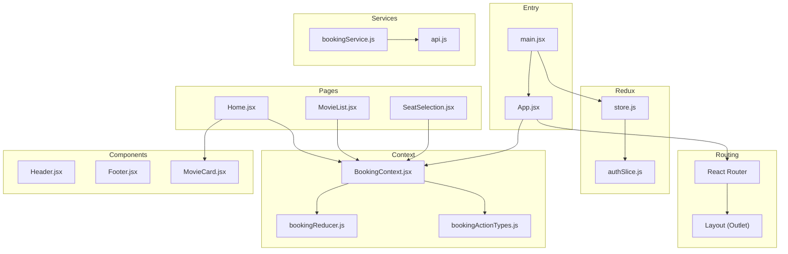
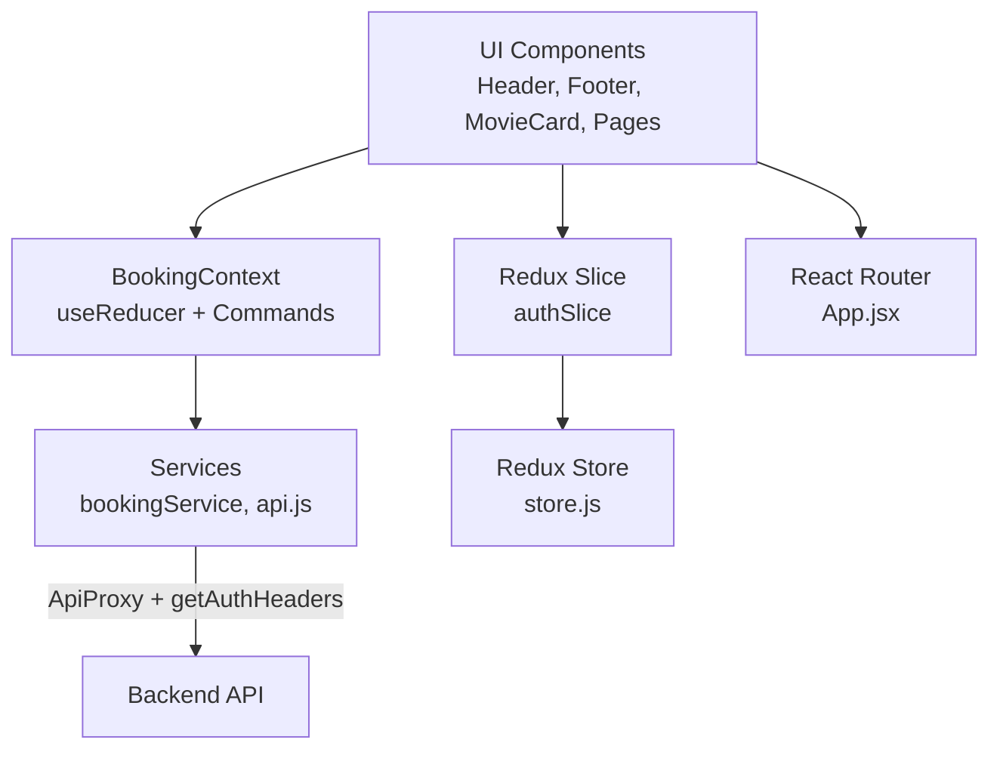
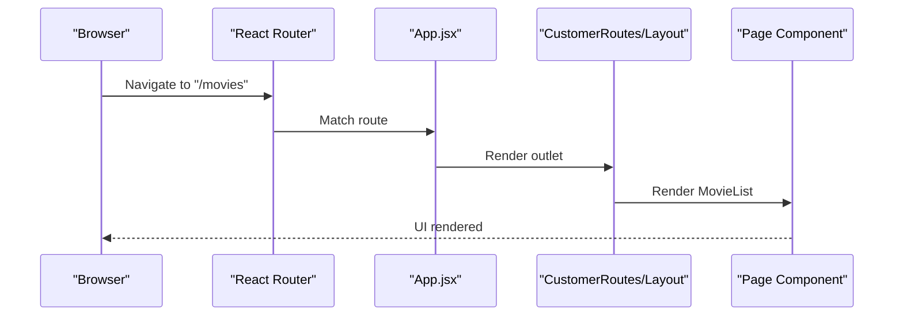
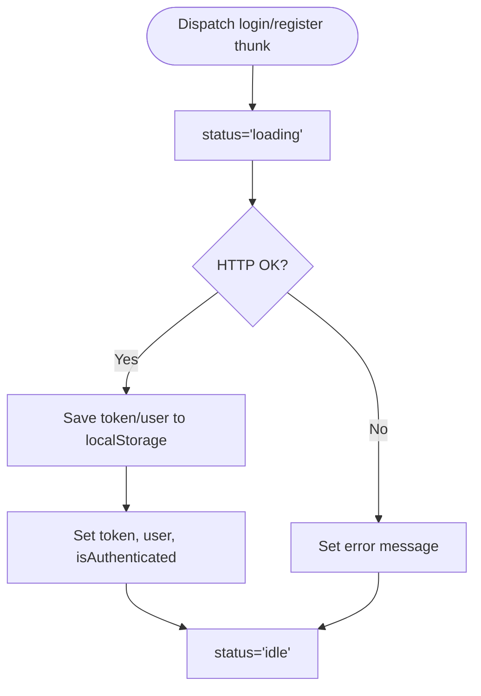
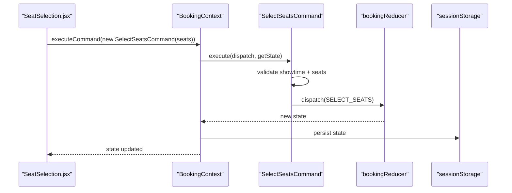
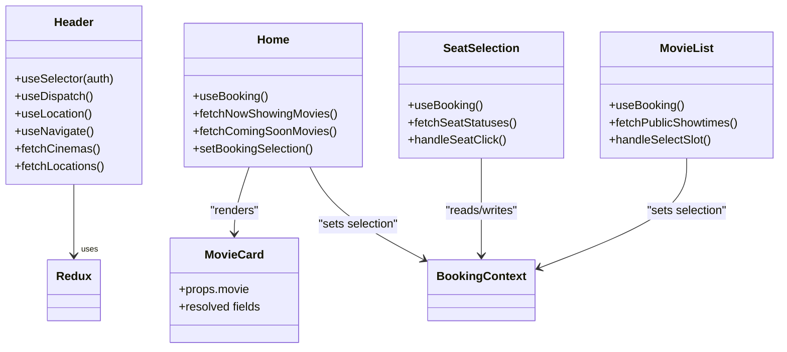
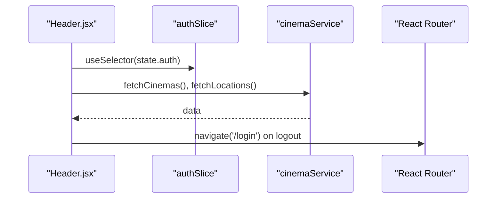
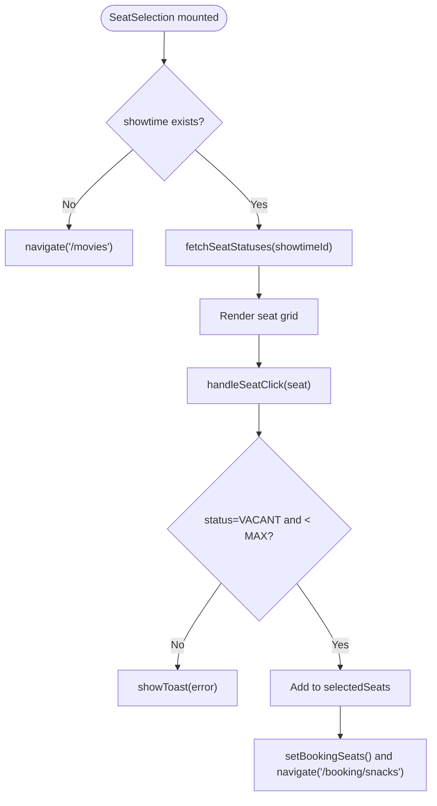
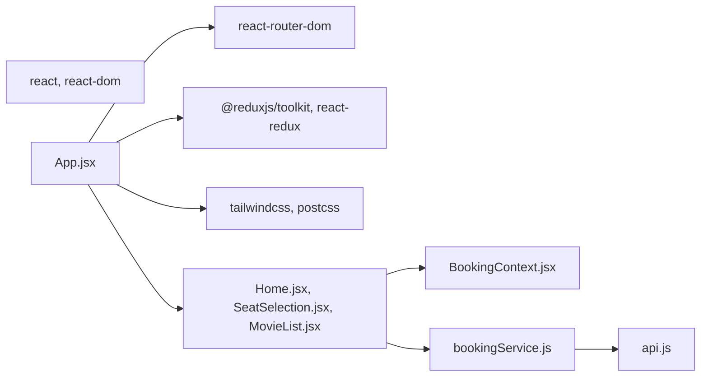

# Frontend Development

<cite>
**Referenced Files in This Document**
- [App.jsx](file://frontend/src/App.jsx)
- [main.jsx](file://frontend/src/main.jsx)
- [store.js](file://frontend/src/store/store.js)
- [authSlice.js](file://frontend/src/store/authSlice.js)
- [BookingContext.jsx](file://frontend/src/contexts/BookingContext.jsx)
- [bookingReducer.js](file://frontend/src/booking/bookingReducer.js)
- [bookingActionTypes.js](file://frontend/src/booking/bookingActionTypes.js)
- [SelectSeatsCommand.js](file://frontend/src/booking/commands/SelectSeatsCommand.js)
- [SubmitCheckoutCommand.js](file://frontend/src/booking/commands/SubmitCheckoutCommand.js)
- [bookingService.js](file://frontend/src/services/bookingService.js)
- [Header.jsx](file://frontend/src/components/Header.jsx)
- [Footer.jsx](file://frontend/src/components/Footer.jsx)
- [MovieCard.jsx](file://frontend/src/components/MovieCard.jsx)
- [Home.jsx](file://frontend/src/pages/Home.jsx)
- [SeatSelection.jsx](file://frontend/src/pages/SeatSelection.jsx)
- [MovieList.jsx](file://frontend/src/pages/MovieList.jsx)
- [api.js](file://frontend/src/utils/api.js)
- [package.json](file://frontend/package.json)
</cite>

## Table of Contents
1. [Introduction](#introduction)
2. [Project Structure](#project-structure)
3. [Core Components](#core-components)
4. [Architecture Overview](#architecture-overview)
5. [Detailed Component Analysis](#detailed-component-analysis)
6. [Dependency Analysis](#dependency-analysis)
7. [Performance Considerations](#performance-considerations)
8. [Troubleshooting Guide](#troubleshooting-guide)
9. [Conclusion](#conclusion)
10. [Appendices](#appendices)

## Introduction
This document provides comprehensive frontend development guidance for the React application. It covers component hierarchy, state management with Redux Toolkit and React Context, routing configuration with React Router, hooks usage, styling architecture with Tailwind CSS, and responsive design. Practical examples include Header, Footer, MovieCard, and key booking flow components. It also documents the booking context implementation, Redux slices for authentication and booking state, service layer integration for API communication, component lifecycle, prop drilling solutions, state persistence, testing strategies, performance optimization techniques, and accessibility compliance.

## Project Structure
The frontend is organized by feature and layer:
- Routing and app shell in App.jsx and main.jsx
- Redux store and auth slice
- Booking context and reducer with command pattern
- Services for API communication
- Reusable components (Header, Footer, MovieCard)
- Feature pages (Home, SeatSelection, MovieList)
- Utilities for API proxy and auth headers
- Tailwind CSS configured via Vite and PostCSS

**Diagram sources**
- [main.jsx:1-20](file://frontend/src/main.jsx#L1-L20)
- [App.jsx:38-81](file://frontend/src/App.jsx#L38-L81)
- [store.js:1-11](file://frontend/src/store/store.js#L1-L11)
- [authSlice.js:145-252](file://frontend/src/store/authSlice.js#L145-L252)
- [BookingContext.jsx:31-147](file://frontend/src/contexts/BookingContext.jsx#L31-L147)
- [bookingReducer.js:25-64](file://frontend/src/booking/bookingReducer.js#L25-L64)
- [bookingActionTypes.js:5-16](file://frontend/src/booking/bookingActionTypes.js#L5-L16)
- [bookingService.js:1-85](file://frontend/src/services/bookingService.js#L1-L85)
- [api.js:17-36](file://frontend/src/utils/api.js#L17-L36)
- [Header.jsx:7-270](file://frontend/src/components/Header.jsx#L7-L270)
- [Footer.jsx:3-72](file://frontend/src/components/Footer.jsx#L3-L72)
- [MovieCard.jsx:17-156](file://frontend/src/components/MovieCard.jsx#L17-L156)
- [Home.jsx:9-560](file://frontend/src/pages/Home.jsx#L9-L560)
- [SeatSelection.jsx:52-365](file://frontend/src/pages/SeatSelection.jsx#L52-L365)
- [MovieList.jsx:7-475](file://frontend/src/pages/MovieList.jsx#L7-L475)

**Section sources**
- [App.jsx:38-81](file://frontend/src/App.jsx#L38-L81)
- [main.jsx:11-19](file://frontend/src/main.jsx#L11-L19)
- [store.js:4-8](file://frontend/src/store/store.js#L4-L8)
- [BookingContext.jsx:31-147](file://frontend/src/contexts/BookingContext.jsx#L31-L147)
- [bookingReducer.js:7-15](file://frontend/src/booking/bookingReducer.js#L7-L15)
- [bookingActionTypes.js:5-16](file://frontend/src/booking/bookingActionTypes.js#L5-L16)
- [bookingService.js:1-85](file://frontend/src/services/bookingService.js#L1-L85)
- [api.js:17-36](file://frontend/src/utils/api.js#L17-L36)
- [Header.jsx:7-270](file://frontend/src/components/Header.jsx#L7-L270)
- [Footer.jsx:3-72](file://frontend/src/components/Footer.jsx#L3-L72)
- [MovieCard.jsx:17-156](file://frontend/src/components/MovieCard.jsx#L17-L156)
- [Home.jsx:9-560](file://frontend/src/pages/Home.jsx#L9-L560)
- [SeatSelection.jsx:52-365](file://frontend/src/pages/SeatSelection.jsx#L52-L365)
- [MovieList.jsx:7-475](file://frontend/src/pages/MovieList.jsx#L7-L475)

## Core Components
- App.jsx: Configures routing with nested layouts, protected routes, and providers (Redux Provider and BookingProvider).
- main.jsx: Wraps the app with Redux Provider and initializes Tailwind CSS.
- Header.jsx: Implements responsive navigation, user menu, cinema mega-menu, and integrates Redux auth state.
- Footer.jsx: Provides a multi-column footer with links and social icons.
- MovieCard.jsx: Renders movie cards with backward-compatible props for API DTOs and legacy mocks.
- BookingContext.jsx: Centralized booking state with useReducer, session storage persistence, command pattern, and legacy setter wrappers.
- bookingReducer.js: Defines default booking state and pure reducers for selection and pricing updates.
- bookingActionTypes.js: Action constants for reducer transitions.
- SelectSeatsCommand.js: Validates seat selection and dispatches actions.
- SubmitCheckoutCommand.js: Encapsulates checkout submission and payment method branching.
- bookingService.js: API client for seat statuses, locking/unlocking seats, price calculation, and booking creation.
- authSlice.js: Redux slice managing JWT tokens, user roles, login/register/profile flows, and local persistence.
- api.js: Global fetch proxy with 401 handling and auth header injection.

**Section sources**
- [App.jsx:38-81](file://frontend/src/App.jsx#L38-L81)
- [main.jsx:11-19](file://frontend/src/main.jsx#L11-L19)
- [Header.jsx:7-270](file://frontend/src/components/Header.jsx#L7-L270)
- [Footer.jsx:3-72](file://frontend/src/components/Footer.jsx#L3-L72)
- [MovieCard.jsx:17-156](file://frontend/src/components/MovieCard.jsx#L17-L156)
- [BookingContext.jsx:31-147](file://frontend/src/contexts/BookingContext.jsx#L31-L147)
- [bookingReducer.js:25-64](file://frontend/src/booking/bookingReducer.js#L25-L64)
- [bookingActionTypes.js:5-16](file://frontend/src/booking/bookingActionTypes.js#L5-L16)
- [SelectSeatsCommand.js:9-30](file://frontend/src/booking/commands/SelectSeatsCommand.js#L9-L30)
- [SubmitCheckoutCommand.js:13-71](file://frontend/src/booking/commands/SubmitCheckoutCommand.js#L13-L71)
- [bookingService.js:1-85](file://frontend/src/services/bookingService.js#L1-L85)
- [authSlice.js:145-252](file://frontend/src/store/authSlice.js#L145-L252)
- [api.js:17-36](file://frontend/src/utils/api.js#L17-L36)

## Architecture Overview
The application follows a layered architecture:
- Presentation layer: React components and pages
- State management: Redux Toolkit for global auth state and React Context for booking flow
- Service layer: API utilities and booking service
- Routing: React Router with nested layouts and route guards
- Styling: Tailwind CSS with responsive utilities

**Diagram sources**
- [App.jsx:38-81](file://frontend/src/App.jsx#L38-L81)
- [BookingContext.jsx:31-147](file://frontend/src/contexts/BookingContext.jsx#L31-L147)
- [authSlice.js:145-252](file://frontend/src/store/authSlice.js#L145-L252)
- [bookingService.js:1-85](file://frontend/src/services/bookingService.js#L1-L85)
- [api.js:17-36](file://frontend/src/utils/api.js#L17-L36)
- [store.js:4-8](file://frontend/src/store/store.js#L4-L8)

## Detailed Component Analysis

### Routing Configuration with React Router
- Root layout wraps customer routes; admin and staff routes use dedicated layouts.
- Nested Outlet renders child routes within shared layouts.
- Protected routes: Authentication state determines visibility of user-specific UI and admin/staff areas.
- Navigation: Header links integrate with routes for seamless UX.

**Diagram sources**
- [App.jsx:30-77](file://frontend/src/App.jsx#L30-L77)
- [MovieList.jsx:7-475](file://frontend/src/pages/MovieList.jsx#L7-L475)

**Section sources**
- [App.jsx:38-81](file://frontend/src/App.jsx#L38-L81)

### State Management with Redux Toolkit
- Store configuration includes a single reducer for auth.
- authSlice manages:
  - Login/Register flows via async thunks
  - Profile fetching
  - Local storage persistence for tokens and user metadata
  - Logout and error clearing actions
  - Selectors for consuming state in components

**Diagram sources**
- [authSlice.js:167-236](file://frontend/src/store/authSlice.js#L167-L236)

**Section sources**
- [store.js:4-8](file://frontend/src/store/store.js#L4-L8)
- [authSlice.js:145-252](file://frontend/src/store/authSlice.js#L145-L252)

### Booking Context Implementation and Command Pattern
- BookingProvider:
  - Initializes state from sessionStorage or defaults
  - Persists state to sessionStorage on change
  - Exposes getState and executeCommand for command-driven updates
  - Provides legacy setter wrappers for backward compatibility
- Command Pattern:
  - SelectSeatsCommand validates prerequisites and dispatches selection
  - SubmitCheckoutCommand orchestrates checkout and payment method branching
- Service Integration:
  - bookingService encapsulates seat locking, price calculation, and booking creation

**Diagram sources**
- [SeatSelection.jsx:52-179](file://frontend/src/pages/SeatSelection.jsx#L52-L179)
- [BookingContext.jsx:62-64](file://frontend/src/contexts/BookingContext.jsx#L62-L64)
- [SelectSeatsCommand.js:14-28](file://frontend/src/booking/commands/SelectSeatsCommand.js#L14-L28)
- [bookingReducer.js:36-37](file://frontend/src/booking/bookingReducer.js#L36-L37)
- [BookingContext.jsx:54-56](file://frontend/src/contexts/BookingContext.jsx#L54-L56)

**Section sources**
- [BookingContext.jsx:31-147](file://frontend/src/contexts/BookingContext.jsx#L31-L147)
- [bookingReducer.js:25-64](file://frontend/src/booking/bookingReducer.js#L25-L64)
- [SelectSeatsCommand.js:9-30](file://frontend/src/booking/commands/SelectSeatsCommand.js#L9-L30)
- [SubmitCheckoutCommand.js:13-71](file://frontend/src/booking/commands/SubmitCheckoutCommand.js#L13-L71)
- [bookingService.js:6-84](file://frontend/src/services/bookingService.js#L6-L84)

### Component Composition Patterns
- Header.jsx composes Redux selectors, router hooks, and service calls to render navigation, user menu, and cinema dropdown.
- MovieCard.jsx normalizes props from API DTOs and legacy mocks, ensuring consistent rendering.
- Home.jsx orchestrates quick booking flow, derives computed lists for selections, and integrates BookingContext for state sharing.
- SeatSelection.jsx groups seats by rows, computes prices, and navigates to snack selection after validation.
- MovieList.jsx filters showtimes by date and cinema, enabling quick selection and booking initiation.

**Diagram sources**
- [Header.jsx:7-270](file://frontend/src/components/Header.jsx#L7-L270)
- [MovieCard.jsx:17-156](file://frontend/src/components/MovieCard.jsx#L17-L156)
- [Home.jsx:9-560](file://frontend/src/pages/Home.jsx#L9-L560)
- [SeatSelection.jsx:52-365](file://frontend/src/pages/SeatSelection.jsx#L52-L365)
- [MovieList.jsx:7-475](file://frontend/src/pages/MovieList.jsx#L7-L475)

**Section sources**
- [Header.jsx:7-270](file://frontend/src/components/Header.jsx#L7-L270)
- [MovieCard.jsx:17-156](file://frontend/src/components/MovieCard.jsx#L17-L156)
- [Home.jsx:9-560](file://frontend/src/pages/Home.jsx#L9-L560)
- [SeatSelection.jsx:52-365](file://frontend/src/pages/SeatSelection.jsx#L52-L365)
- [MovieList.jsx:7-475](file://frontend/src/pages/MovieList.jsx#L7-L475)

### Styling Architecture with Tailwind CSS and Responsive Design
- Tailwind v4 configured via Vite and PostCSS; responsive utilities applied across components.
- Dark mode variants use dark:bg-* and dark:border-* classes.
- Utility-first approach: spacing, typography, shadows, and animations are implemented with Tailwind utilities.
- Responsive breakpoints adapt navigation and grids for mobile/tablet/desktop.

**Section sources**
- [package.json:23-36](file://frontend/package.json#L23-L36)
- [Header.jsx:60-267](file://frontend/src/components/Header.jsx#L60-L267)
- [Footer.jsx:4-70](file://frontend/src/components/Footer.jsx#L4-L70)
- [MovieCard.jsx:60-151](file://frontend/src/components/MovieCard.jsx#L60-L151)
- [SeatSelection.jsx:184-364](file://frontend/src/pages/SeatSelection.jsx#L184-L364)
- [MovieList.jsx:199-475](file://frontend/src/pages/MovieList.jsx#L199-L475)

### Practical Examples

#### Header Component
- Features:
  - Scroll-aware styling and backdrop blur
  - Cinema mega-menu grouped by location
  - User menu with role-aware admin link
  - Redux auth integration for login/logout
  - Async data loading for cinemas and locations

**Diagram sources**
- [Header.jsx:20-49](file://frontend/src/components/Header.jsx#L20-L49)
- [authSlice.js:242-250](file://frontend/src/store/authSlice.js#L242-L250)

**Section sources**
- [Header.jsx:7-270](file://frontend/src/components/Header.jsx#L7-L270)
- [authSlice.js:145-252](file://frontend/src/store/authSlice.js#L145-L252)

#### Footer Component
- Structure:
  - Multi-column layout with company info, support links, and app download
  - Social media icons and legal links
  - Responsive grid using Tailwind

**Section sources**
- [Footer.jsx:3-72](file://frontend/src/components/Footer.jsx#L3-L72)

#### MovieCard Component
- Props normalization:
  - Supports both API DTO fields and legacy mock fields
  - Builds image URLs and resolves display values
- Interactive elements:
  - Buy ticket link to seat selection
  - Trailer open in new tab

**Section sources**
- [MovieCard.jsx:17-156](file://frontend/src/components/MovieCard.jsx#L17-L156)

#### Booking Flow Components

##### SeatSelection
- Seat map rendering with grouped rows and legends
- Validation for seat selection and maximum seat count
- Price computation and navigation to snack selection

**Diagram sources**
- [SeatSelection.jsx:64-95](file://frontend/src/pages/SeatSelection.jsx#L64-L95)
- [SeatSelection.jsx:108-179](file://frontend/src/pages/SeatSelection.jsx#L108-L179)
- [bookingService.js:6-12](file://frontend/src/services/bookingService.js#L6-L12)

**Section sources**
- [SeatSelection.jsx:52-365](file://frontend/src/pages/SeatSelection.jsx#L52-L365)
- [bookingService.js:6-12](file://frontend/src/services/bookingService.js#L6-L12)

##### MovieList
- City and cinema selection with dropdowns
- Date tabs and filtered showtimes
- Quick selection modal and booking initialization

**Section sources**
- [MovieList.jsx:7-475](file://frontend/src/pages/MovieList.jsx#L7-L475)

## Dependency Analysis
- External dependencies include React, React Router, Redux Toolkit, and Tailwind CSS.
- Internal dependencies:
  - App.jsx depends on BookingProvider, Layout, and page components
  - Pages depend on BookingContext and services
  - Services depend on api.js for auth headers and proxy

**Diagram sources**
- [package.json:12-21](file://frontend/package.json#L12-L21)
- [App.jsx:38-81](file://frontend/src/App.jsx#L38-L81)
- [Home.jsx:9-560](file://frontend/src/pages/Home.jsx#L9-L560)
- [SeatSelection.jsx:52-365](file://frontend/src/pages/SeatSelection.jsx#L52-L365)
- [MovieList.jsx:7-475](file://frontend/src/pages/MovieList.jsx#L7-L475)
- [BookingContext.jsx:31-147](file://frontend/src/contexts/BookingContext.jsx#L31-L147)
- [bookingService.js:1-85](file://frontend/src/services/bookingService.js#L1-L85)
- [api.js:17-36](file://frontend/src/utils/api.js#L17-L36)

**Section sources**
- [package.json:12-38](file://frontend/package.json#L12-L38)

## Performance Considerations
- Memoization:
  - useMemo for derived lists in Home and MovieList to avoid recomputation
  - useMemo for total price in SeatSelection
- Lazy loading:
  - Dynamic imports for heavy modules (e.g., api.js usage in SubmitCheckoutCommand)
- Efficient rendering:
  - Virtualized or limited lists for showtimes and seat grids
  - Conditional rendering for modals and loading states
- State persistence:
  - SessionStorage persistence in BookingContext reduces re-entry friction
- Network optimization:
  - ApiProxy centralizes error handling and avoids redundant requests
- Bundle size:
  - Tree-shaking enabled by ESM imports and selective service usage

**Section sources**
- [Home.jsx:88-145](file://frontend/src/pages/Home.jsx#L88-L145)
- [MovieList.jsx:97-125](file://frontend/src/pages/MovieList.jsx#L97-L125)
- [SeatSelection.jsx:160-162](file://frontend/src/pages/SeatSelection.jsx#L160-L162)
- [BookingContext.jsx:54-56](file://frontend/src/contexts/BookingContext.jsx#L54-L56)
- [api.js:17-36](file://frontend/src/utils/api.js#L17-L36)

## Troubleshooting Guide
- Authentication errors:
  - ApiProxy intercepts 401 responses, clears tokens, and redirects to login
- Booking state drift:
  - Use executeCommand to enforce validations and keep state transitions predictable
- Session persistence issues:
  - Verify sessionStorage availability and JSON parsing in BookingContext
- API failures:
  - bookingService throws descriptive errors; surface messages to users
- Prop drilling:
  - Prefer BookingContext for booking state and Redux for auth state to minimize props passing

**Section sources**
- [api.js:24-30](file://frontend/src/utils/api.js#L24-L30)
- [BookingContext.jsx:10-21](file://frontend/src/contexts/BookingContext.jsx#L10-L21)
- [bookingService.js:10-24](file://frontend/src/services/bookingService.js#L10-L24)
- [SelectSeatsCommand.js:17-25](file://frontend/src/booking/commands/SelectSeatsCommand.js#L17-L25)

## Conclusion
The frontend leverages a clean separation of concerns: React Router for routing, Redux Toolkit for global auth state, and a React Context with useReducer and command pattern for booking flow. Tailwind CSS ensures consistent, responsive styling. The service layer abstracts API communication with centralized error handling. Together, these patterns deliver a maintainable, scalable, and user-friendly booking experience.

## Appendices

### Accessibility Compliance Checklist
- Semantic HTML and proper heading hierarchy
- Focus management for modals and dropdowns
- Keyboard navigation for interactive elements
- ARIA attributes for dynamic content and alerts
- Sufficient color contrast and readable fonts
- Alternative text for images and icons

### Testing Strategies
- Unit tests for reducers and selectors
- Component tests for booking flow with mocked services
- Integration tests for routing and context providers
- Snapshot tests for static components (Header, Footer)
- End-to-end tests for critical journeys (quick booking, seat selection, checkout)

### Component Lifecycle Notes
- Mount effects for data fetching and event listeners
- Cleanup effects to remove event listeners and timers
- Dependency arrays in useEffect to prevent unnecessary re-renders
- useCallback for stable callbacks passed to child components