# Routing and Navigation

<cite>
**Referenced Files in This Document**
- [App.jsx](file://frontend/src/App.jsx)
- [main.jsx](file://frontend/src/main.jsx)
- [Layout.jsx](file://frontend/src/components/Layout.jsx)
- [Header.jsx](file://frontend/src/components/Header.jsx)
- [AdminLayout.jsx](file://frontend/src/components/admin/AdminLayout.jsx)
- [StaffLayout.jsx](file://frontend/src/components/staff/StaffLayout.jsx)
- [MovieList.jsx](file://frontend/src/pages/MovieList.jsx)
- [SeatSelection.jsx](file://frontend/src/pages/SeatSelection.jsx)
- [SnackSelection.jsx](file://frontend/src/pages/SnackSelection.jsx)
- [Payment.jsx](file://frontend/src/pages/Payment.jsx)
- [TransactionHistory.jsx](file://frontend/src/pages/TransactionHistory.jsx)
- [TransactionDetail.jsx](file://frontend/src/pages/TransactionDetail.jsx)
- [Dashboard.jsx](file://frontend/src/pages/admin/Dashboard.jsx)
- [BoxOfficePOS.jsx](file://frontend/src/pages/staff/BoxOfficePOS.jsx)
</cite>

## Table of Contents
1. [Introduction](#introduction)
2. [Project Structure](#project-structure)
3. [Core Components](#core-components)
4. [Architecture Overview](#architecture-overview)
5. [Detailed Component Analysis](#detailed-component-analysis)
6. [Dependency Analysis](#dependency-analysis)
7. [Performance Considerations](#performance-considerations)
8. [Troubleshooting Guide](#troubleshooting-guide)
9. [Conclusion](#conclusion)

## Introduction
This document explains the React Router-based routing and navigation implementation for the StarCine application. It covers the route structure for customer journeys, admin dashboards, and staff POS workflows. It documents the CustomerRoutes wrapper pattern, nested layouts, outlet usage, and the end-to-end booking flow from browsing movies to payment. It also addresses programmatic navigation, URL parameter handling, query string management, route-based state initialization, performance optimization, and UX enhancements such as breadcrumbs, active link highlighting, and smooth scrolling.

## Project Structure
The routing is defined centrally in the application shell and organized by user role and feature area:
- Customer-facing routes under a shared customer layout
- Admin routes under an admin layout
- Staff routes under a staff layout
- Authentication routes outside layouts

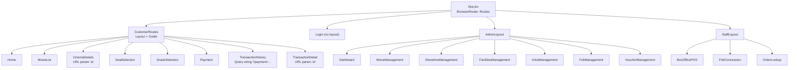

**Diagram sources**
- [App.jsx:38-81](file://frontend/src/App.jsx#L38-L81)

**Section sources**
- [App.jsx:1-84](file://frontend/src/App.jsx#L1-L84)
- [main.jsx:1-20](file://frontend/src/main.jsx#L1-L20)

## Core Components
- App shell with BrowserRouter, Routes, and nested route groups
- CustomerRoutes wrapper that renders a shared Layout with Outlet for customer pages
- Nested admin and staff layouts with Outlets for their respective pages
- Programmatic navigation via useNavigate across pages
- URL parameter handling via useParams and query string parsing via useSearchParams

Key patterns:
- CustomerRoutes pattern: a route element that wraps child routes in a shared layout
- Outlet usage: renders child routes inside the layout
- useNavigate for imperative navigation between steps in the booking flow
- useParams for resource-specific pages (transaction detail)
- useSearchParams for reading query parameters (payment status)

**Section sources**
- [App.jsx:30-36](file://frontend/src/App.jsx#L30-L36)
- [Layout.jsx:1-15](file://frontend/src/components/Layout.jsx#L1-L15)
- [AdminLayout.jsx:1-25](file://frontend/src/components/admin/AdminLayout.jsx#L1-L25)
- [StaffLayout.jsx:1-73](file://frontend/src/components/staff/StaffLayout.jsx#L1-L73)
- [MovieList.jsx:169-196](file://frontend/src/pages/MovieList.jsx#L169-L196)
- [SeatSelection.jsx:164-179](file://frontend/src/pages/SeatSelection.jsx#L164-L179)
- [SnackSelection.jsx:100-115](file://frontend/src/pages/SnackSelection.jsx#L100-L115)
- [Payment.jsx:72-79](file://frontend/src/pages/Payment.jsx#L72-L79)
- [TransactionHistory.jsx:13-16](file://frontend/src/pages/TransactionHistory.jsx#L13-L16)
- [TransactionDetail.jsx:24](file://frontend/src/pages/TransactionDetail.jsx#L24)

## Architecture Overview
The routing architecture separates concerns by user role and feature domain while sharing common layouts. The customer journey is linear and enforced through programmatic navigation and guard checks. Admin and staff areas are fully nested under their respective layouts.

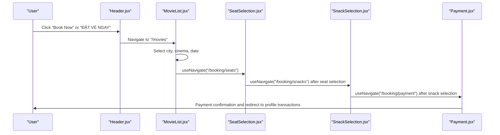

**Diagram sources**
- [Header.jsx:87-96](file://frontend/src/components/Header.jsx#L87-L96)
- [MovieList.jsx:169-196](file://frontend/src/pages/MovieList.jsx#L169-L196)
- [SeatSelection.jsx:164-179](file://frontend/src/pages/SeatSelection.jsx#L164-L179)
- [SnackSelection.jsx:100-115](file://frontend/src/pages/SnackSelection.jsx#L100-L115)
- [Payment.jsx:144-199](file://frontend/src/pages/Payment.jsx#L144-L199)

## Detailed Component Analysis

### Customer Routes and Shared Layout
- CustomerRoutes defines a wrapper layout for customer-facing pages
- Layout provides a reusable header/footer scaffold
- Outlet renders the matched child route within the layout

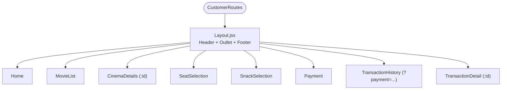

**Diagram sources**
- [App.jsx:30-53](file://frontend/src/App.jsx#L30-L53)
- [Layout.jsx:1-15](file://frontend/src/components/Layout.jsx#L1-L15)

**Section sources**
- [App.jsx:30-53](file://frontend/src/App.jsx#L30-L53)
- [Layout.jsx:1-15](file://frontend/src/components/Layout.jsx#L1-L15)

### Admin Routes and Nested Layout
- AdminLayout provides sidebar, header, and main content area with Outlet
- Index route redirects to dashboard for clean URLs
- Sub-routes cover management domains

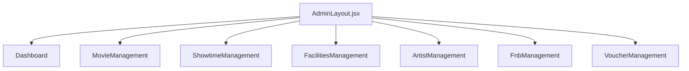

**Diagram sources**
- [App.jsx:58-68](file://frontend/src/App.jsx#L58-L68)
- [AdminLayout.jsx:1-25](file://frontend/src/components/admin/AdminLayout.jsx#L1-L25)
- [Dashboard.jsx:1-343](file://frontend/src/pages/admin/Dashboard.jsx#L1-L343)

**Section sources**
- [App.jsx:58-68](file://frontend/src/App.jsx#L58-L68)
- [AdminLayout.jsx:1-25](file://frontend/src/components/admin/AdminLayout.jsx#L1-L25)

### Staff Routes and Nested Layout
- StaffLayout provides a fixed tab bar and main content area with Outlet
- Hotkeys enable quick navigation between POS, F&B, and order lookup
- Active tab highlighting uses pathname matching

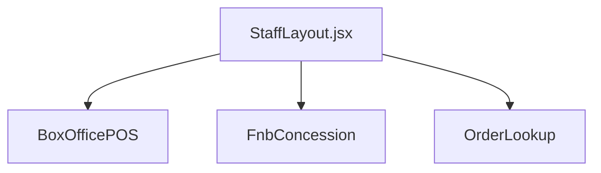

**Diagram sources**
- [App.jsx:70-76](file://frontend/src/App.jsx#L70-L76)
- [StaffLayout.jsx:5-73](file://frontend/src/components/staff/StaffLayout.jsx#L5-L73)
- [BoxOfficePOS.jsx:25-836](file://frontend/src/pages/staff/BoxOfficePOS.jsx#L25-L836)

**Section sources**
- [App.jsx:70-76](file://frontend/src/App.jsx#L70-L76)
- [StaffLayout.jsx:5-73](file://frontend/src/components/staff/StaffLayout.jsx#L5-L73)

### Customer Journeys: Movie Browsing, Seat Selection, Snack Ordering, Payment
- Movie browsing: city/cinema/date selection, then slot selection and confirmation
- Seat selection: seat map rendering, selection limits, countdown, and navigation to snacks
- Snack selection: F&B categories, quantities, totals, and navigation to payment
- Payment: buyer info, payment method selection, voucher application, and demo checkout flow

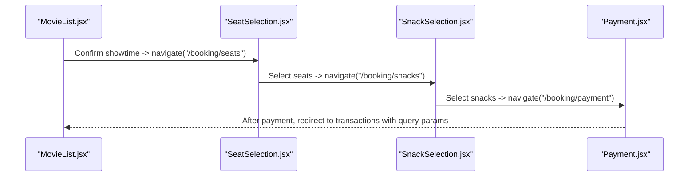

**Diagram sources**
- [MovieList.jsx:169-196](file://frontend/src/pages/MovieList.jsx#L169-L196)
- [SeatSelection.jsx:164-179](file://frontend/src/pages/SeatSelection.jsx#L164-L179)
- [SnackSelection.jsx:100-115](file://frontend/src/pages/SnackSelection.jsx#L100-L115)
- [Payment.jsx:144-199](file://frontend/src/pages/Payment.jsx#L144-L199)

**Section sources**
- [MovieList.jsx:1-475](file://frontend/src/pages/MovieList.jsx#L1-L475)
- [SeatSelection.jsx:1-365](file://frontend/src/pages/SeatSelection.jsx#L1-L365)
- [SnackSelection.jsx:1-310](file://frontend/src/pages/SnackSelection.jsx#L1-L310)
- [Payment.jsx:1-482](file://frontend/src/pages/Payment.jsx#L1-L482)

### Navigation Patterns and Guards
- Programmatic navigation: useNavigate used extensively to move between steps
- Authentication guard: Payment page checks authentication and redirects unauthenticated users to login with state
- Route protection: SeatSelection and SnackSelection pages redirect back to browsing if required selections are missing
- Query string handling: TransactionHistory reads payment status from query params to show success banner
- URL parameter handling: TransactionDetail reads paymentId from URL params

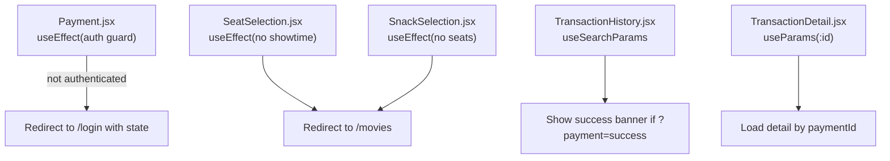

**Diagram sources**
- [Payment.jsx:72-79](file://frontend/src/pages/Payment.jsx#L72-L79)
- [SeatSelection.jsx:63-66](file://frontend/src/pages/SeatSelection.jsx#L63-L66)
- [SnackSelection.jsx:48-53](file://frontend/src/pages/SnackSelection.jsx#L48-L53)
- [TransactionHistory.jsx:13-16](file://frontend/src/pages/TransactionHistory.jsx#L13-L16)
- [TransactionDetail.jsx:24](file://frontend/src/pages/TransactionDetail.jsx#L24)

**Section sources**
- [Payment.jsx:72-79](file://frontend/src/pages/Payment.jsx#L72-L79)
- [SeatSelection.jsx:63-66](file://frontend/src/pages/SeatSelection.jsx#L63-L66)
- [SnackSelection.jsx:48-53](file://frontend/src/pages/SnackSelection.jsx#L48-L53)
- [TransactionHistory.jsx:13-16](file://frontend/src/pages/TransactionHistory.jsx#L13-L16)
- [TransactionDetail.jsx:24](file://frontend/src/pages/TransactionDetail.jsx#L24)

### Breadcrumbs, Active Link Highlighting, and Smooth Scrolling
- Breadcrumbs: BoxOfficePOS implements a breadcrumb trail that reflects current step and allows quick navigation
- Active link highlighting: Header.jsx highlights nav links based on current pathname; StaffLayout.jsx highlights active tab based on pathname
- Smooth scrolling: Not implemented in the provided files; recommended to add scroll restoration via a library or custom hook

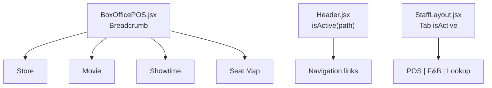

**Diagram sources**
- [BoxOfficePOS.jsx:371-400](file://frontend/src/pages/staff/BoxOfficePOS.jsx#L371-L400)
- [Header.jsx:51](file://frontend/src/components/Header.jsx#L51)
- [StaffLayout.jsx:36-46](file://frontend/src/components/staff/StaffLayout.jsx#L36-L46)

**Section sources**
- [BoxOfficePOS.jsx:371-400](file://frontend/src/pages/staff/BoxOfficePOS.jsx#L371-L400)
- [Header.jsx:51](file://frontend/src/components/Header.jsx#L51)
- [StaffLayout.jsx:36-46](file://frontend/src/components/staff/StaffLayout.jsx#L36-L46)

### Route Protection and Authentication Guards
- Payment page enforces authentication via useEffect and redirects to login with state
- Unauthenticated users are redirected to login; after login, they return to the protected route
- Additional guards prevent progression without required selections in seat/snack selection pages

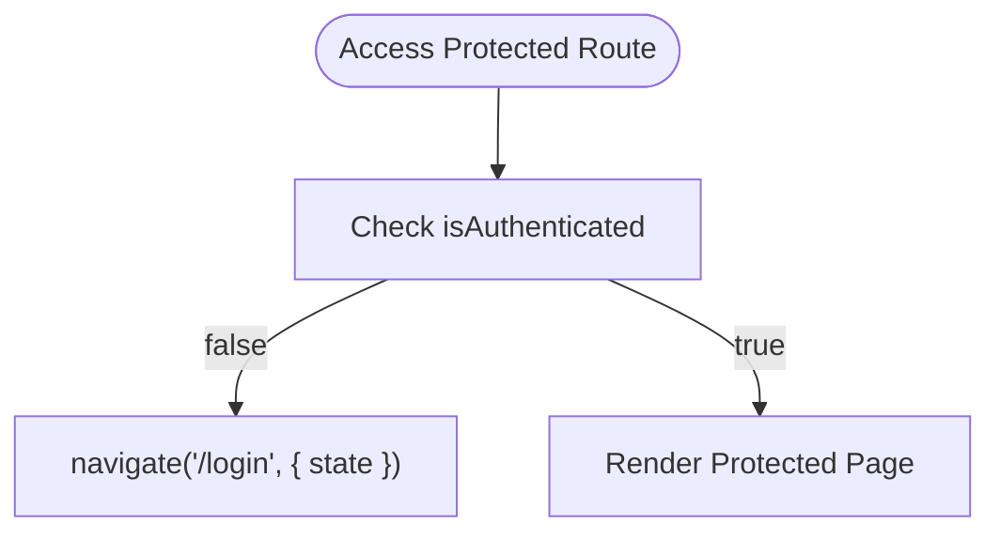

**Diagram sources**
- [Payment.jsx:72-79](file://frontend/src/pages/Payment.jsx#L72-L79)

**Section sources**
- [Payment.jsx:72-79](file://frontend/src/pages/Payment.jsx#L72-L79)

### URL Parameter Handling and Query String Management
- useParams: TransactionDetail reads paymentId from URL
- useSearchParams: TransactionHistory reads payment status from query string to conditionally render success banner

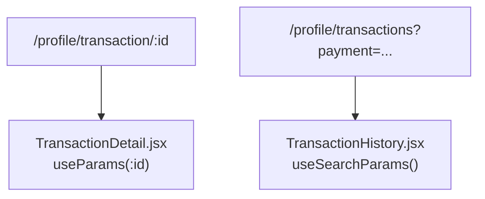

**Diagram sources**
- [TransactionDetail.jsx:24](file://frontend/src/pages/TransactionDetail.jsx#L24)
- [TransactionHistory.jsx:13-16](file://frontend/src/pages/TransactionHistory.jsx#L13-L16)

**Section sources**
- [TransactionDetail.jsx:24](file://frontend/src/pages/TransactionDetail.jsx#L24)
- [TransactionHistory.jsx:13-16](file://frontend/src/pages/TransactionHistory.jsx#L13-L16)

### Route-Based State Initialization
- Booking context: SeatSelection and SnackSelection rely on a shared booking context to pass state across steps
- Redux: Payment page reads buyer info from Redux; authentication guard uses Redux state
- State persistence: Context and Redux manage cross-route state during the booking flow

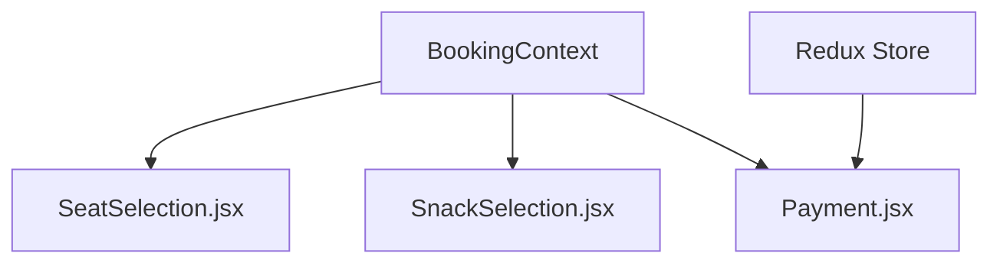

**Diagram sources**
- [SeatSelection.jsx:54](file://frontend/src/pages/SeatSelection.jsx#L54)
- [SnackSelection.jsx:42](file://frontend/src/pages/SnackSelection.jsx#L42)
- [Payment.jsx:44](file://frontend/src/pages/Payment.jsx#L44)

**Section sources**
- [SeatSelection.jsx:54](file://frontend/src/pages/SeatSelection.jsx#L54)
- [SnackSelection.jsx:42](file://frontend/src/pages/SnackSelection.jsx#L42)
- [Payment.jsx:44](file://frontend/src/pages/Payment.jsx#L44)

## Dependency Analysis
- App.jsx imports all pages and layout components and defines the route tree
- Layout components depend on shared UI elements (Header/Footer)
- Pages depend on services for data fetching and on useNavigate for navigation
- Admin and Staff layouts encapsulate role-specific UI and navigation

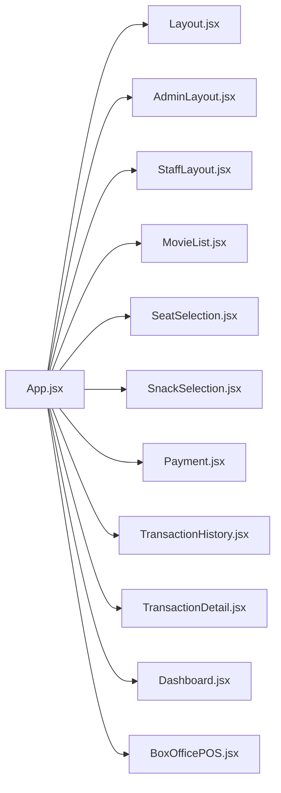

**Diagram sources**
- [App.jsx:1-84](file://frontend/src/App.jsx#L1-L84)

**Section sources**
- [App.jsx:1-84](file://frontend/src/App.jsx#L1-L84)

## Performance Considerations
- Lazy loading: Consider React.lazy and Suspense for large admin/staff pages to reduce initial bundle size
- Route-level code splitting: Split admin and staff routes into separate chunks
- Memoization: Pages already use useMemo for derived data; continue leveraging it for expensive computations
- Conditional rendering: Avoid heavy computations when routes are not active (e.g., seat loading state)
- Image optimization: Ensure poster URLs are optimized; consider responsive images and placeholders
- Scroll restoration: Implement scroll restoration to avoid unnecessary re-scrolling on route changes

[No sources needed since this section provides general guidance]

## Troubleshooting Guide
Common issues and resolutions:
- Unexpected redirects: Verify guards in Payment, SeatSelection, and SnackSelection pages
- Missing data on transaction pages: Ensure user ID exists in Redux before fetching history/detail
- Incorrect active link highlighting: Confirm pathname comparisons match actual routes
- Query string not updating: Ensure navigation preserves query parameters when redirecting

**Section sources**
- [Payment.jsx:72-79](file://frontend/src/pages/Payment.jsx#L72-L79)
- [SeatSelection.jsx:63-66](file://frontend/src/pages/SeatSelection.jsx#L63-L66)
- [SnackSelection.jsx:48-53](file://frontend/src/pages/SnackSelection.jsx#L48-L53)
- [TransactionHistory.jsx:18-47](file://frontend/src/pages/TransactionHistory.jsx#L18-L47)
- [TransactionDetail.jsx:29-47](file://frontend/src/pages/TransactionDetail.jsx#L29-L47)

## Conclusion
The routing and navigation system is cleanly structured around role-based layouts and a customer-centric booking flow. The CustomerRoutes wrapper and nested layouts provide a consistent experience, while programmatic navigation and guards ensure logical progression. URL parameter and query string handling support deep linking and post-payment redirects. With optional lazy loading and scroll restoration, the system can be further optimized for performance and UX.