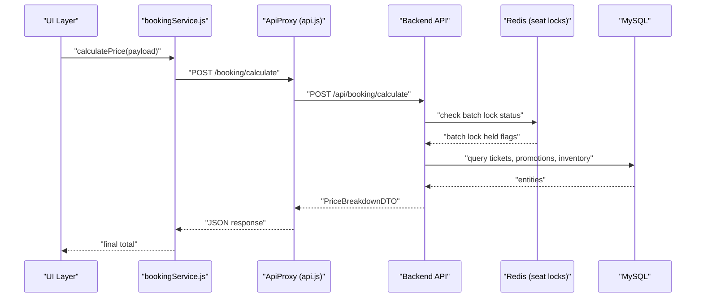
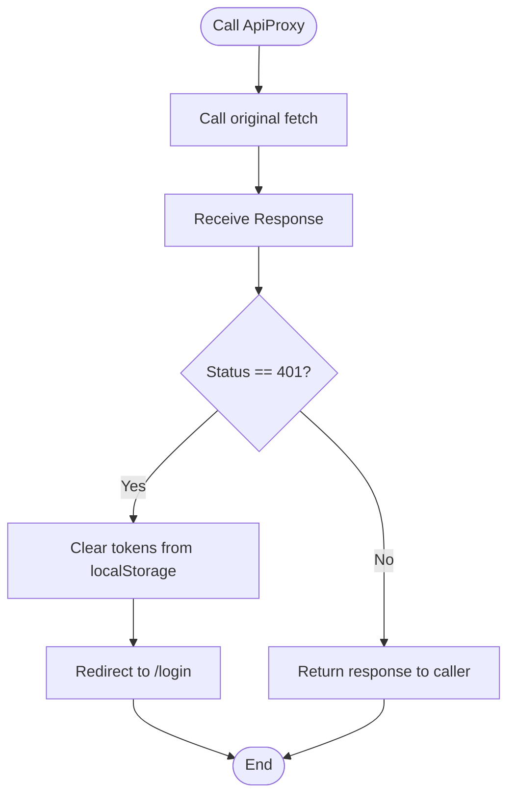
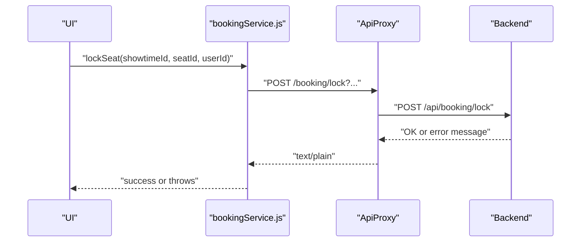
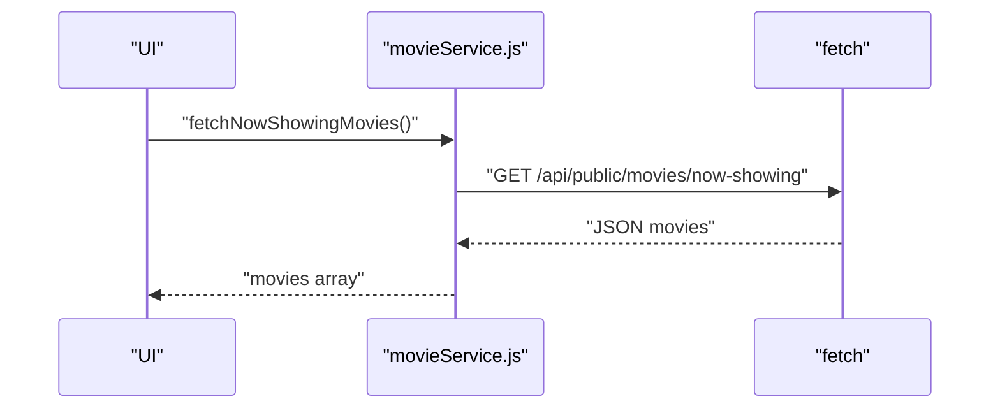
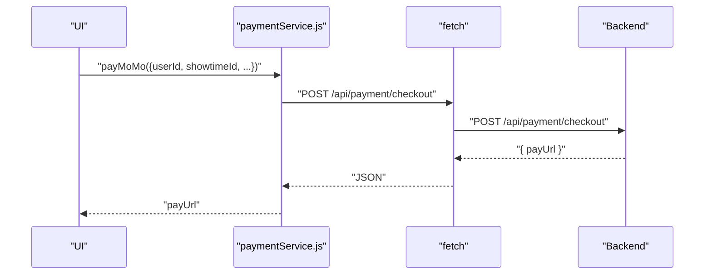
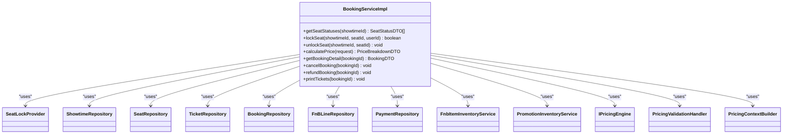
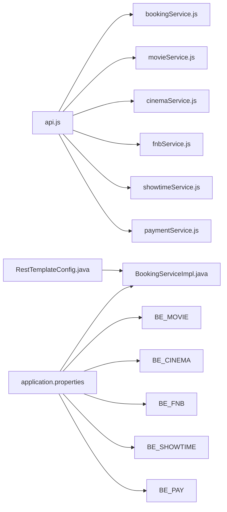

# Service Integration

<cite>
**Referenced Files in This Document**
- [frontend/src/utils/api.js](file://frontend/src/utils/api.js)
- [frontend/src/services/bookingService.js](file://frontend/src/services/bookingService.js)
- [frontend/src/services/movieService.js](file://frontend/src/services/movieService.js)
- [frontend/src/services/cinemaService.js](file://frontend/src/services/cinemaService.js)
- [frontend/src/services/fnbService.js](file://frontend/src/services/fnbService.js)
- [frontend/src/services/showtimeService.js](file://frontend/src/services/showtimeService.js)
- [frontend/src/services/paymentService.js](file://frontend/src/services/paymentService.js)
- [backend/src/main/resources/application.properties](file://backend/src/main/resources/application.properties)
- [backend/src/main/java/com/cinema/booking/config/RestTemplateConfig.java](file://backend/src/main/java/com/cinema/booking/config/RestTemplateConfig.java)
- [backend/src/main/java/com/cinema/booking/services/impl/BookingServiceImpl.java](file://backend/src/main/java/com/cinema/booking/services/impl/BookingServiceImpl.java)
- [backend/src/main/java/com/cinema/booking/services/impl/MovieServiceImpl.java](file://backend/src/main/java/com/cinema/booking/services/impl/MovieServiceImpl.java)
- [backend/src/main/java/com/cinema/booking/services/impl/CinemaServiceImpl.java](file://backend/src/main/java/com/cinema/booking/services/impl/CinemaServiceImpl.java)
- [backend/src/main/java/com/cinema/booking/services/impl/FnbItemInventoryServiceImpl.java](file://backend/src/main/java/com/cinema/booking/services/impl/FnbItemInventoryServiceImpl.java)
- [backend/src/main/java/com/cinema/booking/services/impl/ShowtimeServiceImpl.java](file://backend/src/main/java/com/cinema/booking/services/impl/ShowtimeServiceImpl.java)
- [backend/src/main/java/com/cinema/booking/services/impl/PaymentServiceImpl.java](file://backend/src/main/java/com/cinema/booking/services/impl/PaymentServiceImpl.java)
</cite>

## Table of Contents
1. [Introduction](#introduction)
2. [Project Structure](#project-structure)
3. [Core Components](#core-components)
4. [Architecture Overview](#architecture-overview)
5. [Detailed Component Analysis](#detailed-component-analysis)
6. [Dependency Analysis](#dependency-analysis)
7. [Performance Considerations](#performance-considerations)
8. [Troubleshooting Guide](#troubleshooting-guide)
9. [Conclusion](#conclusion)
10. [Appendices](#appendices)

## Introduction
This document provides comprehensive service integration guidance for the frontend services and backend APIs. It covers API communication patterns, HTTP client configuration, interceptors, error handling, authentication token management, and request retry strategies. It also documents service-layer architecture for bookingService, movieService, cinemaService, fnbService, showtimeService, and paymentService, along with practical examples of GET, POST, PUT, and DELETE operations, loading states, data transformation, caching strategies, API versioning considerations, environment-specific configurations, offline fallback strategies, testing and mocking guidelines, and performance optimization through request batching.

## Project Structure
The service integration spans two primary layers:
- Frontend services: thin clients that encapsulate HTTP calls, transform payloads, and manage tokens.
- Backend services: Spring-managed services implementing business logic, data access, and integrations (e.g., Redis seat locks, MoMo payments).

**Diagram sources**
- [frontend/src/utils/api.js:1-38](file://frontend/src/utils/api.js#L1-L38)
- [frontend/src/services/bookingService.js:1-85](file://frontend/src/services/bookingService.js#L1-L85)
- [frontend/src/services/movieService.js:1-36](file://frontend/src/services/movieService.js#L1-L36)
- [frontend/src/services/cinemaService.js:1-16](file://frontend/src/services/cinemaService.js#L1-L16)
- [frontend/src/services/fnbService.js:1-16](file://frontend/src/services/fnbService.js#L1-L16)
- [frontend/src/services/showtimeService.js:1-21](file://frontend/src/services/showtimeService.js#L1-L21)
- [frontend/src/services/paymentService.js:1-55](file://frontend/src/services/paymentService.js#L1-L55)
- [backend/src/main/resources/application.properties:1-97](file://backend/src/main/resources/application.properties#L1-L97)
- [backend/src/main/java/com/cinema/booking/config/RestTemplateConfig.java:1-19](file://backend/src/main/java/com/cinema/booking/config/RestTemplateConfig.java#L1-L19)
- [backend/src/main/java/com/cinema/booking/services/impl/BookingServiceImpl.java:1-260](file://backend/src/main/java/com/cinema/booking/services/impl/BookingServiceImpl.java#L1-L260)
- [backend/src/main/java/com/cinema/booking/services/impl/MovieServiceImpl.java:1-150](file://backend/src/main/java/com/cinema/booking/services/impl/MovieServiceImpl.java#L1-L150)
- [backend/src/main/java/com/cinema/booking/services/impl/CinemaServiceImpl.java:1-92](file://backend/src/main/java/com/cinema/booking/services/impl/CinemaServiceImpl.java#L1-L92)
- [backend/src/main/java/com/cinema/booking/services/impl/FnbItemInventoryServiceImpl.java:1-113](file://backend/src/main/java/com/cinema/booking/services/impl/FnbItemInventoryServiceImpl.java#L1-L113)
- [backend/src/main/java/com/cinema/booking/services/impl/ShowtimeServiceImpl.java:1-126](file://backend/src/main/java/com/cinema/booking/services/impl/ShowtimeServiceImpl.java#L1-L126)
- [backend/src/main/java/com/cinema/booking/services/impl/PaymentServiceImpl.java:1-69](file://backend/src/main/java/com/cinema/booking/services/impl/PaymentServiceImpl.java#L1-L69)

**Section sources**
- [frontend/src/utils/api.js:1-38](file://frontend/src/utils/api.js#L1-L38)
- [backend/src/main/resources/application.properties:1-97](file://backend/src/main/resources/application.properties#L1-L97)

## Core Components
This section outlines the frontend service layer and backend service layer, highlighting responsibilities, HTTP patterns, and error handling.

- Frontend API Utility
  - Defines the base API URL and authentication headers.
  - Provides a Proxy-based ApiProxy that intercepts responses and handles global unauthorized errors by clearing tokens and redirecting to login.
  - Ensures all authenticated requests include a Bearer token retrieved from local storage.

- Frontend Services
  - bookingService: seat status retrieval, seat locking/unlocking, price calculation, booking creation, and booking detail retrieval.
  - movieService: public movie listings, genres, and admin/detail endpoints.
  - cinemaService: public cinema and location lists.
  - fnbService: public categories and items.
  - showtimeService: public showtimes with optional filters.
  - paymentService: MoMo checkout, user payment history, demo checkout, and payment detail retrieval.

- Backend Services
  - BookingServiceImpl: seat status computation, seat lock/unlock, pricing calculation, booking detail retrieval, cancellation/refund/printing workflows.
  - MovieServiceImpl: CRUD operations for movies and cast metadata.
  - CinemaServiceImpl: CRUD operations for cinemas and locations.
  - FnbItemInventoryServiceImpl: inventory queries/reservations/releases.
  - ShowtimeServiceImpl: CRUD operations and public search with enriched DTOs.
  - PaymentServiceImpl: user payment history and payment detail retrieval.

**Section sources**
- [frontend/src/utils/api.js:1-38](file://frontend/src/utils/api.js#L1-L38)
- [frontend/src/services/bookingService.js:1-85](file://frontend/src/services/bookingService.js#L1-L85)
- [frontend/src/services/movieService.js:1-36](file://frontend/src/services/movieService.js#L1-L36)
- [frontend/src/services/cinemaService.js:1-16](file://frontend/src/services/cinemaService.js#L1-L16)
- [frontend/src/services/fnbService.js:1-16](file://frontend/src/services/fnbService.js#L1-L16)
- [frontend/src/services/showtimeService.js:1-21](file://frontend/src/services/showtimeService.js#L1-L21)
- [frontend/src/services/paymentService.js:1-55](file://frontend/src/services/paymentService.js#L1-L55)
- [backend/src/main/java/com/cinema/booking/services/impl/BookingServiceImpl.java:1-260](file://backend/src/main/java/com/cinema/booking/services/impl/BookingServiceImpl.java#L1-L260)
- [backend/src/main/java/com/cinema/booking/services/impl/MovieServiceImpl.java:1-150](file://backend/src/main/java/com/cinema/booking/services/impl/MovieServiceImpl.java#L1-L150)
- [backend/src/main/java/com/cinema/booking/services/impl/CinemaServiceImpl.java:1-92](file://backend/src/main/java/com/cinema/booking/services/impl/CinemaServiceImpl.java#L1-L92)
- [backend/src/main/java/com/cinema/booking/services/impl/FnbItemInventoryServiceImpl.java:1-113](file://backend/src/main/java/com/cinema/booking/services/impl/FnbItemInventoryServiceImpl.java#L1-L113)
- [backend/src/main/java/com/cinema/booking/services/impl/ShowtimeServiceImpl.java:1-126](file://backend/src/main/java/com/cinema/booking/services/impl/ShowtimeServiceImpl.java#L1-L126)
- [backend/src/main/java/com/cinema/booking/services/impl/PaymentServiceImpl.java:1-69](file://backend/src/main/java/com/cinema/booking/services/impl/PaymentServiceImpl.java#L1-L69)

## Architecture Overview
The frontend service layer communicates with the backend via REST endpoints. Authentication is enforced for protected routes, while public endpoints are accessible without credentials. The backend services orchestrate data access, business rules, and external integrations (e.g., Redis for seat locks, MoMo for payments).

**Diagram sources**
- [frontend/src/services/bookingService.js:42-50](file://frontend/src/services/bookingService.js#L42-L50)
- [frontend/src/utils/api.js:17-36](file://frontend/src/utils/api.js#L17-L36)
- [backend/src/main/java/com/cinema/booking/services/impl/BookingServiceImpl.java:133-149](file://backend/src/main/java/com/cinema/booking/services/impl/BookingServiceImpl.java#L133-L149)

## Detailed Component Analysis

### Frontend API Utility and Interceptors
- Base URL and headers
  - Base URL is configured for the backend API.
  - getAuthHeaders reads the Bearer token from local storage and sets Content-Type and Authorization headers.
- ApiProxy interceptor
  - Wraps the native fetch to globally intercept responses.
  - On 401 Unauthorized, clears tokens and redirects to the login page.

**Diagram sources**
- [frontend/src/utils/api.js:17-36](file://frontend/src/utils/api.js#L17-L36)

**Section sources**
- [frontend/src/utils/api.js:1-38](file://frontend/src/utils/api.js#L1-L38)

### bookingService
- Seat operations
  - fetchSeatStatuses: retrieves seat statuses for a given showtime.
  - lockSeat/unlockSeat: use Redis-backed seat locks with TTL.
- Pricing
  - calculatePrice: computes ticket and F&B totals with discounts/promotions.
- Booking lifecycle
  - getBookingDetail: fetches booking details.
  - createBooking: initiates checkout and returns a payment URL.

**Diagram sources**
- [frontend/src/services/bookingService.js:14-35](file://frontend/src/services/bookingService.js#L14-L35)
- [frontend/src/utils/api.js:17-36](file://frontend/src/utils/api.js#L17-L36)

**Section sources**
- [frontend/src/services/bookingService.js:1-85](file://frontend/src/services/bookingService.js#L1-L85)

### movieService
- Public endpoints
  - Now showing and coming soon lists.
  - Movie genres with graceful fallback.
- Admin/detail endpoints
  - Movie detail and cast members require headers.

**Diagram sources**
- [frontend/src/services/movieService.js:5-9](file://frontend/src/services/movieService.js#L5-L9)

**Section sources**
- [frontend/src/services/movieService.js:1-36](file://frontend/src/services/movieService.js#L1-L36)

### cinemaService
- Public endpoints
  - Cinemas and locations lists.

**Section sources**
- [frontend/src/services/cinemaService.js:1-16](file://frontend/src/services/cinemaService.js#L1-L16)

### fnbService
- Public endpoints
  - Categories and items lists.

**Section sources**
- [frontend/src/services/fnbService.js:1-16](file://frontend/src/services/fnbService.js#L1-L16)

### showtimeService
- Public endpoint
  - Filters by cinemaId, movieId, and date; returns enriched showtimes.

**Section sources**
- [frontend/src/services/showtimeService.js:1-21](file://frontend/src/services/showtimeService.js#L1-L21)

### paymentService
- Protected endpoints
  - payMoMo: posts checkout payload and expects a payment URL.
  - getUserPayments and getPaymentDetail: retrieve history and details.
  - demoCheckout: test checkout with success toggle.

**Diagram sources**
- [frontend/src/services/paymentService.js:10-25](file://frontend/src/services/paymentService.js#L10-L25)

**Section sources**
- [frontend/src/services/paymentService.js:1-55](file://frontend/src/services/paymentService.js#L1-L55)

### Backend Service Layer

#### Booking Service Implementation
- Seat status computation combines room seats, sold tickets, and Redis-held locks.
- Pricing validation and engine integration compute totals with promotions and inventory checks.
- Booking detail mapping aggregates tickets and F&B lines.

**Diagram sources**
- [backend/src/main/java/com/cinema/booking/services/impl/BookingServiceImpl.java:32-260](file://backend/src/main/java/com/cinema/booking/services/impl/BookingServiceImpl.java#L32-L260)

**Section sources**
- [backend/src/main/java/com/cinema/booking/services/impl/BookingServiceImpl.java:1-260](file://backend/src/main/java/com/cinema/booking/services/impl/BookingServiceImpl.java#L1-L260)

#### Movie Service Implementation
- Maps entities to DTOs and supports CRUD operations with cast metadata.

**Section sources**
- [backend/src/main/java/com/cinema/booking/services/impl/MovieServiceImpl.java:1-150](file://backend/src/main/java/com/cinema/booking/services/impl/MovieServiceImpl.java#L1-L150)

#### Cinema Service Implementation
- Maps cinema entities to DTOs with location details and supports CRUD operations.

**Section sources**
- [backend/src/main/java/com/cinema/booking/services/impl/CinemaServiceImpl.java:1-92](file://backend/src/main/java/com/cinema/booking/services/impl/CinemaServiceImpl.java#L1-L92)

#### F&B Inventory Service Implementation
- Provides inventory queries, reservations, and releases with transactional safety.

**Section sources**
- [backend/src/main/java/com/cinema/booking/services/impl/FnbItemInventoryServiceImpl.java:1-113](file://backend/src/main/java/com/cinema/booking/services/impl/FnbItemInventoryServiceImpl.java#L1-L113)

#### Showtime Service Implementation
- Creates enriched DTOs with movie and room details and supports filtering for public showtimes.

**Section sources**
- [backend/src/main/java/com/cinema/booking/services/impl/ShowtimeServiceImpl.java:1-126](file://backend/src/main/java/com/cinema/booking/services/impl/ShowtimeServiceImpl.java#L1-L126)

#### Payment Service Implementation
- Retrieves user payment history and builds enriched summary DTOs.

**Section sources**
- [backend/src/main/java/com/cinema/booking/services/impl/PaymentServiceImpl.java:1-69](file://backend/src/main/java/com/cinema/booking/services/impl/PaymentServiceImpl.java#L1-L69)

## Dependency Analysis
- Frontend
  - All services depend on the API utility for BASE_URL, headers, and the ApiProxy interceptor.
  - Authenticated services rely on getAuthHeaders to attach Bearer tokens.
- Backend
  - Services are Spring-managed and injected with repositories and other services.
  - RestTemplate is provided as a singleton bean for HTTP integrations.

**Diagram sources**
- [frontend/src/utils/api.js:1-38](file://frontend/src/utils/api.js#L1-L38)
- [frontend/src/services/bookingService.js:1-85](file://frontend/src/services/bookingService.js#L1-L85)
- [frontend/src/services/movieService.js:1-36](file://frontend/src/services/movieService.js#L1-L36)
- [frontend/src/services/cinemaService.js:1-16](file://frontend/src/services/cinemaService.js#L1-L16)
- [frontend/src/services/fnbService.js:1-16](file://frontend/src/services/fnbService.js#L1-L16)
- [frontend/src/services/showtimeService.js:1-21](file://frontend/src/services/showtimeService.js#L1-L21)
- [frontend/src/services/paymentService.js:1-55](file://frontend/src/services/paymentService.js#L1-L55)
- [backend/src/main/java/com/cinema/booking/config/RestTemplateConfig.java:1-19](file://backend/src/main/java/com/cinema/booking/config/RestTemplateConfig.java#L1-L19)
- [backend/src/main/resources/application.properties:1-97](file://backend/src/main/resources/application.properties#L1-L97)

**Section sources**
- [backend/src/main/java/com/cinema/booking/config/RestTemplateConfig.java:1-19](file://backend/src/main/java/com/cinema/booking/config/RestTemplateConfig.java#L1-L19)
- [backend/src/main/resources/application.properties:1-97](file://backend/src/main/resources/application.properties#L1-L97)

## Performance Considerations
- Request batching
  - Seat status retrieval uses batch lock checks to minimize round trips.
  - Inventory service supports batch quantity lookups for F&B items.
- Caching strategies
  - Frontend: consider caching public lists (movies, showtimes, F&B) with ETags or Last-Modified headers and local storage TTL.
  - Backend: pricing engine and movie service can leverage caching proxies or in-memory caches for repeated queries.
- Retry mechanisms
  - Implement exponential backoff for transient failures on external integrations (e.g., MoMo).
  - Use Idempotency-Key for idempotent POST operations (e.g., checkout).
- Concurrency and locks
  - Seat locks use Redis with TTL to prevent stale locks; ensure lock acquisition is retried with jitter.

[No sources needed since this section provides general guidance]

## Troubleshooting Guide
- 401 Unauthorized
  - Symptom: Immediate logout and redirect to login.
  - Resolution: Refresh token flow or re-authenticate; ensure token storage is consistent.
- Seat lock conflicts
  - Symptom: Seat already held or sold.
  - Resolution: Re-query seat status and retry after unlock.
- Insufficient inventory
  - Symptom: Reservation fails due to low stock.
  - Resolution: Show available quantities and adjust selections.
- Payment URL missing
  - Symptom: Empty or invalid payUrl.
  - Resolution: Validate checkout payload and retry; check backend logs.

**Section sources**
- [frontend/src/utils/api.js:24-30](file://frontend/src/utils/api.js#L24-L30)
- [frontend/src/services/bookingService.js:14-35](file://frontend/src/services/bookingService.js#L14-L35)
- [frontend/src/services/fnbService.js:1-16](file://frontend/src/services/fnbService.js#L1-L16)
- [frontend/src/services/paymentService.js:21-24](file://frontend/src/services/paymentService.js#L21-L24)

## Conclusion
The service integration architecture cleanly separates frontend HTTP clients and interceptors from backend business services. Authentication is centralized via Bearer tokens, and global 401 handling ensures secure session management. The backend services implement robust pricing, inventory, and state transitions, while the frontend services focus on user-facing operations and data presentation. Following the outlined patterns for error handling, caching, retries, and testing will improve reliability and performance.

[No sources needed since this section summarizes without analyzing specific files]

## Appendices

### API Communication Patterns and Examples
- GET examples
  - Public: fetchNowShowingMovies, fetchComingSoonMovies, fetchCinemas, fetchLocations, fetchFnBCategories, fetchFnBItems, fetchPublicShowtimes.
  - Protected: getUserPayments, getPaymentDetail, getBookingDetail.
- POST examples
  - calculatePrice, lockSeat, unlockSeat, createBooking, payMoMo, demoCheckout.
- PUT examples
  - Update operations are supported by backend services (e.g., MovieServiceImpl.updateMovie, CinemaServiceImpl.updateCinema, ShowtimeServiceImpl.updateShowtime).
- DELETE examples
  - Delete operations are supported by backend services (e.g., MovieServiceImpl.deleteMovie, CinemaServiceImpl.deleteCinema, ShowtimeServiceImpl.deleteShowtime).

**Section sources**
- [frontend/src/services/movieService.js:5-35](file://frontend/src/services/movieService.js#L5-L35)
- [frontend/src/services/cinemaService.js:5-15](file://frontend/src/services/cinemaService.js#L5-L15)
- [frontend/src/services/fnbService.js:5-15](file://frontend/src/services/fnbService.js#L5-L15)
- [frontend/src/services/showtimeService.js:10-20](file://frontend/src/services/showtimeService.js#L10-L20)
- [frontend/src/services/bookingService.js:6-84](file://frontend/src/services/bookingService.js#L6-L84)
- [frontend/src/services/paymentService.js:10-54](file://frontend/src/services/paymentService.js#L10-L54)
- [backend/src/main/java/com/cinema/booking/services/impl/MovieServiceImpl.java:136-148](file://backend/src/main/java/com/cinema/booking/services/impl/MovieServiceImpl.java#L136-L148)
- [backend/src/main/java/com/cinema/booking/services/impl/CinemaServiceImpl.java:72-90](file://backend/src/main/java/com/cinema/booking/services/impl/CinemaServiceImpl.java#L72-L90)
- [backend/src/main/java/com/cinema/booking/services/impl/ShowtimeServiceImpl.java:92-113](file://backend/src/main/java/com/cinema/booking/services/impl/ShowtimeServiceImpl.java#L92-L113)

### Authentication Token Management
- Token retrieval: getAuthHeaders reads the Bearer token from local storage.
- Global 401 handling: ApiProxy clears tokens and redirects to login on unauthorized responses.

**Section sources**
- [frontend/src/utils/api.js:3-9](file://frontend/src/utils/api.js#L3-L9)
- [frontend/src/utils/api.js:24-30](file://frontend/src/utils/api.js#L24-L30)

### Request Retry Mechanisms
- Implement exponential backoff for transient failures.
- Use Idempotency-Key for idempotent POST operations (e.g., checkout).
- Consider circuit breaker patterns for external services (e.g., MoMo).

[No sources needed since this section provides general guidance]

### Loading States and Data Transformation
- Loading states: surface pending states during seat lock/unlock and price calculation.
- Data transformation: backend enriches DTOs (e.g., ShowtimeDTO with movie and room details); frontend normalizes payloads for UI consumption.

[No sources needed since this section provides general guidance]

### Caching Strategies
- Frontend caching: cache public lists with TTL and ETags.
- Backend caching: cache pricing and frequently accessed metadata.

[No sources needed since this section provides general guidance]

### API Versioning and Environment Configurations
- API versioning: introduce /api/v1/ prefix and maintain backward compatibility.
- Environment-specific configs: use environment variables for base URLs, secrets, and external endpoints.

**Section sources**
- [backend/src/main/resources/application.properties:1-97](file://backend/src/main/resources/application.properties#L1-L97)

### Offline Fallback Strategies
- Cache-first approach for public lists.
- Queue offline actions and sync when online.

[No sources needed since this section provides general guidance]

### Service Testing and Mocking
- Frontend tests: mock fetch and ApiProxy to simulate network conditions and 401 scenarios.
- Backend tests: use @MockBean for repositories and external services; test pricing validation chains and state transitions.

[No sources needed since this section provides general guidance]

### Performance Optimization Through Request Batching
- Batch seat lock checks and inventory queries.
- Combine related GET requests where feasible.

**Section sources**
- [backend/src/main/java/com/cinema/booking/services/impl/BookingServiceImpl.java:91-92](file://backend/src/main/java/com/cinema/booking/services/impl/BookingServiceImpl.java#L91-L92)
- [backend/src/main/java/com/cinema/booking/services/impl/FnbItemInventoryServiceImpl.java:40-48](file://backend/src/main/java/com/cinema/booking/services/impl/FnbItemInventoryServiceImpl.java#L40-L48)