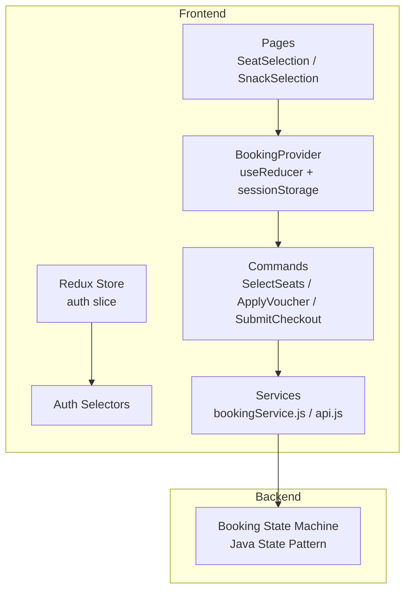
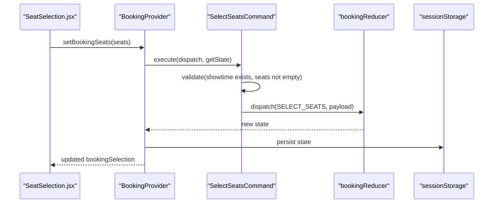
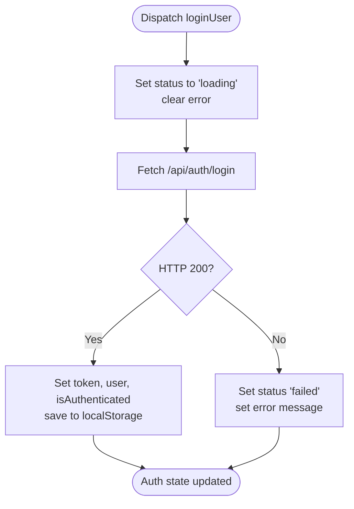
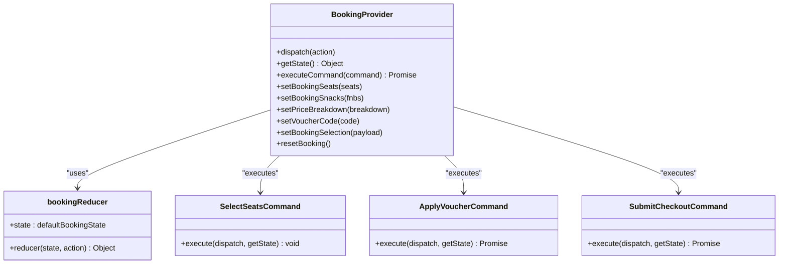
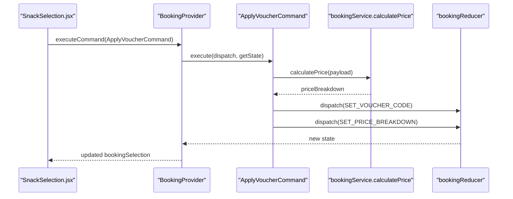
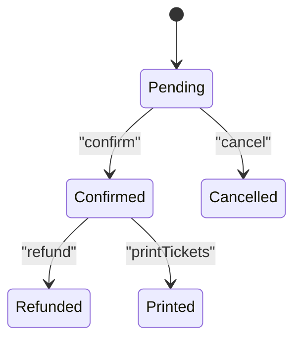
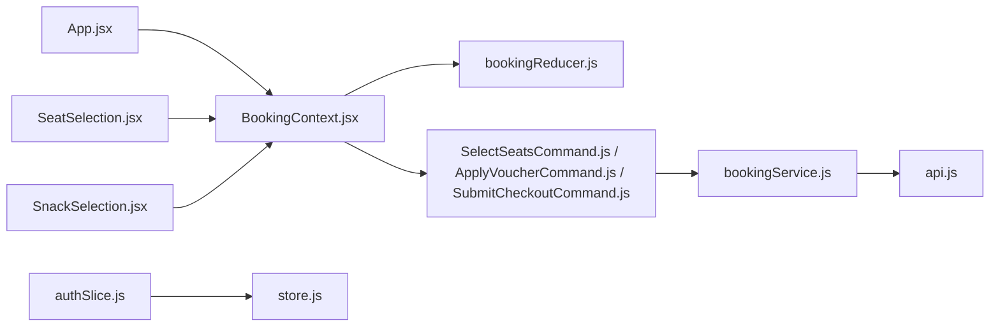

# State Management

<cite>
**Referenced Files in This Document**
- [store.js](file://frontend/src/store/store.js)
- [authSlice.js](file://frontend/src/store/authSlice.js)
- [BookingContext.jsx](file://frontend/src/contexts/BookingContext.jsx)
- [bookingReducer.js](file://frontend/src/booking/bookingReducer.js)
- [bookingActionTypes.js](file://frontend/src/booking/bookingActionTypes.js)
- [SelectSeatsCommand.js](file://frontend/src/booking/commands/SelectSeatsCommand.js)
- [ApplyVoucherCommand.js](file://frontend/src/booking/commands/ApplyVoucherCommand.js)
- [SubmitCheckoutCommand.js](file://frontend/src/booking/commands/SubmitCheckoutCommand.js)
- [App.jsx](file://frontend/src/App.jsx)
- [SeatSelection.jsx](file://frontend/src/pages/SeatSelection.jsx)
- [SnackSelection.jsx](file://frontend/src/pages/SnackSelection.jsx)
- [bookingService.js](file://frontend/src/services/bookingService.js)
- [api.js](file://frontend/src/utils/api.js)
- [BookingContext.java](file://backend/src/main/java/com/cinema/booking/patterns/state/BookingContext.java)
- [BookingState.java](file://backend/src/main/java/com/cinema/booking/patterns/state/BookingState.java)
- [PendingState.java](file://backend/src/main/java/com/cinema/booking/patterns/state/PendingState.java)
- [ConfirmedState.java](file://backend/src/main/java/com/cinema/booking/patterns/state/ConfirmedState.java)
</cite>

## Table of Contents
1. [Introduction](#introduction)
2. [Project Structure](#project-structure)
3. [Core Components](#core-components)
4. [Architecture Overview](#architecture-overview)
5. [Detailed Component Analysis](#detailed-component-analysis)
6. [Dependency Analysis](#dependency-analysis)
7. [Performance Considerations](#performance-considerations)
8. [Troubleshooting Guide](#troubleshooting-guide)
9. [Conclusion](#conclusion)
10. [Appendices](#appendices)

## Introduction
This document explains the state management architecture for the booking flow and authentication, focusing on:
- Redux Toolkit implementation for authentication state
- Custom React Context provider for the booking flow
- Command pattern integration for robust state updates
- Practical examples of selectors, dispatch patterns, and async flows
- Persistence strategies (localStorage/sessionStorage), synchronization with backend APIs, and debugging tips
- Performance optimization and memory leak prevention
- Guidelines for state normalization and async state handling

## Project Structure
The state management spans two primary areas:
- Frontend Redux store for authentication
- Frontend React Context + Reducer + Command pattern for booking flow

**Diagram sources**
- [store.js:1-11](file://frontend/src/store/store.js#L1-L11)
- [authSlice.js:145-251](file://frontend/src/store/authSlice.js#L145-L251)
- [BookingContext.jsx:31-147](file://frontend/src/contexts/BookingContext.jsx#L31-L147)
- [bookingReducer.js:25-63](file://frontend/src/booking/bookingReducer.js#L25-L63)
- [SelectSeatsCommand.js:9-29](file://frontend/src/booking/commands/SelectSeatsCommand.js#L9-L29)
- [ApplyVoucherCommand.js:10-39](file://frontend/src/booking/commands/ApplyVoucherCommand.js#L10-L39)
- [SubmitCheckoutCommand.js:13-70](file://frontend/src/booking/commands/SubmitCheckoutCommand.js#L13-L70)
- [bookingService.js:1-85](file://frontend/src/services/bookingService.js#L1-L85)
- [api.js:17-36](file://frontend/src/utils/api.js#L17-L36)
- [BookingContext.java:7-37](file://backend/src/main/java/com/cinema/booking/patterns/state/BookingContext.java#L7-L37)

**Section sources**
- [store.js:1-11](file://frontend/src/store/store.js#L1-L11)
- [authSlice.js:145-251](file://frontend/src/store/authSlice.js#L145-L251)
- [BookingContext.jsx:31-147](file://frontend/src/contexts/BookingContext.jsx#L31-L147)
- [bookingReducer.js:25-63](file://frontend/src/booking/bookingReducer.js#L25-L63)
- [bookingActionTypes.js:5-15](file://frontend/src/booking/bookingActionTypes.js#L5-L15)
- [SelectSeatsCommand.js:9-29](file://frontend/src/booking/commands/SelectSeatsCommand.js#L9-L29)
- [ApplyVoucherCommand.js:10-39](file://frontend/src/booking/commands/ApplyVoucherCommand.js#L10-L39)
- [SubmitCheckoutCommand.js:13-70](file://frontend/src/booking/commands/SubmitCheckoutCommand.js#L13-L70)
- [bookingService.js:1-85](file://frontend/src/services/bookingService.js#L1-L85)
- [api.js:17-36](file://frontend/src/utils/api.js#L17-L36)
- [BookingContext.java:7-37](file://backend/src/main/java/com/cinema/booking/patterns/state/BookingContext.java#L7-L37)

## Core Components
- Redux store with a single auth slice managing JWT tokens, user profile, and registration flow
- BookingProvider using useReducer to manage booking flow state with sessionStorage persistence
- Command pattern classes encapsulating actions and validations for seat selection, pricing calculation, and checkout submission
- Utility proxies and helpers for secure API calls and local persistence

Key responsibilities:
- Authentication: login, logout, profile fetch, and registration with async thunks and localStorage persistence
- Booking flow: seat selection, snack ordering, price breakdown, voucher application, and checkout submission
- Integration: services and API utilities for backend synchronization

**Section sources**
- [store.js:1-11](file://frontend/src/store/store.js#L1-L11)
- [authSlice.js:130-142](file://frontend/src/store/authSlice.js#L130-L142)
- [BookingContext.jsx:31-147](file://frontend/src/contexts/BookingContext.jsx#L31-L147)
- [bookingReducer.js:7-15](file://frontend/src/booking/bookingReducer.js#L7-L15)
- [bookingActionTypes.js:5-15](file://frontend/src/booking/bookingActionTypes.js#L5-L15)

## Architecture Overview
The frontend state architecture combines Redux for global auth state and a custom context/provider for the booking flow. The booking flow integrates a Command pattern to encapsulate actions and validations, while services coordinate with backend APIs.

**Diagram sources**
- [SeatSelection.jsx:164-179](file://frontend/src/pages/SeatSelection.jsx#L164-L179)
- [BookingContext.jsx:62-64](file://frontend/src/contexts/BookingContext.jsx#L62-L64)
- [SelectSeatsCommand.js:14-28](file://frontend/src/booking/commands/SelectSeatsCommand.js#L14-L28)
- [bookingReducer.js:36-37](file://frontend/src/booking/bookingReducer.js#L36-L37)
- [BookingContext.jsx:54-56](file://frontend/src/contexts/BookingContext.jsx#L54-L56)

## Detailed Component Analysis

### Authentication State (Redux Toolkit)
The auth slice manages:
- Token and user identity (id, email, roles, type)
- Authentication status and errors
- Registration status and messages
- Persisted state in localStorage with helpers for save/load/clear

Action types and async thunks:
- loginUser: posts credentials, returns JWT and user roles
- googleLogin: authenticates via Google ID token
- registerUser: registers a new customer
- fetchProfile: loads extended profile after login

Selectors:
- selectIsAuthenticated, selectCurrentUser, selectToken, selectAuthStatus, selectAuthError, selectRegisterStatus, selectRegisterError, selectRegisterSuccess

Persistence:
- On successful login, token and user are saved to localStorage
- On logout, localStorage is cleared

**Diagram sources**
- [authSlice.js:38-54](file://frontend/src/store/authSlice.js#L38-L54)
- [authSlice.js:167-187](file://frontend/src/store/authSlice.js#L167-L187)

Practical usage examples:
- Dispatch patterns: call the exported thunk and handle fulfilled/rejected branches
- Selector usage: import selectors and use them in components to derive UI state
- Logout: dispatch the logout action to reset auth state and clear localStorage

**Section sources**
- [authSlice.js:7-29](file://frontend/src/store/authSlice.js#L7-L29)
- [authSlice.js:38-101](file://frontend/src/store/authSlice.js#L38-L101)
- [authSlice.js:167-236](file://frontend/src/store/authSlice.js#L167-L236)
- [authSlice.js:241-250](file://frontend/src/store/authSlice.js#L241-L250)
- [store.js:1-11](file://frontend/src/store/store.js#L1-L11)

### Booking Flow State (Custom Context Provider)
The BookingProvider uses useReducer with a dedicated booking reducer and sessionStorage persistence. It exposes:
- Legacy setter wrappers for backward compatibility
- getState and dispatch for direct reducer control
- executeCommand to run Command objects
- A normalized bookingSelection object for convenient access

Default state includes:
- selectedMovie, selectedCinema, selectedShowtime
- selectedSeats and selectedFnbs
- priceBreakdown and voucherCode

**Diagram sources**
- [BookingContext.jsx:31-147](file://frontend/src/contexts/BookingContext.jsx#L31-L147)
- [bookingReducer.js:25-63](file://frontend/src/booking/bookingReducer.js#L25-L63)
- [SelectSeatsCommand.js:9-29](file://frontend/src/booking/commands/SelectSeatsCommand.js#L9-L29)
- [ApplyVoucherCommand.js:10-39](file://frontend/src/booking/commands/ApplyVoucherCommand.js#L10-L39)
- [SubmitCheckoutCommand.js:13-70](file://frontend/src/booking/commands/SubmitCheckoutCommand.js#L13-L70)

Practical examples:
- Seat selection: use setBookingSeats to update selectedSeats; the provider persists to sessionStorage
- Snack ordering: use setBookingSnacks to update selectedFnbs; derived totals computed in SnackSelection
- Price breakdown: use ApplyVoucherCommand to compute price breakdown via backend service
- Checkout: use SubmitCheckoutCommand to submit booking and receive payment URL or result

**Section sources**
- [BookingContext.jsx:31-147](file://frontend/src/contexts/BookingContext.jsx#L31-L147)
- [bookingReducer.js:7-15](file://frontend/src/booking/bookingReducer.js#L7-L15)
- [bookingActionTypes.js:5-15](file://frontend/src/booking/bookingActionTypes.js#L5-L15)

### Booking Reducer Implementation
The reducer defines pure state transitions for each action type. It ensures immutability and predictable updates across the booking flow.

State transitions:
- SELECT_MOVIE, SELECT_CINEMA, SELECT_SHOWTIME, SELECT_SEATS, SET_FNBS
- SET_PRICE_BREAKDOWN, SET_VOUCHER_CODE, SET_BOOKING_SELECTION, RESET

Complexity:
- Each action is O(1) with shallow spread updates
- Reset returns to defaultBookingState

Edge cases handled:
- SET_BOOKING_SELECTION merges partial selections
- RESET restores default shape

**Section sources**
- [bookingReducer.js:25-63](file://frontend/src/booking/bookingReducer.js#L25-L63)
- [bookingActionTypes.js:5-15](file://frontend/src/booking/bookingActionTypes.js#L5-L15)

### Command Pattern Integration
Commands encapsulate actions and validation logic, ensuring consistent state updates and error handling.

- SelectSeatsCommand validates showtime presence and non-empty seat list before dispatching SELECT_SEATS
- ApplyVoucherCommand validates prerequisites, dispatches SET_VOUCHER_CODE, calls calculatePrice, and dispatches SET_PRICE_BREAKDOWN
- SubmitCheckoutCommand validates prerequisites, builds payload, calls createBooking or demo checkout, and returns results

**Diagram sources**
- [SnackSelection.jsx:100-115](file://frontend/src/pages/SnackSelection.jsx#L100-L115)
- [BookingContext.jsx:62-64](file://frontend/src/contexts/BookingContext.jsx#L62-L64)
- [ApplyVoucherCommand.js:15-38](file://frontend/src/booking/commands/ApplyVoucherCommand.js#L15-L38)
- [bookingService.js:42-50](file://frontend/src/services/bookingService.js#L42-L50)
- [bookingReducer.js:42-46](file://frontend/src/booking/bookingReducer.js#L42-L46)

**Section sources**
- [SelectSeatsCommand.js:14-28](file://frontend/src/booking/commands/SelectSeatsCommand.js#L14-L28)
- [ApplyVoucherCommand.js:15-38](file://frontend/src/booking/commands/ApplyVoucherCommand.js#L15-L38)
- [SubmitCheckoutCommand.js:19-69](file://frontend/src/booking/commands/SubmitCheckoutCommand.js#L19-L69)

### Backend State Machine (Reference)
The backend implements a state machine for booking lifecycle. While not directly used in frontend state, understanding it helps align frontend actions with backend transitions.

States:
- PendingState: confirm/cancel allowed; print/refund not allowed
- ConfirmedState: confirm not allowed; cancel requires refund; print allowed; refund transitions to RefundedState

**Diagram sources**
- [BookingContext.java:7-37](file://backend/src/main/java/com/cinema/booking/patterns/state/BookingContext.java#L7-L37)
- [PendingState.java:3-29](file://backend/src/main/java/com/cinema/booking/patterns/state/PendingState.java#L3-L29)
- [ConfirmedState.java:3-30](file://backend/src/main/java/com/cinema/booking/patterns/state/ConfirmedState.java#L3-L30)

**Section sources**
- [BookingContext.java:7-37](file://backend/src/main/java/com/cinema/booking/patterns/state/BookingContext.java#L7-L37)
- [BookingState.java:3-11](file://backend/src/main/java/com/cinema/booking/patterns/state/BookingState.java#L3-L11)
- [PendingState.java:3-29](file://backend/src/main/java/com/cinema/booking/patterns/state/PendingState.java#L3-L29)
- [ConfirmedState.java:3-30](file://backend/src/main/java/com/cinema/booking/patterns/state/ConfirmedState.java#L3-L30)

## Dependency Analysis
- App wraps routing with BookingProvider so all booking pages share the same provider
- SeatSelection and SnackSelection consume BookingContext and use legacy setters or executeCommand
- Services depend on api.js for authenticated requests and BASE_URL
- Auth slice depends on localStorage for persistence and on async thunks for network calls

**Diagram sources**
- [App.jsx:38-81](file://frontend/src/App.jsx#L38-L81)
- [BookingContext.jsx:31-147](file://frontend/src/contexts/BookingContext.jsx#L31-L147)
- [SeatSelection.jsx:52-56](file://frontend/src/pages/SeatSelection.jsx#L52-L56)
- [SnackSelection.jsx:39-43](file://frontend/src/pages/SnackSelection.jsx#L39-L43)
- [bookingReducer.js:25-63](file://frontend/src/booking/bookingReducer.js#L25-L63)
- [SelectSeatsCommand.js:9-29](file://frontend/src/booking/commands/SelectSeatsCommand.js#L9-L29)
- [ApplyVoucherCommand.js:10-39](file://frontend/src/booking/commands/ApplyVoucherCommand.js#L10-L39)
- [SubmitCheckoutCommand.js:13-70](file://frontend/src/booking/commands/SubmitCheckoutCommand.js#L13-L70)
- [bookingService.js:1-85](file://frontend/src/services/bookingService.js#L1-L85)
- [api.js:17-36](file://frontend/src/utils/api.js#L17-L36)
- [authSlice.js:145-251](file://frontend/src/store/authSlice.js#L145-L251)
- [store.js:1-11](file://frontend/src/store/store.js#L1-L11)

**Section sources**
- [App.jsx:38-81](file://frontend/src/App.jsx#L38-L81)
- [bookingService.js:1-85](file://frontend/src/services/bookingService.js#L1-L85)
- [api.js:17-36](file://frontend/src/utils/api.js#L17-L36)
- [authSlice.js:145-251](file://frontend/src/store/authSlice.js#L145-L251)

## Performance Considerations
- Prefer immutable updates in reducers to enable efficient re-renders
- Memoize derived values (e.g., totals) using useMemo to avoid recomputation
- Persist only essential booking state to sessionStorage to minimize overhead
- Debounce or batch UI-driven updates when selecting many seats
- Use selectors to avoid unnecessary re-renders by subscribing to minimal state slices
- Avoid frequent localStorage writes; rely on sessionStorage for transient booking state

## Troubleshooting Guide
Common issues and remedies:
- 401 Unauthorized responses: the ApiProxy automatically clears localStorage and redirects to login
- Seat selection errors: ensure showtime is selected before choosing seats
- Voucher application errors: ensure seats are selected before applying a voucher
- Checkout failures: verify required fields and handle rejected promises from SubmitCheckoutCommand

Debugging tips:
- Use Redux DevTools to inspect auth slice state and async thunk lifecycles
- Add logging around executeCommand to trace command execution and validation
- Verify sessionStorage keys for booking state and localStorage keys for auth

**Section sources**
- [api.js:17-36](file://frontend/src/utils/api.js#L17-L36)
- [SelectSeatsCommand.js:17-25](file://frontend/src/booking/commands/SelectSeatsCommand.js#L17-L25)
- [ApplyVoucherCommand.js:18-20](file://frontend/src/booking/commands/ApplyVoucherCommand.js#L18-L20)
- [SubmitCheckoutCommand.js:22-28](file://frontend/src/booking/commands/SubmitCheckoutCommand.js#L22-L28)

## Conclusion
The application employs a clean separation of concerns:
- Redux Toolkit handles authentication state with async thunks, selectors, and localStorage persistence
- A custom BookingProvider with useReducer and sessionStorage manages the booking flow
- The Command pattern enforces validation and encapsulates complex actions
- Services and API utilities centralize backend integration and error handling

This design supports scalability, maintainability, and predictable state transitions across the booking journey.

## Appendices

### Practical Examples Index
- Authentication
  - Dispatch login: [authSlice.js:38-54](file://frontend/src/store/authSlice.js#L38-L54)
  - Selectors: [authSlice.js:242-249](file://frontend/src/store/authSlice.js#L242-L249)
  - Logout: [authSlice.js:149-156](file://frontend/src/store/authSlice.js#L149-L156)
- Booking Flow
  - Seat selection: [SeatSelection.jsx:164-179](file://frontend/src/pages/SeatSelection.jsx#L164-L179)
  - Snack ordering: [SnackSelection.jsx:100-115](file://frontend/src/pages/SnackSelection.jsx#L100-L115)
  - Apply voucher: [ApplyVoucherCommand.js:15-38](file://frontend/src/booking/commands/ApplyVoucherCommand.js#L15-L38)
  - Submit checkout: [SubmitCheckoutCommand.js:19-69](file://frontend/src/booking/commands/SubmitCheckoutCommand.js#L19-L69)

### State Normalization and Async Handling Guidelines
- Normalize nested booking data (selectedSeats, selectedFnbs) to arrays of IDs for easier updates
- Use optimistic updates for UI responsiveness; reconcile with server responses via extraReducers or post-call handlers
- For async flows, track loading/success/error per operation to avoid race conditions
- Keep validation close to actions (Command pattern) to prevent invalid state transitions