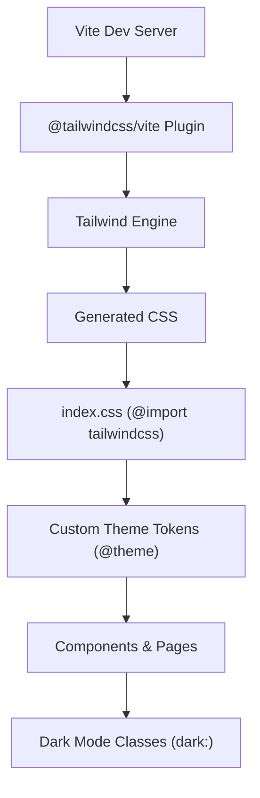
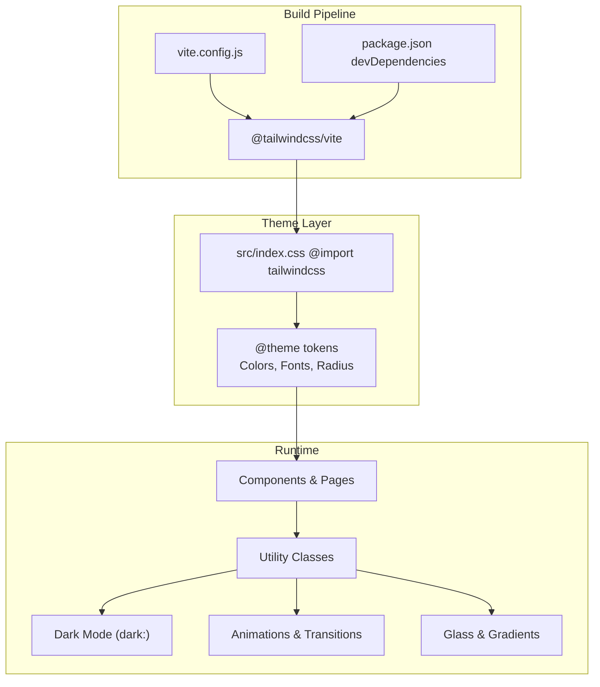
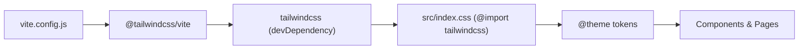

# Styling and Theming

<cite>
**Referenced Files in This Document**
- [package.json](file://frontend/package.json)
- [vite.config.js](file://frontend/vite.config.js)
- [src/index.css](file://frontend/src/index.css)
- [src/App.css](file://frontend/src/App.css)
- [src/components/Layout.jsx](file://frontend/src/components/Layout.jsx)
- [src/components/Header.jsx](file://frontend/src/components/Header.jsx)
- [src/components/Footer.jsx](file://frontend/src/components/Footer.jsx)
- [src/components/MovieCard.jsx](file://frontend/src/components/MovieCard.jsx)
- [src/pages/Home.jsx](file://frontend/src/pages/Home.jsx)
- [src/pages/SeatSelection.jsx](file://frontend/src/pages/SeatSelection.jsx)
- [src/pages/SnackSelection.jsx](file://frontend/src/pages/SnackSelection.jsx)
- [src/store/store.js](file://frontend/src/store/store.js)
- [src/store/authSlice.js](file://frontend/src/store/authSlice.js)
- [src/contexts/BookingContext.jsx](file://frontend/src/contexts/BookingContext.jsx)
- [src/services/bookingService.js](file://frontend/src/services/bookingService.js)
- [src/services/cinemaService.js](file://frontend/src/services/cinemaService.js)
- [src/services/fnbService.js](file://frontend/src/services/fnbService.js)
- [src/services/movieService.js](file://frontend/src/services/movieService.js)
- [src/services/showtimeService.js](file://frontend/src/services/showtimeService.js)
</cite>

## Table of Contents
1. [Introduction](#introduction)
2. [Project Structure](#project-structure)
3. [Core Components](#core-components)
4. [Architecture Overview](#architecture-overview)
5. [Detailed Component Analysis](#detailed-component-analysis)
6. [Dependency Analysis](#dependency-analysis)
7. [Performance Considerations](#performance-considerations)
8. [Troubleshooting Guide](#troubleshooting-guide)
9. [Conclusion](#conclusion)
10. [Appendices](#appendices)

## Introduction
This document explains the styling and theming approach used in the frontend. It covers the utility-first methodology with Tailwind CSS, custom CSS extensions, responsive design patterns, color schemes, typography, spacing conventions, and component styling strategies. It also documents the Tailwind configuration, dark mode implementation, theme customization, and performance optimization techniques such as purged CSS and critical CSS extraction. Finally, it provides guidelines for maintainable styling, naming conventions, and accessibility compliance.

## Project Structure
The styling system is organized around:
- Tailwind CSS integration via Vite and the official Tailwind plugin
- A centralized theme definition using CSS variables and Tailwind’s @theme directive
- Utility-first Tailwind classes applied across components and pages
- Custom CSS for animations, gradients, glassmorphism effects, and layout helpers
- Dark mode support through Tailwind’s dark variant and semantic color tokens

**Diagram sources**
- [vite.config.js:1-15](file://frontend/vite.config.js#L1-L15)
- [package.json:23-36](file://frontend/package.json#L23-L36)
- [src/index.css:1-60](file://frontend/src/index.css#L1-L60)

**Section sources**
- [vite.config.js:1-15](file://frontend/vite.config.js#L1-L15)
- [package.json:23-36](file://frontend/package.json#L23-L36)
- [src/index.css:1-60](file://frontend/src/index.css#L1-L60)

## Core Components
- Tailwind integration is configured via the Vite plugin and enabled through the main stylesheet import.
- The theme is defined centrally using Tailwind’s @theme directive with color tokens, font families, and radius scales.
- Dark mode is supported via Tailwind’s dark: variant and semantic color tokens.
- Custom CSS adds reusable utilities for glass panels, gradients, animations, and layout helpers.

Key implementation references:
- Tailwind plugin registration and Vite configuration
- Central theme tokens and base styles
- Dark mode classes and semantic tokens
- Custom utilities for glass, gradients, animations, and layout

**Section sources**
- [vite.config.js:1-15](file://frontend/vite.config.js#L1-L15)
- [package.json:23-36](file://frontend/package.json#L23-L36)
- [src/index.css:1-60](file://frontend/src/index.css#L1-L60)
- [src/index.css:62-152](file://frontend/src/index.css#L62-L152)

## Architecture Overview
The styling pipeline integrates Tailwind with Vite, applies a central theme, and leverages dark mode and utility classes across components and pages.

**Diagram sources**
- [vite.config.js:1-15](file://frontend/vite.config.js#L1-L15)
- [package.json:23-36](file://frontend/package.json#L23-L36)
- [src/index.css:1-60](file://frontend/src/index.css#L1-L60)
- [src/index.css:62-152](file://frontend/src/index.css#L62-L152)

## Detailed Component Analysis

### Tailwind Integration and Theme
- Tailwind is integrated via the official Vite plugin and enabled by importing Tailwind in the main stylesheet.
- The theme defines semantic tokens for colors, fonts, and radii, enabling consistent design across components.
- Dark mode is supported through Tailwind’s dark: variant and semantic color tokens.

Practical examples:
- Using dark variants on layout containers and interactive elements
- Applying semantic color tokens for backgrounds, borders, and text
- Leveraging font tokens for consistent typography

**Section sources**
- [vite.config.js:1-15](file://frontend/vite.config.js#L1-L15)
- [package.json:23-36](file://frontend/package.json#L23-L36)
- [src/index.css:1-60](file://frontend/src/index.css#L1-L60)

### Layout and Responsive Patterns
- The layout uses a flex-based container with a sticky header and footer, ensuring mobile-first responsiveness.
- Grid and flex utilities are used extensively for responsive layouts, with breakpoints applied via Tailwind utilities.
- Components adapt to different screen sizes using responsive modifiers (e.g., md:, lg:).

Examples:
- Header navigation adapts from stacked to horizontal layout
- Movie cards and promotional grids use responsive grid classes
- Seat map and sidebar split into two columns on larger screens

**Section sources**
- [src/components/Layout.jsx:1-15](file://frontend/src/components/Layout.jsx#L1-L15)
- [src/components/Header.jsx:60-267](file://frontend/src/components/Header.jsx#L60-L267)
- [src/pages/Home.jsx:452-560](file://frontend/src/pages/Home.jsx#L452-L560)
- [src/pages/SeatSelection.jsx:204-365](file://frontend/src/pages/SeatSelection.jsx#L204-L365)
- [src/pages/SnackSelection.jsx:132-310](file://frontend/src/pages/SnackSelection.jsx#L132-L310)

### Color Schemes and Semantic Tokens
- The theme defines a comprehensive palette with primary, secondary, tertiary, surface, error, and inverse tokens.
- Semantic tokens are used for backgrounds, surfaces, text, and borders, enabling consistent theming.
- Dark mode tokens are applied via the dark: variant to switch color schemes automatically.

Examples:
- Background and surface tokens for light/dark themes
- Primary gradient tokens for CTAs and highlights
- Status-specific tokens for seat types and badges

**Section sources**
- [src/index.css:3-60](file://frontend/src/index.css#L3-L60)
- [src/components/MovieCard.jsx:60-156](file://frontend/src/components/MovieCard.jsx#L60-L156)
- [src/pages/SeatSelection.jsx:7-16](file://frontend/src/pages/SeatSelection.jsx#L7-L16)

### Typography System
- Font families are defined via @theme tokens for headline, body, and label styles.
- Typography utilities are applied consistently across components for headings, captions, and body text.
- Responsive typography is achieved using Tailwind’s text utilities with breakpoint modifiers.

Examples:
- Headings use bold weights and tight tracking
- Body text uses readable line heights and appropriate sizes
- Labels and small text use compact tokens for dense UIs

**Section sources**
- [src/index.css:52-54](file://frontend/src/index.css#L52-L54)
- [src/components/Header.jsx:80-82](file://frontend/src/components/Header.jsx#L80-L82)
- [src/pages/Home.jsx:299-304](file://frontend/src/pages/Home.jsx#L299-L304)

### Spacing Conventions
- Consistent spacing is achieved using Tailwind’s spacing scale and padding/margin utilities.
- Components use padding and gap utilities to create rhythm and alignment.
- Responsive spacing is applied using breakpoint-specific utilities.

Examples:
- Section paddings and margins for content areas
- Grid gaps for card layouts
- Sticky positioning with top offsets for sidebars

**Section sources**
- [src/components/Footer.jsx:5-72](file://frontend/src/components/Footer.jsx#L5-L72)
- [src/pages/Home.jsx:453-492](file://frontend/src/pages/Home.jsx#L453-L492)
- [src/pages/SeatSelection.jsx:280-365](file://frontend/src/pages/SeatSelection.jsx#L280-L365)

### Component Styling Strategies
- Utility-first approach: classes are composed directly on JSX elements for readability and maintainability.
- Dark mode variants are applied per component to ensure contrast and accessibility.
- Interactive states (hover, focus, active) are styled using Tailwind’s state utilities.
- Animations and transitions are implemented via Tailwind utilities and custom keyframes.

Examples:
- Header with backdrop blur and dark variant
- Movie cards with overlay transitions and hover effects
- Seat map with dynamic state classes and legends

**Section sources**
- [src/components/Header.jsx:60-177](file://frontend/src/components/Header.jsx#L60-L177)
- [src/components/MovieCard.jsx:60-156](file://frontend/src/components/MovieCard.jsx#L60-L156)
- [src/pages/SeatSelection.jsx:204-365](file://frontend/src/pages/SeatSelection.jsx#L204-L365)

### Dark Mode Implementation
- Dark mode is toggled via Tailwind’s dark: variant classes applied to layout containers and components.
- Semantic tokens switch automatically based on the dark mode state.
- Interactive elements adjust contrast and shadows for readability in dark environments.

Examples:
- Dark variant on header and layout containers
- Dark variant on cards and sidebars
- Automatic text and border adjustments

**Section sources**
- [src/components/Header.jsx:60-177](file://frontend/src/components/Header.jsx#L60-L177)
- [src/components/MovieCard.jsx:60-156](file://frontend/src/components/MovieCard.jsx#L60-L156)
- [src/pages/SeatSelection.jsx:184-365](file://frontend/src/pages/SeatSelection.jsx#L184-L365)

### Animation and Transitions
- Tailwind utilities provide built-in transitions for opacity, transform, and shadow.
- Custom keyframes are defined in the stylesheet for complex animations (e.g., slide-up).
- Interactive elements use transitions for hover and focus states.

Examples:
- Header background transitions on scroll
- Card hover effects with scaling and glow
- Animated slide-ups for hero content and notifications

**Section sources**
- [src/components/Header.jsx:60-66](file://frontend/src/components/Header.jsx#L60-L66)
- [src/components/MovieCard.jsx:82-140](file://frontend/src/components/MovieCard.jsx#L82-L140)
- [src/index.css:127-147](file://frontend/src/index.css#L127-L147)

### Responsive Design Patterns
- Responsive patterns leverage Tailwind’s breakpoint utilities to adapt layouts across devices.
- Components use grid and flex utilities with responsive modifiers for optimal viewing on mobile and desktop.
- Media queries are minimized in favor of utility classes.

Examples:
- Navigation transforms from stacked to horizontal
- Grid layouts for movie listings and promotional cards
- Two-column layout for seat map and sidebar on larger screens

**Section sources**
- [src/components/Header.jsx:180-264](file://frontend/src/components/Header.jsx#L180-L264)
- [src/pages/Home.jsx:452-560](file://frontend/src/pages/Home.jsx#L452-L560)
- [src/pages/SeatSelection.jsx:204-365](file://frontend/src/pages/SeatSelection.jsx#L204-L365)

### CSS-in-JS Alternatives and styled-components
- The project does not use CSS-in-JS libraries or styled-components. Styling relies entirely on Tailwind utilities and custom CSS.
- All visual styling is applied directly to JSX elements using Tailwind classes.

**Section sources**
- [src/components/Layout.jsx:1-15](file://frontend/src/components/Layout.jsx#L1-L15)
- [src/components/Header.jsx:1-270](file://frontend/src/components/Header.jsx#L1-L270)
- [src/components/Footer.jsx:1-72](file://frontend/src/components/Footer.jsx#L1-L72)
- [src/components/MovieCard.jsx:1-156](file://frontend/src/components/MovieCard.jsx#L1-L156)
- [src/pages/Home.jsx:1-560](file://frontend/src/pages/Home.jsx#L1-L560)
- [src/pages/SeatSelection.jsx:1-365](file://frontend/src/pages/SeatSelection.jsx#L1-L365)
- [src/pages/SnackSelection.jsx:1-310](file://frontend/src/pages/SnackSelection.jsx#L1-L310)

## Dependency Analysis
The styling stack depends on Tailwind CSS and the Vite plugin for build-time processing. Theme tokens are centralized in the main stylesheet, and components consume these tokens via utility classes.

**Diagram sources**
- [vite.config.js:1-15](file://frontend/vite.config.js#L1-L15)
- [package.json:23-36](file://frontend/package.json#L23-L36)
- [src/index.css:1-60](file://frontend/src/index.css#L1-L60)

**Section sources**
- [vite.config.js:1-15](file://frontend/vite.config.js#L1-L15)
- [package.json:23-36](file://frontend/package.json#L23-L36)
- [src/index.css:1-60](file://frontend/src/index.css#L1-L60)

## Performance Considerations
- Purged CSS: Tailwind’s purge removes unused styles in production builds. Ensure all class usage is accounted for in templates and components.
- Critical CSS extraction: Extract critical styles for above-the-fold content to improve initial render performance.
- Bundle size reduction: Prefer utility classes over custom CSS where possible; reuse shared utilities to minimize duplication.
- Minimize custom keyframes and animations: Keep animations lightweight and scoped to avoid unnecessary repaints.

[No sources needed since this section provides general guidance]

## Troubleshooting Guide
Common styling issues and resolutions:
- Dark mode not applying: Verify dark: variant classes are present on layout containers and semantic tokens are defined.
- Missing theme tokens: Ensure @theme tokens are declared in the main stylesheet and imported correctly.
- Animation glitches: Confirm keyframes are defined and transitions are not conflicting with layout shifts.
- Responsive layout breaks: Check breakpoint utilities and ensure media queries are not overriding Tailwind classes unintentionally.

**Section sources**
- [src/index.css:1-60](file://frontend/src/index.css#L1-L60)
- [src/components/Header.jsx:60-177](file://frontend/src/components/Header.jsx#L60-L177)
- [src/index.css:127-147](file://frontend/src/index.css#L127-L147)

## Conclusion
The project follows a robust utility-first approach with Tailwind CSS, centralized theme tokens, and dark mode support. Components are styled with consistent spacing, typography, and color systems, while responsive patterns ensure adaptability across devices. Performance is optimized through purged CSS and minimal custom styles. The guidelines below help maintain consistency and accessibility.

## Appendices

### Practical Examples Index
- Responsive layouts: Header navigation, movie grids, seat map and sidebar
- Dark mode: Layout containers, cards, and interactive elements
- Theme customization: Semantic tokens, gradients, and animations
- Accessibility: Contrast checks, focus states, and readable typography

[No sources needed since this section aggregates previously cited examples]