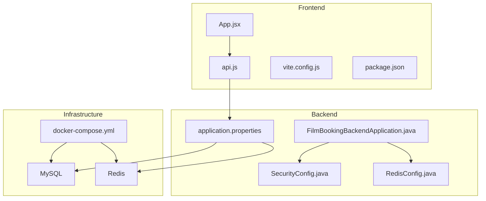
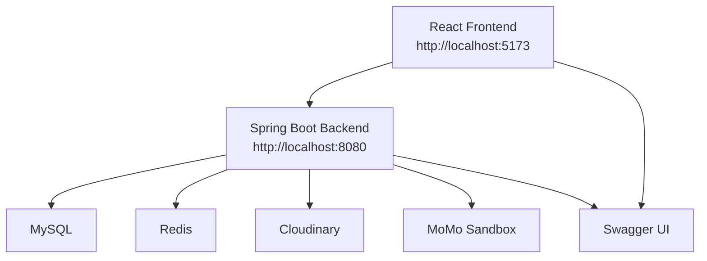
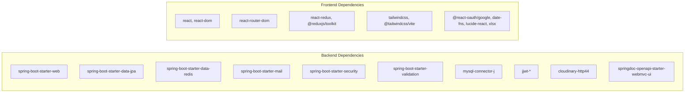

# Getting Started

<cite>
**Referenced Files in This Document**
- [README.md](file://README.md)
- [HUONG_DAN_CHAY_DU_AN_MOI.md](file://HUONG_DAN_CHAY_DU_AN_MOI.md)
- [docker-compose.yml](file://docker-compose.yml)
- [database_schema.sql](file://database_schema.sql)
- [mock_data.sql](file://mock_data.sql)
- [backend/src/main/resources/application.properties](file://backend/src/main/resources/application.properties)
- [backend/src/main/java/com/cinema/booking/FilmBookingBackendApplication.java](file://backend/src/main/java/com/cinema/booking/FilmBookingBackendApplication.java)
- [backend/src/main/java/com/cinema/booking/config/SecurityConfig.java](file://backend/src/main/java/com/cinema/booking/config/SecurityConfig.java)
- [backend/src/main/java/com/cinema/booking/config/RedisConfig.java](file://backend/src/main/java/com/cinema/booking/config/RedisConfig.java)
- [backend/pom.xml](file://backend/pom.xml)
- [backend/src/test/java/com/cinema/booking/FilmBookingBackendApplicationTests.java](file://backend/src/test/java/com/cinema/booking/FilmBookingBackendApplicationTests.java)
- [frontend/package.json](file://frontend/package.json)
- [frontend/vite.config.js](file://frontend/vite.config.js)
- [frontend/src/utils/api.js](file://frontend/src/utils/api.js)
- [frontend/src/App.jsx](file://frontend/src/App.jsx)
</cite>

## Table of Contents
1. [Introduction](#introduction)
2. [Project Structure](#project-structure)
3. [Prerequisites and System Requirements](#prerequisites-and-system-requirements)
4. [Installation Guide](#installation-guide)
5. [Environment Configuration](#environment-configuration)
6. [Running the Application](#running-the-application)
7. [Docker Deployment](#docker-deployment)
8. [Database Initialization](#database-initialization)
9. [Redis Configuration](#redis-configuration)
10. [Development Environment Setup](#development-environment-setup)
11. [Running Tests](#running-tests)
12. [Accessing the Application](#accessing-the-application)
13. [Architecture Overview](#architecture-overview)
14. [Detailed Component Analysis](#detailed-component-analysis)
15. [Dependency Analysis](#dependency-analysis)
16. [Performance Considerations](#performance-considerations)
17. [Troubleshooting Guide](#troubleshooting-guide)
18. [Verification Steps](#verification-steps)
19. [Conclusion](#conclusion)

## Introduction
This guide helps you set up and run the cinema booking system locally. It covers prerequisites, installation for backend and frontend, environment configuration, Docker deployment, database and Redis setup, development workflow, testing, and troubleshooting. The system integrates a React frontend, Spring Boot backend, MySQL, and Redis, with third-party payment sandbox integrations and Cloudinary image storage.

## Project Structure
The repository is organized into:
- backend: Spring Boot application with controllers, services, repositories, configurations, and domain models
- frontend: React application with routing, booking flow, admin/staff dashboards, and services
- docker-compose.yml: Orchestration for MySQL and Redis
- database_schema.sql and mock_data.sql: Database schema and seed data
- Root documentation and UML/patterns documentation

**Diagram sources**
- [backend/src/main/java/com/cinema/booking/FilmBookingBackendApplication.java:1-14](file://backend/src/main/java/com/cinema/booking/FilmBookingBackendApplication.java#L1-L14)
- [backend/src/main/resources/application.properties:1-97](file://backend/src/main/resources/application.properties#L1-L97)
- [backend/src/main/java/com/cinema/booking/config/SecurityConfig.java:1-82](file://backend/src/main/java/com/cinema/booking/config/SecurityConfig.java#L1-L82)
- [backend/src/main/java/com/cinema/booking/config/RedisConfig.java:1-55](file://backend/src/main/java/com/cinema/booking/config/RedisConfig.java#L1-L55)
- [frontend/src/App.jsx:1-84](file://frontend/src/App.jsx#L1-L84)
- [frontend/src/utils/api.js:1-38](file://frontend/src/utils/api.js#L1-L38)
- [frontend/vite.config.js:1-15](file://frontend/vite.config.js#L1-L15)
- [frontend/package.json:1-39](file://frontend/package.json#L1-L39)
- [docker-compose.yml:1-34](file://docker-compose.yml#L1-L34)

**Section sources**
- [README.md:1-197](file://README.md#L1-L197)
- [HUONG_DAN_CHAY_DU_AN_MOI.md:1-151](file://HUONG_DAN_CHAY_DU_AN_MOI.md#L1-L151)

## Prerequisites and System Requirements
- Operating systems: Windows, macOS, Linux
- Git
- Docker and Docker Compose
- Java 17
- Node.js 18+ (recommended 20+)
- npm 9+

Notes:
- The backend uses Spring Boot 4.0.4 and Java 17.
- The frontend uses Vite, React 19, Tailwind CSS, and related dependencies.

**Section sources**
- [HUONG_DAN_CHAY_DU_AN_MOI.md:5-12](file://HUONG_DAN_CHAY_DU_AN_MOI.md#L5-L12)
- [backend/pom.xml:1-108](file://backend/pom.xml#L1-L108)
- [frontend/package.json:1-39](file://frontend/package.json#L1-L39)

## Installation Guide
Step-by-step installation for backend and frontend:

Backend (Spring Boot):
1. Change to the backend directory.
2. Run the Spring Boot application using Maven wrapper.

Frontend (React/Vite):
1. Change to the frontend directory.
2. Install dependencies using npm.
3. Start the development server.

Ports:
- Backend runs on port 8080 by default.
- Frontend runs on port 5173 by default.

**Section sources**
- [HUONG_DAN_CHAY_DU_AN_MOI.md:103-127](file://HUONG_DAN_CHAY_DU_AN_MOI.md#L103-L127)
- [backend/src/main/resources/application.properties:39-40](file://backend/src/main/resources/application.properties#L39-L40)
- [frontend/vite.config.js:1-15](file://frontend/vite.config.js#L1-L15)

## Environment Configuration
Use a **`.env` file** at the repository root (recommended) or under `backend/`. Spring Boot imports `optional:../.env` then `optional:./.env` when the process working directory is `backend/`. Vite uses `envDir` pointing at the repo root for the frontend.

Important variables mapped from `application.properties`:
- Database: DB_URL, DB_USERNAME, DB_PASSWORD
- Frontend origin for CORS: FRONTEND_URL
- JWT: JWT_SECRET
- Cloudinary: CLOUDINARY_CLOUD_NAME, CLOUDINARY_API_KEY, CLOUDINARY_API_SECRET
- Redis: REDIS_HOST, REDIS_PORT, REDIS_USERNAME, REDIS_PASSWORD, REDIS_TTL_SECONDS
- MoMo Sandbox: DEV_MOMO_ENDPOINT, DEV_ACCESS_KEY, DEV_PARTNER_CODE, DEV_SECRET_KEY, MOMO_RETURN_URL, MOMO_NOTIFY_URL, MOMO_DEV_PAYMENT_OPTION_ALL_PAYMENT_SUCCESS

Important frontend variables:
- VITE_GOOGLE_CLIENT_ID

Notes:
- Do not commit .env files to version control.
- The backend reads environment variables via Spring’s property import mechanism.

**Section sources**
- [HUONG_DAN_CHAY_DU_AN_MOI.md:20-71](file://HUONG_DAN_CHAY_DU_AN_MOI.md#L20-L71)
- [backend/src/main/resources/application.properties:3-97](file://backend/src/main/resources/application.properties#L3-L97)

## Running the Application
After starting backend and frontend:
- Open the frontend at http://localhost:5173
- Verify API availability at http://localhost:8080
- Test metadata endpoints to confirm backend is reachable

Common CORS fix:
- Ensure FRONTEND_URL matches the frontend origin in the root `.env`.

**Section sources**
- [HUONG_DAN_CHAY_DU_AN_MOI.md:128-133](file://HUONG_DAN_CHAY_DU_AN_MOI.md#L128-L133)

## Docker Deployment
Start infrastructure containers:
- docker compose up -d

Services:
- MySQL: exposed on localhost:3307 (internal 3306)
- Redis: exposed on localhost:6379

Volumes:
- mysql_data and redis_data persist data across runs.

Health checks:
- MySQL healthcheck pings the database with root credentials.

Reset data:
- docker compose down -v followed by docker compose up -d

**Section sources**
- [HUONG_DAN_CHAY_DU_AN_MOI.md:72-102](file://HUONG_DAN_CHAY_DU_AN_MOI.md#L72-L102)
- [docker-compose.yml:1-34](file://docker-compose.yml#L1-L34)

## Database Initialization
Schema and seed data are automatically imported when Docker starts:
- database_schema.sql initializes the schema
- mock_data.sql seeds test data

To reset:
- docker compose down -v
- docker compose up -d

Manual import (optional):
- Connect to MySQL and run the schema and seed SQL files if not using Docker.

**Section sources**
- [HUONG_DAN_CHAY_DU_AN_MOI.md:85-89](file://HUONG_DAN_CHAY_DU_AN_MOI.md#L85-L89)
- [docker-compose.yml:11-14](file://docker-compose.yml#L11-L14)
- [database_schema.sql:1-200](file://database_schema.sql#L1-L200)
- [mock_data.sql:1-200](file://mock_data.sql#L1-L200)

## Redis Configuration
Redis is configured for seat locking and caching:
- Host, port, username, password are loaded from environment variables
- JSON serialization for cached objects
- TTL seconds configurable via environment variable

Integration points:
- Seat locking adapter and seat lock provider in backend services
- Dynamic pricing engine and caching strategies

**Section sources**
- [backend/src/main/resources/application.properties:58-66](file://backend/src/main/resources/application.properties#L58-L66)
- [backend/src/main/java/com/cinema/booking/config/RedisConfig.java:1-55](file://backend/src/main/java/com/cinema/booking/config/RedisConfig.java#L1-L55)

## Development Environment Setup
Recommended setup:
- IDE: IntelliJ IDEA or VS Code
- Backend: Import Maven project; run FilmBookingBackendApplication
- Frontend: Install dependencies; run dev server
- Docker: Keep MySQL and Redis running during development

Frontend build and preview:
- npm run build
- npm run preview

**Section sources**
- [frontend/package.json:6-11](file://frontend/package.json#L6-L11)
- [backend/src/main/java/com/cinema/booking/FilmBookingBackendApplication.java:1-14](file://backend/src/main/java/com/cinema/booking/FilmBookingBackendApplication.java#L1-L14)

## Running Tests
Backend tests:
- Spring Boot test context loads automatically
- Run tests via Maven or IDE test runner

Frontend tests:
- Add Jest or React Testing Library as needed
- Configure Vite test environment if extending

**Section sources**
- [backend/src/test/java/com/cinema/booking/FilmBookingBackendApplicationTests.java:1-14](file://backend/src/test/java/com/cinema/booking/FilmBookingBackendApplicationTests.java#L1-L14)
- [backend/pom.xml:86-89](file://backend/pom.xml#L86-L89)

## Accessing the Application
- Frontend: http://localhost:5173
- Backend: http://localhost:8080
- Swagger/OpenAPI: http://localhost:8080/swagger-ui.html

Routing highlights:
- Customer routes under main layout
- Admin routes under /admin
- Staff routes under /staff

**Section sources**
- [frontend/src/App.jsx:38-84](file://frontend/src/App.jsx#L38-L84)
- [backend/src/main/resources/application.properties:64-76](file://backend/src/main/resources/application.properties#L64-L76)

## Architecture Overview
High-level architecture:
- React frontend communicates with Spring Boot REST APIs
- Spring Boot connects to MySQL and Redis
- Security filters enforce JWT-based authentication and CORS
- MoMo sandbox integration for payments
- Cloudinary for media uploads

**Diagram sources**
- [frontend/src/App.jsx:38-84](file://frontend/src/App.jsx#L38-L84)
- [backend/src/main/resources/application.properties:64-97](file://backend/src/main/resources/application.properties#L64-L97)
- [backend/src/main/java/com/cinema/booking/config/SecurityConfig.java:50-79](file://backend/src/main/java/com/cinema/booking/config/SecurityConfig.java#L50-L79)

## Detailed Component Analysis

### Backend Application Bootstrap
- Main entry point initializes Spring Boot application context.

**Section sources**
- [backend/src/main/java/com/cinema/booking/FilmBookingBackendApplication.java:1-14](file://backend/src/main/java/com/cinema/booking/FilmBookingBackendApplication.java#L1-L14)

### Security Configuration
- Stateless sessions
- JWT filter integration
- Permissive endpoints for public/auth/metadata
- Admin/Staff protected endpoints
- CORS enabled via configuration source

**Section sources**
- [backend/src/main/java/com/cinema/booking/config/SecurityConfig.java:1-82](file://backend/src/main/java/com/cinema/booking/config/SecurityConfig.java#L1-L82)

### Redis Configuration
- Lettuce connection factory
- JSON serialization for cached objects
- Key/value serializers configured

**Section sources**
- [backend/src/main/java/com/cinema/booking/config/RedisConfig.java:1-55](file://backend/src/main/java/com/cinema/booking/config/RedisConfig.java#L1-L55)

### Frontend API Proxy and Routing
- Centralized fetch proxy handles 401 Unauthorized globally
- Base URL for API requests
- React Router routes for customer, admin, and staff

**Section sources**
- [frontend/src/utils/api.js:1-38](file://frontend/src/utils/api.js#L1-L38)
- [frontend/src/App.jsx:38-84](file://frontend/src/App.jsx#L38-L84)

## Dependency Analysis
Backend dependencies (selected):
- Spring Boot starters: web, data-jpa, data-redis, mail, security, validation
- MySQL connector
- JWT libraries
- Cloudinary HTTP client
- OpenAPI/Swagger UI
- Test starter

Frontend dependencies (selected):
- React 19, React Router DOM, React Redux
- Tailwind CSS plugin for Vite
- Date-fns, Lucide React, XLSX

**Diagram sources**
- [backend/pom.xml:18-89](file://backend/pom.xml#L18-L89)
- [frontend/package.json:12-38](file://frontend/package.json#L12-L38)

**Section sources**
- [backend/pom.xml:18-89](file://backend/pom.xml#L18-L89)
- [frontend/package.json:12-38](file://frontend/package.json#L12-L38)

## Performance Considerations
- Use Redis for seat locking and caching to reduce database load
- Enable SQL logging in development for debugging; disable in production
- Optimize frontend rendering with React memoization and lazy loading
- Use CDN for images via Cloudinary
- Monitor MoMo webhook latency and retry strategies

[No sources needed since this section provides general guidance]

## Troubleshooting Guide
Common issues and resolutions:
- Port conflicts (3307, 6379, 8080, 5173): change ports or stop conflicting processes
- Database connection failures: verify DB_URL, DB_USERNAME, DB_PASSWORD; ensure MySQL container healthy
- Google login errors: confirm VITE_GOOGLE_CLIENT_ID
- MoMo IPN/local testing: require a public URL for MOMO_NOTIFY_URL (e.g., ngrok)
- CORS errors: ensure FRONTEND_URL matches frontend origin

**Section sources**
- [HUONG_DAN_CHAY_DU_AN_MOI.md:134-151](file://HUONG_DAN_CHAY_DU_AN_MOI.md#L134-L151)

## Verification Steps
After setup:
- Confirm frontend loads at http://localhost:5173
- Call a metadata endpoint via backend (e.g., GET /api/metadata/...)
- Check Swagger UI at http://localhost:8080/swagger-ui.html
- Validate database connectivity and Redis reachability
- Test login and basic navigation flows

**Section sources**
- [HUONG_DAN_CHAY_DU_AN_MOI.md:128-133](file://HUONG_DAN_CHAY_DU_AN_MOI.md#L128-L133)

## Conclusion
You now have a complete local development environment for the cinema booking system. Use Docker for infrastructure, configure environment variables, and run both backend and frontend to explore features. Refer to the troubleshooting section for quick fixes and the verification steps to confirm a successful setup.

[No sources needed since this section summarizes without analyzing specific files]