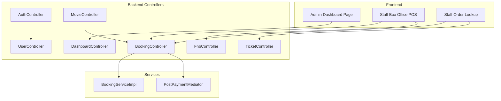
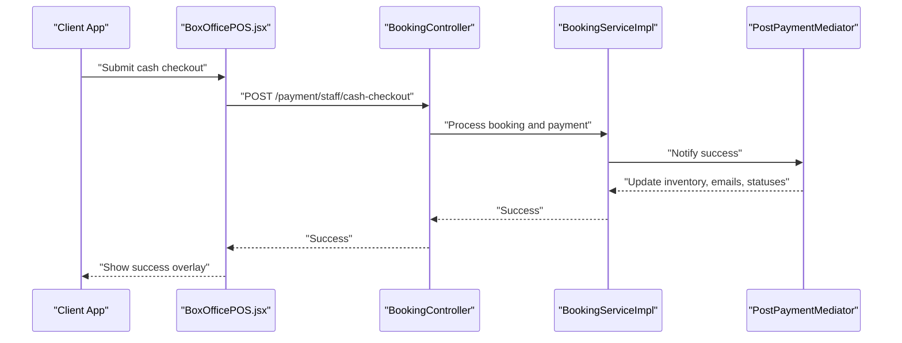
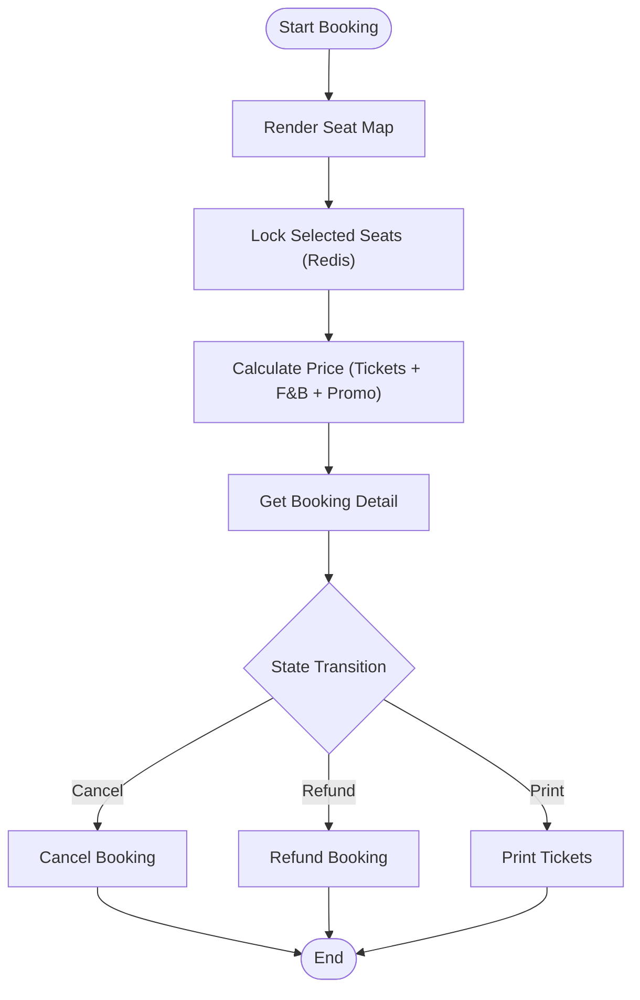
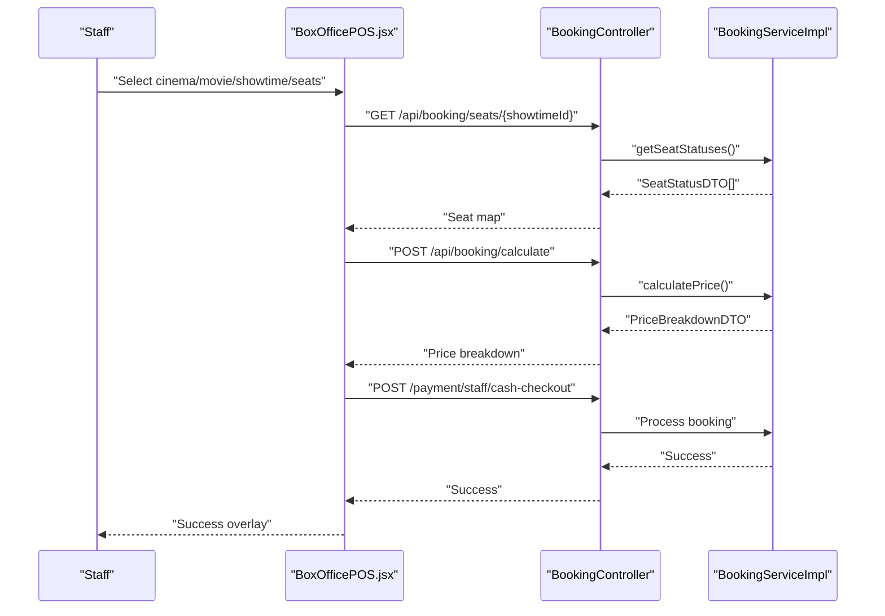
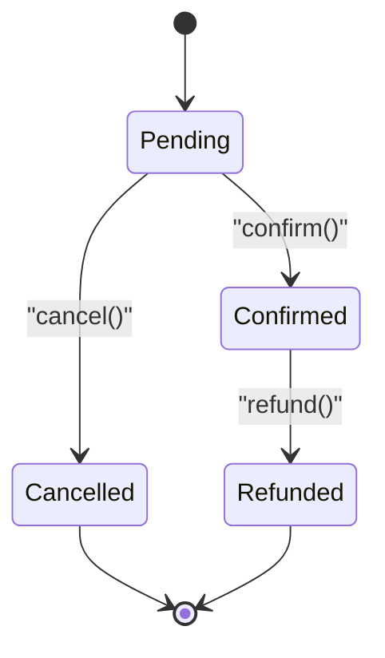
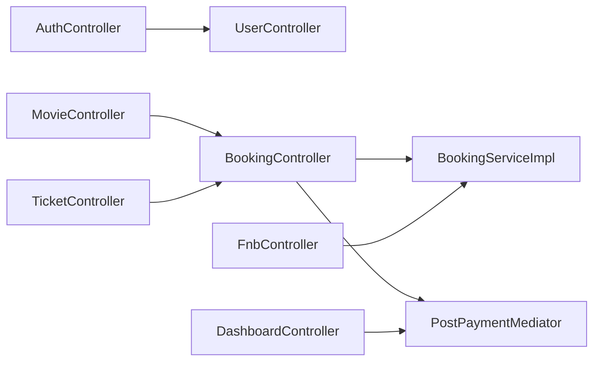

# Core Features

<cite>
**Referenced Files in This Document**
- [AuthController.java](file://backend/src/main/java/com/cinema/booking/controllers/AuthController.java)
- [MovieController.java](file://backend/src/main/java/com/cinema/booking/controllers/MovieController.java)
- [BookingController.java](file://backend/src/main/java/com/cinema/booking/controllers/BookingController.java)
- [TicketController.java](file://backend/src/main/java/com/cinema/booking/controllers/TicketController.java)
- [UserController.java](file://backend/src/main/java/com/cinema/booking/controllers/UserController.java)
- [DashboardController.java](file://backend/src/main/java/com/cinema/booking/controllers/DashboardController.java)
- [FnbController.java](file://backend/src/main/java/com/cinema/booking/controllers/FnbController.java)
- [BookingServiceImpl.java](file://backend/src/main/java/com/cinema/booking/services/impl/BookingServiceImpl.java)
- [BookingContext.java](file://backend/src/main/java/com/cinema/booking/patterns/state/BookingContext.java)
- [PostPaymentMediator.java](file://backend/src/main/java/com/cinema/booking/patterns/mediator/PostPaymentMediator.java)
- [Booking.java](file://backend/src/main/java/com/cinema/booking/entities/Booking.java)
- [Ticket.java](file://backend/src/main/java/com/cinema/booking/entities/Ticket.java)
- [Dashboard.jsx](file://frontend/src/pages/admin/Dashboard.jsx)
- [BoxOfficePOS.jsx](file://frontend/src/pages/staff/BoxOfficePOS.jsx)
- [OrderLookup.jsx](file://frontend/src/pages/staff/OrderLookup.jsx)
</cite>

## Table of Contents
1. [Introduction](#introduction)
2. [Project Structure](#project-structure)
3. [Core Components](#core-components)
4. [Architecture Overview](#architecture-overview)
5. [Detailed Component Analysis](#detailed-component-analysis)
6. [Dependency Analysis](#dependency-analysis)
7. [Performance Considerations](#performance-considerations)
8. [Troubleshooting Guide](#troubleshooting-guide)
9. [Conclusion](#conclusion)
10. [Appendices](#appendices)

## Introduction
This document presents the complete feature set of the cinema booking system, covering customer-facing capabilities, administrative dashboards, staff operations, and the underlying business rules. It explains how users browse movies, manage accounts, select seats, apply promotions, pay, receive e-tickets, and leave reviews; how admins monitor analytics and manage content and inventory; and how staff operate the Point of Sale (POS) for box office sales and order lookup. Business rules such as mandatory login for booking, check-in policies, and refund procedures are documented alongside concrete implementation references.

## Project Structure
The system comprises:
- Backend REST APIs organized by feature domains (authentication, movies, bookings, tickets, users, admin dashboard, F&B).
- Frontend pages for admin analytics and staff POS/order lookup.
- Domain services implementing checkout validation, pricing engine, state transitions, and mediator-driven post-payment settlement.

**Diagram sources**
- [Dashboard.jsx](file://frontend/src/pages/admin/Dashboard.jsx)
- [BoxOfficePOS.jsx](file://frontend/src/pages/staff/BoxOfficePOS.jsx)
- [OrderLookup.jsx](file://frontend/src/pages/staff/OrderLookup.jsx)
- [AuthController.java](file://backend/src/main/java/com/cinema/booking/controllers/AuthController.java)
- [MovieController.java](file://backend/src/main/java/com/cinema/booking/controllers/MovieController.java)
- [BookingController.java](file://backend/src/main/java/com/cinema/booking/controllers/BookingController.java)
- [TicketController.java](file://backend/src/main/java/com/cinema/booking/controllers/TicketController.java)
- [UserController.java](file://backend/src/main/java/com/cinema/booking/controllers/UserController.java)
- [DashboardController.java](file://backend/src/main/java/com/cinema/booking/controllers/DashboardController.java)
- [FnbController.java](file://backend/src/main/java/com/cinema/booking/controllers/FnbController.java)
- [BookingServiceImpl.java](file://backend/src/main/java/com/cinema/booking/services/impl/BookingServiceImpl.java)
- [PostPaymentMediator.java](file://backend/src/main/java/com/cinema/booking/patterns/mediator/PostPaymentMediator.java)

**Section sources**
- [Dashboard.jsx](file://frontend/src/pages/admin/Dashboard.jsx)
- [BoxOfficePOS.jsx](file://frontend/src/pages/staff/BoxOfficePOS.jsx)
- [OrderLookup.jsx](file://frontend/src/pages/staff/OrderLookup.jsx)
- [AuthController.java](file://backend/src/main/java/com/cinema/booking/controllers/AuthController.java)
- [MovieController.java](file://backend/src/main/java/com/cinema/booking/controllers/MovieController.java)
- [BookingController.java](file://backend/src/main/java/com/cinema/booking/controllers/BookingController.java)
- [TicketController.java](file://backend/src/main/java/com/cinema/booking/controllers/TicketController.java)
- [UserController.java](file://backend/src/main/java/com/cinema/booking/controllers/UserController.java)
- [DashboardController.java](file://backend/src/main/java/com/cinema/booking/controllers/DashboardController.java)
- [FnbController.java](file://backend/src/main/java/com/cinema/booking/controllers/FnbController.java)

## Core Components
- Authentication and Account Management
  - Login, registration, and Google login endpoints.
  - Current user profile retrieval and updates.
- Movie Browsing and Content
  - Browse movies by status, view details, and manage cast lists.
- Booking Workflow (5 Steps)
  - Seat rendering and Redis-backed locking.
  - Price calculation with promotions and F&B.
  - Booking detail retrieval, cancellation, refund, and printing.
- E-Ticket System
  - Retrieve tickets by booking/user and delete tickets (for staff).
- Admin Analytics and Management
  - Dashboard statistics and weekly revenue.
  - F&B inventory and categories management.
- Staff POS Operations
  - Box office cash checkout and order lookup.
- Business Rules
  - Mandatory login for booking.
  - Seat locking with Redis TTL.
  - State transitions for bookings (pending, confirmed, cancelled, refunded).
  - Post-payment mediator orchestrates inventory and notifications.

**Section sources**
- [AuthController.java](file://backend/src/main/java/com/cinema/booking/controllers/AuthController.java)
- [UserController.java](file://backend/src/main/java/com/cinema/booking/controllers/UserController.java)
- [MovieController.java](file://backend/src/main/java/com/cinema/booking/controllers/MovieController.java)
- [BookingController.java](file://backend/src/main/java/com/cinema/booking/controllers/BookingController.java)
- [BookingServiceImpl.java](file://backend/src/main/java/com/cinema/booking/services/impl/BookingServiceImpl.java)
- [TicketController.java](file://backend/src/main/java/com/cinema/booking/controllers/TicketController.java)
- [DashboardController.java](file://backend/src/main/java/com/cinema/booking/controllers/DashboardController.java)
- [FnbController.java](file://backend/src/main/java/com/cinema/booking/controllers/FnbController.java)
- [BoxOfficePOS.jsx](file://frontend/src/pages/staff/BoxOfficePOS.jsx)
- [OrderLookup.jsx](file://frontend/src/pages/staff/OrderLookup.jsx)

## Architecture Overview
The system follows a layered backend with Spring-managed controllers delegating to services. The frontend interacts with controllers via REST endpoints. State and mediator patterns enforce business rules and orchestrate cross-cutting concerns after payment.

**Diagram sources**
- [BoxOfficePOS.jsx](file://frontend/src/pages/staff/BoxOfficePOS.jsx)
- [BookingController.java](file://backend/src/main/java/com/cinema/booking/controllers/BookingController.java)
- [BookingServiceImpl.java](file://backend/src/main/java/com/cinema/booking/services/impl/BookingServiceImpl.java)
- [PostPaymentMediator.java](file://backend/src/main/java/com/cinema/booking/patterns/mediator/PostPaymentMediator.java)

**Section sources**
- [BookingController.java](file://backend/src/main/java/com/cinema/booking/controllers/BookingController.java)
- [BookingServiceImpl.java](file://backend/src/main/java/com/cinema/booking/services/impl/BookingServiceImpl.java)
- [PostPaymentMediator.java](file://backend/src/main/java/com/cinema/booking/patterns/mediator/PostPaymentMediator.java)
- [BoxOfficePOS.jsx](file://frontend/src/pages/staff/BoxOfficePOS.jsx)

## Detailed Component Analysis

### Customer-Facing Features

#### Account Management
- Retrieve and update current user profile.
- Registration and login endpoints; Google login support.

Implementation highlights:
- Endpoint protection for profile updates requires authenticated roles.
- Login/register return JWT or message responses.

**Section sources**
- [UserController.java](file://backend/src/main/java/com/cinema/booking/controllers/UserController.java)
- [AuthController.java](file://backend/src/main/java/com/cinema/booking/controllers/AuthController.java)

#### Movie Browsing
- Filter movies by status; view details and replace cast lists.

**Section sources**
- [MovieController.java](file://backend/src/main/java/com/cinema/booking/controllers/MovieController.java)

#### Booking Workflow (5 Steps)
- Step 1: Seat rendering and Redis-backed locking.
- Step 2: Price calculation with promotions and F&B.
- Step 3: Booking detail retrieval.
- Step 4: Cancellation and refund (state transitions).
- Step 5: Print tickets.

**Diagram sources**
- [BookingController.java](file://backend/src/main/java/com/cinema/booking/controllers/BookingController.java)
- [BookingServiceImpl.java](file://backend/src/main/java/com/cinema/booking/services/impl/BookingServiceImpl.java)
- [BookingContext.java](file://backend/src/main/java/com/cinema/booking/patterns/state/BookingContext.java)

**Section sources**
- [BookingController.java](file://backend/src/main/java/com/cinema/booking/controllers/BookingController.java)
- [BookingServiceImpl.java](file://backend/src/main/java/com/cinema/booking/services/impl/BookingServiceImpl.java)
- [BookingContext.java](file://backend/src/main/java/com/cinema/booking/patterns/state/BookingContext.java)

#### E-Ticket System
- Retrieve tickets by booking or user.
- Delete tickets (staff-only).

**Section sources**
- [TicketController.java](file://backend/src/main/java/com/cinema/booking/controllers/TicketController.java)

#### Review and Rating Functionality
- Not present in the referenced backend controllers and services. This feature is out of scope for the current codebase.

### Admin Capabilities

#### Dashboard Analytics
- Aggregate system stats and weekly revenue chart data.
- Frontend dashboard page consumes stats and renders charts and export.

**Section sources**
- [DashboardController.java](file://backend/src/main/java/com/cinema/booking/controllers/DashboardController.java)
- [Dashboard.jsx](file://frontend/src/pages/admin/Dashboard.jsx)

#### Content Management
- Movies: list, create, update, delete, and replace cast lists.
- Users: profile retrieval and updates (via user controller).

**Section sources**
- [MovieController.java](file://backend/src/main/java/com/cinema/booking/controllers/MovieController.java)
- [UserController.java](file://backend/src/main/java/com/cinema/booking/controllers/UserController.java)

#### Order Management
- Search orders by ID, phone, or email.
- Cancel and refund orders; print tickets.

**Section sources**
- [BookingController.java](file://backend/src/main/java/com/cinema/booking/controllers/BookingController.java)
- [OrderLookup.jsx](file://frontend/src/pages/staff/OrderLookup.jsx)

#### F&B Inventory and Promotions
- Manage F&B items and categories; maintain stock quantities.
- Promotions integrated into pricing validation and inventory.

**Section sources**
- [FnbController.java](file://backend/src/main/java/com/cinema/booking/controllers/FnbController.java)
- [BookingServiceImpl.java](file://backend/src/main/java/com/cinema/booking/services/impl/BookingServiceImpl.java)

#### User Management
- Profile retrieval and updates via user controller.

**Section sources**
- [UserController.java](file://backend/src/main/java/com/cinema/booking/controllers/UserController.java)

### Staff POS Operations

#### Box Office Sales
- Multi-step workflow: choose cinema, movie, showtime, and seats.
- Real-time seat availability and locking.
- F&B quick selection and promotional code application.
- Cash checkout submission and success overlay.

**Diagram sources**
- [BoxOfficePOS.jsx](file://frontend/src/pages/staff/BoxOfficePOS.jsx)
- [BookingController.java](file://backend/src/main/java/com/cinema/booking/controllers/BookingController.java)
- [BookingServiceImpl.java](file://backend/src/main/java/com/cinema/booking/services/impl/BookingServiceImpl.java)

**Section sources**
- [BoxOfficePOS.jsx](file://frontend/src/pages/staff/BoxOfficePOS.jsx)
- [BookingController.java](file://backend/src/main/java/com/cinema/booking/controllers/BookingController.java)
- [BookingServiceImpl.java](file://backend/src/main/java/com/cinema/booking/services/impl/BookingServiceImpl.java)

#### Order Lookup
- Search and expand booking details; print tickets; cancel/refund actions.

**Section sources**
- [OrderLookup.jsx](file://frontend/src/pages/staff/OrderLookup.jsx)
- [BookingController.java](file://backend/src/main/java/com/cinema/booking/controllers/BookingController.java)
- [TicketController.java](file://backend/src/main/java/com/cinema/booking/controllers/TicketController.java)

### Business Rules and Policies

- Mandatory login for booking: endpoints under the booking and ticket controllers require authentication.
- Seat locking policy: Redis SETNX locks with TTL; attempts on sold or pending seats fail.
- State transitions: bookings move through pending → confirmed; cancellations and refunds are enforced via state context.
- Post-payment settlement: mediator coordinates inventory rollback, user spending updates, ticket issuance, and email notifications.

**Diagram sources**
- [BookingContext.java](file://backend/src/main/java/com/cinema/booking/patterns/state/BookingContext.java)
- [Booking.java](file://backend/src/main/java/com/cinema/booking/entities/Booking.java)

**Section sources**
- [BookingController.java](file://backend/src/main/java/com/cinema/booking/controllers/BookingController.java)
- [BookingServiceImpl.java](file://backend/src/main/java/com/cinema/booking/services/impl/BookingServiceImpl.java)
- [BookingContext.java](file://backend/src/main/java/com/cinema/booking/patterns/state/BookingContext.java)
- [Booking.java](file://backend/src/main/java/com/cinema/booking/entities/Booking.java)
- [PostPaymentMediator.java](file://backend/src/main/java/com/cinema/booking/patterns/mediator/PostPaymentMediator.java)

## Dependency Analysis
- Controllers depend on services for business logic.
- Services coordinate repositories, pricing engines, validators, and external integrations.
- State and mediator patterns encapsulate complex transitions and cross-cutting concerns.

**Diagram sources**
- [AuthController.java](file://backend/src/main/java/com/cinema/booking/controllers/AuthController.java)
- [UserController.java](file://backend/src/main/java/com/cinema/booking/controllers/UserController.java)
- [MovieController.java](file://backend/src/main/java/com/cinema/booking/controllers/MovieController.java)
- [BookingController.java](file://backend/src/main/java/com/cinema/booking/controllers/BookingController.java)
- [BookingServiceImpl.java](file://backend/src/main/java/com/cinema/booking/services/impl/BookingServiceImpl.java)
- [PostPaymentMediator.java](file://backend/src/main/java/com/cinema/booking/patterns/mediator/PostPaymentMediator.java)
- [TicketController.java](file://backend/src/main/java/com/cinema/booking/controllers/TicketController.java)
- [DashboardController.java](file://backend/src/main/java/com/cinema/booking/controllers/DashboardController.java)
- [FnbController.java](file://backend/src/main/java/com/cinema/booking/controllers/FnbController.java)

**Section sources**
- [BookingServiceImpl.java](file://backend/src/main/java/com/cinema/booking/services/impl/BookingServiceImpl.java)
- [PostPaymentMediator.java](file://backend/src/main/java/com/cinema/booking/patterns/mediator/PostPaymentMediator.java)

## Performance Considerations
- Seat rendering and locking leverage batch operations and Redis TTL to minimize contention.
- Pricing calculations use a caching proxy and validation chain to avoid redundant work.
- Frontend uses memoization and controlled re-renders for POS and order lookup.

## Troubleshooting Guide
- Seat locking fails: verify seat availability and Redis connectivity; ensure booking is not already paid.
- Price calculation errors: check promotion validity and F&B stock quantities.
- Booking state errors: ensure state transitions follow the defined lifecycle.
- Payment settlement failures: mediator triggers rollback routines; inspect logs for specific colleague failures.

**Section sources**
- [BookingServiceImpl.java](file://backend/src/main/java/com/cinema/booking/services/impl/BookingServiceImpl.java)
- [PostPaymentMediator.java](file://backend/src/main/java/com/cinema/booking/patterns/mediator/PostPaymentMediator.java)

## Conclusion
The cinema booking system integrates robust customer and staff workflows with strong administrative oversight. Its use of state machines, mediators, and validation chains ensures predictable business behavior, while Redis-backed seat locking and caching improve performance. Administrators gain actionable insights through the dashboard, and staff benefit from an efficient POS and order lookup interface.

## Appendices

### API Reference Highlights
- Authentication
  - POST /api/auth/login
  - POST /api/auth/register
  - POST /api/auth/google-login
- Movies
  - GET /api/movies
  - GET /api/movies/{id}
  - PUT /api/movies/{id}/casts
- Booking
  - GET /api/booking/seats/{showtimeId}
  - POST /api/booking/lock
  - POST /api/booking/unlock
  - POST /api/booking/calculate
  - GET /api/booking/{bookingId}
  - GET /api/booking/search
  - POST /api/booking/{bookingId}/cancel
  - POST /api/booking/{bookingId}/refund
  - POST /api/booking/{bookingId}/print
- Tickets
  - GET /api/tickets/booking/{bookingId}
  - GET /api/tickets/user/{userId}
  - GET /api/tickets/{ticketId}
  - DELETE /api/tickets/{ticketId}
- Users
  - GET /api/users/me
  - PUT /api/users/me
- Admin Dashboard
  - GET /api/admin/dashboard/stats
  - GET /api/admin/dashboard/revenue-weekly
- F&B
  - GET /api/fnb/items
  - POST /api/fnb/items
  - PUT /api/fnb/items/{id}
  - DELETE /api/fnb/items/{id}
  - GET /api/fnb/categories
  - POST /api/fnb/categories
  - PUT /api/fnb/categories/{id}
  - DELETE /api/fnb/categories/{id}