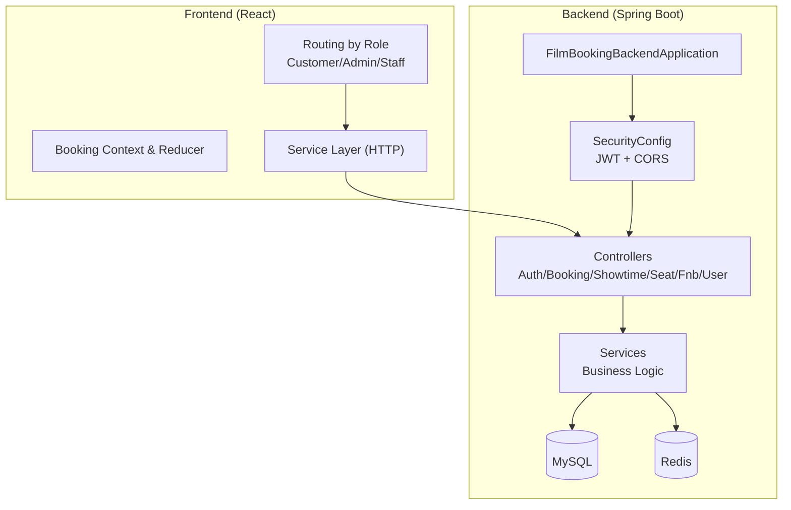
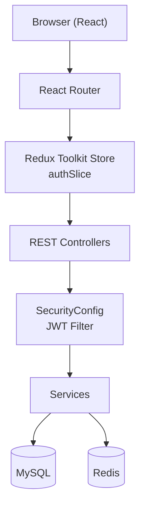
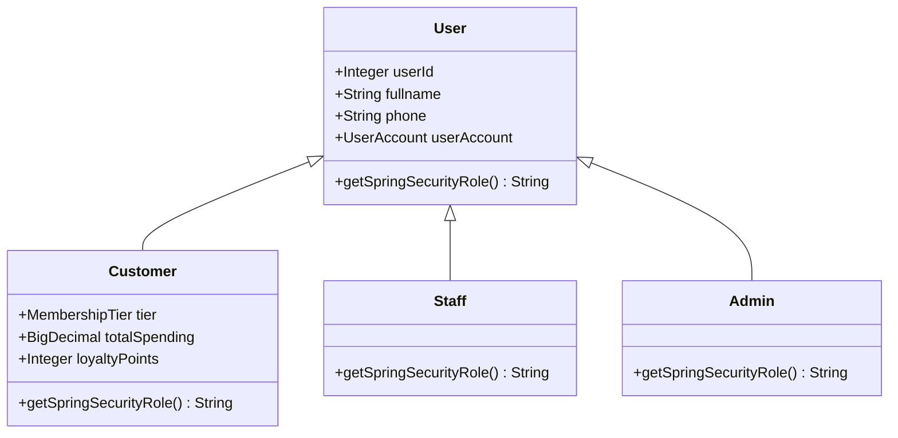
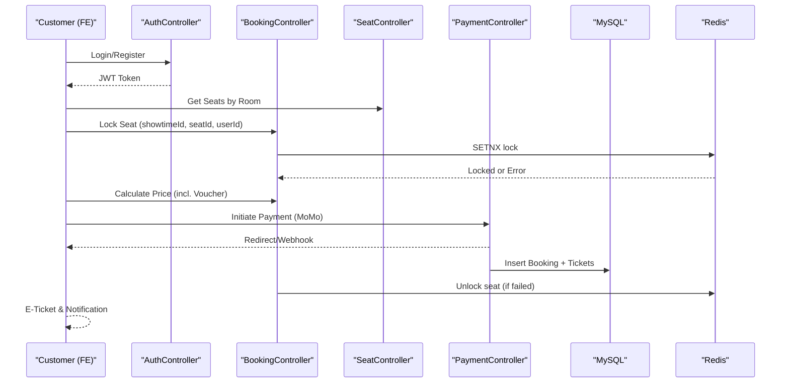
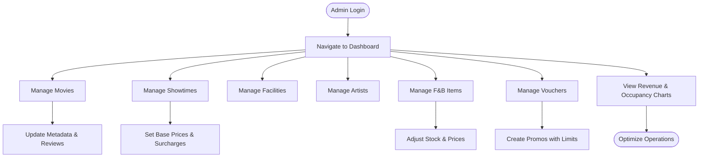
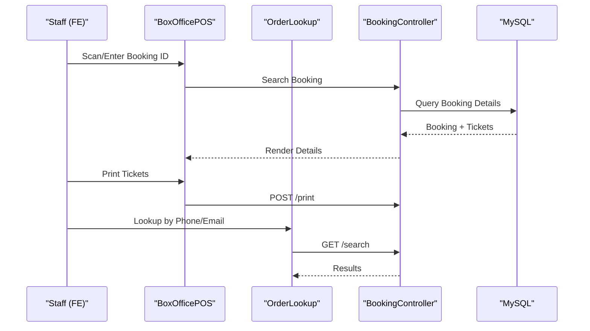
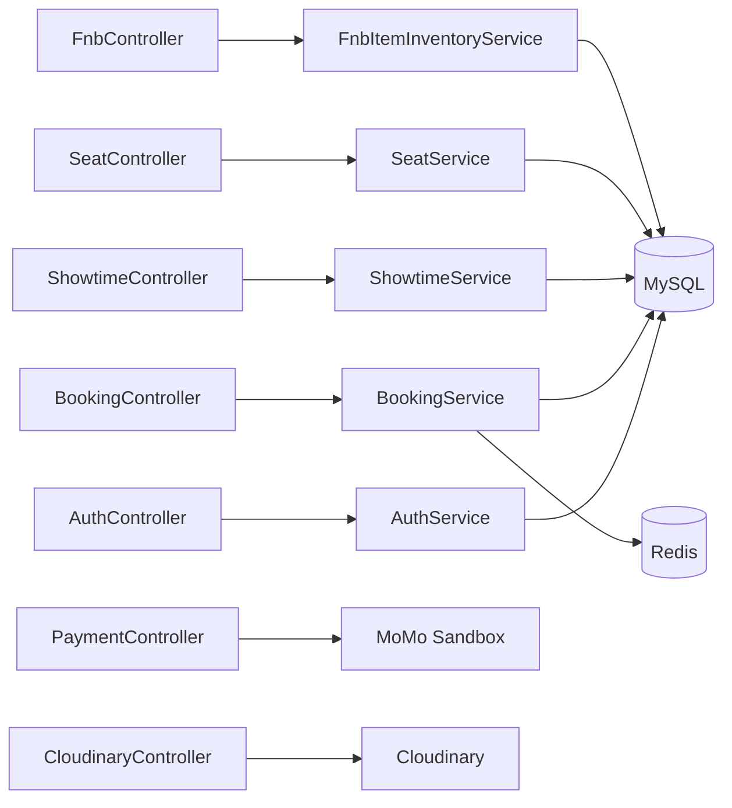

# Project Overview

<cite>
**Referenced Files in This Document**
- [README.md](file://README.md)
- [FilmBookingBackendApplication.java](file://backend/src/main/java/com/cinema/booking/FilmBookingBackendApplication.java)
- [App.jsx](file://frontend/src/App.jsx)
- [application.properties](file://backend/src/main/resources/application.properties)
- [SecurityConfig.java](file://backend/src/main/java/com/cinema/booking/config/SecurityConfig.java)
- [BookingController.java](file://backend/src/main/java/com/cinema/booking/controllers/BookingController.java)
- [ShowtimeController.java](file://backend/src/main/java/com/cinema/booking/controllers/ShowtimeController.java)
- [SeatController.java](file://backend/src/main/java/com/cinema/booking/controllers/SeatController.java)
- [FnbController.java](file://backend/src/main/java/com/cinema/booking/controllers/FnbController.java)
- [User.java](file://backend/src/main/java/com/cinema/booking/entities/User.java)
- [Customer.java](file://backend/src/main/java/com/cinema/booking/entities/Customer.java)
- [Staff.java](file://backend/src/main/java/com/cinema/booking/entities/Staff.java)
- [Admin.java](file://backend/src/main/java/com/cinema/booking/entities/Admin.java)
- [AuthServiceImpl.java](file://backend/src/main/java/com/cinema/booking/services/impl/AuthServiceImpl.java)
- [authSlice.js](file://frontend/src/store/authSlice.js)
- [UserController.java](file://backend/src/main/java/com/cinema/booking/controllers/UserController.java)
</cite>

## Table of Contents
1. [Introduction](#introduction)
2. [Project Structure](#project-structure)
3. [Core Components](#core-components)
4. [Architecture Overview](#architecture-overview)
5. [Detailed Component Analysis](#detailed-component-analysis)
6. [Dependency Analysis](#dependency-analysis)
7. [Performance Considerations](#performance-considerations)
8. [Troubleshooting Guide](#troubleshooting-guide)
9. [Conclusion](#conclusion)

## Introduction
This project is a full-stack online movie ticket booking platform designed to resemble industry leaders such as CGV, Lotte Cinema, and Galaxy. It provides a complete cinema experience with three primary user roles: Customer, Staff, and Admin. The system supports the full booking workflow, real-time seat locking, dynamic pricing, integrated payments, and robust administrative dashboards for managing movies, showtimes, facilities, and promotions.

Key goals:
- Enable customers to browse movies, select showtimes and seats, order food and beverages (F&B), apply vouchers, and pay securely.
- Provide staff with POS capabilities for box office sales and order lookup.
- Offer admin dashboards for operational management, reporting, and content administration.

Business rules and UX highlights:
- Force-login requirement for booking ensures user retention and reduces lost tickets.
- Refund freeze window prevents cancellations too close to showtime.
- Real-time seat locking via Redis prevents double bookings.
- Dynamic pricing engine adjusts base prices based on occupancy, time, and promotions.

## Project Structure
The system follows a layered architecture with a Spring Boot backend and a React frontend. The backend exposes REST APIs secured by JWT and RBAC, while the frontend organizes routes by role (customer, admin, staff) and state management for booking flows.

**Diagram sources**
- [App.jsx:38-84](file://frontend/src/App.jsx#L38-L84)
- [FilmBookingBackendApplication.java:6-11](file://backend/src/main/java/com/cinema/booking/FilmBookingBackendApplication.java#L6-L11)
- [SecurityConfig.java:51-79](file://backend/src/main/java/com/cinema/booking/config/SecurityConfig.java#L51-L79)
- [application.properties:8-24](file://backend/src/main/resources/application.properties#L8-L24)

**Section sources**
- [README.md:3-63](file://README.md#L3-L63)
- [App.jsx:38-84](file://frontend/src/App.jsx#L38-L84)
- [FilmBookingBackendApplication.java:6-11](file://backend/src/main/java/com/cinema/booking/FilmBookingBackendApplication.java#L6-L11)
- [application.properties:8-24](file://backend/src/main/resources/application.properties#L8-L24)

## Core Components
- Roles and Identity
  - User hierarchy with polymorphic inheritance and role-specific Spring Security mappings.
  - Roles: Customer (USER), Staff (STAFF), Admin (ADMIN).
- Authentication and Authorization
  - JWT-based authentication with method-level security and role-based access control.
  - Google OAuth registration flow integrated.
- Booking Engine
  - Seat status retrieval, Redis-backed seat locking/unlocking, price calculation, booking state transitions (pending, confirmed, refunded, cancelled), and printing tickets.
- Content and Catalog Management
  - Movies, genres, cast/crew, showtimes, rooms, seats, and F&B items with categories and inventory.
- Payments and Promotions
  - Voucher application, MoMo sandbox integration, and email notifications for confirmations.

Practical examples:
- Customer booking flow: choose city → select cinema → pick showtime → select seats (with real-time lock) → add F&B → calculate price → apply voucher → pay → receive e-ticket.
- Admin dashboard: manage movies, schedule showtimes, configure rooms/seats, manage F&B inventory, create vouchers, and monitor revenue.
- Staff POS: process cash or digital payments at the box office, print tickets, and look up orders by ID, phone, or email.

**Section sources**
- [User.java:13-37](file://backend/src/main/java/com/cinema/booking/entities/User.java#L13-L37)
- [Customer.java:26-29](file://backend/src/main/java/com/cinema/booking/entities/Customer.java#L26-L29)
- [Staff.java:14-17](file://backend/src/main/java/com/cinema/booking/entities/Staff.java#L14-L17)
- [Admin.java:14-17](file://backend/src/main/java/com/cinema/booking/entities/Admin.java#L14-L17)
- [SecurityConfig.java:57-74](file://backend/src/main/java/com/cinema/booking/config/SecurityConfig.java#L57-L74)
- [AuthServiceImpl.java:68-126](file://backend/src/main/java/com/cinema/booking/services/impl/AuthServiceImpl.java#L68-L126)
- [BookingController.java:25-113](file://backend/src/main/java/com/cinema/booking/controllers/BookingController.java#L25-L113)
- [ShowtimeController.java:23-52](file://backend/src/main/java/com/cinema/booking/controllers/ShowtimeController.java#L23-L52)
- [SeatController.java:20-57](file://backend/src/main/java/com/cinema/booking/controllers/SeatController.java#L20-L57)
- [FnbController.java:36-133](file://backend/src/main/java/com/cinema/booking/controllers/FnbController.java#L36-L133)

## Architecture Overview
The system employs a modern, enterprise-grade architecture emphasizing transaction integrity, concurrency control, and scalability.

**Diagram sources**
- [App.jsx:38-84](file://frontend/src/App.jsx#L38-L84)
- [authSlice.js:1-37](file://frontend/src/store/authSlice.js#L1-L37)
- [SecurityConfig.java:51-79](file://backend/src/main/java/com/cinema/booking/config/SecurityConfig.java#L51-L79)
- [application.properties:61-66](file://backend/src/main/resources/application.properties#L61-L66)

Technology stack:
- Frontend: React with Redux Toolkit for state management.
- Backend: Java Spring Boot with Spring Security, JWT, and Spring Data JPA.
- Database: MySQL with Hibernate/JPA.
- Caching/Locking: Redis for seat locking and caching.
- Payments: MoMo sandbox integration.
- Image storage: Cloudinary via backend controller.
- DevOps: Docker Compose (referenced in repository).

**Section sources**
- [README.md:155-173](file://README.md#L155-L173)
- [application.properties:8-24](file://backend/src/main/resources/application.properties#L8-L24)
- [application.properties:61-76](file://backend/src/main/resources/application.properties#L61-L76)

## Detailed Component Analysis

### Roles and Identity Model
The user model uses joined-table inheritance with role-specific Spring Security mappings. Each role enforces authorization boundaries in controllers and services.

**Diagram sources**
- [User.java:13-37](file://backend/src/main/java/com/cinema/booking/entities/User.java#L13-L37)
- [Customer.java:14-30](file://backend/src/main/java/com/cinema/booking/entities/Customer.java#L14-L30)
- [Staff.java:8-18](file://backend/src/main/java/com/cinema/booking/entities/Staff.java#L8-L18)
- [Admin.java:8-18](file://backend/src/main/java/com/cinema/booking/entities/Admin.java#L8-L18)

**Section sources**
- [User.java:13-37](file://backend/src/main/java/com/cinema/booking/entities/User.java#L13-L37)
- [Customer.java:26-29](file://backend/src/main/java/com/cinema/booking/entities/Customer.java#L26-L29)
- [Staff.java:14-17](file://backend/src/main/java/com/cinema/booking/entities/Staff.java#L14-L17)
- [Admin.java:14-17](file://backend/src/main/java/com/cinema/booking/entities/Admin.java#L14-L17)

### Booking Workflow (Customer)
The booking flow is orchestrated by controllers and services, with Redis-backed seat locking and state transitions managed by a state pattern.

**Diagram sources**
- [BookingController.java:25-113](file://backend/src/main/java/com/cinema/booking/controllers/BookingController.java#L25-L113)
- [SeatController.java:20-28](file://backend/src/main/java/com/cinema/booking/controllers/SeatController.java#L20-L28)
- [application.properties:61-66](file://backend/src/main/resources/application.properties#L61-L66)

**Section sources**
- [README.md:26-44](file://README.md#L26-L44)
- [BookingController.java:25-113](file://backend/src/main/java/com/cinema/booking/controllers/BookingController.java#L25-L113)
- [SeatController.java:20-28](file://backend/src/main/java/com/cinema/booking/controllers/SeatController.java#L20-L28)

### Admin Dashboard Capabilities
Admins can manage movies, showtimes, facilities, artists, F&B, and vouchers. Controllers expose CRUD endpoints with role-based authorization.

**Diagram sources**
- [ShowtimeController.java:23-52](file://backend/src/main/java/com/cinema/booking/controllers/ShowtimeController.java#L23-L52)
- [FnbController.java:36-133](file://backend/src/main/java/com/cinema/booking/controllers/FnbController.java#L36-L133)

**Section sources**
- [README.md:45-62](file://README.md#L45-L62)
- [ShowtimeController.java:23-52](file://backend/src/main/java/com/cinema/booking/controllers/ShowtimeController.java#L23-L52)
- [FnbController.java:36-133](file://backend/src/main/java/com/cinema/booking/controllers/FnbController.java#L36-L133)

### Staff POS Operations
Staff handle box office sales, print tickets, and lookup orders. Authorization allows staff to access admin-protected endpoints under specific routes.

**Diagram sources**
- [BookingController.java:70-112](file://backend/src/main/java/com/cinema/booking/controllers/BookingController.java#L70-L112)
- [SecurityConfig.java:66-73](file://backend/src/main/java/com/cinema/booking/config/SecurityConfig.java#L66-L73)

**Section sources**
- [README.md:45-62](file://README.md#L45-L62)
- [BookingController.java:70-112](file://backend/src/main/java/com/cinema/booking/controllers/BookingController.java#L70-L112)
- [SecurityConfig.java:66-73](file://backend/src/main/java/com/cinema/booking/config/SecurityConfig.java#L66-L73)

## Dependency Analysis
The backend controllers depend on services, which in turn interact with repositories and external systems (Redis, MoMo, Cloudinary). Security configuration centralizes authorization rules.

**Diagram sources**
- [BookingController.java:22-24](file://backend/src/main/java/com/cinema/booking/controllers/BookingController.java#L22-L24)
- [ShowtimeController.java:21](file://backend/src/main/java/com/cinema/booking/controllers/ShowtimeController.java#L21)
- [SeatController.java:17-19](file://backend/src/main/java/com/cinema/booking/controllers/SeatController.java#L17-L19)
- [FnbController.java:25-33](file://backend/src/main/java/com/cinema/booking/controllers/FnbController.java#L25-L33)
- [application.properties:61-76](file://backend/src/main/resources/application.properties#L61-L76)

**Section sources**
- [SecurityConfig.java:57-74](file://backend/src/main/java/com/cinema/booking/config/SecurityConfig.java#L57-L74)
- [application.properties:61-76](file://backend/src/main/resources/application.properties#L61-L76)

## Performance Considerations
- Real-time seat locking with Redis prevents race conditions during high-concurrency events.
- Caching showtime seat layouts reduces repeated database queries.
- Asynchronous background tasks offload PDF generation and email notifications.
- JWT stateless sessions reduce server memory footprint.
- Proper indexing and query optimization recommended for frequently accessed entities (Showtime, Booking, Ticket).

[No sources needed since this section provides general guidance]

## Troubleshooting Guide
Common issues and resolutions:
- Authentication failures: Verify JWT secret and frontend local storage token persistence.
- CORS errors: Confirm frontend URL and CORS configuration.
- Redis seat lock errors: Ensure Redis TTL and connectivity; seat locks auto-release after expiration.
- Payment callback/webhook: Validate MoMo endpoint credentials and webhook URLs.
- Authorization errors: Check role-based route mappings and user roles in the database.

**Section sources**
- [application.properties:37](file://backend/src/main/resources/application.properties#L37)
- [application.properties:61-66](file://backend/src/main/resources/application.properties#L61-L66)
- [application.properties:70-76](file://backend/src/main/resources/application.properties#L70-L76)
- [SecurityConfig.java:57-74](file://backend/src/main/java/com/cinema/booking/config/SecurityConfig.java#L57-L74)

## Conclusion
This cinema booking system delivers a robust, scalable, and secure platform for customers, staff, and administrators. Its layered architecture, strong identity and access control, real-time seat locking, and comprehensive admin/POS tooling align with enterprise standards. The documented workflows and diagrams provide a clear blueprint for development, testing, and deployment.