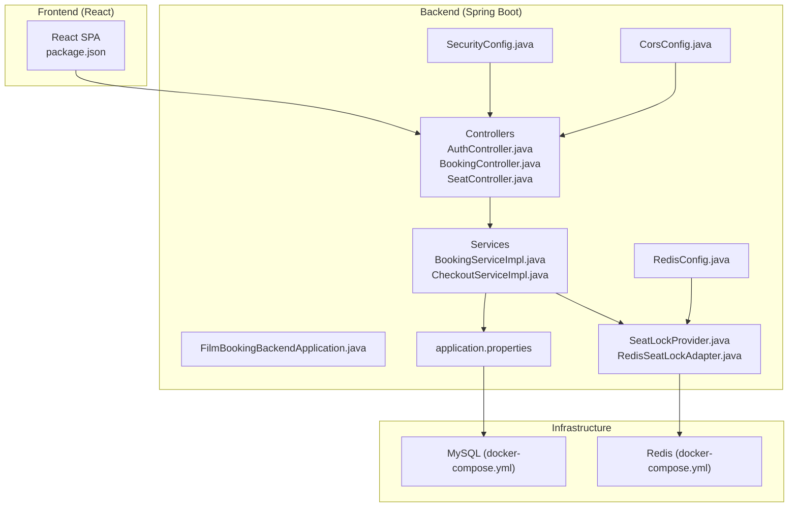
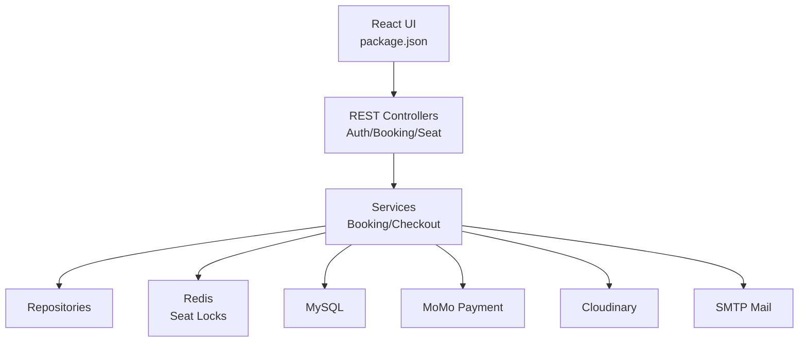
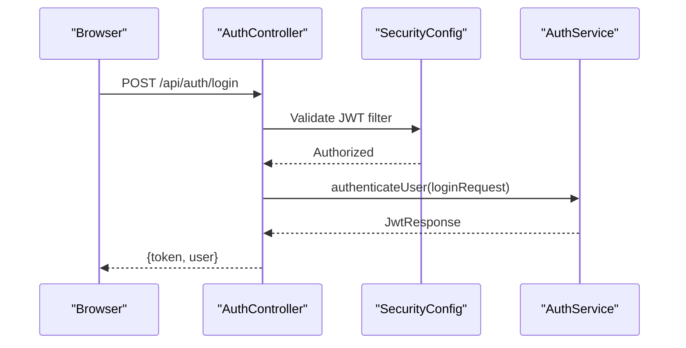
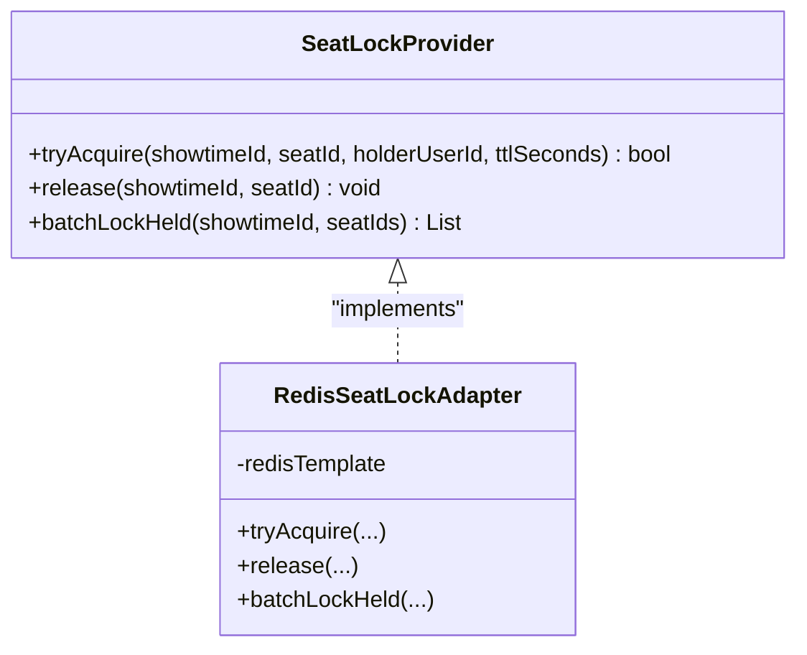
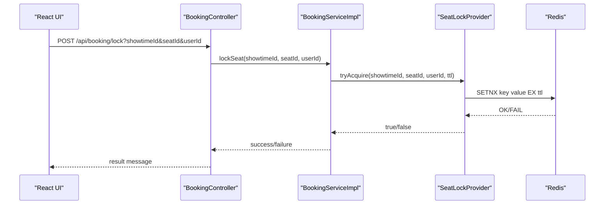
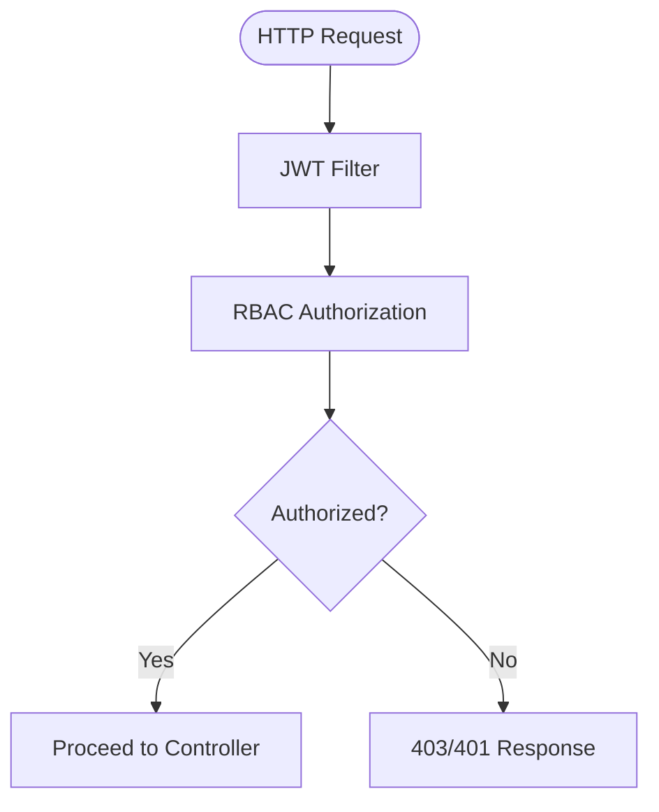
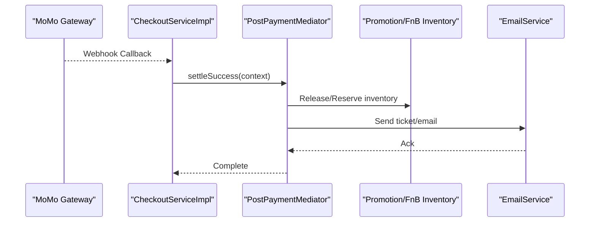
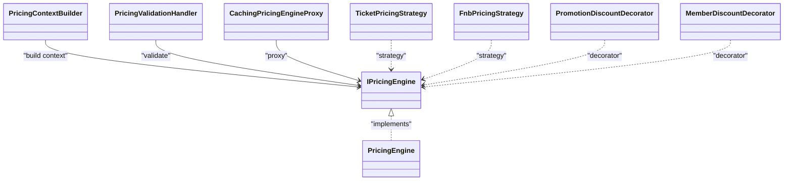
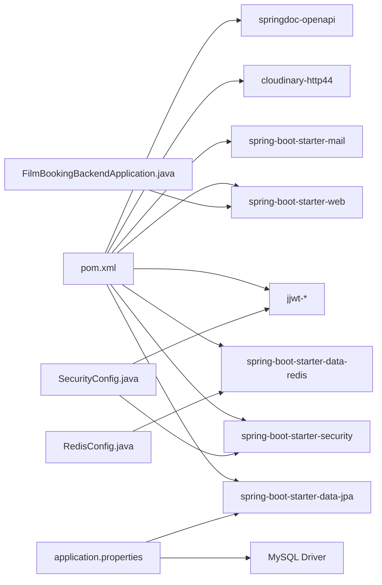
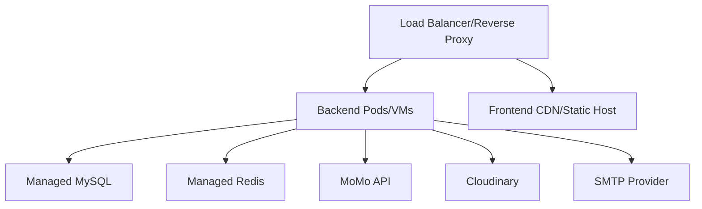

# System Architecture

<cite>
**Referenced Files in This Document**
- [FilmBookingBackendApplication.java](file://backend/src/main/java/com/cinema/booking/FilmBookingBackendApplication.java)
- [application.properties](file://backend/src/main/resources/application.properties)
- [pom.xml](file://backend/pom.xml)
- [SecurityConfig.java](file://backend/src/main/java/com/cinema/booking/config/SecurityConfig.java)
- [CorsConfig.java](file://backend/src/main/java/com/cinema/booking/config/CorsConfig.java)
- [RedisConfig.java](file://backend/src/main/java/com/cinema/booking/config/RedisConfig.java)
- [SeatLockProvider.java](file://backend/src/main/java/com/cinema/booking/services/seatlock/SeatLockProvider.java)
- [RedisSeatLockAdapter.java](file://backend/src/main/java/com/cinema/booking/services/seatlock/RedisSeatLockAdapter.java)
- [AuthController.java](file://backend/src/main/java/com/cinema/booking/controllers/AuthController.java)
- [BookingController.java](file://backend/src/main/java/com/cinema/booking/controllers/BookingController.java)
- [SeatController.java](file://backend/src/main/java/com/cinema/booking/controllers/SeatController.java)
- [BookingServiceImpl.java](file://backend/src/main/java/com/cinema/booking/services/impl/BookingServiceImpl.java)
- [CheckoutServiceImpl.java](file://backend/src/main/java/com/cinema/booking/services/impl/CheckoutServiceImpl.java)
- [docker-compose.yml](file://docker-compose.yml)
- [package.json](file://frontend/package.json)
</cite>

## Table of Contents
1. [Introduction](#introduction)
2. [Project Structure](#project-structure)
3. [Core Components](#core-components)
4. [Architecture Overview](#architecture-overview)
5. [Detailed Component Analysis](#detailed-component-analysis)
6. [Dependency Analysis](#dependency-analysis)
7. [Performance Considerations](#performance-considerations)
8. [Troubleshooting Guide](#troubleshooting-guide)
9. [Conclusion](#conclusion)
10. [Appendices](#appendices)

## Introduction
This document presents the system architecture for a cinema booking platform. It describes the high-level design patterns (layered architecture, MVC, and microservice-ready design), component interactions among the frontend React application, backend Spring Boot services, database layer, and external integrations. It also documents key technical decisions such as real-time seat locking via Redis, role-based access control with JWT, dynamic pricing engine, and asynchronous background processing. Infrastructure requirements, scalability considerations, deployment topology, and cross-cutting concerns (security, monitoring, disaster recovery) are included, along with technology stack integration points and third-party dependencies.

## Project Structure
The system follows a layered, MVC-oriented Spring Boot backend and a separate frontend React application. The backend exposes REST APIs organized by domain controllers, backed by services implementing design patterns (chain of responsibility, mediator, strategy/decorator, state, composite, proxy). Redis is used for seat locking and caching, while MySQL stores persistent data. Docker Compose provisions MySQL and Redis for local development.

**Diagram sources**
- [FilmBookingBackendApplication.java:1-14](file://backend/src/main/java/com/cinema/booking/FilmBookingBackendApplication.java#L1-L14)
- [SecurityConfig.java:1-82](file://backend/src/main/java/com/cinema/booking/config/SecurityConfig.java#L1-L82)
- [CorsConfig.java:1-39](file://backend/src/main/java/com/cinema/booking/config/CorsConfig.java#L1-L39)
- [RedisConfig.java:1-55](file://backend/src/main/java/com/cinema/booking/config/RedisConfig.java#L1-L55)
- [application.properties:1-97](file://backend/src/main/resources/application.properties#L1-L97)
- [AuthController.java:1-54](file://backend/src/main/java/com/cinema/booking/controllers/AuthController.java#L1-L54)
- [BookingController.java:1-114](file://backend/src/main/java/com/cinema/booking/controllers/BookingController.java#L1-L114)
- [SeatController.java:1-60](file://backend/src/main/java/com/cinema/booking/controllers/SeatController.java#L1-L60)
- [BookingServiceImpl.java:1-260](file://backend/src/main/java/com/cinema/booking/services/impl/BookingServiceImpl.java#L1-L260)
- [CheckoutServiceImpl.java:1-185](file://backend/src/main/java/com/cinema/booking/services/impl/CheckoutServiceImpl.java#L1-L185)
- [SeatLockProvider.java:1-19](file://backend/src/main/java/com/cinema/booking/services/seatlock/SeatLockProvider.java#L1-L19)
- [RedisSeatLockAdapter.java:1-56](file://backend/src/main/java/com/cinema/booking/services/seatlock/RedisSeatLockAdapter.java#L1-L56)
- [docker-compose.yml:1-34](file://docker-compose.yml#L1-L34)
- [package.json:1-39](file://frontend/package.json#L1-L39)

**Section sources**
- [FilmBookingBackendApplication.java:1-14](file://backend/src/main/java/com/cinema/booking/FilmBookingBackendApplication.java#L1-L14)
- [application.properties:1-97](file://backend/src/main/resources/application.properties#L1-L97)
- [docker-compose.yml:1-34](file://docker-compose.yml#L1-L34)
- [package.json:1-39](file://frontend/package.json#L1-L39)

## Core Components
- Frontend React Application
  - SPA built with React 19, routing via react-router-dom, state via Redux Toolkit, and UI primitives via TailwindCSS and Lucide React.
  - Integrates with backend REST APIs for authentication, seat selection, booking, payments, and content management.
- Backend Spring Boot Services
  - REST controllers expose domain APIs for authentication, seat management, booking, checkout, movies, rooms, locations, and more.
  - Services encapsulate business logic and orchestrate persistence, Redis seat locks, payment strategies, and pricing engines.
  - Security configuration enables JWT-based RBAC with method-level security and CORS support.
  - Redis configuration provides JSON serialization and TTL-based seat locks.
- Database Layer
  - MySQL configured via application properties; JPA/Hibernate manages entity persistence.
  - Entities represent Users, Movies, Cinemas, Rooms, Seats, Showtimes, Bookings, Tickets, Payments, Promotions, and FnB items.
- External Integrations
  - MoMo payment gateway integration with signature verification and webhook handling.
  - Cloudinary integration for media uploads.
  - SMTP for email notifications (e.g., e-tickets).
- Design Patterns
  - Chain of Responsibility for checkout validations.
  - Mediator for post-payment settlement and rollback coordination.
  - Strategy/Decorator for dynamic pricing.
  - State for booking lifecycle transitions.
  - Composite for dashboard statistics aggregation.
  - Proxy for caching movie service.

**Section sources**
- [AuthController.java:1-54](file://backend/src/main/java/com/cinema/booking/controllers/AuthController.java#L1-L54)
- [BookingController.java:1-114](file://backend/src/main/java/com/cinema/booking/controllers/BookingController.java#L1-L114)
- [SeatController.java:1-60](file://backend/src/main/java/com/cinema/booking/controllers/SeatController.java#L1-L60)
- [BookingServiceImpl.java:1-260](file://backend/src/main/java/com/cinema/booking/services/impl/BookingServiceImpl.java#L1-L260)
- [CheckoutServiceImpl.java:1-185](file://backend/src/main/java/com/cinema/booking/services/impl/CheckoutServiceImpl.java#L1-L185)
- [SecurityConfig.java:1-82](file://backend/src/main/java/com/cinema/booking/config/SecurityConfig.java#L1-L82)
- [RedisConfig.java:1-55](file://backend/src/main/java/com/cinema/booking/config/RedisConfig.java#L1-L55)
- [application.properties:1-97](file://backend/src/main/resources/application.properties#L1-L97)
- [package.json:1-39](file://frontend/package.json#L1-L39)

## Architecture Overview
The system employs a layered architecture with clear separation of concerns:
- Presentation Layer: React SPA communicates with backend REST endpoints.
- Application Layer: Spring Boot controllers and services implement business workflows.
- Domain Layer: Services coordinate repositories and external systems.
- Persistence Layer: JPA/Hibernate with MySQL.
- Integration Layer: Redis for seat locking and caching; MoMo, Cloudinary, SMTP.

**Diagram sources**
- [AuthController.java:1-54](file://backend/src/main/java/com/cinema/booking/controllers/AuthController.java#L1-L54)
- [BookingController.java:1-114](file://backend/src/main/java/com/cinema/booking/controllers/BookingController.java#L1-L114)
- [SeatController.java:1-60](file://backend/src/main/java/com/cinema/booking/controllers/SeatController.java#L1-L60)
- [BookingServiceImpl.java:1-260](file://backend/src/main/java/com/cinema/booking/services/impl/BookingServiceImpl.java#L1-L260)
- [CheckoutServiceImpl.java:1-185](file://backend/src/main/java/com/cinema/booking/services/impl/CheckoutServiceImpl.java#L1-L185)
- [RedisSeatLockAdapter.java:1-56](file://backend/src/main/java/com/cinema/booking/services/seatlock/RedisSeatLockAdapter.java#L1-L56)
- [application.properties:1-97](file://backend/src/main/resources/application.properties#L1-L97)
- [docker-compose.yml:1-34](file://docker-compose.yml#L1-L34)
- [package.json:1-39](file://frontend/package.json#L1-L39)

## Detailed Component Analysis

### MVC Pattern Implementation
- Model: JPA entities define the data model for bookings, seats, showtimes, users, and related domain objects.
- View: React components render UI for seat selection, checkout, and admin dashboards.
- Controller: Spring REST controllers handle HTTP requests and delegate to services.
- Service: Business logic orchestrates repositories, Redis, and external integrations.
- Example flows:
  - Seat status rendering and locking via BookingController and BookingServiceImpl.
  - JWT-based authentication via AuthController and SecurityConfig.

**Diagram sources**
- [AuthController.java:1-54](file://backend/src/main/java/com/cinema/booking/controllers/AuthController.java#L1-L54)
- [SecurityConfig.java:1-82](file://backend/src/main/java/com/cinema/booking/config/SecurityConfig.java#L1-L82)

**Section sources**
- [AuthController.java:1-54](file://backend/src/main/java/com/cinema/booking/controllers/AuthController.java#L1-L54)
- [SecurityConfig.java:1-82](file://backend/src/main/java/com/cinema/booking/config/SecurityConfig.java#L1-L82)

### Real-Time Seat Locking with Redis
- SeatLockProvider defines the abstraction for seat locking.
- RedisSeatLockAdapter implements Redis-based locking using SETNX semantics with TTL.
- BookingServiceImpl integrates Redis locks during seat selection and status rendering.

**Diagram sources**
- [SeatLockProvider.java:1-19](file://backend/src/main/java/com/cinema/booking/services/seatlock/SeatLockProvider.java#L1-L19)
- [RedisSeatLockAdapter.java:1-56](file://backend/src/main/java/com/cinema/booking/services/seatlock/RedisSeatLockAdapter.java#L1-L56)

**Diagram sources**
- [BookingController.java:1-114](file://backend/src/main/java/com/cinema/booking/controllers/BookingController.java#L1-L114)
- [BookingServiceImpl.java:1-260](file://backend/src/main/java/com/cinema/booking/services/impl/BookingServiceImpl.java#L1-L260)
- [SeatLockProvider.java:1-19](file://backend/src/main/java/com/cinema/booking/services/seatlock/SeatLockProvider.java#L1-L19)
- [RedisSeatLockAdapter.java:1-56](file://backend/src/main/java/com/cinema/booking/services/seatlock/RedisSeatLockAdapter.java#L1-L56)

**Section sources**
- [SeatLockProvider.java:1-19](file://backend/src/main/java/com/cinema/booking/services/seatlock/SeatLockProvider.java#L1-L19)
- [RedisSeatLockAdapter.java:1-56](file://backend/src/main/java/com/cinema/booking/services/seatlock/RedisSeatLockAdapter.java#L1-L56)
- [BookingServiceImpl.java:1-260](file://backend/src/main/java/com/cinema/booking/services/impl/BookingServiceImpl.java#L1-L260)
- [BookingController.java:1-114](file://backend/src/main/java/com/cinema/booking/controllers/BookingController.java#L1-L114)

### Role-Based Access Control with JWT
- SecurityConfig configures stateless sessions, JWT filter, CORS, and method-level roles.
- AuthController handles login/register/google login and delegates to AuthService.
- Roles ADMIN and STAFF are enforced for administrative endpoints.

**Diagram sources**
- [SecurityConfig.java:1-82](file://backend/src/main/java/com/cinema/booking/config/SecurityConfig.java#L1-L82)
- [AuthController.java:1-54](file://backend/src/main/java/com/cinema/booking/controllers/AuthController.java#L1-L54)

**Section sources**
- [SecurityConfig.java:1-82](file://backend/src/main/java/com/cinema/booking/config/SecurityConfig.java#L1-L82)
- [AuthController.java:1-54](file://backend/src/main/java/com/cinema/booking/controllers/AuthController.java#L1-L54)

### Asynchronous Background Job Processing
- The codebase demonstrates event-driven post-payment processing via a mediator pattern (PostPaymentMediator) to coordinate inventory rollbacks, email notifications, and ticket issuance.
- Redis TTL ensures seat locks automatically expire, reducing cleanup overhead.
- Recommendations for true async processing include:
  - Offload heavy tasks (email, inventory updates) to a message queue (e.g., RabbitMQ/Kafka) and worker services.
  - Use Spring Cloud Task or scheduling for periodic maintenance jobs.

**Diagram sources**
- [CheckoutServiceImpl.java:1-185](file://backend/src/main/java/com/cinema/booking/services/impl/CheckoutServiceImpl.java#L1-L185)

**Section sources**
- [CheckoutServiceImpl.java:1-185](file://backend/src/main/java/com/cinema/booking/services/impl/CheckoutServiceImpl.java#L1-L185)

### Dynamic Pricing Engine
- Pricing engine uses Strategy/Decorator pattern with validation handlers and caching proxy.
- Pricing conditions and showtime specifications are encapsulated for flexibility and testability.

**Diagram sources**
- [BookingServiceImpl.java:1-260](file://backend/src/main/java/com/cinema/booking/services/impl/BookingServiceImpl.java#L1-L260)

**Section sources**
- [BookingServiceImpl.java:1-260](file://backend/src/main/java/com/cinema/booking/services/impl/BookingServiceImpl.java#L1-L260)

### Microservice-Ready Design
- Clear separation of concerns and bounded contexts (auth, booking, showtime, inventory).
- Externalized configuration via application.properties and environment variables.
- Pluggable adapters (SeatLockProvider, PaymentStrategyFactory) enable future horizontal scaling and service decomposition.

[No sources needed since this section provides general guidance]

## Dependency Analysis
- Internal Dependencies
  - Controllers depend on Services.
  - Services depend on Repositories, SeatLockProvider, and external services (MoMo, Cloudinary, SMTP).
  - SeatLockProvider is decoupled from Redis via adapter pattern.
- External Dependencies
  - Spring Boot starters for web, security, data JPA, Redis, mail, OpenAPI/Swagger.
  - JWT libraries for authentication.
  - MySQL driver and Redis client (Lettuce).
  - Google API client and Cloudinary SDK.
- Build and Runtime
  - Maven coordinates define runtime dependencies.
  - Docker Compose provisions MySQL and Redis.

**Diagram sources**
- [pom.xml:1-108](file://backend/pom.xml#L1-L108)
- [FilmBookingBackendApplication.java:1-14](file://backend/src/main/java/com/cinema/booking/FilmBookingBackendApplication.java#L1-L14)
- [SecurityConfig.java:1-82](file://backend/src/main/java/com/cinema/booking/config/SecurityConfig.java#L1-L82)
- [RedisConfig.java:1-55](file://backend/src/main/java/com/cinema/booking/config/RedisConfig.java#L1-L55)
- [application.properties:1-97](file://backend/src/main/resources/application.properties#L1-L97)

**Section sources**
- [pom.xml:1-108](file://backend/pom.xml#L1-L108)
- [application.properties:1-97](file://backend/src/main/resources/application.properties#L1-L97)

## Performance Considerations
- Concurrency and Race Conditions
  - Seat locking uses Redis SETNX with TTL to prevent race conditions during booking.
  - Batch lock checks reduce round trips for seat status rendering.
- Caching
  - RedisTemplate configured with JSON serializer improves cache interoperability.
  - CachingPricingEngineProxy reduces repeated pricing computations.
- Database Efficiency
  - JPA/Hibernate with explicit queries avoids unnecessary joins; batch operations for seat replacement.
- Network and Latency
  - CORS preflight caching reduces latency for cross-origin requests.
  - External integrations (MoMo, Cloudinary) benefit from connection pooling and timeouts.
- Scalability
  - Stateless JWT and Redis-based seat locks support horizontal scaling.
  - Consider message queues for asynchronous tasks and load shedding.

[No sources needed since this section provides general guidance]

## Troubleshooting Guide
- Authentication Failures
  - Verify JWT secret and expiration settings in application properties.
  - Check SecurityConfig for permitted paths and method-level roles.
- Redis Seat Lock Issues
  - Confirm Redis host/port/credentials and TTL seconds.
  - Validate lock key format and batch lock held logic.
- Payment Callback Validation
  - Ensure MoMo signature verification and extraData parsing are correct.
  - Enable development mode flags for testing without real transactions.
- CORS Errors
  - Confirm allowed origin patterns and credentials settings.
- Database Connectivity
  - Validate MySQL URL, credentials, and timezone settings.
- Frontend Integration
  - Ensure API base URL matches backend port and CORS configuration.

**Section sources**
- [application.properties:1-97](file://backend/src/main/resources/application.properties#L1-L97)
- [SecurityConfig.java:1-82](file://backend/src/main/java/com/cinema/booking/config/SecurityConfig.java#L1-L82)
- [RedisConfig.java:1-55](file://backend/src/main/java/com/cinema/booking/config/RedisConfig.java#L1-L55)
- [RedisSeatLockAdapter.java:1-56](file://backend/src/main/java/com/cinema/booking/services/seatlock/RedisSeatLockAdapter.java#L1-L56)
- [CheckoutServiceImpl.java:1-185](file://backend/src/main/java/com/cinema/booking/services/impl/CheckoutServiceImpl.java#L1-L185)
- [CorsConfig.java:1-39](file://backend/src/main/java/com/cinema/booking/config/CorsConfig.java#L1-L39)

## Conclusion
The cinema booking platform adopts a clean, layered architecture with strong separation of concerns. The MVC pattern is evident in Spring’s controller-service-repository layers, while design patterns (chain of responsibility, mediator, strategy/decorator, state, composite, proxy) address complex business logic. Redis enables robust real-time seat locking, JWT provides secure RBAC, and MoMo integration supports modern payment flows. The system is structured to evolve toward microservices-ready boundaries, with clear adapters and externalized configuration. With proper monitoring, alerting, and disaster recovery procedures, the platform can scale to meet growing demand.

[No sources needed since this section summarizes without analyzing specific files]

## Appendices

### Deployment Topology
- Local Development
  - Docker Compose runs MySQL and Redis containers with persisted volumes.
  - Frontend runs on Vite dev server; backend runs on Spring Boot.
- Production Considerations
  - Containerize backend and frontend; orchestrate with Kubernetes or Docker Swarm.
  - Use managed services for MySQL (e.g., AWS RDS) and Redis (e.g., AWS ElastiCache).
  - Place a reverse proxy/load balancer in front of backend services.
  - Externalize secrets and environment-specific configuration.

[No sources needed since this diagram shows conceptual deployment topology]

### Technology Stack Integration Points
- Backend
  - Spring Boot, Spring Security, Spring Data JPA, Spring Redis, Spring Mail, OpenAPI/Swagger, JWT, MySQL, Redis, MoMo SDK, Cloudinary SDK.
- Frontend
  - React 19, react-router-dom, Redux Toolkit, TailwindCSS, Lucide React, date-fns, xlsx.

**Section sources**
- [pom.xml:1-108](file://backend/pom.xml#L1-L108)
- [package.json:1-39](file://frontend/package.json#L1-L39)