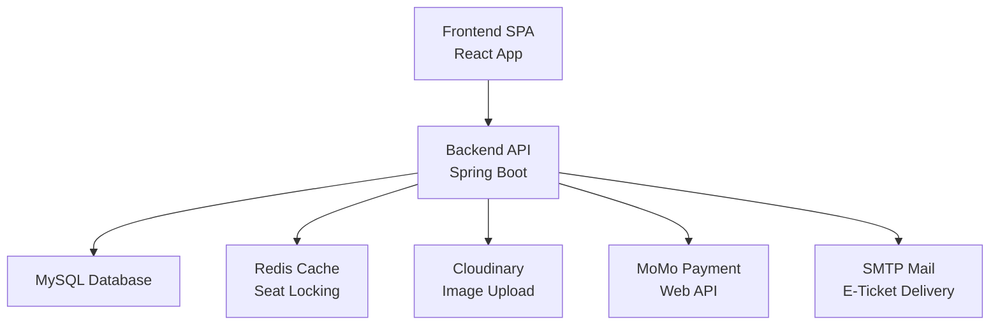
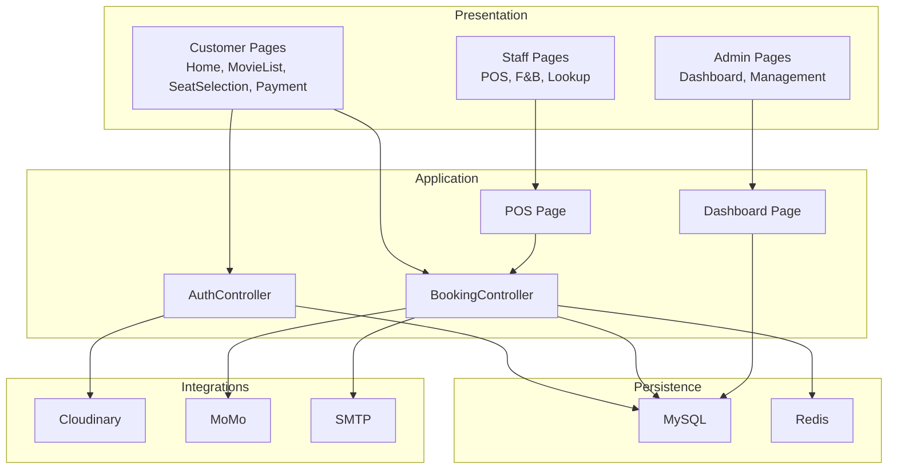
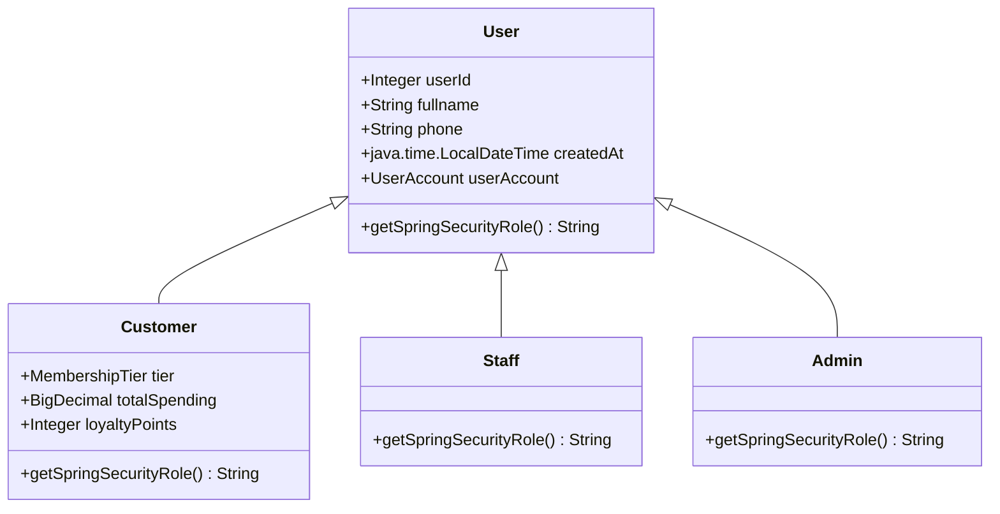
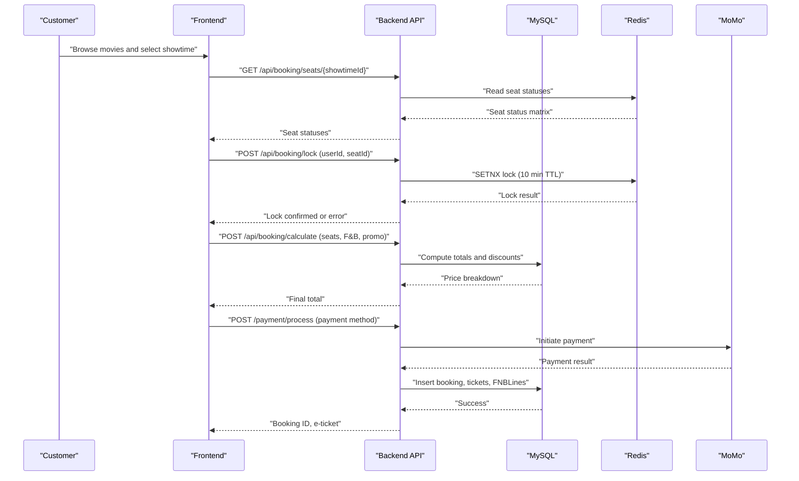
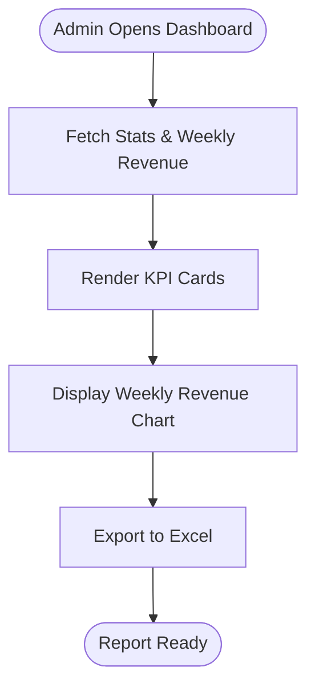
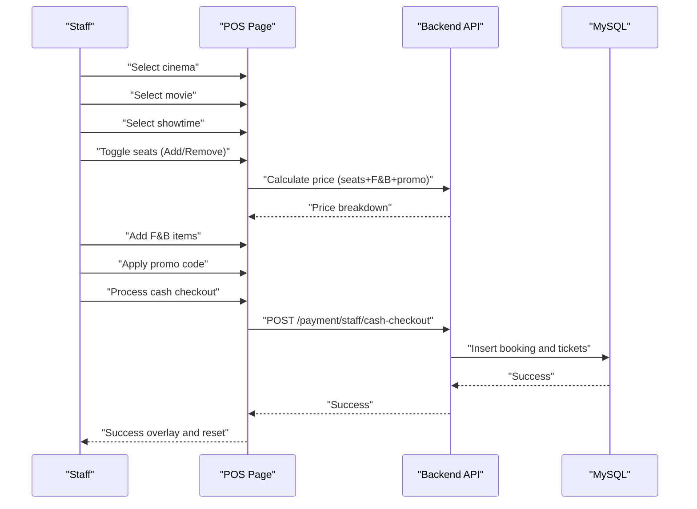
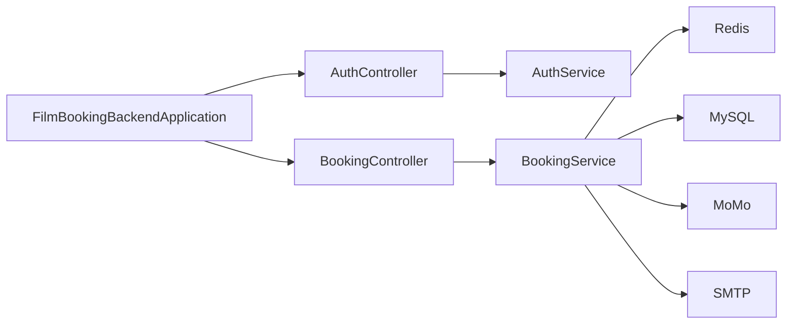

# System Introduction

<cite>
**Referenced Files in This Document**
- [README.md](file://README.md)
- [FilmBookingBackendApplication.java](file://backend/src/main/java/com/cinema/booking/FilmBookingBackendApplication.java)
- [User.java](file://backend/src/main/java/com/cinema/booking/entities/User.java)
- [Customer.java](file://backend/src/main/java/com/cinema/booking/entities/Customer.java)
- [Staff.java](file://backend/src/main/java/com/cinema/booking/entities/Staff.java)
- [Admin.java](file://backend/src/main/java/com/cinema/booking/entities/Admin.java)
- [AuthController.java](file://backend/src/main/java/com/cinema/booking/controllers/AuthController.java)
- [BookingController.java](file://backend/src/main/java/com/cinema/booking/controllers/BookingController.java)
- [App.jsx](file://frontend/src/App.jsx)
- [Home.jsx](file://frontend/src/pages/Home.jsx)
- [Dashboard.jsx](file://frontend/src/pages/admin/Dashboard.jsx)
- [BoxOfficePOS.jsx](file://frontend/src/pages/staff/BoxOfficePOS.jsx)
- [database_schema.sql](file://database_schema.sql)
- [application.properties](file://backend/src/main/resources/application.properties)
</cite>

## Table of Contents
1. [Introduction](#introduction)
2. [Project Structure](#project-structure)
3. [Core Components](#core-components)
4. [Architecture Overview](#architecture-overview)
5. [Detailed Component Analysis](#detailed-component-analysis)
6. [Dependency Analysis](#dependency-analysis)
7. [Performance Considerations](#performance-considerations)
8. [Troubleshooting Guide](#troubleshooting-guide)
9. [Conclusion](#conclusion)

## Introduction
This document introduces a full-stack online movie ticket booking platform designed to deliver a seamless experience akin to industry leaders such as CGV, Lotte Cinema, and Galaxy. The system supports three primary roles—Customer, Staff, and Admin—each with distinct capabilities and workflows.

- Customer: Browse movies, select cinema and showtime, choose seats, add food and beverages (F&B), apply discounts, and complete secure payments. Upon successful payment, e-tickets are generated and delivered via email and QR code.
- Staff: Operates the Box Office Point of Sale (POS) to sell tickets and F&B, manage seat selection, apply promotions, and process cash payments. They can also look up orders and assist customers at the counter.
- Admin: Manages the entire ecosystem through a comprehensive dashboard, overseeing movies, showtimes, cinema infrastructure, F&B inventory, promotions, and user accounts. Admins generate reports, monitor revenue, and maintain operational health.

The platform emphasizes robust transaction handling, real-time seat locking, dynamic pricing, and scalable architecture to support high-concurrency scenarios during blockbuster releases.

## Project Structure
The project follows a layered, modular structure:
- Backend: Spring Boot application exposing REST APIs for authentication, booking, seat management, payment processing, and administrative dashboards.
- Frontend: React-based single-page application (SPA) with role-specific layouts and pages for customer booking, admin management, and staff POS.
- Database: MySQL with entity relationships defined in the schema, supporting user hierarchy, movie metadata, cinema infrastructure, showtimes, bookings, and transactions.
- Configuration: Environment-driven properties for database, Redis caching, JWT security, third-party integrations (Cloudinary, MoMo), and dynamic pricing rules.

**Diagram sources**
- [App.jsx:1-84](file://frontend/src/App.jsx#L1-L84)
- [application.properties:8-97](file://backend/src/main/resources/application.properties#L8-L97)

**Section sources**
- [README.md:1-197](file://README.md#L1-L197)
- [database_schema.sql:1-200](file://database_schema.sql#L1-L200)
- [application.properties:1-97](file://backend/src/main/resources/application.properties#L1-L97)

## Core Components
- Authentication and Authorization
  - REST endpoints for login, registration, and Google login.
  - Role-based access control enforced via JWT tokens and Spring Security roles.
- Booking Engine
  - Seat status retrieval, real-time locking/unlocking, price calculation, and booking lifecycle management (cancel/refund/print).
- Admin Dashboard
  - System-wide statistics, revenue charts, and management panels for movies, showtimes, facilities, artists, F&B, and vouchers.
- Staff POS
  - Full-screen POS for selecting cinema, movie, showtime, seats, adding F&B, applying promotions, and processing cash payments.
- Customer Experience
  - Discover movies, filter by genre and rating, select cinema and showtime, choose seats, add F&B, and complete payment with e-ticket generation.

**Section sources**
- [AuthController.java:1-54](file://backend/src/main/java/com/cinema/booking/controllers/AuthController.java#L1-L54)
- [BookingController.java:1-114](file://backend/src/main/java/com/cinema/booking/controllers/BookingController.java#L1-L114)
- [Dashboard.jsx:1-343](file://frontend/src/pages/admin/Dashboard.jsx#L1-L343)
- [BoxOfficePOS.jsx:1-836](file://frontend/src/pages/staff/BoxOfficePOS.jsx#L1-L836)
- [Home.jsx:1-560](file://frontend/src/pages/Home.jsx#L1-L560)

## Architecture Overview
The system employs a microservice-friendly monolith with clear separation of concerns:
- Presentation Layer: React SPA routes for customer, admin, and staff views.
- Application Layer: Spring Boot controllers delegating to services implementing business logic.
- Persistence Layer: MySQL for durable storage; Redis for high-speed seat locking and caching.
- Integration Layer: Cloudinary for media, MoMo for payments, SMTP for email notifications.

**Diagram sources**
- [App.jsx:1-84](file://frontend/src/App.jsx#L1-L84)
- [AuthController.java:1-54](file://backend/src/main/java/com/cinema/booking/controllers/AuthController.java#L1-L54)
- [BookingController.java:1-114](file://backend/src/main/java/com/cinema/booking/controllers/BookingController.java#L1-L114)
- [Dashboard.jsx:1-343](file://frontend/src/pages/admin/Dashboard.jsx#L1-L343)
- [BoxOfficePOS.jsx:1-836](file://frontend/src/pages/staff/BoxOfficePOS.jsx#L1-L836)
- [application.properties:54-97](file://backend/src/main/resources/application.properties#L54-L97)

## Detailed Component Analysis

### Roles and Capabilities
- Customer
  - Account management, browsing movies, filtering, viewing details, reviews, and ratings.
  - Force-login requirement to initiate booking; guest users can explore content.
  - Booking workflow: select city → cinema → movie → showtime → seats → F&B → payment → e-ticket/email delivery.
- Staff
  - POS-driven sales: choose cinema → movie → showtime → seats → F&B → cash checkout.
  - Inventory-aware F&B selection with stock checks; undo/redo actions via command pattern.
- Admin
  - Dashboard analytics: revenue, ticket counts, activity metrics, and category breakdowns.
  - Management of movies, showtimes, facilities, artists, F&B, and vouchers.
  - Exportable reports and real-time data synchronization.

**Diagram sources**
- [User.java:1-38](file://backend/src/main/java/com/cinema/booking/entities/User.java#L1-L38)
- [Customer.java:1-31](file://backend/src/main/java/com/cinema/booking/entities/Customer.java#L1-L31)
- [Staff.java:1-19](file://backend/src/main/java/com/cinema/booking/entities/Staff.java#L1-L19)
- [Admin.java:1-19](file://backend/src/main/java/com/cinema/booking/entities/Admin.java#L1-L19)

**Section sources**
- [README.md:3-63](file://README.md#L3-L63)
- [User.java:1-38](file://backend/src/main/java/com/cinema/booking/entities/User.java#L1-L38)
- [Customer.java:1-31](file://backend/src/main/java/com/cinema/booking/entities/Customer.java#L1-L31)
- [Staff.java:1-19](file://backend/src/main/java/com/cinema/booking/entities/Staff.java#L1-L19)
- [Admin.java:1-19](file://backend/src/main/java/com/cinema/booking/entities/Admin.java#L1-L19)

### Booking Workflow (Customer)
The customer booking flow is a guided, step-by-step process:
1. Choose City → Cinemas
2. Select Movie → Filter by genre/rating
3. Choose Showtime → View room and screen type
4. Select Seats → Visual seat map with real-time locks
5. Add F&B → Stock-aware quick selection
6. Payment → Apply discount, choose payment method, receive e-ticket

**Diagram sources**
- [BookingController.java:25-62](file://backend/src/main/java/com/cinema/booking/controllers/BookingController.java#L25-L62)
- [application.properties:68-77](file://backend/src/main/resources/application.properties#L68-L77)

**Section sources**
- [README.md:26-44](file://README.md#L26-L44)
- [Home.jsx:1-560](file://frontend/src/pages/Home.jsx#L1-L560)
- [BoxOfficePOS.jsx:1-836](file://frontend/src/pages/staff/BoxOfficePOS.jsx#L1-L836)

### Admin Dashboard Capabilities
- Real-time statistics: total revenue, tickets sold, active movies, total users, F&B items, and vouchers.
- Weekly revenue chart with normalized bars and tooltips.
- Export to Excel with summary sheet and weekly revenue calculations.
- Management panels for movies, showtimes, facilities, artists, F&B, and vouchers.

**Diagram sources**
- [Dashboard.jsx:20-33](file://frontend/src/pages/admin/Dashboard.jsx#L20-L33)

**Section sources**
- [Dashboard.jsx:1-343](file://frontend/src/pages/admin/Dashboard.jsx#L1-L343)
- [README.md:45-63](file://README.md#L45-L63)

### Staff POS Operations
- Step-by-step workflow: select cinema → movie → showtime → seats.
- Visual seat grid with color-coded states (available, selected, sold, pending).
- F&B quick panel with stock-aware add/remove actions.
- Command pattern for undo/redo of seat and F&B selections.
- Cash checkout endpoint with real-time price calculation and success overlay.

**Diagram sources**
- [BoxOfficePOS.jsx:188-290](file://frontend/src/pages/staff/BoxOfficePOS.jsx#L188-L290)
- [BookingController.java:57-62](file://backend/src/main/java/com/cinema/booking/controllers/BookingController.java#L57-L62)

**Section sources**
- [BoxOfficePOS.jsx:1-836](file://frontend/src/pages/staff/BoxOfficePOS.jsx#L1-L836)
- [README.md:45-63](file://README.md#L45-L63)

## Dependency Analysis
- Backend entry point initializes the Spring Boot application.
- Controllers depend on services for business logic.
- Services interact with repositories and external systems (Redis, Cloudinary, MoMo).
- Frontend routes are organized by role, with shared providers and context for booking state.

**Diagram sources**
- [FilmBookingBackendApplication.java:1-14](file://backend/src/main/java/com/cinema/booking/FilmBookingBackendApplication.java#L1-L14)
- [AuthController.java:1-54](file://backend/src/main/java/com/cinema/booking/controllers/AuthController.java#L1-L54)
- [BookingController.java:1-114](file://backend/src/main/java/com/cinema/booking/controllers/BookingController.java#L1-L114)
- [application.properties:54-97](file://backend/src/main/resources/application.properties#L54-L97)

**Section sources**
- [FilmBookingBackendApplication.java:1-14](file://backend/src/main/java/com/cinema/booking/FilmBookingBackendApplication.java#L1-L14)
- [application.properties:1-97](file://backend/src/main/resources/application.properties#L1-L97)

## Performance Considerations
- Real-time seat locking with Redis prevents double-booking and reduces contention on the database.
- Caching of showtime data and seat statuses minimizes repeated database queries.
- Asynchronous background jobs (e.g., email notifications) offload post-payment tasks from the main API path.
- Dynamic pricing engine applies weekend/holiday/occupancy surcharges and early bird discounts efficiently.

[No sources needed since this section provides general guidance]

## Troubleshooting Guide
- Authentication failures: Verify credentials and ensure JWT secret and expiration are configured correctly.
- Redis seat lock errors: Confirm Redis connectivity and TTL settings; ensure locks are released on timeout or cancellation.
- Payment processing issues: Validate MoMo endpoint credentials and redirect/IPN URLs; check sandbox mode configuration.
- Email delivery problems: Confirm SMTP host, port, username, and app password settings.
- CORS errors: Ensure frontend URL is configured in application properties for cross-origin requests.

**Section sources**
- [application.properties:35-97](file://backend/src/main/resources/application.properties#L35-L97)

## Conclusion
This cinema booking platform delivers a modern, scalable, and secure solution for online movie ticket reservations. With clear role-based workflows, robust seat locking, dynamic pricing, and comprehensive admin and staff tools, the system is well-suited for high-traffic environments and enterprise-grade operations. The architecture balances simplicity with powerful capabilities, enabling rapid feature development while maintaining transactional integrity and user experience.