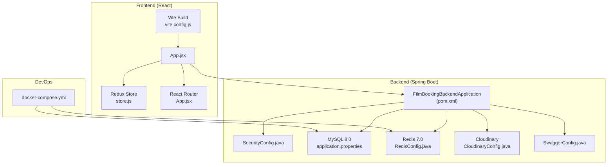
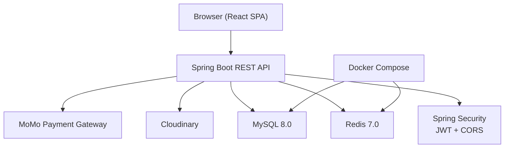
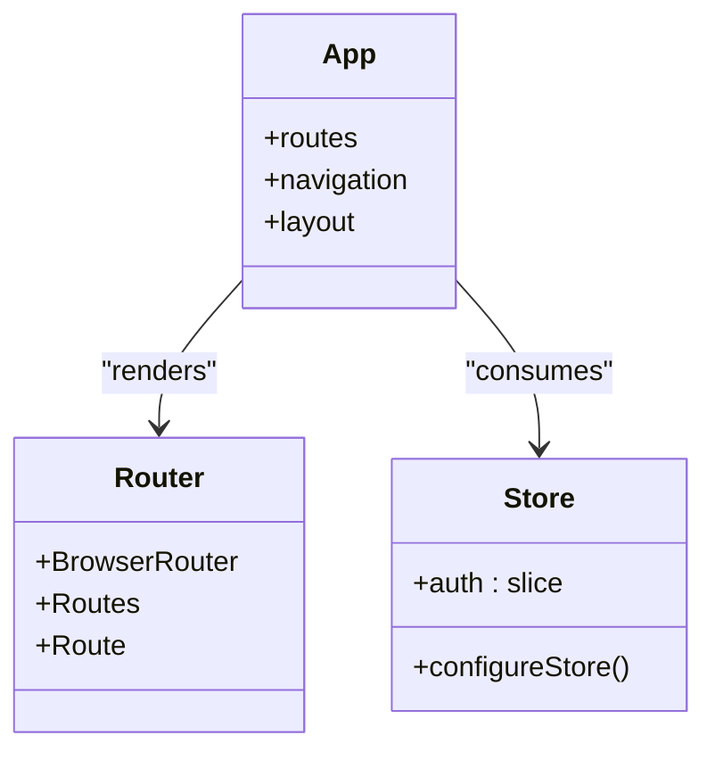
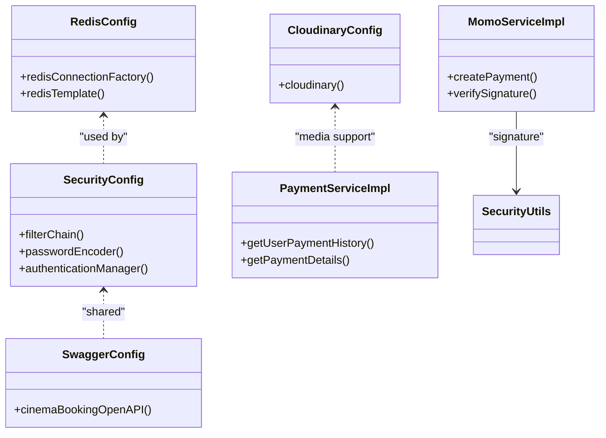
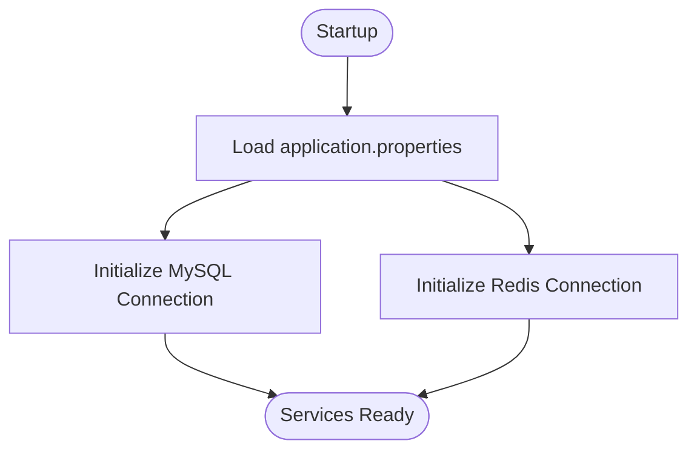
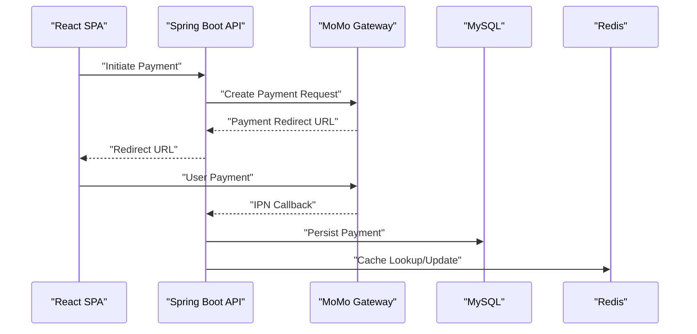
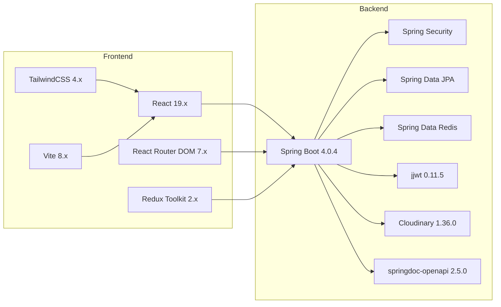

# Technology Stack

<cite>
**Referenced Files in This Document**
- [pom.xml](file://backend/pom.xml)
- [application.properties](file://backend/src/main/resources/application.properties)
- [SecurityConfig.java](file://backend/src/main/java/com/cinema/booking/config/SecurityConfig.java)
- [RedisConfig.java](file://backend/src/main/java/com/cinema/booking/config/RedisConfig.java)
- [CloudinaryConfig.java](file://backend/src/main/java/com/cinema/booking/config/CloudinaryConfig.java)
- [CorsConfig.java](file://backend/src/main/java/com/cinema/booking/config/CorsConfig.java)
- [SwaggerConfig.java](file://backend/src/main/java/com/cinema/booking/config/SwaggerConfig.java)
- [MomoServiceImpl.java](file://backend/src/main/java/com/cinema/booking/services/impl/MomoServiceImpl.java)
- [PaymentServiceImpl.java](file://backend/src/main/java/com/cinema/booking/services/impl/PaymentServiceImpl.java)
- [docker-compose.yml](file://docker-compose.yml)
- [package.json](file://frontend/package.json)
- [vite.config.js](file://frontend/vite.config.js)
- [store.js](file://frontend/src/store/store.js)
- [App.jsx](file://frontend/src/App.jsx)
</cite>

## Table of Contents
1. [Introduction](#introduction)
2. [Project Structure](#project-structure)
3. [Core Components](#core-components)
4. [Architecture Overview](#architecture-overview)
5. [Detailed Component Analysis](#detailed-component-analysis)
6. [Dependency Analysis](#dependency-analysis)
7. [Performance Considerations](#performance-considerations)
8. [Troubleshooting Guide](#troubleshooting-guide)
9. [Conclusion](#conclusion)

## Introduction
This document presents the complete technology stack for the cinema booking system. It covers the frontend built with modern ReactJS and Redux Toolkit, the backend powered by Spring Boot 4.0.4 on Java 17, integrated security and persistence, caching via Redis, database design with MySQL 8.0, third-party integrations for payments (MoMo), media storage (Cloudinary), and containerization with Docker. It also includes version compatibility, development tools, build configurations, and the rationale behind each choice for optimal performance, scalability, and maintainability.

## Project Structure
The system is organized into two primary modules:
- Backend: Spring Boot application with REST APIs, security, persistence, caching, and integrations.
- Frontend: React application with routing, state management, and styling.

**Diagram sources**
- [App.jsx:1-84](file://frontend/src/App.jsx#L1-L84)
- [store.js:1-11](file://frontend/src/store/store.js#L1-L11)
- [vite.config.js:1-15](file://frontend/vite.config.js#L1-L15)
- [pom.xml:1-108](file://backend/pom.xml#L1-L108)
- [SecurityConfig.java:1-82](file://backend/src/main/java/com/cinema/booking/config/SecurityConfig.java#L1-L82)
- [application.properties:1-97](file://backend/src/main/resources/application.properties#L1-L97)
- [RedisConfig.java:1-55](file://backend/src/main/java/com/cinema/booking/config/RedisConfig.java#L1-L55)
- [CloudinaryConfig.java:1-33](file://backend/src/main/java/com/cinema/booking/config/CloudinaryConfig.java#L1-L33)
- [SwaggerConfig.java:1-37](file://backend/src/main/java/com/cinema/booking/config/SwaggerConfig.java#L1-L37)
- [docker-compose.yml:1-34](file://docker-compose.yml#L1-L34)

**Section sources**
- [pom.xml:1-108](file://backend/pom.xml#L1-L108)
- [application.properties:1-97](file://backend/src/main/resources/application.properties#L1-L97)
- [docker-compose.yml:1-34](file://docker-compose.yml#L1-L34)
- [package.json:1-39](file://frontend/package.json#L1-L39)
- [vite.config.js:1-15](file://frontend/vite.config.js#L1-L15)
- [App.jsx:1-84](file://frontend/src/App.jsx#L1-L84)
- [store.js:1-11](file://frontend/src/store/store.js#L1-L11)

## Core Components
- Frontend stack
  - ReactJS with modern ES6+ features and JSX for component-based UI.
  - Redux Toolkit for predictable global state management.
  - React Router for declarative client-side routing.
  - Tailwind CSS via Vite plugin for utility-first styling.
  - Vite for fast build tooling and development server.
- Backend stack
  - Java 17 with Spring Boot 4.0.4 for rapid application development.
  - Spring Security for authentication and authorization.
  - Spring Data JPA with Hibernate for ORM and persistence.
  - Redis 7.0 for caching and session-like state management.
  - MySQL 8.0 for relational data persistence.
  - Swagger/OpenAPI for interactive API documentation.
  - Cloudinary for media/image storage and transformations.
  - MoMo payment gateway integration for online payments.
- DevOps and infrastructure
  - Docker Compose for containerized MySQL and Redis services.

**Section sources**
- [package.json:1-39](file://frontend/package.json#L1-L39)
- [vite.config.js:1-15](file://frontend/vite.config.js#L1-L15)
- [store.js:1-11](file://frontend/src/store/store.js#L1-L11)
- [App.jsx:1-84](file://frontend/src/App.jsx#L1-L84)
- [pom.xml:1-108](file://backend/pom.xml#L1-L108)
- [application.properties:1-97](file://backend/src/main/resources/application.properties#L1-L97)
- [SecurityConfig.java:1-82](file://backend/src/main/java/com/cinema/booking/config/SecurityConfig.java#L1-L82)
- [RedisConfig.java:1-55](file://backend/src/main/java/com/cinema/booking/config/RedisConfig.java#L1-L55)
- [CloudinaryConfig.java:1-33](file://backend/src/main/java/com/cinema/booking/config/CloudinaryConfig.java#L1-L33)
- [SwaggerConfig.java:1-37](file://backend/src/main/java/com/cinema/booking/config/SwaggerConfig.java#L1-L37)
- [docker-compose.yml:1-34](file://docker-compose.yml#L1-L34)

## Architecture Overview
The system follows a classic three-tier architecture:
- Presentation tier: React SPA with routing and state management.
- Application tier: Spring Boot REST APIs with security, business logic, and service orchestration.
- Data tier: MySQL for persistent data and Redis for caching and transient state.

**Diagram sources**
- [App.jsx:1-84](file://frontend/src/App.jsx#L1-L84)
- [SecurityConfig.java:1-82](file://backend/src/main/java/com/cinema/booking/config/SecurityConfig.java#L1-L82)
- [RedisConfig.java:1-55](file://backend/src/main/java/com/cinema/booking/config/RedisConfig.java#L1-L55)
- [application.properties:1-97](file://backend/src/main/resources/application.properties#L1-L97)
- [CloudinaryConfig.java:1-33](file://backend/src/main/java/com/cinema/booking/config/CloudinaryConfig.java#L1-L33)
- [docker-compose.yml:1-34](file://docker-compose.yml#L1-L34)

## Detailed Component Analysis

### Frontend Stack
- ReactJS and Vite
  - React 19.x with React Router DOM 7.x for routing.
  - Vite 8.x with React and TailwindCSS plugins for optimized builds and HMR.
- State Management
  - Redux Toolkit 2.x with a configured store holding authentication state.
- Styling
  - Tailwind CSS 4.x via TailwindCSS Vite plugin for utility-first styling.
- Development Tools
  - ESLint 9.x and TailwindCSS Vite plugin for linting and build-time CSS processing.

**Diagram sources**
- [App.jsx:1-84](file://frontend/src/App.jsx#L1-L84)
- [store.js:1-11](file://frontend/src/store/store.js#L1-L11)

**Section sources**
- [package.json:1-39](file://frontend/package.json#L1-L39)
- [vite.config.js:1-15](file://frontend/vite.config.js#L1-L15)
- [store.js:1-11](file://frontend/src/store/store.js#L1-L11)
- [App.jsx:1-84](file://frontend/src/App.jsx#L1-L84)

### Backend Stack
- Java 17 and Spring Boot 4.0.4
  - Modern JVM baseline with Spring Boot starters for web, security, JPA, Redis, mail, validation, and testing.
- Spring Security
  - Stateless JWT-based authentication, method-level security, and CORS configuration.
- Spring Data JPA
  - Hibernate ORM with MySQL dialect and schema updates enabled for development.
- Redis Integration
  - Lettuce connection factory and JSON serialization for caching and transient data.
- Cloudinary
  - Configured Cloudinary bean for media uploads and transformations.
- Swagger/OpenAPI
  - Interactive API documentation with bearer token security scheme.
- Payment Integration (MoMo)
  - MoMo service implementation with signature generation and payment initiation.

**Diagram sources**
- [SecurityConfig.java:1-82](file://backend/src/main/java/com/cinema/booking/config/SecurityConfig.java#L1-L82)
- [RedisConfig.java:1-55](file://backend/src/main/java/com/cinema/booking/config/RedisConfig.java#L1-L55)
- [CloudinaryConfig.java:1-33](file://backend/src/main/java/com/cinema/booking/config/CloudinaryConfig.java#L1-L33)
- [SwaggerConfig.java:1-37](file://backend/src/main/java/com/cinema/booking/config/SwaggerConfig.java#L1-L37)
- [MomoServiceImpl.java:1-95](file://backend/src/main/java/com/cinema/booking/services/impl/MomoServiceImpl.java#L1-L95)
- [PaymentServiceImpl.java:1-69](file://backend/src/main/java/com/cinema/booking/services/impl/PaymentServiceImpl.java#L1-L69)

**Section sources**
- [pom.xml:1-108](file://backend/pom.xml#L1-L108)
- [application.properties:1-97](file://backend/src/main/resources/application.properties#L1-L97)
- [SecurityConfig.java:1-82](file://backend/src/main/java/com/cinema/booking/config/SecurityConfig.java#L1-L82)
- [RedisConfig.java:1-55](file://backend/src/main/java/com/cinema/booking/config/RedisConfig.java#L1-L55)
- [CloudinaryConfig.java:1-33](file://backend/src/main/java/com/cinema/booking/config/CloudinaryConfig.java#L1-L33)
- [SwaggerConfig.java:1-37](file://backend/src/main/java/com/cinema/booking/config/SwaggerConfig.java#L1-L37)
- [MomoServiceImpl.java:1-95](file://backend/src/main/java/com/cinema/booking/services/impl/MomoServiceImpl.java#L1-L95)
- [PaymentServiceImpl.java:1-69](file://backend/src/main/java/com/cinema/booking/services/impl/PaymentServiceImpl.java#L1-L69)

### Database Architecture
- MySQL 8.0
  - JDBC URL, credentials, and driver configured; UTF-8mb4 collation enforced; Hibernate dialect set to MySQL.
  - Schema updates enabled for rapid iteration during development.
- Redis 7.0
  - Standalone configuration with JSON serialization for cached objects; configurable TTL via environment variable.

**Diagram sources**
- [application.properties:1-97](file://backend/src/main/resources/application.properties#L1-L97)
- [RedisConfig.java:1-55](file://backend/src/main/java/com/cinema/booking/config/RedisConfig.java#L1-L55)

**Section sources**
- [application.properties:1-97](file://backend/src/main/resources/application.properties#L1-L97)
- [docker-compose.yml:1-34](file://docker-compose.yml#L1-L34)
- [RedisConfig.java:1-55](file://backend/src/main/java/com/cinema/booking/config/RedisConfig.java#L1-L55)

### Third-Party Integrations
- MoMo Payment Gateway
  - Payment creation with HMAC-SHA256 signature, redirect URL, and IPN URL configured via environment variables.
- Cloudinary
  - Media upload configuration with cloud name, API key, and secret injected from environment variables.
- Docker
  - Compose file defines MySQL 8.0 and Redis 7 Alpine containers with persisted volumes and health checks.

**Diagram sources**
- [MomoServiceImpl.java:1-95](file://backend/src/main/java/com/cinema/booking/services/impl/MomoServiceImpl.java#L1-L95)
- [application.properties:68-77](file://backend/src/main/resources/application.properties#L68-L77)
- [PaymentServiceImpl.java:1-69](file://backend/src/main/java/com/cinema/booking/services/impl/PaymentServiceImpl.java#L1-L69)
- [RedisConfig.java:1-55](file://backend/src/main/java/com/cinema/booking/config/RedisConfig.java#L1-L55)

**Section sources**
- [MomoServiceImpl.java:1-95](file://backend/src/main/java/com/cinema/booking/services/impl/MomoServiceImpl.java#L1-L95)
- [application.properties:68-77](file://backend/src/main/resources/application.properties#L68-L77)
- [CloudinaryConfig.java:1-33](file://backend/src/main/java/com/cinema/booking/config/CloudinaryConfig.java#L1-L33)
- [docker-compose.yml:1-34](file://docker-compose.yml#L1-L34)

## Dependency Analysis
- Frontend dependencies
  - React 19.x, React Router DOM 7.x, Redux Toolkit 2.x, TailwindCSS 4.x, Vite 8.x, and related dev tools.
- Backend dependencies
  - Spring Boot 4.0.4 starters, Spring Security, Spring Data JPA, Spring Data Redis, JWT libraries, Cloudinary SDK, OpenAPI/Swagger, Google API client, and MySQL Connector/J.

**Diagram sources**
- [package.json:1-39](file://frontend/package.json#L1-L39)
- [pom.xml:1-108](file://backend/pom.xml#L1-L108)

**Section sources**
- [package.json:1-39](file://frontend/package.json#L1-L39)
- [pom.xml:1-108](file://backend/pom.xml#L1-L108)

## Performance Considerations
- Caching with Redis
  - Use JSON serialization for complex objects and configure TTL to balance freshness and performance.
- Database tuning
  - Enable SQL logging during development; consider connection pool tuning and query optimization in production.
- Frontend build optimization
  - Leverage Vite’s tree-shaking and code splitting; keep Tailwind purged for production builds.
- Payment flow
  - Minimize round trips by generating signatures client-side where appropriate and offloading heavy computations server-side.

## Troubleshooting Guide
- CORS errors
  - Verify allowed origin patterns and credentials configuration in CORS bean.
- JWT authentication failures
  - Confirm secret key and expiration settings match frontend expectations.
- Redis connectivity
  - Ensure host, port, username, and password are correctly set; confirm container health and volume mounts.
- MySQL connectivity
  - Validate JDBC URL, credentials, and timezone settings; check container readiness and schema initialization.
- MoMo payment issues
  - Inspect signature generation and endpoint configuration; verify redirect and IPN URLs.

**Section sources**
- [CorsConfig.java:1-39](file://backend/src/main/java/com/cinema/booking/config/CorsConfig.java#L1-L39)
- [SecurityConfig.java:1-82](file://backend/src/main/java/com/cinema/booking/config/SecurityConfig.java#L1-L82)
- [application.properties:58-77](file://backend/src/main/resources/application.properties#L58-L77)
- [docker-compose.yml:1-34](file://docker-compose.yml#L1-L34)

## Conclusion
The technology stack combines modern frontend and backend technologies with robust infrastructure and third-party integrations. ReactJS and Redux Toolkit deliver a responsive and scalable UI; Spring Boot 4.0.4 with Spring Security ensures secure and maintainable backend services; MySQL 8.0 and Redis 7.0 provide reliable persistence and caching. MoMo and Cloudinary integrate seamlessly for payments and media, while Docker simplifies deployment and environment consistency. Together, these choices support a high-performance, developer-friendly, and future-proof cinema booking platform.