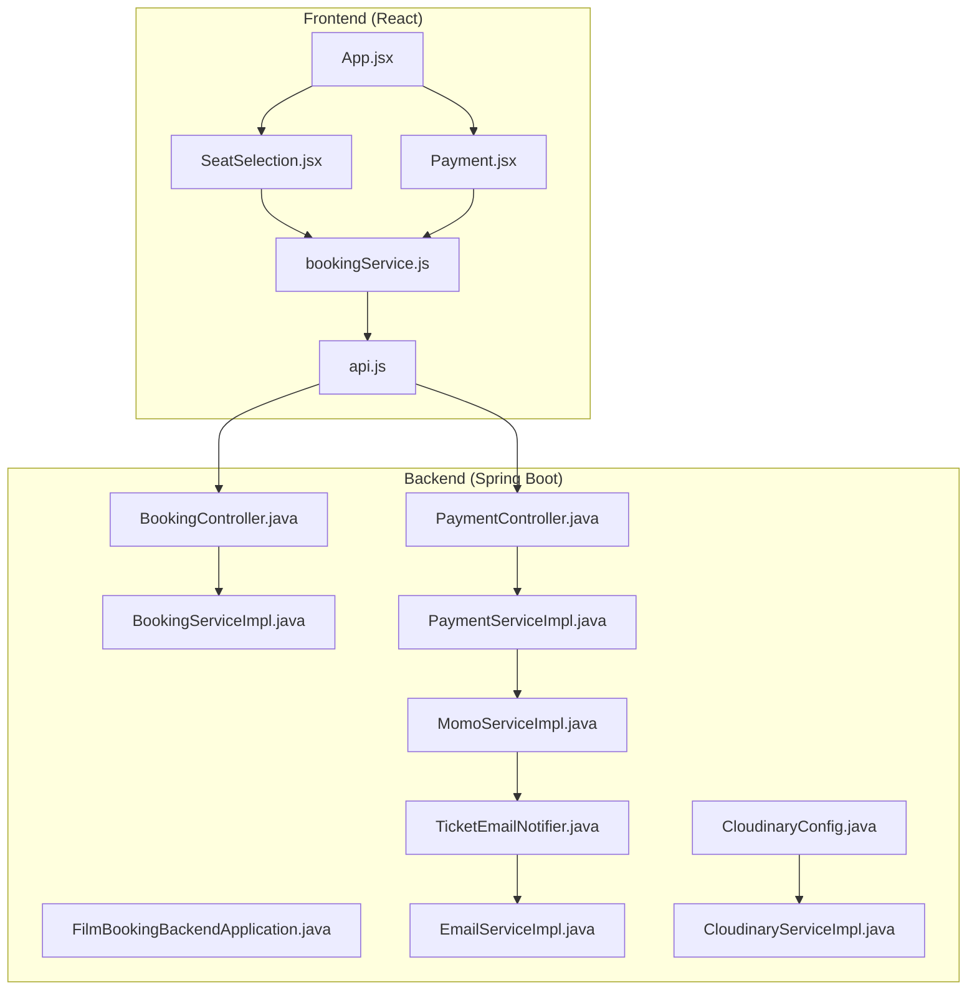
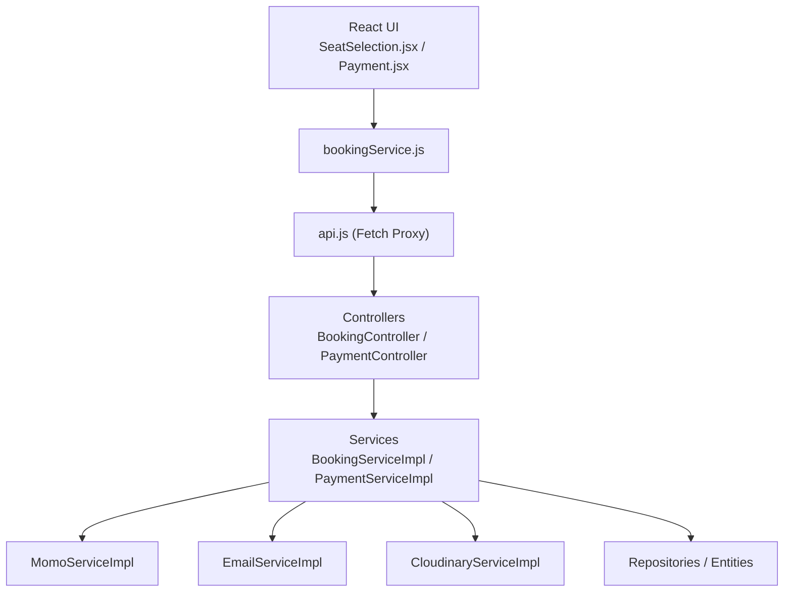
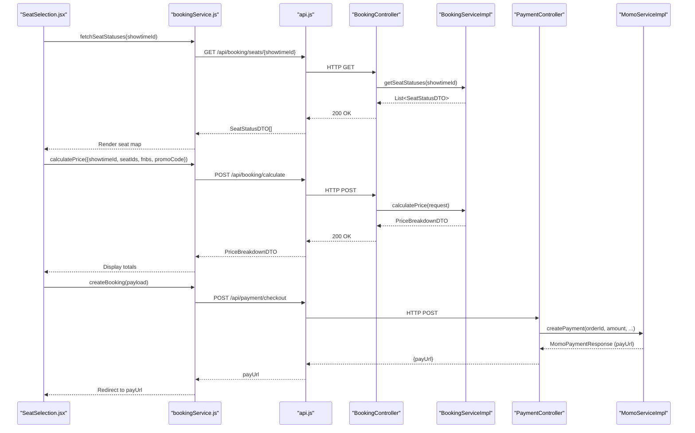
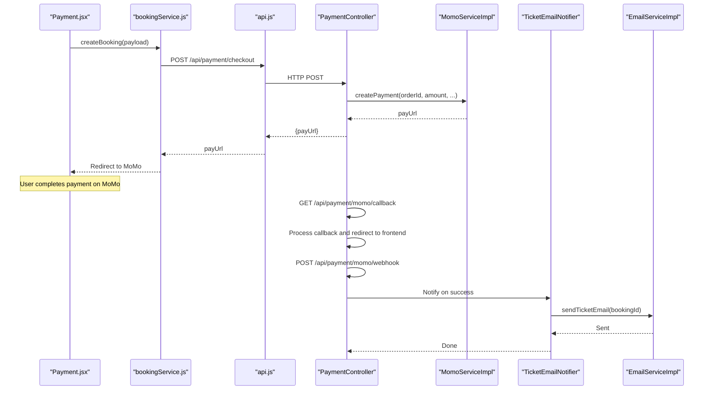
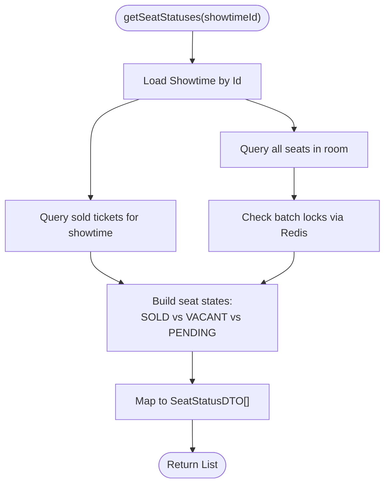
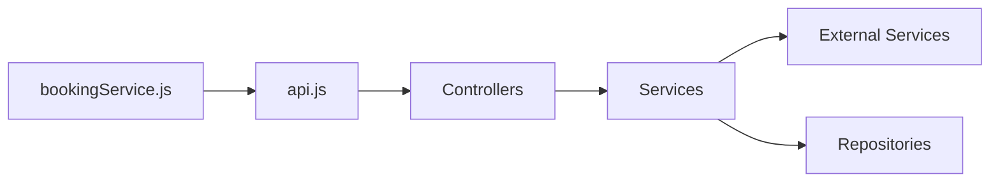

# Component Interactions

<cite>
**Referenced Files in This Document**
- [App.jsx](file://frontend/src/App.jsx)
- [SeatSelection.jsx](file://frontend/src/pages/SeatSelection.jsx)
- [Payment.jsx](file://frontend/src/pages/Payment.jsx)
- [bookingService.js](file://frontend/src/services/bookingService.js)
- [api.js](file://frontend/src/utils/api.js)
- [FilmBookingBackendApplication.java](file://backend/src/main/java/com/cinema/booking/FilmBookingBackendApplication.java)
- [BookingController.java](file://backend/src/main/java/com/cinema/booking/controllers/BookingController.java)
- [BookingServiceImpl.java](file://backend/src/main/java/com/cinema/booking/services/impl/BookingServiceImpl.java)
- [PaymentController.java](file://backend/src/main/java/com/cinema/booking/controllers/PaymentController.java)
- [PaymentServiceImpl.java](file://backend/src/main/java/com/cinema/booking/services/impl/PaymentServiceImpl.java)
- [MomoServiceImpl.java](file://backend/src/main/java/com/cinema/booking/services/impl/MomoServiceImpl.java)
- [EmailServiceImpl.java](file://backend/src/main/java/com/cinema/booking/services/impl/EmailServiceImpl.java)
- [TicketEmailNotifier.java](file://backend/src/main/java/com/cinema/booking/patterns/mediator/TicketEmailNotifier.java)
- [CloudinaryConfig.java](file://backend/src/main/java/com/cinema/booking/config/CloudinaryConfig.java)
- [CloudinaryServiceImpl.java](file://backend/src/main/java/com/cinema/booking/services/impl/CloudinaryServiceImpl.java)
</cite>

## Table of Contents
1. [Introduction](#introduction)
2. [Project Structure](#project-structure)
3. [Core Components](#core-components)
4. [Architecture Overview](#architecture-overview)
5. [Detailed Component Analysis](#detailed-component-analysis)
6. [Dependency Analysis](#dependency-analysis)
7. [Performance Considerations](#performance-considerations)
8. [Troubleshooting Guide](#troubleshooting-guide)
9. [Conclusion](#conclusion)

## Introduction
This document explains how the StarCine frontend (React) and backend (Spring Boot) collaborate to deliver the booking experience. It focuses on the REST API communication flow from React components through controllers to services and repositories, the data transfer mechanisms using DTOs, and the request/response cycle. It also documents integrations with external services (MoMo, email, Cloudinary), error handling and exception propagation, and asynchronous operations such as seat availability updates.

## Project Structure
The system is split into two primary modules:
- Frontend: React SPA with routing, context providers, and service clients.
- Backend: Spring Boot application exposing REST APIs, implementing business logic, and integrating with external systems.

**Diagram sources**
- [App.jsx:38-84](file://frontend/src/App.jsx#L38-L84)
- [SeatSelection.jsx:52-365](file://frontend/src/pages/SeatSelection.jsx#L52-L365)
- [Payment.jsx:41-482](file://frontend/src/pages/Payment.jsx#L41-L482)
- [bookingService.js:1-85](file://frontend/src/services/bookingService.js#L1-L85)
- [api.js:1-38](file://frontend/src/utils/api.js#L1-L38)
- [FilmBookingBackendApplication.java:6-11](file://backend/src/main/java/com/cinema/booking/FilmBookingBackendApplication.java#L6-L11)
- [BookingController.java:20-114](file://backend/src/main/java/com/cinema/booking/controllers/BookingController.java#L20-L114)
- [BookingServiceImpl.java:34-260](file://backend/src/main/java/com/cinema/booking/services/impl/BookingServiceImpl.java#L34-L260)
- [PaymentController.java:20-150](file://backend/src/main/java/com/cinema/booking/controllers/PaymentController.java#L20-L150)
- [PaymentServiceImpl.java:14-69](file://backend/src/main/java/com/cinema/booking/services/impl/PaymentServiceImpl.java#L14-L69)
- [MomoServiceImpl.java:14-95](file://backend/src/main/java/com/cinema/booking/services/impl/MomoServiceImpl.java#L14-L95)
- [EmailServiceImpl.java:20-98](file://backend/src/main/java/com/cinema/booking/services/impl/EmailServiceImpl.java#L20-L98)
- [TicketEmailNotifier.java:7-28](file://backend/src/main/java/com/cinema/booking/patterns/mediator/TicketEmailNotifier.java#L7-L28)
- [CloudinaryConfig.java:11-33](file://backend/src/main/java/com/cinema/booking/config/CloudinaryConfig.java#L11-L33)
- [CloudinaryServiceImpl.java:13-50](file://backend/src/main/java/com/cinema/booking/services/impl/CloudinaryServiceImpl.java#L13-L50)

**Section sources**
- [App.jsx:38-84](file://frontend/src/App.jsx#L38-L84)
- [FilmBookingBackendApplication.java:6-11](file://backend/src/main/java/com/cinema/booking/FilmBookingBackendApplication.java#L6-L11)

## Core Components
- Frontend React components:
  - SeatSelection: renders seat map, handles selection, and communicates with backend via bookingService.
  - Payment: collects buyer info, applies vouchers, triggers checkout, and displays payment results.
  - bookingService: encapsulates REST calls to backend with JWT authorization.
  - api.js: global fetch proxy enforcing auth checks and centralized error handling.
- Backend controllers:
  - BookingController: seat rendering, locking/unlocking, price calculation, booking retrieval/search, and state transitions.
  - PaymentController: checkout initiation, MoMo callbacks and webhooks, payment history, and staff cash checkout.
- Backend services:
  - BookingServiceImpl: orchestrates seat status computation, Redis-based locking, pricing engine integration, and state machine transitions.
  - PaymentServiceImpl: payment history and details retrieval.
  - MomoServiceImpl: constructs MoMo payment requests and verifies signatures.
  - EmailServiceImpl: sends ticket and welcome emails using prototypes.
  - CloudinaryServiceImpl: generates upload signatures for client-side media uploads.

**Section sources**
- [SeatSelection.jsx:52-365](file://frontend/src/pages/SeatSelection.jsx#L52-L365)
- [Payment.jsx:41-482](file://frontend/src/pages/Payment.jsx#L41-L482)
- [bookingService.js:1-85](file://frontend/src/services/bookingService.js#L1-L85)
- [api.js:1-38](file://frontend/src/utils/api.js#L1-L38)
- [BookingController.java:20-114](file://backend/src/main/java/com/cinema/booking/controllers/BookingController.java#L20-L114)
- [BookingServiceImpl.java:34-260](file://backend/src/main/java/com/cinema/booking/services/impl/BookingServiceImpl.java#L34-L260)
- [PaymentController.java:20-150](file://backend/src/main/java/com/cinema/booking/controllers/PaymentController.java#L20-L150)
- [PaymentServiceImpl.java:14-69](file://backend/src/main/java/com/cinema/booking/services/impl/PaymentServiceImpl.java#L14-L69)
- [MomoServiceImpl.java:14-95](file://backend/src/main/java/com/cinema/booking/services/impl/MomoServiceImpl.java#L14-L95)
- [EmailServiceImpl.java:20-98](file://backend/src/main/java/com/cinema/booking/services/impl/EmailServiceImpl.java#L20-L98)
- [CloudinaryServiceImpl.java:13-50](file://backend/src/main/java/com/cinema/booking/services/impl/CloudinaryServiceImpl.java#L13-L50)

## Architecture Overview
The frontend uses a centralized fetch proxy to attach JWT tokens and globally intercept unauthorized responses. Controllers expose REST endpoints that delegate to services. Services coordinate repositories and external integrations. DTOs carry data across layers and boundaries.

**Diagram sources**
- [SeatSelection.jsx:52-365](file://frontend/src/pages/SeatSelection.jsx#L52-L365)
- [Payment.jsx:41-482](file://frontend/src/pages/Payment.jsx#L41-L482)
- [bookingService.js:1-85](file://frontend/src/services/bookingService.js#L1-L85)
- [api.js:17-36](file://frontend/src/utils/api.js#L17-L36)
- [BookingController.java:20-114](file://backend/src/main/java/com/cinema/booking/controllers/BookingController.java#L20-L114)
- [PaymentController.java:20-150](file://backend/src/main/java/com/cinema/booking/controllers/PaymentController.java#L20-L150)
- [BookingServiceImpl.java:34-260](file://backend/src/main/java/com/cinema/booking/services/impl/BookingServiceImpl.java#L34-L260)
- [PaymentServiceImpl.java:14-69](file://backend/src/main/java/com/cinema/booking/services/impl/PaymentServiceImpl.java#L14-L69)
- [MomoServiceImpl.java:14-95](file://backend/src/main/java/com/cinema/booking/services/impl/MomoServiceImpl.java#L14-L95)
- [EmailServiceImpl.java:20-98](file://backend/src/main/java/com/cinema/booking/services/impl/EmailServiceImpl.java#L20-L98)
- [CloudinaryServiceImpl.java:13-50](file://backend/src/main/java/com/cinema/booking/services/impl/CloudinaryServiceImpl.java#L13-L50)

## Detailed Component Analysis

### REST API Communication Flow: Seat Selection and Booking
This sequence illustrates the seat selection and booking creation flow from the React frontend to the backend and payment gateway.

**Diagram sources**
- [SeatSelection.jsx:68-84](file://frontend/src/pages/SeatSelection.jsx#L68-L84)
- [bookingService.js:64-84](file://frontend/src/services/bookingService.js#L64-L84)
- [api.js:17-36](file://frontend/src/utils/api.js#L17-L36)
- [BookingController.java:27-62](file://backend/src/main/java/com/cinema/booking/controllers/BookingController.java#L27-L62)
- [BookingServiceImpl.java:77-149](file://backend/src/main/java/com/cinema/booking/services/impl/BookingServiceImpl.java#L77-L149)
- [PaymentController.java:33-51](file://backend/src/main/java/com/cinema/booking/controllers/PaymentController.java#L33-L51)
- [MomoServiceImpl.java:42-86](file://backend/src/main/java/com/cinema/booking/services/impl/MomoServiceImpl.java#L42-L86)

**Section sources**
- [SeatSelection.jsx:68-84](file://frontend/src/pages/SeatSelection.jsx#L68-L84)
- [bookingService.js:64-84](file://frontend/src/services/bookingService.js#L64-L84)
- [BookingController.java:27-62](file://backend/src/main/java/com/cinema/booking/controllers/BookingController.java#L27-L62)
- [BookingServiceImpl.java:77-149](file://backend/src/main/java/com/cinema/booking/services/impl/BookingServiceImpl.java#L77-L149)
- [PaymentController.java:33-51](file://backend/src/main/java/com/cinema/booking/controllers/PaymentController.java#L33-L51)
- [MomoServiceImpl.java:42-86](file://backend/src/main/java/com/cinema/booking/services/impl/MomoServiceImpl.java#L42-L86)

### Payment Processing Workflow: MoMo Redirect and Webhook
This sequence covers the end-to-end payment flow, including redirect callback and server-to-server webhook.

**Diagram sources**
- [Payment.jsx:144-171](file://frontend/src/pages/Payment.jsx#L144-L171)
- [bookingService.js:73-84](file://frontend/src/services/bookingService.js#L73-L84)
- [PaymentController.java:75-100](file://backend/src/main/java/com/cinema/booking/controllers/PaymentController.java#L75-L100)
- [MomoServiceImpl.java:42-86](file://backend/src/main/java/com/cinema/booking/services/impl/MomoServiceImpl.java#L42-L86)
- [TicketEmailNotifier.java:13-21](file://backend/src/main/java/com/cinema/booking/patterns/mediator/TicketEmailNotifier.java#L13-L21)
- [EmailServiceImpl.java:41-80](file://backend/src/main/java/com/cinema/booking/services/impl/EmailServiceImpl.java#L41-L80)

**Section sources**
- [Payment.jsx:144-171](file://frontend/src/pages/Payment.jsx#L144-L171)
- [bookingService.js:73-84](file://frontend/src/services/bookingService.js#L73-L84)
- [PaymentController.java:75-100](file://backend/src/main/java/com/cinema/booking/controllers/PaymentController.java#L75-L100)
- [TicketEmailNotifier.java:13-21](file://backend/src/main/java/com/cinema/booking/patterns/mediator/TicketEmailNotifier.java#L13-L21)
- [EmailServiceImpl.java:41-80](file://backend/src/main/java/com/cinema/booking/services/impl/EmailServiceImpl.java#L41-L80)

### Seat Availability and Real-Time Updates
Seat availability is computed from:
- Room seats
- Already sold tickets for the showtime
- Redis-held locks for pending reservations

**Diagram sources**
- [BookingServiceImpl.java:77-115](file://backend/src/main/java/com/cinema/booking/services/impl/BookingServiceImpl.java#L77-L115)

**Section sources**
- [BookingServiceImpl.java:77-115](file://backend/src/main/java/com/cinema/booking/services/impl/BookingServiceImpl.java#L77-L115)

### Data Transfer Mechanisms Using DTOs
- SeatStatusDTO: seatId, seatCode, seatRow, seatNumber, seatType, totalPrice, status.
- PriceBreakdownDTO: ticketTotal, fnbTotal, discountAmount, finalTotal.
- BookingDTO: bookingId, customerId, showtimeId, promoCode, totalPrice, status, createdAt, tickets[], fnbs[].
- PaymentHistoryDTO: paymentId, paymentMethod, amount, status, paidAt, booking summary.
- MoMo-specific DTOs: MomoPaymentRequest, MomoPaymentResponse, MomoCallbackRequest.

These DTOs are returned by controllers and consumed by React components to render UI and drive user actions.

**Section sources**
- [BookingController.java:27-68](file://backend/src/main/java/com/cinema/booking/controllers/BookingController.java#L27-L68)
- [BookingServiceImpl.java:200-244](file://backend/src/main/java/com/cinema/booking/services/impl/BookingServiceImpl.java#L200-L244)
- [PaymentController.java:112-131](file://backend/src/main/java/com/cinema/booking/controllers/PaymentController.java#L112-L131)
- [PaymentServiceImpl.java:36-67](file://backend/src/main/java/com/cinema/booking/services/impl/PaymentServiceImpl.java#L36-L67)

### Integration Points with External Services
- MoMo Payment Gateway:
  - PaymentController exposes checkout, redirect callback, and webhook endpoints.
  - MomoServiceImpl constructs payment requests and verifies signatures.
- Email Service:
  - EmailServiceImpl sends ticket and welcome emails using prototypes.
  - TicketEmailNotifier notifies email service upon payment success.
- Cloudinary Media Storage:
  - CloudinaryConfig registers Cloudinary bean.
  - CloudinaryServiceImpl generates upload signatures for client-side uploads.

**Section sources**
- [PaymentController.java:33-100](file://backend/src/main/java/com/cinema/booking/controllers/PaymentController.java#L33-L100)
- [MomoServiceImpl.java:42-93](file://backend/src/main/java/com/cinema/booking/services/impl/MomoServiceImpl.java#L42-L93)
- [EmailServiceImpl.java:41-96](file://backend/src/main/java/com/cinema/booking/services/impl/EmailServiceImpl.java#L41-L96)
- [TicketEmailNotifier.java:13-21](file://backend/src/main/java/com/cinema/booking/patterns/mediator/TicketEmailNotifier.java#L13-L21)
- [CloudinaryConfig.java:23-31](file://backend/src/main/java/com/cinema/booking/config/CloudinaryConfig.java#L23-L31)
- [CloudinaryServiceImpl.java:25-48](file://backend/src/main/java/com/cinema/booking/services/impl/CloudinaryServiceImpl.java#L25-L48)

## Dependency Analysis
- Frontend depends on:
  - bookingService for API calls.
  - api.js for centralized fetch proxy and auth header injection.
- Backend controllers depend on:
  - Services for business logic.
  - Repositories for persistence.
  - External services (MoMo, Email, Cloudinary) via dedicated service implementations.
- Services depend on:
  - Pricing engines, validators, and state machines for complex workflows.
  - Seat lock provider for Redis-based concurrency control.

**Diagram sources**
- [bookingService.js:1-85](file://frontend/src/services/bookingService.js#L1-L85)
- [api.js:17-36](file://frontend/src/utils/api.js#L17-L36)
- [BookingController.java:20-114](file://backend/src/main/java/com/cinema/booking/controllers/BookingController.java#L20-L114)
- [PaymentController.java:20-150](file://backend/src/main/java/com/cinema/booking/controllers/PaymentController.java#L20-L150)
- [BookingServiceImpl.java:34-260](file://backend/src/main/java/com/cinema/booking/services/impl/BookingServiceImpl.java#L34-L260)
- [PaymentServiceImpl.java:14-69](file://backend/src/main/java/com/cinema/booking/services/impl/PaymentServiceImpl.java#L14-L69)

**Section sources**
- [bookingService.js:1-85](file://frontend/src/services/bookingService.js#L1-L85)
- [api.js:17-36](file://frontend/src/utils/api.js#L17-L36)
- [BookingController.java:20-114](file://backend/src/main/java/com/cinema/booking/controllers/BookingController.java#L20-L114)
- [PaymentController.java:20-150](file://backend/src/main/java/com/cinema/booking/controllers/PaymentController.java#L20-L150)
- [BookingServiceImpl.java:34-260](file://backend/src/main/java/com/cinema/booking/services/impl/BookingServiceImpl.java#L34-L260)
- [PaymentServiceImpl.java:14-69](file://backend/src/main/java/com/cinema/booking/services/impl/PaymentServiceImpl.java#L14-L69)

## Performance Considerations
- Seat status computation batches lock checks to minimize Redis round trips.
- Redis TTL controls seat lock duration to prevent stale locks.
- Pricing engine uses a caching proxy to reduce repeated computations.
- Frontend calculates totals locally after receiving backend price breakdown to improve responsiveness.

[No sources needed since this section provides general guidance]

## Troubleshooting Guide
- Unauthorized Access:
  - The fetch proxy automatically clears tokens and redirects to login on 401 responses.
- Seat Locking Failures:
  - If lockSeat returns false or API returns bad request, the seat is either sold or already locked.
- Payment Callback Issues:
  - Verify MoMo endpoint configuration and signatures. Inspect logs for callback errors and webhook processing outcomes.
- Email Delivery:
  - Ensure customer has a valid email address and SMTP configuration is correct. Check email service logs for exceptions.
- Cloudinary Upload:
  - Confirm API key, cloud name, and secret are configured. Validate generated signatures and folders.

**Section sources**
- [api.js:24-30](file://frontend/src/utils/api.js#L24-L30)
- [BookingController.java:118-126](file://backend/src/main/java/com/cinema/booking/controllers/BookingController.java#L118-L126)
- [PaymentController.java:75-100](file://backend/src/main/java/com/cinema/booking/controllers/PaymentController.java#L75-L100)
- [EmailServiceImpl.java:41-96](file://backend/src/main/java/com/cinema/booking/services/impl/EmailServiceImpl.java#L41-L96)
- [CloudinaryConfig.java:23-31](file://backend/src/main/java/com/cinema/booking/config/CloudinaryConfig.java#L23-L31)

## Conclusion
The StarCine system integrates a React frontend with a Spring Boot backend through well-defined REST APIs and DTO-driven data exchange. Controllers delegate to services that orchestrate repositories and external integrations. Robust error handling and asynchronous notifications (emails) ensure a reliable user experience. The design supports scalable enhancements such as additional payment methods and advanced seat availability features.