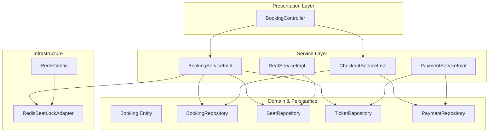
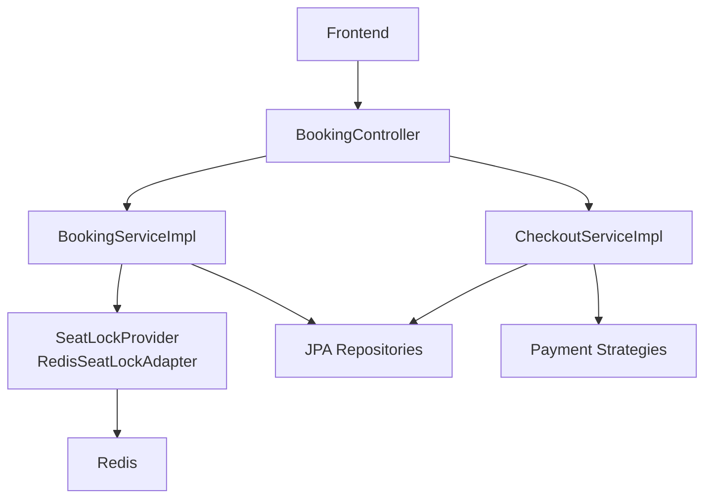
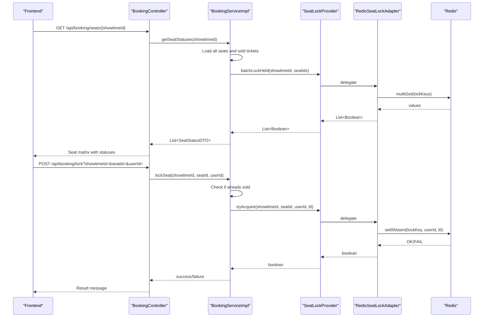
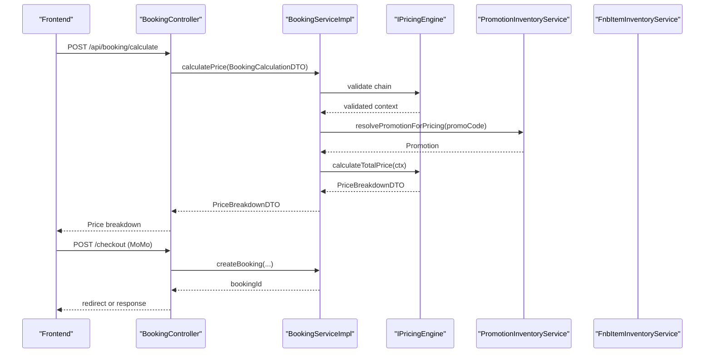
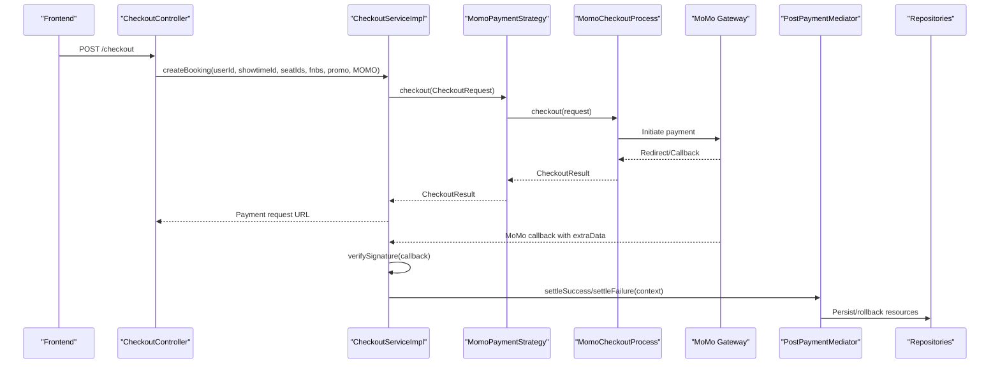
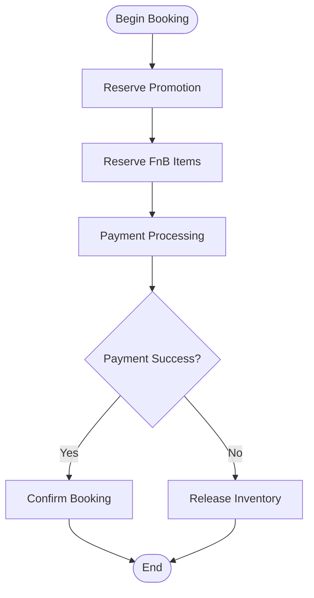
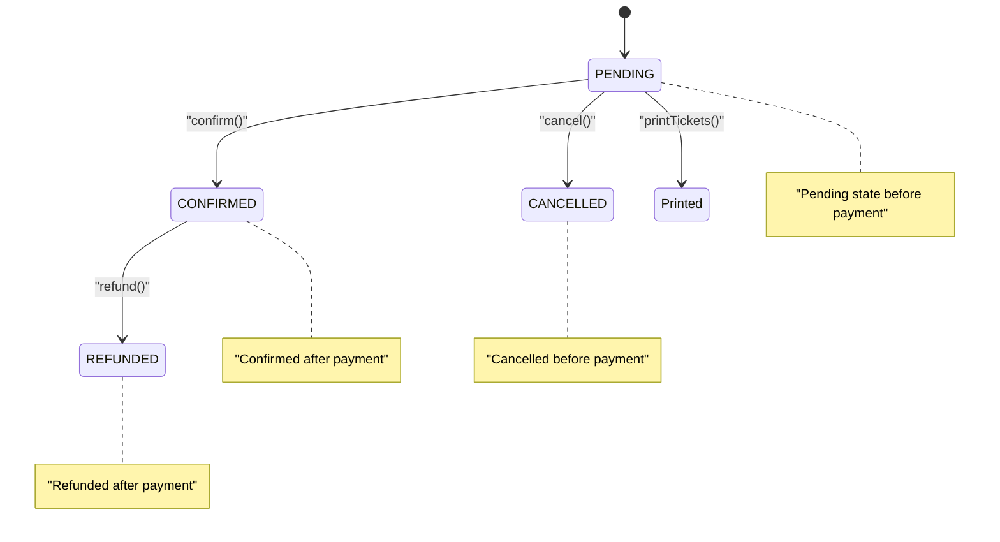
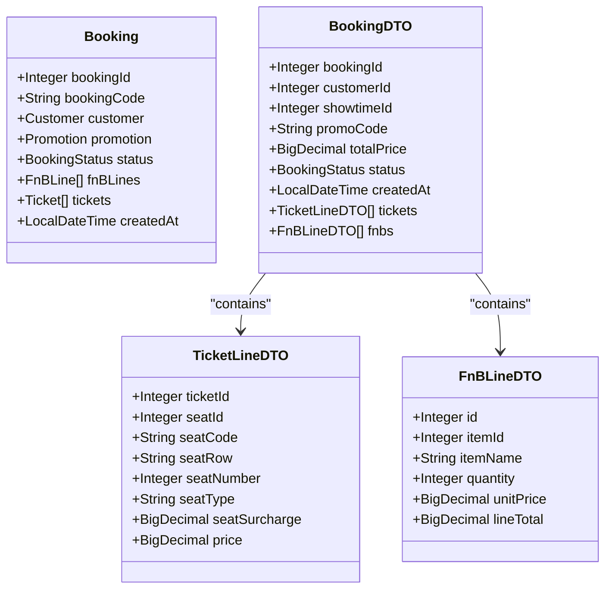
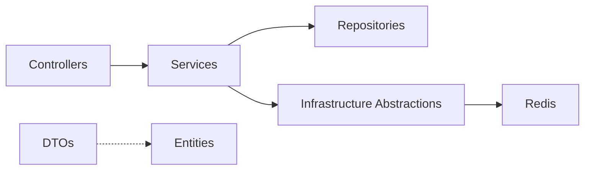

# Data Flow Architecture

<cite>
**Referenced Files in This Document**
- [BookingController.java](file://backend/src/main/java/com/cinema/booking/controllers/BookingController.java)
- [BookingServiceImpl.java](file://backend/src/main/java/com/cinema/booking/services/impl/BookingServiceImpl.java)
- [CheckoutServiceImpl.java](file://backend/src/main/java/com/cinema/booking/services/impl/CheckoutServiceImpl.java)
- [SeatServiceImpl.java](file://backend/src/main/java/com/cinema/booking/services/impl/SeatServiceImpl.java)
- [PaymentServiceImpl.java](file://backend/src/main/java/com/cinema/booking/services/impl/PaymentServiceImpl.java)
- [RedisSeatLockAdapter.java](file://backend/src/main/java/com/cinema/booking/services/seatlock/RedisSeatLockAdapter.java)
- [SeatLockProvider.java](file://backend/src/main/java/com/cinema/booking/services/seatlock/SeatLockProvider.java)
- [RedisConfig.java](file://backend/src/main/java/com/cinema/booking/config/RedisConfig.java)
- [application.properties](file://backend/src/main/resources/application.properties)
- [BookingDTO.java](file://backend/src/main/java/com/cinema/booking/dtos/BookingDTO.java)
- [SeatStatusDTO.java](file://backend/src/main/java/com/cinema/booking/dtos/SeatStatusDTO.java)
- [Booking.java](file://backend/src/main/java/com/cinema/booking/entities/Booking.java)
- [SeatState.java](file://backend/src/main/java/com/cinema/booking/domain/seat/SeatState.java)
- [MomoPaymentStrategy.java](file://backend/src/main/java/com/cinema/booking/services/payment/MomoPaymentStrategy.java)
- [FnbItemInventoryService.java](file://backend/src/main/java/com/cinema/booking/services/FnbItemInventoryService.java)
- [PromotionInventoryService.java](file://backend/src/main/java/com/cinema/booking/services/PromotionInventoryService.java)
- [BookingContext.java](file://backend/src/main/java/com/cinema/booking/patterns/state/BookingContext.java)
</cite>

## Table of Contents
1. [Introduction](#introduction)
2. [Project Structure](#project-structure)
3. [Core Components](#core-components)
4. [Architecture Overview](#architecture-overview)
5. [Detailed Component Analysis](#detailed-component-analysis)
6. [Dependency Analysis](#dependency-analysis)
7. [Performance Considerations](#performance-considerations)
8. [Troubleshooting Guide](#troubleshooting-guide)
9. [Conclusion](#conclusion)
10. [Appendices](#appendices)

## Introduction
This document explains the end-to-end data flow architecture for the StarCine booking system. It covers booking creation, seat selection and locking, payment processing, and inventory management. It also documents transaction boundaries, data consistency mechanisms, the Redis-based seat locking strategy, caching considerations, and the role of DTOs in transforming domain entities for transport across the system. Security and validation measures are addressed alongside data validation and sanitization practices.

## Project Structure
The StarCine backend is organized around layered concerns:
- Controllers expose REST endpoints for clients.
- Services encapsulate business logic and orchestrate repositories and external systems.
- Repositories manage persistence via JPA/Hibernate.
- DTOs decouple transport data from persistent entities.
- Domain objects model business rules (e.g., seat states, booking states).
- Configuration defines Redis connectivity and application settings.

**Diagram sources**
- [BookingController.java:16-114](file://backend/src/main/java/com/cinema/booking/controllers/BookingController.java#L16-L114)
- [BookingServiceImpl.java:32-260](file://backend/src/main/java/com/cinema/booking/services/impl/BookingServiceImpl.java#L32-L260)
- [CheckoutServiceImpl.java:26-185](file://backend/src/main/java/com/cinema/booking/services/impl/CheckoutServiceImpl.java#L26-L185)
- [SeatServiceImpl.java:28-203](file://backend/src/main/java/com/cinema/booking/services/impl/SeatServiceImpl.java#L28-L203)
- [PaymentServiceImpl.java:15-69](file://backend/src/main/java/com/cinema/booking/services/impl/PaymentServiceImpl.java#L15-L69)
- [RedisSeatLockAdapter.java:14-56](file://backend/src/main/java/com/cinema/booking/services/seatlock/RedisSeatLockAdapter.java#L14-L56)
- [RedisConfig.java:17-55](file://backend/src/main/java/com/cinema/booking/config/RedisConfig.java#L17-L55)

**Section sources**
- [BookingController.java:16-114](file://backend/src/main/java/com/cinema/booking/controllers/BookingController.java#L16-L114)
- [application.properties:58-66](file://backend/src/main/resources/application.properties#L58-L66)

## Core Components
- Controllers: Expose endpoints for seat status retrieval, seat locking/unlocking, price calculation, booking detail retrieval, booking search, and state transitions (cancel/refund/print).
- Services:
  - Booking service: orchestrates seat status computation, seat locking, price calculation, and booking state transitions.
  - Checkout service: coordinates payment initiation and callbacks, delegating to payment strategies and the post-payment mediator.
  - Seat service: manages seat CRUD and bulk replacement with validation.
  - Payment service: aggregates payment history with movie metadata derived from tickets.
- Seat lock provider: abstraction for Redis-based seat locking with batch support.
- Redis adapter: implements SETNX semantics and TTL-based locks.
- DTOs: transform domain entities for transport and UI rendering.
- Entities: define persistent models and state transitions.

**Section sources**
- [BookingController.java:25-114](file://backend/src/main/java/com/cinema/booking/controllers/BookingController.java#L25-L114)
- [BookingServiceImpl.java:77-260](file://backend/src/main/java/com/cinema/booking/services/impl/BookingServiceImpl.java#L77-L260)
- [CheckoutServiceImpl.java:43-185](file://backend/src/main/java/com/cinema/booking/services/impl/CheckoutServiceImpl.java#L43-L185)
- [SeatServiceImpl.java:69-203](file://backend/src/main/java/com/cinema/booking/services/impl/SeatServiceImpl.java#L69-L203)
- [PaymentServiceImpl.java:24-69](file://backend/src/main/java/com/cinema/booking/services/impl/PaymentServiceImpl.java#L24-L69)
- [SeatLockProvider.java:8-19](file://backend/src/main/java/com/cinema/booking/services/seatlock/SeatLockProvider.java#L8-L19)
- [RedisSeatLockAdapter.java:27-54](file://backend/src/main/java/com/cinema/booking/services/seatlock/RedisSeatLockAdapter.java#L27-L54)
- [BookingDTO.java:10-55](file://backend/src/main/java/com/cinema/booking/dtos/BookingDTO.java#L10-L55)
- [SeatStatusDTO.java:9-26](file://backend/src/main/java/com/cinema/booking/dtos/SeatStatusDTO.java#L9-L26)
- [Booking.java:8-65](file://backend/src/main/java/com/cinema/booking/entities/Booking.java#L8-L65)

## Architecture Overview
The system follows a layered architecture:
- Presentation: REST controllers accept requests and return DTOs.
- Application: Services coordinate repositories, external integrations, and business rules.
- Persistence: JPA repositories persist entities.
- Infrastructure: Redis stores transient seat locks; JSON serialization supports typed values.

**Diagram sources**
- [BookingController.java:25-114](file://backend/src/main/java/com/cinema/booking/controllers/BookingController.java#L25-L114)
- [BookingServiceImpl.java:77-149](file://backend/src/main/java/com/cinema/booking/services/impl/BookingServiceImpl.java#L77-L149)
- [CheckoutServiceImpl.java:43-185](file://backend/src/main/java/com/cinema/booking/services/impl/CheckoutServiceImpl.java#L43-L185)
- [RedisSeatLockAdapter.java:14-56](file://backend/src/main/java/com/cinema/booking/services/seatlock/RedisSeatLockAdapter.java#L14-L56)
- [RedisConfig.java:31-53](file://backend/src/main/java/com/cinema/booking/config/RedisConfig.java#L31-L53)

## Detailed Component Analysis

### Seat Selection and Locking with Redis
The seat selection and locking flow prevents race conditions using Redis SETNX with TTL. The controller exposes endpoints to render seat statuses, lock seats, and unlock them.

**Diagram sources**
- [BookingController.java:27-55](file://backend/src/main/java/com/cinema/booking/controllers/BookingController.java#L27-L55)
- [BookingServiceImpl.java:77-131](file://backend/src/main/java/com/cinema/booking/services/impl/BookingServiceImpl.java#L77-L131)
- [SeatLockProvider.java:10-17](file://backend/src/main/java/com/cinema/booking/services/seatlock/SeatLockProvider.java#L10-L17)
- [RedisSeatLockAdapter.java:27-37](file://backend/src/main/java/com/cinema/booking/services/seatlock/RedisSeatLockAdapter.java#L27-L37)

Concurrency handling:
- Seat state snapshot determines whether locking is allowed.
- Redis SETNX ensures atomic acquisition; TTL prevents indefinite locks.
- Batch lock checks enable efficient seat grid rendering.

**Section sources**
- [BookingServiceImpl.java:77-131](file://backend/src/main/java/com/cinema/booking/services/impl/BookingServiceImpl.java#L77-L131)
- [SeatState.java:8-18](file://backend/src/main/java/com/cinema/booking/domain/seat/SeatState.java#L8-L18)
- [RedisSeatLockAdapter.java:27-54](file://backend/src/main/java/com/cinema/booking/services/seatlock/RedisSeatLockAdapter.java#L27-L54)

### Booking Creation and Price Calculation
Price calculation validates inputs and applies promotions and pricing strategies, while booking creation persists the booking and related items.

**Diagram sources**
- [BookingController.java:59-68](file://backend/src/main/java/com/cinema/booking/controllers/BookingController.java#L59-L68)
- [BookingServiceImpl.java:133-149](file://backend/src/main/java/com/cinema/booking/services/impl/BookingServiceImpl.java#L133-L149)
- [PromotionInventoryService.java:8](file://backend/src/main/java/com/cinema/booking/services/PromotionInventoryService.java#L8)
- [CheckoutServiceImpl.java:43-64](file://backend/src/main/java/com/cinema/booking/services/impl/CheckoutServiceImpl.java#L43-L64)

Transaction boundaries:
- Price calculation is read-only and does not modify state.
- Booking creation and payment settlement occur within transactional services.

**Section sources**
- [BookingServiceImpl.java:133-149](file://backend/src/main/java/com/cinema/booking/services/impl/BookingServiceImpl.java#L133-L149)
- [CheckoutServiceImpl.java:43-64](file://backend/src/main/java/com/cinema/booking/services/impl/CheckoutServiceImpl.java#L43-L64)

### Payment Processing and Callback Handling
Payment processing delegates to payment strategies. MoMo payments use a template method to initiate and finalize transactions, with callbacks processed to settle or roll back.

**Diagram sources**
- [CheckoutServiceImpl.java:43-130](file://backend/src/main/java/com/cinema/booking/services/impl/CheckoutServiceImpl.java#L43-L130)
- [MomoPaymentStrategy.java:23-25](file://backend/src/main/java/com/cinema/booking/services/payment/MomoPaymentStrategy.java#L23-L25)

Security and validation:
- Signature verification protects against tampering.
- ExtraData parsing extracts bookingId, showtimeId, and seatIds.
- URL decoding handles encoded callback payloads.

**Section sources**
- [CheckoutServiceImpl.java:67-130](file://backend/src/main/java/com/cinema/booking/services/impl/CheckoutServiceImpl.java#L67-L130)
- [MomoPaymentStrategy.java:9-27](file://backend/src/main/java/com/cinema/booking/services/payment/MomoPaymentStrategy.java#L9-L27)

### Inventory Management
Inventory services reserve and release FnB items and promotions during booking lifecycle.

**Diagram sources**
- [FnbItemInventoryService.java:17-19](file://backend/src/main/java/com/cinema/booking/services/FnbItemInventoryService.java#L17-L19)
- [PromotionInventoryService.java:6](file://backend/src/main/java/com/cinema/booking/services/PromotionInventoryService.java#L6)

**Section sources**
- [BookingServiceImpl.java:168-180](file://backend/src/main/java/com/cinema/booking/services/impl/BookingServiceImpl.java#L168-L180)
- [FnbItemInventoryService.java:10-21](file://backend/src/main/java/com/cinema/booking/services/FnbItemInventoryService.java#L10-L21)
- [PromotionInventoryService.java:5-12](file://backend/src/main/java/com/cinema/booking/services/PromotionInventoryService.java#L5-L12)

### Booking State Transitions
State transitions enforce business rules for cancellation, refund, and printing.

**Diagram sources**
- [BookingContext.java:22-36](file://backend/src/main/java/com/cinema/booking/patterns/state/BookingContext.java#L22-L36)
- [Booking.java:46-58](file://backend/src/main/java/com/cinema/booking/entities/Booking.java#L46-L58)

**Section sources**
- [BookingContext.java:7-38](file://backend/src/main/java/com/cinema/booking/patterns/state/BookingContext.java#L7-L38)
- [BookingServiceImpl.java:168-198](file://backend/src/main/java/com/cinema/booking/services/impl/BookingServiceImpl.java#L168-L198)

### Data Transformation with DTOs
DTOs separate transport data from persistent entities, enabling controlled exposure and computed fields.

**Diagram sources**
- [Booking.java:16-65](file://backend/src/main/java/com/cinema/booking/entities/Booking.java#L16-L65)
- [BookingDTO.java:14-55](file://backend/src/main/java/com/cinema/booking/dtos/BookingDTO.java#L14-L55)

**Section sources**
- [BookingServiceImpl.java:200-244](file://backend/src/main/java/com/cinema/booking/services/impl/BookingServiceImpl.java#L200-L244)
- [BookingDTO.java:10-55](file://backend/src/main/java/com/cinema/booking/dtos/BookingDTO.java#L10-L55)

## Dependency Analysis
The system exhibits clean separation of concerns:
- Controllers depend on services.
- Services depend on repositories and infrastructure abstractions (SeatLockProvider).
- Redis adapter depends on RedisTemplate configured centrally.
- DTOs decouple transport from persistence.

**Diagram sources**
- [BookingController.java:22-23](file://backend/src/main/java/com/cinema/booking/controllers/BookingController.java#L22-L23)
- [BookingServiceImpl.java:36-76](file://backend/src/main/java/com/cinema/booking/services/impl/BookingServiceImpl.java#L36-L76)
- [RedisSeatLockAdapter.java:17-21](file://backend/src/main/java/com/cinema/booking/services/seatlock/RedisSeatLockAdapter.java#L17-L21)

**Section sources**
- [SeatLockProvider.java:8-19](file://backend/src/main/java/com/cinema/booking/services/seatlock/SeatLockProvider.java#L8-L19)
- [RedisConfig.java:31-53](file://backend/src/main/java/com/cinema/booking/config/RedisConfig.java#L31-L53)

## Performance Considerations
- Redis seat locks:
  - SETNX with TTL prevents stale locks and reduces contention.
  - Batch lock checks minimize round trips for seat grid rendering.
- Caching strategy:
  - A caching proxy exists for the pricing engine; it can reduce repeated computation of pricing under identical conditions.
  - Consider caching seat status matrices per showtime with invalidation on lock/unlock events.
- Database queries:
  - Seat status uses targeted queries to avoid N+1 and fetch only necessary fields.
  - Payment history joins tickets to enrich movie metadata efficiently.

[No sources needed since this section provides general guidance]

## Troubleshooting Guide
Common issues and remedies:
- Seat lock failures:
  - Verify Redis connectivity and credentials; check TTL configuration.
  - Ensure seat state allows lock attempts; sold seats cannot be locked.
- Payment callback errors:
  - Validate MoMo signature and extraData parsing; decode URL-encoded payloads.
  - Confirm callback endpoint configuration and environment variables.
- Inventory inconsistencies:
  - On failed payments, ensure inventory release is invoked to free FnB and promotion reservations.
- DTO mapping errors:
  - Validate seat code normalization and row/number extraction; ensure DTO construction handles missing optional fields.

**Section sources**
- [RedisConfig.java:19-37](file://backend/src/main/java/com/cinema/booking/config/RedisConfig.java#L19-L37)
- [application.properties:61-66](file://backend/src/main/resources/application.properties#L61-L66)
- [BookingServiceImpl.java:118-131](file://backend/src/main/java/com/cinema/booking/services/impl/BookingServiceImpl.java#L118-L131)
- [CheckoutServiceImpl.java:68-130](file://backend/src/main/java/com/cinema/booking/services/impl/CheckoutServiceImpl.java#L68-L130)
- [SeatServiceImpl.java:189-201](file://backend/src/main/java/com/cinema/booking/services/impl/SeatServiceImpl.java#L189-L201)

## Conclusion
StarCine’s data flow architecture separates presentation, application, persistence, and infrastructure concerns. Redis-backed seat locking guarantees consistency under concurrency, while DTOs and entities maintain clear boundaries. Transactional services and state machines enforce business rules for booking lifecycle events. Payment processing integrates securely with MoMo callbacks and a post-settlement mediator. With caching and targeted database queries, the system balances performance and correctness.

[No sources needed since this section summarizes without analyzing specific files]

## Appendices

### Data Validation and Security Measures
- Input validation:
  - Seat selection and booking endpoints validate presence and format of identifiers.
  - Seat code normalization prevents duplicates and ensures consistent representation.
- Security:
  - JWT configuration secures internal APIs.
  - MoMo callback verification prevents unauthorized state changes.
  - Environment variables configure sensitive endpoints and secrets.

**Section sources**
- [SeatServiceImpl.java:127-187](file://backend/src/main/java/com/cinema/booking/services/impl/SeatServiceImpl.java#L127-L187)
- [application.properties:44-47](file://backend/src/main/resources/application.properties#L44-L47)
- [CheckoutServiceImpl.java:68-75](file://backend/src/main/java/com/cinema/booking/services/impl/CheckoutServiceImpl.java#L68-L75)