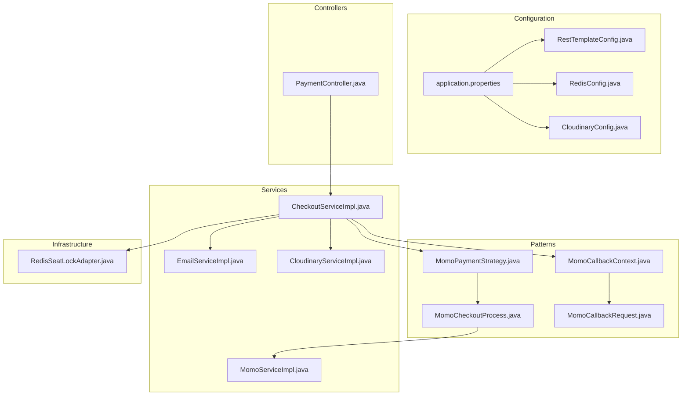
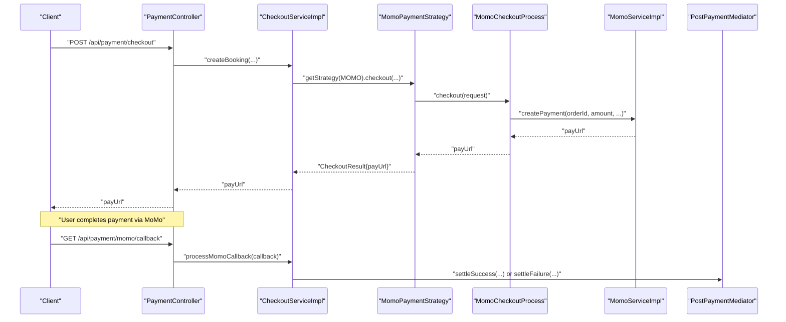
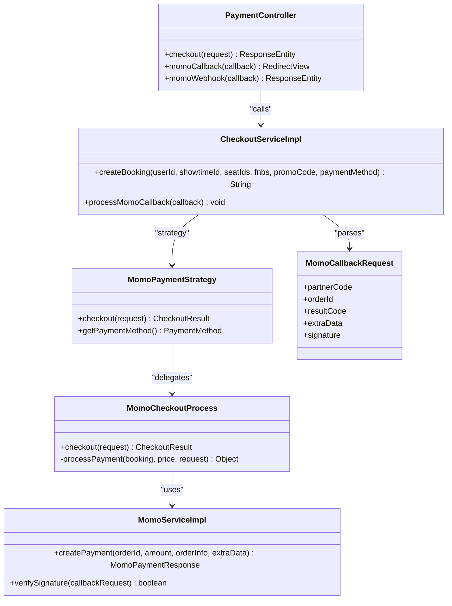
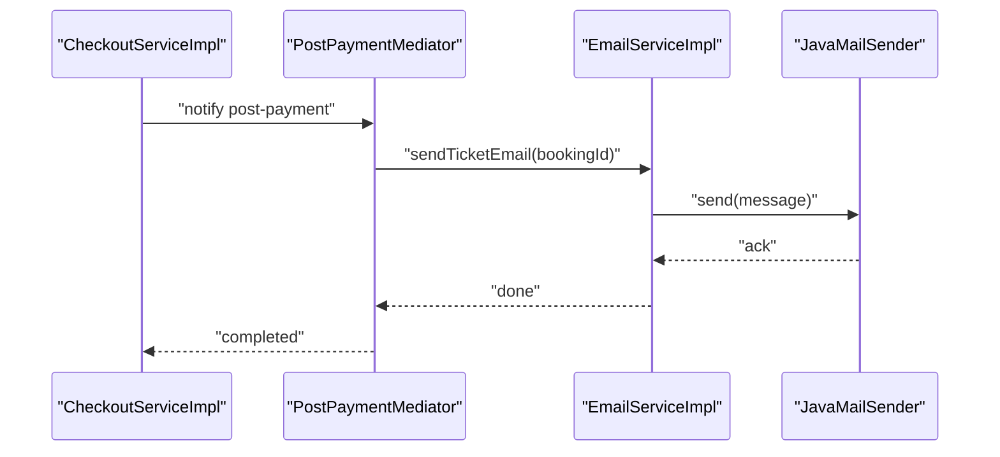
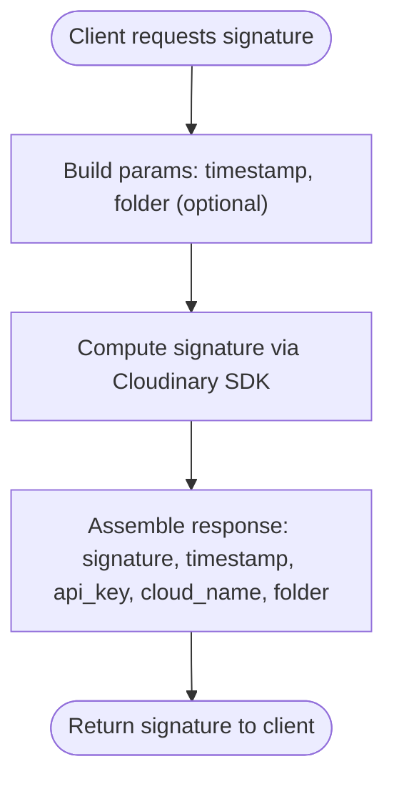
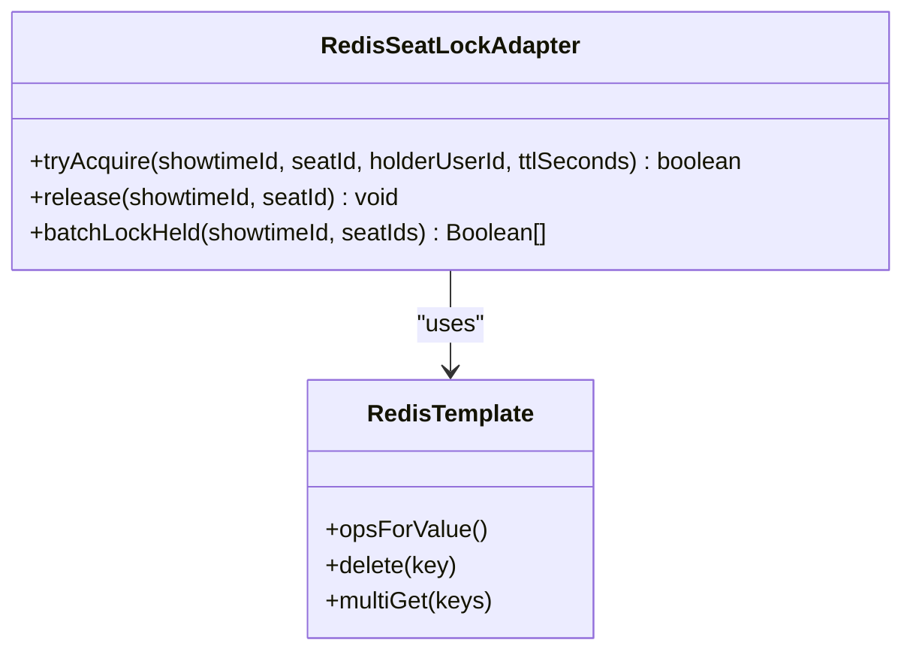
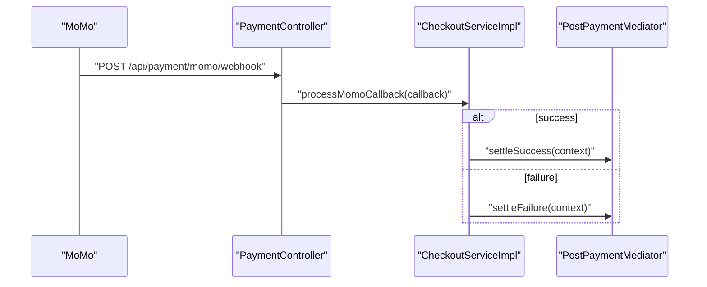
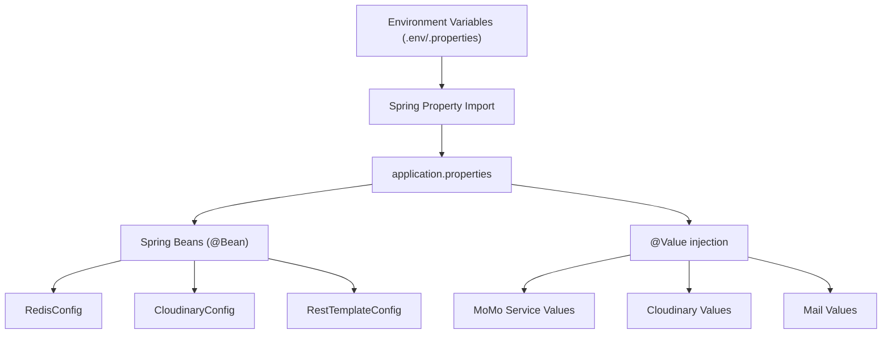
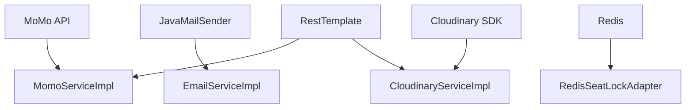

# Integration Patterns

<cite>
**Referenced Files in This Document**
- [application.properties](file://backend/src/main/resources/application.properties)
- [RestTemplateConfig.java](file://backend/src/main/java/com/cinema/booking/config/RestTemplateConfig.java)
- [RedisConfig.java](file://backend/src/main/java/com/cinema/booking/config/RedisConfig.java)
- [CloudinaryConfig.java](file://backend/src/main/java/com/cinema/booking/config/CloudinaryConfig.java)
- [MomoServiceImpl.java](file://backend/src/main/java/com/cinema/booking/services/impl/MomoServiceImpl.java)
- [CloudinaryServiceImpl.java](file://backend/src/main/java/com/cinema/booking/services/impl/CloudinaryServiceImpl.java)
- [EmailServiceImpl.java](file://backend/src/main/java/com/cinema/booking/services/impl/EmailServiceImpl.java)
- [PaymentController.java](file://backend/src/main/java/com/cinema/booking/controllers/PaymentController.java)
- [CheckoutServiceImpl.java](file://backend/src/main/java/com/cinema/booking/services/impl/CheckoutServiceImpl.java)
- [MomoPaymentStrategy.java](file://backend/src/main/java/com/cinema/booking/services/payment/MomoPaymentStrategy.java)
- [MomoCheckoutProcess.java](file://backend/src/main/java/com/cinema/booking/services/template_method/checkout/MomoCheckoutProcess.java)
- [MomoCallbackRequest.java](file://backend/src/main/java/com/cinema/booking/dtos/MomoCallbackRequest.java)
- [MomoCallbackContext.java](file://backend/src/main/java/com/cinema/booking/patterns/mediator/MomoCallbackContext.java)
- [RedisSeatLockAdapter.java](file://backend/src/main/java/com/cinema/booking/services/seatlock/RedisSeatLockAdapter.java)
</cite>

## Table of Contents
1. [Introduction](#introduction)
2. [Project Structure](#project-structure)
3. [Core Components](#core-components)
4. [Architecture Overview](#architecture-overview)
5. [Detailed Component Analysis](#detailed-component-analysis)
6. [Dependency Analysis](#dependency-analysis)
7. [Performance Considerations](#performance-considerations)
8. [Troubleshooting Guide](#troubleshooting-guide)
9. [Conclusion](#conclusion)
10. [Appendices](#appendices)

## Introduction
This document explains the integration patterns used in the StarCine system for external services, focusing on:
- Payment gateway APIs (MoMo)
- Email service provider integration
- Cloudinary for media management
- Redis caching and seat locking via an adapter
- Webhook handling for payment callbacks and real-time notifications
- Configuration management across environments
- Failure handling, retries, and rate-limiting considerations
- Integration testing strategies and mocking approaches

## Project Structure
The integration surface spans configuration, controllers, services, DTOs, and supporting infrastructure:
- Configuration: environment-driven properties and Spring beans for external integrations
- Controllers: entry points for payment flows and webhooks
- Services: orchestration of checkout, payment, email, and media operations
- Adapters: Redis seat lock adapter bridging the abstraction to Redis
- DTOs: request/response contracts for external systems

**Diagram sources**
- [application.properties:1-97](file://backend/src/main/resources/application.properties#L1-L97)
- [RestTemplateConfig.java:1-19](file://backend/src/main/java/com/cinema/booking/config/RestTemplateConfig.java#L1-L19)
- [RedisConfig.java:1-55](file://backend/src/main/java/com/cinema/booking/config/RedisConfig.java#L1-L55)
- [CloudinaryConfig.java:1-33](file://backend/src/main/java/com/cinema/booking/config/CloudinaryConfig.java#L1-L33)
- [PaymentController.java:1-150](file://backend/src/main/java/com/cinema/booking/controllers/PaymentController.java#L1-L150)
- [CheckoutServiceImpl.java:1-185](file://backend/src/main/java/com/cinema/booking/services/impl/CheckoutServiceImpl.java#L1-L185)
- [MomoServiceImpl.java:1-95](file://backend/src/main/java/com/cinema/booking/services/impl/MomoServiceImpl.java#L1-L95)
- [EmailServiceImpl.java:1-98](file://backend/src/main/java/com/cinema/booking/services/impl/EmailServiceImpl.java#L1-L98)
- [CloudinaryServiceImpl.java:1-50](file://backend/src/main/java/com/cinema/booking/services/impl/CloudinaryServiceImpl.java#L1-L50)
- [MomoPaymentStrategy.java:1-27](file://backend/src/main/java/com/cinema/booking/services/payment/MomoPaymentStrategy.java#L1-L27)
- [MomoCheckoutProcess.java:1-70](file://backend/src/main/java/com/cinema/booking/services/template_method/checkout/MomoCheckoutProcess.java#L1-L70)
- [MomoCallbackRequest.java:1-21](file://backend/src/main/java/com/cinema/booking/dtos/MomoCallbackRequest.java#L1-L21)
- [MomoCallbackContext.java:1-19](file://backend/src/main/java/com/cinema/booking/patterns/mediator/MomoCallbackContext.java#L1-L19)
- [RedisSeatLockAdapter.java:1-56](file://backend/src/main/java/com/cinema/booking/services/seatlock/RedisSeatLockAdapter.java#L1-L56)

**Section sources**
- [application.properties:1-97](file://backend/src/main/resources/application.properties#L1-L97)
- [RestTemplateConfig.java:1-19](file://backend/src/main/java/com/cinema/booking/config/RestTemplateConfig.java#L1-L19)
- [RedisConfig.java:1-55](file://backend/src/main/java/com/cinema/booking/config/RedisConfig.java#L1-L55)
- [CloudinaryConfig.java:1-33](file://backend/src/main/java/com/cinema/booking/config/CloudinaryConfig.java#L1-L33)
- [PaymentController.java:1-150](file://backend/src/main/java/com/cinema/booking/controllers/PaymentController.java#L1-L150)
- [CheckoutServiceImpl.java:1-185](file://backend/src/main/java/com/cinema/booking/services/impl/CheckoutServiceImpl.java#L1-L185)
- [MomoServiceImpl.java:1-95](file://backend/src/main/java/com/cinema/booking/services/impl/MomoServiceImpl.java#L1-L95)
- [EmailServiceImpl.java:1-98](file://backend/src/main/java/com/cinema/booking/services/impl/EmailServiceImpl.java#L1-L98)
- [CloudinaryServiceImpl.java:1-50](file://backend/src/main/java/com/cinema/booking/services/impl/CloudinaryServiceImpl.java#L1-L50)
- [MomoPaymentStrategy.java:1-27](file://backend/src/main/java/com/cinema/booking/services/payment/MomoPaymentStrategy.java#L1-L27)
- [MomoCheckoutProcess.java:1-70](file://backend/src/main/java/com/cinema/booking/services/template_method/checkout/MomoCheckoutProcess.java#L1-L70)
- [MomoCallbackRequest.java:1-21](file://backend/src/main/java/com/cinema/booking/dtos/MomoCallbackRequest.java#L1-L21)
- [MomoCallbackContext.java:1-19](file://backend/src/main/java/com/cinema/booking/patterns/mediator/MomoCallbackContext.java#L1-L19)
- [RedisSeatLockAdapter.java:1-56](file://backend/src/main/java/com/cinema/booking/services/seatlock/RedisSeatLockAdapter.java#L1-L56)

## Core Components
- MoMo payment integration: service implementation constructs signed requests, posts to the MoMo endpoint, and logs responses; controller exposes checkout, redirect callback, and IPN webhook endpoints.
- Email service integration: sends transactional emails using JavaMailSender with prototypes for email templates.
- Cloudinary integration: generates upload signatures client-side compatible with Cloudinary SDK.
- Redis integration: configuration for connection and serialization; adapter pattern for seat locking.
- RestTemplate singleton: centralized HTTP client for external API calls.

**Section sources**
- [MomoServiceImpl.java:1-95](file://backend/src/main/java/com/cinema/booking/services/impl/MomoServiceImpl.java#L1-L95)
- [PaymentController.java:1-150](file://backend/src/main/java/com/cinema/booking/controllers/PaymentController.java#L1-L150)
- [EmailServiceImpl.java:1-98](file://backend/src/main/java/com/cinema/booking/services/impl/EmailServiceImpl.java#L1-L98)
- [CloudinaryServiceImpl.java:1-50](file://backend/src/main/java/com/cinema/booking/services/impl/CloudinaryServiceImpl.java#L1-L50)
- [RedisConfig.java:1-55](file://backend/src/main/java/com/cinema/booking/config/RedisConfig.java#L1-L55)
- [RedisSeatLockAdapter.java:1-56](file://backend/src/main/java/com/cinema/booking/services/seatlock/RedisSeatLockAdapter.java#L1-L56)
- [RestTemplateConfig.java:1-19](file://backend/src/main/java/com/cinema/booking/config/RestTemplateConfig.java#L1-L19)

## Architecture Overview
The system integrates external services through a layered approach:
- Controllers expose endpoints for checkout, redirects, and webhooks
- Services coordinate pricing, booking, payment, and post-payment actions
- Strategies and template methods encapsulate payment-specific flows
- Mediator coordinates post-payment actions (ticket issuance, inventory adjustments, email notifications)
- Adapters bridge internal abstractions to Redis and external APIs

**Diagram sources**
- [PaymentController.java:1-150](file://backend/src/main/java/com/cinema/booking/controllers/PaymentController.java#L1-L150)
- [CheckoutServiceImpl.java:1-185](file://backend/src/main/java/com/cinema/booking/services/impl/CheckoutServiceImpl.java#L1-L185)
- [MomoPaymentStrategy.java:1-27](file://backend/src/main/java/com/cinema/booking/services/payment/MomoPaymentStrategy.java#L1-L27)
- [MomoCheckoutProcess.java:1-70](file://backend/src/main/java/com/cinema/booking/services/template_method/checkout/MomoCheckoutProcess.java#L1-L70)
- [MomoServiceImpl.java:1-95](file://backend/src/main/java/com/cinema/booking/services/impl/MomoServiceImpl.java#L1-L95)

## Detailed Component Analysis

### MoMo Payment Integration
- Service constructs signed requests with HMAC-SHA256 using a secret key and posts to the MoMo endpoint via RestTemplate.
- Controller endpoints:
  - Checkout: creates a booking and returns a payment URL
  - Redirect callback: handles browser redirect after payment
  - IPN webhook: server-to-server notification for asynchronous updates
- Signature verification is delegated to the MoMo service (placeholder in current implementation).
- Extra data carries booking metadata to reconstruct booking context during callbacks.

**Diagram sources**
- [MomoServiceImpl.java:1-95](file://backend/src/main/java/com/cinema/booking/services/impl/MomoServiceImpl.java#L1-L95)
- [PaymentController.java:1-150](file://backend/src/main/java/com/cinema/booking/controllers/PaymentController.java#L1-L150)
- [CheckoutServiceImpl.java:1-185](file://backend/src/main/java/com/cinema/booking/services/impl/CheckoutServiceImpl.java#L1-L185)
- [MomoPaymentStrategy.java:1-27](file://backend/src/main/java/com/cinema/booking/services/payment/MomoPaymentStrategy.java#L1-L27)
- [MomoCheckoutProcess.java:1-70](file://backend/src/main/java/com/cinema/booking/services/template_method/checkout/MomoCheckoutProcess.java#L1-L70)
- [MomoCallbackRequest.java:1-21](file://backend/src/main/java/com/cinema/booking/dtos/MomoCallbackRequest.java#L1-L21)

**Section sources**
- [MomoServiceImpl.java:1-95](file://backend/src/main/java/com/cinema/booking/services/impl/MomoServiceImpl.java#L1-L95)
- [PaymentController.java:1-150](file://backend/src/main/java/com/cinema/booking/controllers/PaymentController.java#L1-L150)
- [CheckoutServiceImpl.java:1-185](file://backend/src/main/java/com/cinema/booking/services/impl/CheckoutServiceImpl.java#L1-L185)
- [MomoPaymentStrategy.java:1-27](file://backend/src/main/java/com/cinema/booking/services/payment/MomoPaymentStrategy.java#L1-L27)
- [MomoCheckoutProcess.java:1-70](file://backend/src/main/java/com/cinema/booking/services/template_method/checkout/MomoCheckoutProcess.java#L1-L70)
- [MomoCallbackRequest.java:1-21](file://backend/src/main/java/com/cinema/booking/dtos/MomoCallbackRequest.java#L1-L21)

### Email Service Integration
- Uses JavaMailSender to send transactional emails.
- Retrieves booking and ticket details to populate email content.
- Leverages prototype-based email templates for reuse and customization.

**Diagram sources**
- [CheckoutServiceImpl.java:1-185](file://backend/src/main/java/com/cinema/booking/services/impl/CheckoutServiceImpl.java#L1-L185)
- [EmailServiceImpl.java:1-98](file://backend/src/main/java/com/cinema/booking/services/impl/EmailServiceImpl.java#L1-L98)

**Section sources**
- [EmailServiceImpl.java:1-98](file://backend/src/main/java/com/cinema/booking/services/impl/EmailServiceImpl.java#L1-L98)
- [CheckoutServiceImpl.java:1-185](file://backend/src/main/java/com/cinema/booking/services/impl/CheckoutServiceImpl.java#L1-L185)

### Cloudinary Media Management
- Generates upload signatures client-side compatible with Cloudinary SDK.
- Provides API key, cloud name, and optional folder parameters.

**Diagram sources**
- [CloudinaryServiceImpl.java:1-50](file://backend/src/main/java/com/cinema/booking/services/impl/CloudinaryServiceImpl.java#L1-L50)
- [CloudinaryConfig.java:1-33](file://backend/src/main/java/com/cinema/booking/config/CloudinaryConfig.java#L1-L33)

**Section sources**
- [CloudinaryServiceImpl.java:1-50](file://backend/src/main/java/com/cinema/booking/services/impl/CloudinaryServiceImpl.java#L1-L50)
- [CloudinaryConfig.java:1-33](file://backend/src/main/java/com/cinema/booking/config/CloudinaryConfig.java#L1-L33)

### Redis Caching and Seat Locking (Adapter Pattern)
- Redis configuration defines connection and JSON serialization.
- RedisSeatLockAdapter implements SeatLockProvider using Redis SETNX semantics and TTL-based locks.
- Batch operations support checking multiple seat locks efficiently.

**Diagram sources**
- [RedisSeatLockAdapter.java:1-56](file://backend/src/main/java/com/cinema/booking/services/seatlock/RedisSeatLockAdapter.java#L1-L56)
- [RedisConfig.java:1-55](file://backend/src/main/java/com/cinema/booking/config/RedisConfig.java#L1-L55)

**Section sources**
- [RedisSeatLockAdapter.java:1-56](file://backend/src/main/java/com/cinema/booking/services/seatlock/RedisSeatLockAdapter.java#L1-L56)
- [RedisConfig.java:1-55](file://backend/src/main/java/com/cinema/booking/config/RedisConfig.java#L1-L55)

### Webhook Handling for Payment Callbacks
- MoMo IPN webhook endpoint delegates to checkout service for processing.
- Redirect callback endpoint performs user-friendly redirection based on result code.
- Checkout service parses extra data to recover booking context and invokes mediator for success/failure paths.

**Diagram sources**
- [PaymentController.java:1-150](file://backend/src/main/java/com/cinema/booking/controllers/PaymentController.java#L1-L150)
- [CheckoutServiceImpl.java:1-185](file://backend/src/main/java/com/cinema/booking/services/impl/CheckoutServiceImpl.java#L1-L185)

**Section sources**
- [PaymentController.java:1-150](file://backend/src/main/java/com/cinema/booking/controllers/PaymentController.java#L1-L150)
- [CheckoutServiceImpl.java:1-185](file://backend/src/main/java/com/cinema/booking/services/impl/CheckoutServiceImpl.java#L1-L185)

### Configuration Management
- Environment variables are loaded via Spring’s property import mechanism.
- External service credentials are injected via @Value from application.properties.
- Examples include database, Redis, Cloudinary, MoMo, and mail configurations.

**Diagram sources**
- [application.properties:1-97](file://backend/src/main/resources/application.properties#L1-L97)
- [RedisConfig.java:1-55](file://backend/src/main/java/com/cinema/booking/config/RedisConfig.java#L1-L55)
- [CloudinaryConfig.java:1-33](file://backend/src/main/java/com/cinema/booking/config/CloudinaryConfig.java#L1-L33)
- [RestTemplateConfig.java:1-19](file://backend/src/main/java/com/cinema/booking/config/RestTemplateConfig.java#L1-L19)

**Section sources**
- [application.properties:1-97](file://backend/src/main/resources/application.properties#L1-L97)
- [RedisConfig.java:1-55](file://backend/src/main/java/com/cinema/booking/config/RedisConfig.java#L1-L55)
- [CloudinaryConfig.java:1-33](file://backend/src/main/java/com/cinema/booking/config/CloudinaryConfig.java#L1-L33)
- [RestTemplateConfig.java:1-19](file://backend/src/main/java/com/cinema/booking/config/RestTemplateConfig.java#L1-L19)

### Integration Testing Strategies and Mocking
- Strategy-based design allows injecting test doubles for payment strategies and checkout processes.
- Use @MockBean for external collaborators (e.g., RestTemplate, JavaMailSender, Cloudinary) in tests.
- For MoMo, mock the service to simulate success/failure and signature verification outcomes.
- For Redis, use an embedded in-memory server or test containers to validate seat lock behavior.
- For email, assert send invocations without delivering real messages.

[No sources needed since this section provides general guidance]

## Dependency Analysis
External dependencies and their roles:
- MoMo: payment initiation and notifications
- JavaMailSender: email delivery
- Cloudinary: image/signature generation
- Redis: caching and seat locking
- RestTemplate: HTTP client for external APIs

**Diagram sources**
- [MomoServiceImpl.java:1-95](file://backend/src/main/java/com/cinema/booking/services/impl/MomoServiceImpl.java#L1-L95)
- [EmailServiceImpl.java:1-98](file://backend/src/main/java/com/cinema/booking/services/impl/EmailServiceImpl.java#L1-L98)
- [CloudinaryServiceImpl.java:1-50](file://backend/src/main/java/com/cinema/booking/services/impl/CloudinaryServiceImpl.java#L1-L50)
- [RedisSeatLockAdapter.java:1-56](file://backend/src/main/java/com/cinema/booking/services/seatlock/RedisSeatLockAdapter.java#L1-L56)
- [RestTemplateConfig.java:1-19](file://backend/src/main/java/com/cinema/booking/config/RestTemplateConfig.java#L1-L19)

**Section sources**
- [MomoServiceImpl.java:1-95](file://backend/src/main/java/com/cinema/booking/services/impl/MomoServiceImpl.java#L1-L95)
- [EmailServiceImpl.java:1-98](file://backend/src/main/java/com/cinema/booking/services/impl/EmailServiceImpl.java#L1-L98)
- [CloudinaryServiceImpl.java:1-50](file://backend/src/main/java/com/cinema/booking/services/impl/CloudinaryServiceImpl.java#L1-L50)
- [RedisSeatLockAdapter.java:1-56](file://backend/src/main/java/com/cinema/booking/services/seatlock/RedisSeatLockAdapter.java#L1-L56)
- [RestTemplateConfig.java:1-19](file://backend/src/main/java/com/cinema/booking/config/RestTemplateConfig.java#L1-L19)

## Performance Considerations
- Rate limiting and quotas:
  - MoMo: adhere to endpoint rate limits; implement exponential backoff and circuit breaker patterns around external calls.
  - Cloudinary: respect upload quotas and use pre-signed signatures to offload signing to clients.
  - Email: batch notifications and use async delivery to avoid blocking request threads.
- Caching:
  - Use Redis for short-lived caches (seat availability, pricing rules) with appropriate TTLs.
  - Avoid caching sensitive data; ensure cache invalidation on booking state changes.
- Serialization:
  - Use JSON serialization with proper date/time handling to minimize payload sizes and parsing overhead.
- Concurrency:
  - Seat locking with Redis ensures atomicity; keep TTLs reasonable to prevent stale locks.
- Observability:
  - Add metrics and tracing for external calls; monitor latency and error rates.

[No sources needed since this section provides general guidance]

## Troubleshooting Guide
Common issues and mitigations:
- MoMo signature verification fails:
  - Validate secret key and parameter ordering; log raw hash and signature for inspection.
- Missing payUrl from MoMo response:
  - Log request details and confirm endpoint configuration; handle null gracefully.
- Email delivery errors:
  - Inspect mail server settings and app passwords; wrap send operations with logging.
- Cloudinary signature errors:
  - Verify API secret and ensure consistent timestamp calculation.
- Redis seat lock contention:
  - Tune TTL and monitor lock acquisition latency; consider optimistic concurrency.
- Webhook not received:
  - Confirm IPN URL configuration and network accessibility; add idempotency checks.

**Section sources**
- [MomoServiceImpl.java:1-95](file://backend/src/main/java/com/cinema/booking/services/impl/MomoServiceImpl.java#L1-L95)
- [EmailServiceImpl.java:1-98](file://backend/src/main/java/com/cinema/booking/services/impl/EmailServiceImpl.java#L1-L98)
- [CloudinaryServiceImpl.java:1-50](file://backend/src/main/java/com/cinema/booking/services/impl/CloudinaryServiceImpl.java#L1-L50)
- [RedisSeatLockAdapter.java:1-56](file://backend/src/main/java/com/cinema/booking/services/seatlock/RedisSeatLockAdapter.java#L1-L56)
- [CheckoutServiceImpl.java:1-185](file://backend/src/main/java/com/cinema/booking/services/impl/CheckoutServiceImpl.java#L1-L185)

## Conclusion
StarCine employs a clean separation of concerns for external integrations:
- Strategy and template-method patterns encapsulate payment flows
- Mediator coordinates post-payment actions
- Adapter pattern bridges internal interfaces to Redis and external APIs
- Configuration is environment-driven and testable
- Webhooks enable robust asynchronous payment handling
- Performance and reliability are addressed through caching, serialization, and observability

[No sources needed since this section summarizes without analyzing specific files]

## Appendices
- Retry and circuit breaker recommendations:
  - Introduce retry policies with jitter for transient failures
  - Use circuit breakers for external services to prevent cascading failures
- Idempotency:
  - Generate unique request IDs for MoMo requests and deduplicate callbacks
- Monitoring:
  - Track external service latency, error rates, and quota usage

[No sources needed since this section provides general guidance]