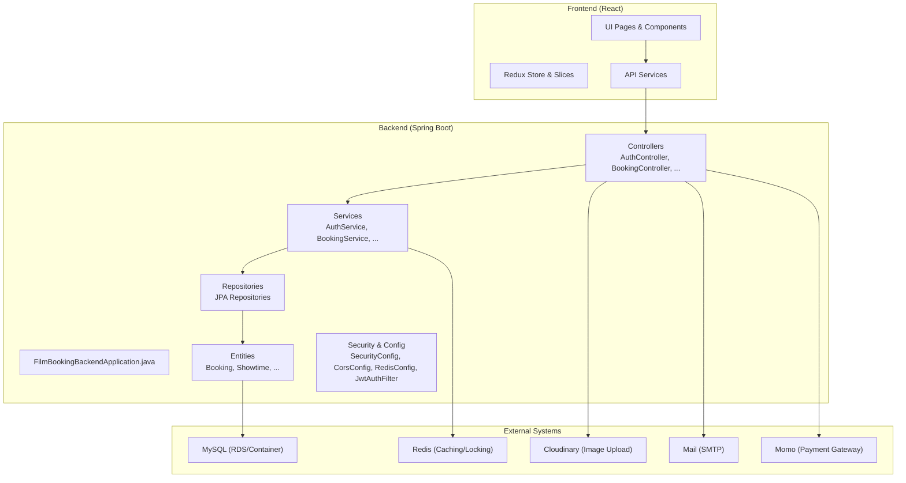
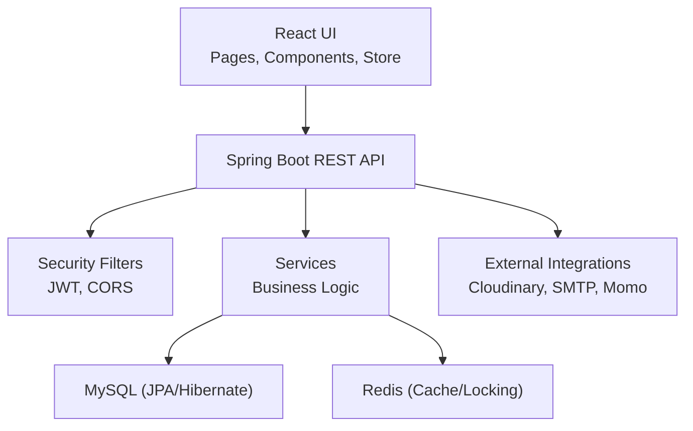
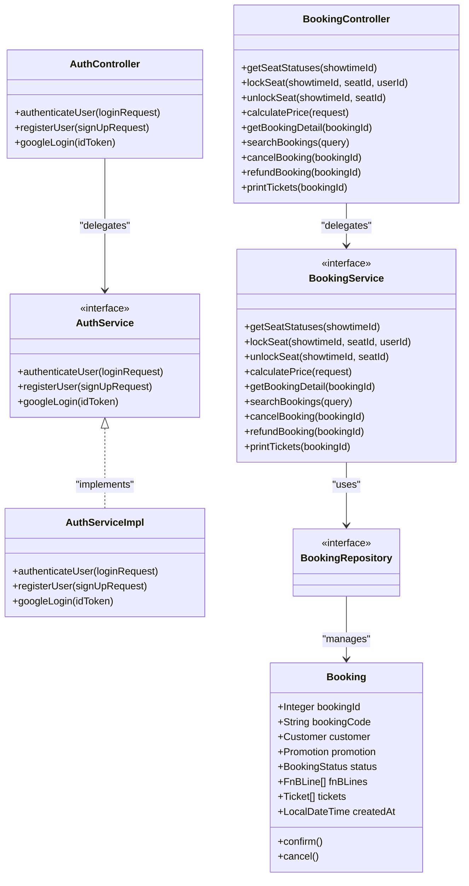
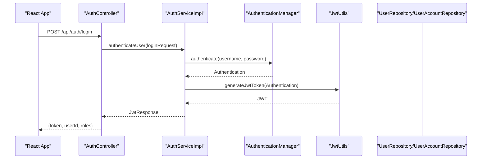
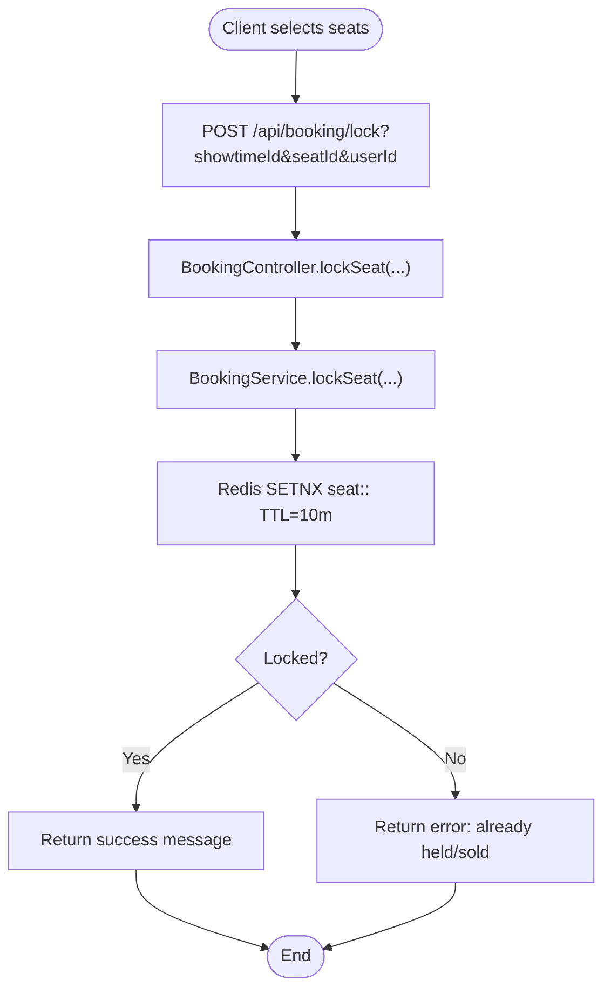
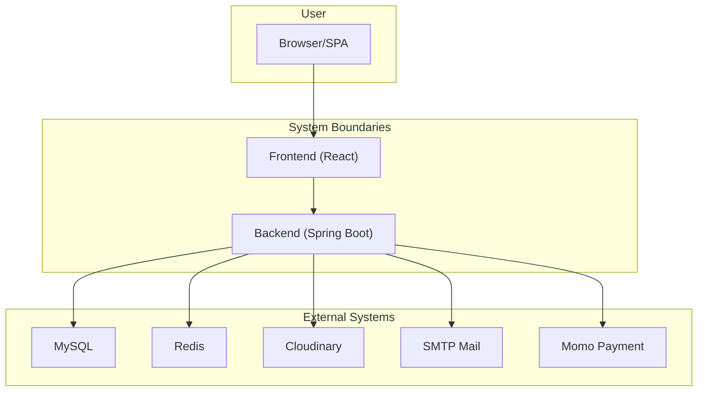
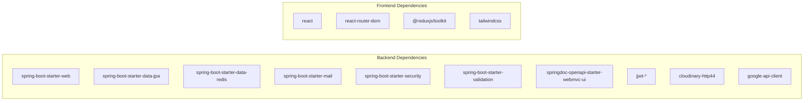

# Overall System Design

<cite>
**Referenced Files in This Document**
- [FilmBookingBackendApplication.java](file://backend/src/main/java/com/cinema/booking/FilmBookingBackendApplication.java)
- [pom.xml](file://backend/pom.xml)
- [application.properties](file://backend/src/main/resources/application.properties)
- [docker-compose.yml](file://docker-compose.yml)
- [SecurityConfig.java](file://backend/src/main/java/com/cinema/booking/config/SecurityConfig.java)
- [CorsConfig.java](file://backend/src/main/java/com/cinema/booking/config/CorsConfig.java)
- [RedisConfig.java](file://backend/src/main/java/com/cinema/booking/config/RedisConfig.java)
- [JwtAuthFilter.java](file://backend/src/main/java/com/cinema/booking/security/JwtAuthFilter.java)
- [AuthController.java](file://backend/src/main/java/com/cinema/booking/controllers/AuthController.java)
- [BookingController.java](file://backend/src/main/java/com/cinema/booking/controllers/BookingController.java)
- [BookingService.java](file://backend/src/main/java/com/cinema/booking/services/BookingService.java)
- [AuthServiceImpl.java](file://backend/src/main/java/com/cinema/booking/services/impl/AuthServiceImpl.java)
- [BookingRepository.java](file://backend/src/main/java/com/cinema/booking/repositories/BookingRepository.java)
- [Booking.java](file://backend/src/main/java/com/cinema/booking/entities/Booking.java)
- [package.json](file://frontend/package.json)
</cite>

## Table of Contents
1. [Introduction](#introduction)
2. [Project Structure](#project-structure)
3. [Core Components](#core-components)
4. [Architecture Overview](#architecture-overview)
5. [Detailed Component Analysis](#detailed-component-analysis)
6. [Dependency Analysis](#dependency-analysis)
7. [Performance Considerations](#performance-considerations)
8. [Troubleshooting Guide](#troubleshooting-guide)
9. [Conclusion](#conclusion)
10. [Appendices](#appendices)

## Introduction
This document describes the overall system design of the StarCine cinema booking system. It explains the high-level architecture using a three-tier layered approach (presentation, business logic, data access), documents system boundaries and component interactions, and details the MVC pattern implementation with Spring Boot controllers, services, and repositories. It also covers technology stack choices (Spring Boot, React, MySQL, Redis), scalability and performance characteristics, deployment topology, and how the system maintains clean architecture principles.

## Project Structure
The system is split into two primary modules:
- Backend: A Spring Boot application providing REST APIs, security, business logic, persistence, and integrations (payment, email, storage).
- Frontend: A React application serving the user interface and integrating with backend APIs.

**Diagram sources**
- [FilmBookingBackendApplication.java:1-14](file://backend/src/main/java/com/cinema/booking/FilmBookingBackendApplication.java#L1-L14)
- [AuthController.java:1-54](file://backend/src/main/java/com/cinema/booking/controllers/AuthController.java#L1-L54)
- [BookingController.java:1-114](file://backend/src/main/java/com/cinema/booking/controllers/BookingController.java#L1-L114)
- [SecurityConfig.java:1-82](file://backend/src/main/java/com/cinema/booking/config/SecurityConfig.java#L1-L82)
- [CorsConfig.java:1-39](file://backend/src/main/java/com/cinema/booking/config/CorsConfig.java#L1-L39)
- [RedisConfig.java:1-55](file://backend/src/main/java/com/cinema/booking/config/RedisConfig.java#L1-L55)
- [JwtAuthFilter.java:1-64](file://backend/src/main/java/com/cinema/booking/security/JwtAuthFilter.java#L1-L64)
- [BookingRepository.java:1-11](file://backend/src/main/java/com/cinema/booking/repositories/BookingRepository.java#L1-L11)
- [Booking.java:1-65](file://backend/src/main/java/com/cinema/booking/entities/Booking.java#L1-L65)
- [application.properties:1-97](file://backend/src/main/resources/application.properties#L1-L97)
- [docker-compose.yml:1-34](file://docker-compose.yml#L1-L34)
- [package.json:1-39](file://frontend/package.json#L1-L39)

**Section sources**
- [FilmBookingBackendApplication.java:1-14](file://backend/src/main/java/com/cinema/booking/FilmBookingBackendApplication.java#L1-L14)
- [pom.xml:1-108](file://backend/pom.xml#L1-L108)
- [application.properties:1-97](file://backend/src/main/resources/application.properties#L1-L97)
- [docker-compose.yml:1-34](file://docker-compose.yml#L1-L34)
- [package.json:1-39](file://frontend/package.json#L1-L39)

## Core Components
- Presentation Layer (Frontend):
  - React SPA with routing, Redux Toolkit for state, and service modules for API communication.
- Business Logic Layer (Backend):
  - REST controllers expose endpoints for authentication, booking, movies, showtimes, rooms, seats, payments, and more.
  - Services encapsulate domain workflows (e.g., booking checkout, seat locking via Redis, pricing engine).
  - Security filters and method-level security enforce authentication and authorization.
- Data Access Layer (Backend):
  - JPA repositories backed by MySQL.
  - Redis used for caching and optimistic concurrency control (seat locking).

Key responsibilities:
- Controllers: Thin HTTP handlers delegating to services.
- Services: Orchestrate business rules, validations, and cross-cutting concerns.
- Repositories: Persist and query domain entities.
- Security: JWT-based stateless authentication, CORS configuration, and method-level role checks.

**Section sources**
- [AuthController.java:1-54](file://backend/src/main/java/com/cinema/booking/controllers/AuthController.java#L1-L54)
- [BookingController.java:1-114](file://backend/src/main/java/com/cinema/booking/controllers/BookingController.java#L1-L114)
- [BookingService.java:1-22](file://backend/src/main/java/com/cinema/booking/services/BookingService.java#L1-L22)
- [BookingRepository.java:1-11](file://backend/src/main/java/com/cinema/booking/repositories/BookingRepository.java#L1-L11)
- [SecurityConfig.java:1-82](file://backend/src/main/java/com/cinema/booking/config/SecurityConfig.java#L1-L82)
- [JwtAuthFilter.java:1-64](file://backend/src/main/java/com/cinema/booking/security/JwtAuthFilter.java#L1-L64)

## Architecture Overview
The system follows a layered, clean architecture:
- Presentation: React SPA communicates with Spring Boot REST APIs.
- Application: Spring Boot controllers, services, and configuration.
- Domain/Data: JPA entities mapped to MySQL; Redis for caching and seat locks.

**Diagram sources**
- [AuthController.java:1-54](file://backend/src/main/java/com/cinema/booking/controllers/AuthController.java#L1-L54)
- [BookingController.java:1-114](file://backend/src/main/java/com/cinema/booking/controllers/BookingController.java#L1-L114)
- [SecurityConfig.java:1-82](file://backend/src/main/java/com/cinema/booking/config/SecurityConfig.java#L1-L82)
- [CorsConfig.java:1-39](file://backend/src/main/java/com/cinema/booking/config/CorsConfig.java#L1-L39)
- [RedisConfig.java:1-55](file://backend/src/main/java/com/cinema/booking/config/RedisConfig.java#L1-L55)
- [application.properties:1-97](file://backend/src/main/resources/application.properties#L1-L97)
- [docker-compose.yml:1-34](file://docker-compose.yml#L1-L34)

## Detailed Component Analysis

### MVC Pattern Implementation (Spring Boot)
- Model: Entities (e.g., Booking) and DTOs (e.g., BookingDTO, SeatStatusDTO).
- View: Not applicable server-side; rendered by React frontend.
- Controller: REST controllers handle HTTP requests and responses.
- Service: Encapsulates business logic and coordinates repositories.
- Repository: JPA repositories for persistence.

**Diagram sources**
- [AuthController.java:1-54](file://backend/src/main/java/com/cinema/booking/controllers/AuthController.java#L1-L54)
- [BookingController.java:1-114](file://backend/src/main/java/com/cinema/booking/controllers/BookingController.java#L1-L114)
- [BookingService.java:1-22](file://backend/src/main/java/com/cinema/booking/services/BookingService.java#L1-L22)
- [AuthServiceImpl.java:1-139](file://backend/src/main/java/com/cinema/booking/services/impl/AuthServiceImpl.java#L1-L139)
- [BookingRepository.java:1-11](file://backend/src/main/java/com/cinema/booking/repositories/BookingRepository.java#L1-L11)
- [Booking.java:1-65](file://backend/src/main/java/com/cinema/booking/entities/Booking.java#L1-L65)

**Section sources**
- [AuthController.java:1-54](file://backend/src/main/java/com/cinema/booking/controllers/AuthController.java#L1-L54)
- [BookingController.java:1-114](file://backend/src/main/java/com/cinema/booking/controllers/BookingController.java#L1-L114)
- [BookingService.java:1-22](file://backend/src/main/java/com/cinema/booking/services/BookingService.java#L1-L22)
- [AuthServiceImpl.java:1-139](file://backend/src/main/java/com/cinema/booking/services/impl/AuthServiceImpl.java#L1-L139)
- [BookingRepository.java:1-11](file://backend/src/main/java/com/cinema/booking/repositories/BookingRepository.java#L1-L11)
- [Booking.java:1-65](file://backend/src/main/java/com/cinema/booking/entities/Booking.java#L1-L65)

### Authentication Flow (JWT)

**Diagram sources**
- [AuthController.java:1-54](file://backend/src/main/java/com/cinema/booking/controllers/AuthController.java#L1-L54)
- [AuthServiceImpl.java:1-139](file://backend/src/main/java/com/cinema/booking/services/impl/AuthServiceImpl.java#L1-L139)
- [SecurityConfig.java:1-82](file://backend/src/main/java/com/cinema/booking/config/SecurityConfig.java#L1-L82)
- [JwtAuthFilter.java:1-64](file://backend/src/main/java/com/cinema/booking/security/JwtAuthFilter.java#L1-L64)

**Section sources**
- [AuthController.java:1-54](file://backend/src/main/java/com/cinema/booking/controllers/AuthController.java#L1-L54)
- [AuthServiceImpl.java:1-139](file://backend/src/main/java/com/cinema/booking/services/impl/AuthServiceImpl.java#L1-L139)
- [SecurityConfig.java:1-82](file://backend/src/main/java/com/cinema/booking/config/SecurityConfig.java#L1-L82)
- [JwtAuthFilter.java:1-64](file://backend/src/main/java/com/cinema/booking/security/JwtAuthFilter.java#L1-L64)

### Booking Seat Locking with Redis

**Diagram sources**
- [BookingController.java:1-114](file://backend/src/main/java/com/cinema/booking/controllers/BookingController.java#L1-L114)
- [BookingService.java:1-22](file://backend/src/main/java/com/cinema/booking/services/BookingService.java#L1-L22)

**Section sources**
- [BookingController.java:1-114](file://backend/src/main/java/com/cinema/booking/controllers/BookingController.java#L1-L114)
- [BookingService.java:1-22](file://backend/src/main/java/com/cinema/booking/services/BookingService.java#L1-L22)

### System Context and External Integrations

**Diagram sources**
- [application.properties:1-97](file://backend/src/main/resources/application.properties#L1-L97)
- [docker-compose.yml:1-34](file://docker-compose.yml#L1-L34)
- [pom.xml:1-108](file://backend/pom.xml#L1-L108)
- [package.json:1-39](file://frontend/package.json#L1-L39)

**Section sources**
- [application.properties:1-97](file://backend/src/main/resources/application.properties#L1-L97)
- [docker-compose.yml:1-34](file://docker-compose.yml#L1-L34)
- [pom.xml:1-108](file://backend/pom.xml#L1-L108)
- [package.json:1-39](file://frontend/package.json#L1-L39)

## Dependency Analysis
- Backend dependencies include Spring Boot starters for web, JPA, Redis, mail, security, validation, OpenAPI/Swagger, and third-party libraries for JWT, Cloudinary, and Google APIs.
- Frontend depends on React, React Router, Redux Toolkit, TailwindCSS, and development tools.

**Diagram sources**
- [pom.xml:1-108](file://backend/pom.xml#L1-L108)
- [package.json:1-39](file://frontend/package.json#L1-L39)

**Section sources**
- [pom.xml:1-108](file://backend/pom.xml#L1-L108)
- [package.json:1-39](file://frontend/package.json#L1-L39)

## Performance Considerations
- Concurrency Control:
  - Redis SETNX-based seat locking prevents race conditions during booking.
  - Redis TTL ensures automatic cleanup of stale locks.
- Caching:
  - Redis cache reduces repeated reads for frequently accessed data.
  - JSON serialization with Jackson improves cache efficiency.
- Persistence:
  - MySQL with Hibernate/JPA provides ACID transactions and indexing via schema.
- Network:
  - CORS configured per environment variable to support flexible frontend origins.
- Observability:
  - OpenAPI/Swagger enabled for API documentation and testing.
- Scalability:
  - Stateless JWT enables horizontal scaling.
  - Separate Redis and MySQL containers support independent scaling.

[No sources needed since this section provides general guidance]

## Troubleshooting Guide
Common areas to check:
- Authentication:
  - Ensure Authorization header is present and prefixed correctly.
  - Verify JWT secret and expiration settings align with client expectations.
- CORS:
  - Confirm frontend URL matches allowed origin patterns.
- Redis:
  - Validate host/port/credentials and TTL settings.
- MySQL:
  - Confirm datasource credentials and dialect configuration.
- External Integrations:
  - Validate Cloudinary and Momo credentials.
  - Ensure SMTP settings are correct for email delivery.

**Section sources**
- [SecurityConfig.java:1-82](file://backend/src/main/java/com/cinema/booking/config/SecurityConfig.java#L1-L82)
- [CorsConfig.java:1-39](file://backend/src/main/java/com/cinema/booking/config/CorsConfig.java#L1-L39)
- [RedisConfig.java:1-55](file://backend/src/main/java/com/cinema/booking/config/RedisConfig.java#L1-L55)
- [application.properties:1-97](file://backend/src/main/resources/application.properties#L1-L97)

## Conclusion
The StarCine system employs a clean, layered architecture with clear separation of concerns. The presentation layer (React) integrates with a Spring Boot backend that enforces security, orchestrates business logic, and persists data. Redis and MySQL provide efficient caching and reliable persistence, while external integrations (Cloudinary, SMTP, Momo) enable rich functionality. The design supports scalability, maintainability, and future enhancements.

[No sources needed since this section summarizes without analyzing specific files]

## Appendices

### Technology Stack Summary
- Backend: Spring Boot 4.0.4, Java 17, JPA/Hibernate, MySQL, Redis, JWT, OpenAPI/Swagger, Cloudinary, Google APIs.
- Frontend: React 19, Redux Toolkit, React Router, TailwindCSS, Vite.
- DevOps: Docker Compose for local MySQL and Redis.

**Section sources**
- [pom.xml:1-108](file://backend/pom.xml#L1-L108)
- [package.json:1-39](file://frontend/package.json#L1-L39)
- [docker-compose.yml:1-34](file://docker-compose.yml#L1-L34)