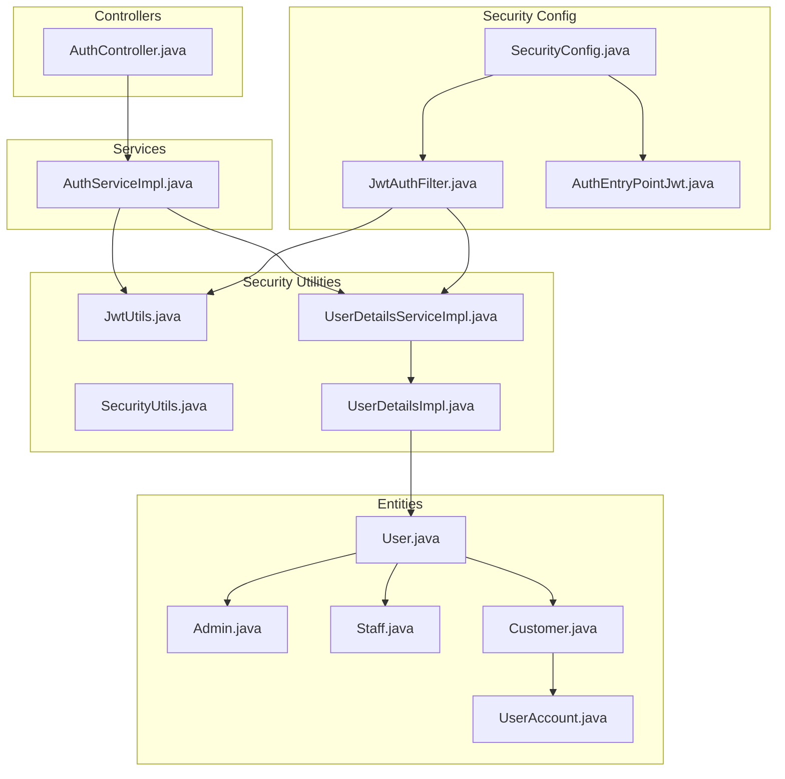
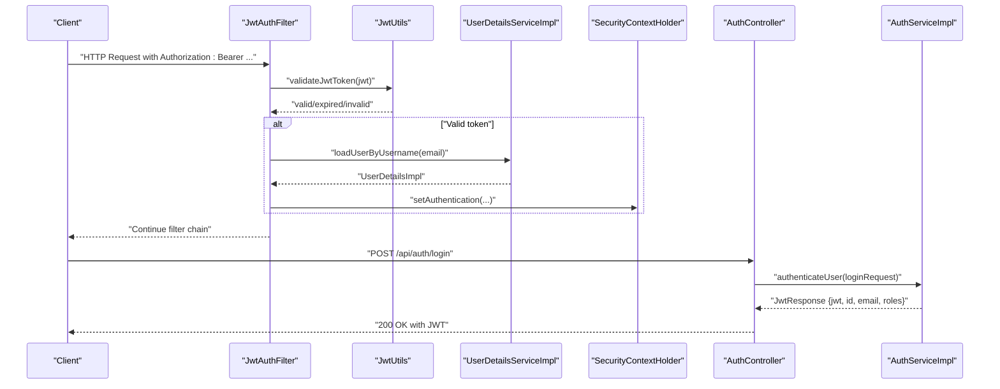
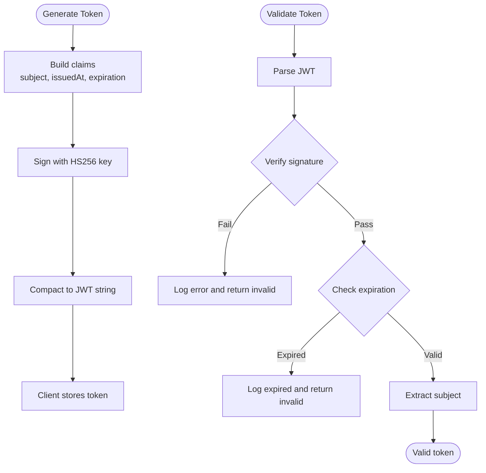
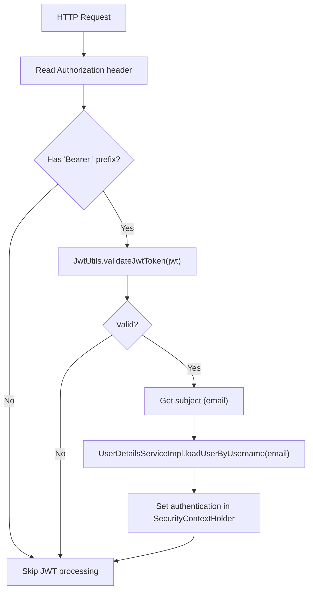
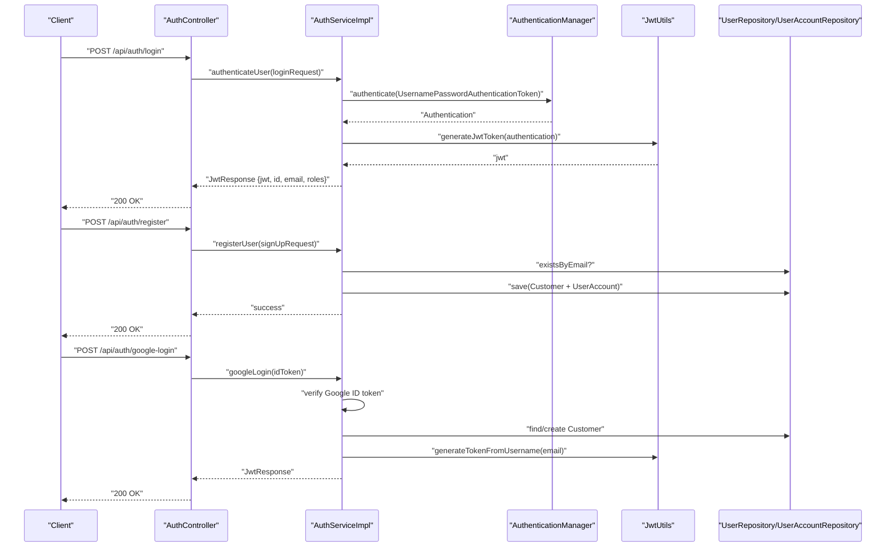
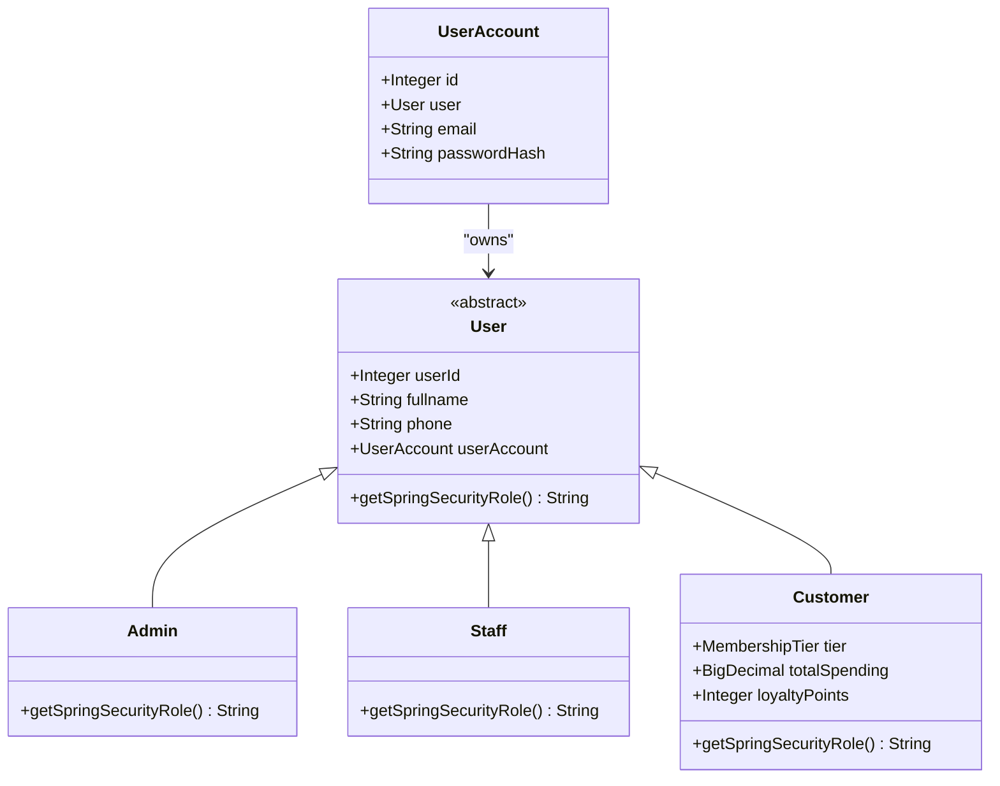
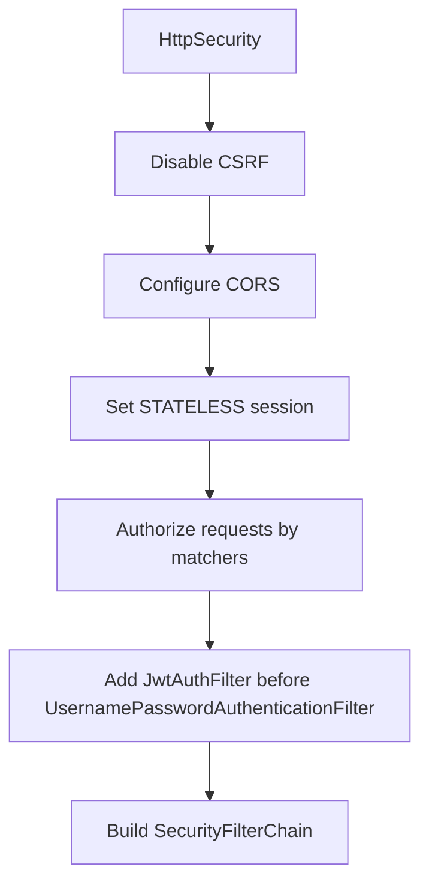
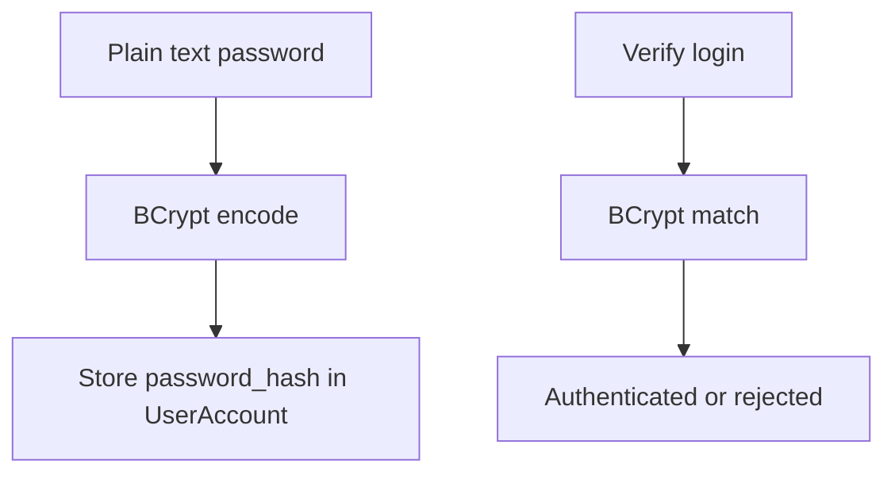
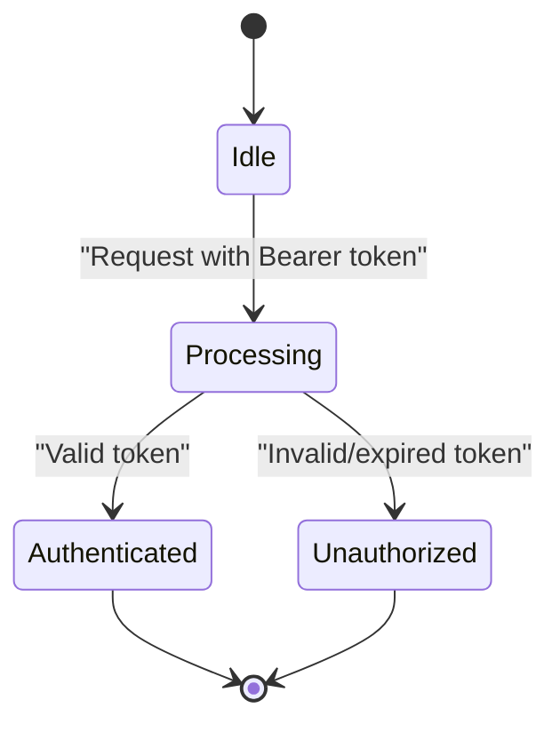
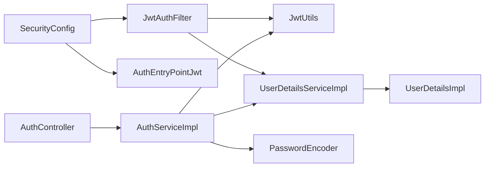

# Security Architecture

<cite>
**Referenced Files in This Document**
- [SecurityConfig.java](file://backend/src/main/java/com/cinema/booking/config/SecurityConfig.java)
- [JwtAuthFilter.java](file://backend/src/main/java/com/cinema/booking/security/JwtAuthFilter.java)
- [JwtUtils.java](file://backend/src/main/java/com/cinema/booking/security/JwtUtils.java)
- [UserDetailsServiceImpl.java](file://backend/src/main/java/com/cinema/booking/security/UserDetailsServiceImpl.java)
- [AuthEntryPointJwt.java](file://backend/src/main/java/com/cinema/booking/security/AuthEntryPointJwt.java)
- [SecurityUtils.java](file://backend/src/main/java/com/cinema/booking/security/SecurityUtils.java)
- [AuthController.java](file://backend/src/main/java/com/cinema/booking/controllers/AuthController.java)
- [AuthServiceImpl.java](file://backend/src/main/java/com/cinema/booking/services/impl/AuthServiceImpl.java)
- [UserDetailsImpl.java](file://backend/src/main/java/com/cinema/booking/security/UserDetailsImpl.java)
- [User.java](file://backend/src/main/java/com/cinema/booking/entities/User.java)
- [Admin.java](file://backend/src/main/java/com/cinema/booking/entities/Admin.java)
- [Staff.java](file://backend/src/main/java/com/cinema/booking/entities/Staff.java)
- [Customer.java](file://backend/src/main/java/com/cinema/booking/entities/Customer.java)
- [UserAccount.java](file://backend/src/main/java/com/cinema/booking/entities/UserAccount.java)
- [application.properties](file://backend/src/main/resources/application.properties)
</cite>

## Table of Contents
1. [Introduction](#introduction)
2. [Project Structure](#project-structure)
3. [Core Components](#core-components)
4. [Architecture Overview](#architecture-overview)
5. [Detailed Component Analysis](#detailed-component-analysis)
6. [Dependency Analysis](#dependency-analysis)
7. [Performance Considerations](#performance-considerations)
8. [Troubleshooting Guide](#troubleshooting-guide)
9. [Conclusion](#conclusion)
10. [Appendices](#appendices)

## Introduction
This document describes the security architecture of the StarCine system with a focus on JWT-based authentication and authorization, role-based access control (RBAC), Spring Security configuration, password hashing, and protections against common vulnerabilities. It also documents session management, token lifecycle, and secure communication practices implemented in the backend.

## Project Structure
Security-related components are organized under the config, security, controllers, services, and entities packages. The configuration wires Spring Security, CORS, CSRF, and method-level authorization. The security package implements JWT parsing, validation, and user loading. Controllers expose authentication endpoints, while services handle authentication flows and token issuance. Entities model RBAC roles via inheritance.

**Diagram sources**
- [SecurityConfig.java:50-79](file://backend/src/main/java/com/cinema/booking/config/SecurityConfig.java#L50-L79)
- [JwtAuthFilter.java:27-51](file://backend/src/main/java/com/cinema/booking/security/JwtAuthFilter.java#L27-L51)
- [JwtUtils.java:30-39](file://backend/src/main/java/com/cinema/booking/security/JwtUtils.java#L30-L39)
- [UserDetailsServiceImpl.java:18-25](file://backend/src/main/java/com/cinema/booking/security/UserDetailsServiceImpl.java#L18-L25)
- [AuthController.java:21-31](file://backend/src/main/java/com/cinema/booking/controllers/AuthController.java#L21-L31)
- [AuthServiceImpl.java:44-61](file://backend/src/main/java/com/cinema/booking/services/impl/AuthServiceImpl.java#L44-L61)
- [User.java:36](file://backend/src/main/java/com/cinema/booking/entities/User.java#L36)
- [Admin.java:14-17](file://backend/src/main/java/com/cinema/booking/entities/Admin.java#L14-L17)
- [Staff.java:14-17](file://backend/src/main/java/com/cinema/booking/entities/Staff.java#L14-L17)
- [Customer.java:26-29](file://backend/src/main/java/com/cinema/booking/entities/Customer.java#L26-L29)
- [UserAccount.java:19-28](file://backend/src/main/java/com/cinema/booking/entities/UserAccount.java#L19-L28)

**Section sources**
- [SecurityConfig.java:24-80](file://backend/src/main/java/com/cinema/booking/config/SecurityConfig.java#L24-L80)
- [JwtAuthFilter.java:18-63](file://backend/src/main/java/com/cinema/booking/security/JwtAuthFilter.java#L18-L63)
- [JwtUtils.java:15-70](file://backend/src/main/java/com/cinema/booking/security/JwtUtils.java#L15-L70)
- [UserDetailsServiceImpl.java:12-26](file://backend/src/main/java/com/cinema/booking/security/UserDetailsServiceImpl.java#L12-L26)
- [AuthEntryPointJwt.java:17-38](file://backend/src/main/java/com/cinema/booking/security/AuthEntryPointJwt.java#L17-L38)
- [AuthController.java:13-53](file://backend/src/main/java/com/cinema/booking/controllers/AuthController.java#L13-L53)
- [AuthServiceImpl.java:26-138](file://backend/src/main/java/com/cinema/booking/services/impl/AuthServiceImpl.java#L26-L138)
- [User.java:32-36](file://backend/src/main/java/com/cinema/booking/entities/User.java#L32-L36)
- [Admin.java:14-17](file://backend/src/main/java/com/cinema/booking/entities/Admin.java#L14-L17)
- [Staff.java:14-17](file://backend/src/main/java/com/cinema/booking/entities/Staff.java#L14-L17)
- [Customer.java:26-29](file://backend/src/main/java/com/cinema/booking/entities/Customer.java#L26-L29)
- [UserAccount.java:19-28](file://backend/src/main/java/com/cinema/booking/entities/UserAccount.java#L19-L28)

## Core Components
- JWT utilities: token generation, validation, and subject extraction.
- JWT filter: parses Authorization header, validates token, loads user details, and sets authentication in the security context.
- Authentication entry point: centralized unauthorized handler returning JSON errors.
- User details service: loads user principal from persistent storage.
- Security configuration: disables CSRF, configures CORS, sets session management to stateless, and enforces method-level and request-level authorization.
- Authentication controller and service: handle login, registration, and Google login flows, issuing JWT tokens.
- Role model: User hierarchy with Admin, Staff, and Customer roles mapped to Spring authorities.

**Section sources**
- [JwtUtils.java:30-53](file://backend/src/main/java/com/cinema/booking/security/JwtUtils.java#L30-L53)
- [JwtAuthFilter.java:27-51](file://backend/src/main/java/com/cinema/booking/security/JwtAuthFilter.java#L27-L51)
- [AuthEntryPointJwt.java:22-37](file://backend/src/main/java/com/cinema/booking/security/AuthEntryPointJwt.java#L22-L37)
- [UserDetailsServiceImpl.java:18-25](file://backend/src/main/java/com/cinema/booking/security/UserDetailsServiceImpl.java#L18-L25)
- [SecurityConfig.java:50-79](file://backend/src/main/java/com/cinema/booking/config/SecurityConfig.java#L50-L79)
- [AuthController.java:21-31](file://backend/src/main/java/com/cinema/booking/controllers/AuthController.java#L21-L31)
- [AuthServiceImpl.java:44-61](file://backend/src/main/java/com/cinema/booking/services/impl/AuthServiceImpl.java#L44-L61)
- [User.java:36](file://backend/src/main/java/com/cinema/booking/entities/User.java#L36)
- [Admin.java:14-17](file://backend/src/main/java/com/cinema/booking/entities/Admin.java#L14-L17)
- [Staff.java:14-17](file://backend/src/main/java/com/cinema/booking/entities/Staff.java#L14-L17)
- [Customer.java:26-29](file://backend/src/main/java/com/cinema/booking/entities/Customer.java#L26-L29)

## Architecture Overview
The system uses stateless JWT authentication with Spring Security’s filter chain. Requests pass through a custom JWT filter that extracts and validates tokens, loads user details, and establishes an authenticated context. Authorization is enforced via method-level annotations and request matchers. CSRF is disabled because JWT is bearer-only and sessionless. CORS is configured centrally.

**Diagram sources**
- [JwtAuthFilter.java:27-51](file://backend/src/main/java/com/cinema/booking/security/JwtAuthFilter.java#L27-L51)
- [JwtUtils.java:55-69](file://backend/src/main/java/com/cinema/booking/security/JwtUtils.java#L55-L69)
- [UserDetailsServiceImpl.java:18-25](file://backend/src/main/java/com/cinema/booking/security/UserDetailsServiceImpl.java#L18-L25)
- [AuthController.java:21-31](file://backend/src/main/java/com/cinema/booking/controllers/AuthController.java#L21-L31)
- [AuthServiceImpl.java:44-61](file://backend/src/main/java/com/cinema/booking/services/impl/AuthServiceImpl.java#L44-L61)

## Detailed Component Analysis

### JWT Utilities and Token Lifecycle
- Token generation uses HS256 with a secret key derived from application configuration. Expiration is set from configuration.
- Token validation parses and verifies signature; exceptions are caught and logged for malformed, expired, unsupported, and empty claims.
- Subject extraction retrieves the username/email from the token’s claims.

**Diagram sources**
- [JwtUtils.java:30-39](file://backend/src/main/java/com/cinema/booking/security/JwtUtils.java#L30-L39)
- [JwtUtils.java:55-69](file://backend/src/main/java/com/cinema/booking/security/JwtUtils.java#L55-L69)
- [JwtUtils.java:50-53](file://backend/src/main/java/com/cinema/booking/security/JwtUtils.java#L50-L53)

**Section sources**
- [JwtUtils.java:19-28](file://backend/src/main/java/com/cinema/booking/security/JwtUtils.java#L19-L28)
- [JwtUtils.java:30-48](file://backend/src/main/java/com/cinema/booking/security/JwtUtils.java#L30-L48)
- [JwtUtils.java:50-69](file://backend/src/main/java/com/cinema/booking/security/JwtUtils.java#L50-L69)

### JWT Authentication Filter
- Extracts the Authorization header, checks for Bearer scheme, and passes the token to validation.
- On success, loads user details by email and sets an authentication token in the security context.
- Proceeds unconditionally to the next filter, allowing downstream controllers to enforce authorization.

**Diagram sources**
- [JwtAuthFilter.java:27-51](file://backend/src/main/java/com/cinema/booking/security/JwtAuthFilter.java#L27-L51)
- [JwtUtils.java:55-69](file://backend/src/main/java/com/cinema/booking/security/JwtUtils.java#L55-L69)
- [UserDetailsServiceImpl.java:18-25](file://backend/src/main/java/com/cinema/booking/security/UserDetailsServiceImpl.java#L18-L25)

**Section sources**
- [JwtAuthFilter.java:31-51](file://backend/src/main/java/com/cinema/booking/security/JwtAuthFilter.java#L31-L51)

### Authentication Controller and Service
- Login endpoint authenticates credentials via AuthenticationManager, generates a JWT, and returns roles.
- Registration hashes passwords using the configured encoder and persists a Customer with a UserAccount.
- Google login verifies the ID token, creates or retrieves a Customer account, and issues a JWT.

**Diagram sources**
- [AuthController.java:21-31](file://backend/src/main/java/com/cinema/booking/controllers/AuthController.java#L21-L31)
- [AuthServiceImpl.java:44-61](file://backend/src/main/java/com/cinema/booking/services/impl/AuthServiceImpl.java#L44-L61)
- [AuthServiceImpl.java:67-92](file://backend/src/main/java/com/cinema/booking/services/impl/AuthServiceImpl.java#L67-L92)
- [AuthServiceImpl.java:97-137](file://backend/src/main/java/com/cinema/booking/services/impl/AuthServiceImpl.java#L97-L137)
- [JwtUtils.java:30-39](file://backend/src/main/java/com/cinema/booking/security/JwtUtils.java#L30-L39)
- [JwtUtils.java:41-48](file://backend/src/main/java/com/cinema/booking/security/JwtUtils.java#L41-L48)

**Section sources**
- [AuthController.java:21-31](file://backend/src/main/java/com/cinema/booking/controllers/AuthController.java#L21-L31)
- [AuthServiceImpl.java:44-61](file://backend/src/main/java/com/cinema/booking/services/impl/AuthServiceImpl.java#L44-L61)
- [AuthServiceImpl.java:67-92](file://backend/src/main/java/com/cinema/booking/services/impl/AuthServiceImpl.java#L67-L92)
- [AuthServiceImpl.java:97-137](file://backend/src/main/java/com/cinema/booking/services/impl/AuthServiceImpl.java#L97-L137)

### Role-Based Access Control (RBAC)
- Roles are modeled via User inheritance: Admin, Staff, and Customer. Each overrides getSpringSecurityRole to return the Spring authority name.
- SecurityConfig enforces role-based access for admin endpoints and specific HTTP methods.
- UserDetailsImpl supplies authorities for the authenticated principal.

**Diagram sources**
- [User.java:13-36](file://backend/src/main/java/com/cinema/booking/entities/User.java#L13-L36)
- [Admin.java:12-17](file://backend/src/main/java/com/cinema/booking/entities/Admin.java#L12-L17)
- [Staff.java:12-17](file://backend/src/main/java/com/cinema/booking/entities/Staff.java#L12-L17)
- [Customer.java:14-29](file://backend/src/main/java/com/cinema/booking/entities/Customer.java#L14-L29)
- [UserAccount.java:13-28](file://backend/src/main/java/com/cinema/booking/entities/UserAccount.java#L13-L28)

**Section sources**
- [SecurityConfig.java:66-73](file://backend/src/main/java/com/cinema/booking/config/SecurityConfig.java#L66-L73)
- [User.java:36](file://backend/src/main/java/com/cinema/booking/entities/User.java#L36)
- [Admin.java:14-17](file://backend/src/main/java/com/cinema/booking/entities/Admin.java#L14-L17)
- [Staff.java:14-17](file://backend/src/main/java/com/cinema/booking/entities/Staff.java#L14-L17)
- [Customer.java:26-29](file://backend/src/main/java/com/cinema/booking/entities/Customer.java#L26-L29)

### Spring Security Configuration
- CSRF is disabled for stateless JWT.
- CORS is enabled via a shared configuration source.
- Session management is set to STATELESS.
- Request-level authorization permits public endpoints and restricts admin endpoints to ADMIN or STAFF.
- Method-level security is enabled with prePostEnabled to support annotations.

**Diagram sources**
- [SecurityConfig.java:50-79](file://backend/src/main/java/com/cinema/booking/config/SecurityConfig.java#L50-L79)

**Section sources**
- [SecurityConfig.java:50-79](file://backend/src/main/java/com/cinema/booking/config/SecurityConfig.java#L50-L79)

### Password Hashing and Encryption Strategies
- Passwords are hashed using BCrypt via a PasswordEncoder bean.
- Additional HMAC-SHA256 utilities are available for signing data outside JWT.
- UserAccount stores password_hash for persisted credentials.

**Diagram sources**
- [SecurityConfig.java:40-43](file://backend/src/main/java/com/cinema/booking/config/SecurityConfig.java#L40-L43)
- [AuthServiceImpl.java:79](file://backend/src/main/java/com/cinema/booking/services/impl/AuthServiceImpl.java#L79)
- [UserAccount.java:27-28](file://backend/src/main/java/com/cinema/booking/entities/UserAccount.java#L27-L28)
- [SecurityUtils.java:9-16](file://backend/src/main/java/com/cinema/booking/security/SecurityUtils.java#L9-L16)

**Section sources**
- [SecurityConfig.java:40-43](file://backend/src/main/java/com/cinema/booking/config/SecurityConfig.java#L40-L43)
- [AuthServiceImpl.java:79](file://backend/src/main/java/com/cinema/booking/services/impl/AuthServiceImpl.java#L79)
- [UserAccount.java:27-28](file://backend/src/main/java/com/cinema/booking/entities/UserAccount.java#L27-L28)
- [SecurityUtils.java:9-16](file://backend/src/main/java/com/cinema/booking/security/SecurityUtils.java#L9-L16)

### Session Management and Token Expiration
- Session management is stateless; no server-side session storage.
- Token expiration is configured via application properties and embedded in generated tokens.
- On successful JWT validation, the filter sets authentication in the current request context.

**Diagram sources**
- [SecurityConfig.java:56](file://backend/src/main/java/com/cinema/booking/config/SecurityConfig.java#L56)
- [JwtAuthFilter.java:34](file://backend/src/main/java/com/cinema/booking/security/JwtAuthFilter.java#L34)
- [JwtUtils.java:36](file://backend/src/main/java/com/cinema/booking/security/JwtUtils.java#L36)

**Section sources**
- [SecurityConfig.java:56](file://backend/src/main/java/com/cinema/booking/config/SecurityConfig.java#L56)
- [JwtUtils.java:22](file://backend/src/main/java/com/cinema/booking/security/JwtUtils.java#L22)
- [JwtUtils.java:36](file://backend/src/main/java/com/cinema/booking/security/JwtUtils.java#L36)

### Secure Communication Protocols
- HTTPS is recommended for production deployments to protect token transmission.
- CORS is configured centrally to allow trusted origins and controls exposed headers/methods.
- CSRF is disabled because JWT is bearer-only and sessionless.

**Section sources**
- [SecurityConfig.java:53-54](file://backend/src/main/java/com/cinema/booking/config/SecurityConfig.java#L53-L54)
- [SecurityConfig.java:32-33](file://backend/src/main/java/com/cinema/booking/config/SecurityConfig.java#L32-L33)

## Dependency Analysis
The security subsystem exhibits low coupling and high cohesion:
- JwtAuthFilter depends on JwtUtils and UserDetailsServiceImpl.
- UserDetailsServiceImpl depends on UserAccountRepository and constructs UserDetailsImpl.
- SecurityConfig wires JwtAuthFilter, CORS, CSRF, and session policy.
- AuthServiceImpl depends on AuthenticationManager, repositories, PasswordEncoder, and JwtUtils.

**Diagram sources**
- [SecurityConfig.java:35-38](file://backend/src/main/java/com/cinema/booking/config/SecurityConfig.java#L35-L38)
- [JwtAuthFilter.java:21-25](file://backend/src/main/java/com/cinema/booking/security/JwtAuthFilter.java#L21-L25)
- [UserDetailsServiceImpl.java:15-16](file://backend/src/main/java/com/cinema/booking/security/UserDetailsServiceImpl.java#L15-L16)
- [AuthController.java:18-19](file://backend/src/main/java/com/cinema/booking/controllers/AuthController.java#L18-L19)
- [AuthServiceImpl.java:39-42](file://backend/src/main/java/com/cinema/booking/services/impl/AuthServiceImpl.java#L39-L42)

**Section sources**
- [SecurityConfig.java:35-38](file://backend/src/main/java/com/cinema/booking/config/SecurityConfig.java#L35-L38)
- [JwtAuthFilter.java:21-25](file://backend/src/main/java/com/cinema/booking/security/JwtAuthFilter.java#L21-L25)
- [UserDetailsServiceImpl.java:15-16](file://backend/src/main/java/com/cinema/booking/security/UserDetailsServiceImpl.java#L15-L16)
- [AuthController.java:18-19](file://backend/src/main/java/com/cinema/booking/controllers/AuthController.java#L18-L19)
- [AuthServiceImpl.java:39-42](file://backend/src/main/java/com/cinema/booking/services/impl/AuthServiceImpl.java#L39-L42)

## Performance Considerations
- Stateless JWT eliminates server-side session storage overhead.
- Token validation is lightweight; ensure jwtSecret and jwtExpirationMs are tuned for operational needs.
- Avoid excessive role computations in filters; keep authorities minimal and cached where appropriate.
- Centralized CORS configuration reduces per-request overhead.

## Troubleshooting Guide
Common issues and resolutions:
- Unauthorized responses: AuthEntryPointJwt logs and returns a structured JSON error with status 401. Verify token presence, validity, and expiration.
- Invalid JWT token: JwtUtils catches malformed, expired, unsupported, and empty claim exceptions. Check token signing key and expiration.
- User not found during login: UserDetailsServiceImpl throws UsernameNotFoundException when email is not found; confirm account exists.
- CSRF errors: CSRF is disabled; ensure client does not send CSRF tokens.
- Role mismatches: Confirm User subclass getSpringSecurityRole returns the expected authority and SecurityConfig matchers align.

**Section sources**
- [AuthEntryPointJwt.java:22-37](file://backend/src/main/java/com/cinema/booking/security/AuthEntryPointJwt.java#L22-L37)
- [JwtUtils.java:55-69](file://backend/src/main/java/com/cinema/booking/security/JwtUtils.java#L55-L69)
- [UserDetailsServiceImpl.java:20-22](file://backend/src/main/java/com/cinema/booking/security/UserDetailsServiceImpl.java#L20-L22)
- [SecurityConfig.java:53](file://backend/src/main/java/com/cinema/booking/config/SecurityConfig.java#L53)

## Conclusion
StarCine employs a robust, stateless JWT-based security model with clear separation of concerns across configuration, filters, utilities, and services. RBAC is cleanly implemented via entity inheritance and Spring authorities. CSRF is disabled appropriately for JWT, and CORS is centrally configured. Passwords are hashed with BCrypt, and token lifecycles are controlled via configuration. Together, these components provide a secure foundation suitable for production deployment with proper HTTPS enforcement and operational monitoring.

## Appendices
- Configuration keys used by JwtUtils:
  - cinema.app.jwtSecret
  - cinema.app.jwtExpirationMs
- Example property locations:
  - application.properties

**Section sources**
- [JwtUtils.java:19-23](file://backend/src/main/java/com/cinema/booking/security/JwtUtils.java#L19-L23)
- [application.properties](file://backend/src/main/resources/application.properties)