# System Architecture

<cite>
**Referenced Files in This Document**
- [FilmBookingBackendApplication.java](file://backend/src/main/java/com/cinema/booking/FilmBookingBackendApplication.java)
- [pom.xml](file://backend/pom.xml)
- [application.properties](file://backend/src/main/resources/application.properties)
- [docker-compose.yml](file://docker-compose.yml)
- [database_schema.sql](file://database_schema.sql)
- [SecurityConfig.java](file://backend/src/main/java/com/cinema/booking/config/SecurityConfig.java)
- [RedisConfig.java](file://backend/src/main/java/com/cinema/booking/config/RedisConfig.java)
- [BookingController.java](file://backend/src/main/java/com/cinema/booking/controllers/BookingController.java)
- [BookingServiceImpl.java](file://backend/src/main/java/com/cinema/booking/services/impl/BookingServiceImpl.java)
- [BookingRepository.java](file://backend/src/main/java/com/cinema/booking/repositories/BookingRepository.java)
- [RedisSeatLockAdapter.java](file://backend/src/main/java/com/cinema/booking/services/seatlock/RedisSeatLockAdapter.java)
- [MomoPaymentStrategy.java](file://backend/src/main/java/com/cinema/booking/services/payment/MomoPaymentStrategy.java)
- [BookingContext.java](file://backend/src/main/java/com/cinema/booking/patterns/state/BookingContext.java)
- [package.json](file://frontend/package.json)
</cite>

## Table of Contents
1. [Introduction](#introduction)
2. [Project Structure](#project-structure)
3. [Core Components](#core-components)
4. [Architecture Overview](#architecture-overview)
5. [Detailed Component Analysis](#detailed-component-analysis)
6. [Dependency Analysis](#dependency-analysis)
7. [Performance Considerations](#performance-considerations)
8. [Troubleshooting Guide](#troubleshooting-guide)
9. [Conclusion](#conclusion)
10. [Appendices](#appendices)

## Introduction
This document describes the system architecture of the cinema booking platform. It covers the high-level design, layered architecture, system boundaries, and component interactions across the frontend, backend, database, and external services. It also documents key technical decisions such as Spring Boot MVC, repository pattern, service layer architecture, Redis-based seat locking, dynamic pricing engine, and payment gateway integration. Infrastructure requirements, scalability considerations, and deployment topology are included, along with system context and data flow diagrams.

## Project Structure
The system is organized into two primary modules:
- Backend (Java/Spring Boot): Implements REST APIs, business logic, persistence, security, caching, and integrations.
- Frontend (React/Vite): Provides user-facing screens for browsing movies, selecting seats, ordering food and beverages (FnB), and completing payments.

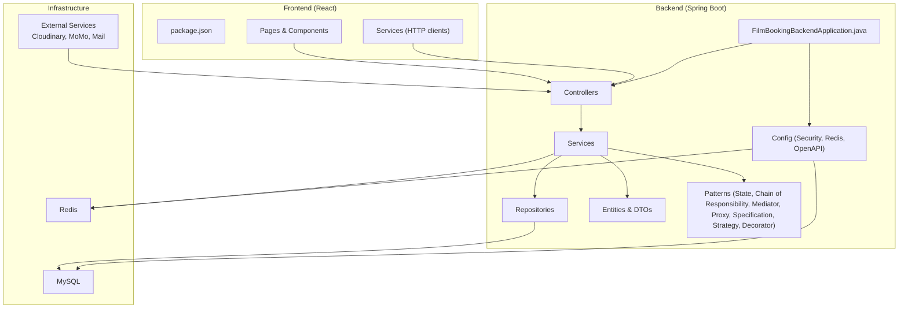

**Diagram sources**
- [FilmBookingBackendApplication.java:1-14](file://backend/src/main/java/com/cinema/booking/FilmBookingBackendApplication.java#L1-L14)
- [SecurityConfig.java:1-82](file://backend/src/main/java/com/cinema/booking/config/SecurityConfig.java#L1-L82)
- [RedisConfig.java:1-55](file://backend/src/main/java/com/cinema/booking/config/RedisConfig.java#L1-L55)
- [BookingController.java:1-114](file://backend/src/main/java/com/cinema/booking/controllers/BookingController.java#L1-L114)
- [BookingServiceImpl.java:1-260](file://backend/src/main/java/com/cinema/booking/services/impl/BookingServiceImpl.java#L1-L260)
- [BookingRepository.java:1-11](file://backend/src/main/java/com/cinema/booking/repositories/BookingRepository.java#L1-L11)
- [database_schema.sql:1-267](file://database_schema.sql#L1-L267)
- [docker-compose.yml:1-34](file://docker-compose.yml#L1-L34)
- [package.json:1-39](file://frontend/package.json#L1-L39)

**Section sources**
- [FilmBookingBackendApplication.java:1-14](file://backend/src/main/java/com/cinema/booking/FilmBookingBackendApplication.java#L1-L14)
- [pom.xml:1-108](file://backend/pom.xml#L1-L108)
- [application.properties:1-97](file://backend/src/main/resources/application.properties#L1-L97)
- [docker-compose.yml:1-34](file://docker-compose.yml#L1-L34)
- [database_schema.sql:1-267](file://database_schema.sql#L1-L267)
- [package.json:1-39](file://frontend/package.json#L1-L39)

## Core Components
- Application bootstrap and entry point: Spring Boot application class initializes the runtime.
- Controllers: Expose REST endpoints for booking, seat rendering, locking/unlocking, pricing calculation, and administrative operations.
- Services: Encapsulate business logic, orchestrate repositories, enforce validations, manage state transitions, and integrate with external systems.
- Repositories: Data access layer built on Spring Data JPA with specification support for flexible queries.
- Configuration: Security (JWT, CORS, method-level security), Redis (connection and serialization), OpenAPI/Swagger.
- Entities and DTOs: Define aggregates (users, movies, cinemas, rooms, seats, showtimes, bookings, tickets, FnB, payments) and transfer objects.
- Patterns: State pattern for booking lifecycle, Chain of Responsibility for pricing validation, Mediator for post-payment coordination, Proxy for caching, Specification for query building, Strategy/Decorator for pricing engine.

**Section sources**
- [FilmBookingBackendApplication.java:1-14](file://backend/src/main/java/com/cinema/booking/FilmBookingBackendApplication.java#L1-L14)
- [BookingController.java:1-114](file://backend/src/main/java/com/cinema/booking/controllers/BookingController.java#L1-L114)
- [BookingServiceImpl.java:1-260](file://backend/src/main/java/com/cinema/booking/services/impl/BookingServiceImpl.java#L1-L260)
- [BookingRepository.java:1-11](file://backend/src/main/java/com/cinema/booking/repositories/BookingRepository.java#L1-L11)
- [SecurityConfig.java:1-82](file://backend/src/main/java/com/cinema/booking/config/SecurityConfig.java#L1-L82)
- [RedisConfig.java:1-55](file://backend/src/main/java/com/cinema/booking/config/RedisConfig.java#L1-L55)

## Architecture Overview
The system follows a layered architecture:
- Presentation Layer: React frontend interacts with backend via HTTP.
- Application Layer: Spring MVC controllers handle requests and delegate to services.
- Domain/Service Layer: Services encapsulate business rules, validations, and state transitions.
- Persistence Layer: JPA/Hibernate with MySQL; repositories provide typed data access.
- Cross-Cutting Layer: Security (JWT), caching (Redis), logging, and external integrations (Cloudinary, MoMo, SMTP).

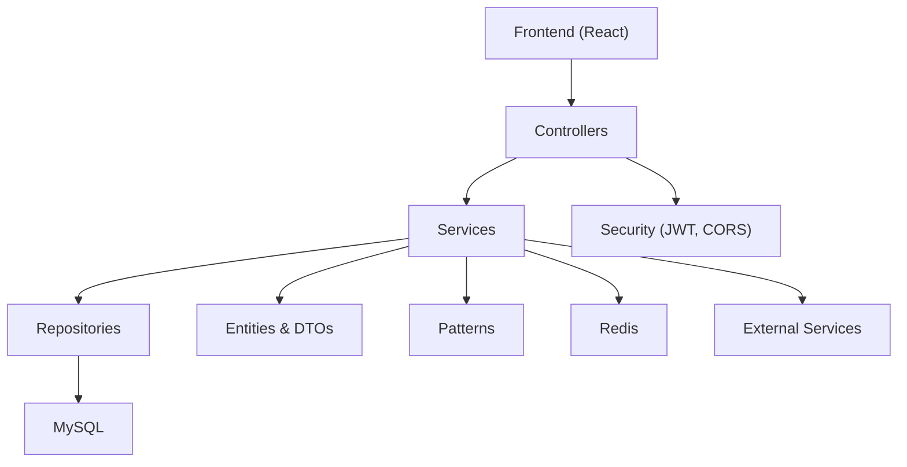

**Diagram sources**
- [BookingController.java:1-114](file://backend/src/main/java/com/cinema/booking/controllers/BookingController.java#L1-L114)
- [BookingServiceImpl.java:1-260](file://backend/src/main/java/com/cinema/booking/services/impl/BookingServiceImpl.java#L1-L260)
- [BookingRepository.java:1-11](file://backend/src/main/java/com/cinema/booking/repositories/BookingRepository.java#L1-L11)
- [SecurityConfig.java:1-82](file://backend/src/main/java/com/cinema/booking/config/SecurityConfig.java#L1-L82)
- [RedisConfig.java:1-55](file://backend/src/main/java/com/cinema/booking/config/RedisConfig.java#L1-L55)
- [database_schema.sql:1-267](file://database_schema.sql#L1-L267)

## Detailed Component Analysis

### System Context and Boundaries
The system boundary includes:
- Internal: Backend API server, MySQL, Redis, internal services.
- External: Cloudinary (image upload), MoMo (payment), SMTP (email notifications).
- Users: Customers (via web app), Admins/Staves (via admin/staff dashboards).

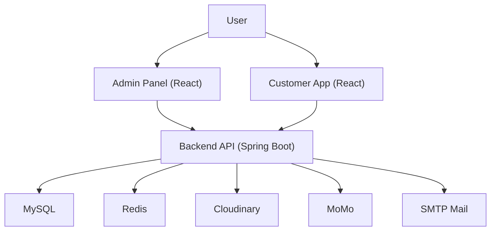

**Diagram sources**
- [application.properties:54-76](file://backend/src/main/resources/application.properties#L54-L76)
- [SecurityConfig.java:1-82](file://backend/src/main/java/com/cinema/booking/config/SecurityConfig.java#L1-L82)
- [database_schema.sql:1-267](file://database_schema.sql#L1-L267)
- [docker-compose.yml:1-34](file://docker-compose.yml#L1-L34)

### Spring Boot MVC and Repository Pattern
- MVC: Controllers expose REST endpoints; services handle business logic; repositories abstract persistence.
- Repository pattern: JPA repositories with specification support enable dynamic query construction and clean separation of concerns.
- Transaction management: Services are annotated for transactional boundaries where needed.

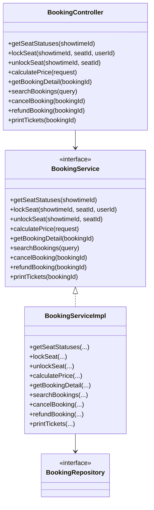

**Diagram sources**
- [BookingController.java:1-114](file://backend/src/main/java/com/cinema/booking/controllers/BookingController.java#L1-L114)
- [BookingServiceImpl.java:1-260](file://backend/src/main/java/com/cinema/booking/services/impl/BookingServiceImpl.java#L1-L260)
- [BookingRepository.java:1-11](file://backend/src/main/java/com/cinema/booking/repositories/BookingRepository.java#L1-L11)

**Section sources**
- [BookingController.java:1-114](file://backend/src/main/java/com/cinema/booking/controllers/BookingController.java#L1-L114)
- [BookingServiceImpl.java:1-260](file://backend/src/main/java/com/cinema/booking/services/impl/BookingServiceImpl.java#L1-L260)
- [BookingRepository.java:1-11](file://backend/src/main/java/com/cinema/booking/repositories/BookingRepository.java#L1-L11)

### Security and Authentication
- JWT-based stateless authentication with a dedicated entry point and filter.
- Method-level security enabled; role-based access control for admin/staff endpoints.
- CORS configured centrally; CSRF disabled for stateless REST APIs.

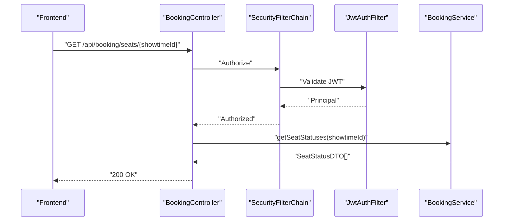

**Diagram sources**
- [SecurityConfig.java:50-79](file://backend/src/main/java/com/cinema/booking/config/SecurityConfig.java#L50-L79)
- [BookingController.java:25-30](file://backend/src/main/java/com/cinema/booking/controllers/BookingController.java#L25-L30)
- [BookingServiceImpl.java:77-115](file://backend/src/main/java/com/cinema/booking/services/impl/BookingServiceImpl.java#L77-L115)

**Section sources**
- [SecurityConfig.java:1-82](file://backend/src/main/java/com/cinema/booking/config/SecurityConfig.java#L1-L82)

### Redis-Based Seat Locking Mechanism
- Seat locking uses Redis SETNX with TTL to prevent race conditions during booking.
- Batch checking supports efficient seat status rendering.
- Unlocking removes the lock key early.

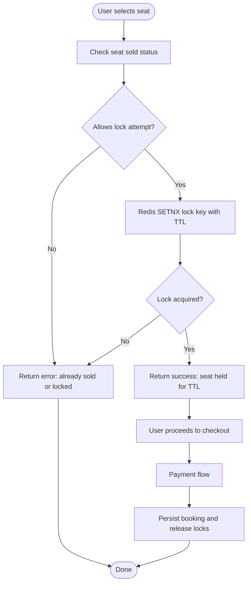

**Diagram sources**
- [RedisSeatLockAdapter.java:27-37](file://backend/src/main/java/com/cinema/booking/services/seatlock/RedisSeatLockAdapter.java#L27-L37)
- [BookingServiceImpl.java:117-131](file://backend/src/main/java/com/cinema/booking/services/impl/BookingServiceImpl.java#L117-L131)

**Section sources**
- [RedisSeatLockAdapter.java:1-56](file://backend/src/main/java/com/cinema/booking/services/seatlock/RedisSeatLockAdapter.java#L1-L56)
- [BookingServiceImpl.java:117-131](file://backend/src/main/java/com/cinema/booking/services/impl/BookingServiceImpl.java#L117-L131)

### Dynamic Pricing Engine and Validation
- Pricing validation uses Chain of Responsibility to enforce rules (e.g., showtime exists, seats available, promo validity).
- Pricing engine uses Strategy/Decorator to compute totals with discounts, surcharges, and member benefits.
- Caching proxy reduces repeated computation for pricing.

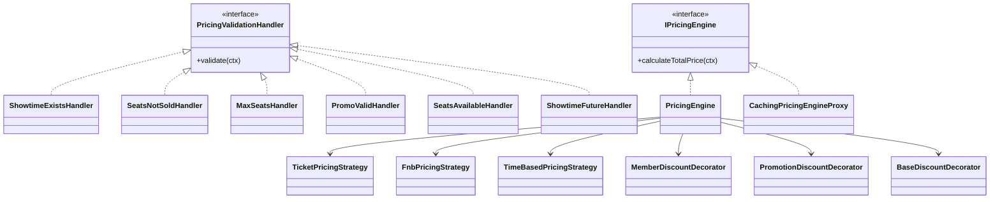

**Diagram sources**
- [BookingServiceImpl.java:133-149](file://backend/src/main/java/com/cinema/booking/services/impl/BookingServiceImpl.java#L133-L149)

**Section sources**
- [BookingServiceImpl.java:133-149](file://backend/src/main/java/com/cinema/booking/services/impl/BookingServiceImpl.java#L133-L149)

### Payment Gateway Integration (MoMo)
- Payment strategy delegates to a checkout process tailored for MoMo.
- The strategy exposes the payment method and executes checkout via the process.

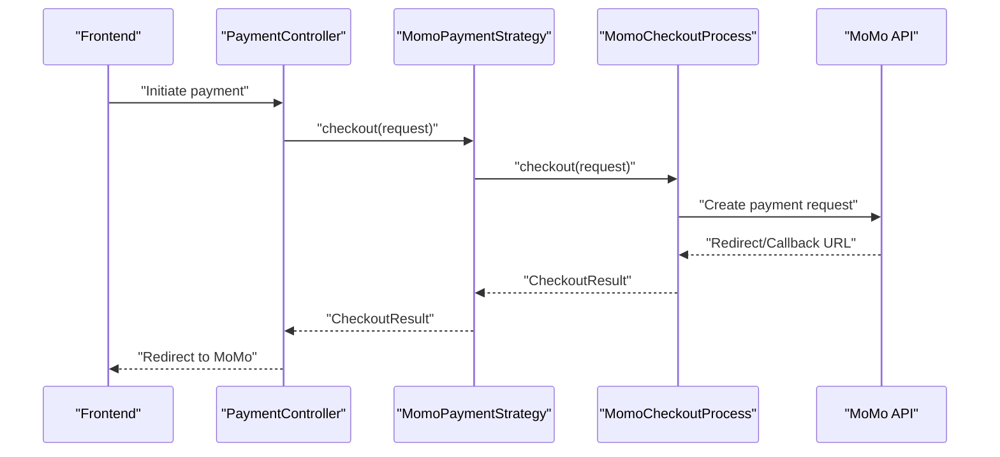

**Diagram sources**
- [MomoPaymentStrategy.java:1-27](file://backend/src/main/java/com/cinema/booking/services/payment/MomoPaymentStrategy.java#L1-L27)

**Section sources**
- [MomoPaymentStrategy.java:1-27](file://backend/src/main/java/com/cinema/booking/services/payment/MomoPaymentStrategy.java#L1-L27)

### Booking Lifecycle Management (State Pattern)
- BookingContext coordinates state transitions (pending → confirmed → printed → refunded/cancelled).
- Transitions are enforced by state implementations and persisted to the booking entity.

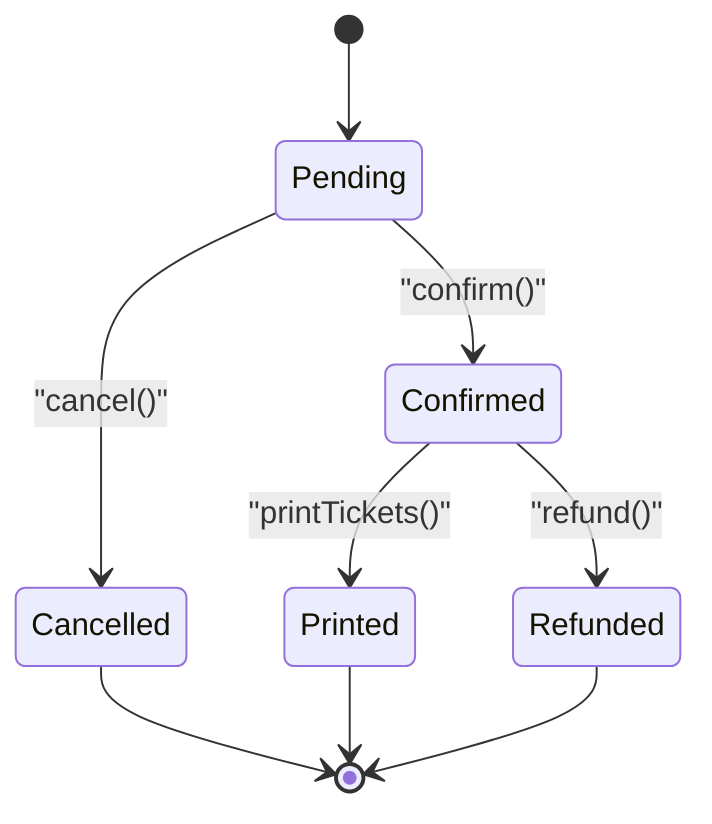

**Diagram sources**
- [BookingContext.java:1-38](file://backend/src/main/java/com/cinema/booking/patterns/state/BookingContext.java#L1-L38)

**Section sources**
- [BookingContext.java:1-38](file://backend/src/main/java/com/cinema/booking/patterns/state/BookingContext.java#L1-L38)

### Data Model Overview
The relational model captures users, movies, cinemas, rooms, seats, showtimes, bookings, tickets, FnB, promotions, and payments.

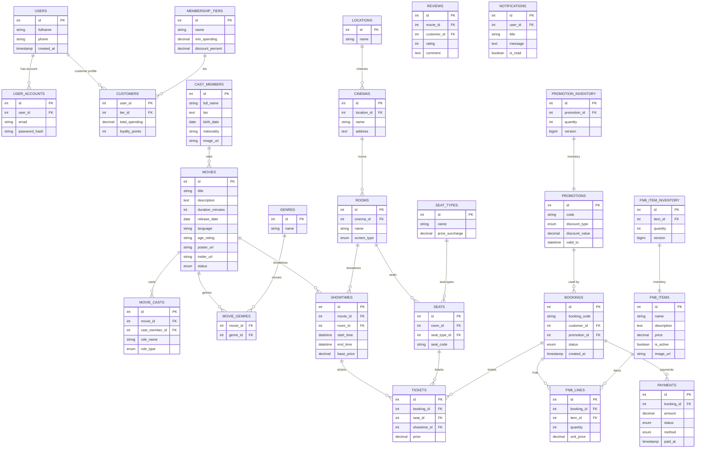

**Diagram sources**
- [database_schema.sql:1-267](file://database_schema.sql#L1-L267)

**Section sources**
- [database_schema.sql:1-267](file://database_schema.sql#L1-L267)

## Dependency Analysis
- Backend dependencies include Spring Boot starters (Web, JPA, Redis, Mail, Security, Validation), MySQL driver, JWT libraries, Cloudinary SDK, OpenAPI/Swagger, and Google API client.
- Frontend dependencies include React, Redux Toolkit, routing, TailwindCSS, and related dev tooling.

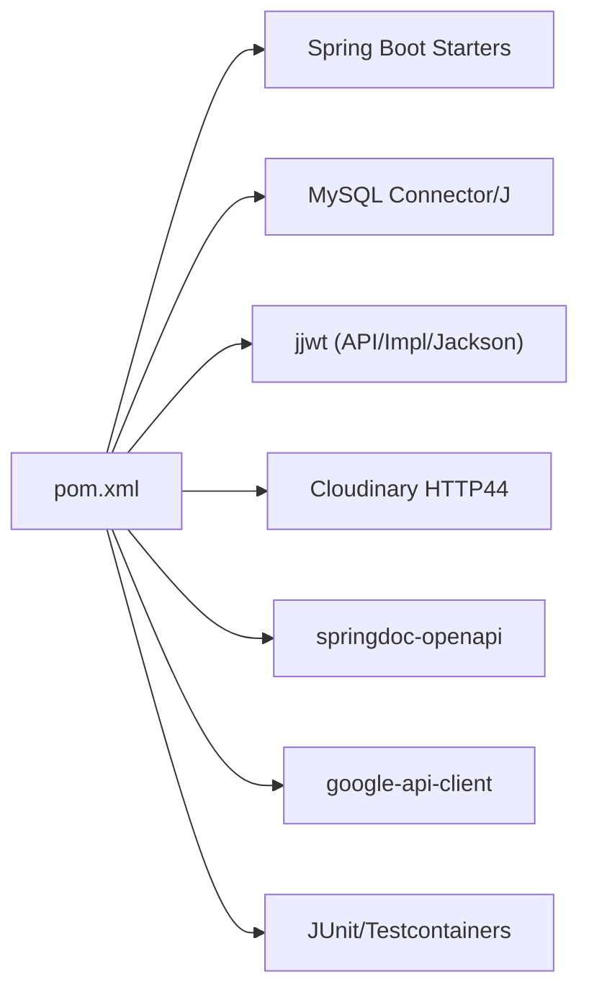

**Diagram sources**
- [pom.xml:18-89](file://backend/pom.xml#L18-L89)

**Section sources**
- [pom.xml:1-108](file://backend/pom.xml#L1-L108)
- [package.json:1-39](file://frontend/package.json#L1-L39)

## Performance Considerations
- Redis TTL for seat locks prevents stale locks and ensures timely cleanup.
- Batch lock checks reduce round trips when rendering seat maps.
- Caching pricing engine proxy minimizes repeated pricing computations.
- JPA/Hibernate with specification-based queries enables scalable filtering and pagination.
- MySQL UTF-8mb4 collation and proper indexing recommended for internationalization and performance.
- Stateless JWT eliminates server-side session storage overhead.

[No sources needed since this section provides general guidance]

## Troubleshooting Guide
- Authentication failures: Verify JWT secret and expiration settings; ensure CORS allows frontend origin.
- Redis connectivity: Confirm host/port/credentials and TTL configuration; check container health.
- Database connectivity: Validate datasource URL, credentials, and timezone; ensure schema initialization.
- Payment callbacks: Confirm MoMo endpoint, access key, partner code, secret key, redirect, and IPN URLs.
- Seat locking errors: Check Redis availability and TTL; ensure seat state snapshot logic aligns with sold tickets.

**Section sources**
- [application.properties:44-97](file://backend/src/main/resources/application.properties#L44-L97)
- [RedisConfig.java:19-65](file://backend/src/main/java/com/cinema/booking/config/RedisConfig.java#L19-L65)
- [database_schema.sql:1-267](file://database_schema.sql#L1-L267)

## Conclusion
The cinema booking system employs a clean layered architecture with Spring Boot MVC, repository pattern, and robust service-layer orchestration. Redis-backed seat locking ensures consistency under concurrency, while the dynamic pricing engine and state pattern provide extensibility and maintainability. Security, caching, and payment integrations are modular and configurable, enabling scalable deployments across Docker Compose environments.

[No sources needed since this section summarizes without analyzing specific files]

## Appendices

### Deployment Topology
- Backend runs as a single-stateless service exposing REST APIs.
- MySQL and Redis are provisioned via Docker Compose with persistent volumes.
- Environment variables configure database, Redis, JWT, Cloudinary, MoMo, and mail settings.

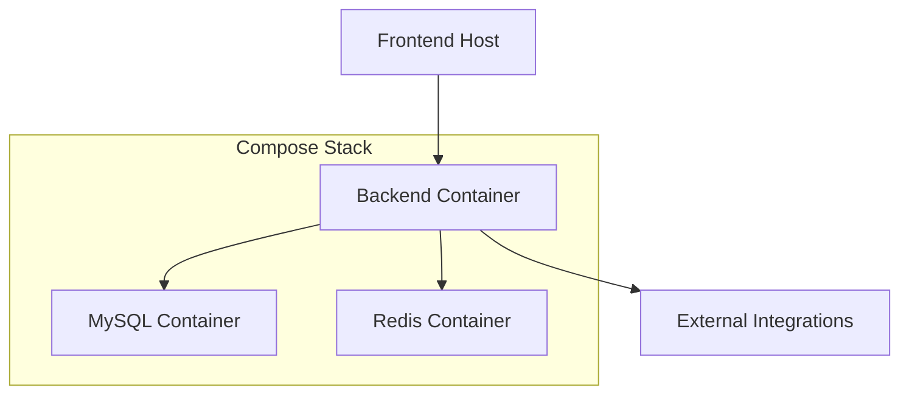

**Diagram sources**
- [docker-compose.yml:1-34](file://docker-compose.yml#L1-L34)
- [application.properties:8-97](file://backend/src/main/resources/application.properties#L8-L97)

**Section sources**
- [docker-compose.yml:1-34](file://docker-compose.yml#L1-L34)
- [application.properties:1-97](file://backend/src/main/resources/application.properties#L1-L97)

### Technology Stack and Compatibility Notes
- Backend: Java 17, Spring Boot 4.0.4, Spring Data JPA, Spring Security, Spring Redis, Spring Mail, JWT (jjwt), MySQL Connector/J, Cloudinary SDK, OpenAPI/Swagger, Google API client.
- Frontend: React 19, Redux Toolkit, React Router, TailwindCSS, Vite toolchain.
- Infrastructure: Docker Compose with MySQL 8.0 and Redis 7.

**Section sources**
- [pom.xml:5-17](file://backend/pom.xml#L5-L17)
- [package.json:12-38](file://frontend/package.json#L12-L38)