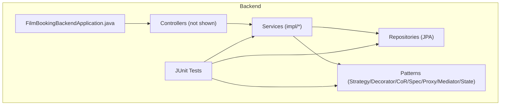
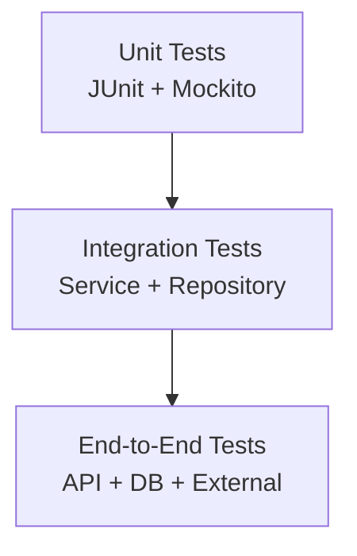
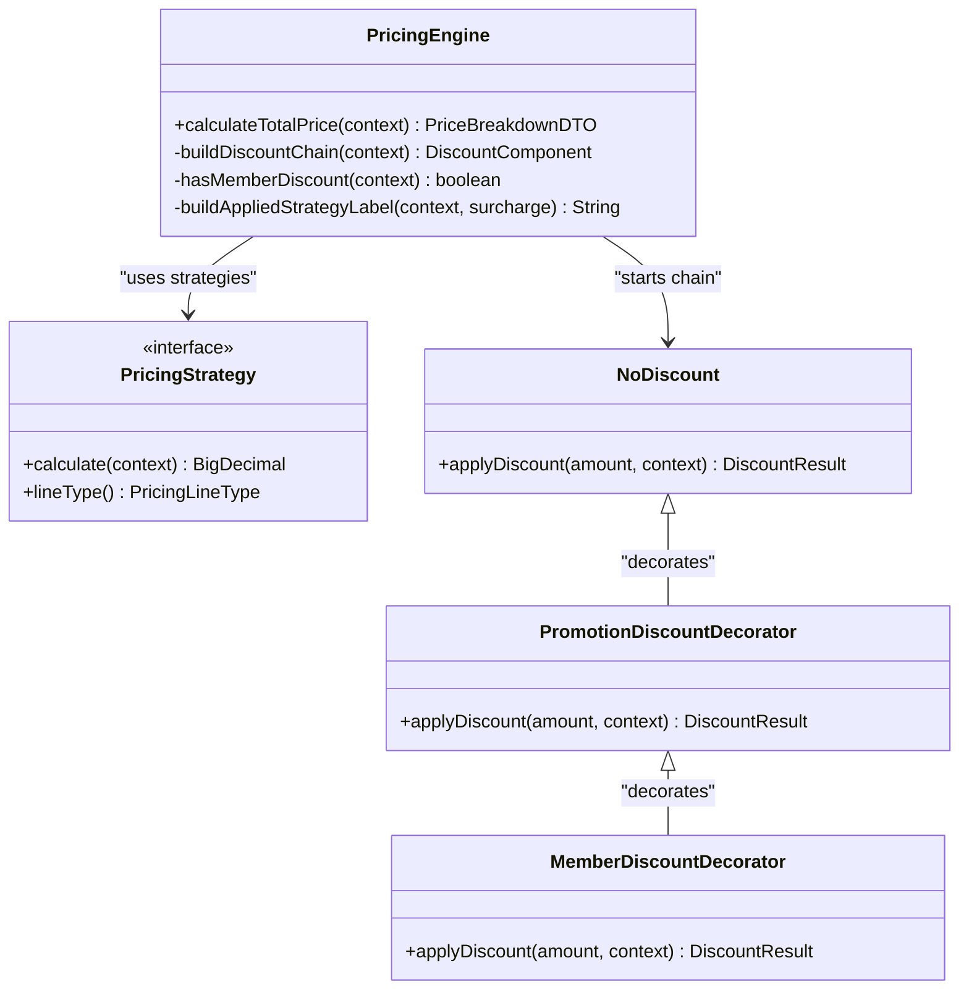
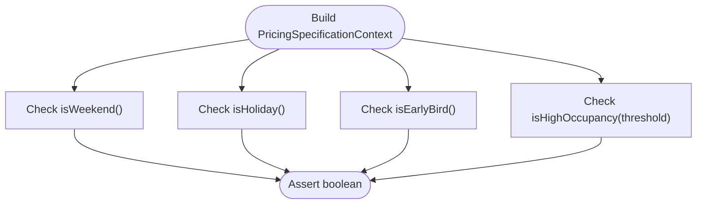
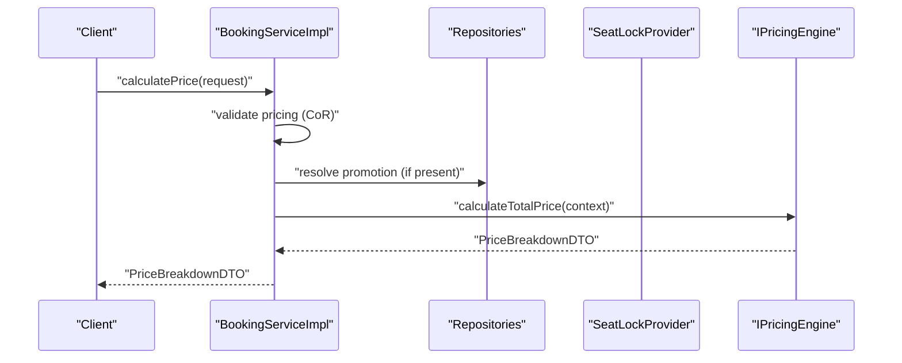
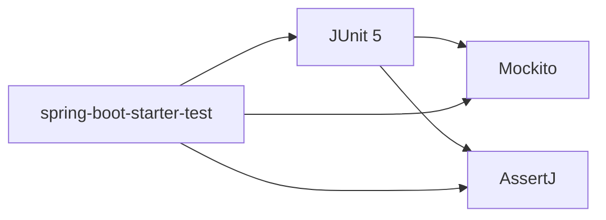

# Testing Strategy

<cite>
**Referenced Files in This Document**
- [FilmBookingBackendApplication.java](file://backend/src/main/java/com/cinema/booking/FilmBookingBackendApplication.java)
- [FilmBookingBackendApplicationTests.java](file://backend/src/test/java/com/cinema/booking/FilmBookingBackendApplicationTests.java)
- [PricingConditionsTest.java](file://backend/src/test/java/com/cinema/booking/patterns/specification/PricingConditionsTest.java)
- [PricingEngine.java](file://backend/src/main/java/com/cinema/booking/services/strategy_decorator/pricing/PricingEngine.java)
- [BookingServiceImpl.java](file://backend/src/main/java/com/cinema/booking/services/impl/BookingServiceImpl.java)
- [BookingRepository.java](file://backend/src/main/java/com/cinema/booking/repositories/BookingRepository.java)
- [CheckoutValidationHandler.java](file://backend/src/main/java/com/cinema/booking/patterns/chainofresponsibility/CheckoutValidationHandler.java)
- [pom.xml](file://backend/pom.xml)
</cite>

## Table of Contents
1. [Introduction](#introduction)
2. [Project Structure](#project-structure)
3. [Core Components](#core-components)
4. [Architecture Overview](#architecture-overview)
5. [Detailed Component Analysis](#detailed-component-analysis)
6. [Dependency Analysis](#dependency-analysis)
7. [Performance Considerations](#performance-considerations)
8. [Troubleshooting Guide](#troubleshooting-guide)
9. [Conclusion](#conclusion)
10. [Appendices](#appendices)

## Introduction
This document defines a comprehensive testing strategy for the cinema booking system. It covers unit testing with JUnit and Mockito, integration testing for service-layer and repository interactions, and end-to-end testing for critical user workflows. It explains the testing pyramid implementation, mock usage for external dependencies, and test data management strategies. Special emphasis is placed on validating design patterns, notably the dynamic pricing engine and staff-related checkout flows. Continuous integration, automated pipelines, and quality gates are outlined, along with guidelines for effective tests, organization, assertions, debugging, reporting, and coverage analysis. Performance, load, and concurrency testing considerations for seat locking are included, alongside best practices for Spring Boot and React components.

## Project Structure
The backend is a Spring Boot application with layered architecture:
- Controllers expose REST endpoints.
- Services encapsulate business logic and orchestrate repositories and external integrations.
- Repositories manage persistence via Spring Data JPA.
- Patterns modules implement design patterns (Strategy, Decorator, Chain of Responsibility, Specification, Proxy, Composite, Mediator, State).
- Tests reside under src/test with packages mirroring production code.

**Diagram sources**
- [FilmBookingBackendApplication.java:1-14](file://backend/src/main/java/com/cinema/booking/FilmBookingBackendApplication.java#L1-L14)

**Section sources**
- [FilmBookingBackendApplication.java:1-14](file://backend/src/main/java/com/cinema/booking/FilmBookingBackendApplication.java#L1-L14)

## Core Components
- Dynamic Pricing Engine: Orchestrates pricing strategies per line type and applies decorators (promotion and membership discounts). It validates inputs and ensures non-negative totals.
- Booking Service: Coordinates seat availability, locks, pricing calculation, and booking lifecycle transitions (cancel/refund/print).
- Repositories: JPA-backed data access for bookings and related entities.
- Design Patterns: Chain of Responsibility for checkout validation, Specification for search and pricing conditions, Strategy/Decorator for pricing, Proxy for caching, Mediator for post-payment coordination, Composite for dashboard stats, State for booking lifecycle, Prototype for email templates.

Key testing targets:
- PricingEngine behavior and discount chain composition.
- BookingServiceImpl seat locking, price calculation, and state transitions.
- Repository queries and JPA Specifications.
- Pattern validations (CoR, Specification, Strategy/Decorator).

**Section sources**
- [PricingEngine.java:1-117](file://backend/src/main/java/com/cinema/booking/services/strategy_decorator/pricing/PricingEngine.java#L1-L117)
- [BookingServiceImpl.java:1-260](file://backend/src/main/java/com/cinema/booking/services/impl/BookingServiceImpl.java#L1-L260)
- [BookingRepository.java:1-11](file://backend/src/main/java/com/cinema/booking/repositories/BookingRepository.java#L1-L11)

## Architecture Overview
The testing strategy aligns with the testing pyramid:
- Unit tests: Pure logic validations (e.g., PricingConditions predicates), small isolated units, mocks for external dependencies.
- Integration tests: Service-layer tests verifying repository interactions and cross-service collaboration.
- End-to-end tests: API-level tests covering critical user journeys (e.g., seat selection, checkout, payment callbacks).

[No sources needed since this diagram shows conceptual workflow, not actual code structure]

## Detailed Component Analysis

### Dynamic Pricing Engine Validation
The PricingEngine orchestrates pricing across line types and applies a decorator chain for discounts. Unit tests should validate:
- Strategy registration completeness and uniqueness.
- Correct application of promotion and membership discounts.
- Non-negative final totals and proper breakdown fields.
- Applied strategy label construction.

Recommended test coverage:
- Strategy mapping integrity.
- Discount chain composition based on context.
- Edge cases: zero quantities, missing promotions, member tiers without discounts.
- Price breakdown correctness across line types.

**Diagram sources**
- [PricingEngine.java:24-117](file://backend/src/main/java/com/cinema/booking/services/strategy_decorator/pricing/PricingEngine.java#L24-L117)

**Section sources**
- [PricingEngine.java:14-117](file://backend/src/main/java/com/cinema/booking/services/strategy_decorator/pricing/PricingEngine.java#L14-L117)

### Pricing Conditions Predicate Tests
The existing unit test suite for PricingConditions demonstrates pure predicate testing without Spring context. It validates:
- Weekend detection.
- Holiday detection.
- Early bird booking window checks.
- High occupancy thresholds with guard clauses.

Guidelines:
- Keep tests deterministic with fixed dates/times.
- Use minimal context objects to avoid unnecessary coupling.
- Validate boundary conditions and guard clauses.

**Diagram sources**
- [PricingConditionsTest.java:14-138](file://backend/src/test/java/com/cinema/booking/patterns/specification/PricingConditionsTest.java#L14-L138)

**Section sources**
- [PricingConditionsTest.java:14-138](file://backend/src/test/java/com/cinema/booking/patterns/specification/PricingConditionsTest.java#L14-L138)

### Booking Service: Seat Locking and Pricing Calculation
Key responsibilities:
- Seat status retrieval combining inventory, sales, and seat locks.
- Seat lock acquisition/release with TTL.
- Pricing calculation via validation chain and pricing engine.
- Booking lifecycle transitions (cancel/refund/print).

Testing approach:
- Mock SeatLockProvider for lock/unlock behavior.
- Mock repositories for sold seats and inventory.
- Verify transaction boundaries and error handling paths.
- Validate DTO mapping correctness.

**Diagram sources**
- [BookingServiceImpl.java:133-149](file://backend/src/main/java/com/cinema/booking/services/impl/BookingServiceImpl.java#L133-L149)
- [CheckoutValidationHandler.java:1-7](file://backend/src/main/java/com/cinema/booking/patterns/chainofresponsibility/CheckoutValidationHandler.java#L1-L7)
- [PricingEngine.java:45-75](file://backend/src/main/java/com/cinema/booking/services/strategy_decorator/pricing/PricingEngine.java#L45-L75)

**Section sources**
- [BookingServiceImpl.java:77-149](file://backend/src/main/java/com/cinema/booking/services/impl/BookingServiceImpl.java#L77-L149)

### Repository Layer Testing
- Use Spring Data JPA repositories with JpaSpecificationExecutor for flexible querying.
- Integration tests should verify JPQL/HQL correctness and specification composition.
- Test boundary conditions: empty results, pagination, sorting, and projections.

Recommended tests:
- SearchBookings with various query patterns.
- Existence checks for sold seats and locks.
- Promotion and inventory resolution queries.

**Section sources**
- [BookingRepository.java:8-11](file://backend/src/main/java/com/cinema/booking/repositories/BookingRepository.java#L8-L11)

### Design Pattern Testing Guidelines
- Chain of Responsibility (checkout validation): test handler ordering, short-circuit behavior, and error propagation.
- Specification: validate composed predicates and JPA Specifications.
- Strategy/Decorator (pricing): validate line-type pricing and discount chain outcomes.
- Proxy (caching): isolate cache behavior behind interfaces; test cache hits/misses and TTL.
- Mediator: coordinate collaborators via mediator; test callback flows and rollback scenarios.
- Composite: validate aggregation of statistics.
- State: validate state transitions and immutability of state rules.
- Prototype: validate deep copy semantics for email templates.

[No sources needed since this section provides general guidance]

## Dependency Analysis
Testing dependencies and coupling:
- Unit tests should minimize external dependencies using mocks.
- Integration tests should exercise repository and service layers with an embedded database profile.
- End-to-end tests require a full stack with test containers for databases and external services.

**Diagram sources**
- [pom.xml:87-89](file://backend/pom.xml#L87-L89)

**Section sources**
- [pom.xml:18-89](file://backend/pom.xml#L18-L89)

## Performance Considerations
- Unit tests: fast, deterministic; avoid real network calls and disk I/O.
- Integration tests: use in-memory databases and limit dataset sizes.
- Load testing: simulate concurrent seat lock acquisitions and checkout requests; measure Redis TTL and seat contention.
- Concurrency testing: validate seat locking correctness under race conditions; ensure atomic lock/unlock operations.
- End-to-end tests: use synthetic loads and monitor response times and error rates.

[No sources needed since this section provides general guidance]

## Troubleshooting Guide
Common issues and resolutions:
- Flaky tests due to time-sensitive predicates: freeze time or inject clock/timezone providers.
- External dependency failures: replace with mocks/stubs; verify fallback behavior.
- Transaction isolation: ensure tests roll back changes; use @Commit/@Rollback semantics where appropriate.
- Reporting and coverage: integrate JaCoCo for coverage; publish reports to CI artifacts.

[No sources needed since this section provides general guidance]

## Conclusion
The testing strategy emphasizes a robust testing pyramid with strong unit coverage for design patterns, targeted integration tests for services and repositories, and end-to-end tests for critical workflows. By leveraging JUnit, Mockito, and AssertJ, and by isolating external dependencies, the system achieves reliable, maintainable, and high-quality assurance. Continuous integration pipelines should enforce quality gates, including coverage thresholds and performance benchmarks.

[No sources needed since this section summarizes without analyzing specific files]

## Appendices

### Continuous Integration and Quality Gates
- Enforce unit test pass and coverage threshold.
- Run integration tests against a dedicated test database profile.
- Gate pull requests on test success and coverage metrics.
- Publish test reports and coverage artifacts to CI.

[No sources needed since this section provides general guidance]

### Guidelines for Writing Effective Tests
- Use descriptive test names and clear arrange-act-assert structure.
- Prefer data-driven tests for boundary conditions.
- Keep tests independent and deterministic.
- Use mocks for external systems; avoid real network calls.

[No sources needed since this section provides general guidance]

### Assertion Strategies
- Favor expressive assertions with AssertJ for readability.
- Validate DTOs and domain objects comprehensively.
- Assert side effects (e.g., repository calls) using argument captors.

[No sources needed since this section provides general guidance]

### Debugging Techniques
- Enable verbose logging for failing tests.
- Use breakpoints and step-through for complex flows.
- Capture and inspect DTOs and entities during test execution.

[No sources needed since this section provides general guidance]

### Test Data Management
- Use lightweight fixtures for unit tests; build minimal contexts.
- Employ database snapshots or SQL scripts for integration tests.
- Seed test data via Flyway or Liquibase for reproducible environments.

[No sources needed since this section provides general guidance]

### Spring Boot Best Practices for Testing
- Use @SpringBootTest selectively; prefer @WebMvcTest or @DataJpaTest for focused tests.
- Configure test profiles and property overrides.
- Use @MockBean and @SpyBean to substitute components.

[No sources needed since this section provides general guidance]

### React Component Testing Best Practices
- Use React Testing Library for user-centric tests.
- Mock API services and Redux stores.
- Focus on user interactions and accessibility.

[No sources needed since this section provides general guidance]