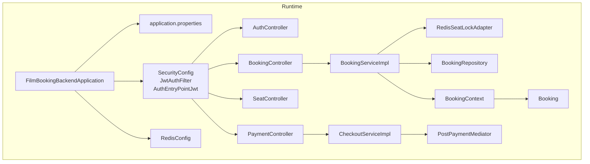
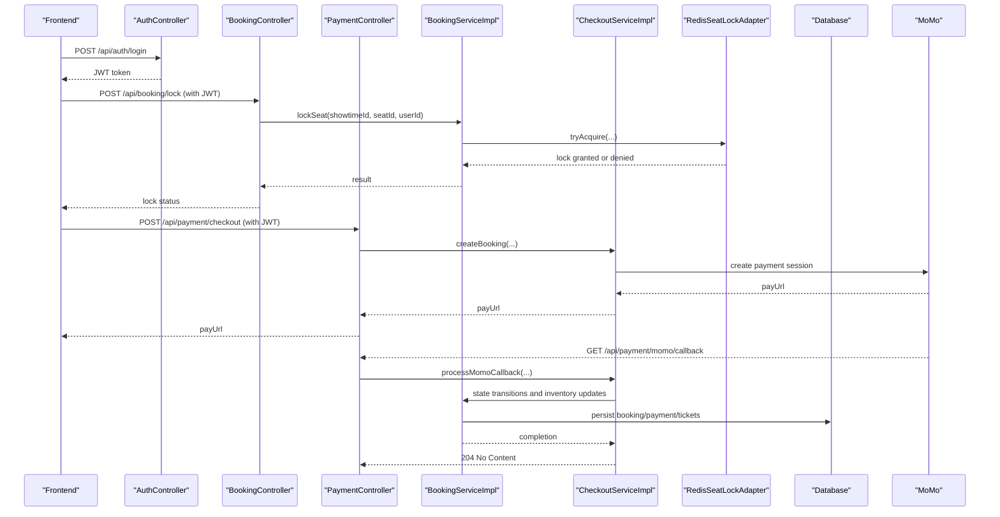
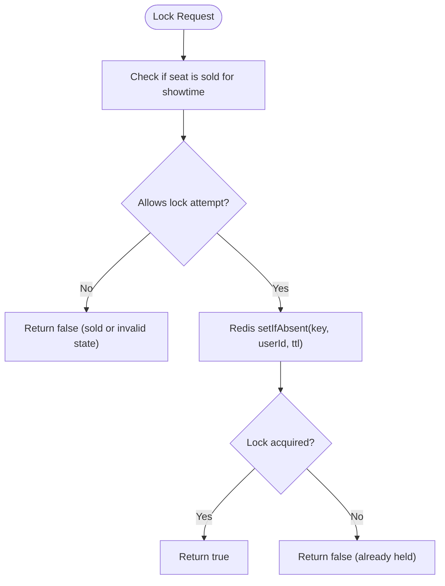
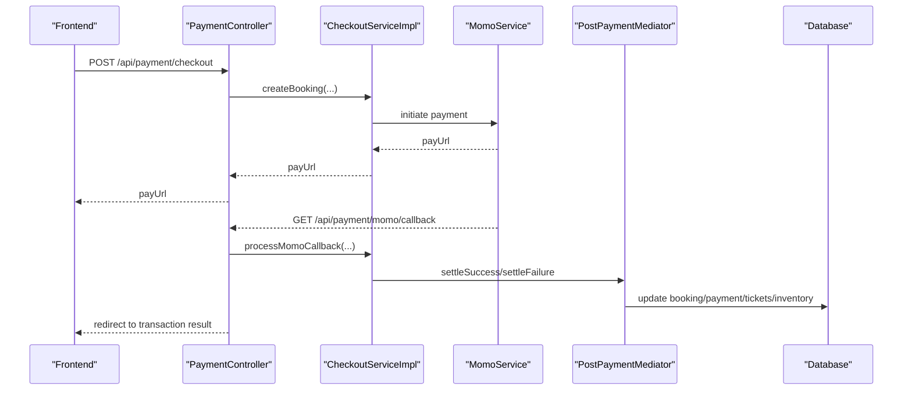
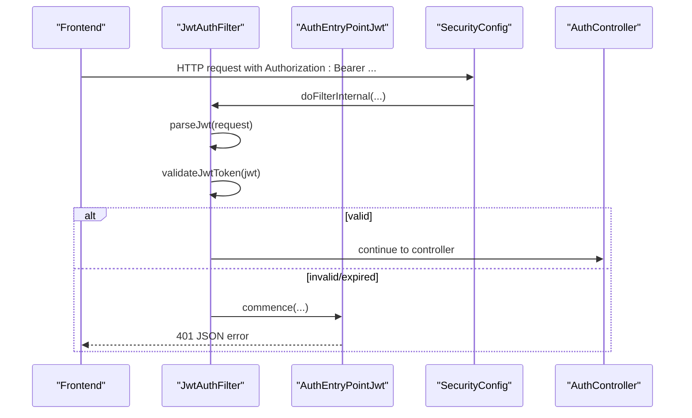
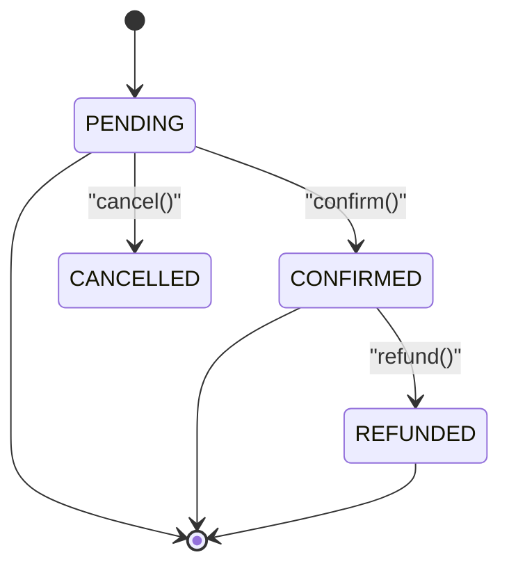
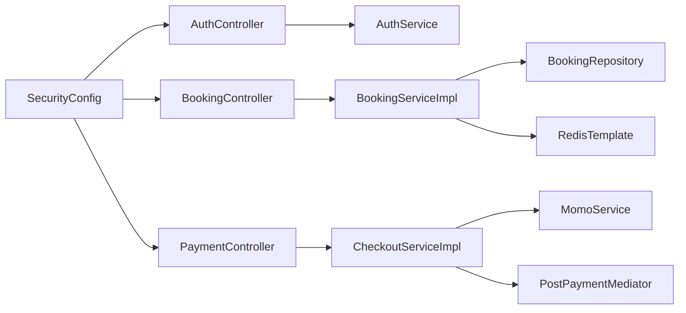

# Troubleshooting and FAQ

<cite>
**Referenced Files in This Document**
- [application.properties](file://backend/src/main/resources/application.properties)
- [docker-compose.yml](file://docker-compose.yml)
- [FilmBookingBackendApplication.java](file://backend/src/main/java/com/cinema/booking/FilmBookingBackendApplication.java)
- [RedisConfig.java](file://backend/src/main/java/com/cinema/booking/config/RedisConfig.java)
- [SecurityConfig.java](file://backend/src/main/java/com/cinema/booking/config/SecurityConfig.java)
- [JwtAuthFilter.java](file://backend/src/main/java/com/cinema/booking/security/JwtAuthFilter.java)
- [AuthEntryPointJwt.java](file://backend/src/main/java/com/cinema/booking/security/AuthEntryPointJwt.java)
- [AuthController.java](file://backend/src/main/java/com/cinema/booking/controllers/AuthController.java)
- [BookingController.java](file://backend/src/main/java/com/cinema/booking/controllers/BookingController.java)
- [SeatController.java](file://backend/src/main/java/com/cinema/booking/controllers/SeatController.java)
- [PaymentController.java](file://backend/src/main/java/com/cinema/booking/controllers/PaymentController.java)
- [BookingServiceImpl.java](file://backend/src/main/java/com/cinema/booking/services/impl/BookingServiceImpl.java)
- [CheckoutServiceImpl.java](file://backend/src/main/java/com/cinema/booking/services/impl/CheckoutServiceImpl.java)
- [RedisSeatLockAdapter.java](file://backend/src/main/java/com/cinema/booking/services/seatlock/RedisSeatLockAdapter.java)
- [PostPaymentMediator.java](file://backend/src/main/java/com/cinema/booking/patterns/mediator/PostPaymentMediator.java)
- [BookingContext.java](file://backend/src/main/java/com/cinema/booking/patterns/state/BookingContext.java)
- [Booking.java](file://backend/src/main/java/com/cinema/booking/entities/Booking.java)
- [BookingRepository.java](file://backend/src/main/java/com/cinema/booking/repositories/BookingRepository.java)
</cite>

## Table of Contents
1. [Introduction](#introduction)
2. [Project Structure](#project-structure)
3. [Core Components](#core-components)
4. [Architecture Overview](#architecture-overview)
5. [Detailed Component Analysis](#detailed-component-analysis)
6. [Dependency Analysis](#dependency-analysis)
7. [Performance Considerations](#performance-considerations)
8. [Troubleshooting Guide](#troubleshooting-guide)
9. [Conclusion](#conclusion)
10. [Appendices](#appendices)

## Introduction
This document provides comprehensive troubleshooting and FAQ guidance for the cinema booking system. It focuses on diagnosing and resolving common issues related to seat locking, payment gateway integration, authentication failures, and database connectivity. It also covers development environment setup, Docker container issues, Redis connectivity, performance optimization, security considerations, maintenance, monitoring, deployment, and rollback procedures.

## Project Structure
The backend is a Spring Boot application configured via environment-driven properties and orchestrated by Docker Compose. Key runtime components include:
- Application entry point and configuration
- Security and JWT filter chain
- Controllers for authentication, booking, seats, and payments
- Services implementing business logic (booking, checkout, pricing, seat locking)
- Persistence and entities for bookings and related aggregates
- Mediator and state patterns coordinating post-payment actions

**Diagram sources**
- [FilmBookingBackendApplication.java:1-14](file://backend/src/main/java/com/cinema/booking/FilmBookingBackendApplication.java#L1-L14)
- [application.properties:1-97](file://backend/src/main/resources/application.properties#L1-L97)
- [SecurityConfig.java:1-82](file://backend/src/main/java/com/cinema/booking/config/SecurityConfig.java#L1-L82)
- [JwtAuthFilter.java:1-64](file://backend/src/main/java/com/cinema/booking/security/JwtAuthFilter.java#L1-L64)
- [AuthEntryPointJwt.java:1-39](file://backend/src/main/java/com/cinema/booking/security/AuthEntryPointJwt.java#L1-L39)
- [RedisConfig.java:1-55](file://backend/src/main/java/com/cinema/booking/config/RedisConfig.java#L1-L55)
- [AuthController.java:1-54](file://backend/src/main/java/com/cinema/booking/controllers/AuthController.java#L1-L54)
- [BookingController.java:1-114](file://backend/src/main/java/com/cinema/booking/controllers/BookingController.java#L1-L114)
- [SeatController.java:1-60](file://backend/src/main/java/com/cinema/booking/controllers/SeatController.java#L1-L60)
- [PaymentController.java:1-150](file://backend/src/main/java/com/cinema/booking/controllers/PaymentController.java#L1-L150)
- [BookingServiceImpl.java:1-260](file://backend/src/main/java/com/cinema/booking/services/impl/BookingServiceImpl.java#L1-L260)
- [CheckoutServiceImpl.java:1-185](file://backend/src/main/java/com/cinema/booking/services/impl/CheckoutServiceImpl.java#L1-L185)
- [RedisSeatLockAdapter.java:1-56](file://backend/src/main/java/com/cinema/booking/services/seatlock/RedisSeatLockAdapter.java#L1-L56)
- [PostPaymentMediator.java:1-47](file://backend/src/main/java/com/cinema/booking/patterns/mediator/PostPaymentMediator.java#L1-L47)
- [BookingContext.java:1-38](file://backend/src/main/java/com/cinema/booking/patterns/state/BookingContext.java#L1-L38)
- [Booking.java:1-65](file://backend/src/main/java/com/cinema/booking/entities/Booking.java#L1-L65)
- [BookingRepository.java:1-11](file://backend/src/main/java/com/cinema/booking/repositories/BookingRepository.java#L1-L11)

**Section sources**
- [FilmBookingBackendApplication.java:1-14](file://backend/src/main/java/com/cinema/booking/FilmBookingBackendApplication.java#L1-L14)
- [application.properties:1-97](file://backend/src/main/resources/application.properties#L1-L97)
- [docker-compose.yml:1-34](file://docker-compose.yml#L1-L34)

## Core Components
- Seat locking via Redis: The seat locking adapter uses Redis set-if-absent semantics with TTL to coordinate concurrent seat reservations.
- Payment flow: MoMo checkout and webhook handling, with a mediator pattern orchestrating post-payment steps.
- Authentication and authorization: JWT-based stateless security with method-level role checks.
- Booking lifecycle: State machine enforcing transitions and cancellation/refund rules.

**Section sources**
- [RedisSeatLockAdapter.java:1-56](file://backend/src/main/java/com/cinema/booking/services/seatlock/RedisSeatLockAdapter.java#L1-L56)
- [CheckoutServiceImpl.java:1-185](file://backend/src/main/java/com/cinema/booking/services/impl/CheckoutServiceImpl.java#L1-L185)
- [PostPaymentMediator.java:1-47](file://backend/src/main/java/com/cinema/booking/patterns/mediator/PostPaymentMediator.java#L1-L47)
- [SecurityConfig.java:1-82](file://backend/src/main/java/com/cinema/booking/config/SecurityConfig.java#L1-L82)
- [JwtAuthFilter.java:1-64](file://backend/src/main/java/com/cinema/booking/security/JwtAuthFilter.java#L1-L64)
- [BookingContext.java:1-38](file://backend/src/main/java/com/cinema/booking/patterns/state/BookingContext.java#L1-L38)

## Architecture Overview
The system integrates Spring MVC controllers, service layer, persistence, Redis for concurrency control, and external payment provider MoMo. Security is enforced centrally via filters and method-level roles.

**Diagram sources**
- [AuthController.java:1-54](file://backend/src/main/java/com/cinema/booking/controllers/AuthController.java#L1-L54)
- [BookingController.java:1-114](file://backend/src/main/java/com/cinema/booking/controllers/BookingController.java#L1-L114)
- [PaymentController.java:1-150](file://backend/src/main/java/com/cinema/booking/controllers/PaymentController.java#L1-L150)
- [BookingServiceImpl.java:1-260](file://backend/src/main/java/com/cinema/booking/services/impl/BookingServiceImpl.java#L1-L260)
- [CheckoutServiceImpl.java:1-185](file://backend/src/main/java/com/cinema/booking/services/impl/CheckoutServiceImpl.java#L1-L185)
- [RedisSeatLockAdapter.java:1-56](file://backend/src/main/java/com/cinema/booking/services/seatlock/RedisSeatLockAdapter.java#L1-L56)
- [BookingRepository.java:1-11](file://backend/src/main/java/com/cinema/booking/repositories/BookingRepository.java#L1-L11)

## Detailed Component Analysis

### Seat Locking and Concurrency Control
Seat locking uses Redis with a dedicated key format per showtime and seat, combined with a TTL. Batch queries check locks efficiently. Issues commonly arise from Redis unavailability, TTL misconfiguration, or race conditions during checkout.

**Diagram sources**
- [BookingServiceImpl.java:117-131](file://backend/src/main/java/com/cinema/booking/services/impl/BookingServiceImpl.java#L117-L131)
- [RedisSeatLockAdapter.java:23-37](file://backend/src/main/java/com/cinema/booking/services/seatlock/RedisSeatLockAdapter.java#L23-L37)

**Section sources**
- [BookingServiceImpl.java:117-131](file://backend/src/main/java/com/cinema/booking/services/impl/BookingServiceImpl.java#L117-L131)
- [RedisSeatLockAdapter.java:1-56](file://backend/src/main/java/com/cinema/booking/services/seatlock/RedisSeatLockAdapter.java#L1-L56)

### Payment Flow and MoMo Integration
The checkout flow creates a booking and redirects to MoMo for payment. The callback and webhook verify signatures and drive post-payment actions via a mediator.

**Diagram sources**
- [PaymentController.java:1-150](file://backend/src/main/java/com/cinema/booking/controllers/PaymentController.java#L1-L150)
- [CheckoutServiceImpl.java:43-130](file://backend/src/main/java/com/cinema/booking/services/impl/CheckoutServiceImpl.java#L43-L130)
- [PostPaymentMediator.java:1-47](file://backend/src/main/java/com/cinema/booking/patterns/mediator/PostPaymentMediator.java#L1-L47)

**Section sources**
- [PaymentController.java:1-150](file://backend/src/main/java/com/cinema/booking/controllers/PaymentController.java#L1-L150)
- [CheckoutServiceImpl.java:1-185](file://backend/src/main/java/com/cinema/booking/services/impl/CheckoutServiceImpl.java#L1-L185)
- [PostPaymentMediator.java:1-47](file://backend/src/main/java/com/cinema/booking/patterns/mediator/PostPaymentMediator.java#L1-L47)

### Authentication and Authorization
JWT-based authentication validates tokens and populates the security context. Unauthorized attempts trigger a JSON error response.

**Diagram sources**
- [JwtAuthFilter.java:1-64](file://backend/src/main/java/com/cinema/booking/security/JwtAuthFilter.java#L1-L64)
- [AuthEntryPointJwt.java:1-39](file://backend/src/main/java/com/cinema/booking/security/AuthEntryPointJwt.java#L1-L39)
- [SecurityConfig.java:1-82](file://backend/src/main/java/com/cinema/booking/config/SecurityConfig.java#L1-L82)
- [AuthController.java:1-54](file://backend/src/main/java/com/cinema/booking/controllers/AuthController.java#L1-L54)

**Section sources**
- [JwtAuthFilter.java:1-64](file://backend/src/main/java/com/cinema/booking/security/JwtAuthFilter.java#L1-L64)
- [AuthEntryPointJwt.java:1-39](file://backend/src/main/java/com/cinema/booking/security/AuthEntryPointJwt.java#L1-L39)
- [SecurityConfig.java:1-82](file://backend/src/main/java/com/cinema/booking/config/SecurityConfig.java#L1-L82)
- [AuthController.java:1-54](file://backend/src/main/java/com/cinema/booking/controllers/AuthController.java#L1-L54)

### Booking Lifecycle and State Management
Booking state transitions are enforced by a context that delegates to concrete states. Cancellation and refund release inventory only when applicable.

**Diagram sources**
- [BookingContext.java:1-38](file://backend/src/main/java/com/cinema/booking/patterns/state/BookingContext.java#L1-L38)
- [Booking.java:46-57](file://backend/src/main/java/com/cinema/booking/entities/Booking.java#L46-L57)

**Section sources**
- [BookingContext.java:1-38](file://backend/src/main/java/com/cinema/booking/patterns/state/BookingContext.java#L1-L38)
- [Booking.java:1-65](file://backend/src/main/java/com/cinema/booking/entities/Booking.java#L1-L65)

## Dependency Analysis
- Controllers depend on services for business logic.
- Services depend on repositories, Redis templates, and external integrations.
- Security configuration injects filters and method security.
- Redis configuration provides connection and serialization strategy.

**Diagram sources**
- [AuthController.java:1-54](file://backend/src/main/java/com/cinema/booking/controllers/AuthController.java#L1-L54)
- [BookingController.java:1-114](file://backend/src/main/java/com/cinema/booking/controllers/BookingController.java#L1-L114)
- [PaymentController.java:1-150](file://backend/src/main/java/com/cinema/booking/controllers/PaymentController.java#L1-L150)
- [BookingServiceImpl.java:1-260](file://backend/src/main/java/com/cinema/booking/services/impl/BookingServiceImpl.java#L1-L260)
- [CheckoutServiceImpl.java:1-185](file://backend/src/main/java/com/cinema/booking/services/impl/CheckoutServiceImpl.java#L1-L185)
- [BookingRepository.java:1-11](file://backend/src/main/java/com/cinema/booking/repositories/BookingRepository.java#L1-L11)
- [SecurityConfig.java:1-82](file://backend/src/main/java/com/cinema/booking/config/SecurityConfig.java#L1-L82)

**Section sources**
- [BookingServiceImpl.java:1-260](file://backend/src/main/java/com/cinema/booking/services/impl/BookingServiceImpl.java#L1-L260)
- [CheckoutServiceImpl.java:1-185](file://backend/src/main/java/com/cinema/booking/services/impl/CheckoutServiceImpl.java#L1-L185)
- [SecurityConfig.java:1-82](file://backend/src/main/java/com/cinema/booking/config/SecurityConfig.java#L1-L82)

## Performance Considerations
- Redis seat locking
  - Use batch lock checks to minimize round trips.
  - Tune TTL to balance responsiveness and cleanup overhead.
  - Monitor Redis latency and memory usage under load.
- Database queries
  - Prefer targeted queries (e.g., fetching seats by room) to avoid N+1.
  - Enable SQL logging in development to identify slow queries.
  - Use pagination and indexing where appropriate.
- Payment processing
  - Offload email notifications asynchronously after payment settlement.
  - Validate MoMo signatures and extraData early to fail fast.
- Caching and pricing
  - Reuse the pricing engine proxy to reduce repeated computation.
- Concurrency
  - Ensure atomic operations for seat locking and payment updates.
  - Use transactions around booking and payment persistence.

[No sources needed since this section provides general guidance]

## Troubleshooting Guide

### Seat Locking Problems
Symptoms:
- Users cannot lock seats despite availability.
- Simultaneous users can select the same seat.

Root causes and fixes:
- Redis connectivity failure
  - Verify Redis host/port/credentials in environment variables and Docker Compose.
  - Confirm Redis container health and logs.
- TTL too short or too long
  - Adjust the TTL property controlling Redis lock duration.
- Race conditions
  - Ensure clients retry after temporary lock failures.
  - Validate that unlock is called when checkout does not complete.

Debugging steps:
- Check Redis keys for lock entries and expiry.
- Inspect seat status rendering and sold seat detection.
- Confirm batch lock held checks return expected results.

**Section sources**
- [application.properties:59-66](file://backend/src/main/resources/application.properties#L59-L66)
- [docker-compose.yml:21-30](file://docker-compose.yml#L21-L30)
- [RedisSeatLockAdapter.java:1-56](file://backend/src/main/java/com/cinema/booking/services/seatlock/RedisSeatLockAdapter.java#L1-L56)
- [BookingServiceImpl.java:77-131](file://backend/src/main/java/com/cinema/booking/services/impl/BookingServiceImpl.java#L77-L131)

### Payment Gateway Integration Issues (MoMo)
Symptoms:
- Cannot obtain a payment URL.
- Callback/webhook not processed or rejected.
- Payments appear inconsistent between MoMo and system.

Root causes and fixes:
- Missing or incorrect MoMo configuration
  - Validate endpoint, access key, partner code, secret key, redirect, and IPN URLs.
  - Confirm development mode flags for testing.
- Signature verification failure
  - Ensure signature validation logic matches MoMo’s expectations.
- Missing extraData or malformed callback
  - Decode URL-encoded extraData and parse booking/showtime/seat IDs correctly.
- Webhook timing and idempotency
  - Treat callbacks as idempotent; deduplicate by orderId.

Debugging steps:
- Log and inspect callback payloads and decoded extraData.
- Verify payment status updates and post-payment mediator execution order.
- Test with demo checkout to isolate real payment issues.

**Section sources**
- [application.properties:68-77](file://backend/src/main/resources/application.properties#L68-L77)
- [PaymentController.java:1-150](file://backend/src/main/java/com/cinema/booking/controllers/PaymentController.java#L1-L150)
- [CheckoutServiceImpl.java:68-130](file://backend/src/main/java/com/cinema/booking/services/impl/CheckoutServiceImpl.java#L68-L130)
- [PostPaymentMediator.java:1-47](file://backend/src/main/java/com/cinema/booking/patterns/mediator/PostPaymentMediator.java#L1-L47)

### Authentication Failures
Symptoms:
- 401 Unauthorized on protected endpoints.
- JWT parsing errors or expired tokens.

Root causes and fixes:
- Incorrect Authorization header format
  - Ensure requests include “Bearer ” followed by a valid JWT.
- Expired or invalid JWT
  - Regenerate token; verify token expiration setting.
- Misconfigured security rules
  - Confirm permitted paths and role-based access rules.

Debugging steps:
- Capture request headers and verify Authorization presence.
- Check JWT filter logs and authentication entry point responses.
- Validate user credentials and roles.

**Section sources**
- [JwtAuthFilter.java:1-64](file://backend/src/main/java/com/cinema/booking/security/JwtAuthFilter.java#L1-L64)
- [AuthEntryPointJwt.java:1-39](file://backend/src/main/java/com/cinema/booking/security/AuthEntryPointJwt.java#L1-L39)
- [SecurityConfig.java:1-82](file://backend/src/main/java/com/cinema/booking/config/SecurityConfig.java#L1-L82)
- [AuthController.java:1-54](file://backend/src/main/java/com/cinema/booking/controllers/AuthController.java#L1-L54)

### Database Connectivity Problems
Symptoms:
- Application fails to start or responds with connection errors.
- Queries timeout or fail intermittently.

Root causes and fixes:
- Wrong JDBC URL, username, or password
  - Confirm environment variables and application properties.
- MySQL container not ready
  - Check Docker health checks and logs.
- Schema mismatch or missing migrations
  - Use DDL auto-update cautiously; validate schema alignment.

Debugging steps:
- Verify database connection properties and credentials.
- Inspect Docker Compose logs for MySQL readiness.
- Run manual connection tests outside the app.

**Section sources**
- [application.properties:8-24](file://backend/src/main/resources/application.properties#L8-L24)
- [docker-compose.yml:1-34](file://docker-compose.yml#L1-L34)

### Development Environment Setup
Common issues:
- Missing environment variables
  - Load .env or set required properties for database, Redis, JWT, MoMo, mail, and Cloudinary.
- Port conflicts
  - Change server port or free conflicting ports.
- CORS errors
  - Ensure frontend URL matches the configured origin.

Fix checklist:
- Copy .env.example to .env and fill in values.
- Start containers with Docker Compose.
- Confirm all services are healthy.

**Section sources**
- [application.properties:1-97](file://backend/src/main/resources/application.properties#L1-L97)
- [docker-compose.yml:1-34](file://docker-compose.yml#L1-L34)

### Docker Container Issues
Symptoms:
- Containers fail health checks or crash-loop.
- Ports not exposed as expected.

Root causes and fixes:
- Volume permissions or missing init scripts
  - Ensure schema and mock data volumes mount correctly.
- Resource limits
  - Increase memory for MySQL and Redis if needed.
- Network isolation
  - Confirm internal service names and ports.

Debugging steps:
- Inspect container logs for startup errors.
- Verify health checks pass.
- Test connectivity between app and databases.

**Section sources**
- [docker-compose.yml:1-34](file://docker-compose.yml#L1-L34)

### Redis Connectivity Problems
Symptoms:
- Seat locks fail or expire unexpectedly.
- Batch lock checks return empty lists.

Root causes and fixes:
- Incorrect host/port/credentials
  - Match Redis settings with environment variables and Docker Compose.
- Serialization issues
  - Ensure proper JSON serializer configuration.
- High latency or eviction
  - Monitor metrics and adjust eviction policy if needed.

Debugging steps:
- Validate Redis connection factory and template configuration.
- Check key existence and TTL for lock keys.
- Benchmark Redis latency under load.

**Section sources**
- [application.properties:59-66](file://backend/src/main/resources/application.properties#L59-L66)
- [RedisConfig.java:1-55](file://backend/src/main/java/com/cinema/booking/config/RedisConfig.java#L1-L55)
- [RedisSeatLockAdapter.java:1-56](file://backend/src/main/java/com/cinema/booking/services/seatlock/RedisSeatLockAdapter.java#L1-L56)

### Security Considerations
JWT token issues:
- Token not attached or malformed
  - Ensure “Bearer ” prefix and valid JWT.
- Expiration and secret mismatch
  - Align JWT expiration and secret with client configuration.

Role-based access problems:
- Admin/Staff endpoints still blocked
  - Verify user roles stored and returned by the authentication provider.
- Inconsistent method-level security
  - Confirm method security is enabled and annotated handlers are active.

Payment security concerns:
- Signature verification bypass
  - Do not disable signature checks in production.
- Sensitive data exposure
  - Sanitize logs and avoid printing secrets.

**Section sources**
- [SecurityConfig.java:1-82](file://backend/src/main/java/com/cinema/booking/config/SecurityConfig.java#L1-L82)
- [JwtAuthFilter.java:1-64](file://backend/src/main/java/com/cinema/booking/security/JwtAuthFilter.java#L1-L64)
- [application.properties:43-46](file://backend/src/main/resources/application.properties#L43-L46)

### Maintenance Procedures, Monitoring, and Alerting
Maintenance:
- Regular backups of MySQL and Redis snapshots.
- Rotate secrets periodically and update environment variables.

Monitoring:
- Enable SQL logging in development; monitor slow queries.
- Track Redis latency, memory usage, and hit rates.
- Observe payment callback success rates and error distributions.

Alerting:
- Notify on Redis unavailability, payment signature failures, and auth entry point exceptions.
- Alert on database timeouts and high booking cancellation rates.

[No sources needed since this section provides general guidance]

### Deployment Issues, Configuration Problems, and Integration Challenges
Deployment issues:
- Environment drift between local and prod
  - Use configuration profiles and secrets managers.
- Health checks and readiness probes
  - Ensure database and Redis readiness before marking the app live.

Configuration problems:
- Missing optional imports or environment overrides
  - Validate configuration loading and fallback defaults.

Integration challenges:
- MoMo sandbox vs. production
  - Switch endpoints and keys accordingly.
- Frontend-backend URL mismatches
  - Align CORS and frontend URL with actual deployment.

**Section sources**
- [application.properties:1-97](file://backend/src/main/resources/application.properties#L1-L97)
- [docker-compose.yml:1-34](file://docker-compose.yml#L1-L34)

### Rollback Procedures, Emergency Fixes, and Disaster Recovery
Rollback procedures:
- Tag images and keep previous versions available.
- Revert database schema changes with controlled rollbacks.
- Re-instate previous Redis snapshots if needed.

Emergency fixes:
- Hot-reload configuration changes where safe.
- Temporarily disable risky features and notify stakeholders.

Disaster recovery:
- Automated backups for MySQL and Redis.
- Multi-region replication for critical data.
- Document runbooks for restoring services and data.

[No sources needed since this section provides general guidance]

### Frequently Asked Questions (FAQ)

User Experience Issues:
- Q: Why can’t I select a seat?
  - A: The seat might be sold or locked by another user. Try again after a few seconds.
- Q: Payment succeeded on MoMo but my booking shows pending.
  - A: Allow webhook processing time; check callback logs and retry if needed.

Staff Operations Problems:
- Q: How do I verify a booking quickly?
  - A: Use the booking search endpoint with ID, phone, or email.
- Q: Cash sales at POS?
  - A: Use the staff cash checkout endpoint to instantly confirm and record cash payments.

Administrative Tasks:
- Q: How do I reset a user’s password?
  - A: Use admin endpoints to manage users; ensure secure password hashing is applied.
- Q: How do I configure MoMo for testing?
  - A: Set development flags and endpoints in configuration; use demo checkout for validation.

[No sources needed since this section provides general guidance]

## Conclusion
This guide consolidates actionable troubleshooting steps, debugging procedures, and operational best practices for the cinema booking system. By validating environment configuration, monitoring Redis and database health, and following the documented sequences for seat locking and payment processing, teams can resolve most issues quickly and maintain system reliability.

## Appendices

### Quick Reference: Key Properties and Endpoints
- Database
  - URL, username, password, driver, dialect, DDL auto
- Redis
  - Host, port, username, password, TTL seconds
- JWT
  - Secret, expiration
- MoMo
  - Endpoint, access key, partner code, secret key, redirect URL, IPN URL, dev flag
- Mail
  - SMTP host, port, username, password, TLS

Endpoints:
- Authentication: login, register, Google login
- Booking: seat statuses, lock/unlock, price calculation, booking detail, search, cancel, refund, print
- Seats: CRUD and batch replacement
- Payment: checkout, MoMo callback/webhook, history, details, staff cash checkout

**Section sources**
- [application.properties:1-97](file://backend/src/main/resources/application.properties#L1-L97)
- [AuthController.java:1-54](file://backend/src/main/java/com/cinema/booking/controllers/AuthController.java#L1-L54)
- [BookingController.java:1-114](file://backend/src/main/java/com/cinema/booking/controllers/BookingController.java#L1-L114)
- [SeatController.java:1-60](file://backend/src/main/java/com/cinema/booking/controllers/SeatController.java#L1-L60)
- [PaymentController.java:1-150](file://backend/src/main/java/com/cinema/booking/controllers/PaymentController.java#L1-L150)