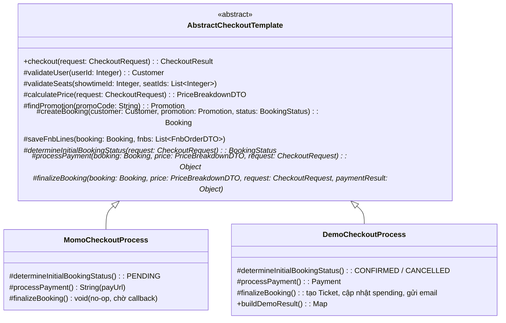
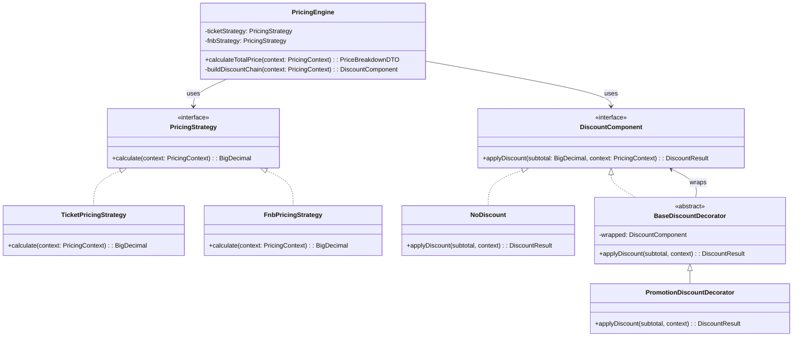
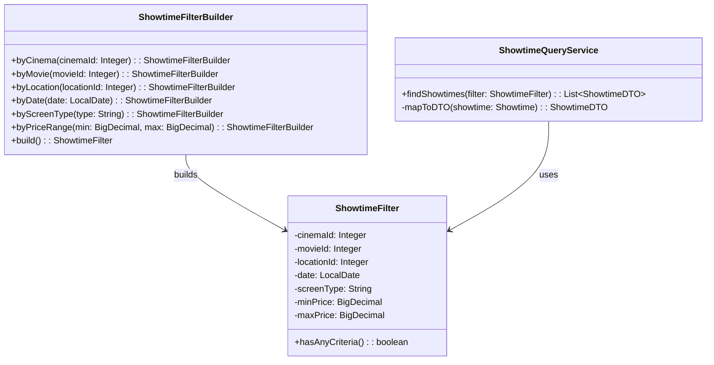
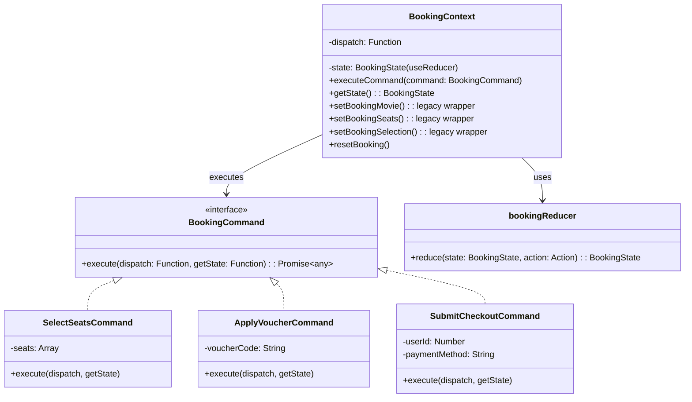
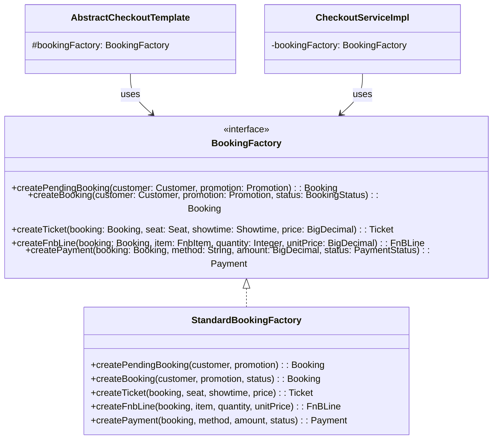

# Refactor Customer Flow — Áp dụng Design Patterns

## Tổng quan

Refactor luồng hoạt động của **Customer** trong hệ thống đặt vé xem phim StarCine, áp dụng các design pattern để cải thiện khả năng mở rộng, bảo trì và tuân thủ SOLID. 

**Phạm vi**: Chỉ tập trung trên luồng **Customer** — KHÔNG bao gồm: Thanh toán (Strategy + Factory), Khóa ghế/trạng thái ghế (State + Adapter), Hậu thanh toán (Observer) vì bạn khác sẽ làm.

**Trạng thái**: ✅ Đã hoàn thành tất cả 5 bước — Backend `mvn compile` ✅ + Frontend `vite build` ✅

---

## Danh sách Design Patterns cần áp dụng

| # | Nghiệp vụ | Design Pattern | Trạng thái |
|---|-----------|---------------|------------|
| 1 | Quy trình đặt vé (Checkout flow) | **Template Method** | ✅ Hoàn thành |
| 2 | Tính giá vé + Áp dụng mã khuyến mãi | **Strategy + Decorator** | ✅ Hoàn thành |
| 3 | Hiển thị danh sách phim theo filter | **Builder** | ✅ Hoàn thành |
| 4 | Quản lý state Frontend (Booking flow) | **Reducer + Command** | ✅ Hoàn thành |
| 5 | Tạo đối tượng Booking, Ticket, DTO | **Factory Method** | ✅ Hoàn thành |

---

## Pattern 1: Template Method — Quy trình đặt vé

### Luồng hoạt động / Nghiệp vụ

Hiện tại `CheckoutServiceImpl` chứa 2 luồng checkout hoàn toàn tách biệt nhưng có **cùng cấu trúc bước**:
1. `createBooking()` — Checkout thật qua MoMo
2. `processDemoCheckout()` — Checkout demo (dev/test)

Cả 2 luồng đều tuần tự: **Validate User → Kiểm tra ghế → Tính giá → Tạo Booking → Lưu F&B → Xử lý thanh toán → Finalize**. Nhưng code đang **duplicate** logic giữa 2 method (~200 dòng trùng lặp), vi phạm DRY và SRP.

**Template Method** giữ khung checkout cố định (các bước chung) và cho phép lớp con override các bước khác biệt (cách xác định trạng thái ban đầu, cách gọi payment gateway, cách finalize).

### Sơ đồ UML



### Cấu trúc Pattern

| Thành phần | Class | Mô tả |
|------------|-------|--------|
| **Abstract Class** | `AbstractCheckoutTemplate` | Chứa method `checkout()` (template method, `final`) định nghĩa luồng 9 bước cố định. Sử dụng `BookingFactory` để tạo entity |
| **Concrete Class 1** | `MomoCheckoutProcess` | Override 3 abstract methods: trạng thái PENDING, gọi MoMo API lấy payUrl, finalize no-op (chờ callback) |
| **Concrete Class 2** | `DemoCheckoutProcess` | Override 3 abstract methods: trạng thái CONFIRMED/CANCELLED, tạo Payment trực tiếp, finalize tạo Ticket + email. Có thêm `buildDemoResult()` trả Map cho controller |

### Danh sách File thay đổi

#### Backend — File mới

| File | Mô tả |
|------|--------|
| `[NEW] services/template_method/checkout/AbstractCheckoutTemplate.java` | Abstract class chứa template method `checkout()` với luồng 9 bước cố định |
| `[NEW] services/template_method/checkout/MomoCheckoutProcess.java` | Concrete class cho luồng thanh toán MoMo thật |
| `[NEW] services/template_method/checkout/DemoCheckoutProcess.java` | Concrete class cho luồng demo checkout |
| `[NEW] dtos/CheckoutRequest.java` | DTO thống nhất input cho checkout (Lombok `@Builder`) |
| `[NEW] dtos/CheckoutResult.java` | DTO thống nhất output từ checkout (Lombok `@Builder`) |

#### Backend — File cần sửa

| File | Thay đổi |
|------|----------|
| `[MODIFY] services/impl/CheckoutServiceImpl.java` | `createBooking()` delegate sang `MomoCheckoutProcess.checkout()`, `processDemoCheckout()` delegate sang `DemoCheckoutProcess.checkout()`. `processMomoCallback()` giữ nguyên logic callback (không thuộc checkout flow) |

### Demo thay đổi

**Sau refactor** — `AbstractCheckoutTemplate.java`:
```java
public abstract class AbstractCheckoutTemplate {
    // Template Method - luồng cố định, KHÔNG cho override
    @Transactional
    public final CheckoutResult checkout(CheckoutRequest request) throws Exception {
        Customer customer = validateUser(request.getUserId());
        validateSeats(request.getShowtimeId(), request.getSeatIds());
        PriceBreakdownDTO price = calculatePrice(request);
        Promotion promotion = findPromotion(request.getPromoCode());
        Booking.BookingStatus initialStatus = determineInitialBookingStatus(request); // abstract
        Booking booking = createBooking(customer, promotion, initialStatus);
        saveFnbLines(booking, request.getFnbs());
        Object paymentResult = processPayment(booking, price, request);             // abstract
        finalizeBooking(booking, price, request, paymentResult);                     // abstract
        return CheckoutResult.builder().booking(booking).price(price).paymentResult(paymentResult).build();
    }
    
    // 3 abstract methods mà subclass phải implement
    protected abstract Booking.BookingStatus determineInitialBookingStatus(CheckoutRequest request);
    protected abstract Object processPayment(Booking booking, PriceBreakdownDTO price, CheckoutRequest request) throws Exception;
    protected abstract void finalizeBooking(Booking booking, PriceBreakdownDTO price, CheckoutRequest request, Object paymentResult);
}
```

---

## Pattern 2: Strategy + Decorator — Tính giá vé + Áp dụng mã khuyến mãi

### Luồng hoạt động / Nghiệp vụ

Hiện tại `BookingServiceImpl.calculateTotalPrice()` tính giá bằng **một method lớn chứa tất cả logic**:
- Tính tiền vé = `base_price + seat_surcharge`  
- Tính tiền F&B = `sum(qty * unit_price)`
- Áp dụng khuyến mãi (`PERCENT` hoặc `FIXED`)
- Giới hạn discount không vượt quá subtotal

**Vấn đề**: Nếu muốn thêm rule mới (VD: giảm giá thành viên, happy hour, combo discount, giảm giá sinh viên), phải sửa trực tiếp vào method này → vi phạm Open/Closed Principle.

**Strategy** tách các cách tính giá thành các strategy riêng biệt (giá vé, giá F&B). **Decorator** cho phép "stack" nhiều lớp giảm giá lên nhau mà KHÔNG sửa code cũ.

### Sơ đồ UML



> [!NOTE]
> `MembershipDiscountDecorator` và `HappyHourDiscountDecorator` được thiết kế là **điểm mở rộng tương lai** — chưa tạo file vì chưa có nghiệp vụ thực tế. Khi cần, chỉ cần tạo class mới extends `BaseDiscountDecorator` và thêm vào chain trong `PricingEngine.buildDiscountChain()`.

### Cấu trúc Pattern

**Strategy pattern:**

| Thành phần | Class | Mô tả |
|------------|-------|--------|
| **Strategy Interface** | `PricingStrategy` | Interface chung: `calculate(PricingContext) → BigDecimal` |
| **Concrete Strategy 1** | `TicketPricingStrategy` | Tính tiền vé: `sum(basePrice + seatSurcharge)` cho mỗi ghế |
| **Concrete Strategy 2** | `FnbPricingStrategy` | Tính tiền F&B: `sum(qty * unitPrice)` cho mỗi item |
| **Context** | `PricingEngine` | Orchestrate các strategy, build discount chain, tạo `PriceBreakdownDTO` |

**Decorator pattern:**

| Thành phần | Class | Mô tả |
|------------|-------|--------|
| **Component** | `DiscountComponent` | Interface: `applyDiscount(subtotal, context) → DiscountResult` |
| **Concrete Component** | `NoDiscount` | Trả về discount = 0 (base case) |
| **Base Decorator** | `BaseDiscountDecorator` | Abstract decorator, giữ reference đến `wrapped` component |
| **Concrete Decorator** | `PromotionDiscountDecorator` | Áp dụng mã khuyến mãi (PERCENT / FIXED) từ bảng `promotions` |

### Danh sách File thay đổi

#### Backend — File mới

| File | Mô tả |
|------|--------|
| `[NEW] services/strategy_decorator/pricing/PricingStrategy.java` | Strategy interface cho tính giá |
| `[NEW] services/strategy_decorator/pricing/TicketPricingStrategy.java` | Strategy tính giá vé |
| `[NEW] services/strategy_decorator/pricing/FnbPricingStrategy.java` | Strategy tính giá F&B |
| `[NEW] services/strategy_decorator/pricing/DiscountComponent.java` | Component interface cho discount |
| `[NEW] services/strategy_decorator/pricing/NoDiscount.java` | Concrete component — không giảm giá |
| `[NEW] services/strategy_decorator/pricing/BaseDiscountDecorator.java` | Abstract decorator |
| `[NEW] services/strategy_decorator/pricing/PromotionDiscountDecorator.java` | Decorator áp dụng mã khuyến mãi |
| `[NEW] services/strategy_decorator/pricing/PricingContext.java` | Context object chứa dữ liệu cần cho tính giá |
| `[NEW] services/strategy_decorator/pricing/DiscountResult.java` | Kết quả trả về từ discount chain |
| `[NEW] services/strategy_decorator/pricing/PricingEngine.java` | Orchestrator: dùng strategy + decorator chain |

#### Backend — File cần sửa

| File | Thay đổi |
|------|----------|
| `[MODIFY] services/impl/BookingServiceImpl.java` | Xóa method `calculateTotalPrice()`, delegate sang `PricingEngine` |

### Demo thay đổi

**Sau refactor** — `PricingEngine.java`:
```java
@Component
public class PricingEngine {
    private final TicketPricingStrategy ticketStrategy;
    private final FnbPricingStrategy fnbStrategy;
    private final PromotionRepository promotionRepository;

    public PriceBreakdownDTO calculateTotalPrice(PricingContext context) {
        BigDecimal ticketTotal = ticketStrategy.calculate(context);
        BigDecimal fnbTotal = fnbStrategy.calculate(context);
        BigDecimal subtotal = ticketTotal.add(fnbTotal);
        
        // Build decorator chain
        DiscountComponent discountChain = buildDiscountChain(context);
        DiscountResult discountResult = discountChain.applyDiscount(subtotal, context);
        
        BigDecimal finalTotal = subtotal.subtract(discountResult.getTotalDiscount());
        if (finalTotal.compareTo(BigDecimal.ZERO) < 0) finalTotal = BigDecimal.ZERO;
        
        return PriceBreakdownDTO.builder()
                .ticketTotal(ticketTotal)
                .fnbTotal(fnbTotal)
                .discountAmount(discountResult.getTotalDiscount())
                .finalTotal(finalTotal)
                .build();
    }
    
    private DiscountComponent buildDiscountChain(PricingContext context) {
        DiscountComponent chain = new NoDiscount();
        if (context.getPromotion() != null) {
            chain = new PromotionDiscountDecorator(chain, context.getPromotion());
        }
        // Mở rộng tương lai: chain = new MembershipDiscountDecorator(chain, membership);
        return chain;
    }
}
```

---

## Pattern 3: Builder — Xây dựng truy vấn lọc suất chiếu (Showtime Filter)

### Luồng hoạt động / Nghiệp vụ

Trên trang **MovieList** và **CinemaDetails**, customer cần lọc phim theo nhiều tiêu chí: thành phố, rạp, ngày chiếu, loại phim. Hiện tại `PublicController` lọc thủ công bằng `stream().filter()` với từng `if` riêng lẻ trong controller — vi phạm SRP.

**Builder Pattern** tạo `ShowtimeFilterBuilder` phía Backend để xây dựng filter object phức tạp theo từng bước (fluent API), và `ShowtimeQueryService` nhận filter đó để truy vấn. Controller chỉ cần build filter rồi gọi service.

### Sơ đồ UML



### Cấu trúc Pattern

| Thành phần | Class | Mô tả |
|------------|-------|--------|
| **Product** | `ShowtimeFilter` | Immutable object chứa tất cả tiêu chí lọc. Constructor package-private, chỉ Builder tạo được |
| **Builder** | `ShowtimeFilterBuilder` | Fluent API để xây dựng `ShowtimeFilter` từng bước. Mỗi method trả về `this` |
| **Director/Service** | `ShowtimeQueryService` | `@Service` nhận `ShowtimeFilter`, áp dụng filter lên stream, trả `List<ShowtimeDTO>` |

### Danh sách File thay đổi

| File | Mô tả |
|------|--------|
| `[NEW] services/builder/filter/ShowtimeFilter.java` | Product — Immutable filter object |
| `[NEW] services/builder/filter/ShowtimeFilterBuilder.java` | Builder — Fluent API |
| `[NEW] services/builder/filter/ShowtimeQueryService.java` | Service sử dụng filter để query, chứa `mapToDTO()` riêng |
| `[MODIFY] controllers/PublicController.java` | Endpoint cũ `/showtimes` dùng Builder thay vì filter thủ công. Thêm endpoint mới `/showtimes/filter` hỗ trợ đầy đủ tiêu chí (locationId, screenType, price range) |

> [!NOTE]
> `ShowtimeRepository.java` **không cần sửa** — filtering được xử lý bằng Java stream trong `ShowtimeQueryService` thay vì custom JPA query, giữ đơn giản và tránh phức tạp hoá repository.

### Demo thay đổi

**Trước** — `PublicController` filter thủ công:
```java
@GetMapping("/showtimes")
public ResponseEntity<List<ShowtimeDTO>> getPublicShowtimes(...) {
    List<ShowtimeDTO> all = showtimeService.getAllShowtimes();
    if (cinemaId != null) {
        all = all.stream().filter(s -> cinemaId.equals(s.getCinemaId())).collect(Collectors.toList());
    }
    if (movieId != null) {
        all = all.stream().filter(s -> movieId.equals(s.getMovieId())).collect(Collectors.toList());
    }
    // ... lặp lại cho mỗi tiêu chí
}
```

**Sau** — Sử dụng Builder:
```java
@GetMapping("/showtimes")
public ResponseEntity<List<ShowtimeDTO>> getPublicShowtimes(...) {
    ShowtimeFilter filter = new ShowtimeFilterBuilder()
        .byCinema(cinemaId)
        .byMovie(movieId)
        .byDate(date != null && !date.isBlank() ? LocalDate.parse(date) : null)
        .build();
    return ResponseEntity.ok(showtimeQueryService.findShowtimes(filter));
}

@GetMapping("/showtimes/filter")  // Endpoint mới, mở rộng
public ResponseEntity<List<ShowtimeDTO>> filterShowtimes(...) {
    ShowtimeFilter filter = new ShowtimeFilterBuilder()
        .byCinema(cinemaId)
        .byMovie(movieId)
        .byDate(date != null && !date.isBlank() ? LocalDate.parse(date) : null)
        .byLocation(locationId)
        .byScreenType(screenType)
        .byPriceRange(minPrice, maxPrice)
        .build();
    return ResponseEntity.ok(showtimeQueryService.findShowtimes(filter));
}
```

---

## Pattern 4: Reducer + Command — Quản lý state Frontend booking flow

### Luồng hoạt động / Nghiệp vụ

`BookingContext.jsx` hiện tại quản lý state bằng `useState` + nhiều setter riêng lẻ (`setMovie`, `setCinema`, `setShowtime`, `setSeats`, `setFnbs`...). Điều này dẫn đến:
- State transition không kiểm soát (có thể set seats mà chưa có showtime)
- Logic thay đổi state nằm rải rác ở 5+ pages khác nhau
- Không có undo/redo, không dễ debug

**Reducer** tạo single source of truth với các action type rõ ràng. **Command** đóng gói mỗi user action thành object có thể tái sử dụng, bao gồm validation logic.

### Sơ đồ UML



> [!NOTE]
> `SelectMovieCommand` và `SelectShowtimeCommand` không tạo riêng vì các pages hiện tại (`Home.jsx`, `MovieList.jsx`, `CinemaDetails.jsx`) sử dụng `setBookingSelection()` (batch set) — đã được wrap thành dispatch action `SET_BOOKING_SELECTION`. Các pages **không bị sửa** — backward compatibility 100% thông qua legacy setter wrappers trong `BookingContext`.

### Cấu trúc Pattern

**Reducer pattern:**

| Thành phần | File | Mô tả |
|------------|------|--------|
| **State + Reducer** | `bookingReducer.js` | Chứa `defaultBookingState` + `bookingReducer()` function với 9 action types |
| **Action Types** | `bookingActionTypes.js` | Constants: `SELECT_MOVIE`, `SELECT_CINEMA`, `SELECT_SHOWTIME`, `SELECT_SEATS`, `SET_FNBS`, `SET_PRICE_BREAKDOWN`, `SET_VOUCHER_CODE`, `SET_BOOKING_SELECTION`, `RESET` |

**Command pattern:**

| Thành phần | File | Mô tả |
|------------|------|--------|
| **Command Interface** | Quy ước: mỗi command là class có method `execute(dispatch, getState)` |
| **Concrete Command 1** | `SelectSeatsCommand.js` | Validate (showtime phải có, seats > 0) → dispatch `SELECT_SEATS` |
| **Concrete Command 2** | `ApplyVoucherCommand.js` | Dispatch `SET_VOUCHER_CODE` → gọi API `calculatePrice` → dispatch `SET_PRICE_BREAKDOWN` |
| **Concrete Command 3** | `SubmitCheckoutCommand.js` | Validate → gọi API checkout MoMo hoặc demo → trả kết quả |

### Danh sách File thay đổi

| File | Mô tả |
|------|--------|
| `[NEW] frontend/src/booking/bookingReducer.js` | Reducer function + initial state |
| `[NEW] frontend/src/booking/bookingActionTypes.js` | Action type constants |
| `[NEW] frontend/src/booking/commands/SelectSeatsCommand.js` | Command chọn ghế |
| `[NEW] frontend/src/booking/commands/ApplyVoucherCommand.js` | Command áp dụng voucher |
| `[NEW] frontend/src/booking/commands/SubmitCheckoutCommand.js` | Command submit checkout |
| `[MODIFY] frontend/src/contexts/BookingContext.jsx` | Chuyển từ `useState` sang `useReducer` + thêm `executeCommand()`. Giữ nguyên 100% API cũ (legacy setters wrap dispatch) |

> [!IMPORTANT]
> Các pages `SeatSelection.jsx`, `SnackSelection.jsx`, `Payment.jsx` **không bị sửa** — tất cả sử dụng legacy setters (`setBookingSeats`, `setBookingSnacks`, `setPriceBreakdown`...) vẫn hoạt động vì chúng đã được wrap thành dispatch actions bên trong `BookingContext`. Các pages có thể migrate sang Command pattern dần dần trong tương lai.

---

## Pattern 5: Factory Method — Tạo đối tượng Booking/Ticket/DTO

### Luồng hoạt động / Nghiệp vụ

Hiện tại việc tạo Booking, Ticket, FnBLine entities được hardcode trực tiếp trong `CheckoutServiceImpl` bằng Builder pattern của Lombok. Code tạo object giống nhau ở nhiều nơi (`createBooking()`, `processDemoCheckout()`, `processMomoCallback()`). Nếu cần thay đổi cách tạo Booking (VD: thêm field mới), phải sửa ở 3+ chỗ.

**Factory Method** đóng gói logic tạo entity vào Factory class chuyên dụng, đảm bảo tính nhất quán.

### Sơ đồ UML



### Cấu trúc Pattern

| Thành phần | Class | Mô tả |
|------------|-------|--------|
| **Factory Interface** | `BookingFactory` | Khai báo 5 factory methods: `createPendingBooking`, `createBooking`, `createTicket`, `createFnbLine`, `createPayment` |
| **Concrete Factory** | `StandardBookingFactory` | `@Component` triển khai cụ thể. `createTicket` nhận explicit `price`, `createPayment` tự set `paidAt` nếu status SUCCESS |
| **Clients** | `AbstractCheckoutTemplate`, `CheckoutServiceImpl`, `DemoCheckoutProcess`, `MomoCheckoutProcess` | Inject `BookingFactory` thay vì trực tiếp gọi Lombok builder |

### Danh sách File thay đổi

| File | Mô tả |
|------|--------|
| `[NEW] services/factory/BookingFactory.java` | Factory interface (5 methods) |
| `[NEW] services/factory/StandardBookingFactory.java` | Concrete factory (`@Component`) |
| `[MODIFY] services/impl/CheckoutServiceImpl.java` | Inject + sử dụng BookingFactory trong callback |
| `[MODIFY] services/template_method/checkout/AbstractCheckoutTemplate.java` | Sử dụng BookingFactory cho `createBooking`, `saveFnbLines` |
| `[MODIFY] services/template_method/checkout/DemoCheckoutProcess.java` | Sử dụng BookingFactory cho `createPayment`, `createTicket` |
| `[MODIFY] services/template_method/checkout/MomoCheckoutProcess.java` | Sử dụng BookingFactory cho `createPayment` |

### Demo thay đổi

**Trước** — Code tạo entity trực tiếp (lặp lại ở 3 chỗ):
```java
Booking booking = Booking.builder().customer(customer).promotion(promotion).status(PENDING)
    .createdAt(LocalDateTime.now()).build();

Ticket ticket = Ticket.builder().booking(booking).seat(seat).showtime(showtime)
    .price(ticketPrice).build();
```

**Sau** — Sử dụng Factory:
```java
Booking booking = bookingFactory.createBooking(customer, promotion, Booking.BookingStatus.PENDING);
Ticket ticket = bookingFactory.createTicket(booking, seat, showtime, ticketPrice);
Payment payment = bookingFactory.createPayment(booking, "MOMO", amount, Payment.PaymentStatus.SUCCESS);
```

---

## Kế hoạch thực hiện (Thứ tự)

> [!IMPORTANT]
> Thứ tự thực hiện đã tối ưu theo dependency: Pattern 5 (Factory) → Pattern 2 (Strategy+Decorator) → Pattern 1 (Template Method) → Pattern 3 (Builder) → Pattern 4 (Reducer+Command)

### Bước 1: Factory Method (Pattern 5) ✅
- Tạo `BookingFactory` interface (5 methods) + `StandardBookingFactory`
- Factory sử dụng Lombok Builder bên trong, client chỉ cần gọi factory method

### Bước 2: Strategy + Decorator (Pattern 2) ✅
- Tạo 10 files trong `services/strategy_decorator/pricing/`
- `PricingEngine` là orchestrator central, build decorator chain dynamically
- `BookingServiceImpl.calculatePrice()` delegate sang `PricingEngine`

### Bước 3: Template Method (Pattern 1) ✅
- Tạo 3 files trong `services/template_method/checkout/` + 2 DTOs
- `CheckoutServiceImpl.createBooking()` → `MomoCheckoutProcess`
- `CheckoutServiceImpl.processDemoCheckout()` → `DemoCheckoutProcess`
- `processMomoCallback()` giữ nguyên (không thuộc checkout flow)

### Bước 4: Builder (Pattern 3) ✅
- Tạo 3 files trong `services/builder/filter/`
- `PublicController` dùng `ShowtimeFilterBuilder` thay vì filter thủ công
- Thêm endpoint `/api/public/showtimes/filter` với đầy đủ 7 tiêu chí

### Bước 5: Reducer + Command (Pattern 4) ✅
- Tạo 5 files trong `frontend/src/booking/`
- `BookingContext.jsx`: `useState` → `useReducer` + `executeCommand()`
- Giữ nguyên 100% legacy API → **không sửa bất kỳ page nào**

---

## Tổng kết File thay đổi

### Backend — 20 files mới + 3 files sửa

| Package | Files | Pattern |
|---------|-------|---------|
| `services/factory/` | `BookingFactory.java`, `StandardBookingFactory.java` | Factory Method |
| `services/strategy_decorator/pricing/` | 10 files (PricingStrategy, Ticket/Fnb Strategy, DiscountComponent, NoDiscount, BaseDiscountDecorator, PromotionDiscountDecorator, PricingContext, DiscountResult, PricingEngine) | Strategy + Decorator |
| `services/template_method/checkout/` | `AbstractCheckoutTemplate.java`, `MomoCheckoutProcess.java`, `DemoCheckoutProcess.java` | Template Method |
| `services/builder/filter/` | `ShowtimeFilter.java`, `ShowtimeFilterBuilder.java`, `ShowtimeQueryService.java` | Builder |
| `dtos/` | `CheckoutRequest.java`, `CheckoutResult.java` | Supporting DTOs |
| **Modified** | `BookingServiceImpl.java`, `CheckoutServiceImpl.java`, `PublicController.java` | Refactored |

### Frontend — 5 files mới + 1 file sửa

| Package | Files | Pattern |
|---------|-------|---------|
| `booking/` | `bookingActionTypes.js`, `bookingReducer.js` | Reducer |
| `booking/commands/` | `SelectSeatsCommand.js`, `ApplyVoucherCommand.js`, `SubmitCheckoutCommand.js` | Command |
| **Modified** | `contexts/BookingContext.jsx` | Reducer + Command |

---

## Verification Plan

### Automated Tests
- ✅ Backend build thành công: `mvn clean compile` — 0 errors
- ✅ Frontend build thành công: `npm run build` — 0 errors, 2606 modules transformed
- Kiểm tra API `/api/booking/calculate` trả về kết quả đúng
- Kiểm tra API `/api/public/showtimes/filter` với các params

### Manual Verification
- Chạy full flow: Trang chủ → Chọn phim → Chọn rạp → Chọn ghế → Chọn bắp nước → Thanh toán → Xác nhận
- Test áp dụng mã khuyến mãi ở trang Payment
- Đảm bảo không regression trên giao diện và chức năng hiện tại
