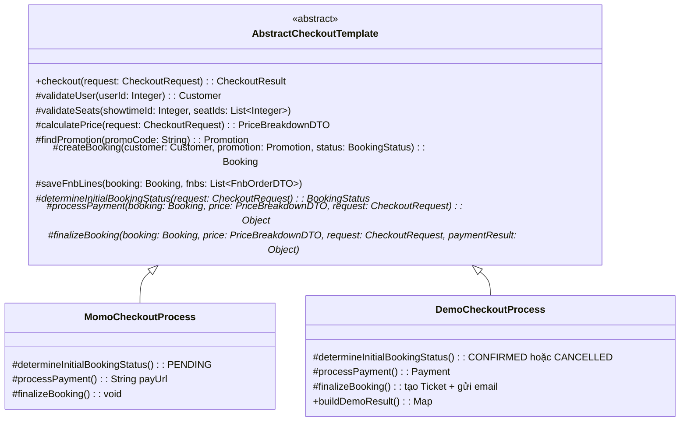
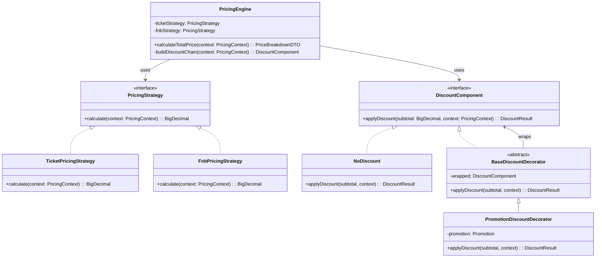
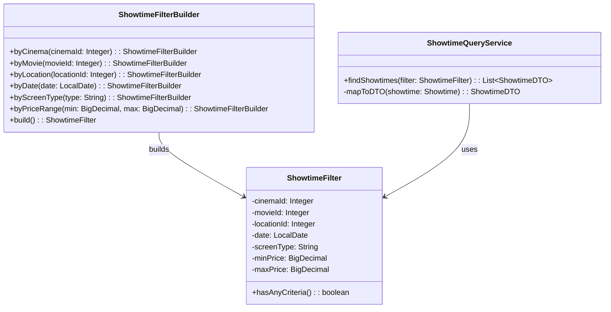
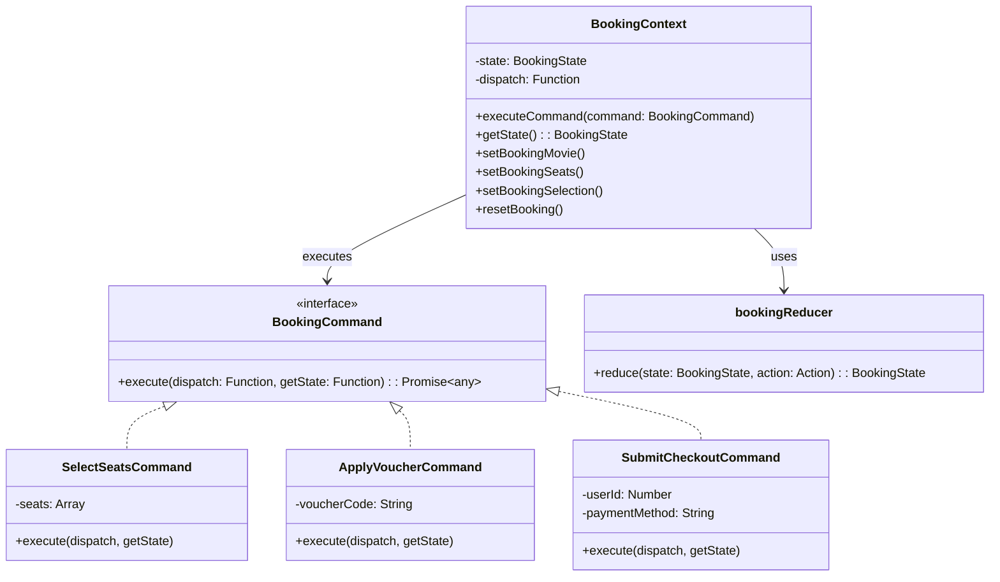
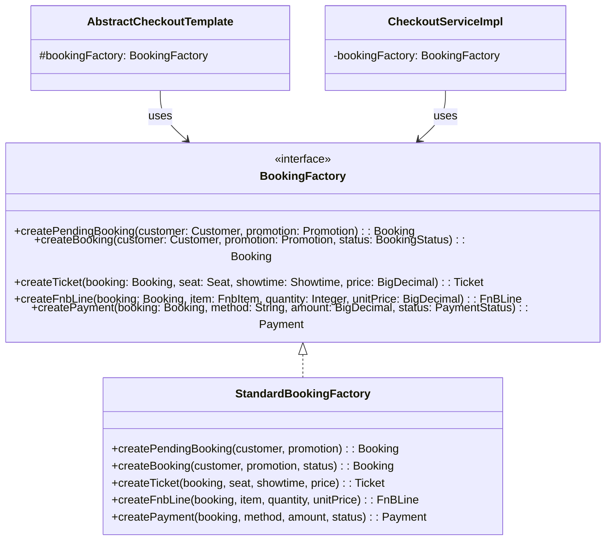

# Báo Cáo Áp Dụng Design Patterns — Luồng Customer

**Dự án**: StarCine — Hệ thống đặt vé xem phim  
**Phạm vi refactor**: Luồng hoạt động của **Customer** (Xem phim → Chọn rạp → Chọn ghế → Chọn bắp nước → Thanh toán)

---

## Tổng quan các Design Patterns đã áp dụng

| # | Nghiệp vụ | Design Pattern | Vị trí |
|---|-----------|---------------|--------|
| 1 | Quy trình đặt vé (Checkout flow) | **Template Method** | Backend |
| 2 | Tính giá vé + Áp dụng mã khuyến mãi | **Strategy + Decorator** | Backend |
| 3 | Lọc suất chiếu theo nhiều tiêu chí | **Builder** | Backend |
| 4 | Quản lý trạng thái đặt vé Frontend | **Reducer + Command** | Frontend |
| 5 | Tạo đối tượng Booking, Ticket, Payment | **Factory Method** | Backend |

---

## 1. Template Method — Quy trình đặt vé (Checkout Flow)

### 1.1. Luồng nghiệp vụ áp dụng

Hệ thống StarCine có **2 luồng thanh toán** khi customer đặt vé:

- **Luồng MoMo**: Customer chọn ghế → Chọn bắp nước → Nhấn thanh toán → Hệ thống tạo Booking PENDING → Gọi MoMo API lấy link thanh toán → Customer thanh toán trên MoMo → MoMo callback về hệ thống → Xác nhận vé + Gửi email.
- **Luồng Demo** (dùng cho dev/test): Tương tự nhưng bỏ qua bước gọi MoMo, xử lý trực tiếp trong hệ thống → Tạo Booking CONFIRMED ngay → Tạo vé + Gửi email.

Cả 2 luồng đều tuần tự qua **9 bước giống nhau**: Validate User → Kiểm tra ghế → Tính giá → Tìm mã khuyến mãi → Xác định trạng thái Booking → Tạo Booking → Lưu F&B → Xử lý thanh toán → Finalize. Tuy nhiên code cũ **duplicate ~200 dòng** giữa 2 method `createBooking()` và `processDemoCheckout()` trong `CheckoutServiceImpl.java`.

### 1.2. Lí do chọn Template Method

| Vấn đề trước refactor | Giải pháp Template Method |
|------------------------|---------------------------|
| 2 method có cấu trúc giống nhau nhưng code bị duplicate hoàn toàn | Tách phần **khung chung** (9 bước) vào abstract class, chỉ override phần **khác biệt** |
| Nếu thêm luồng checkout mới (VD: ZaloPay, VNPay), phải copy-paste lại toàn bộ logic | Chỉ cần tạo class mới kế thừa `AbstractCheckoutTemplate`, override 3 abstract methods |
| Sửa 1 bước chung (VD: thay đổi validate) phải sửa ở cả 2 method | Sửa 1 lần duy nhất ở abstract class, tất cả luồng đều được cập nhật |
| Vi phạm **DRY** (Don't Repeat Yourself) và **SRP** (Single Responsibility Principle) | Mỗi class chỉ chịu trách nhiệm cho 1 luồng thanh toán cụ thể |

### 1.3. Sơ đồ UML



### 1.4. Ưu điểm khi áp dụng

1. **Loại bỏ code trùng lặp**: Giảm từ ~400 dòng (2 × 200) xuống còn ~140 dòng abstract class + ~60 dòng mỗi subclass. Tổng tiết kiệm ~40% code.
2. **Tuân thủ Open/Closed Principle**: Khi cần thêm luồng thanh toán mới (VD: `ZaloPayCheckoutProcess`), chỉ cần tạo class mới kế thừa `AbstractCheckoutTemplate` và override 3 method — **không sửa bất kỳ code cũ nào**.
3. **Đảm bảo tính nhất quán**: Method `checkout()` được đánh dấu `final`, đảm bảo mọi luồng checkout đều tuân theo đúng 9 bước đã định — không có subclass nào có thể bỏ qua bước validate hay tính giá.
4. **Dễ bảo trì**: Khi cần thay đổi logic chung (VD: thêm bước kiểm tra số dư), chỉ sửa 1 lần ở `AbstractCheckoutTemplate` → tất cả luồng MoMo, Demo đều tự động được cập nhật.

---

## 2. Strategy + Decorator — Tính giá vé + Áp dụng mã khuyến mãi

### 2.1. Luồng nghiệp vụ áp dụng

Khi customer chọn ghế và bắp nước, hệ thống cần tính tổng giá tiền theo công thức:

```
Tiền vé     = Σ (giá_cơ_bản + phụ_thu_loại_ghế)    cho mỗi ghế
Tiền F&B    = Σ (số_lượng × đơn_giá)                cho mỗi sản phẩm bắp nước
Subtotal    = Tiền vé + Tiền F&B
Giảm giá    = Áp dụng mã khuyến mãi (theo % hoặc số tiền cố định)
Tổng cộng   = Subtotal - Giảm giá (không âm)
```

Code cũ trong `BookingServiceImpl.calculateTotalPrice()` gộp **tất cả logic** (tính vé, tính F&B, áp mã giảm giá, clamp) vào **1 method duy nhất ~50 dòng**. Nếu muốn thêm chính sách giảm giá mới (giảm giá thành viên, giảm giá Happy Hour, combo discount), phải sửa trực tiếp method đó.

### 2.2. Lí do chọn Strategy + Decorator

**Tại sao Strategy?**

| Vấn đề | Giải pháp Strategy |
|--------|-------------------|
| Logic tính tiền vé và tính tiền F&B khác nhau hoàn toàn nhưng nằm chung 1 method | Tách thành 2 strategy riêng biệt: `TicketPricingStrategy` (tính vé) và `FnbPricingStrategy` (tính F&B) |
| Nếu muốn thay đổi cách tính vé (VD: vé IMAX tính khác), phải sửa cả method lớn | Chỉ cần sửa hoặc tạo strategy mới cho loại vé đó |
| Vi phạm **Single Responsibility Principle** — 1 method làm quá nhiều việc | Mỗi strategy chỉ lo 1 nhiệm vụ duy nhất |

**Tại sao Decorator?**

| Vấn đề | Giải pháp Decorator |
|--------|---------------------|
| Các chính sách giảm giá hiện tại dùng `if/else` lồng nhau | Mỗi loại giảm giá là 1 decorator, có thể "stack" (xếp chồng) nhiều lớp |
| Muốn thêm loại giảm giá mới phải sửa code cũ → vi phạm **Open/Closed Principle** | Chỉ cần tạo class decorator mới, thêm vào chain — **không sửa code cũ** |
| Không thể kết hợp nhiều loại giảm giá cùng lúc 1 cách linh hoạt | Decorator chain cho phép: `Promotion → Membership → HappyHour` — mỗi lớp cộng dồn discount |

### 2.3. Sơ đồ UML



### 2.4. Ưu điểm khi áp dụng

1. **Tách biệt rõ ràng concern**: Logic tính vé (`TicketPricingStrategy`) và tính F&B (`FnbPricingStrategy`) nằm ở 2 class riêng — dễ đọc, dễ test, dễ sửa độc lập.
2. **Mở rộng giảm giá không giới hạn**: Khi cần thêm chính sách giảm giá mới (VD: giảm giá thành viên VIP, giảm giá ngày lễ), chỉ cần tạo 1 class mới extends `BaseDiscountDecorator` và thêm 1 dòng vào `buildDiscountChain()` — **không sửa code cũ**.
3. **Kết hợp linh hoạt**: Decorator chain cho phép áp dụng nhiều loại giảm giá đồng thời, mỗi lớp cộng dồn kết quả. VD: Khách VIP dùng mã khuyến mãi vào giờ vàng → 3 decorator stack lên nhau.
4. **Dễ test**: Có thể test từng strategy và từng decorator riêng lẻ với unit test, không cần setup toàn bộ context. `NoDiscount` là base case rõ ràng.

---

## 3. Builder — Lọc suất chiếu theo nhiều tiêu chí

### 3.1. Luồng nghiệp vụ áp dụng

Trên trang **Danh sách phim** (`MovieList.jsx`) và **Chi tiết rạp** (`CinemaDetails.jsx`), customer có thể lọc suất chiếu theo nhiều tiêu chí kết hợp:

- **Theo rạp**: Customer chọn 1 cụm rạp cụ thể (VD: StarCine Hà Nội)
- **Theo phim**: Xem lịch chiếu của 1 phim cụ thể
- **Theo ngày**: Lọc suất chiếu trong ngày cụ thể
- **Theo tỉnh/thành**: Chỉ xem rạp ở thành phố đã chọn
- **Theo loại màn hình**: 2D, 3D, IMAX
- **Theo khoảng giá**: Lọc suất chiếu trong tầm giá mong muốn

Code cũ trong `PublicController.getPublicShowtimes()` xử lý bằng chuỗi `if` riêng lẻ: lấy toàn bộ showtimes → `if (cinemaId != null) stream.filter(...)` → `if (movieId != null) stream.filter(...)` → ... Controller vừa nhận request vừa chứa logic filter — vi phạm SRP.

### 3.2. Lí do chọn Builder

| Vấn đề trước refactor | Giải pháp Builder |
|------------------------|-------------------|
| Controller chứa logic filter lồng nhau, khó đọc | Tách filter object ra riêng, Controller chỉ cần build filter rồi gọi service |
| Muốn thêm tiêu chí lọc mới phải thêm `if` vào controller | Thêm method mới vào Builder + logic filter vào Service — **không sửa controller** |
| Nếu có 7 tiêu chí, constructor sẽ cần 7 tham số — dễ nhầm thứ tự | Builder dùng fluent API: `.byCinema(1).byDate(today).build()` — rõ ràng, không nhầm |
| Không thể tái sử dụng bộ filter ở nơi khác (VD: API admin, report) | `ShowtimeFilter` là immutable object, có thể truyền đi bất kỳ đâu |

### 3.3. Sơ đồ UML



### 3.4. Ưu điểm khi áp dụng

1. **Fluent API dễ đọc**: Code build filter rõ ràng hơn so với chuỗi `if`:
   ```java
   // Trước: 15 dòng if/filter/collect lộn xộn
   // Sau:
   ShowtimeFilter filter = new ShowtimeFilterBuilder()
       .byCinema(1).byDate(LocalDate.now()).byScreenType("IMAX").build();
   ```
2. **Immutable Product**: `ShowtimeFilter` là immutable — sau khi build xong không thể thay đổi. An toàn khi truyền qua nhiều tầng service mà không lo bị sửa đổi ngoài ý muốn.
3. **Tách biệt trách nhiệm**: Controller chỉ nhận request + build filter, `ShowtimeQueryService` chịu trách nhiệm logic lọc — tuân thủ **SRP**.
4. **Mở rộng dễ dàng**: Khi cần thêm tiêu chí lọc mới (VD: lọc theo thể loại phim, lọc theo rating), chỉ cần thêm field vào `ShowtimeFilter`, method mới vào Builder, và logic filter vào Service.

---

## 4. Reducer + Command — Quản lý trạng thái đặt vé ở Frontend

### 4.1. Luồng nghiệp vụ áp dụng

Luồng đặt vé trên Frontend trải qua **5 bước** với state liên quan chặt chẽ:

```
Bước 1: Chọn phim      → state: selectedMovie
Bước 2: Chọn rạp/suất  → state: selectedCinema, selectedShowtime
Bước 3: Chọn ghế ngồi  → state: selectedSeats[]
Bước 4: Chọn bắp nước  → state: selectedFnbs[]
Bước 5: Thanh toán      → state: priceBreakdown, voucherCode
```

Code cũ trong `BookingContext.jsx` dùng **7 useState hooks** riêng lẻ + **9 useCallback setters** (`setMovie`, `setCinema`, `setShowtime`, `setSeats`, `setFnbs`, `setPriceBreakdown`, `setVoucherCode`, `setBookingSelection`, `resetBooking`). Các setter này được gọi rải rác ở 5+ pages — bất kỳ page nào cũng có thể set bất kỳ state nào mà không có validation (VD: set seats khi chưa chọn showtime).

### 4.2. Lí do chọn Reducer + Command

**Tại sao Reducer?**

| Vấn đề | Giải pháp Reducer |
|--------|-------------------|
| 7 useState riêng lẻ → state transition phân tán, khó kiểm soát | **1 useReducer duy nhất** quản lý toàn bộ state, mọi thay đổi đều qua `dispatch(action)` |
| Không biết state thay đổi ở đâu, tại sao | Mỗi action có `type` rõ ràng (`SELECT_MOVIE`, `SELECT_SEATS`...) → dễ trace/debug |
| State có thể bị set không đúng thứ tự (set seats trước showtime) | Reducer có thể thêm validation logic tập trung |
| Khó test logic chuyển đổi state | Reducer là **pure function** — dễ viết unit test |

**Tại sao Command?**

| Vấn đề | Giải pháp Command |
|--------|-------------------|
| Logic phức tạp (validate + gọi API + dispatch) nằm trực tiếp trong page components | Đóng gói thành **Command objects** — mỗi command chứa logic + validation riêng |
| Cùng 1 hành động (VD: áp voucher) cần thực hiện ở nhiều nơi → duplicate logic | Command là object tái sử dụng: `executeCommand(new ApplyVoucherCommand("CODE"))` |
| Logic business nằm trong UI components → vi phạm **SRP** | Command tách business logic ra khỏi component — component chỉ gọi `executeCommand()` |

### 4.3. Sơ đồ UML



### 4.4. Ưu điểm khi áp dụng

1. **Single source of truth**: Toàn bộ booking state nằm trong 1 useReducer duy nhất — không còn 7 useState riêng lẻ. Mọi thay đổi đều qua `dispatch(action)` với action type rõ ràng.
2. **Command đóng gói logic phức tạp**: `ApplyVoucherCommand` đóng gói: validate → dispatch voucher code → gọi API tính giá → dispatch kết quả. Page component chỉ cần 1 dòng: `executeCommand(new ApplyVoucherCommand("CODE"))`.
3. **Tái sử dụng Cross-page**: Command objects có thể dùng ở bất kỳ page nào — không duplicate logic. VD: `SubmitCheckoutCommand` có thể gọi từ `Payment.jsx` hoặc bất kỳ component nào khác.
4. **Backward compatible 100%**: Tất cả legacy setters (`setBookingMovie`, `setBookingSeats`...) vẫn hoạt động — chúng được wrap thành dispatch actions bên trong. Các pages hiện tại **không cần sửa gì**, có thể migrate dần sang Command pattern.
5. **Dễ debug**: Mỗi state transition có action type cụ thể, có thể log tất cả actions ra console để trace flow.

---

## 5. Factory Method — Tạo đối tượng Booking, Ticket, Payment

### 5.1. Luồng nghiệp vụ áp dụng

Trong quá trình checkout, hệ thống cần **tạo nhiều entity** liên quan:

- **Booking**: Đơn đặt vé tổng (chứa thông tin customer, promotion, trạng thái)
- **Ticket**: Vé cho từng ghế (chứa thông tin ghế, suất chiếu, giá vé)
- **FnBLine**: Dòng đặt bắp nước (chứa sản phẩm, số lượng, đơn giá)
- **Payment**: Bản ghi thanh toán (chứa phương thức, số tiền, trạng thái)

Code cũ tạo entity bằng Lombok Builder trực tiếp: `Booking.builder().customer(c).status(PENDING).createdAt(now).build()` — **lặp lại ở 3+ chỗ**: `createBooking()`, `processDemoCheckout()`, `processMomoCallback()`. Nếu Booking thêm field mới (VD: `source`, `channel`), phải sửa ở tất cả 3 chỗ.

### 5.2. Lí do chọn Factory Method

| Vấn đề trước refactor | Giải pháp Factory Method |
|------------------------|--------------------------|
| Code tạo Booking lặp lại ở 3 method — thêm field mới phải sửa 3 chỗ | Tập trung tạo entity ở 1 nơi duy nhất: `BookingFactory` |
| Không có điểm tập trung để thêm logic khởi tạo (VD: auto-set `createdAt`) | Factory tự động set `createdAt(LocalDateTime.now())`, `paidAt` khi status SUCCESS |
| Khó thay đổi cách tạo entity cho từng loại người dùng (VD: Staff, Admin) | Tạo `StaffBookingFactory` riêng implements cùng interface — **đa hình** |
| Vi phạm **DRY** — duplicate code tạo object | Factory method loại bỏ hoàn toàn duplicate |

### 5.3. Sơ đồ UML



### 5.4. Ưu điểm khi áp dụng

1. **Tập trung logic khởi tạo**: Tất cả entity (Booking, Ticket, FnBLine, Payment) được tạo từ 1 factory duy nhất — thêm field mới chỉ sửa 1 chỗ, tránh sót.
2. **Encapsulation**: Client (CheckoutServiceImpl, AbstractCheckoutTemplate) không cần biết chi tiết cách tạo entity. VD: `createPayment()` tự động set `paidAt = now()` khi status SUCCESS — client không cần lo.
3. **Hỗ trợ mở rộng đa hình**: Nếu sau này có luồng đặt vé khác (VD: staff đặt vé tại quầy cần thêm field `staffId`), chỉ cần tạo `StaffBookingFactory` implements cùng `BookingFactory` interface — code checkout không đổi.
4. **Kết hợp tốt với Template Method**: `AbstractCheckoutTemplate` nhận `BookingFactory` qua constructor injection. Tất cả subclass (MomoCheckoutProcess, DemoCheckoutProcess) đều dùng chung factory — đảm bảo entity được tạo nhất quán dù luồng checkout khác nhau.
5. **Tuân thủ SOLID**: Interface Segregation (factory interface định nghĩa rõ contract), Dependency Inversion (depend on abstraction `BookingFactory`, không depend on concrete `StandardBookingFactory`).
