# UML — Dynamic Pricing Engine (domain subset + 5 patterns)

> **classdiagram.md** (tham chiếu domain gốc) + **docs/patterns/08-dynamic-pricing-engine.md** — Specification, Strategy, Decorator, Chain of Responsibility (validation), Proxy (Redis cache).

Tham chiếu domain đầy đủ: [classdiagram.md](../classdiagram.md).  
Tài liệu giải thích: [08-dynamic-pricing-engine.md](../docs/patterns/08-dynamic-pricing-engine.md).

```mermaid
classDiagram
    direction TB

    %% ═══════════════════════════════════════════════════════════════════
    %% DOMAIN ENTITIES (relevant subset — từ classdiagram.md gốc)
    %% ═══════════════════════════════════════════════════════════════════

    class Showtime {
        +Integer showtimeId
        +LocalDateTime startTime
        +BigDecimal basePrice
        +Room room
    }
    class Seat {
        +Integer seatId
        +String seatCode
        +SeatType seatType
    }
    class SeatType {
        +String name
        +BigDecimal priceSurcharge
    }
    class Customer {
        +Integer customerId
        +String fullName
        +MembershipTier tier
    }
    class MembershipTier {
        +String tierName
        +int discountPercent
    }
    class Promotion {
        +String code
        +String discountType
        +BigDecimal discountValue
        +LocalDate validTo
    }
    class BookingCalculationDTO {
        +Integer showtimeId
        +List~Integer~ seatIds
        +List~FnbItemQtyDTO~ fnbItems
        +String promoCode
    }
    class PriceBreakdownDTO {
        +BigDecimal ticketTotal
        +BigDecimal occupancySurcharge
        +BigDecimal fnbTotal
        +BigDecimal membershipDiscount
        +BigDecimal discountAmount
        +BigDecimal finalTotal
        +String appliedStrategy
    }

    %% ═══════════════════════════════════════════════════════════════════
    %% PHASE 0 — Context & Specification
    %% ═══════════════════════════════════════════════════════════════════

    class PricingContext {
        +Showtime showtime
        +List~Seat~ seats
        +Customer customer
        +Promotion promotion
        +BigDecimal fnbTotal
        +int bookedSeatsCount
        +int totalSeatsCount
        +LocalDateTime bookingTime
    }

    class PricingContextFactory {
        <<component>>
        +build(BookingCalculationDTO) PricingContext
        +build(BookingCalculationDTO, Long userId) PricingContext
    }

    class PricingConditions {
        <<utility>>
        +isWeekend()$ Predicate
        +isHoliday()$ Predicate
        +isEarlyBird()$ Predicate
        +isHighOccupancy()$ Predicate
    }

    %% ═══════════════════════════════════════════════════════════════════
    %% PHASE 1 — Strategy Pattern
    %% ═══════════════════════════════════════════════════════════════════

    class PricingStrategy {
        <<interface>>
        +adjustBasePrice(BigDecimal, PricingContext) BigDecimal
        +isApplicable(PricingContext) boolean
        +priority() int
        +name() String
    }

    class StandardPricingStrategy {
        +priority() int
        +name() String
    }

    class WeekendPricingStrategy {
        -int weekendSurchargePct
        +priority() int
        +name() String
    }

    class HolidayPricingStrategy {
        -int holidaySurchargePct
        +priority() int
        +name() String
    }

    class EarlyBirdPricingStrategy {
        -int earlyBirdDiscountPct
        +priority() int
        +name() String
    }

    class PricingStrategySelector {
        <<component>>
        -List~PricingStrategy~ strategies
        +select(PricingContext) PricingStrategy
    }

    %% ═══════════════════════════════════════════════════════════════════
    %% PHASE 2 — Decorator Pattern
    %% ═══════════════════════════════════════════════════════════════════

    class PriceCalculator {
        <<interface>>
        +calculate(PricingContext) PricingAccumulator
    }

    class PricingAccumulator {
        +BigDecimal ticketTotal
        +BigDecimal occupancySurcharge
        +BigDecimal fnbTotal
        +BigDecimal membershipDiscount
        +BigDecimal voucherDiscount
        +String appliedStrategy
        +subtotal() BigDecimal
        +totalDiscount() BigDecimal
        +finalTotal() BigDecimal
        +toDTO() PriceBreakdownDTO
    }

    class BasePriceCalculator {
        <<component>>
        -PricingStrategySelector selector
        +calculate(PricingContext) PricingAccumulator
    }

    class AbstractPriceCalculatorDecorator {
        <<abstract>>
        -PriceCalculator inner
        +calculate(PricingContext) PricingAccumulator
        #decorate(PricingAccumulator, PricingContext)*
    }

    class OccupancyDecorator {
        -int occupancySurchargePct
        #decorate(PricingAccumulator, PricingContext)
    }

    class FnbDecorator {
        #decorate(PricingAccumulator, PricingContext)
    }

    class MemberDiscountDecorator {
        #decorate(PricingAccumulator, PricingContext)
    }

    class VoucherDecorator {
        #decorate(PricingAccumulator, PricingContext)
    }

    class PriceCalculatorChainFactory {
        <<component>>
        +build() PriceCalculator
    }

    %% ═══════════════════════════════════════════════════════════════════
    %% PHASE 3 — Chain of Responsibility (Validation)
    %% ═══════════════════════════════════════════════════════════════════

    class PriceValidationHandler {
        <<interface>>
        +setNext(PriceValidationHandler)
        +validate(PriceValidationContext)
    }

    class AbstractPriceValidationHandler {
        <<abstract>>
        -PriceValidationHandler next
        +validate(PriceValidationContext)
        #doValidate(PriceValidationContext)*
    }

    class MinPriceHandler {
        #doValidate(PriceValidationContext)
    }

    class MaxDiscountHandler {
        #doValidate(PriceValidationContext)
    }

    class FraudDetectionHandler {
        -BigDecimal MIN_PRICE_PER_SEAT
        #doValidate(PriceValidationContext)
    }

    class PriceValidationContext {
        +BigDecimal subtotal
        +BigDecimal totalDiscount
        +BigDecimal finalTotal
        +int seatCount
    }

    class PriceValidationChainConfig {
        <<configuration>>
        +priceValidationChain() PriceValidationHandler
    }

    %% ═══════════════════════════════════════════════════════════════════
    %% PHASE 4-5 — Service & Proxy
    %% ═══════════════════════════════════════════════════════════════════

    class DynamicPricingService {
        <<interface>>
        +calculatePrice(BookingCalculationDTO) PriceBreakdownDTO
    }

    class DynamicPricingServiceImpl {
        <<service>>
        -PricingContextFactory contextFactory
        -PriceCalculatorChainFactory chainFactory
        -PriceValidationHandler validationChain
        +calculatePrice(BookingCalculationDTO) PriceBreakdownDTO
    }

    class CachingDynamicPricingProxy {
        <<proxy-primary>>
        -DynamicPricingService delegate
        -RedisTemplate redisTemplate
        +calculatePrice(BookingCalculationDTO) PriceBreakdownDTO
        #cacheGet(String) Object
        #cachePut(String, PriceBreakdownDTO)
        -buildCacheKey(BookingCalculationDTO) String
        -resolveUserId() String
    }

    class BookingServiceImpl {
        <<service>>
        -DynamicPricingService dynamicPricingService
        +calculatePrice(BookingCalculationDTO) PriceBreakdownDTO
    }

    %% ═══════════════════════════════════════════════════════════════════
    %% RELATIONSHIPS
    %% ═══════════════════════════════════════════════════════════════════

    %% Domain relationships
    Seat --> SeatType
    Customer --> MembershipTier

    %% Context relationships
    PricingContext o-- Showtime : contains
    PricingContext o-- Seat : contains list
    PricingContext o-- Customer : nullable
    PricingContext o-- Promotion : nullable
    PricingContextFactory --> PricingContext : builds
    PricingContextFactory ..> BookingCalculationDTO : reads

    %% Specification usage
    PricingConditions ..> PricingContext : evaluates

    %% Strategy relationships
    PricingStrategy <|.. StandardPricingStrategy
    PricingStrategy <|.. WeekendPricingStrategy
    PricingStrategy <|.. HolidayPricingStrategy
    PricingStrategy <|.. EarlyBirdPricingStrategy
    PricingStrategySelector o-- PricingStrategy : selects from list
    WeekendPricingStrategy ..> PricingConditions : uses isWeekend
    HolidayPricingStrategy ..> PricingConditions : uses isHoliday
    EarlyBirdPricingStrategy ..> PricingConditions : uses isEarlyBird

    %% Decorator relationships
    PriceCalculator <|.. BasePriceCalculator
    PriceCalculator <|.. AbstractPriceCalculatorDecorator
    AbstractPriceCalculatorDecorator <|-- OccupancyDecorator
    AbstractPriceCalculatorDecorator <|-- FnbDecorator
    AbstractPriceCalculatorDecorator <|-- MemberDiscountDecorator
    AbstractPriceCalculatorDecorator <|-- VoucherDecorator
    AbstractPriceCalculatorDecorator o-- PriceCalculator : inner
    BasePriceCalculator --> PricingStrategySelector : uses
    BasePriceCalculator --> PricingAccumulator : creates
    PricingAccumulator --> PriceBreakdownDTO : toDTO
    PriceCalculatorChainFactory --> PriceCalculator : builds chain
    OccupancyDecorator ..> PricingConditions : uses isHighOccupancy
    MemberDiscountDecorator ..> MembershipTier : reads discountPercent
    VoucherDecorator ..> Promotion : reads discountType + value

    %% CoR Validation relationships
    PriceValidationHandler <|.. AbstractPriceValidationHandler
    AbstractPriceValidationHandler <|-- MinPriceHandler
    AbstractPriceValidationHandler <|-- MaxDiscountHandler
    AbstractPriceValidationHandler <|-- FraudDetectionHandler
    AbstractPriceValidationHandler o-- PriceValidationHandler : next
    PriceValidationChainConfig --> PriceValidationHandler : assembles chain

    %% Service & Proxy relationships
    DynamicPricingService <|.. DynamicPricingServiceImpl
    DynamicPricingService <|.. CachingDynamicPricingProxy
    CachingDynamicPricingProxy --> DynamicPricingService : delegates to impl
    DynamicPricingServiceImpl --> PricingContextFactory : uses
    DynamicPricingServiceImpl --> PriceCalculatorChainFactory : uses
    DynamicPricingServiceImpl --> PriceValidationHandler : uses
    DynamicPricingServiceImpl --> PriceValidationContext : creates
    BookingServiceImpl --> DynamicPricingService : injects via @Primary
```

