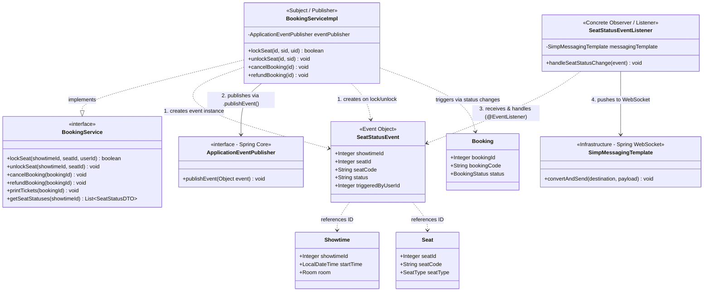

# UML — Real-time Seat Synchronization (Observer Pattern)

> **classdiagram.md** (tham chiếu domain gốc) + **patterns/observer**

Hệ thống sử dụng **Observer Pattern** (dưới dạng Event-Driven của Spring Framework) kết hợp với **WebSocket (STOMP)** để đồng bộ trạng thái ghế theo thời gian thực giữa các quầy POS của nhân viên.

### Phân tích quan hệ trong Class Diagram:

1.  **Mối quan hệ 1-N (Implicit):** `ApplicationEventPublisher` quản lý danh sách các Listener (Observers) một cách tiềm ẩn (Loose Coupling). `BookingServiceImpl` không cần biết có bao nhiêu Listener đang nghe, nó chỉ việc phát sự kiện.
2.  **Mối quan hệ Dependency (..>):** `BookingServiceImpl` phụ thuộc vào `SeatStatusEvent` để đóng gói dữ liệu trạng thái trước khi phát đi.
3.  **Mối quan hệ Association (-->):** `SeatStatusEventListener` duy trì một tham chiếu đến `SimpMessagingTemplate` để có thể đẩy dữ liệu xuống WebSocket ngay khi nhận được sự kiện.
4.  **Tính đóng gói (Encapsulation):** `SeatStatusEvent` là một Data Object bất biến (Immutable), đảm bảo dữ liệu không bị thay đổi trong quá trình truyền dẫn giữa các Observer.
