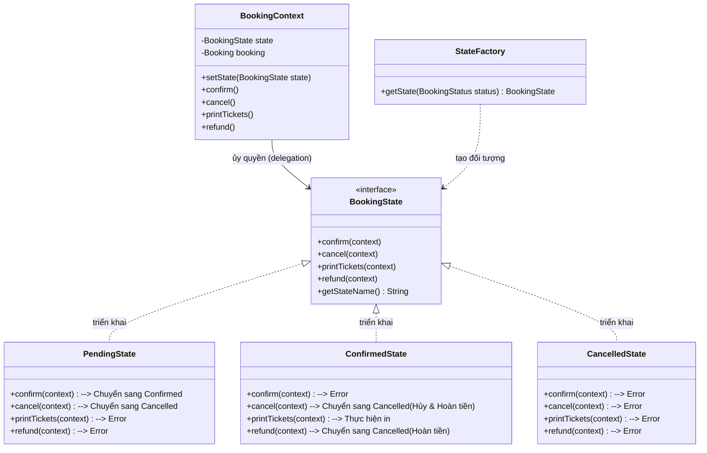
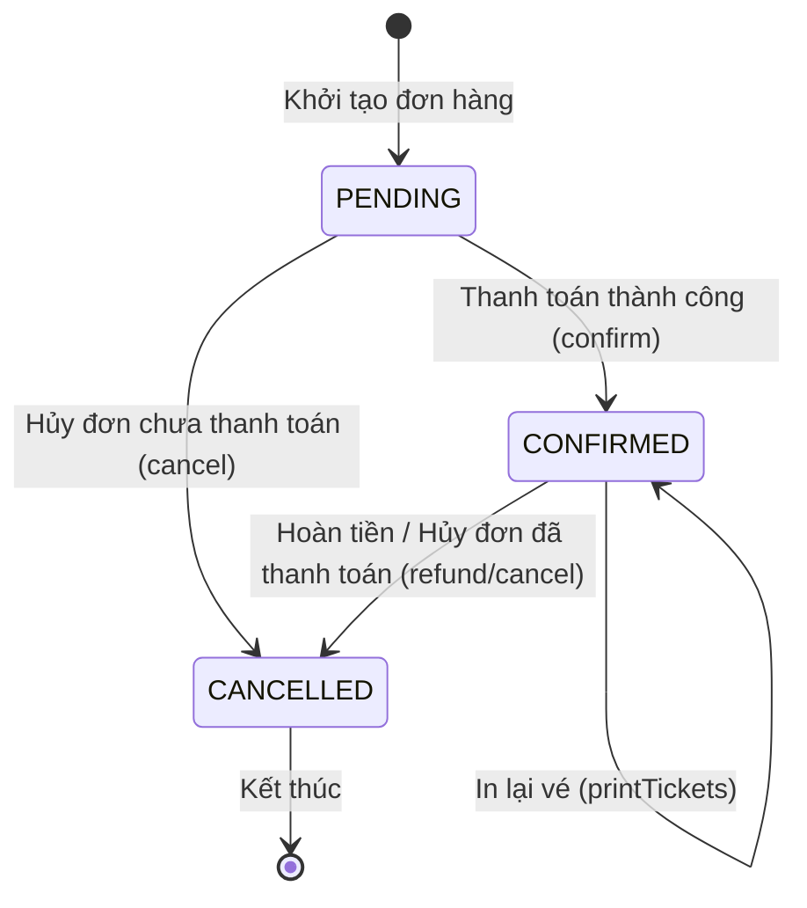

# State Design Pattern - Booking Flow

Mặc dù chúng ta đã tối giản hóa trạng thái `REFUNDED` vào `CANCELLED` để phù hợp với giới hạn của Database hiện tại, State Design Pattern vẫn đang phát huy hiệu quả cực kỳ tốt trong việc quản lý logic nghiệp vụ phức tạp.

## 1. Tại sao vẫn hiệu quả?
*   **Tính đóng gói (Encapsulation)**: Mỗi trạng thái (`Pending`, `Confirmed`, `Cancelled`) tự quản lý hành vi của chính nó. Ví dụ: `PendingState` sẽ báo lỗi nếu cố tình in vé, trong khi `ConfirmedState` thì cho phép.
*   **Kiểm soát chuyển đổi**: Pattern này ngăn chặn các hành động phi logic (ví dụ: không thể xác nhận một đơn hàng đã hủy).
*   **Code sạch hơn**: Thay vì dùng một đống lệnh `if-else` hoặc `switch-case` khổng lồ trong `BookingService`, chúng ta ủy quyền cho các đối tượng State xử lý.

## 2. Mermaid Class Diagram

## 3. Quy trình thực tế hiện tại
Dưới đây là cách mà các trạng thái tương tác với nhau sau khi chúng ta tối giản:

