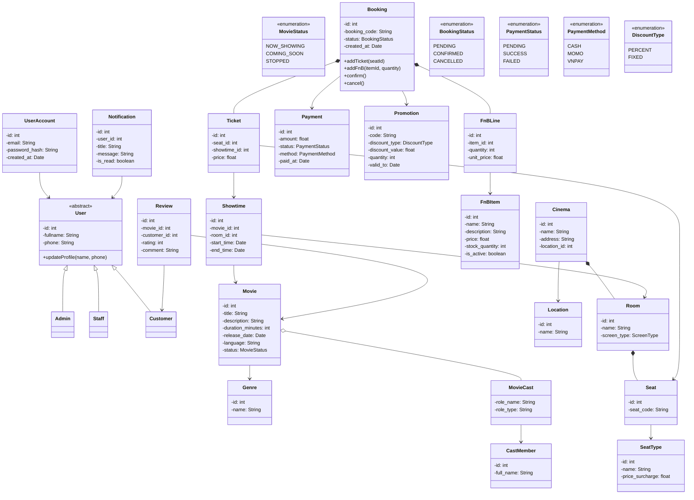

# Class diagram — miền nghiệp vụ (bản gốc)

Sơ đồ lớp tổng quan domain; khớp khái niệm với `database_schema.sql` (chi tiết đối chiếu đã rà soát trong thảo luận trước).

```mermaid
classDiagram
direction TB

%% =======================
%% 1. USER AGGREGATE
%% =======================
class User {
  <<abstract>>
  -id: int
  -fullname: String
  -phone: String
  +updateProfile(name, phone)
}

class Admin
class Staff
class Customer

User <|-- Admin
User <|-- Staff
User <|-- Customer

class UserAccount {
  -id: int
  -email: String
  -password_hash: String
  -created_at: Date
}

UserAccount --> User


%% =======================
%% 2. MOVIE AGGREGATE
%% =======================
class Movie {
  -id: int
  -title: String
  -description: String
  -duration_minutes: int
  -release_date: Date
  -language: String
  -status: MovieStatus
}

class Genre {
  -id: int
  -name: String
}

class CastMember {
  -id: int
  -full_name: String
}

class MovieCast {
  -role_name: String
  -role_type: String
}

Movie --> Genre
Movie o-- MovieCast
MovieCast --> CastMember

class MovieStatus {
  <<enumeration>>
  NOW_SHOWING
  COMING_SOON
  STOPPED
}


%% =======================
%% 3. CINEMA AGGREGATE
%% =======================
class Location {
  -id: int
  -name: String
}

class Cinema {
  -id: int
  -name: String
  -address: String
  -location_id: int
}

class Room {
  -id: int
  -name: String
  -screen_type: ScreenType
}

class Seat {
  -id: int
  -seat_code: String
}

class SeatType {
  -id: int
  -name: String
  -price_surcharge: float
}

Cinema --> Location
Cinema *-- Room
Room *-- Seat
Seat --> SeatType


%% =======================
%% 4. SHOWTIME
%% =======================
class Showtime {
  -id: int
  -movie_id: int
  -room_id: int
  -start_time: Date
  -end_time: Date
}

Showtime --> Movie
Showtime --> Room


%% =======================
%% 5. BOOKING AGGREGATE
%% =======================
class Booking {
  -id: int
  -booking_code: String
  -status: BookingStatus
  -created_at: Date

  +addTicket(seatId)
  +addFnB(itemId, quantity)
  +confirm()
  +cancel()
}

class Ticket {
  -id: int
  -seat_id: int
  -showtime_id: int
  -price: float
}

class FnBLine {
  -id: int
  -item_id: int
  -quantity: int
  -unit_price: float
}

class Payment {
  -id: int
  -amount: float
  -status: PaymentStatus
  -method: PaymentMethod
  -paid_at: Date
}

Booking *-- Ticket
Booking *-- FnBLine
Booking --> Payment

Ticket --> Showtime
Ticket --> Seat
FnBLine --> FnBItem


class BookingStatus {
  <<enumeration>>
  PENDING
  CONFIRMED
  CANCELLED
}

class PaymentStatus {
  <<enumeration>>
  PENDING
  SUCCESS
  FAILED
}

class PaymentMethod {
  <<enumeration>>
  CASH
  MOMO
  VNPAY
}


%% =======================
%% 6. F&B CATALOG
%% =======================
class FnBItem {
  -id: int
  -name: String
  -description: String
  -price: float
  -stock_quantity: int
  -is_active: boolean
}


%% =======================
%% 7. PROMOTION
%% =======================
class Promotion {
  -id: int
  -code: String
  -discount_type: DiscountType
  -discount_value: float
  -quantity: int
  -valid_to: Date
}

Booking --> Promotion

class DiscountType {
  <<enumeration>>
  PERCENT
  FIXED
}


%% =======================
%% 8. REVIEW
%% =======================
class Review {
  -id: int
  -movie_id: int
  -customer_id: int
  -rating: int
  -comment: String
}

Review --> Movie
Review --> Customer


%% =======================
%% 9. NOTIFICATION
%% =======================
class Notification {
  -id: int
  -user_id: int
  -title: String
  -message: String
  -is_read: boolean
}

Notification --> User
```
