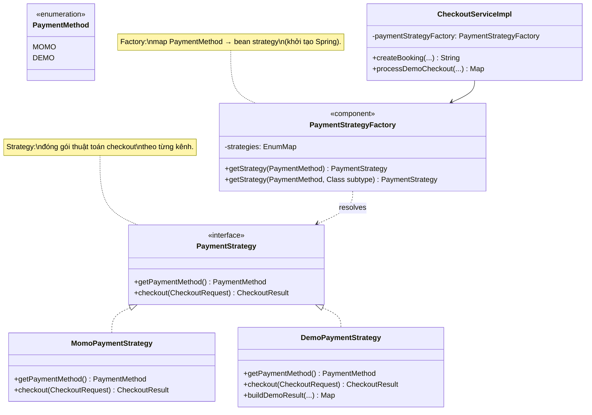
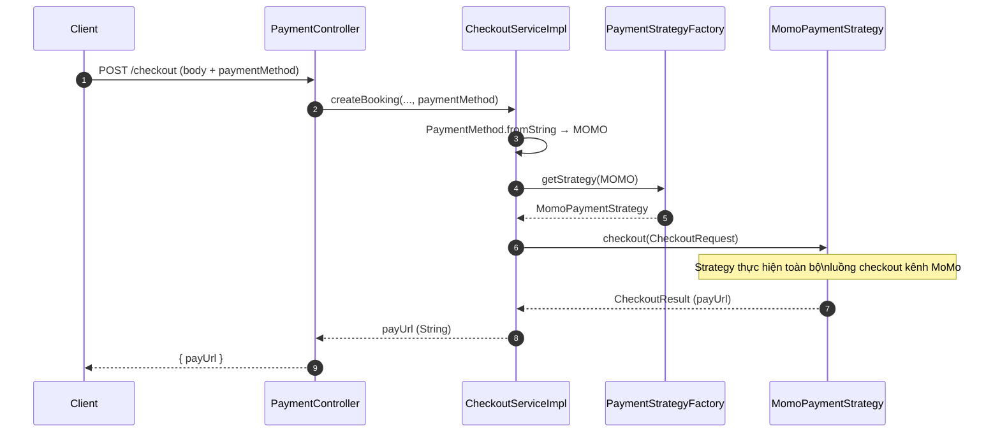
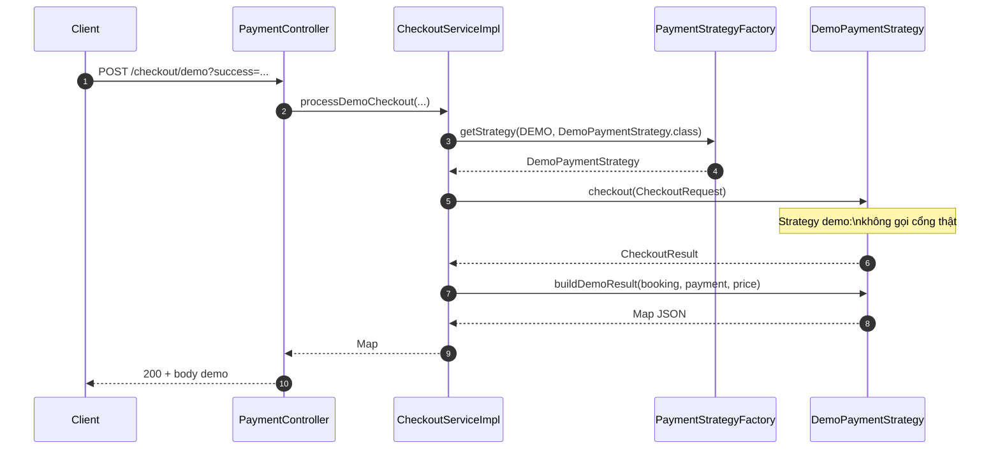

# Luồng checkout / thanh toán — Strategy và Factory

**Áp dụng:** **Strategy** (mỗi kênh thanh toán một lớp triển khai `PaymentStrategy`) + **Factory** (`PaymentStrategyFactory` chọn đúng strategy theo `PaymentMethod`).

---

## 1. Class diagram — Strategy + Factory

---

## 2. Sequence diagram — checkout MoMo (factory chọn strategy, strategy thực hiện checkout)

---

## 3. Sequence diagram — demo checkout (factory + subtype, strategy demo)

