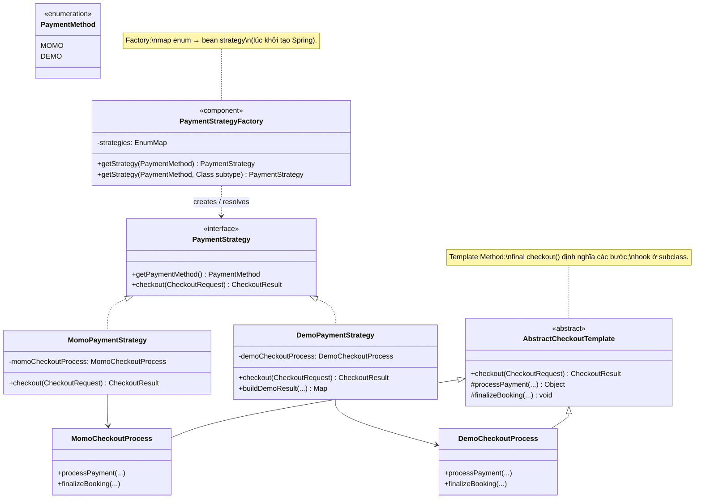
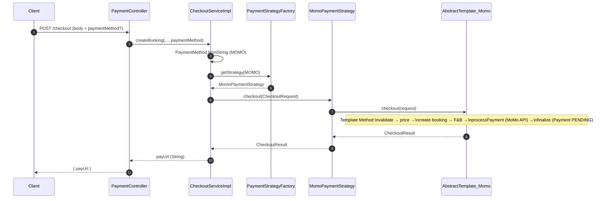

# Luồng checkout / thanh toán — Design patterns

**Áp dụng:** **Template Method** (khung `checkout`) + **Strategy** (mỗi kênh thanh toán) + **Factory Method** (chọn strategy theo `PaymentMethod`).

---

## 1. Class diagram — các lớp pattern (backend)



---

## 2. Sequence diagram — checkout MoMo (tạo booking + payUrl)



---

## 3. Sequence diagram — demo checkout (không gọi cổng thật)

```mermaid
sequenceDiagram
    autonumber
    participant Client
    participant PaymentController
    participant CheckoutServiceImpl
    participant PaymentStrategyFactory
    participant DemoPaymentStrategy
    participant DemoCheckoutProcess as AbstractTemplate_Demo

    Client->>PaymentController: POST /checkout/demo?success=...
    PaymentController->>CheckoutServiceImpl: processDemoCheckout(...)
    CheckoutServiceImpl->>PaymentStrategyFactory: getStrategy(DEMO, DemoPaymentStrategy.class)
    PaymentStrategyFactory-->>CheckoutServiceImpl: DemoPaymentStrategy
    CheckoutServiceImpl->>DemoPaymentStrategy: checkout(CheckoutRequest)
    DemoPaymentStrategy->>DemoCheckoutProcess: checkout(request)
    Note over DemoCheckoutProcess: Cùng skeleton template;\nkhác hook: payment/ticket ngay
    DemoCheckoutProcess-->>DemoPaymentStrategy: CheckoutResult
    DemoPaymentStrategy-->>CheckoutServiceImpl: CheckoutResult
    CheckoutServiceImpl->>DemoPaymentStrategy: buildDemoResult(booking, payment, price)
    DemoPaymentStrategy-->>CheckoutServiceImpl: Map JSON
    CheckoutServiceImpl-->>PaymentController: Map
    PaymentController-->>Client: 200 + body demo
```
