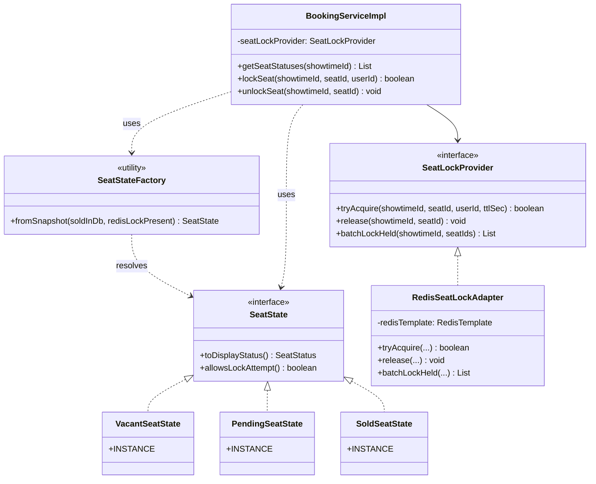
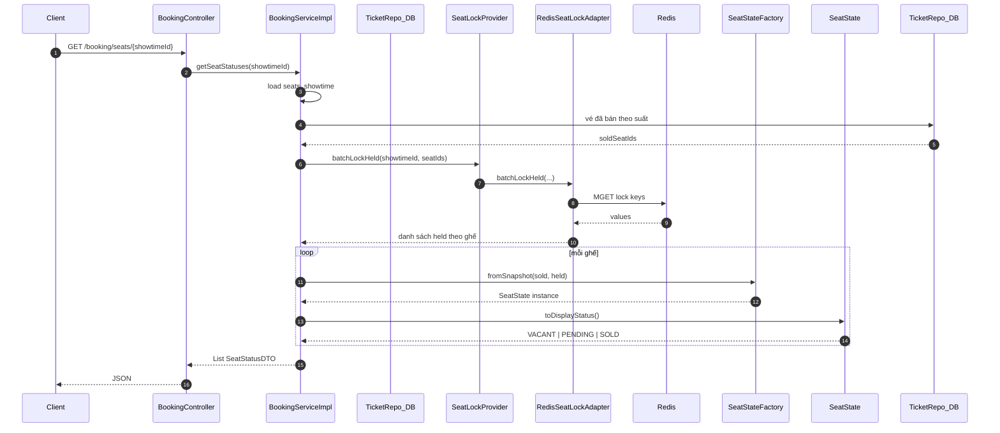
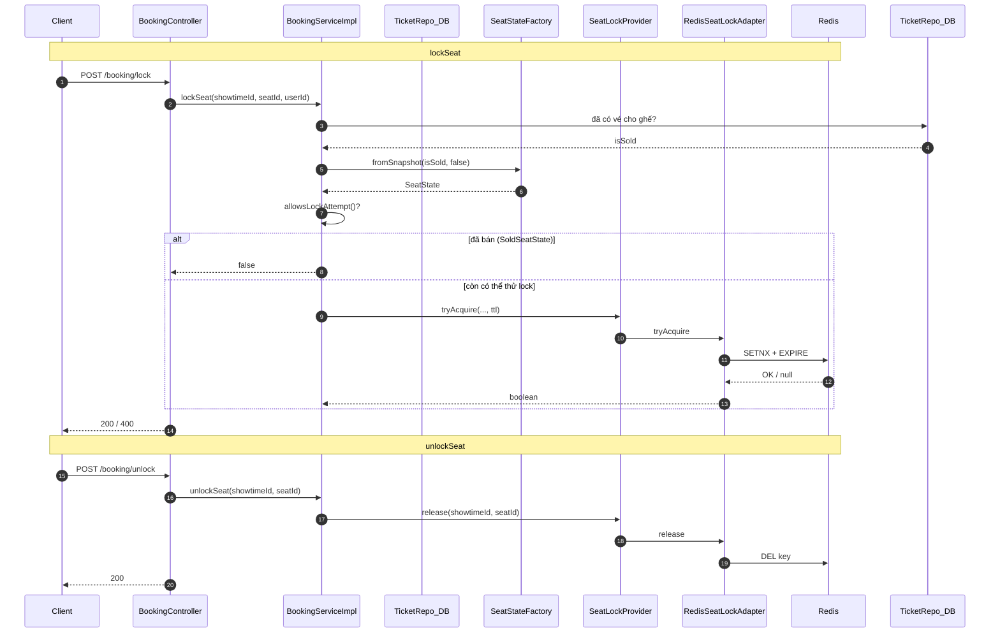

# Luồng ghế — trạng thái & khóa tạm (Redis)

**Áp dụng:** **State** (VACANT / PENDING / SOLD từ snapshot DB + lock) + **Adapter** (`SeatLockProvider` ← `RedisSeatLockAdapter` bọc Redis).

---

## 1. Class diagram — State + Adapter

---

## 2. Sequence diagram — lấy sơ đồ ghế (`getSeatStatuses`)

---

## 3. Sequence diagram — khóa / mở khóa ghế

