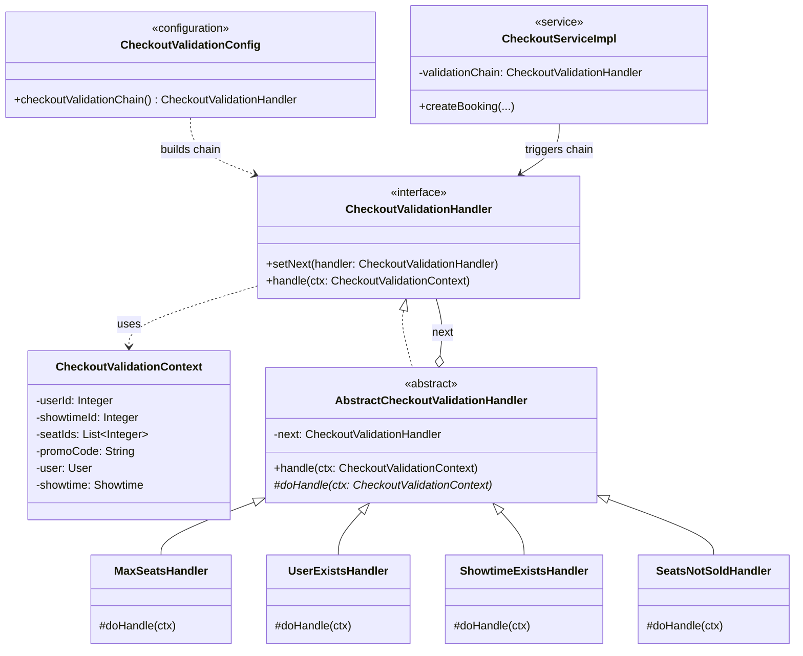

# UML — Chain of Responsibility (Pattern Only)

> Tài liệu chi tiết: [`docs/patterns/01-chain-of-responsibility.md`](../../docs/patterns/01-chain-of-responsibility.md)

```mermaid
classDiagram
  direction TB

  class CheckoutValidationContext {
    -userId: Integer
    -showtimeId: Integer
    -seatIds: List~Integer~
    -promoCode: String
    -user: User
    -showtime: Showtime
  }

  class CheckoutValidationHandler {
    <<interface>>
    +setNext(handler: CheckoutValidationHandler)
    +handle(ctx: CheckoutValidationContext)
  }

  class AbstractCheckoutValidationHandler {
    <<abstract>>
    -next: CheckoutValidationHandler
    +handle(ctx: CheckoutValidationContext)
    #doHandle(ctx: CheckoutValidationContext)*
  }

  class MaxSeatsHandler {
    #doHandle(ctx)
  }

  class UserExistsHandler {
    #doHandle(ctx)
  }

  class ShowtimeExistsHandler {
    #doHandle(ctx)
  }

  class SeatsNotSoldHandler {
    #doHandle(ctx)
  }

  class CheckoutValidationConfig {
    <<configuration>>
    +checkoutValidationChain() CheckoutValidationHandler
  }

  class CheckoutServiceImpl {
    <<service>>
    -validationChain: CheckoutValidationHandler
    +createBooking(...)
  }

  %% Pattern structure
  CheckoutValidationHandler <|.. AbstractCheckoutValidationHandler
  AbstractCheckoutValidationHandler <|-- MaxSeatsHandler
  AbstractCheckoutValidationHandler <|-- UserExistsHandler
  AbstractCheckoutValidationHandler <|-- ShowtimeExistsHandler
  AbstractCheckoutValidationHandler <|-- SeatsNotSoldHandler
  AbstractCheckoutValidationHandler o-- CheckoutValidationHandler : next
  CheckoutValidationConfig ..> CheckoutValidationHandler : builds chain
  CheckoutValidationHandler ..> CheckoutValidationContext : uses
  CheckoutServiceImpl --> CheckoutValidationHandler : triggers chain
```
